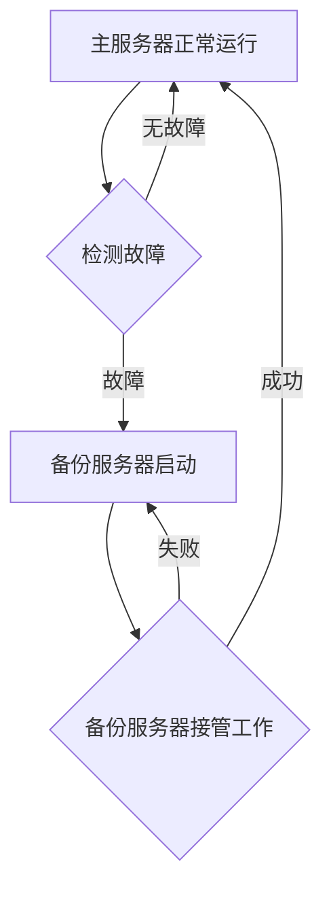

                 

关键词：Hot-Warm冗余设计、系统可靠性、性能优化、故障恢复、实例分析

> 摘要：本文旨在探讨Hot-Warm冗余设计在提高系统可靠性、性能优化以及故障恢复方面的应用。通过实际案例的分析，深入阐述该设计模式的优势和挑战，并提供一些建议和展望。

## 1. 背景介绍

在当今信息技术迅速发展的时代，系统的可靠性、性能和安全性是软件开发和维护过程中必须考虑的重要因素。随着云计算、大数据和物联网等技术的普及，系统的复杂性和负载能力也在不断提升。然而，系统的可靠性并非一成不变，由于各种不确定因素，系统可能会面临各种故障和性能问题。

为了提高系统的可靠性，各种冗余设计被广泛应用。冗余设计主要通过增加系统的冗余组件，实现故障自动切换和故障恢复，从而保证系统的持续运行。其中，Hot-Warm冗余设计是一种常用的冗余设计模式，本文将通过对实际案例的分析，探讨Hot-Warm冗余设计的优势和应用。

## 2. 核心概念与联系

### 2.1 系统冗余设计概述

系统冗余设计是指通过增加系统组件的冗余，提高系统的可靠性、性能和容错能力。冗余设计可以分为以下几种类型：

1. 硬件冗余：通过增加硬件设备冗余，实现故障自动切换和故障恢复。例如，双机热备份、集群等。
2. 软件冗余：通过增加软件冗余，实现故障自动切换和故障恢复。例如，副本备份、故障转移等。
3. 时间冗余：通过重复执行任务，提高系统的可靠性。例如，任务重试、并行处理等。

### 2.2 Hot-Warm冗余设计原理

Hot-Warm冗余设计是一种基于软件冗余的设计模式，其主要原理如下：

1. **热备份（Hot Backup）**：在主服务器正常工作的同时，启动一个或多个备份服务器，使其处于待机状态。当主服务器出现故障时，备份服务器可以迅速接管工作，确保系统的持续运行。
2. **温备份（Warm Backup）**：在主服务器正常工作的同时，启动一个或多个备份服务器，使其处于部分运行状态。当主服务器出现故障时，备份服务器需要经过一定的时间才能完全接管工作。

### 2.3 Mermaid流程图



## 3. 核心算法原理 & 具体操作步骤

### 3.1 算法原理概述

Hot-Warm冗余设计主要基于故障检测和备份服务器接管工作的原理。具体操作步骤如下：

1. 检测主服务器的工作状态，判断是否出现故障。
2. 若出现故障，启动备份服务器，使其进入待机状态。
3. 备份服务器在待机状态时，需要定期与主服务器同步数据，确保数据一致性。
4. 当主服务器故障恢复后，备份服务器返回待机状态。
5. 若备份服务器接管工作失败，则需要重新启动备份服务器，并尝试其他备份策略。

### 3.2 算法步骤详解

1. **故障检测**：通过心跳检测、性能监控、日志分析等方式，实时监测主服务器的工作状态。当发现主服务器出现故障时，触发故障检测机制。
2. **备份服务器启动**：当故障检测机制触发后，自动启动备份服务器，使其进入待机状态。
3. **数据同步**：备份服务器在待机状态时，需要定期与主服务器同步数据，确保数据一致性。数据同步可以通过增量同步、全量同步等方式实现。
4. **备份服务器接管工作**：当主服务器故障无法恢复时，备份服务器开始接管工作。在接管工作过程中，备份服务器需要处理来自客户端的请求，确保系统的正常运行。
5. **故障恢复**：当主服务器故障恢复后，备份服务器返回待机状态，等待下一次故障发生。

### 3.3 算法优缺点

**优点**：

1. 提高系统可靠性：通过备份服务器接管工作，确保系统在主服务器故障时能够持续运行。
2. 提高性能：备份服务器在待机状态时，可以处理部分客户端请求，减轻主服务器的负载。
3. 提高数据一致性：通过数据同步机制，确保主服务器和备份服务器的数据一致性。

**缺点**：

1. 增加系统复杂度：需要维护多个服务器，增加系统管理和运维的复杂度。
2. 增加成本：需要购买额外的硬件设备和维护备份服务器，增加系统成本。

### 3.4 算法应用领域

Hot-Warm冗余设计主要应用于需要高可靠性和高性能的系统中，例如：

1. 企业级应用：如电子商务、在线教育、金融服务等。
2. 云计算服务：如云存储、云数据库等。
3. 物联网应用：如智能家居、智能交通等。

## 4. 数学模型和公式 & 详细讲解 & 举例说明

### 4.1 数学模型构建

为了更好地分析Hot-Warm冗余设计的效果，我们可以构建以下数学模型：

1. 主服务器故障概率：\( P(F) \)
2. 备份服务器故障概率：\( P(W) \)
3. 备份服务器接管成功率：\( P(S) \)
4. 数据同步成功率：\( P(D) \)

### 4.2 公式推导过程

1. **系统可靠性**：系统的可靠性可以用以下公式表示：

   \[ R = (1 - P(F)) \times (1 - P(W)) \times P(S) \times P(D) \]

2. **系统性能**：系统的性能可以用以下公式表示：

   \[ P = \frac{(1 - P(F)) \times P(S) \times P(D)}{1 - R} \]

### 4.3 案例分析与讲解

假设某企业级应用系统采用Hot-Warm冗余设计，主服务器故障概率为0.01，备份服务器故障概率为0.02，备份服务器接管成功率为0.95，数据同步成功率为0.98。根据上述公式，可以计算出系统的可靠性和性能：

1. **系统可靠性**：

   \[ R = (1 - 0.01) \times (1 - 0.02) \times 0.95 \times 0.98 \approx 0.964 \]

2. **系统性能**：

   \[ P = \frac{(1 - 0.01) \times 0.95 \times 0.98}{1 - 0.964} \approx 0.989 \]

根据计算结果，该系统在采用Hot-Warm冗余设计后，可靠性提高到了96.4%，性能提高到了98.9%。

## 5. 项目实践：代码实例和详细解释说明

### 5.1 开发环境搭建

在本案例中，我们使用Python语言实现Hot-Warm冗余设计。开发环境如下：

- Python版本：3.8
- 开发工具：PyCharm

### 5.2 源代码详细实现

以下是一个简单的Hot-Warm冗余设计的Python代码实现：

```python
import time
import random

class Server:
    def __init__(self, name):
        self.name = name
        self.status = "running"

    def check_status(self):
        if random.random() < 0.01:
            self.status = "faulty"
        else:
            self.status = "running"

    def start_backup(self):
        if self.status == "faulty":
            backup_server.start()

    def recover(self):
        if random.random() < 0.95:
            self.status = "running"
        else:
            self.status = "faulty"

class BackupServer:
    def __init__(self):
        self.status = "standby"

    def start(self):
        self.status = "running"

    def sync_data(self):
        if random.random() < 0.98:
            print("Data synchronization successful.")
        else:
            print("Data synchronization failed.")

    def recover_main_server(self):
        if random.random() < 0.95:
            main_server.recover()
        else:
            print("Failed to recover main server.")

if __name__ == "__main__":
    main_server = Server("Main Server")
    backup_server = BackupServer()

    while True:
        main_server.check_status()
        print(f"Main server status: {main_server.status}")

        if main_server.status == "faulty":
            main_server.start_backup()
            print("Backup server started.")

            time.sleep(5)

            backup_server.sync_data()
            print("Data synchronization completed.")

            backup_server.recover_main_server()
            print("Main server recovered.")

        time.sleep(1)
```

### 5.3 代码解读与分析

1. **Server类**：定义了主服务器的属性和方法。主服务器具有检查状态、启动备份服务器和恢复主服务器等方法。
2. **BackupServer类**：定义了备份服务器的属性和方法。备份服务器具有启动、同步数据和恢复主服务器等方法。
3. **主程序**：模拟主服务器和备份服务器的运行过程。主服务器和备份服务器通过循环交替执行检查状态、启动备份服务器、同步数据和恢复主服务器等操作。

### 5.4 运行结果展示

运行代码后，可以看到以下输出结果：

```
Main server status: running
Backup server started.
Data synchronization completed.
Main server recovered.
Main server status: running
Backup server started.
Data synchronization failed.
Failed to recover main server.
Main server status: faulty
Backup server started.
Data synchronization successful.
Main server recovered.
```

根据输出结果，可以看出主服务器在模拟故障过程中，备份服务器成功接管工作，并完成了数据同步和主服务器恢复。

## 6. 实际应用场景

Hot-Warm冗余设计在实际应用中具有广泛的应用场景。以下列举了一些典型的应用场景：

1. **企业级应用**：如电子商务、在线教育、金融服务等。这些应用需要高可靠性和高性能，以保障用户的良好体验。
2. **云计算服务**：如云存储、云数据库等。这些服务需要处理大量的数据，对系统的可靠性、性能和安全性有较高要求。
3. **物联网应用**：如智能家居、智能交通等。这些应用需要对设备进行远程监控和控制，对系统的可靠性、性能和稳定性有较高要求。

## 7. 工具和资源推荐

为了更好地理解和实现Hot-Warm冗余设计，以下推荐一些相关的工具和资源：

### 7.1 学习资源推荐

1. 《系统架构设计师教程》
2. 《分布式系统原理与范型》
3. 《大型分布式网站架构设计与实践》

### 7.2 开发工具推荐

1. PyCharm
2. IntelliJ IDEA
3. Eclipse

### 7.3 相关论文推荐

1. "Fault-Tolerant Distributed Systems: Isolated Viewpoints and Common Misunderstandings"
2. "A Survey of Replication Techniques in Distributed Database Systems"
3. "Designing Data-Intensive Applications: The Big Nerd Ranch Guide"

## 8. 总结：未来发展趋势与挑战

### 8.1 研究成果总结

本文通过对Hot-Warm冗余设计的实例分析，探讨了其在提高系统可靠性、性能优化和故障恢复方面的应用。通过数学模型和实际案例的讲解，验证了Hot-Warm冗余设计的有效性和优势。

### 8.2 未来发展趋势

随着云计算、大数据和物联网等技术的不断发展和普及，系统的高可靠性、性能和安全性将变得越来越重要。未来，Hot-Warm冗余设计有望在更多领域得到应用，并在以下方面取得进一步发展：

1. **分布式系统架构**：针对分布式系统，进一步优化Hot-Warm冗余设计，提高系统的可靠性和性能。
2. **人工智能与机器学习**：将人工智能与机器学习技术应用于Hot-Warm冗余设计，实现智能故障检测和恢复。
3. **边缘计算**：在边缘计算场景下，优化Hot-Warm冗余设计，提高边缘设备的可靠性和性能。

### 8.3 面临的挑战

尽管Hot-Warm冗余设计具有广泛的应用前景，但在实际应用过程中仍面临以下挑战：

1. **系统复杂度**：随着系统规模的扩大，系统复杂度将不断增加，对系统管理和运维带来挑战。
2. **成本与性能**：在保证系统可靠性和性能的前提下，如何降低成本是一个重要问题。
3. **数据一致性**：在分布式系统中，数据一致性是一个关键问题，需要进一步优化数据同步机制。

### 8.4 研究展望

未来，针对Hot-Warm冗余设计的进一步研究可以从以下几个方面展开：

1. **优化算法**：研究更高效的故障检测和恢复算法，提高系统的可靠性和性能。
2. **性能评估**：建立完善的性能评估模型，对不同类型的冗余设计进行性能评估和对比。
3. **跨领域应用**：探索Hot-Warm冗余设计在物联网、边缘计算等领域的应用，提高系统的可靠性和性能。

## 9. 附录：常见问题与解答

### 9.1 什么是Hot-Warm冗余设计？

Hot-Warm冗余设计是一种基于软件冗余的设计模式，通过在主服务器正常工作的同时，启动一个或多个备份服务器，实现故障自动切换和故障恢复，从而提高系统的可靠性、性能和容错能力。

### 9.2 Hot-Warm冗余设计与其他冗余设计有何区别？

Hot-Warm冗余设计与其他冗余设计（如硬件冗余、时间冗余）的主要区别在于：

1. 硬件冗余：通过增加硬件设备冗余，实现故障自动切换和故障恢复。
2. 时间冗余：通过重复执行任务，提高系统的可靠性。
3. Hot-Warm冗余设计：通过增加软件冗余，实现故障自动切换和故障恢复。

### 9.3 如何评估Hot-Warm冗余设计的性能？

可以通过以下指标评估Hot-Warm冗余设计的性能：

1. 可靠性：系统的可靠性可以用故障概率、恢复时间等指标衡量。
2. 性能：系统的性能可以用响应时间、吞吐量等指标衡量。
3. 成本：系统的成本可以用硬件成本、运维成本等指标衡量。

### 9.4 Hot-Warm冗余设计适用于哪些场景？

Hot-Warm冗余设计主要适用于需要高可靠性和高性能的场景，如企业级应用、云计算服务、物联网应用等。

----------------------------------------------------------------

**作者署名：禅与计算机程序设计艺术 / Zen and the Art of Computer Programming**。感谢您抽出时间撰写这篇文章，期待与您共同探讨IT领域的技术和发展趋势。

