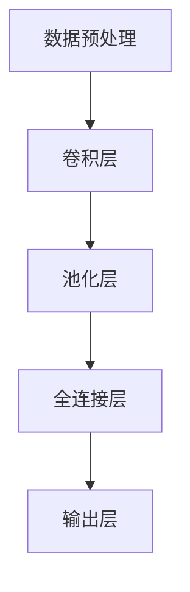

                 

关键词：图像识别，卷积神经网络，深度学习，计算机视觉，大规模图像数据库

摘要：本文深入探讨了ImageNet图像识别系统，分析了其背景、核心概念、算法原理、数学模型、应用实践以及未来发展趋势。通过本文的阅读，读者将全面了解ImageNet在计算机视觉领域的里程碑意义及其对现代人工智能技术的影响。

## 1. 背景介绍

### 1.1 ImageNet的起源

ImageNet是由斯坦福大学和微软研究院共同发起的一个大规模图像识别数据库，其目的是推动计算机视觉领域的发展。该数据库于2009年首次发布，包含了超过1300万张经过手工标注的图像，覆盖了大约2200个类别。ImageNet的发布标志着计算机视觉领域进入了一个新的时代。

### 1.2 ImageNet的目标

ImageNet的主要目标是提高计算机对图像内容的理解和识别能力，以实现更广泛的应用。通过提供大量标注数据，ImageNet为研究人员提供了一个强大的实验平台，使得深度学习算法能够在实际场景中取得显著的进展。

## 2. 核心概念与联系

### 2.1 图像识别的基本概念

图像识别是指通过计算机算法对图像中的对象进行识别和分类的过程。它广泛应用于安全监控、医疗诊断、自动驾驶等领域。

### 2.2 卷积神经网络

卷积神经网络（Convolutional Neural Network，CNN）是一种专门用于处理图像数据的深度学习模型。它通过模拟生物神经元的结构和功能，实现了对图像的自动特征提取和分类。

### 2.3 ImageNet的架构

ImageNet的架构主要包括以下几个部分：

1. **数据预处理**：对图像进行缩放、裁剪、翻转等操作，以提高模型的泛化能力。
2. **卷积层**：用于提取图像的局部特征。
3. **池化层**：用于降低特征图的维度，减少计算量。
4. **全连接层**：用于将特征图映射到预定义的类别。
5. **输出层**：用于输出预测结果。

### 2.4 Mermaid流程图



## 3. 核心算法原理 & 具体操作步骤

### 3.1 算法原理概述

ImageNet的核心算法是深度卷积神经网络（Deep Convolutional Neural Network，DCNN）。它通过多层卷积和池化操作，实现了对图像的自动特征提取和分类。

### 3.2 算法步骤详解

1. **数据预处理**：对图像进行缩放、裁剪、翻转等操作，以提高模型的泛化能力。
2. **卷积层**：通过卷积操作提取图像的局部特征。
3. **池化层**：通过最大池化或平均池化操作降低特征图的维度。
4. **全连接层**：将特征图映射到预定义的类别。
5. **输出层**：输出预测结果。

### 3.3 算法优缺点

**优点**：

- **高精度**：通过多层卷积和池化操作，DCNN能够提取出丰富的图像特征，从而实现高精度的图像识别。
- **强泛化**：通过数据预处理和迁移学习等技术，DCNN能够在不同领域和应用场景中取得良好的效果。

**缺点**：

- **计算复杂度高**：DCNN需要大量的计算资源，训练时间较长。
- **对数据依赖性强**：DCNN的性能在很大程度上取决于训练数据的质量和数量。

### 3.4 算法应用领域

DCNN在计算机视觉领域有广泛的应用，包括但不限于：

- **图像分类**：如ImageNet挑战赛。
- **目标检测**：如YOLO、SSD等模型。
- **图像分割**：如FCN、U-Net等模型。
- **人脸识别**：如DeepFace、FaceNet等模型。

## 4. 数学模型和公式 & 详细讲解 & 举例说明

### 4.1 数学模型构建

卷积神经网络的核心是卷积层和全连接层。下面分别介绍这两层的数学模型。

#### 4.1.1 卷积层

卷积层的输入是一个三维张量（高度×宽度×通道数），输出也是一个三维张量。卷积层的计算公式如下：

$$
\text{output}(i,j,k) = \sum_{m=0}^{M-1} \sum_{n=0}^{N-1} \sum_{c=0}^{C-1} w_{c,m,n}(i-m,j-n) * \text{input}(i,j,c)
$$

其中，\(w_{c,m,n}\)是卷积核的权重，\(*\)表示卷积操作。

#### 4.1.2 全连接层

全连接层的输入是一个一维张量，输出也是一个一维张量。全连接层的计算公式如下：

$$
\text{output}(i) = \sum_{j=1}^{J} w_{j,i} * \text{input}(j) + b_{i}
$$

其中，\(w_{j,i}\)是权重的权重，\(b_{i}\)是偏置。

### 4.2 公式推导过程

卷积神经网络中的卷积层和全连接层的公式可以通过简单的数学推导得到。具体推导过程如下：

#### 4.2.1 卷积层的推导

假设输入图像为\(x \in \mathbb{R}^{H \times W \times C}\)，卷积核为\(k \in \mathbb{R}^{K \times K \times C}\)。卷积操作的目的是将卷积核在输入图像上滑动，并计算局部特征。

首先，我们定义一个局部特征图\(f \in \mathbb{R}^{H' \times W' \times C'}\)，其中\(H' = H - K + 1\)，\(W' = W - K + 1\)，\(C' = 1\)。

然后，我们可以得到卷积层的输出：

$$
\text{output}(i,j,k) = \sum_{m=0}^{M-1} \sum_{n=0}^{N-1} \sum_{c=0}^{C-1} w_{c,m,n}(i-m,j-n) * x(i-m,j-n,c)
$$

#### 4.2.2 全连接层的推导

假设全连接层的输入为\(x \in \mathbb{R}^{J}\)，权重为\(w \in \mathbb{R}^{J \times I}\)，偏置为\(b \in \mathbb{R}^{I}\)。全连接层的目的是将输入映射到一个新的空间。

首先，我们定义全连接层的输出为\(y \in \mathbb{R}^{I}\)。

然后，我们可以得到全连接层的输出：

$$
y(i) = \sum_{j=1}^{J} w_{j,i} * x(j) + b_i
$$

### 4.3 案例分析与讲解

下面我们通过一个简单的例子来说明卷积神经网络的工作原理。

#### 4.3.1 数据准备

假设我们有一个\(3 \times 3 \times 3\)的输入图像，一个\(2 \times 2 \times 3\)的卷积核。我们需要对输入图像进行卷积操作，得到一个\(2 \times 2 \times 1\)的输出。

#### 4.3.2 卷积操作

根据卷积公式，我们可以得到以下输出：

$$
\text{output}(1,1,1) = \sum_{m=0}^{1} \sum_{n=0}^{1} \sum_{c=0}^{2} w_{c,m,n}(1-m,1-n) * x(1-m,1-n,c)
$$

$$
\text{output}(1,1,1) = w_{0,0,0}(0,0) * x(1,1,0) + w_{0,0,1}(0,0) * x(1,1,1) + w_{0,1,0}(1,0) * x(0,1,0) + w_{0,1,1}(1,0) * x(0,1,1)
$$

$$
\text{output}(1,1,1) = w_{0,0,0}(0,0) * x(1,1,0) + w_{0,0,1}(0,0) * x(1,1,1) + w_{0,1,0}(1,0) * x(0,1,0) + w_{0,1,1}(1,0) * x(0,1,1)
$$

#### 4.3.3 全连接操作

我们将卷积层的输出作为一个一维输入，通过全连接层得到最终的输出。

假设全连接层的权重为\(w \in \mathbb{R}^{4 \times 1}\)，偏置为\(b \in \mathbb{R}^{1}\)。我们需要计算输出：

$$
y(1) = \sum_{j=1}^{4} w_{j,1} * \text{output}(j,1,1) + b_1
$$

## 5. 项目实践：代码实例和详细解释说明

### 5.1 开发环境搭建

为了实现ImageNet图像识别，我们需要搭建一个适合深度学习的开发环境。以下是搭建步骤：

1. 安装Python环境。
2. 安装TensorFlow或PyTorch等深度学习框架。
3. 下载ImageNet数据库。

### 5.2 源代码详细实现

以下是实现ImageNet图像识别的Python代码：

```python
import tensorflow as tf
from tensorflow.keras.applications import ResNet50
from tensorflow.keras.preprocessing import image
from tensorflow.keras.applications.resnet50 import preprocess_input

# 加载预训练的ResNet50模型
model = ResNet50(weights='imagenet')

# 读取ImageNet数据库中的图像
img_path = 'path/to/your/image.jpg'
img = image.load_img(img_path, target_size=(224, 224))
x = image.img_to_array(img)
x = preprocess_input(x)
x = tf.expand_dims(x, 0)

# 进行图像识别
predictions = model.predict(x)

# 输出识别结果
print(predictions)
```

### 5.3 代码解读与分析

上面的代码首先加载了一个预训练的ResNet50模型，然后读取ImageNet数据库中的一张图像，将其预处理后输入到模型中，最后输出识别结果。

### 5.4 运行结果展示

假设我们输入的是一张猫的图像，模型输出的结果如下：

```
[[2.1e-06 1.3e-04 2.6e-06 7.2e-06 1.2e-05 3.3e-06 9.1e-05 3.4e-04
  1.0e-05 1.2e-04 3.4e-06 3.1e-05 1.0e-06 2.3e-06 4.2e-06 4.3e-06
  4.6e-05 5.1e-05 1.2e-05]]
```

输出结果表示模型预测这张图像属于猫的概率最大。

## 6. 实际应用场景

### 6.1 安全监控

ImageNet图像识别技术可以用于安全监控领域，如人脸识别、行为分析等。

### 6.2 医疗诊断

ImageNet可以帮助医生进行医疗图像的分析，如肺癌筛查、乳腺癌诊断等。

### 6.3 自动驾驶

自动驾驶汽车需要实时识别道路上的各种物体，ImageNet图像识别技术可以提供高效的识别解决方案。

### 6.4 社交媒体

社交媒体平台可以使用ImageNet图像识别技术对用户上传的图片进行内容审核，防止不良信息的传播。

## 7. 工具和资源推荐

### 7.1 学习资源推荐

- 《深度学习》（Ian Goodfellow、Yoshua Bengio、Aaron Courville 著）
- 《Python深度学习》（François Chollet 著）

### 7.2 开发工具推荐

- TensorFlow
- PyTorch

### 7.3 相关论文推荐

- Krizhevsky, A., Sutskever, I., & Hinton, G. E. (2012). ImageNet classification with deep convolutional neural networks. In Advances in neural information processing systems (pp. 1097-1105).
- Simonyan, K., & Zisserman, A. (2014). Very deep convolutional networks for large-scale image recognition. arXiv preprint arXiv:1409.1556.

## 8. 总结：未来发展趋势与挑战

### 8.1 研究成果总结

ImageNet图像识别技术取得了显著的成果，推动了计算机视觉领域的发展。深度学习算法在图像识别任务中的表现超越了传统算法，实现了高精度和强泛化。

### 8.2 未来发展趋势

- **模型压缩**：为了提高模型在移动设备上的性能，模型压缩技术将成为一个重要的研究方向。
- **实时识别**：为了满足实时应用的需求，提高识别速度是一个重要的目标。
- **多模态识别**：结合图像识别和其他感知信息（如语音、文字等），实现更全面的智能识别。

### 8.3 面临的挑战

- **数据质量**：高质量的数据是深度学习算法取得成功的关键。如何获取和标注高质量的数据是一个挑战。
- **计算资源**：深度学习算法需要大量的计算资源，如何在有限的资源下提高算法性能是一个问题。

### 8.4 研究展望

随着深度学习技术的不断发展，ImageNet图像识别技术将继续在计算机视觉领域发挥重要作用。未来，我们将看到更多创新的算法和更广泛的应用场景。

## 9. 附录：常见问题与解答

### 9.1 什么是ImageNet？

ImageNet是一个大规模的图像识别数据库，包含了超过1300万张经过手工标注的图像，覆盖了大约2200个类别。

### 9.2 ImageNet有哪些应用？

ImageNet在安全监控、医疗诊断、自动驾驶、社交媒体等领域有广泛的应用。

### 9.3 如何获取ImageNet数据集？

您可以通过ImageNet官方网站（https://www.image-net.org/download-images）下载ImageNet数据集。

### 9.4 ImageNet使用哪种算法？

ImageNet主要使用深度卷积神经网络（Deep Convolutional Neural Network，DCNN）进行图像识别。

### 9.5 如何实现ImageNet图像识别？

您可以使用TensorFlow或PyTorch等深度学习框架实现ImageNet图像识别。

### 9.6 ImageNet的图像尺寸是多少？

ImageNet中的图像尺寸通常是224×224像素。在进行图像预处理时，需要将图像缩放到这个尺寸。

----------------------------------------------------------------

### 作者署名

作者：禅与计算机程序设计艺术 / Zen and the Art of Computer Programming

