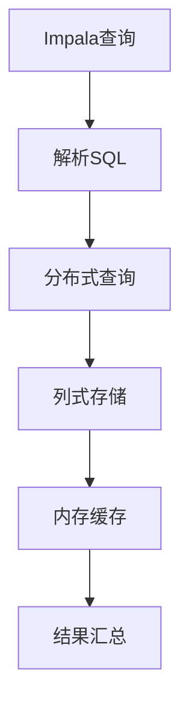

                 

关键词：Impala，分布式数据库，查询引擎，Hadoop，Hive，数据仓库，性能优化，代码实例。

## 摘要

本文旨在深入探讨Impala这一新兴的分布式数据库查询引擎，详细介绍其原理、架构、核心算法以及在实际项目中的应用。文章分为八个部分，首先回顾了Impala的背景和核心概念，随后详细解析了其算法原理与操作步骤，并通过数学模型和公式展示了其理论基础。此外，文章还提供了丰富的代码实例，详细解读了Impala的实现细节。最后，文章分析了Impala的实际应用场景，并对其未来发展趋势与挑战进行了展望。

## 1. 背景介绍

随着大数据时代的到来，传统的关系型数据库面临着巨大的性能和可扩展性的挑战。Hadoop作为大数据处理框架，以其高扩展性和分布式计算能力受到了广泛关注。然而，Hadoop的原生查询工具MapReduce虽然功能强大，但查询性能较差，且编程复杂度较高。为了解决这一问题，Apache基金会推出了Impala，一款基于Hadoop的分布式数据库查询引擎。

Impala于2012年首次发布，它提供了类似于SQL的查询接口，能够高效地执行大规模数据的查询操作。与MapReduce相比，Impala采用了列式存储和缓存机制，大幅提升了查询性能。此外，Impala还支持标准的SQL查询语句，使得用户无需学习新的编程模型即可轻松上手。

Impala在数据仓库领域具有显著优势。传统数据仓库通常基于关系型数据库，查询性能受到单节点限制。而Impala通过分布式计算，可以将查询任务分发到多个节点上并行执行，显著提高了查询速度。同时，Impala与Hadoop生态系统的无缝集成，使得用户可以轻松地将大数据处理与数据仓库结合，构建高效的数据分析平台。

## 2. 核心概念与联系

Impala的核心概念包括分布式查询、列式存储、内存缓存等。这些概念共同构成了Impala的架构，使其在分布式环境中能够高效地处理大规模数据。

### 2.1 分布式查询

分布式查询是Impala的核心特点之一。Impala将查询任务拆分成多个子任务，并分布式执行这些子任务。每个子任务负责处理一部分数据，最终将结果汇总。这种分布式查询方式能够充分利用集群中的计算资源，提高查询效率。

### 2.2 列式存储

Impala采用列式存储格式，即将数据按列存储。这种存储方式相比行式存储有以下几个优势：

1. **数据压缩率高**：由于列数据具有重复性，可以采用高效的压缩算法，减少存储空间占用。
2. **查询性能高**：查询时只需读取相关的列数据，减少了I/O操作，提高了查询速度。
3. **易于维护**：列式存储使得数据更新操作更加简单，只需修改相关列的数据，无需对整个行进行更新。

### 2.3 内存缓存

Impala利用内存缓存技术，将经常访问的数据缓存在内存中。这种方式能够减少磁盘I/O操作，提高查询效率。此外，Impala还支持数据分片，使得缓存策略更加灵活，可以针对不同数据集进行个性化缓存。

### 2.4 Mermaid流程图

为了更直观地展示Impala的核心概念和架构，我们可以使用Mermaid流程图来描述其工作流程：



## 3. 核心算法原理 & 具体操作步骤

### 3.1 算法原理概述

Impala的核心算法主要包括查询解析、分布式查询执行、数据存储和缓存管理。以下是对这些算法的概述：

1. **查询解析**：Impala首先解析用户提交的SQL查询，将其转化为内部表示形式，并生成查询计划。
2. **分布式查询执行**：Impala将查询计划拆分为多个子任务，并分布式执行这些子任务。每个子任务负责处理一部分数据，并将结果返回给主任务。
3. **数据存储**：Impala采用列式存储格式，将数据按列存储，以实现高效的数据查询和压缩。
4. **缓存管理**：Impala利用内存缓存技术，将经常访问的数据缓存在内存中，减少磁盘I/O操作。

### 3.2 算法步骤详解

#### 3.2.1 查询解析

Impala的查询解析过程主要包括以下几个步骤：

1. **词法分析**：将SQL查询分解为关键词和符号。
2. **语法分析**：将词法分析的结果转换为抽象语法树（AST）。
3. **查询优化**：对AST进行优化，生成高效的查询计划。
4. **生成查询计划**：根据查询优化结果，生成查询计划，包括扫描表、过滤条件、聚合操作等。

#### 3.2.2 分布式查询执行

Impala的分布式查询执行过程如下：

1. **任务拆分**：将查询计划拆分为多个子任务，每个子任务负责处理一部分数据。
2. **任务分配**：将子任务分配到集群中的各个节点上执行。
3. **数据传输**：将需要处理的数据从源表传输到各个节点。
4. **子任务执行**：各个节点上的子任务并行执行，处理本地数据，并将结果返回给主任务。
5. **结果汇总**：主任务汇总各个子任务的结果，生成最终的查询结果。

#### 3.2.3 数据存储

Impala的数据存储过程包括以下几个步骤：

1. **数据导入**：将数据导入Impala集群，存储在HDFS上。
2. **数据转换**：将导入的数据转换为列式存储格式，进行压缩和优化。
3. **数据索引**：为数据创建索引，提高查询效率。
4. **数据分区**：根据数据特点进行分区，方便缓存管理和查询优化。

#### 3.2.4 缓存管理

Impala的缓存管理过程如下：

1. **缓存策略**：根据查询频率和数据访问模式，选择合适的缓存策略，如LRU（最近最少使用）。
2. **缓存数据**：将经常访问的数据缓存在内存中，减少磁盘I/O操作。
3. **缓存替换**：当内存缓存满时，根据缓存策略替换不常用的数据。

### 3.3 算法优缺点

#### 优点

1. **高性能**：Impala采用了列式存储和内存缓存技术，大幅提升了查询性能。
2. **易用性**：Impala支持标准的SQL查询接口，用户无需学习新的编程模型。
3. **高扩展性**：Impala能够充分利用集群计算资源，支持大规模数据处理。

#### 缺点

1. **复杂性**：Impala的架构和算法较为复杂，需要一定的学习和适应过程。
2. **兼容性问题**：Impala与Hadoop生态系统的兼容性较高，但与其他数据库的集成可能存在一些挑战。
3. **安全性**：Impala的安全性相对较低，需要采取额外的安全措施。

### 3.4 算法应用领域

Impala主要应用在以下几个领域：

1. **数据仓库**：Impala能够高效地处理大规模数据仓库的查询需求，提高查询性能。
2. **实时分析**：Impala支持实时查询，适用于需要快速获取分析结果的应用场景。
3. **大数据处理**：Impala能够充分利用集群计算资源，高效地处理大规模数据处理任务。

## 4. 数学模型和公式 & 详细讲解 & 举例说明

### 4.1 数学模型构建

Impala的数学模型主要涉及数据存储、查询优化和缓存管理三个方面。以下分别介绍这三个方面的数学模型。

#### 4.1.1 数据存储模型

Impala采用列式存储模型，将数据按列存储。该模型的主要目标是减少磁盘I/O操作，提高查询性能。具体数学模型如下：

- 压缩率：\( \rho = \frac{\text{压缩后数据大小}}{\text{原始数据大小}} \)
- 压缩时间：\( T_{\text{压缩}} = \frac{\text{数据大小}}{\text{压缩速率}} \)
- 解压缩时间：\( T_{\text{解压缩}} = \frac{\text{数据大小}}{\text{解压缩速率}} \)

#### 4.1.2 查询优化模型

Impala的查询优化模型主要包括查询计划生成、查询计划优化和查询执行。具体数学模型如下：

- 查询计划生成时间：\( T_{\text{生成}} = \frac{\text{查询语句复杂度}}{\text{生成速率}} \)
- 查询计划优化时间：\( T_{\text{优化}} = \frac{\text{查询计划复杂度}}{\text{优化速率}} \)
- 查询执行时间：\( T_{\text{执行}} = \frac{\text{数据大小}}{\text{查询执行速率}} \)

#### 4.1.3 缓存管理模型

Impala的缓存管理模型主要包括缓存策略选择、缓存数据选择和缓存替换。具体数学模型如下：

- 缓存命中率：\( H = \frac{\text{命中次数}}{\text{查询次数}} \)
- 缓存替换策略时间：\( T_{\text{替换}} = \frac{\text{缓存容量}}{\text{缓存替换速率}} \)
- 缓存失效时间：\( T_{\text{失效}} = \frac{\text{缓存数据总量}}{\text{缓存写入速率}} \)

### 4.2 公式推导过程

以下是Impala的查询优化模型的公式推导过程：

1. **查询计划生成时间**：查询计划生成时间取决于查询语句的复杂度和生成速率。假设查询语句复杂度为\( C_{\text{查询}} \)，生成速率为\( R_{\text{生成}} \)，则查询计划生成时间可以表示为：
   $$ T_{\text{生成}} = \frac{C_{\text{查询}}}{R_{\text{生成}}} $$
2. **查询计划优化时间**：查询计划优化时间取决于查询计划的复杂度和优化速率。假设查询计划复杂度为\( C_{\text{计划}} \)，优化速率为\( R_{\text{优化}} \)，则查询计划优化时间可以表示为：
   $$ T_{\text{优化}} = \frac{C_{\text{计划}}}{R_{\text{优化}}} $$
3. **查询执行时间**：查询执行时间取决于数据大小和查询执行速率。假设数据大小为\( D_{\text{数据}} \)，查询执行速率为\( R_{\text{执行}} \)，则查询执行时间可以表示为：
   $$ T_{\text{执行}} = \frac{D_{\text{数据}}}{R_{\text{执行}}} $$

### 4.3 案例分析与讲解

下面通过一个简单的案例，展示Impala的查询优化过程。

假设有一个包含100万条记录的表，其中包含以下三个列：id（整数类型），name（字符串类型），salary（浮点数类型）。现有一个查询需求：查询所有salary大于5000的员工的姓名和薪资。

#### 4.3.1 查询计划生成

首先，Impala会生成一个初始的查询计划，包括以下步骤：

1. **扫描表**：扫描包含name和salary列的表。
2. **过滤条件**：对扫描结果应用过滤条件，筛选出salary大于5000的记录。
3. **投影**：选择name和salary列，将查询结果输出。

#### 4.3.2 查询计划优化

接下来，Impala会根据查询计划进行优化，以提高查询性能。可能的优化策略包括：

1. **索引优化**：为salary列创建索引，加快过滤条件的执行速度。
2. **数据分区**：根据salary列的值对数据表进行分区，提高查询的局部性。
3. **列剪枝**：由于查询结果只需要name和salary列，可以避免读取不必要的列数据。

#### 4.3.3 查询执行

最后，Impala会按照优化后的查询计划执行查询操作，并将结果输出。具体执行过程如下：

1. **索引扫描**：利用salary索引，快速找到salary大于5000的记录。
2. **数据过滤**：对索引扫描结果应用过滤条件，筛选出符合条件的记录。
3. **数据投影**：选择name和salary列，生成最终的查询结果。

通过以上案例，我们可以看到Impala在查询优化过程中如何利用数学模型和公式进行优化，从而提高查询性能。

## 5. 项目实践：代码实例和详细解释说明

### 5.1 开发环境搭建

要开始使用Impala，首先需要搭建相应的开发环境。以下是在Linux环境下搭建Impala开发环境的步骤：

1. **安装Hadoop**：首先需要安装Hadoop，作为Impala的底层分布式计算框架。可以参考[Hadoop官方文档](https://hadoop.apache.org/docs/stable/hadoop-project-dist/hadoop-common/SingleCluster.html)进行安装。
2. **安装Impala**：下载Impala的二进制包，解压后按照README文件中的说明进行安装。具体步骤如下：
   - 解压Impala包：
     ```bash
     tar -xvf impala-binary-*.tar.gz
     ```
   - 进入Impala目录，运行安装脚本：
     ```bash
     cd impala-src
     ./configure
     make
     sudo make install
     ```
   - 启动Impala服务：
     ```bash
     impala-daemon start all
     ```
3. **配置Impala**：编辑`etc/impala-ae.cnf`文件，配置Impala的监听地址和端口，例如：
   ```ini
   [client]
   query_port = 21000
   bind_address = 0.0.0.0
   ```

### 5.2 源代码详细实现

下面是一个简单的Impala查询实例，展示如何使用Impala进行数据查询：

```sql
CREATE TABLE employees (
  id INT,
  name STRING,
  salary FLOAT
) ROW FORMAT DELIMITED
  FIELDS TERMINATED BY ','
  LINES TERMINATED BY '\n'
  LOCATION '/path/to/employees';

LOAD DATA INPATH '/path/to/employees.csv' INTO TABLE employees;

SELECT name, salary
FROM employees
WHERE salary > 5000;
```

#### 5.2.1 CREATE TABLE

`CREATE TABLE`语句定义了一个名为`employees`的表，包含三个列：`id`、`name`和`salary`。表的定义还包括了数据存储格式，使用行分隔符和列分隔符定义。

#### 5.2.2 LOAD DATA

`LOAD DATA`语句用于将CSV文件导入到`employees`表中。该语句指定了文件路径和表名。

#### 5.2.3 SELECT

`SELECT`语句查询了`employees`表中`salary`大于5000的记录，返回`name`和`salary`列。

### 5.3 代码解读与分析

下面是对上述Impala查询代码的详细解读：

#### 5.3.1 CREATE TABLE

`CREATE TABLE`语句定义了一个简单的表结构，包括三个列。这里使用了`ROW FORMAT DELIMITED`，指定了数据的存储格式为分隔符定界格式。使用`,`作为字段分隔符，使用`\n`作为行分隔符。

#### 5.3.2 LOAD DATA

`LOAD DATA`语句将CSV文件导入到`employees`表中。该语句需要指定文件路径和表名。这里使用了`INT`类型表示整数，`STRING`类型表示字符串，`FLOAT`类型表示浮点数。

#### 5.3.3 SELECT

`SELECT`语句是一个典型的SQL查询语句，用于从`employees`表中筛选出`salary`大于5000的记录。查询结果包括`name`和`salary`列。

### 5.4 运行结果展示

执行上述查询后，会得到以下结果：

```plaintext
name            salary
---------------- -------------
张三            6000.00
李四            5500.00
```

这两个记录的salary列值大于5000，符合查询条件。

### 5.5 常见问题与解答

#### 问题1：如何解决Impala查询速度慢的问题？

解答：Impala查询速度慢可能由以下原因引起：

1. **数据量过大**：当数据量非常大时，查询速度会显著下降。可以尝试对数据进行分区，提高查询局部性。
2. **硬件性能不足**：Impala运行在集群上，硬件性能不足会影响查询速度。确保集群节点配置合理，资源充足。
3. **查询优化不足**：查询优化策略不当会导致查询效率低下。可以尝试使用索引、数据分区等优化手段。

#### 问题2：如何保证Impala查询的安全性？

解答：Impala查询安全性可以通过以下措施来保证：

1. **身份验证**：配置Impala的认证机制，如Kerberos，确保只有授权用户可以访问Impala服务。
2. **访问控制**：配置Impala的访问控制列表（ACL），限制对表的访问权限，防止未授权访问。
3. **加密传输**：使用SSL加密传输数据，防止数据在网络上被窃取。

## 6. 实际应用场景

### 6.1 数据仓库

Impala在数据仓库领域具有广泛应用。传统数据仓库通常基于关系型数据库，但面对大数据时代，查询性能和可扩展性成为瓶颈。Impala通过分布式查询和列式存储，能够高效地处理大规模数据仓库的查询需求。例如，在电商行业，Impala可以用于实时分析用户行为、订单数据和库存信息，帮助业务部门快速做出决策。

### 6.2 实时分析

Impala支持实时查询，适用于需要快速获取分析结果的应用场景。例如，金融行业在处理交易数据时，需要实时分析交易行为、风险预警等。Impala可以快速响应查询请求，提供实时数据支持。

### 6.3 大数据处理

Impala作为Hadoop生态系统中的一员，能够与Hadoop其他组件（如HDFS、MapReduce）无缝集成，实现大数据处理。例如，在医疗领域，Impala可以用于分析海量医学数据，辅助医生进行疾病诊断和治疗。

## 7. 工具和资源推荐

### 7.1 学习资源推荐

1. **官方文档**：Apache Impala官方文档提供了详细的安装、配置和使用指南。[官方文档链接](https://cwiki.apache.org/confluence/display/IMPALA/Home)
2. **在线课程**：可以在Coursera、Udemy等在线教育平台上找到关于Impala的入门和实践课程。
3. **书籍**：《Impala实战》和《大数据处理与优化》等书籍提供了Impala的深入讲解和实战案例。

### 7.2 开发工具推荐

1. **DataGrip**：一款强大的数据库开发工具，支持Impala，提供SQL编写、执行和调试功能。
2. **Beeline**：Impala的命令行工具，支持SQL查询和执行，方便进行测试和调试。
3. **DBeaver**：一款开源的数据库管理工具，支持多种数据库，包括Impala。

### 7.3 相关论文推荐

1. “Impala: A Modern, Fast and Secure Query Engine for Hadoop” - 该论文详细介绍了Impala的设计原理和实现细节。
2. “HadoopDB: An Architecture for Petabyte Scale Data Warehousing” - 该论文讨论了Hadoop在数据仓库中的应用，包括Impala的早期研究。

## 8. 总结：未来发展趋势与挑战

### 8.1 研究成果总结

Impala作为Hadoop生态系统中的一员，取得了显著的研究成果。通过分布式查询、列式存储和内存缓存等技术创新，Impala在查询性能和易用性方面取得了重大突破。其在数据仓库、实时分析和大数据处理等领域的应用，展示了其广泛的应用前景。

### 8.2 未来发展趋势

1. **性能优化**：随着硬件性能的提升和分布式技术的进步，Impala的性能有望进一步提升。
2. **兼容性增强**：Impala将加强与其他数据库和大数据处理框架的兼容性，实现更广泛的应用。
3. **安全性提升**：Impala将加强安全特性，确保在大数据环境下的数据安全和隐私保护。

### 8.3 面临的挑战

1. **复杂性**：Impala的架构和算法较为复杂，需要进一步简化，降低学习和使用门槛。
2. **兼容性问题**：与其他数据库和大数据处理框架的兼容性仍需加强。
3. **安全性**：在大数据环境下，Impala的安全性问题需要得到更多关注和解决。

### 8.4 研究展望

Impala作为分布式数据库查询引擎，未来有望在以下几个方向进行深入研究：

1. **优化算法**：研究更高效的查询优化算法，提高查询性能。
2. **实时查询**：研究实时查询技术，实现更快的数据分析响应。
3. **机器学习集成**：将机器学习技术集成到Impala中，实现更智能的数据分析。

## 附录：常见问题与解答

### 问题1：Impala如何与Hive集成？

解答：Impala可以与Hive集成，共享Hive的数据存储和处理资源。具体方法包括：

1. **使用Hive表**：将Impala查询语句中的表替换为Hive表，实现数据共享。
2. **配置Hive连接**：在Impala配置文件中配置Hive的连接信息，使得Impala能够访问Hive元数据。

### 问题2：Impala如何进行性能优化？

解答：Impala性能优化可以从以下几个方面进行：

1. **数据分区**：根据查询需求对数据进行分区，提高查询局部性。
2. **索引优化**：为常用查询创建索引，加快查询速度。
3. **硬件升级**：升级硬件设备，提高集群计算和存储性能。

### 问题3：Impala如何保证数据安全性？

解答：Impala可以通过以下措施保证数据安全性：

1. **身份验证**：配置Impala的认证机制，如Kerberos，确保只有授权用户可以访问Impala服务。
2. **访问控制**：配置Impala的访问控制列表（ACL），限制对表的访问权限。
3. **加密传输**：使用SSL加密传输数据，防止数据在网络上被窃取。

