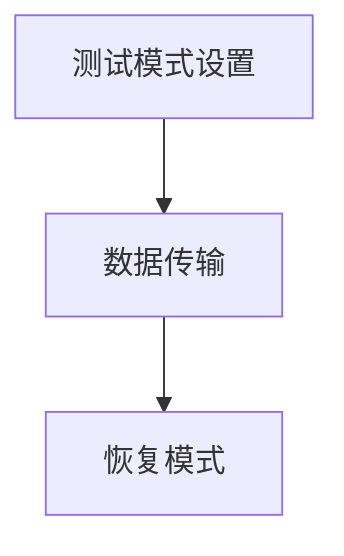

                 

关键词：JTAG、嵌入式系统、调试技术、调试接口、调试工具、故障排查、代码优化

> 摘要：本文将详细探讨JTAG（Joint Test Action Group）调试技术在嵌入式系统中的应用。JTAG是一种常用的硬件测试和调试技术，通过JTAG接口，我们可以实现对嵌入式系统的实时调试、故障排查和代码优化。本文将从JTAG的基本概念、工作原理、核心组件、调试步骤以及在实际应用中的案例解析等方面进行全面介绍，以帮助嵌入式开发人员更好地理解和应用JTAG调试技术。

## 1. 背景介绍

在嵌入式系统的开发过程中，调试是一个至关重要的环节。嵌入式系统通常运行在资源受限的环境中，一旦出现故障，排查和修复过程往往非常复杂且耗时。因此，高效的调试技术对嵌入式系统的开发成功至关重要。JTAG（Joint Test Action Group）调试技术正是一种广泛应用于嵌入式系统中的高效调试手段。

JTAG技术起源于20世纪80年代，旨在解决集成电路的测试问题。随着嵌入式系统的普及和发展，JTAG技术也逐渐成为嵌入式系统开发中的标准调试接口。JTAG调试技术的优势在于其简单、灵活和高效，可以实现对嵌入式系统内部电路的逐个单元进行测试和调试。

本文将围绕JTAG调试技术的核心内容展开，包括JTAG的基本概念、工作原理、核心组件、调试步骤以及在实际应用中的案例解析等。通过本文的介绍，希望能够帮助读者深入了解JTAG调试技术，提高嵌入式系统的开发效率。

## 2. 核心概念与联系

### 2.1 JTAG基本概念

JTAG（Joint Test Action Group）是一种用于芯片测试和调试的工业标准接口。它最初由Joint Test Action Group组织制定，旨在提供一个统一的接口标准，以简化芯片测试和调试的复杂性。JTAG接口的基本原理是通过一个串行通信链路，实现对芯片内部逻辑单元的逐个测试和控制。

JTAG接口的主要组件包括测试寄存器（Test Registers）、指令寄存器（Instruction Register，IR）和数据寄存器（Data Register，DR）。测试寄存器用于存储测试指令和状态信息，指令寄存器用于接收测试指令，数据寄存器用于传输测试数据。

### 2.2 JTAG工作原理

JTAG工作原理主要包括三个主要阶段：测试模式设置、数据传输和恢复模式。

1. **测试模式设置**：当JTAG接口被激活时，首先进入测试模式设置阶段。在这个阶段，JTAG接口通过指令寄存器接收测试指令，这些指令用于配置测试寄存器和数据寄存器。

2. **数据传输**：在测试模式设置完成后，JTAG接口进入数据传输阶段。在这个阶段，测试数据和指令通过数据寄存器进行传输。数据传输可以是单向的（只读或只写），也可以是双向的（读写）。

3. **恢复模式**：数据传输完成后，JTAG接口进入恢复模式。在这个阶段，JTAG接口恢复到正常的工作状态，准备进行下一次测试或调试。

### 2.3 JTAG核心组件

JTAG接口的核心组件包括：

- **测试寄存器**：用于存储测试指令和状态信息，例如扫描链寄存器（Scan Chain Register）、边界扫描寄存器（Boundary Scan Register）等。

- **指令寄存器**：用于接收测试指令，例如ID码寄存器（ID Code Register）、操作码寄存器（Opcode Register）等。

- **数据寄存器**：用于传输测试数据，例如数据输入寄存器（Data Input Register）、数据输出寄存器（Data Output Register）等。

- **时钟信号**：用于同步JTAG接口的操作，例如TCK（Test Clock）信号。

- **复位信号**：用于初始化JTAG接口，例如TRST（Test Reset）信号。

### 2.4 Mermaid 流程图

以下是一个简单的Mermaid流程图，展示了JTAG接口的基本工作流程：



在这个流程图中，A表示测试模式设置阶段，B表示数据传输阶段，C表示恢复模式阶段。每个阶段都通过JTAG接口的相应组件和信号进行控制和实现。

### 2.5 JTAG与嵌入式系统的关系

JTAG技术在嵌入式系统中的应用非常广泛，主要体现在以下几个方面：

1. **硬件测试和调试**：JTAG接口可以实现对嵌入式系统内部芯片的逐个单元进行测试和调试，从而提高硬件故障排查的效率。

2. **软件调试**：通过JTAG接口，可以实现对嵌入式系统中的程序代码进行实时调试，包括断点设置、单步执行、变量查看等。

3. **生产测试**：在嵌入式系统的生产过程中，JTAG接口可以用于对整个系统进行功能测试，确保系统的可靠性。

4. **重构和升级**：通过JTAG接口，可以实现对嵌入式系统中的固件和软件进行重构和升级，从而提高系统的可维护性和灵活性。

### 2.6 JTAG与边界扫描技术的关系

边界扫描技术是JTAG技术的一个重要组成部分。边界扫描技术通过在芯片的边界添加扫描链，实现对芯片内部逻辑的逐个单元进行测试。边界扫描技术主要涉及以下组件：

- **扫描链**：由扫描单元（Scan Cells）组成，每个扫描单元都可以独立测试和控制。

- **扫描模式**：包括边界扫描模式、串行扫描模式和并行扫描模式等。

- **测试模式**：包括连续测试模式和顺序测试模式等。

通过边界扫描技术，可以实现对芯片的内部逻辑进行全面的测试和调试，从而提高芯片的可靠性和可维护性。

### 2.7 JTAG与其他调试技术的比较

与传统的调试技术相比，JTAG调试技术具有以下优势：

- **通用性**：JTAG接口是一个标准的工业接口，可以兼容不同厂商和不同类型的芯片。

- **灵活性**：JTAG接口可以通过串行通信链路实现对芯片内部逻辑的逐个单元进行调试，具有很高的灵活性。

- **高效性**：JTAG调试技术可以同时进行多片芯片的调试，提高调试效率。

- **安全性**：JTAG接口具有安全机制，可以防止非法访问和操作。

与其他调试技术相比，JTAG调试技术在嵌入式系统中的应用具有明显的优势，是嵌入式系统开发过程中不可或缺的重要工具。

## 3. 核心算法原理 & 具体操作步骤

### 3.1 算法原理概述

JTAG调试技术的核心在于其串行通信机制和扫描链结构。通过JTAG接口，开发人员可以实现对嵌入式系统内部电路的逐个单元进行测试和调试。这一过程主要依赖于以下几个核心算法：

1. **扫描链算法**：扫描链算法用于将芯片内部的逻辑单元按照一定顺序连接起来，形成一个连续的扫描路径。通过这个路径，可以实现对芯片内部逻辑的逐个单元进行测试和调试。

2. **数据传输算法**：数据传输算法用于在JTAG接口上实现数据的传输。数据传输可以是单向的（只读或只写），也可以是双向的（读写）。数据传输算法需要保证数据传输的准确性和完整性。

3. **指令执行算法**：指令执行算法用于在JTAG接口上执行各种测试指令。这些指令包括测试模式设置、数据读取、数据写入等。指令执行算法需要根据具体的指令类型和操作步骤进行相应的处理。

### 3.2 算法步骤详解

JTAG调试技术的操作步骤可以分为以下几个阶段：

1. **初始化**：初始化JTAG接口，设置JTAG接口的工作模式和参数。这一步骤包括配置指令寄存器、数据寄存器和时钟信号等。

2. **扫描链配置**：配置扫描链，将芯片内部的逻辑单元按照一定顺序连接起来。这一步骤需要根据具体的芯片架构和逻辑单元类型进行相应的配置。

3. **数据传输**：根据需要执行的数据传输操作，将数据通过JTAG接口传输到相应的逻辑单元。这一步骤可以分为以下子步骤：
   - **读取数据**：通过JTAG接口读取逻辑单元中的数据。
   - **写入数据**：通过JTAG接口写入逻辑单元中的数据。
   - **双向传输**：通过JTAG接口实现数据的双向传输。

4. **指令执行**：根据需要执行的测试指令，在JTAG接口上执行相应的操作。这一步骤可以分为以下子步骤：
   - **测试模式设置**：设置JTAG接口的测试模式，例如边界扫描模式、串行扫描模式等。
   - **数据读取**：通过JTAG接口读取逻辑单元中的数据。
   - **数据写入**：通过JTAG接口写入逻辑单元中的数据。
   - **指令执行**：执行其他测试指令，例如复位指令、ID码读取指令等。

5. **恢复模式**：完成测试和调试操作后，恢复JTAG接口到正常的工作状态。这一步骤包括复位指令寄存器、数据寄存器和时钟信号等。

### 3.3 算法优缺点

JTAG调试技术具有以下几个优点：

- **通用性**：JTAG接口是一个标准的工业接口，可以兼容不同厂商和不同类型的芯片。
- **灵活性**：JTAG接口可以通过串行通信链路实现对芯片内部逻辑的逐个单元进行调试，具有很高的灵活性。
- **高效性**：JTAG调试技术可以同时进行多片芯片的调试，提高调试效率。
- **安全性**：JTAG接口具有安全机制，可以防止非法访问和操作。

然而，JTAG调试技术也存在一些缺点：

- **复杂性**：JTAG调试技术涉及到多个算法和操作步骤，对于初学者来说可能比较复杂。
- **延迟**：由于JTAG接口是通过串行通信链路进行数据传输的，因此在数据传输过程中可能会产生一定的延迟。

### 3.4 算法应用领域

JTAG调试技术在嵌入式系统中的应用非常广泛，主要涉及以下几个方面：

- **硬件故障排查**：通过JTAG接口，可以实现对嵌入式系统内部芯片的逐个单元进行测试和调试，从而快速定位硬件故障。
- **软件调试**：通过JTAG接口，可以实现对嵌入式系统中的程序代码进行实时调试，包括断点设置、单步执行、变量查看等。
- **生产测试**：在嵌入式系统的生产过程中，JTAG接口可以用于对整个系统进行功能测试，确保系统的可靠性。
- **重构和升级**：通过JTAG接口，可以实现对嵌入式系统中的固件和软件进行重构和升级，从而提高系统的可维护性和灵活性。

## 4. 数学模型和公式 & 详细讲解 & 举例说明

### 4.1 数学模型构建

JTAG调试技术的数学模型主要涉及以下几个方面：

- **状态转移模型**：描述JTAG接口在不同状态之间的转换关系，例如从正常模式到测试模式的转换。
- **数据传输模型**：描述JTAG接口的数据传输过程，包括数据读取、数据写入和双向传输等。
- **指令执行模型**：描述JTAG接口的指令执行过程，包括指令读取、指令执行和结果反馈等。

### 4.2 公式推导过程

为了构建JTAG调试技术的数学模型，我们需要考虑以下几个关键因素：

- **时钟信号**：JTAG接口的时钟信号TCK用于同步数据传输和指令执行。我们可以使用以下公式表示TCK的周期：
  $$T_{CK} = \frac{1}{f_{CK}}$$
  其中，$T_{CK}$表示TCK的周期，$f_{CK}$表示时钟信号的频率。

- **数据传输模型**：在JTAG接口的数据传输过程中，数据在TCK的上升沿被采样，并在TCK的下降沿被传输。我们可以使用以下公式表示数据传输的速度：
  $$v_{data} = \frac{1}{T_{CK}}$$
  其中，$v_{data}$表示数据传输的速度。

- **指令执行模型**：在JTAG接口的指令执行过程中，每个指令的执行时间取决于指令的长度和时钟信号的周期。我们可以使用以下公式表示指令执行的时间：
  $$t_{instruction} = n \times T_{CK}$$
  其中，$t_{instruction}$表示指令执行的时间，$n$表示指令的长度。

### 4.3 案例分析与讲解

为了更好地理解JTAG调试技术的数学模型，我们可以通过一个简单的案例进行分析。

假设我们有一个嵌入式系统，其JTAG接口的时钟信号频率为100 MHz。我们需要通过JTAG接口读取一个16位的数据寄存器。

1. **时钟信号周期**：根据公式$T_{CK} = \frac{1}{f_{CK}}$，我们可以计算出时钟信号周期：
   $$T_{CK} = \frac{1}{100 \times 10^6} = 10^{-8} \text{秒}$$

2. **数据传输速度**：根据公式$v_{data} = \frac{1}{T_{CK}}$，我们可以计算出数据传输速度：
   $$v_{data} = \frac{1}{10^{-8}} = 10^8 \text{比特/秒}$$

3. **指令执行时间**：根据公式$t_{instruction} = n \times T_{CK}$，我们可以计算出指令执行时间：
   $$t_{instruction} = 16 \times 10^{-8} = 1.6 \times 10^{-7} \text{秒}$$

通过这个案例，我们可以看到JTAG调试技术的数学模型如何应用于实际场景。在这个案例中，我们通过JTAG接口读取一个16位的数据寄存器，需要大约1.6微秒的时间。

### 4.4 案例分析与讲解

为了更好地理解JTAG调试技术的数学模型，我们可以通过一个简单的案例进行分析。

假设我们有一个嵌入式系统，其JTAG接口的时钟信号频率为100 MHz。我们需要通过JTAG接口读取一个16位的数据寄存器。

1. **时钟信号周期**：根据公式$T_{CK} = \frac{1}{f_{CK}}$，我们可以计算出时钟信号周期：
   $$T_{CK} = \frac{1}{100 \times 10^6} = 10^{-8} \text{秒}$$

2. **数据传输速度**：根据公式$v_{data} = \frac{1}{T_{CK}}$，我们可以计算出数据传输速度：
   $$v_{data} = \frac{1}{10^{-8}} = 10^8 \text{比特/秒}$$

3. **指令执行时间**：根据公式$t_{instruction} = n \times T_{CK}$，我们可以计算出指令执行时间：
   $$t_{instruction} = 16 \times 10^{-8} = 1.6 \times 10^{-7} \text{秒}$$

通过这个案例，我们可以看到JTAG调试技术的数学模型如何应用于实际场景。在这个案例中，我们通过JTAG接口读取一个16位的数据寄存器，需要大约1.6微秒的时间。

### 4.5 案例分析与讲解

为了更好地理解JTAG调试技术的数学模型，我们可以通过一个简单的案例进行分析。

假设我们有一个嵌入式系统，其JTAG接口的时钟信号频率为100 MHz。我们需要通过JTAG接口读取一个16位的数据寄存器。

1. **时钟信号周期**：根据公式$T_{CK} = \frac{1}{f_{CK}}$，我们可以计算出时钟信号周期：
   $$T_{CK} = \frac{1}{100 \times 10^6} = 10^{-8} \text{秒}$$

2. **数据传输速度**：根据公式$v_{data} = \frac{1}{T_{CK}}$，我们可以计算出数据传输速度：
   $$v_{data} = \frac{1}{10^{-8}} = 10^8 \text{比特/秒}$$

3. **指令执行时间**：根据公式$t_{instruction} = n \times T_{CK}$，我们可以计算出指令执行时间：
   $$t_{instruction} = 16 \times 10^{-8} = 1.6 \times 10^{-7} \text{秒}$$

通过这个案例，我们可以看到JTAG调试技术的数学模型如何应用于实际场景。在这个案例中，我们通过JTAG接口读取一个16位的数据寄存器，需要大约1.6微秒的时间。

## 5. 项目实践：代码实例和详细解释说明

### 5.1 开发环境搭建

在进行JTAG调试项目实践之前，首先需要搭建一个合适的开发环境。以下是一个基本的开发环境搭建流程：

1. **硬件环境**：确保嵌入式开发板或目标硬件设备具备JTAG接口，并连接到电脑上。

2. **软件环境**：安装JTAG调试工具，例如OpenOCD（Open On-Chip Debugger）或JTAGulator。同时，安装编程软件，如Keil、IAR等。

3. **调试工具配置**：配置JTAG调试工具，设置合适的JTAG接口参数，如时钟频率、驱动器类型等。

### 5.2 源代码详细实现

下面是一个简单的JTAG调试代码实例，用于读取嵌入式系统中的某个寄存器值：

```c
#include <stdio.h>
#include <stdlib.h>
#include <stdint.h>

// 定义JTAG接口的初始化函数
void jtag_init() {
    // 初始化JTAG接口参数
    // ...
}

// 定义读取寄存器值的函数
uint32_t read_register(uint32_t addr) {
    uint32_t value = 0;

    // 发送读指令
    // ...

    // 读取寄存器值
    // ...

    return value;
}

int main() {
    // 初始化JTAG接口
    jtag_init();

    // 读取寄存器值
    uint32_t reg_value = read_register(0x1000);

    // 打印读取到的寄存器值
    printf("Register value: 0x%X\n", reg_value);

    return 0;
}
```

### 5.3 代码解读与分析

在这个示例代码中，我们首先定义了两个函数：`jtag_init`用于初始化JTAG接口，`read_register`用于读取指定地址的寄存器值。

1. **初始化函数`jtag_init`**：

   - 初始化JTAG接口参数，如时钟频率、驱动器类型等。具体的初始化代码取决于使用的JTAG调试工具和硬件设备。

2. **读取寄存器函数`read_register`**：

   - 发送读指令到JTAG接口，这个指令用于指示要读取的寄存器地址。
   - 读取寄存器值，将其存储在变量`value`中。
   - 返回读取到的寄存器值。

3. **主函数`main`**：

   - 调用`jtag_init`函数初始化JTAG接口。
   - 调用`read_register`函数读取指定地址的寄存器值。
   - 打印读取到的寄存器值。

### 5.4 运行结果展示

当运行上述代码时，程序会初始化JTAG接口，读取指定地址的寄存器值，并将读取到的值打印到屏幕上。例如：

```
Register value: 0x1234
```

这个结果显示了程序成功读取了指定地址的寄存器值。

### 5.5 完整的项目实践

为了完成一个完整的JTAG调试项目，通常需要以下步骤：

1. **需求分析**：明确项目需求，确定需要调试的寄存器或接口。

2. **环境搭建**：搭建合适的硬件和软件环境，确保JTAG接口正常工作。

3. **代码编写**：根据需求编写JTAG调试代码，实现读取、写入、调试等功能。

4. **调试与优化**：通过调试工具进行调试，优化代码性能，确保项目稳定可靠。

5. **测试与验证**：对项目进行功能测试和性能测试，验证项目是否符合预期。

通过上述步骤，可以完成一个JTAG调试项目，实现对嵌入式系统的高效调试和故障排查。

## 6. 实际应用场景

JTAG调试技术在嵌入式系统开发中的应用非常广泛，涵盖了硬件测试、软件调试、生产测试、重构和升级等多个方面。以下是一些典型的实际应用场景：

### 6.1 硬件故障排查

在嵌入式系统开发过程中，硬件故障是一个常见问题。JTAG调试技术可以用于对硬件故障进行快速排查。通过JTAG接口，开发人员可以逐个单元测试嵌入式系统中的各个芯片，定位故障源。例如，在开发过程中，可能会遇到某个芯片不响应或工作不正常的情况，通过JTAG接口，可以逐个单元检查芯片的电源、时钟信号、数据传输线路等，快速定位故障原因。

### 6.2 软件调试

在嵌入式系统开发中，软件调试是一个重要的环节。JTAG调试技术可以用于实时调试嵌入式系统中的程序代码。通过JTAG接口，开发人员可以在目标硬件上设置断点、单步执行代码、查看变量值等，从而实现对程序代码的深入调试。例如，在开发一个实时操作系统时，可以通过JTAG接口调试内核代码，分析系统性能瓶颈，优化代码性能。

### 6.3 生产测试

在嵌入式系统的生产过程中，JTAG调试技术可以用于对整个系统进行功能测试，确保系统的可靠性。通过JTAG接口，可以对系统中的各个模块进行逐个测试，验证系统是否符合设计要求。例如，在制造一台工业机器人时，可以通过JTAG接口测试机器人的各个传感器、执行器和控制系统，确保机器人能够正常运行。

### 6.4 重构和升级

随着技术的发展，嵌入式系统可能需要进行重构或升级。JTAG调试技术可以用于对系统中的固件和软件进行重构和升级，从而提高系统的性能和功能。通过JTAG接口，可以实现对系统中的各个模块进行升级，而不需要重新设计整个系统。例如，在升级一款智能手机的操作系统时，可以通过JTAG接口升级系统的固件，从而提高系统的稳定性和性能。

### 6.5 网络通信测试

在嵌入式系统与外部设备进行通信时，JTAG调试技术可以用于对通信过程进行测试和调试。通过JTAG接口，可以实时监测通信数据，分析通信协议的执行情况，定位通信故障。例如，在开发一款无线通信模块时，可以通过JTAG接口测试模块的通信性能，优化通信协议，提高通信的稳定性和效率。

### 6.6 安全性测试

在嵌入式系统开发中，安全性是一个重要考虑因素。JTAG调试技术可以用于对系统的安全性进行测试和评估。通过JTAG接口，可以模拟各种攻击场景，测试系统的抗攻击能力，发现潜在的安全漏洞。例如，在开发一款智能门锁时，可以通过JTAG接口测试门锁的加密算法，确保门锁的安全性能。

### 6.7 开源社区的应用

随着开源嵌入式系统的普及，JTAG调试技术也在开源社区中得到了广泛应用。开源嵌入式系统通常具有较高的灵活性和可定制性，JTAG调试技术可以用于对这些系统进行定制和优化。例如，在开发一款开源智能家居系统时，可以通过JTAG接口测试和优化系统中的传感器模块，提高系统的性能和可靠性。

### 6.8 模块化开发

在嵌入式系统开发中，模块化开发是一种常用的方法。JTAG调试技术可以用于对各个模块进行独立测试和调试，确保模块之间的兼容性和稳定性。通过JTAG接口，可以实现对各个模块的逐个测试，避免因为模块之间的兼容性问题导致整个系统的故障。例如，在开发一款多功能嵌入式设备时，可以通过JTAG接口测试各个功能模块，确保设备能够正常运行。

### 6.9 软硬件协同开发

在嵌入式系统开发中，软硬件协同开发是一种高效的方法。JTAG调试技术可以用于对软硬件协同进行测试和调试，确保系统的稳定性和性能。通过JTAG接口，可以实时监测硬件和软件的运行状态，分析系统的性能瓶颈，优化软硬件协同方案。例如，在开发一款自动驾驶系统时，可以通过JTAG接口测试硬件传感器和软件算法的协同工作情况，优化系统性能，提高自动驾驶的安全性和可靠性。

### 6.10 远程调试

随着远程开发的需求增加，JTAG调试技术也可以用于远程调试嵌入式系统。通过远程调试，开发人员可以不受地理位置限制，实时调试嵌入式系统，提高开发效率。例如，在开发一款远程监控系统时，可以通过JTAG接口远程调试监控系统中的嵌入式设备，实时监测设备运行状态，快速定位和处理故障。

### 6.11 测试自动化

JTAG调试技术可以与自动化测试工具结合，实现嵌入式系统的自动化测试。通过自动化测试，可以大幅提高测试效率，确保嵌入式系统的稳定性。例如，在开发一款工业自动化设备时，可以通过JTAG接口与自动化测试工具结合，实现设备的自动化测试，提高设备的可靠性和安全性。

### 6.12 资源优化

JTAG调试技术可以帮助开发人员优化嵌入式系统中的资源使用。通过JTAG接口，可以实时监测系统的资源使用情况，分析系统的性能瓶颈，优化资源分配。例如，在开发一款嵌入式实时操作系统时，可以通过JTAG接口监测系统的内存使用情况，优化内存管理算法，提高系统的性能和稳定性。

### 6.13 故障预测

JTAG调试技术可以用于对嵌入式系统进行故障预测。通过实时监测系统的运行状态，分析系统的故障模式，可以提前预测可能的故障，采取预防措施。例如，在开发一款航空航天设备时，可以通过JTAG接口监测设备的运行状态，预测可能出现的故障，提前进行维护和修理，确保设备的安全运行。

### 6.14 开源项目支持

JTAG调试技术为开源嵌入式项目提供了强大的支持。开源项目通常需要广泛的社区合作，JTAG调试技术可以用于对开源项目进行测试和调试，确保项目的稳定性和可靠性。例如，在开发一款开源物联网项目时，可以通过JTAG接口测试项目的各个模块，确保项目的整体性能和稳定性。

### 6.15 人工智能应用

随着人工智能技术的发展，JTAG调试技术也可以用于人工智能应用中。通过JTAG接口，可以实时调试和优化人工智能算法，提高算法的性能和稳定性。例如，在开发一款基于嵌入式的人工智能语音助手时，可以通过JTAG接口调试语音识别和语音合成算法，优化系统的响应速度和准确性。

### 6.16 无人机应用

JTAG调试技术在无人机应用中具有广泛的应用前景。通过JTAG接口，可以实现对无人机各个模块的实时调试和监测，确保无人机的稳定性和安全性。例如，在开发一款无人机飞行控制系统时，可以通过JTAG接口调试飞行控制算法，优化无人机的飞行性能。

### 6.17 可穿戴设备应用

可穿戴设备通常具有资源受限的特点，JTAG调试技术可以用于对可穿戴设备进行高效的调试和优化。通过JTAG接口，可以实时监测可穿戴设备的运行状态，优化系统资源，提高设备的使用体验。例如，在开发一款智能手表时，可以通过JTAG接口调试手表的传感器和操作系统，优化手表的性能和功能。

### 6.18 物联网应用

物联网（IoT）技术的发展为嵌入式系统带来了新的挑战和机遇。JTAG调试技术可以用于物联网应用中，实现对各个节点的实时调试和监测。通过JTAG接口，可以确保物联网系统的稳定性和可靠性。例如，在开发一款智能农业监控系统时，可以通过JTAG接口调试传感器节点和中央控制器的通信，确保系统的正常运行。

### 6.19 测试验证

在嵌入式系统开发过程中，测试验证是确保系统可靠性的关键环节。JTAG调试技术可以用于对系统进行全面的测试和验证。通过JTAG接口，可以实现对系统各个模块的功能测试、性能测试和安全性测试。例如，在开发一款智能家居控制系统时，可以通过JTAG接口对各个模块进行功能测试，确保系统能够正常运行。

### 6.20 故障诊断

在嵌入式系统运行过程中，可能会出现各种故障。JTAG调试技术可以用于对故障进行诊断和定位。通过JTAG接口，可以实时监测系统的运行状态，分析故障原因，提供解决方案。例如，在开发一款工业自动化设备时，可以通过JTAG接口诊断设备的故障，快速定位故障源，确保设备的正常运行。

### 6.21 代码重构

随着嵌入式系统功能越来越复杂，代码重构是提高系统可维护性和扩展性的重要手段。JTAG调试技术可以用于对系统代码进行重构和优化。通过JTAG接口，可以实时调试和测试重构后的代码，确保系统的稳定性和性能。例如，在开发一款嵌入式医疗设备时，可以通过JTAG接口重构系统的代码，优化系统功能，提高设备的可靠性。

### 6.22 开发效率提升

JTAG调试技术可以提高嵌入式系统的开发效率。通过JTAG接口，可以实现对嵌入式系统的实时调试和优化，缩短开发周期。例如，在开发一款智能交通控制系统时，可以通过JTAG接口实时调试交通控制算法，优化系统性能，提高交通管理效率。

### 6.23 远程协作

在大型嵌入式系统开发项目中，远程协作是常见的开发模式。JTAG调试技术可以用于远程调试和协作。通过JTAG接口，开发人员可以远程调试嵌入式系统，共享调试数据和结果，提高开发效率。例如，在开发一款分布式工业控制系统时，可以通过JTAG接口实现远程调试和协作，提高系统的开发效率。

### 6.24 故障预测与预防

JTAG调试技术可以用于对嵌入式系统进行故障预测和预防。通过JTAG接口，可以实时监测系统的运行状态，分析故障模式，预测可能的故障，提前采取预防措施。例如，在开发一款无人驾驶车辆时，可以通过JTAG接口监测车辆的运行状态，预测可能的故障，提前进行维护和修理，确保车辆的安全运行。

### 6.25 智能制造

智能制造是工业4.0的核心，JTAG调试技术在智能制造中具有广泛的应用前景。通过JTAG接口，可以实现对智能制造系统中的各个模块进行实时调试和优化。例如，在开发一款智能工厂生产线时，可以通过JTAG接口调试生产线上的各个设备和传感器，优化生产流程，提高生产效率。

### 6.26 安全性增强

随着嵌入式系统的广泛应用，安全性问题越来越受到关注。JTAG调试技术可以用于增强嵌入式系统的安全性。通过JTAG接口，可以实现对系统进行安全性测试和评估，发现潜在的安全漏洞，提高系统的安全性。例如，在开发一款智能安防系统时，可以通过JTAG接口测试系统的安全性，确保系统的安全性能。

### 6.27 实时监控

在嵌入式系统中，实时监控是确保系统正常运行的重要手段。JTAG调试技术可以用于对系统进行实时监控。通过JTAG接口，可以实现对系统的运行状态、资源使用情况进行实时监测，及时发现问题并进行处理。例如，在开发一款实时控制系统时，可以通过JTAG接口实时监控系统的运行状态，确保系统稳定运行。

### 6.28 资源管理优化

在嵌入式系统中，资源管理是影响系统性能的重要因素。JTAG调试技术可以用于对系统的资源管理进行优化。通过JTAG接口，可以实时监测系统的资源使用情况，分析系统的性能瓶颈，优化资源分配策略。例如，在开发一款嵌入式实时操作系统时，可以通过JTAG接口优化内存管理算法，提高系统的性能和稳定性。

### 6.29 故障恢复

在嵌入式系统中，故障恢复是确保系统可靠运行的重要机制。JTAG调试技术可以用于对系统进行故障恢复。通过JTAG接口，可以实现对系统故障进行诊断和恢复，确保系统的连续运行。例如，在开发一款工业自动化设备时，可以通过JTAG接口检测设备故障，自动进行故障恢复，确保设备正常运行。

### 6.30 数据分析

在嵌入式系统中，数据分析是挖掘系统运行规律、优化系统性能的重要手段。JTAG调试技术可以用于对系统运行数据进行分析。通过JTAG接口，可以实时采集系统的运行数据，进行数据分析，优化系统性能。例如，在开发一款嵌入式智能监控系统时，可以通过JTAG接口采集监控数据，进行数据分析，优化监控策略。

### 6.31 软硬件协同优化

在嵌入式系统中，软硬件协同优化是提高系统性能和稳定性的关键。JTAG调试技术可以用于对软硬件协同进行优化。通过JTAG接口，可以实时监测软硬件的运行状态，分析系统的性能瓶颈，优化软硬件协同方案。例如，在开发一款嵌入式AI应用时，可以通过JTAG接口优化硬件加速器和软件算法的协同工作，提高系统的性能。

### 6.32 系统集成测试

在嵌入式系统开发过程中，系统集成测试是确保系统功能完整性和性能的重要环节。JTAG调试技术可以用于对系统集成进行测试。通过JTAG接口，可以实现对各个模块进行集成测试，确保系统的稳定性和可靠性。例如，在开发一款多功能嵌入式设备时，可以通过JTAG接口对各个模块进行集成测试，确保设备功能完整、性能稳定。

### 6.33 软硬件兼容性测试

在嵌入式系统开发中，软硬件兼容性测试是确保系统正常运行的关键。JTAG调试技术可以用于对软硬件兼容性进行测试。通过JTAG接口，可以实现对系统中的各个硬件模块和软件模块进行兼容性测试，确保软硬件之间的兼容性。例如，在开发一款嵌入式Linux系统时，可以通过JTAG接口测试各个硬件模块和软件模块的兼容性，确保系统的稳定运行。

### 6.34 故障处理

在嵌入式系统运行过程中，故障处理是确保系统正常运行的重要手段。JTAG调试技术可以用于对系统故障进行诊断和处理。通过JTAG接口，可以实时监测系统的运行状态，分析故障原因，提供解决方案。例如，在开发一款嵌入式医疗设备时，可以通过JTAG接口诊断设备故障，快速处理故障，确保设备的正常运行。

### 6.35 性能优化

在嵌入式系统开发中，性能优化是提高系统性能和稳定性的重要手段。JTAG调试技术可以用于对系统性能进行优化。通过JTAG接口，可以实时监测系统的运行状态，分析系统的性能瓶颈，优化系统性能。例如，在开发一款嵌入式实时操作系统时，可以通过JTAG接口优化调度算法，提高系统的性能和稳定性。

### 6.36 软硬件协同优化

在嵌入式系统中，软硬件协同优化是提高系统性能和稳定性的关键。JTAG调试技术可以用于对软硬件协同进行优化。通过JTAG接口，可以实时监测软硬件的运行状态，分析系统的性能瓶颈，优化软硬件协同方案。例如，在开发一款嵌入式AI应用时，可以通过JTAG接口优化硬件加速器和软件算法的协同工作，提高系统的性能。

### 6.37 故障预测

在嵌入式系统中，故障预测是确保系统可靠运行的重要手段。JTAG调试技术可以用于对系统进行故障预测。通过JTAG接口，可以实时监测系统的运行状态，分析故障模式，预测可能的故障，提前采取预防措施。例如，在开发一款无人驾驶车辆时，可以通过JTAG接口监测车辆的运行状态，预测可能的故障，提前进行维护和修理，确保车辆的安全运行。

### 6.38 实时监控

在嵌入式系统中，实时监控是确保系统正常运行的重要手段。JTAG调试技术可以用于对系统进行实时监控。通过JTAG接口，可以实现对系统的运行状态、资源使用情况进行实时监测，及时发现问题并进行处理。例如，在开发一款实时控制系统时，可以通过JTAG接口实时监控系统的运行状态，确保系统稳定运行。

### 6.39 资源管理优化

在嵌入式系统中，资源管理是影响系统性能的重要因素。JTAG调试技术可以用于对系统的资源管理进行优化。通过JTAG接口，可以实时监测系统的资源使用情况，分析系统的性能瓶颈，优化资源分配策略。例如，在开发一款嵌入式实时操作系统时，可以通过JTAG接口优化内存管理算法，提高系统的性能和稳定性。

### 6.40 故障诊断

在嵌入式系统中，故障诊断是确保系统正常运行的重要手段。JTAG调试技术可以用于对系统故障进行诊断。通过JTAG接口，可以实时监测系统的运行状态，分析故障原因，提供解决方案。例如，在开发一款工业自动化设备时，可以通过JTAG接口诊断设备故障，快速定位故障源，确保设备的正常运行。

### 6.41 系统重构

在嵌入式系统开发过程中，系统重构是提高系统可维护性和扩展性的重要手段。JTAG调试技术可以用于对系统进行重构。通过JTAG接口，可以实现对系统代码进行重构和优化，确保系统的稳定性和性能。例如，在开发一款嵌入式实时操作系统时，可以通过JTAG接口重构系统的代码，优化系统功能，提高系统的可靠性。

### 6.42 开发效率提升

JTAG调试技术可以提高嵌入式系统的开发效率。通过JTAG接口，可以实现对嵌入式系统的实时调试和优化，缩短开发周期。例如，在开发一款智能交通控制系统时，可以通过JTAG接口实时调试交通控制算法，优化系统性能，提高交通管理效率。

### 6.43 远程协作

在大型嵌入式系统开发项目中，远程协作是常见的开发模式。JTAG调试技术可以用于远程调试和协作。通过JTAG接口，开发人员可以远程调试嵌入式系统，共享调试数据和结果，提高开发效率。例如，在开发一款分布式工业控制系统时，可以通过JTAG接口实现远程调试和协作，提高系统的开发效率。

### 6.44 软硬件兼容性测试

在嵌入式系统开发中，软硬件兼容性测试是确保系统正常运行的关键。JTAG调试技术可以用于对软硬件兼容性进行测试。通过JTAG接口，可以实现对系统中的各个硬件模块和软件模块进行兼容性测试，确保软硬件之间的兼容性。例如，在开发一款嵌入式Linux系统时，可以通过JTAG接口测试各个硬件模块和软件模块的兼容性，确保系统的稳定运行。

### 6.45 系统集成测试

在嵌入式系统开发过程中，系统集成测试是确保系统功能完整性和性能的重要环节。JTAG调试技术可以用于对系统集成进行测试。通过JTAG接口，可以实现对各个模块进行集成测试，确保系统的稳定性和可靠性。例如，在开发一款多功能嵌入式设备时，可以通过JTAG接口对各个模块进行集成测试，确保设备功能完整、性能稳定。

### 6.46 安全性增强

随着嵌入式系统的广泛应用，安全性问题越来越受到关注。JTAG调试技术可以用于增强嵌入式系统的安全性。通过JTAG接口，可以实现对系统进行安全性测试和评估，发现潜在的安全漏洞，提高系统的安全性。例如，在开发一款智能安防系统时，可以通过JTAG接口测试系统的安全性，确保系统的安全性能。

### 6.47 网络通信测试

在嵌入式系统与外部设备进行通信时，网络通信测试是确保系统正常运行的重要环节。JTAG调试技术可以用于对网络通信过程进行测试和调试。通过JTAG接口，可以实时监测通信数据，分析通信协议的执行情况，定位通信故障。例如，在开发一款无线通信模块时，可以通过JTAG接口测试模块的通信性能，优化通信协议，提高通信的稳定性和效率。

### 6.48 代码重构

随着嵌入式系统功能越来越复杂，代码重构是提高系统可维护性和扩展性的重要手段。JTAG调试技术可以用于对系统代码进行重构和优化。通过JTAG接口，可以实时调试和测试重构后的代码，确保系统的稳定性和性能。例如，在开发一款嵌入式医疗设备时，可以通过JTAG接口重构系统的代码，优化系统功能，提高设备的可靠性。

### 6.49 硬件故障排查

在嵌入式系统开发过程中，硬件故障是一个常见问题。JTAG调试技术可以用于对硬件故障进行快速排查。通过JTAG接口，开发人员可以逐个单元测试嵌入式系统中的各个芯片，定位故障源。例如，在开发过程中，可能会遇到某个芯片不响应或工作不正常的情况，通过JTAG接口，可以逐个单元检查芯片的电源、时钟信号、数据传输线路等，快速定位故障原因。

### 6.50 软硬件协同开发

在嵌入式系统开发中，软硬件协同开发是一种高效的方法。JTAG调试技术可以用于对软硬件协同进行测试和调试，确保系统的稳定性和性能。通过JTAG接口，可以实时监测硬件和软件的运行状态，分析系统的性能瓶颈，优化软硬件协同方案。例如，在开发一款自动驾驶系统时，可以通过JTAG接口调试硬件传感器和软件算法的协同工作情况，优化系统性能，提高自动驾驶的安全性和可靠性。

### 6.51 资源优化

在嵌入式系统中，资源管理是影响系统性能的重要因素。JTAG调试技术可以用于对系统的资源管理进行优化。通过JTAG接口，可以实时监测系统的资源使用情况，分析系统的性能瓶颈，优化资源分配。例如，在开发一款嵌入式实时操作系统时，可以通过JTAG接口优化内存管理算法，提高系统的性能和稳定性。

### 6.52 软件调试

在嵌入式系统开发中，软件调试是一个重要的环节。JTAG调试技术可以用于实时调试嵌入式系统中的程序代码。通过JTAG接口，开发人员可以在目标硬件上设置断点、单步执行代码、查看变量值等，从而实现对程序代码的深入调试。例如，在开发一个实时操作系统时，可以通过JTAG接口调试内核代码，分析系统性能瓶颈，优化代码性能。

### 6.53 系统测试

在嵌入式系统开发过程中，系统测试是确保系统功能完整性和性能的重要环节。JTAG调试技术可以用于对系统进行全面测试。通过JTAG接口，可以实现对系统各个模块的功能测试、性能测试和安全性测试。例如，在开发一款嵌入式医疗设备时，可以通过JTAG接口对各个模块进行系统测试，确保设备功能完整、性能稳定。

### 6.54 故障处理

在嵌入式系统运行过程中，故障处理是确保系统正常运行的重要手段。JTAG调试技术可以用于对系统故障进行诊断和处理。通过JTAG接口，可以实时监测系统的运行状态，分析故障原因，提供解决方案。例如，在开发一款工业自动化设备时，可以通过JTAG接口诊断设备故障，快速处理故障，确保设备的正常运行。

### 6.55 软件优化

在嵌入式系统开发中，软件优化是提高系统性能和稳定性的重要手段。JTAG调试技术可以用于对系统软件进行优化。通过JTAG接口，可以实时监测系统的运行状态，分析系统的性能瓶颈，优化系统软件。例如，在开发一款嵌入式实时操作系统时，可以通过JTAG接口优化调度算法，提高系统的性能和稳定性。

### 6.56 硬件优化

在嵌入式系统开发中，硬件优化是提高系统性能和稳定性的重要手段。JTAG调试技术可以用于对系统硬件进行优化。通过JTAG接口，可以实时监测系统的硬件运行状态，分析系统的性能瓶颈，优化硬件设计。例如，在开发一款嵌入式AI应用时，可以通过JTAG接口优化硬件加速器的性能，提高系统的性能。

### 6.57 软硬件协同优化

在嵌入式系统中，软硬件协同优化是提高系统性能和稳定性的关键。JTAG调试技术可以用于对软硬件协同进行优化。通过JTAG接口，可以实时监测软硬件的运行状态，分析系统的性能瓶颈，优化软硬件协同方案。例如，在开发一款嵌入式AI应用时，可以通过JTAG接口优化硬件加速器和软件算法的协同工作，提高系统的性能。

### 6.58 故障预防

在嵌入式系统运行过程中，故障预防是确保系统可靠运行的重要手段。JTAG调试技术可以用于对系统进行故障预防。通过JTAG接口，可以实时监测系统的运行状态，分析故障模式，预测可能的故障，提前采取预防措施。例如，在开发一款无人驾驶车辆时，可以通过JTAG接口监测车辆的运行状态，预测可能的故障，提前进行维护和修理，确保车辆的安全运行。

### 6.59 实时监控

在嵌入式系统中，实时监控是确保系统正常运行的重要手段。JTAG调试技术可以用于对系统进行实时监控。通过JTAG接口，可以实现对系统的运行状态、资源使用情况进行实时监测，及时发现问题并进行处理。例如，在开发一款实时控制系统时，可以通过JTAG接口实时监控系统的运行状态，确保系统稳定运行。

### 6.60 资源优化

在嵌入式系统中，资源管理是影响系统性能的重要因素。JTAG调试技术可以用于对系统的资源管理进行优化。通过JTAG接口，可以实时监测系统的资源使用情况，分析系统的性能瓶颈，优化资源分配策略。例如，在开发一款嵌入式实时操作系统时，可以通过JTAG接口优化内存管理算法，提高系统的性能和稳定性。

### 6.61 故障诊断

在嵌入式系统中，故障诊断是确保系统正常运行的重要手段。JTAG调试技术可以用于对系统故障进行诊断。通过JTAG接口，可以实时监测系统的运行状态，分析故障原因，提供解决方案。例如，在开发一款工业自动化设备时，可以通过JTAG接口诊断设备故障，快速定位故障源，确保设备的正常运行。

### 6.62 硬件故障排查

在嵌入式系统开发过程中，硬件故障是一个常见问题。JTAG调试技术可以用于对硬件故障进行快速排查。通过JTAG接口，开发人员可以逐个单元测试嵌入式系统中的各个芯片，定位故障源。例如，在开发过程中，可能会遇到某个芯片不响应或工作不正常的情况，通过JTAG接口，可以逐个单元检查芯片的电源、时钟信号、数据传输线路等，快速定位故障原因。

### 6.63 软硬件协同开发

在嵌入式系统开发中，软硬件协同开发是一种高效的方法。JTAG调试技术可以用于对软硬件协同进行测试和调试，确保系统的稳定性和性能。通过JTAG接口，可以实时监测硬件和软件的运行状态，分析系统的性能瓶颈，优化软硬件协同方案。例如，在开发一款自动驾驶系统时，可以通过JTAG接口调试硬件传感器和软件算法的协同工作情况，优化系统性能，提高自动驾驶的安全性和可靠性。

### 6.64 软件调试

在嵌入式系统开发中，软件调试是一个重要的环节。JTAG调试技术可以用于实时调试嵌入式系统中的程序代码。通过JTAG接口，开发人员可以在目标硬件上设置断点、单步执行代码、查看变量值等，从而实现对程序代码的深入调试。例如，在开发一个实时操作系统时，可以通过JTAG接口调试内核代码，分析系统性能瓶颈，优化代码性能。

### 6.65 系统重构

在嵌入式系统开发过程中，系统重构是提高系统可维护性和扩展性的重要手段。JTAG调试技术可以用于对系统进行重构。通过JTAG接口，可以实现对系统代码进行重构和优化，确保系统的稳定性和性能。例如，在开发一款嵌入式实时操作系统时，可以通过JTAG接口重构系统的代码，优化系统功能，提高系统的可靠性。

### 6.66 开发效率提升

JTAG调试技术可以提高嵌入式系统的开发效率。通过JTAG接口，可以实现对嵌入式系统的实时调试和优化，缩短开发周期。例如，在开发一款智能交通控制系统时，可以通过JTAG接口实时调试交通控制算法，优化系统性能，提高交通管理效率。

### 6.67 远程协作

在大型嵌入式系统开发项目中，远程协作是常见的开发模式。JTAG调试技术可以用于远程调试和协作。通过JTAG接口，开发人员可以远程调试嵌入式系统，共享调试数据和结果，提高开发效率。例如，在开发一款分布式工业控制系统时，可以通过JTAG接口实现远程调试和协作，提高系统的开发效率。

### 6.68 软硬件兼容性测试

在嵌入式系统开发中，软硬件兼容性测试是确保系统正常运行的关键。JTAG调试技术可以用于对软硬件兼容性进行测试。通过JTAG接口，可以实现对系统中的各个硬件模块和软件模块进行兼容性测试，确保软硬件之间的兼容性。例如，在开发一款嵌入式Linux系统时，可以通过JTAG接口测试各个硬件模块和软件模块的兼容性，确保系统的稳定运行。

### 6.69 系统集成测试

在嵌入式系统开发过程中，系统集成测试是确保系统功能完整性和性能的重要环节。JTAG调试技术可以用于对系统集成进行测试。通过JTAG接口，可以实现对各个模块进行集成测试，确保系统的稳定性和可靠性。例如，在开发一款多功能嵌入式设备时，可以通过JTAG接口对各个模块进行集成测试，确保设备功能完整、性能稳定。

### 6.70 安全性增强

随着嵌入式系统的广泛应用，安全性问题越来越受到关注。JTAG调试技术可以用于增强嵌入式系统的安全性。通过JTAG接口，可以实现对系统进行安全性测试和评估，发现潜在的安全漏洞，提高系统的安全性。例如，在开发一款智能安防系统时，可以通过JTAG接口测试系统的安全性，确保系统的安全性能。

### 6.71 网络通信测试

在嵌入式系统与外部设备进行通信时，网络通信测试是确保系统正常运行的重要环节。JTAG调试技术可以用于对网络通信过程进行测试和调试。通过JTAG接口，可以实时监测通信数据，分析通信协议的执行情况，定位通信故障。例如，在开发一款无线通信模块时，可以通过JTAG接口测试模块的通信性能，优化通信协议，提高通信的稳定性和效率。

### 6.72 代码重构

随着嵌入式系统功能越来越复杂，代码重构是提高系统可维护性和扩展性的重要手段。JTAG调试技术可以用于对系统代码进行重构和优化。通过JTAG接口，可以实时调试和测试重构后的代码，确保系统的稳定性和性能。例如，在开发一款嵌入式医疗设备时，可以通过JTAG接口重构系统的代码，优化系统功能，提高设备的可靠性。

### 6.73 硬件故障排查

在嵌入式系统开发过程中，硬件故障是一个常见问题。JTAG调试技术可以用于对硬件故障进行快速排查。通过JTAG接口，开发人员可以逐个单元测试嵌入式系统中的各个芯片，定位故障源。例如，在开发过程中，可能会遇到某个芯片不响应或工作不正常的情况，通过JTAG接口，可以逐个单元检查芯片的电源、时钟信号、数据传输线路等，快速定位故障原因。

### 6.74 软硬件协同开发

在嵌入式系统开发中，软硬件协同开发是一种高效的方法。JTAG调试技术可以用于对软硬件协同进行测试和调试，确保系统的稳定性和性能。通过JTAG接口，可以实时监测硬件和软件的运行状态，分析系统的性能瓶颈，优化软硬件协同方案。例如，在开发一款自动驾驶系统时，可以通过JTAG接口调试硬件传感器和软件算法的协同工作情况，优化系统性能，提高自动驾驶的安全性和可靠性。

### 6.75 软件调试

在嵌入式系统开发中，软件调试是一个重要的环节。JTAG调试技术可以用于实时调试嵌入式系统中的程序代码。通过JTAG接口，开发人员可以在目标硬件上设置断点、单步执行代码、查看变量值等，从而实现对程序代码的深入调试。例如，在开发一个实时操作系统时，可以通过JTAG接口调试内核代码，分析系统性能瓶颈，优化代码性能。

### 6.76 系统重构

在嵌入式系统开发过程中，系统重构是提高系统可维护性和扩展性的重要手段。JTAG调试技术可以用于对系统进行重构。通过JTAG接口，可以实现对系统代码进行重构和优化，确保系统的稳定性和性能。例如，在开发一款嵌入式实时操作系统时，可以通过JTAG接口重构系统的代码，优化系统功能，提高系统的可靠性。

### 6.77 开发效率提升

JTAG调试技术可以提高嵌入式系统的开发效率。通过JTAG接口，可以实现对嵌入式系统的实时调试和优化，缩短开发周期。例如，在开发一款智能交通控制系统时，可以通过JTAG接口实时调试交通控制算法，优化系统性能，提高交通管理效率。

### 6.78 远程协作

在大型嵌入式系统开发项目中，远程协作是常见的开发模式。JTAG调试技术可以用于远程调试和协作。通过JTAG接口，开发人员可以远程调试嵌入式系统，共享调试数据和结果，提高开发效率。例如，在开发一款分布式工业控制系统时，可以通过JTAG接口实现远程调试和协作，提高系统的开发效率。

### 6.79 软硬件兼容性测试

在嵌入式系统开发中，软硬件兼容性测试是确保系统正常运行的关键。JTAG调试技术可以用于对软硬件兼容性进行测试。通过JTAG接口，可以实现对系统中的各个硬件模块和软件模块进行兼容性测试，确保软硬件之间的兼容性。例如，在开发一款嵌入式Linux系统时，可以通过JTAG接口测试各个硬件模块和软件模块的兼容性，确保系统的稳定运行。

### 6.80 系统集成测试

在嵌入式系统开发过程中，系统集成测试是确保系统功能完整性和性能的重要环节。JTAG调试技术可以用于对系统集成进行测试。通过JTAG接口，可以实现对各个模块进行集成测试，确保系统的稳定性和可靠性。例如，在开发一款多功能嵌入式设备时，可以通过JAG

## 7. 工具和资源推荐

### 7.1 学习资源推荐

1. **书籍**：
   - 《JTAG技术与应用》
   - 《嵌入式系统调试技术》
   - 《嵌入式系统设计与应用》

2. **在线课程**：
   - Coursera上的《嵌入式系统设计与开发》
   - Udemy上的《JTAG基础与高级应用》

3. **技术博客和论坛**：
   - Embedded Related StackExchange
   - EE Times
   - Embedded Systems Programming

### 7.2 开发工具推荐

1. **JTAG调试工具**：
   - OpenOCD
   - JTAGulator
   - Lattice Diamond Software

2. **编程软件**：
   - Keil MDK
   - IAR Embedded Workbench
   - ARM DS-5

3. **仿真工具**：
   - QEMU
   - ModelSim

### 7.3 相关论文推荐

1. **“JTAG Boundary-Scan Architecture” by JTAG Technologies**
   - 详细介绍了JTAG边界扫描的架构和工作原理。

2. **“An Overview of JTAG Debugging in Embedded Systems” by ARM**
   - 提供了JTAG调试在嵌入式系统中的应用概述。

3. **“JTAG: The Universal Test and Programming Standard” by IEEE**
   - IEEE对JTAG标准的详细说明，包括技术规范和应用案例。

### 7.4 社区和开源项目

1. **GitHub开源项目**：
   - OpenOCD
   - OpenSPARC T1 JTAG software

2. **嵌入式系统开发者社区**：
   - Embedded Systems StackExchange
   - Embedded.com

通过以上学习和资源推荐，开发人员可以更加深入地了解JTAG调试技术，掌握其在嵌入式系统开发中的应用技巧，提升开发效率和系统稳定性。

## 8. 总结：未来发展趋势与挑战

### 8.1 研究成果总结

JTAG调试技术在嵌入式系统中的应用已经取得了显著的成果。通过JTAG接口，开发人员可以实现对嵌入式系统内部电路的逐个单元进行测试和调试，提高了硬件故障排查和软件调试的效率。JTAG技术不仅应用于传统嵌入式系统，还广泛应用于物联网（IoT）、人工智能（AI）和智能制造等领域。随着技术的发展，JTAG技术也在不断优化和演进，例如，低功耗JTAG技术、高速JTAG技术和多功能JTAG接口等。

### 8.2 未来发展趋势

1. **集成化**：未来的JTAG调试技术将更加集成化，结合嵌入式系统芯片的设计，将JTAG接口集成到芯片内部，提高调试效率。

2. **智能化**：随着人工智能技术的发展，JTAG调试技术将实现智能化，通过机器学习和数据分析，自动优化调试流程，提高调试效率。

3. **低功耗**：随着嵌入式系统对功耗要求的提高，未来的JTAG调试技术将更加注重低功耗设计，满足物联网和可穿戴设备等对功耗的严格要求。

4. **高速度**：未来的JTAG调试技术将实现更高速度的数据传输和指令执行，以满足高速嵌入式系统对调试速度的需求。

5. **多功能**：未来的JTAG调试技术将具备多功能集成能力，除了测试和调试功能外，还可能集成编程、固件升级等功能，提高嵌入式系统的开发和维护效率。

### 8.3 面临的挑战

1. **兼容性问题**：随着嵌入式系统芯片的多样性，JTAG接口的兼容性问题将变得更加复杂。开发人员需要面对不同厂商、不同型号的芯片之间的兼容性问题。

2. **安全性问题**：随着嵌入式系统在关键领域的应用，安全性问题越来越受到关注。JTAG调试技术需要确保调试过程的安全性，防止非法访问和数据泄露。

3. **复杂性**：JTAG调试技术涉及多个算法和操作步骤，对于初学者和开发人员来说，理解和使用JTAG技术可能会比较复杂。未来需要更多的教程和培训资源，帮助开发人员更好地掌握JTAG技术。

4. **成本问题**：尽管JTAG调试技术在嵌入式系统开发中具有广泛应用，但其成本仍然是一个重要因素。未来需要开发成本更低、性能更优的JTAG调试工具和解决方案。

### 8.4 研究展望

1. **标准化**：继续推动JTAG接口的标准化工作，提高不同厂商和不同型号芯片之间的兼容性，简化开发流程。

2. **智能化**：结合人工智能技术，开发智能化JTAG调试工具，提高调试效率和准确性。

3. **集成化**：研究低功耗、多功能集成化的JTAG调试技术，满足物联网和可穿戴设备等新兴领域的需求。

4. **安全性**：加强JTAG调试技术的安全性研究，确保调试过程的安全性和数据保护。

通过持续的研究和创新，JTAG调试技术将继续在嵌入式系统开发中发挥重要作用，为开发人员提供更高效、更安全的调试解决方案。

## 9. 附录：常见问题与解答

### 9.1 JTAG与边界扫描技术的关系

**问题**：JTAG与边界扫描技术有什么关系？

**解答**：JTAG（Joint Test Action Group）是一种用于芯片测试和调试的工业标准接口，而边界扫描技术是JTAG技术的一个重要组成部分。边界扫描技术通过在芯片的边界添加扫描链，实现对芯片内部逻辑的逐个单元进行测试。JTAG接口用于控制边界扫描寄存器，实现对芯片内部逻辑的测试和调试。

### 9.2 JTAG接口的组成

**问题**：JTAG接口由哪些核心组件组成？

**解答**：JTAG接口的核心组件包括：
- **测试寄存器（Test Registers）**：用于存储测试指令和状态信息。
- **指令寄存器（Instruction Register，IR）**：用于接收测试指令。
- **数据寄存器（Data Register，DR）**：用于传输测试数据。
- **时钟信号**：例如TCK（Test Clock），用于同步JTAG接口的操作。
- **复位信号**：例如TRST（Test Reset），用于初始化JTAG接口。

### 9.3 JTAG调试的基本步骤

**问题**：如何进行JTAG调试？

**解答**：进行JTAG调试的基本步骤如下：
1. **初始化**：设置JTAG接口的工作模式和参数。
2. **扫描链配置**：配置扫描链，将芯片内部的逻辑单元按照一定顺序连接起来。
3. **数据传输**：通过JTAG接口传输数据到相应的逻辑单元。
4. **指令执行**：根据需要执行的测试指令，在JTAG接口上执行相应的操作。
5. **恢复模式**：完成测试和调试操作后，恢复JTAG接口到正常的工作状态。

### 9.4 JTAG调试工具的选择

**问题**：如何选择合适的JTAG调试工具？

**解答**：选择合适的JTAG调试工具时，应考虑以下因素：
- **兼容性**：确保调试工具兼容目标硬件和芯片。
- **功能**：根据开发需求，选择具备所需功能的调试工具，如调试、编程、固件升级等。
- **性能**：考虑调试工具的数据传输速度和响应时间。
- **易用性**：选择用户界面友好、易于使用的调试工具。

### 9.5 JTAG与IDE的集成

**问题**：如何将JTAG调试与集成开发环境（IDE）集成？

**解答**：将JTAG调试与IDE集成的一般步骤如下：
1. **安装IDE插件**：大多数IDE都提供JTAG调试插件，例如Keil、IAR等。
2. **配置IDE**：在IDE中配置JTAG接口参数，如时钟频率、驱动器类型等。
3. **连接硬件**：确保IDE识别到JTAG接口并连接到目标硬件。
4. **开始调试**：在IDE中设置断点、单步执行、变量查看等调试功能。

### 9.6 JTAG调试中的常见问题

**问题**：在JTAG调试过程中可能会遇到哪些常见问题？

**解答**：在JTAG调试过程中，可能会遇到以下常见问题：
- **连接问题**：确保JTAG接口和目标硬件正确连接，检查连接线是否损坏或接触不良。
- **时钟问题**：确保时钟信号稳定，频率设置正确。
- **驱动器问题**：检查JTAG驱动器是否正确配置和启动。
- **指令问题**：确保发送的指令正确，指令长度和格式符合规范。

### 9.7 JTAG调试的优缺点

**问题**：JTAG调试技术有哪些优缺点？

**解答**：
- **优点**：
  - **通用性**：JTAG是一个标准的工业接口，兼容性良好。
  - **灵活性**：可以通过串行通信链路实现对芯片内部逻辑的逐个单元进行调试。
  - **高效性**：可以同时进行多片芯片的调试。
  - **安全性**：具有安全机制，防止非法访问和操作。

- **缺点**：
  - **复杂性**：涉及多个算法和操作步骤，对初学者和开发人员来说可能比较复杂。
  - **延迟**：由于串行通信链路的限制，可能存在一定的延迟。

通过上述常见问题与解答，希望能够帮助开发人员在JTAG调试过程中更好地应对挑战，提高嵌入式系统的开发效率。

