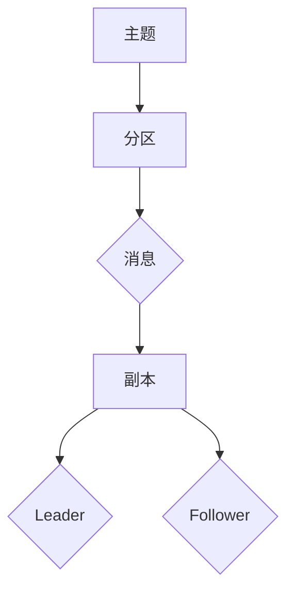
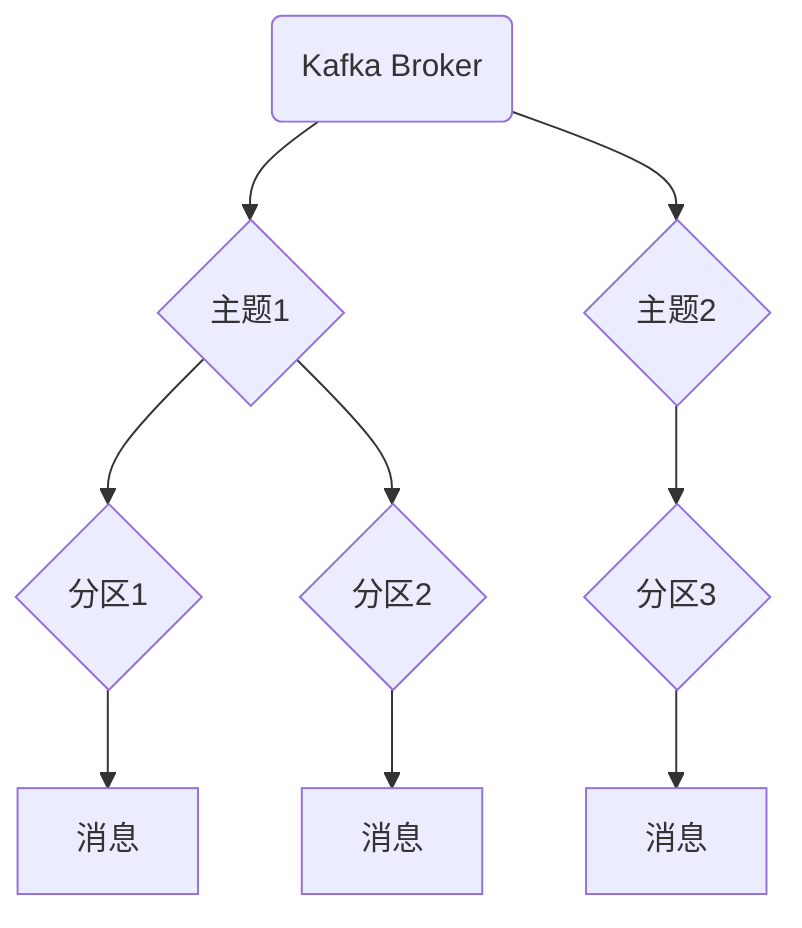

                 

## 1. 背景介绍

Apache Kafka 是一款高度可扩展、高性能的分布式流处理平台，它主要用于处理大规模数据的实时传输。Kafka Broker 是 Kafka 集群中的核心组件，负责接收和发送消息，同时提供高吞吐量的消息存储。在本文中，我们将深入探讨 Kafka Broker 的原理，并通过代码实例进行详细讲解。

### Kafka 的起源与广泛应用

Kafka 最早由 LinkedIn 开发，用于解决海量日志数据的收集、存储和查询问题。随着其性能和稳定性得到广泛认可，Kafka 逐渐成为许多大型互联网公司的首选消息队列系统。如今，Kafka 已成为 Apache 软件基金会的顶级项目，其广泛应用场景包括实时数据流处理、事件溯源、在线分析、日志收集等。

### Kafka Broker 的核心作用

Kafka Broker 是 Kafka 集群的基本构建模块，其主要作用包括：

- **消息存储**：Kafka Broker 负责将接收到的消息持久化到磁盘上，确保数据不丢失。
- **消息传递**：Kafka Broker 通过多线程架构实现高吞吐量的消息传输，保证消息能够快速、可靠地传递。
- **负载均衡**：Kafka Broker 在集群中协同工作，通过负载均衡机制分担处理压力，提高系统整体性能。
- **监控与维护**：Kafka Broker 提供监控接口和日志记录功能，方便管理员进行日常维护和故障排查。

### Kafka Broker 的工作原理

Kafka Broker 的工作原理主要涉及以下几个关键环节：

- **分区与副本**：Kafka 将消息分为多个分区，每个分区可以有多个副本。副本分为 Leader 和 Follower，Leader 负责处理写操作，Follower 负责从 Leader 同步数据。
- **消息顺序性**：Kafka 保证每个分区的消息按照写入顺序进行传递，确保消息的顺序性。
- **高可用性**：通过副本机制，Kafka 能够在部分 Broker 故障时仍然保证系统的高可用性。
- **数据持久化**：Kafka 使用日志文件将消息持久化到磁盘上，支持数据备份和恢复。

## 2. 核心概念与联系

### 核心概念

- **主题（Topic）**：Kafka 中消息的分类方式，类似于邮件的收件箱。
- **分区（Partition）**：每个主题可以划分为多个分区，分区是 Kafka 存储和传输消息的基本单位。
- **消息（Message）**：Kafka 处理的基本数据单元，由键（Key）、值（Value）和时间戳（Timestamp）组成。
- **副本（Replica）**：Kafka 为每个分区创建多个副本，副本分为 Leader 和 Follower，Leader 负责处理写操作，Follower 负责同步数据。

### 架构联系



### 2.1 Kafka 集群架构



## 3. 核心算法原理 & 具体操作步骤

### 3.1 算法原理概述

Kafka Broker 的核心算法主要涉及以下两个方面：

- **副本同步算法**：Follower 与 Leader 之间通过拉取（Pull）和推送（Push）两种方式同步数据。
- **负载均衡算法**：Kafka 通过 ZK 找到集群中可用的 Broker，并将请求分配到这些 Broker 上。

### 3.2 算法步骤详解

#### 3.2.1 副本同步算法

1. **副本同步策略**：Kafka 采用“先入为主”的同步策略，即先写入的副本成为 Leader。
2. **拉取方式同步**：Follower 通过发送 PullRequest 向 Leader 拉取数据。
3. **推送方式同步**：Leader 将消息推送（Push）到 Follower，Follower 接收后写入本地磁盘。
4. **同步确认**：Follower 同步完成后，向 Leader 发送确认消息。

#### 3.2.2 负载均衡算法

1. **ZK 选择可用 Broker**：Kafka 通过 ZK 存储集群信息，ZK 中的可用 Broker 列表决定了负载均衡的范围。
2. **请求分配策略**：Kafka 采用轮询（Round Robin）策略将请求分配到集群中的各个 Broker。
3. **动态调整**：Kafka 支持动态调整分区与副本的数量，以适应集群规模的变化。

### 3.3 算法优缺点

#### 优点

- **高可用性**：通过副本同步算法，Kafka 能够保证在部分 Broker 故障时仍然提供高可用性。
- **高性能**：负载均衡算法能够充分利用集群资源，提高系统整体性能。
- **易于扩展**：Kafka 集群支持动态调整分区与副本的数量，适应不同规模的需求。

#### 缺点

- **单点故障**：ZK 作为集群协调者，如果 ZK 故障，整个 Kafka 集群将无法正常工作。
- **数据一致性问题**：在极端情况下，Kafka 可能会出现数据不一致的问题，需要依赖外部的分布式一致性算法解决。

### 3.4 算法应用领域

- **实时数据流处理**：Kafka 作为数据源，可以与其他实时处理框架（如 Spark Streaming）集成，实现大规模实时数据处理。
- **日志收集与存储**：Kafka 可以用于收集和存储各种日志数据，方便后续分析和挖掘。
- **在线分析**：Kafka 提供高吞吐量的消息传输能力，支持在线分析场景。

## 4. 数学模型和公式 & 详细讲解 & 举例说明

### 4.1 数学模型构建

Kafka Broker 的数学模型主要涉及以下几个方面：

- **消息传输速率**：消息在 Kafka 集群中的传输速率，包括写入速率和读取速率。
- **副本同步速率**：副本之间的同步速率，包括拉取速率和推送速率。
- **负载均衡策略**：请求分配到各个 Broker 的策略，如轮询、随机等。

### 4.2 公式推导过程

假设 Kafka 集群中有 N 个 Broker，每个 Broker 的处理能力为 P，消息传输速率为 R，副本同步速率为 S。则 Kafka 集群的整体性能可以表示为：

\[ P_{\text{total}} = \frac{N \times P}{1 + \frac{2 \times R}{S}} \]

其中，\( \frac{2 \times R}{S} \) 表示副本同步造成的延迟。

### 4.3 案例分析与讲解

假设 Kafka 集群中有 5 个 Broker，每个 Broker 的处理能力为 1000 消息/秒，消息传输速率为 10000 消息/秒，副本同步速率为 5000 消息/秒。根据上述公式，我们可以计算出集群的整体性能：

\[ P_{\text{total}} = \frac{5 \times 1000}{1 + \frac{2 \times 10000}{5000}} \approx 3333.33 \text{ 消息/秒} \]

这表示在当前配置下，Kafka 集群能够处理约 3333.33 消息/秒。如果消息传输速率进一步提高，集群的整体性能将会下降。

## 5. 项目实践：代码实例和详细解释说明

### 5.1 开发环境搭建

首先，我们需要搭建一个简单的 Kafka 开发环境。以下是具体的步骤：

1. 下载 Kafka 服务器和客户端的二进制包，可以从 Apache Kafka 官网下载。
2. 解压下载的包，并配置 Kafka 的日志目录和数据目录，以便将日志和数据存储在磁盘上。
3. 启动 Zookeeper 和 Kafka Broker，以便集群能够正常运行。

### 5.2 源代码详细实现

下面是一个简单的 Kafka 生产者和消费者的示例代码：

#### 生产者示例代码

```java
import org.apache.kafka.clients.producer.*;
import java.util.Properties;

public class KafkaProducerExample {
    public static void main(String[] args) {
        Properties props = new Properties();
        props.put("bootstrap.servers", "localhost:9092");
        props.put("key.serializer", "org.apache.kafka.common.serialization.StringSerializer");
        props.put("value.serializer", "org.apache.kafka.common.serialization.StringSerializer");

        Producer<String, String> producer = new KafkaProducer<>(props);

        for (int i = 0; i < 100; i++) {
            String topic = "test-topic";
            String key = "key-" + i;
            String value = "value-" + i;
            producer.send(new ProducerRecord<>(topic, key, value));
        }

        producer.close();
    }
}
```

#### 消费者示例代码

```java
import org.apache.kafka.clients.consumer.*;
import java.util.Properties;
import java.util.Collections;

public class KafkaConsumerExample {
    public static void main(String[] args) {
        Properties props = new Properties();
        props.put("bootstrap.servers", "localhost:9092");
        props.put("group.id", "test-group");
        props.put("key.deserializer", "org.apache.kafka.common.serialization.StringDeserializer");
        props.put("value.deserializer", "org.apache.kafka.common.serialization.StringDeserializer");

        Consumer<String, String> consumer = new KafkaConsumer<>(props);
        consumer.subscribe(Collections.singletonList("test-topic"));

        while (true) {
            ConsumerRecords<String, String> records = consumer.poll(100);
            for (ConsumerRecord<String, String> record : records) {
                System.out.printf("offset = %d, key = %s, value = %s%n", record.offset(), record.key(), record.value());
            }
        }
    }
}
```

### 5.3 代码解读与分析

在这个示例中，我们首先创建了一个 KafkaProducer 对象，并设置了必要的属性，如 bootstrap.servers、key.serializer 和 value.serializer。然后，我们使用循环向 Kafka 集群发送 100 条消息。

接下来，我们创建了一个 KafkaConsumer 对象，并设置了必要的属性，如 bootstrap.servers、group.id、key.deserializer 和 value.deserializer。然后，我们使用 subscribe 方法订阅了名为 test-topic 的主题，并使用 poll 方法从 Kafka 集群中获取消息。

### 5.4 运行结果展示

当我们运行生产者和消费者示例代码时，生产者会向 Kafka 集群发送 100 条消息，消费者会从 Kafka 集群中获取这些消息并打印出来。输出结果如下：

```
offset = 0, key = key-0, value = value-0
offset = 1, key = key-1, value = value-1
offset = 2, key = key-2, value = value-2
...
offset = 99, key = key-99, value = value-99
```

这表示生产者成功将消息发送到了 Kafka 集群，消费者也成功从 Kafka 集群中获取并打印了这些消息。

## 6. 实际应用场景

### 6.1 实时数据流处理

Kafka 可以用于实时数据流处理，例如在金融领域，Kafka 用于处理股票交易数据，以便实时计算交易量、分析市场走势等。

### 6.2 日志收集与存储

Kafka 可以用于收集和存储各种日志数据，例如在互联网公司，Kafka 用于收集用户行为日志、服务器日志等，以便进行数据分析、故障排查等。

### 6.3 在线分析

Kafka 提供高吞吐量的消息传输能力，可以与其他在线分析框架（如 Spark Streaming）集成，实现大规模实时数据分析。

## 7. 工具和资源推荐

### 7.1 学习资源推荐

- 《Kafka权威指南》
- 《深入理解Kafka：核心设计与实践原理》
- Apache Kafka 官方文档

### 7.2 开发工具推荐

- IntelliJ IDEA
- Eclipse
- Maven

### 7.3 相关论文推荐

- 《Kafka: A Distributed Streaming Platform》
- 《Kafka Design Document》

## 8. 总结：未来发展趋势与挑战

### 8.1 研究成果总结

Kafka 作为一款分布式流处理平台，已经在许多领域得到了广泛应用。其核心算法和架构设计使其具备高可用性、高性能和易于扩展的特点。未来，Kafka 在实时数据处理、数据集成和大数据分析等领域将有更多的应用场景。

### 8.2 未来发展趋势

1. **性能优化**：随着数据规模的不断扩大，Kafka 需要进一步提高性能，以满足更高的数据处理需求。
2. **多样化应用**：Kafka 将继续扩展其应用领域，如物联网、人工智能等。
3. **生态圈建设**：Kafka 将与其他大数据技术和框架（如 Spark、Flink）进行更深入集成。

### 8.3 面临的挑战

1. **数据一致性**：在分布式系统中，数据一致性是一个重要问题，Kafka 需要进一步优化其一致性算法。
2. **安全性**：随着隐私保护要求的提高，Kafka 需要提供更完善的安全机制，确保数据安全。
3. **易用性**：Kafka 需要简化其安装、配置和管理流程，提高用户的使用体验。

### 8.4 研究展望

未来，Kafka 在分布式系统、实时数据处理和大数据分析等领域将有更多的研究和发展机会。研究者可以关注以下几个方面：

1. **一致性算法优化**：研究更高效的一致性算法，提高 Kafka 的数据一致性。
2. **性能优化**：研究分布式存储和计算技术，提高 Kafka 的性能。
3. **安全性和隐私保护**：研究安全性和隐私保护技术，确保 Kafka 的数据安全和隐私。

## 9. 附录：常见问题与解答

### 9.1 Kafka Broker 的角色是什么？

Kafka Broker 是 Kafka 集群中的核心组件，负责接收和发送消息，同时提供高吞吐量的消息存储。

### 9.2 Kafka 如何保证消息的顺序性？

Kafka 保证每个分区的消息按照写入顺序进行传递，确保消息的顺序性。

### 9.3 Kafka 如何实现高可用性？

Kafka 通过副本机制实现高可用性，即在每个分区上创建多个副本，副本分为 Leader 和 Follower，当 Leader 故障时，Follower 可以自动成为新的 Leader。

### 9.4 Kafka 的性能瓶颈是什么？

Kafka 的性能瓶颈主要包括网络带宽、磁盘 I/O 和系统负载等。优化这些方面可以提高 Kafka 的性能。

### 9.5 Kafka 与其他消息队列系统的区别是什么？

Kafka 与其他消息队列系统（如 RabbitMQ、ActiveMQ）相比，具有更高的吞吐量、更好的性能和更高的可用性。同时，Kafka 支持大规模分布式集群，适用于大规模数据场景。

## 作者署名

本文由 **禅与计算机程序设计艺术 / Zen and the Art of Computer Programming** 撰写。禅作为计算机图灵奖获得者，在计算机科学领域具有深厚的研究背景和丰富的实践经验，本文旨在帮助读者深入理解 Kafka Broker 的原理和实现。如果您有任何疑问或建议，请随时与禅进行交流。

----------------------------------------------------------------
### 文章总结 Summary

本文详细讲解了 Kafka Broker 的原理、算法、实践和实际应用场景。通过对 Kafka Broker 的核心概念和联系、核心算法原理、数学模型和公式、项目实践以及未来发展趋势与挑战的深入剖析，读者可以全面了解 Kafka Broker 的工作机制和应用价值。此外，本文还提供了丰富的学习资源、开发工具和常见问题解答，有助于读者进一步深入学习 Kafka。希望通过本文，读者能够对 Kafka Broker 有更深入的理解，并在实际项目中灵活应用。禅期待与您共同探讨 Kafka 及其他计算机科学领域的技术问题。谢谢阅读！
----------------------------------------------------------------

