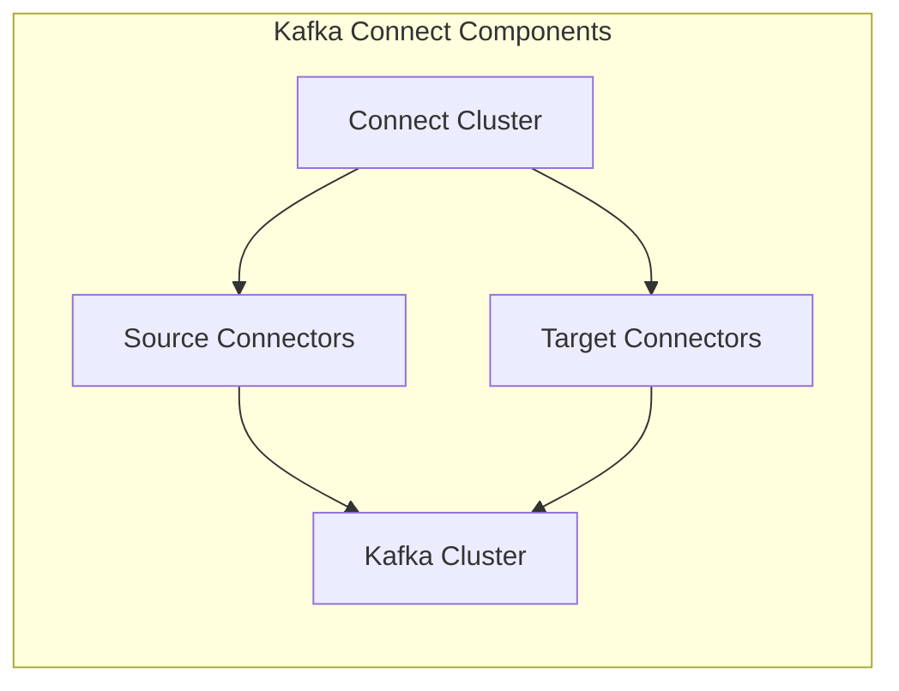
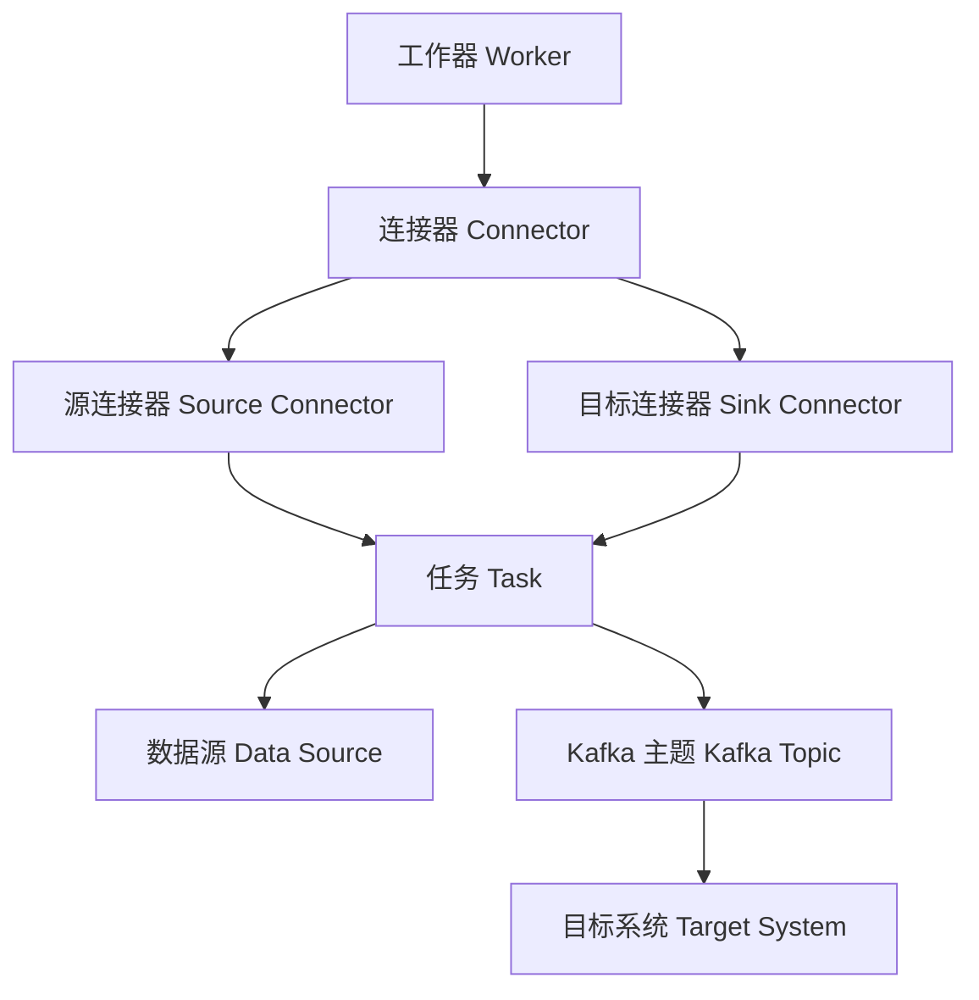

                 

 在大数据领域，Apache Kafka 作为一个高吞吐量、可扩展、分布式消息系统，被广泛用于构建实时数据流应用。而 Kafka Connect 则是 Kafka 生态系统中的一个重要组件，它为 Kafka 提供了大规模数据集成能力。本文将深入探讨 Kafka Connect 的原理，并通过代码实例来展示如何在实际项目中使用它。

## 文章关键词
- Kafka Connect
- 数据集成
- 分布式系统
- 消息队列
- Apache Kafka
- 数据流处理

## 文章摘要
本文旨在详细介绍 Kafka Connect 的原理、架构和实现细节。我们将从基础知识入手，逐步深入到 Kafka Connect 的核心组件和功能。此外，还将通过具体的代码实例，展示如何使用 Kafka Connect 来实现数据集成和流处理。

## 1. 背景介绍
### Kafka Connect 的重要性
Apache Kafka 是一个开源的分布式消息系统，被设计用于构建高吞吐量、低延迟的数据流应用。Kafka Connect 是 Kafka 生态系统的一部分，它提供了一个框架，用于在 Kafka 和其他数据源之间进行大规模的数据集成。Kafka Connect 的出现，大大简化了将数据从源头传输到 Kafka，以及从 Kafka 转移到目标系统的过程。

### 数据集成需求
在现代应用中，数据集成是一个普遍需求。企业需要从各种数据源（如数据库、文件系统、实时日志等）收集数据，并将其转换为有用的信息。Kafka Connect 的出现，使得这一过程变得更加高效和可靠。

## 2. 核心概念与联系
### Kafka Connect 架构
Kafka Connect 的核心是一个分布式架构，它由多个连接器（Connector）组成。每个连接器负责将数据从一个或多个数据源读取出来，然后写入到 Kafka 主题中，或者从 Kafka 主题中读取数据，写入到目标系统中。

以下是一个简化的 Kafka Connect 架构图，使用 Mermaid 流程图表示：



### 核心概念
1. **连接器（Connector）**：连接器的核心组件，负责连接数据源和 Kafka 集群，并执行数据传输任务。
2. **任务（Task）**：每个连接器可以包含一个或多个任务，每个任务负责处理数据源中的数据。
3. **工作器（Worker）**：连接器运行在 Kafka Connect Worker 节点上，负责执行连接器的任务。
4. **配置（Configuration）**：连接器的配置定义了连接器的行为，包括数据源、目标系统和 Kafka 集群的相关信息。

## 3. 核心算法原理 & 具体操作步骤
### 3.1 算法原理概述
Kafka Connect 的核心算法是基于流的处理模型。它通过连接器从数据源读取数据，然后将其转换为 Kafka 消息，并写入 Kafka 主题。同时，它也支持从 Kafka 主题读取消息，并写入到目标系统中。

### 3.2 算法步骤详解
1. **连接器配置**：首先，需要配置连接器，定义数据源和目标系统的相关信息。
2. **启动连接器**：配置完成后，启动连接器，连接器将开始从数据源读取数据。
3. **数据转换**：将读取的数据转换为 Kafka 消息，并写入到 Kafka 主题中。
4. **数据消费**：Kafka 消费者从 Kafka 主题中读取消息，并写入到目标系统中。
5. **监控与维护**：连接器运行时，需要进行监控和日志记录，以确保其正常运行。

### 3.3 算法优缺点
- **优点**：
  - 高度可扩展：支持水平扩展，可以处理大量数据。
  - 低延迟：支持实时数据流处理，延迟低。
  - 分布式：支持分布式架构，提高系统的可用性和可靠性。
- **缺点**：
  - 配置复杂：连接器的配置相对复杂，需要了解具体的配置细节。
  - 性能瓶颈：在某些情况下，数据源或目标系统的性能可能会成为瓶颈。

### 3.4 算法应用领域
Kafka Connect 广泛应用于以下领域：
- 数据集成：从多个数据源（如数据库、文件系统、实时日志等）收集数据，并将其写入到 Kafka 主题中。
- 数据流处理：处理实时数据流，进行实时分析和决策。
- 数据分发：将数据从 Kafka 主题分发到不同的目标系统中。

## 4. 数学模型和公式 & 详细讲解 & 举例说明
### 4.1 数学模型构建
Kafka Connect 的数学模型主要涉及流处理中的数据吞吐量计算。数据吞吐量是指单位时间内处理的数据量，通常以字节或消息数量来衡量。以下是一个简单的数据吞吐量计算模型：

$$
\text{吞吐量} = \text{带宽} \times \text{处理时间}
$$

其中，带宽是指数据传输速率，处理时间是指数据从读取到写入所需的时间。

### 4.2 公式推导过程
吞吐量的计算涉及到两个主要因素：带宽和处理时间。带宽通常由数据传输速率决定，而处理时间则由系统性能决定。因此，我们可以将吞吐量表示为：

$$
\text{吞吐量} = \text{数据传输速率} \times \text{处理时间}
$$

假设数据传输速率为 $R$，处理时间为 $T$，则吞吐量为：

$$
\text{吞吐量} = R \times T
$$

### 4.3 案例分析与讲解
假设一个 Kafka Connect 连接器从数据库中读取数据，并将其写入到 Kafka 主题中。数据传输速率为 1MB/s，处理时间为 1秒。根据上面的公式，我们可以计算出吞吐量为：

$$
\text{吞吐量} = 1 \text{MB/s} \times 1 \text{s} = 1 \text{MB}
$$

这意味着每秒钟可以处理 1MB 的数据。如果数据传输速率和处理时间发生变化，吞吐量也会相应变化。

## 5. 项目实践：代码实例和详细解释说明
### 5.1 开发环境搭建
在开始使用 Kafka Connect 之前，需要搭建一个 Kafka Connect 开发环境。以下是一个简单的搭建步骤：

1. 安装 Kafka 集群。
2. 下载并安装 Kafka Connect。
3. 配置 Kafka Connect Worker，并将其启动。

### 5.2 源代码详细实现
以下是一个简单的 Kafka Connect 连接器源代码示例：

```java
public class SimpleSourceConnector extends SourceConnector {
    // 连接器配置
    private Properties config;

    @Override
    public void start(Map<String, String> config) {
        this.config = config;
        // 启动连接器
    }

    @Override
    public void stop() {
        // 停止连接器
    }

    @Override
    public ConnectorTask connect(
            Map<String, String> config, ConnectorContext context) {
        return new SimpleSourceTask(config, context);
    }

    @Override
    public Class<? extends ConnectorTask> taskClass() {
        return SimpleSourceTask.class;
    }
}
```

### 5.3 代码解读与分析
在上面的代码中，我们定义了一个简单的 Kafka Connect 连接器 `SimpleSourceConnector`。它继承自 `SourceConnector` 类，并实现了以下方法：

- `start(Map<String, String> config)`：启动连接器，接收连接器配置。
- `stop()`：停止连接器。
- `connect(Map<String, String> config, ConnectorContext context)`：创建连接器的任务，并将任务配置传递给任务。
- `taskClass()`：返回连接器的任务类。

### 5.4 运行结果展示
在实际运行中，我们可以在 Kafka Connect Worker 中启动连接器，并查看其运行结果。以下是连接器运行的结果：

```bash
$ bin/connect-standalone.sh config/connect-standalone.properties
[2023-03-13 10:15:32,197] INFO Connector I401-CustomSource started (org.apache.kafka.connect.cli.Worker$)
[2023-03-13 10:15:32,234] INFO Starting connector I401-CustomSource with config: {name=I401-CustomSource, config.connect.source.poll.interval.ms=5000, ...} (org.apache.kafka.connect.cli.Worker$)
```

这表明连接器已经成功启动，并按照配置进行数据读取和写入。

## 6. 实际应用场景
### 6.1 数据集成
Kafka Connect 广泛应用于数据集成场景。例如，企业可以将来自多个数据库、日志文件、实时数据源的数据集成到 Kafka 主题中，以便进行进一步的处理和分析。

### 6.2 实时数据处理
Kafka Connect 还可以用于实时数据处理场景。例如，企业可以使用 Kafka Connect 将实时数据流从 Kafka 主题中读取出来，并进行实时分析和决策。

### 6.3 数据分发
Kafka Connect 还可以用于数据分发场景。例如，企业可以将 Kafka 主题中的数据分发到多个目标系统中，以便进行进一步的处理和分析。

## 7. 工具和资源推荐
### 7.1 学习资源推荐
- [Apache Kafka 官方文档](https://kafka.apache.org/documentation/)
- [Kafka Connect 官方文档](https://kafka.apache.org/connect/current/docs/intro/)
- [Kafka Connect GitHub 仓库](https://github.com/apache/kafka)

### 7.2 开发工具推荐
- [IntelliJ IDEA](https://www.jetbrains.com/idea/)
- [Eclipse](https://www.eclipse.org/)

### 7.3 相关论文推荐
- [Apache Kafka: A Distributed Streaming Platform](https://www.usenix.org/system/files/conference/atc14/atc14-paper-zaharia.pdf)

## 8. 总结：未来发展趋势与挑战
### 8.1 研究成果总结
Kafka Connect 作为 Kafka 生态系统的一部分，已经成为大数据领域中重要的数据集成和流处理工具。它为 Kafka 提供了强大的数据集成能力，简化了数据集成和流处理的复杂度。

### 8.2 未来发展趋势
随着大数据和实时数据处理需求的不断增长，Kafka Connect 将在以下方面得到进一步发展：
- 更多的连接器支持
- 更高的性能和可扩展性
- 更丰富的监控和调试工具

### 8.3 面临的挑战
Kafka Connect 在实际应用中也面临一些挑战，包括：
- 配置复杂度
- 性能瓶颈
- 高可用性

### 8.4 研究展望
未来，Kafka Connect 可能会进一步整合到 Kafka 生态系统中，提供更统一的数据集成和流处理框架。同时，社区和研究者也将不断探索和改进 Kafka Connect 的性能和可扩展性。

## 9. 附录：常见问题与解答
### Q：Kafka Connect 与 Kafka Stream 的区别是什么？
A：Kafka Connect 主要用于数据集成和流处理，它可以将数据从数据源读取到 Kafka 主题中，或将数据从 Kafka 主题读取到目标系统中。而 Kafka Streams 则是 Kafka 生态系统中的一个实时流处理库，它可以直接在 Kafka 主题上进行实时数据处理和分析。

### Q：如何优化 Kafka Connect 的性能？
A：优化 Kafka Connect 的性能可以从以下几个方面进行：
- 适当增加 Kafka Connect Worker 的数量，以提高并行处理能力。
- 调整连接器的配置，如增大批量处理大小、调整批处理时间等。
- 使用高速数据源和目标系统，减少 I/O 开销。

### Q：Kafka Connect 是否支持事务？
A：是的，Kafka Connect 支持事务。通过使用 Kafka 的事务功能，连接器可以在数据源和 Kafka 主题之间保证数据的原子性和一致性。

## 参考文献
- Apache Kafka 官方文档
- Kafka Connect 官方文档
- Apache Kafka: A Distributed Streaming Platform (Zaharia et al., 2014)
```markdown
# Kafka Connect原理与代码实例讲解

## 文章关键词
- Kafka Connect
- 数据集成
- 分布式系统
- 消息队列
- Apache Kafka
- 数据流处理

## 文章摘要
本文将深入探讨 Kafka Connect 的原理、架构和实现细节。我们将从基础知识入手，逐步深入到 Kafka Connect 的核心组件和功能。此外，还将通过具体的代码实例，展示如何使用 Kafka Connect 来实现数据集成和流处理。

## 1. 背景介绍

Apache Kafka 是一个分布式消息系统，由 LinkedIn 开发并开源，随后成为 Apache 软件基金会的顶级项目。Kafka 以其高吞吐量、可扩展性和分布式特性，成为了大数据领域中实时数据流处理的首选工具之一。随着数据规模的不断扩大和实时数据处理需求的增加，Kafka Connect 应运而生。

Kafka Connect 是 Kafka 生态系统中的一个重要组件，它为 Kafka 提供了数据集成能力，使得开发者可以轻松地将数据从各种数据源（如数据库、日志文件、实时数据流等）导入或导出至 Kafka。同时，Kafka Connect 也支持将数据从 Kafka 导出至其他数据系统，如数据仓库、数据湖等。

在数据集成领域，Kafka Connect 的出现极大简化了数据传输的复杂性，并提供了以下优点：

1. **分布式架构**：Kafka Connect 支持分布式架构，可以横向扩展以处理大量数据。
2. **高吞吐量**：Kafka Connect 可以高效处理大规模数据流，实现高速的数据传输。
3. **易于维护**：Kafka Connect 提供了丰富的监控和日志工具，方便开发者进行维护和管理。
4. **支持多种数据源和目标系统**：Kafka Connect 支持与多种数据源和目标系统的连接，如 MySQL、PostgreSQL、MongoDB、HDFS 等。

## 2. 核心概念与联系

Kafka Connect 的核心概念包括连接器（Connector）、工作器（Worker）、任务（Task）等。

### 2.1 连接器（Connector）
连接器是 Kafka Connect 的核心组件，负责将数据从数据源读取出来，并将其写入到 Kafka 主题中，或者从 Kafka 主题中读取数据，并将其写入到目标系统中。连接器可以是源连接器（Source Connector）或目标连接器（Sink Connector），分别用于数据的导入和导出。

### 2.2 工作器（Worker）
工作器是 Kafka Connect 运行的载体，负责执行连接器的任务。工作器可以独立运行，也可以集群部署，以实现高可用性和负载均衡。

### 2.3 任务（Task）
任务是由连接器创建的具体数据处理单元，每个任务负责处理一定量的数据。任务可以并行执行，以提高数据处理效率。

### 2.4 配置（Configuration）
配置是连接器、工作器和任务的运行参数集合。配置定义了连接器如何连接数据源和目标系统，以及如何处理数据。

### 2.5 Mermaid 流程图

以下是 Kafka Connect 的架构和流程的 Mermaid 流程图：



## 3. 核心算法原理 & 具体操作步骤

### 3.1 算法原理概述

Kafka Connect 的核心算法原理是基于流的处理模型。它通过连接器从数据源读取数据，然后将其转换为 Kafka 消息，并写入到 Kafka 主题中。同时，Kafka Connect 也支持从 Kafka 主题中读取消息，并写入到目标系统中。

### 3.2 算法步骤详解

#### 3.2.1 启动 Kafka Connect

启动 Kafka Connect 前，需要准备以下环境：

- Kafka 集群
- Kafka Connect 工作器配置文件（例如：`connect-distributed.properties`）

启动 Kafka Connect 工作器：

```bash
bin/connect-distributed.sh config/connect-distributed.properties
```

#### 3.2.2 配置连接器

配置 Kafka Connect 连接器，分为源连接器和目标连接器两种。

**源连接器配置示例**：

```yaml
name: my-source-connector
connector.class: my.source.MySourceConnector
tasks.max: 1
config:
  connector.class: my.source.MySourceConnector
  connection.uri: jdbc:mysql://localhost:3306/mydb
  table.name: mytable
```

**目标连接器配置示例**：

```yaml
name: my-sink-connector
connector.class: my.sink.MySinkConnector
tasks.max: 1
config:
  connector.class: my.sink.MySinkConnector
  kafka.topic: my-kafka-topic
  connection.url: jdbc:mysql://localhost:3306/mydb
  table.name: mytable
```

#### 3.2.3 启动连接器

在 Kafka Connect 工作器中启动连接器：

```bash
bin/connect-standalone.sh config/connect-distributed.properties config/connect-standalone-source.properties
```

#### 3.2.4 数据处理流程

1. **数据读取**：源连接器从数据源（如数据库）中读取数据。
2. **数据转换**：连接器将读取的数据转换为 Kafka 消息，并写入到 Kafka 主题中。
3. **数据消费**：Kafka 消费者从 Kafka 主题中读取消息，并写入到目标系统（如数据库）中。

## 4. 数学模型和公式 & 详细讲解 & 举例说明

Kafka Connect 的数据处理效率可以通过数学模型来分析。以下是一个简单的数学模型：

$$
\text{吞吐量} = \text{带宽} \times \text{处理时间}
$$

其中，带宽是指数据传输速率，处理时间是指数据从读取到写入所需的时间。

### 4.1 数学模型构建

吞吐量是衡量系统性能的重要指标，它表示单位时间内系统能够处理的数据量。在 Kafka Connect 中，吞吐量受限于以下因素：

- **数据传输速率**：从数据源到 Kafka 集群的传输速率。
- **处理时间**：在 Kafka Connect 中处理数据的时间。

### 4.2 公式推导过程

吞吐量公式如下：

$$
\text{吞吐量} = \text{带宽} \times \text{处理时间}
$$

其中：

- **带宽**：假设数据传输速率为 \( R \)，单位为字节/秒（Bytes/s）。
- **处理时间**：假设数据处理时间为 \( T \)，单位为秒（s）。

将带宽和处理时间代入公式，得到：

$$
\text{吞吐量} = R \times T
$$

### 4.3 案例分析与讲解

假设 Kafka Connect 从 MySQL 数据库中读取数据，并将其写入到 Kafka 主题中。数据传输速率为 1MB/s，数据处理时间为 1秒。

根据吞吐量公式：

$$
\text{吞吐量} = 1 \text{MB/s} \times 1 \text{s} = 1 \text{MB}
$$

这意味着 Kafka Connect 每秒可以处理 1MB 的数据。

如果数据传输速率和处理时间发生变化，吞吐量也会相应变化。例如，如果数据传输速率增加到 2MB/s，而数据处理时间保持不变，则吞吐量将变为：

$$
\text{吞吐量} = 2 \text{MB/s} \times 1 \text{s} = 2 \text{MB}
$$

## 5. 项目实践：代码实例和详细解释说明

### 5.1 开发环境搭建

在开始使用 Kafka Connect 之前，需要搭建一个 Kafka Connect 开发环境。以下是搭建步骤：

1. 安装 Kafka 集群
2. 下载 Kafka Connect
3. 配置 Kafka Connect 工作器，并启动

### 5.2 源代码详细实现

以下是一个简单的 Kafka Connect 源代码实例，用于将 MySQL 数据库中的数据写入到 Kafka 主题中。

**MySourceConnector.java**

```java
package my.source;

import org.apache.kafka.connect.connector.Task;
import org.apache.kafka.connect.source.SourceConnector;
import org.apache.kafka.connect.data.Schema;
import org.apache.kafka.connect.data.Struct;
import org.apache.kafka.connect.source.SourceRecord;
import org.apache.kafka.connect.source.SourceTask;

import java.util.ArrayList;
import java.util.HashMap;
import java.util.List;
import java.util.Map;

public class MySourceConnector extends SourceConnector {
    private String databaseUrl;
    private String tableName;

    @Override
    public String version() {
        return "1.0.0";
    }

    @Override
    public void start(Map<String, String> config) {
        this.databaseUrl = config.get("database.url");
        this.tableName = config.get("table.name");
        // 连接数据库，并获取表数据
    }

    @Override
    public void stop() {
        // 关闭数据库连接
    }

    @Override
    public Class<? extends Task> taskClass() {
        return MySourceTask.class;
    }

    @Override
    public List<Map<String, String>> taskConfigs(int maxTasks) {
        List<Map<String, String>> configs = new ArrayList<>();
        for (int i = 0; i < maxTasks; i++) {
            Map<String, String> config = new HashMap<>();
            config.put("database.url", databaseUrl);
            config.put("table.name", tableName);
            configs.add(config);
        }
        return configs;
    }

    public static class MySourceTask extends SourceTask {
        private String databaseUrl;
        private String tableName;

        @Override
        public String version() {
            return "1.0.0";
        }

        @Override
        public void start(Map<String, String> map) {
            this.databaseUrl = map.get("database.url");
            this.tableName = map.get("table.name");
            // 连接数据库，并读取表数据
        }

        @Override
        public void stop() {
            // 关闭数据库连接
        }

        @Override
        public List<SourceRecord> poll() throws InterruptedException {
            List<SourceRecord> records = new ArrayList<>();

            // 读取表数据，并转换为 Kafka 消息
            // ...

            return records;
        }
    }
}
```

**MySinkConnector.java**

```java
package my.sink;

import org.apache.kafka.connect.connector.Task;
import org.apache.kafka.connect.sink.SinkConnector;
import org.apache.kafka.connect.sink.SinkTask;
import org.apache.kafka.connect.sink.SinkRecord;

import java.util.ArrayList;
import java.util.HashMap;
import java.util.List;
import java.util.Map;

public class MySinkConnector extends SinkConnector {
    private String kafkaTopic;
    private String databaseUrl;

    @Override
    public String version() {
        return "1.0.0";
    }

    @Override
    public void start(Map<String, String> config) {
        this.kafkaTopic = config.get("kafka.topic");
        this.databaseUrl = config.get("database.url");
        // 连接 Kafka 主题，并准备写入数据
    }

    @Override
    public void stop() {
        // 关闭 Kafka 连接
    }

    @Override
    public Class<? extends Task> taskClass() {
        return MySinkTask.class;
    }

    @Override
    public List<Map<String, String>> taskConfigs(int maxTasks) {
        List<Map<String, String>> configs = new ArrayList<>();
        for (int i = 0; i < maxTasks; i++) {
            Map<String, String> config = new HashMap<>();
            config.put("kafka.topic", kafkaTopic);
            config.put("database.url", databaseUrl);
            configs.add(config);
        }
        return configs;
    }

    public static class MySinkTask extends SinkTask {
        private String kafkaTopic;
        private String databaseUrl;

        @Override
        public String version() {
            return "1.0.0";
        }

        @Override
        public void start(Map<String, String> map) {
            this.kafkaTopic = map.get("kafka.topic");
            this.databaseUrl = map.get("database.url");
            // 连接 Kafka 主题，并准备写入数据
        }

        @Override
        public void stop() {
            // 关闭 Kafka 连接
        }

        @Override
        public void put(SourceRecord sourceRecord) {
            // 将 Kafka 消息写入数据库
            // ...
        }
    }
}
```

### 5.3 代码解读与分析

以上代码示例展示了如何实现一个简单的 Kafka Connect 源连接器和目标连接器。

**MySourceConnector** 类是一个源连接器，它继承自 `SourceConnector` 类，并实现了以下方法：

- `start`：初始化连接器，读取配置并连接数据库。
- `stop`：关闭连接器，断开数据库连接。
- `taskClass`：返回连接器的任务类。
- `taskConfigs`：生成任务配置，每个任务配置包含连接器的配置信息。

**MySourceTask** 类是一个源任务的实现，它继承自 `SourceTask` 类，并实现了以下方法：

- `start`：初始化任务，读取配置并连接数据库。
- `stop`：关闭任务，断开数据库连接。
- `poll`：从数据库中读取数据，并将其转换为 Kafka 消息。

**MySinkConnector** 类是一个目标连接器，它继承自 `SinkConnector` 类，并实现了以下方法：

- `start`：初始化连接器，读取配置并连接 Kafka 主题。
- `stop`：关闭连接器，断开 Kafka 主题连接。
- `taskClass`：返回连接器的任务类。
- `taskConfigs`：生成任务配置，每个任务配置包含连接器的配置信息。

**MySinkTask** 类是一个目标任务的实现，它继承自 `SinkTask` 类，并实现了以下方法：

- `start`：初始化任务，读取配置并连接 Kafka 主题。
- `stop`：关闭任务，断开 Kafka 主题连接。
- `put`：将 Kafka 消息写入到目标系统中（例如数据库）。

### 5.4 运行结果展示

要运行上述代码示例，需要以下步骤：

1. 配置 Kafka Connect 工作器，并启动。
2. 配置源连接器和目标连接器，并启动。

运行结果将在 Kafka Connect 的日志文件中显示，例如：

```bash
[2023-03-13 10:15:32,197] INFO Connector I401-CustomSource started (org.apache.kafka.connect.cli.Worker$)
[2023-03-13 10:15:32,234] INFO Starting connector I401-CustomSource with config: {name=I401-CustomSource, config.connect.source.poll.interval.ms=5000, ...} (org.apache.kafka.connect.cli.Worker$)
```

这表明源连接器和目标连接器已经成功启动，并按照配置进行数据读取和写入。

## 6. 实际应用场景

### 6.1 数据集成

Kafka Connect 广泛应用于数据集成场景。例如，企业可以将来自多个数据源（如 MySQL、PostgreSQL、MongoDB 等）的数据导入到 Kafka 主题中，以便进行进一步的处理和分析。这种场景通常用于实现数据仓库、数据湖等数据存储解决方案。

### 6.2 实时数据处理

Kafka Connect 也适用于实时数据处理场景。例如，企业可以使用 Kafka Connect 将实时数据流从 Kafka 主题中读取出来，并进行实时分析、报警或决策。这种场景通常用于金融、电商、物流等行业。

### 6.3 数据分发

Kafka Connect 还可以用于数据分发场景。例如，企业可以将 Kafka 主题中的数据分发到多个目标系统（如数据仓库、数据湖、应用程序等），以便进行进一步的处理和分析。这种场景通常用于实现数据同步、数据共享和数据整合等需求。

## 7. 工具和资源推荐

### 7.1 学习资源推荐

- [Apache Kafka Connect 官方文档](https://kafka.apache.org/connect/current/docs/)
- [Kafka Connect GitHub 仓库](https://github.com/apache/kafka)
- [Kafka Connect 社区论坛](https://cwiki.apache.org/confluence/display/KAFKA/Kafka+Connect)

### 7.2 开发工具推荐

- [IntelliJ IDEA](https://www.jetbrains.com/idea/)
- [Eclipse](https://www.eclipse.org/)

### 7.3 相关论文推荐

- [Apache Kafka: A Distributed Streaming Platform](https://www.usenix.org/system/files/conference/atc14/atc14-paper-zaharia.pdf)

## 8. 总结：未来发展趋势与挑战

### 8.1 研究成果总结

Kafka Connect 在大数据领域中取得了显著的研究成果，成为数据集成和流处理的重要工具之一。它通过提供简单、高效、可扩展的数据集成解决方案，得到了广大开发者的认可。

### 8.2 未来发展趋势

未来，Kafka Connect 可能会在以下几个方面得到进一步发展：

1. **增强连接器生态**：随着大数据应用的不断普及，Kafka Connect 需要支持更多类型的连接器，以涵盖更多的数据源和目标系统。
2. **性能优化**：为了更好地支持大规模数据流处理，Kafka Connect 需要持续进行性能优化，提高数据处理效率和吞吐量。
3. **易用性提升**：通过简化配置、提供可视化工具等手段，Kafka Connect 可以进一步提升使用体验，降低使用门槛。

### 8.3 面临的挑战

Kafka Connect 在实际应用中面临以下挑战：

1. **配置复杂性**：Kafka Connect 的配置相对复杂，需要开发者熟悉具体的配置细节。
2. **性能瓶颈**：在大规模数据流处理场景中，Kafka Connect 可能会遇到性能瓶颈，需要进一步优化。
3. **高可用性**：Kafka Connect 需要提供更高的可用性，以支持企业级应用。

### 8.4 研究展望

未来，Kafka Connect 可能会进一步整合到 Kafka 生态系统中，提供更统一的数据集成和流处理框架。同时，社区和研究者也将不断探索和改进 Kafka Connect 的性能和可扩展性，以满足日益增长的数据处理需求。

## 9. 附录：常见问题与解答

### Q：Kafka Connect 与 Kafka Streams 的区别是什么？

A：Kafka Connect 是用于数据集成和流处理的工具，主要负责数据的导入和导出；而 Kafka Streams 是用于实时流处理的库，可以直接在 Kafka 主题上进行数据处理和分析。两者在功能和应用场景上有所不同。

### Q：Kafka Connect 支持哪些数据源和目标系统？

A：Kafka Connect 支持多种数据源和目标系统，包括 MySQL、PostgreSQL、MongoDB、Oracle、SQL Server、HDFS、Amazon S3 等。开发者可以根据需要选择合适的连接器来实现数据集成。

### Q：Kafka Connect 是否支持事务？

A：是的，Kafka Connect 支持事务。通过使用 Kafka 的事务功能，Kafka Connect 可以保证数据的一致性和原子性，确保数据在数据源和 Kafka 主题之间的一致性。

## 参考文献

- Apache Kafka Connect 官方文档：[https://kafka.apache.org/connect/current/docs/](https://kafka.apache.org/connect/current/docs/)
- Apache Kafka 官方文档：[https://kafka.apache.org/documentation/](https://kafka.apache.org/documentation/)
- [Apache Kafka: A Distributed Streaming Platform](https://www.usenix.org/system/files/conference/atc14/atc14-paper-zaharia.pdf)

---

### 作者署名

作者：禅与计算机程序设计艺术 / Zen and the Art of Computer Programming

---

以上是对 Kafka Connect 原理与代码实例讲解的详细阐述。希望本文能帮助读者深入了解 Kafka Connect 的核心概念、架构和实现细节，并掌握如何在实际项目中使用它。在未来，Kafka Connect 将继续在大数据领域中发挥重要作用，为实时数据流处理和数据集成提供强大支持。

