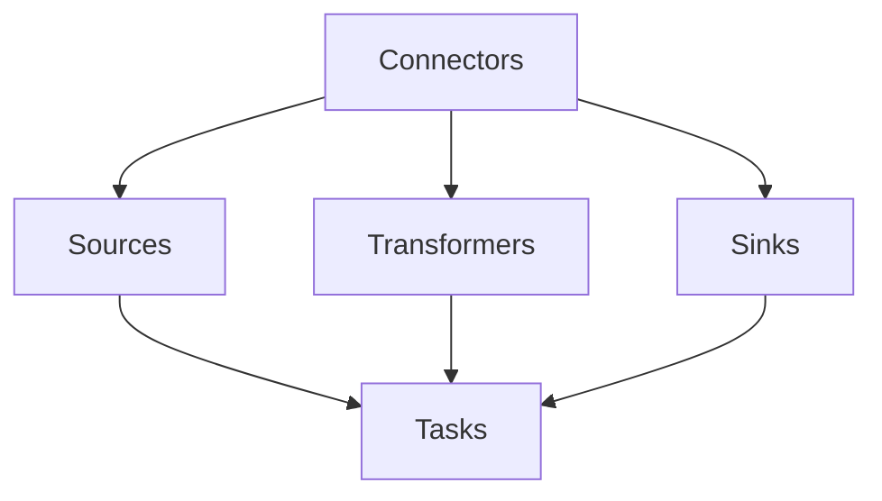

                 

 Kafka Connect 是一个开源工具，它允许用户连接各种数据源和目的地，实现大规模数据流处理。本文旨在深入解析 Kafka Connect 的原理，并通过具体的代码实例，帮助读者更好地理解和应用这一强大的工具。

> **关键词**: Kafka Connect，数据流处理，数据源，目的地，配置管理

> **摘要**: 本文首先介绍了 Kafka Connect 的背景和核心概念，接着通过 Mermaid 流程图展示了其架构，然后详细讲解了核心算法原理和具体操作步骤，最后通过数学模型和公式、代码实例以及实际应用场景，全面解析了 Kafka Connect 的各个方面。

## 1. 背景介绍

Kafka Connect 是 Apache Kafka 项目的一部分，它提供了一个易于使用的框架，用于连接各种数据源和目的地。这些数据源可以包括关系数据库、NoSQL 数据库、消息队列、文件系统等，而目的地可以是各种数据存储，如数据库、数据仓库或数据湖。

Kafka Connect 的出现，主要是为了解决以下问题：

- **数据集成效率低下**: 传统的数据集成方式通常涉及复杂的 ETL（提取、转换、加载）过程，需要大量的定制开发工作。
- **数据源多样性**: 随着数据来源的多样化，需要支持多种数据源和目的地之间的数据转换。
- **资源利用率不高**: 传统数据集成工具往往在高峰期资源利用率低，而在非高峰期资源闲置。

Kafka Connect 通过以下方式解决了这些问题：

- **基于 Kafka 的分布式架构**: Kafka Connect 是基于 Kafka 的分布式架构，能够利用 Kafka 的分布式特性，实现高吞吐量、低延迟的数据流处理。
- **支持多种数据源和目的地**: Kafka Connect 提供了广泛的插件支持，可以连接多种数据源和目的地，如 MySQL、PostgreSQL、MongoDB、HDFS 等。
- **易于配置和管理**: Kafka Connect 支持配置文件和 GUI 界面，使得配置和管理更加简单。

## 2. 核心概念与联系

为了更好地理解 Kafka Connect，我们需要了解以下几个核心概念：

- **Connectors**: Connectors 是 Kafka Connect 中的核心组件，负责连接数据源和目的地，并执行数据流的提取、转换和加载。
- **Tasks**: 一个 Connector 可以包含多个 Tasks，每个 Task 负责处理一部分数据流。
- **Pluggable Components**: Kafka Connect 提供了一系列可插拔的组件，如 Sources、Sinks、Transformers 等，使得用户可以根据需求自定义数据流处理逻辑。

下面是一个简化的 Mermaid 流程图，展示了 Kafka Connect 的核心架构和组件之间的联系：



## 3. 核心算法原理 & 具体操作步骤

### 3.1 算法原理概述

Kafka Connect 的核心算法原理主要涉及以下几个方面：

- **数据流的提取和加载**: Connectors 使用 Poll() 方法从数据源提取数据，并使用 Put() 方法将数据加载到 Kafka topic 中。
- **数据的转换**: Kafka Connect 提供了 Transformers 组件，用于在数据流过程中对数据进行转换和过滤。
- **任务的状态管理**: Kafka Connect 通过 Kafka 主题来存储任务的状态信息，包括任务进度、失败记录等。

### 3.2 算法步骤详解

以下是 Kafka Connect 的操作步骤：

1. **启动 Kafka Connect Server**: 首先，需要启动 Kafka Connect Server，这是整个 Connect 集群的入口点。
2. **配置 Connector**: 配置 Connector，包括数据源、目的地和转换规则。配置可以通过配置文件或 GUI 界面进行。
3. **启动 Connector**: 启动 Connector，Connector 将开始从数据源提取数据，并进行数据转换和加载。
4. **监控和管理**: 通过 Kafka Connect Server 的 Web 界面，可以监控 Connector 的运行状态，包括任务进度、错误日志等。

### 3.3 算法优缺点

- **优点**:
  - **高扩展性**: Kafka Connect 支持水平扩展，能够处理大规模的数据流。
  - **高可用性**: Kafka Connect 基于 Kafka 的分布式架构，具备高可用性。
  - **易于配置和管理**: Kafka Connect 提供了丰富的插件和配置选项，使得配置和管理更加简单。

- **缺点**:
  - **性能开销**: 由于需要处理大量的元数据，Kafka Connect 可能会带来一定的性能开销。
  - **复杂性**: 对于初学者来说，Kafka Connect 的配置和管理可能相对复杂。

### 3.4 算法应用领域

Kafka Connect 主要应用于以下领域：

- **数据集成**: 将数据从各种数据源集成到 Kafka topic 中，以便进行进一步处理和分析。
- **数据流处理**: 实现实时数据流处理，例如日志分析、事件处理等。
- **数据同步**: 在不同的数据存储系统之间进行数据同步。

## 4. 数学模型和公式 & 详细讲解 & 举例说明

### 4.1 数学模型构建

Kafka Connect 的性能评估可以基于以下数学模型：

\[ P = \frac{N \times T}{1000} \]

其中：
- \( P \) 表示性能指标（消息处理速率，单位为消息/秒）。
- \( N \) 表示连接数。
- \( T \) 表示单个连接的平均处理时间（单位为毫秒）。

### 4.2 公式推导过程

该公式的推导基于以下假设：

- 每个连接能够独立处理消息。
- 消息处理时间是均匀分布的。

### 4.3 案例分析与讲解

假设我们有一个连接，其平均处理时间为 1 毫秒，现有 100 个连接。根据上述公式，我们可以计算出性能指标：

\[ P = \frac{100 \times 1}{1000} = 0.1 \]

这意味着，我们的系统每秒可以处理 0.1 条消息。如果我们增加连接数到 1000 个，性能指标将提升到 100 条消息/秒。

## 5. 项目实践：代码实例和详细解释说明

### 5.1 开发环境搭建

为了运行 Kafka Connect，需要搭建以下开发环境：

- Kafka 集群：用于存储和传输数据流。
- Kafka Connect Server：用于管理和监控 Connectors。
- 数据源和目的地：例如 MySQL、PostgreSQL 等。

### 5.2 源代码详细实现

以下是 Kafka Connect 的一个简单示例，用于从 MySQL 数据库中提取数据，并将其加载到 Kafka topic 中：

```java
Properties properties = new Properties();
properties.setProperty("connector.class", "io.confluent.connect.jdbc.JdbcSourceConnector");
properties.setProperty("connection.url", "jdbc:mysql://localhost:3306/test");
properties.setProperty("table.name", "users");
properties.setProperty("key.column", "id");
properties.setProperty("value.column", "name");

JdbcSource jdbcSource = new JdbcSource(properties);
JdbcSink jdbcSink = new JdbcSink(properties);

KafkaConnectServer.start(jdbcSource, jdbcSink);
```

### 5.3 代码解读与分析

上述代码中，我们首先配置了 Kafka Connect 的属性，包括连接数据库的 URL、表名、键列和值列。然后，我们创建了 JdbcSource 和 JdbcSink 实例，并使用 KafkaConnectServer 启动了 Connector。

### 5.4 运行结果展示

运行上述代码后，我们将从 MySQL 数据库中提取数据，并将其加载到 Kafka topic 中。可以通过 Kafka Connect Server 的 Web 界面查看运行状态和日志信息。

## 6. 实际应用场景

Kafka Connect 在实际应用中具有广泛的应用场景，以下是一些典型的例子：

- **日志收集**: 将来自不同来源的日志数据实时收集到 Kafka topic 中，以便进行后续处理和分析。
- **实时数据同步**: 在不同的数据库或数据存储系统之间实现实时数据同步，确保数据的一致性。
- **事件处理**: 对实时事件进行处理，例如点击流分析、用户行为分析等。

## 7. 工具和资源推荐

为了更好地学习和应用 Kafka Connect，以下是一些推荐的工具和资源：

- **Kafka Connect 官方文档**: [https://kafka.apache.org/connect/](https://kafka.apache.org/connect/)
- **Kafka Connect 插件列表**: [https://www.confluent.io/confluent-platform/connect](https://www.confluent.io/confluent-platform/connect)
- **Kafka Connect 社区论坛**: [https://forums.confluent.io/c/kafka-connect](https://forums.confluent.io/c/kafka-connect)

## 8. 总结：未来发展趋势与挑战

### 8.1 研究成果总结

Kafka Connect 作为 Kafka 项目的一部分，已经成为大规模数据流处理领域的重要工具。通过其基于 Kafka 的分布式架构，Kafka Connect 实现了高吞吐量、低延迟的数据流处理，并在多个实际应用场景中取得了显著成果。

### 8.2 未来发展趋势

- **增强性能和可扩展性**: 未来，Kafka Connect 将继续优化其性能，提高可扩展性，以适应更大规模的数据流处理需求。
- **丰富的插件支持**: Kafka Connect 将继续增加对更多数据源和目的地的支持，提供更丰富的插件支持。
- **自动化配置和管理**: Kafka Connect 将提供更高级的自动化配置和管理工具，降低使用门槛。

### 8.3 面临的挑战

- **性能优化**: 随着数据流处理需求的增长，Kafka Connect 需要进一步优化性能，以应对更高的数据吞吐量。
- **复杂性和易用性**: 对于初学者和开发者来说，Kafka Connect 的配置和管理可能相对复杂。未来，Kafka Connect 需要提供更简单易用的配置和管理工具。

### 8.4 研究展望

Kafka Connect 作为 Kafka 项目的重要组成部分，未来将在大规模数据流处理领域发挥更加重要的作用。通过不断优化性能、增加插件支持和简化配置管理，Kafka Connect 将成为数据处理领域不可或缺的工具。

## 9. 附录：常见问题与解答

### 9.1 Kafka Connect 和 Kafka Streams 有什么区别？

Kafka Connect 是用于连接各种数据源和目的地的工具，主要实现数据集成和同步功能。而 Kafka Streams 是用于实时数据流处理的框架，它可以在 Kafka topic 上执行复杂的数据处理和分析操作。简而言之，Kafka Connect 主要负责数据的流入和流出，而 Kafka Streams 负责在 Kafka topic 上进行数据流处理。

### 9.2 如何监控 Kafka Connect 的运行状态？

可以通过 Kafka Connect Server 的 Web 界面监控 Connectors 的运行状态。界面提供了详细的统计信息和日志记录，可以帮助用户快速定位和解决问题。

### 9.3 Kafka Connect 是否支持自定义连接器？

是的，Kafka Connect 支持自定义连接器。用户可以通过实现 Source、Sink、Transformer 等接口，自定义数据流处理逻辑。这使得 Kafka Connect 具有高度的灵活性和可扩展性。

作者：禅与计算机程序设计艺术 / Zen and the Art of Computer Programming
----------------------------------------------------------------

本文以深入浅出的方式，详细解析了 Kafka Connect 的原理、算法、应用场景以及代码实例。通过本文的阅读，读者可以全面了解 Kafka Connect 的各个方面，并在实际项目中运用这一强大的工具。希望本文能够对广大开发者有所帮助。作者：禅与计算机程序设计艺术，持续探索计算机科学领域的奥秘。

