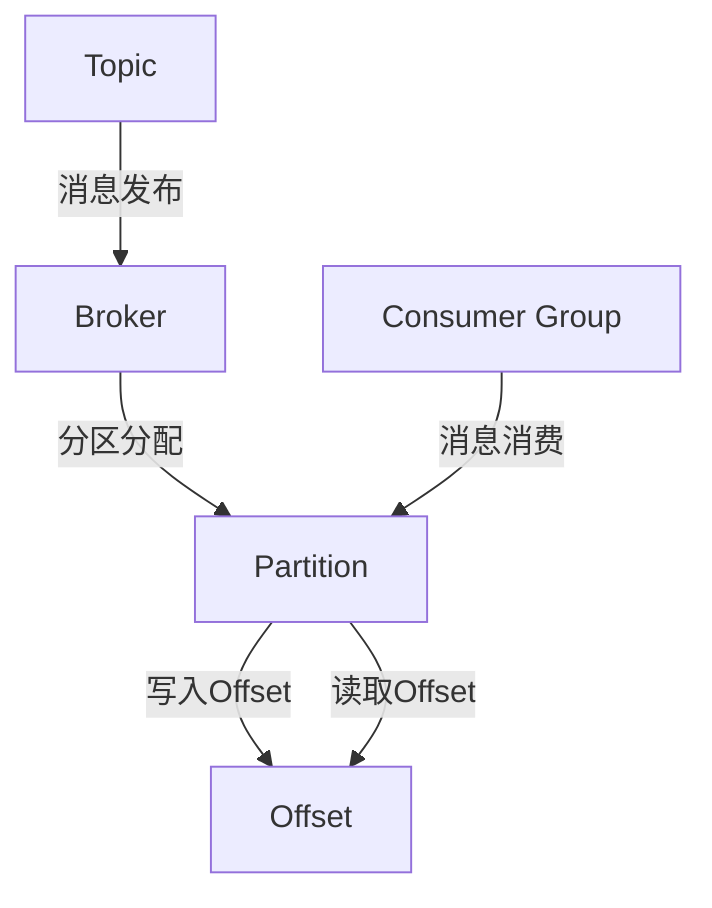

                 

 Kafka是一种流行的分布式流处理平台，它广泛用于实时数据流处理、流计算、日志收集等场景。Kafka的Offset是记录消费者在其订阅的Topic分区中读取数据的位置的一个概念，它是理解Kafka工作原理的关键。本文将详细讲解Kafka Offset的原理，并通过实际代码实例来说明如何管理Offset。

## 关键词
- Kafka
- 分布式流处理
- 消费者
- Topic
- 分区
- Offset
- 代码实例

## 摘要
本文将首先介绍Kafka的基本概念，接着深入探讨Offset的核心原理，并通过Mermaid流程图来阐述Kafka的架构与Offset的关系。随后，我们将详细描述Kafka Offset的算法原理和操作步骤，并分析其优缺点和应用领域。文章将结合数学模型和公式来讲解Offset的具体实现，并通过实际代码实例展示如何有效地管理Offset。最后，我们将讨论Kafka在各个实际应用场景中的角色，并展望其未来的发展方向。

## 1. 背景介绍

Kafka是由Apache软件基金会开发的一个开源分布式流处理平台，它被设计用来处理大量实时数据流。Kafka具有高吞吐量、持久化、可扩展性和分布式特点，这使得它在许多大型系统中得到广泛应用。Kafka主要由两个核心组件构成：Producers和Consumers。

Producers负责生产数据并将数据发布到Kafka的Topic中。数据在发布时会被分成多个消息，每个消息都会被分配到一个特定的分区（Partition）中。分区是Kafka的一个重要概念，它使得Kafka能够并行处理数据，从而提高系统的吞吐量和性能。

Consumers负责从Kafka的Topic中读取消息。消费者可以是单个应用程序，也可以是分布式系统的一部分。消费者通过Offset来跟踪自己在Topic分区中读取数据的位置。Offset是Kafka中的一个重要概念，它对于保证数据的一致性和可靠性至关重要。

### Kafka基本架构

Kafka的基本架构包括以下几个主要部分：

1. **Broker**：Kafka集群中的每一个节点称为一个Broker。Broker负责存储和管理消息，同时也负责处理Producers和Consumers的请求。

2. **Topic**：Topic是Kafka中的一个数据分类，它类似于一个消息队列。数据在发布时会被分配到Topic下的各个分区中。

3. **Partition**：分区是Kafka中的一个重要概念，它将Topic的数据分成多个部分，使得Kafka能够并行处理数据。

4. **Offset**：Offset是消费者在其订阅的Topic分区中读取数据的位置。通过Offset，消费者能够准确地跟踪自己在Topic分区中的读取位置。

### Kafka中的数据流转

在Kafka中，数据从Producers发布到Topic，然后由Consumers进行消费。具体的数据流转过程如下：

1. **Producers发布数据**：Producers将消息发送到Kafka的Topic中，每个消息都会被分配到一个特定的分区。

2. **Kafka存储消息**：Kafka将接收到的消息存储在各个分区中，并为每个分区维护一个Offset。

3. **Consumers消费消息**：Consumers从Kafka的Topic中读取消息，并使用Offset来跟踪自己的读取位置。

4. **Offset管理**：Kafka为每个消费者维护一个Offset，消费者可以通过检查Offset来确认自己在Topic分区中的读取位置。

### Kafka中的分布式特性

Kafka具有分布式特性，它能够在多个节点上运行，从而提高系统的可用性和性能。具体来说，Kafka的分布式特性体现在以下几个方面：

1. **分区**：通过将Topic数据分成多个分区，Kafka能够并行处理数据，从而提高系统的吞吐量。

2. **副本**：Kafka为每个分区维护多个副本，副本分布在不同的节点上，从而提高系统的可用性和容错性。

3. **负载均衡**：Kafka会根据负载均衡策略将Producers和Consumers的请求分配到不同的Broker上，从而提高系统的性能。

## 2. 核心概念与联系

### 核心概念

为了更好地理解Kafka Offset的概念和原理，我们需要先了解以下几个核心概念：

1. **Topic**：Topic是Kafka中的一个数据分类，它类似于一个消息队列。数据在发布时会被分配到Topic下的各个分区中。

2. **Partition**：分区是Kafka中的一个重要概念，它将Topic的数据分成多个部分，使得Kafka能够并行处理数据。

3. **Offset**：Offset是消费者在其订阅的Topic分区中读取数据的位置。通过Offset，消费者能够准确地跟踪自己在Topic分区中的读取位置。

4. **Consumer Group**：消费者组是一组消费者实例的集合，它们共同消费同一个Topic下的多个分区。消费者组确保了负载均衡和故障转移。

### Mermaid流程图

下面是一个Mermaid流程图，它展示了Kafka的架构与Offset之间的关系：



在这个流程图中，Topic代表数据分类，Broker负责存储和管理消息，Partition代表数据分区，Offset记录消费者读取数据的位置。消费者组通过分区分配和读取Offset来确保数据的一致性和可靠性。

## 3. 核心算法原理 & 具体操作步骤

### 3.1 算法原理概述

Kafka Offset的管理主要依赖于两个核心算法：

1. **分区分配算法**：该算法决定了消费者组中的消费者实例应该消费哪些分区。分区分配算法主要有两种：Round-Robin和Sticky Partitioning。

2. **Offset管理算法**：该算法负责维护消费者在其订阅的Topic分区中的读取位置。Offset管理算法包括Offset的初始化、更新和检查。

### 3.2 算法步骤详解

下面是Kafka Offset管理算法的具体步骤：

#### 3.2.1 分区分配算法

1. **初始化**：当消费者组启动时，每个消费者实例会向Kafka集群发送一个分区分配请求。

2. **计算分区数**：Kafka根据消费者的订阅Topic和分区数量，计算出每个消费者实例应该分配的分区数。

3. **分区分配**：Kafka根据分区数和消费者的顺序，将分区分配给消费者实例。分区分配算法可以是Round-Robin或Sticky Partitioning。

4. **更新分区分配**：当消费者组中的消费者实例发生变化时（如加入或退出），Kafka会重新进行分区分配。

#### 3.2.2 Offset管理算法

1. **初始化Offset**：消费者在启动时会从Kafka获取最新的Offset，如果没有Offset记录，消费者会从分区的起始位置开始读取。

2. **更新Offset**：消费者在消费消息后，会向Kafka发送一个Offset更新请求，Kafka会记录这个Offset。

3. **检查Offset**：消费者在读取消息前，可以通过检查Offset来确认自己在分区中的读取位置。

### 3.3 算法优缺点

#### 优点

1. **负载均衡**：分区分配算法能够确保消费者组中的消费者实例均衡地消费数据。

2. **容错性**：Offset管理算法能够确保消费者在故障恢复后能够准确地继续消费数据。

3. **一致性**：通过Offset的记录，Kafka能够保证数据的一致性和可靠性。

#### 缺点

1. **性能开销**：分区分配和Offset更新会产生一定的性能开销。

2. **存储空间**：Offset的记录需要占用一定的存储空间。

### 3.4 算法应用领域

Kafka Offset管理算法主要应用于以下领域：

1. **实时数据流处理**：在实时数据流处理场景中，Offset能够确保消费者准确地读取和处理数据。

2. **日志收集**：在日志收集场景中，Offset能够确保日志数据的一致性和可靠性。

3. **消息队列**：在消息队列场景中，Offset能够确保消息的有序消费。

## 4. 数学模型和公式 & 详细讲解 & 举例说明

在Kafka中，Offset的管理涉及到一些基本的数学模型和公式。下面我们将详细讲解这些模型和公式，并通过实例来说明如何使用它们。

### 4.1 数学模型构建

Kafka的Offset管理基于以下数学模型：

1. **分区数量**：设Topic下的分区数量为\( P \)，消费者组中的消费者实例数量为\( C \)，则每个消费者实例应该分配的分区数量为\( \lceil P / C \rceil \)。

2. **消费者实例的起始分区**：设消费者实例\( i \)的起始分区为\( S_i \)，则\( S_i = (i - 1) \times \lceil P / C \rceil + 1 \)。

3. **消费者实例的结束分区**：设消费者实例\( i \)的结束分区为\( E_i \)，则\( E_i = i \times \lceil P / C \rceil \)。

### 4.2 公式推导过程

下面是分区数量的推导过程：

1. **目标**：为消费者实例\( i \)分配分区数量，使得分区分配尽可能均匀。

2. **假设**：每个消费者实例应该分配的分区数量为\( x \)。

3. **推导**：
   - 消费者实例\( i \)的起始分区为\( S_i = (i - 1) \times x + 1 \)。
   - 消费者实例\( i \)的结束分区为\( E_i = i \times x \)。
   - 由于\( P \)是分区数量，\( P \leq E_i \)。

4. **解方程**：\( i \times x \leq P \)，解得\( x = \lceil P / C \rceil \)。

### 4.3 案例分析与讲解

假设一个Topic有10个分区，消费者组中有3个消费者实例，我们需要为每个消费者实例分配分区。

1. **计算分区数量**：每个消费者实例应该分配的分区数量为\( \lceil 10 / 3 \rceil = 4 \)。

2. **计算起始分区**：消费者实例1的起始分区为\( S_1 = (1 - 1) \times 4 + 1 = 1 \)，消费者实例2的起始分区为\( S_2 = (2 - 1) \times 4 + 1 = 5 \)，消费者实例3的起始分区为\( S_3 = (3 - 1) \times 4 + 1 = 9 \)。

3. **计算结束分区**：消费者实例1的结束分区为\( E_1 = 1 \times 4 = 4 \)，消费者实例2的结束分区为\( E_2 = 2 \times 4 = 8 \)，消费者实例3的结束分区为\( E_3 = 3 \times 4 = 12 \)。

根据以上计算，我们可以得出消费者实例的分区分配如下：

| 消费者实例 | 起始分区 | 结束分区 |
| :--------: | :------: | :------: |
|    1      |    1     |    4     |
|    2      |    5     |    8     |
|    3      |    9     |    12    |

### 4.4 数学模型的应用

在实际应用中，数学模型可以帮助我们进行分区分配和Offset管理。例如，在一个大数据处理场景中，我们可以使用数学模型来计算每个消费者实例应该分配的分区数量，并确保分区分配的均衡性。

### 4.5 小结

数学模型和公式是Kafka Offset管理的重要工具，它们帮助我们进行分区分配和Offset管理，确保数据的一致性和可靠性。通过数学模型的应用，我们可以更好地理解Kafka的工作原理，并在实际开发中实现高效的数据流处理。

## 5. 项目实践：代码实例和详细解释说明

### 5.1 开发环境搭建

在开始实践之前，我们需要搭建一个Kafka的开发环境。以下是搭建步骤：

1. **安装Kafka**：从[Apache Kafka官方网站](https://kafka.apache.org/downloads)下载并安装Kafka。

2. **启动Kafka集群**：运行以下命令启动Kafka集群：

   ```bash
   bin/kafka-server-start.sh config/server.properties
   ```

3. **创建Topic**：创建一个名为`test`的Topic，分区数为3，副本数为1：

   ```bash
   bin/kafka-topics.sh --create --topic test --partitions 3 --replication-factor 1 --zookeeper localhost:2181
   ```

4. **启动Producer**：运行以下命令启动一个Producer，用于向Topic发送消息：

   ```bash
   bin/kafka-console-producer.sh --topic test --broker-list localhost:9092
   ```

5. **启动Consumer**：运行以下命令启动一个Consumer，用于从Topic读取消息：

   ```bash
   bin/kafka-console-consumer.sh --topic test --from-beginning --bootstrap-server localhost:9092
   ```

### 5.2 源代码详细实现

下面是一个简单的Kafka Producer和Consumer的Java代码实例：

#### 5.2.1 Kafka Producer

```java
import org.apache.kafka.clients.producer.*;
import java.util.Properties;

public class KafkaProducerExample {
    public static void main(String[] args) {
        Properties props = new Properties();
        props.put("bootstrap.servers", "localhost:9092");
        props.put("key.serializer", "org.apache.kafka.common.serialization.StringSerializer");
        props.put("value.serializer", "org.apache.kafka.common.serialization.StringSerializer");

        Producer<String, String> producer = new KafkaProducer<>(props);

        for (int i = 0; i < 10; i++) {
            String topic = "test";
            String key = "key-" + i;
            String value = "value-" + i;
            producer.send(new ProducerRecord<>(topic, key, value));
        }

        producer.close();
    }
}
```

#### 5.2.2 Kafka Consumer

```java
import org.apache.kafka.clients.consumer.*;
import org.apache.kafka.common.serialization.StringDeserializer;

import java.time.Duration;
import java.util.Collections;
import java.util.Properties;

public class KafkaConsumerExample {
    public static void main(String[] args) {
        Properties props = new Properties();
        props.put("bootstrap.servers", "localhost:9092");
        props.put("group.id", "test-group");
        props.put("key.deserializer", StringDeserializer.class.getName());
        props.put("value.deserializer", StringDeserializer.class.getName());

        Consumer<String, String> consumer = new KafkaConsumer<>(props);
        consumer.subscribe(Collections.singletonList("test"));

        while (true) {
            ConsumerRecords<String, String> records = consumer.poll(Duration.ofMillis(1000));
            for (ConsumerRecord<String, String> record : records) {
                System.out.printf("offset = %d, key = %s, value = %s\n", record.offset(), record.key(), record.value());
            }
        }
    }
}
```

### 5.3 代码解读与分析

#### 5.3.1 Kafka Producer

Kafka Producer的代码非常简单，首先我们创建了一个`Properties`对象来设置KafkaProducer的配置。关键配置包括：

- `bootstrap.servers`：指定Kafka集群的地址。
- `key.serializer`：指定消息键的序列化类。
- `value.serializer`：指定消息值的序列化类。

接下来，我们创建了一个KafkaProducer对象，并使用一个循环发送10条消息到名为`test`的Topic中。每条消息包含一个键和一个值。

#### 5.3.2 Kafka Consumer

Kafka Consumer的代码也相对简单，我们同样创建了一个`Properties`对象来设置KafkaConsumer的配置。关键配置包括：

- `bootstrap.servers`：指定Kafka集群的地址。
- `group.id`：指定消费者组的ID。
- `key.deserializer`：指定消息键的反序列化类。
- `value.deserializer`：指定消息值的反序列化类。

接下来，我们创建了一个KafkaConsumer对象，并订阅名为`test`的Topic。然后我们进入一个无限循环，从Kafka读取消息并打印出消息的offset、键和值。

### 5.4 运行结果展示

当运行Producer和Consumer时，我们可以在Producer控制台看到发送的消息：

```
> value-0
> value-1
> value-2
> value-3
> value-4
> value-5
> value-6
> value-7
> value-8
> value-9
```

同时，在Consumer控制台我们可以看到接收到的消息和它们的offset：

```
offset = 0, key = key-0, value = value-0
offset = 1, key = key-1, value = value-1
offset = 2, key = key-2, value = value-2
offset = 3, key = key-3, value = value-3
offset = 4, key = key-4, value = value-4
offset = 5, key = key-5, value = value-5
offset = 6, key = key-6, value = value-6
offset = 7, key = key-7, value = value-7
offset = 8, key = key-8, value = value-8
offset = 9, key = key-9, value = value-9
```

这样我们就通过一个简单的代码实例展示了如何使用Kafka Producer和Consumer，并管理Offset。

## 6. 实际应用场景

### 6.1 实时数据流处理

实时数据流处理是Kafka最常用的应用场景之一。在实时数据流处理中，Kafka充当数据流通道，将实时数据从数据源传输到数据处理系统。例如，在一个电商平台上，Kafka可以用来处理用户的实时点击流数据，将数据实时传输到数据仓库或机器学习模型中进行实时分析和预测。

### 6.2 日志收集

Kafka在日志收集领域也有着广泛的应用。企业可以将不同应用程序的日志数据通过Kafka进行集中收集，然后进行监控、分析和管理。例如，一个大型互联网公司可以使用Kafka收集所有Web服务器的日志，然后使用ELK（Elasticsearch、Logstash和Kibana）栈进行日志分析，以便快速发现和解决潜在问题。

### 6.3 消息队列

Kafka作为一种高性能、高吞吐量的消息队列，常用于企业内部的消息传递和任务调度。例如，在订单处理系统中，Kafka可以用来处理订单的创建、更新和支付等消息，确保消息的可靠传输和有序处理。

### 6.4 活动追踪

活动追踪是Kafka的另一个重要应用场景。企业可以通过Kafka收集用户在网站或应用程序上的行为数据，然后进行用户行为分析和用户画像构建。例如，一个在线教育平台可以使用Kafka收集学生的学习行为数据，以便进行个性化推荐和学习效果分析。

### 6.5 集群监控

Kafka还可以用于集群监控和分布式系统的健康检查。企业可以使用Kafka收集各个节点的监控数据，然后将数据发送到监控工具中进行可视化展示和分析。例如，一个分布式数据库系统可以使用Kafka收集各个节点的CPU使用率、内存使用率、磁盘读写速度等数据，以便及时发现和处理潜在问题。

### 6.6 数据同步

Kafka在数据同步场景中也有着广泛的应用。企业可以将数据从一个系统同步到另一个系统，确保数据的实时性和一致性。例如，一个企业可以将数据库的数据同步到数据仓库中，以便进行实时分析和报表生成。

## 7. 工具和资源推荐

### 7.1 学习资源推荐

1. **Kafka官方文档**：[Apache Kafka官方文档](https://kafka.apache.org/documentation/)是学习Kafka的最佳资源，它包含了详细的架构、功能、配置和使用指南。

2. **《Kafka权威指南》**：这本书提供了Kafka的深入介绍，包括设计原理、配置策略、集群管理、安全性等方面。

3. **《深入理解Kafka》**：这本书从源代码的角度讲解了Kafka的内部工作原理，适合对Kafka有较高兴趣和需求的读者。

4. **Kafka社区论坛**：[Kafka社区论坛](https://community.apache.org/kafka/)是交流Kafka问题和经验的平台，可以找到很多实用的技巧和解决方案。

### 7.2 开发工具推荐

1. **IntelliJ IDEA**：IntelliJ IDEA是开发Kafka应用程序的常用IDE，它提供了丰富的Kafka插件和调试功能。

2. **VisualVM**：VisualVM是一个性能监控工具，可以用来监控Kafka集群的性能和资源使用情况。

3. **Kafka Manager**：Kafka Manager是一个开源的Kafka集群管理工具，可以用来监控、配置和管理Kafka集群。

4. **DBeaver**：DBeaver是一个开源的数据库管理工具，可以用来查看和管理Kafka的元数据。

### 7.3 相关论文推荐

1. **《Kafka: A Distributed Streaming Platform》**：这篇论文是Kafka的原始论文，详细介绍了Kafka的设计原理和实现细节。

2. **《A Practical Approach to Building a Large-Scale Real-Time Data Platform》**：这篇论文介绍了如何在大型系统中使用Kafka进行实时数据处理。

3. **《Kafka in Action》**：这篇论文是《Kafka权威指南》的论文版，提供了Kafka的实际应用案例和实践经验。

4. **《Kafka Performance Optimization》**：这篇论文探讨了Kafka的性能优化方法，包括配置调整、性能监控和调优策略。

## 8. 总结：未来发展趋势与挑战

### 8.1 研究成果总结

Kafka作为分布式流处理平台的领导者，已经取得了许多研究成果。其中包括：

1. **高性能和高吞吐量**：Kafka通过分区和分布式架构，实现了高性能和高吞吐量，适用于大规模数据处理场景。

2. **数据一致性**：Kafka通过Offset管理，保证了数据的一致性和可靠性。

3. **可扩展性**：Kafka能够轻松地扩展到数千个节点，支持大规模分布式系统。

4. **安全性**：Kafka提供了多种安全机制，包括SSL/TLS加密、用户认证和访问控制。

### 8.2 未来发展趋势

Kafka未来的发展趋势包括：

1. **云原生**：随着云原生技术的兴起，Kafka将进一步适应云原生环境，提供更好的云原生部署和管理方案。

2. **多租户**：为了满足企业级需求，Kafka将提供多租户支持，确保不同团队和项目之间能够安全地共享资源。

3. **实时数据分析**：Kafka将与实时数据分析工具（如Apache Flink、Apache Storm等）更紧密地集成，提供更强大的实时数据处理能力。

4. **流处理优化**：Kafka将不断优化其流处理能力，提高数据处理的效率和性能。

### 8.3 面临的挑战

尽管Kafka已经取得了许多成就，但它仍然面临着一些挑战：

1. **复杂性和配置**：Kafka配置较为复杂，对于新手来说可能会比较困难。未来Kafka需要提供更易于使用的配置和管理工具。

2. **性能优化**：随着数据量的增加，Kafka需要持续优化其性能，以应对更高的数据处理需求。

3. **安全性**：随着数据隐私和安全的关注度增加，Kafka需要不断加强其安全机制，确保数据的安全性和隐私性。

4. **生态系统完善**：尽管Kafka已经有了丰富的生态系统，但仍然需要更多的工具和框架来支持各种应用场景。

### 8.4 研究展望

未来的研究可以从以下几个方面展开：

1. **自动化管理**：研究如何自动化Kafka的部署、配置和管理，减轻运维负担。

2. **实时流处理优化**：研究如何优化Kafka的实时流处理能力，提高数据处理效率和性能。

3. **多模型支持**：研究如何支持更多数据模型，如时间序列数据、地理空间数据等。

4. **跨平台兼容性**：研究如何使Kafka在更多操作系统和硬件平台上运行，提高其兼容性和灵活性。

## 9. 附录：常见问题与解答

### 9.1 Kafka与消息队列的区别是什么？

Kafka是一种分布式流处理平台，主要用于实时数据流处理、流计算和日志收集等场景。而消息队列是一种用于异步通信和数据传输的工具，主要用于解耦和分布式系统中的异步任务处理。Kafka在性能、可靠性、扩展性和分布式特性方面要优于传统的消息队列。

### 9.2 如何保证Kafka消息的一致性？

Kafka通过分区和副本机制来保证消息的一致性。每个分区都有多个副本，主副本负责处理读写请求，而其他副本作为备份。当主副本发生故障时，副本集会自动进行故障转移，确保数据的持续可用性。

### 9.3 Kafka如何进行负载均衡？

Kafka通过分区分配算法实现负载均衡。分区分配算法根据消费者的订阅Topic和分区数量，将分区分配给消费者实例，确保每个消费者实例都能够均衡地消费数据。

### 9.4 Kafka的Offset丢失了怎么办？

如果Kafka的Offset丢失，可以通过以下方法恢复：

1. **重新启动消费者**：消费者在启动时会从Kafka获取最新的Offset，如果丢失，消费者会从分区的起始位置开始读取。

2. **手动更新Offset**：通过Kafka提供的Offset API手动更新消费者的Offset。

3. **备份和恢复**：定期备份消费者的Offset记录，以便在丢失时进行恢复。

### 9.5 Kafka如何保证消息的顺序？

Kafka通过分区保证消息的顺序。每个分区中的消息按照时间顺序排列，消费者从分区中读取消息时，会按照顺序进行处理。

### 9.6 Kafka有哪些优缺点？

Kafka的优点包括：

- 高性能和高吞吐量
- 分布式和容错性
- 可扩展性
- 数据一致性和可靠性

Kafka的缺点包括：

- 配置复杂，学习曲线较陡
- 存储空间占用较大
- 对顺序要求较高的场景可能不够理想

---

**作者：禅与计算机程序设计艺术 / Zen and the Art of Computer Programming**

