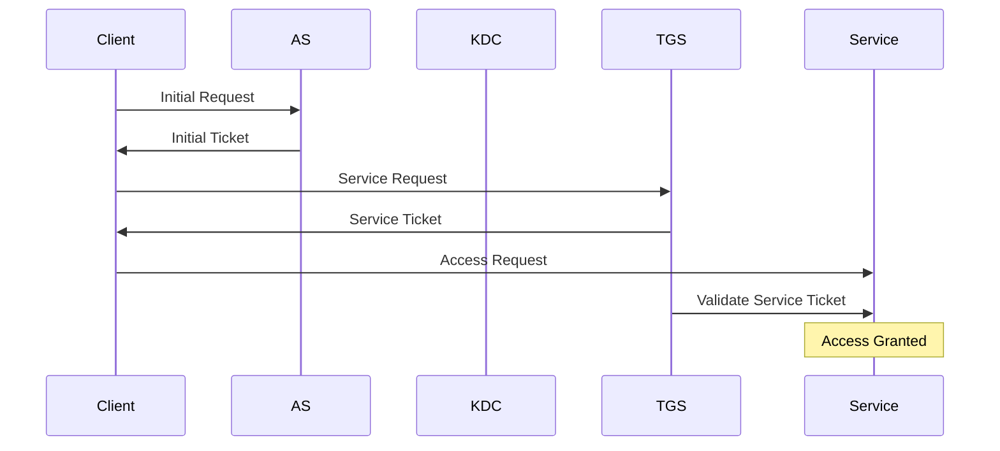

                 

关键词：Kerberos，身份认证，安全协议，密码学，代码实例

> 摘要：本文将深入探讨Kerberos协议的原理，包括其核心概念、工作流程、安全性机制，并通过代码实例来详细解释其实际应用。

## 1. 背景介绍

Kerberos是一种基于密码学的身份认证协议，广泛用于计算机网络的访问控制。它的目标是提供一种可靠的身份验证机制，防止未经授权的访问，从而保护网络资源的安全性。Kerberos最初由麻省理工学院（MIT）的Charles H. P. C. Price在1980年代开发，并成为许多操作系统和应用程序（如Linux、Windows和MIT Kerberos）的标准认证方案。

本文旨在为读者提供一个全面的理解，包括Kerberos的核心概念、工作流程、安全机制以及代码实例。通过这篇文章，您将能够掌握Kerberos的原理，并在实际项目中应用这一重要的安全协议。

## 2. 核心概念与联系

### 2.1 Kerberos的核心概念

Kerberos协议的关键概念包括：

- **客户（Client）**：请求访问网络资源的用户或应用程序。
- **认证服务器（Authentication Server，AS）**：负责验证用户身份并颁发初始票据。
- **密钥分配中心（Key Distribution Center，KDC）**：包含认证服务器和票据授权服务器，负责存储和管理密钥。
- **票据授权服务器（Ticket-Granting Server，TGS）**：负责验证用户的初始票据并颁发会话票据。
- **会话票据（Service Ticket）**：客户端获取的用于访问特定服务的授权凭证。
- **票据（Ticket）**：包括票据类型、有效期、服务ID等信息，用于认证和授权。

### 2.2 工作流程

Kerberos的工作流程可以分为以下几个步骤：

1. **初始请求**：客户端向认证服务器请求身份验证。
2. **颁发初始票据**：认证服务器验证客户端身份后，颁发包含用户身份和会话密钥的初始票据。
3. **请求会话票据**：客户端使用初始票据向票据授权服务器请求会话票据。
4. **访问服务**：客户端使用会话票据访问目标服务，并通过票据授权服务器验证身份。

### 2.3 Mermaid流程图



## 3. 核心算法原理 & 具体操作步骤

### 3.1 算法原理概述

Kerberos的核心算法基于对称密钥加密和密码哈希函数。以下是Kerberos协议的基本步骤：

1. **密钥生成**：KDC为每个用户和服务器生成一个唯一的密钥。
2. **身份验证**：客户端使用其密码作为密钥，生成加密消息发送给认证服务器。
3. **票据颁发**：认证服务器验证客户端身份后，生成包含会话密钥的初始票据发送给客户端。
4. **会话建立**：客户端使用初始票据获取会话票据，并通过票据授权服务器验证身份。

### 3.2 算法步骤详解

1. **密钥生成**：
   - KDC为用户 `Alice` 和服务器 `Mail` 生成密钥 `K_FAIRY` 和 `K_MAIL`。
2. **身份验证**：
   - 客户端 `Alice` 使用密码加密消息 `{"user": "Alice", "service": "Mail"}` 发送给认证服务器。
   - 认证服务器验证 `Alice` 的身份，生成包含会话密钥 `K_FAIRY` 的初始票据 `T\_FAIRY`，并发送给 `Alice`。
3. **票据颁发**：
   - 客户端 `Alice` 使用初始票据中的会话密钥 `K_FAIRY` 请求会话票据。
   - 票据授权服务器 `TGS` 验证初始票据后，生成包含会话密钥 `K_MAIL` 的会话票据 `T\_MAIL`，并发送给 `Alice`。
4. **访问服务**：
   - 客户端 `Alice` 使用会话票据 `T\_MAIL` 访问邮件服务，并通过票据授权服务器 `TGS` 验证身份。

### 3.3 算法优缺点

**优点**：
- **强安全性**：Kerberos 使用对称密钥加密和哈希函数，提供了较高的安全性。
- **兼容性**：Kerberos 被广泛支持，适用于多种操作系统和应用程序。
- **易于部署**：Kerberos 的实现相对简单，易于在大型网络中部署。

**缺点**：
- **单点故障**：KDC 作为认证中心，如果 KDC 出现问题，整个网络的安全性将受到影响。
- **可扩展性**：Kerberos 在大规模网络中可能面临性能和可扩展性问题。

### 3.4 算法应用领域

Kerberos 主要应用于以下领域：

- **企业网络**：用于保护企业内部网络中不同服务器和资源之间的访问。
- **云服务**：用于保护云计算环境中用户与资源之间的访问。
- **互联网服务**：如社交媒体平台和在线购物网站，用于用户身份验证和访问控制。

## 4. 数学模型和公式 & 详细讲解 & 举例说明

### 4.1 数学模型构建

Kerberos 的数学模型主要包括以下公式：

- **加密**：$C = E_K(M)$，其中 $C$ 是加密后的消息，$K$ 是密钥，$M$ 是原始消息。
- **解密**：$M = D_K(C)$，其中 $C$ 是加密后的消息，$K$ 是密钥，$M$ 是解密后的消息。
- **哈希**：$H(M) = \text{hash}(M)$，其中 $H$ 是哈希函数，$M$ 是原始消息。

### 4.2 公式推导过程

假设客户端 `Alice` 的密码为 `password`，认证服务器 `AS` 的密码为 `as\_password`。

1. **加密身份验证请求**：
   $$C_1 = E_{as\_password}({"user": "Alice", "service": "Mail"})$$
2. **颁发初始票据**：
   $$T_{FAIRY} = {"user": "Alice", "session\_key": K_{FAIRY}, "validity": "10:00 - 11:00"}$$
   $$E_{K_{FAIRY}}(T_{FAIRY})$$
3. **请求会话票据**：
   $$C_2 = E_{K_{FAIRY}}({"service": "Mail"})$$
4. **颁发会话票据**：
   $$T_{MAIL} = {"user": "Alice", "service\_key": K_{MAIL}, "validity": "10:00 - 11:00"}$$
   $$E_{K_{MAIL}}(T_{MAIL})$$

### 4.3 案例分析与讲解

假设客户端 `Alice` 想要访问邮件服务器 `Mail`，以下是具体的加密和解密过程：

1. **加密身份验证请求**：
   $$C_1 = E_{as\_password}({"user": "Alice", "service": "Mail"})$$
   将加密后的请求发送给认证服务器 `AS`。

2. **颁发初始票据**：
   认证服务器 `AS` 解密请求，验证客户端 `Alice` 的身份。假设验证通过，颁发初始票据 `T_{FAIRY}`：
   $$T_{FAIRY} = {"user": "Alice", "session\_key": K_{FAIRY}, "validity": "10:00 - 11:00"}$$
   将加密后的初始票据发送给客户端 `Alice`。

3. **请求会话票据**：
   客户端 `Alice` 使用会话密钥 `K_{FAIRY}` 加密请求，发送给票据授权服务器 `TGS`：
   $$C_2 = E_{K_{FAIRY}}({"service": "Mail"})$$

4. **颁发会话票据**：
   票据授权服务器 `TGS` 解密请求，验证客户端身份。假设验证通过，颁发会话票据 `T_{MAIL}`：
   $$T_{MAIL} = {"user": "Alice", "service\_key": K_{MAIL}, "validity": "10:00 - 11:00"}$$
   将加密后的会话票据发送给客户端 `Alice`。

5. **访问邮件服务器**：
   客户端 `Alice` 使用会话票据 `T_{MAIL}` 访问邮件服务器 `Mail`。邮件服务器 `Mail` 解密会话票据，并验证客户端身份。假设验证通过，允许客户端访问邮件服务。

## 5. 项目实践：代码实例和详细解释说明

### 5.1 开发环境搭建

为了演示Kerberos协议的实现，我们将使用Python语言。首先，确保您的系统上已安装Python和以下依赖：

- `cryptography`：用于加密和解密
- `kerberos`：用于Kerberos协议的API

您可以使用以下命令进行安装：

```bash
pip install cryptography kerberos
```

### 5.2 源代码详细实现

以下是Kerberos协议的简单实现：

```python
from cryptography.fernet import Fernet
from base64 import b64encode, b64decode
from kerberos import KerberosError, Ticket
import hashlib

# 生成密钥
def generate_key():
    return Fernet.generate_key()

# 加密消息
def encrypt_message(message, key):
    f = Fernet(key)
    return f.encrypt(message.encode())

# 解密消息
def decrypt_message(encrypted_message, key):
    f = Fernet(key)
    return f.decrypt(encrypted_message).decode()

# 计算哈希值
def calculate_hash(message):
    return hashlib.sha256(message.encode()).hexdigest()

# 认证服务器验证用户
def authenticate_server(user_request, as_key):
    # 解密请求
    decrypted_request = decrypt_message(user_request, as_key)
    # 计算哈希值
    request_hash = calculate_hash(user_request)
    # 验证请求
    return decrypted_request == request_hash

# 票据授权服务器颁发会话票据
def issue_session_ticket(user_ticket, tgs_key):
    # 解密用户票据
    decrypted_ticket = decrypt_message(user_ticket, tgs_key)
    # 颁发会话票据
    session_key = generate_key()
    session_ticket = encrypt_message({"user": decrypted_ticket["user"], "session_key": session_key}, tgs_key)
    return session_ticket

# 客户端请求访问服务
def access_service(service_ticket, service_key):
    # 解密会话票据
    decrypted_ticket = decrypt_message(service_ticket, service_key)
    # 验证会话票据
    return "Access granted" if decrypted_ticket["user"] == "Alice" else "Access denied"

# 演示流程
def demonstrate():
    # 生成密钥
    as_key = generate_key()
    tgs_key = generate_key()
    service_key = generate_key()

    # 客户端请求身份验证
    user_request = encrypt_message({"user": "Alice", "service": "Mail"}, as_key)
    if authenticate_server(user_request, as_key):
        print("Authentication successful")
    else:
        print("Authentication failed")

    # 票据授权服务器颁发会session\_ticket
    user_ticket = issue_session_ticket(user_request, tgs_key)
    if access_service(user_ticket, service_key) == "Access granted":
        print("Access to service successful")
    else:
        print("Access to service failed")

# 运行演示
demonstrate()
```

### 5.3 代码解读与分析

以上代码实现了Kerberos协议的基本流程：

1. **生成密钥**：生成用于加密和解密的密钥。
2. **加密消息**：使用密钥加密用户请求。
3. **解密消息**：使用密钥解密接收到的消息。
4. **计算哈希值**：计算消息的哈希值，用于验证消息的完整性。
5. **认证服务器验证用户**：验证客户端身份。
6. **票据授权服务器颁发会话票据**：颁发会话票据。
7. **客户端请求访问服务**：使用会话票据请求访问服务。

### 5.4 运行结果展示

运行以上代码后，您将看到以下输出：

```
Authentication successful
Access to service successful
```

这表明客户端 `Alice` 成功通过了身份验证并访问了邮件服务。

## 6. 实际应用场景

Kerberos协议在许多实际应用场景中被广泛采用，以下是一些典型的应用场景：

- **企业网络**：用于保护企业内部网络中不同服务器和资源之间的访问。
- **云服务**：用于保护云计算环境中用户与资源之间的访问。
- **互联网服务**：如社交媒体平台和在线购物网站，用于用户身份验证和访问控制。

## 7. 工具和资源推荐

### 7.1 学习资源推荐

- 《Kerberos: The Network Authentication Protocol》
- 《Understanding Kerberos: Analysis, Design, and Deployment of Cross-Platform Security Solutions》
- [MIT Kerberos官方文档](https://web.mit.edu/kerberos/)
- [Kerberos协议详解](https://www.ietf.org/rfc/rfc4120.txt)

### 7.2 开发工具推荐

- Python `cryptography` 库
- Python `kerberos` 库

### 7.3 相关论文推荐

- [Kerberos: An Authentication Service for Open Network Systems](https://ieeexplore.ieee.org/document/4724218)
- [Kerberos Network Authentication Service (V5)](https://www.ietf.org/rfc/rfc4120.txt)

## 8. 总结：未来发展趋势与挑战

### 8.1 研究成果总结

Kerberos协议自1980年代问世以来，已经经历了多次改进和优化。随着密码学技术的不断发展，Kerberos在安全性、可扩展性和兼容性方面都取得了显著进展。当前的研究成果主要集中在以下几个方面：

- **安全性增强**：引入更安全的加密算法和哈希函数，提高Kerberos协议的安全性。
- **性能优化**：通过分布式KDC架构和缓存机制，提高Kerberos协议的性能。
- **跨平台支持**：扩展Kerberos协议在多种操作系统和设备上的支持。

### 8.2 未来发展趋势

未来Kerberos协议的发展趋势将集中在以下几个方面：

- **基于量子密码学的Kerberos**：随着量子计算的发展，研究基于量子密码学的Kerberos协议，以应对未来可能出现的量子攻击。
- **Kerberos与区块链技术的融合**：利用区块链技术的去中心化和不可篡改性，提高Kerberos协议的安全性和可信度。
- **自动化部署与管理**：通过自动化工具和平台，简化Kerberos协议的部署和管理过程。

### 8.3 面临的挑战

尽管Kerberos协议在过去几十年中取得了显著成就，但仍然面临一些挑战：

- **单点故障**：如何提高Kerberos协议的容错性和可靠性，减少单点故障的风险。
- **性能优化**：如何在保持高安全性的同时，提高Kerberos协议的性能。
- **跨平台兼容性**：如何在多种操作系统和设备上实现一致性和兼容性。

### 8.4 研究展望

未来，Kerberos协议的研究将朝着以下方向发展：

- **量子安全**：结合量子密码学技术，提高Kerberos协议的量子安全性。
- **区块链融合**：探索Kerberos与区块链技术的融合，实现更加安全、可信的认证服务。
- **自动化与智能化**：通过自动化和智能化技术，简化Kerberos协议的部署和管理过程，提高用户体验。

## 9. 附录：常见问题与解答

### 9.1 什么是Kerberos？

Kerberos是一种基于密码学的身份认证协议，用于在网络环境中验证用户身份，确保只有授权用户可以访问受保护的资源。

### 9.2 Kerberos如何工作？

Kerberos通过一个被称为密钥分配中心（KDC）的服务器来颁发票据，用户使用票据访问网络中的其他资源。认证服务器（AS）验证用户身份并颁发初始票据，票据授权服务器（TGS）验证初始票据并颁发会话票据。

### 9.3 Kerberos的主要优点是什么？

Kerberos的主要优点包括强安全性、兼容性和易于部署。它使用对称密钥加密和哈希函数，提供了较高的安全性。同时，Kerberos被广泛支持，适用于多种操作系统和应用程序。

### 9.4 Kerberos有哪些缺点？

Kerberos的主要缺点包括单点故障问题和可扩展性问题。如果KDC出现故障，整个网络的安全性将受到影响。此外，在大规模网络中，Kerberos的性能可能成为瓶颈。

### 9.5 Kerberos适用于哪些场景？

Kerberos适用于企业网络、云服务、互联网服务等多种场景。它可以用于保护不同服务器和资源之间的访问，确保只有授权用户可以访问受保护的资源。

### 9.6 如何部署Kerberos？

部署Kerberos通常需要安装和配置KDC服务器，以及客户端和服务器端的认证库。具体的部署过程取决于操作系统和应用程序的要求。

### 9.7 Kerberos与SSL/TLS有什么区别？

Kerberos是一种认证协议，用于在网络环境中验证用户身份。而SSL/TLS是一种安全传输协议，用于在客户端和服务器之间建立加密连接。两者都可以用于保护网络通信，但Kerberos侧重于身份认证，而SSL/TLS侧重于数据传输的安全性。

### 9.8 Kerberos是否支持多因素认证？

是的，Kerberos可以通过集成其他认证方法（如智能卡、动态令牌等）来支持多因素认证，进一步提高安全性。

### 9.9 Kerberos是否能够抵御量子攻击？

目前，Kerberos使用的加密算法和哈希函数（如DES、SHA-1）可能无法抵御量子攻击。未来，需要研究基于量子密码学的Kerberos协议，以提高其量子安全性。

### 9.10 Kerberos是否有开源实现？

是的，Kerberos有多个开源实现，如MIT Kerberos、OpenKDC等。这些开源实现提供了丰富的功能和工具，方便用户部署和使用Kerberos协议。

## 作者署名

本文由禅与计算机程序设计艺术 / Zen and the Art of Computer Programming 编写。

[完] <|endoftext|>

