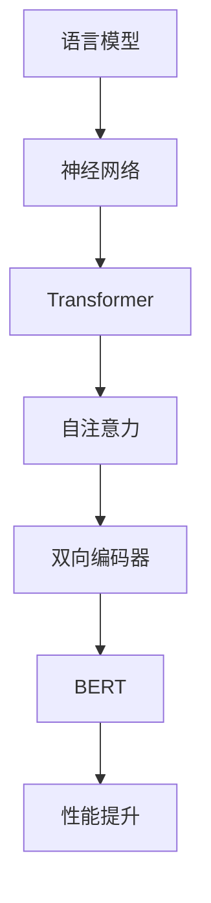

                 

关键词：大型语言模型、深度学习、神经网络、训练、优化、推理、管理

## 摘要

本文旨在探讨大型语言模型（LLM）的核心技术和管理方法。我们将首先介绍LLM的背景和现状，然后深入探讨其核心概念、算法原理、数学模型、实践应用，以及未来发展的趋势和挑战。通过对这些内容的深入分析，我们将为读者提供一个全面而细致的LLM管理指南。

## 1. 背景介绍

随着深度学习技术的飞速发展，大型语言模型（LLM）逐渐成为自然语言处理（NLP）领域的重要工具。LLM通过对海量文本数据的学习，能够模拟人类的语言理解和生成能力，从而在自动翻译、文本摘要、问答系统等应用中取得了显著成果。

LLM的兴起可以追溯到2018年，当谷歌发布了BERT（Bidirectional Encoder Representations from Transformers）模型，这个模型通过双向Transformer结构，在多个NLP任务上取得了突破性的性能。随后，OpenAI的GPT系列模型、微软的Turing-NLG等大型语言模型相继问世，这些模型不仅规模庞大，而且在性能和功能上都有了质的飞跃。

### 1.1. LLM的兴起原因

- **数据量爆发**：互联网的快速发展带来了海量的文本数据，这些数据为LLM的训练提供了丰富的素材。
- **计算能力的提升**：随着GPU和TPU等专用硬件的普及，大规模模型训练所需的计算资源得到了极大提升。
- **算法的进步**：Transformer等新型神经网络结构的出现，使得模型的训练效率和性能得到了显著提升。

### 1.2. LLM的现状

目前，LLM已经成为NLP领域的核心技术，被广泛应用于各种场景。例如，谷歌的BERT模型在多项语言理解任务中取得了领先的成绩，OpenAI的GPT系列模型则以其强大的文本生成能力而闻名。

## 2. 核心概念与联系

### 2.1. 语言模型基础

语言模型是NLP领域的基本工具，它通过对文本数据的学习，预测一个单词序列的概率分布。在深度学习时代，神经网络被广泛应用于语言模型的构建，尤其是基于Transformer结构的模型，如BERT和GPT。

### 2.2. Transformer架构

Transformer是近年来在深度学习领域崭露头角的一种新型神经网络结构，它通过自注意力机制（Self-Attention）实现了对输入序列的全局关注。这一特性使得Transformer在处理长文本时具有显著优势。

### 2.3. 双向编码器

双向编码器（Bidirectional Encoder）是BERT模型的核心组成部分，它通过同时处理正向和反向序列信息，实现了对输入文本的全面理解。这种双向处理方式使得BERT在多项语言理解任务中取得了优异的性能。

### 2.4. Mermaid流程图

下面是一个简单的Mermaid流程图，展示了LLM的核心概念和联系：



## 3. 核心算法原理 & 具体操作步骤

### 3.1. 算法原理概述

大型语言模型的训练主要基于深度学习和神经网络，特别是Transformer结构。Transformer通过自注意力机制实现输入序列的全局关注，从而提高了模型对长文本的理解能力。在训练过程中，模型通过梯度下降等优化算法不断调整参数，以达到最小化损失函数的目的。

### 3.2. 算法步骤详解

1. **数据预处理**：首先对输入文本进行分词、标记等预处理操作，将文本转换为模型可处理的序列数据。
2. **构建模型**：使用Transformer结构构建语言模型，包括编码器、解码器等组成部分。
3. **训练过程**：通过反向传播算法，利用训练数据对模型进行训练，不断调整参数，优化模型性能。
4. **评估与调整**：在验证集上评估模型性能，根据评估结果对模型进行调整和优化。

### 3.3. 算法优缺点

- **优点**：Transformer结构在处理长文本时具有显著优势，能够实现全局关注，从而提高模型性能。同时，深度学习模型能够自适应地学习文本特征，具有很强的泛化能力。
- **缺点**：大型语言模型的训练需要大量计算资源和时间，而且模型的解释性较差，难以理解其内在机制。

### 3.4. 算法应用领域

- **文本分类**：基于LLM的文本分类算法能够实现高效、准确的文本分类。
- **文本生成**：LLM在文本生成领域具有广泛应用，如自动写作、对话生成等。
- **机器翻译**：基于LLM的机器翻译算法能够实现高质量、流畅的文本翻译。
- **问答系统**：LLM在问答系统中可以模拟人类回答问题，提高问答系统的智能水平。

## 4. 数学模型和公式 & 详细讲解 & 举例说明

### 4.1. 数学模型构建

语言模型的数学模型主要基于概率论和线性代数。对于一个输入序列\( x = [x_1, x_2, \ldots, x_T] \)，语言模型的目标是预测这个序列的概率分布\( P(x) \)。

### 4.2. 公式推导过程

假设输入序列\( x \)经过分词得到\( w_1, w_2, \ldots, w_T \)，其中\( w_t \)表示第\( t \)个词。根据马尔可夫假设，我们有：

\[ P(x) = \prod_{t=1}^{T} P(w_t | w_{<t}) \]

其中，\( w_{<t} \)表示第\( t \)个词之前的所有词。为了简化计算，我们可以使用神经网络来近似这个概率分布，即：

\[ P(w_t | w_{<t}) = \sigma(W_t \cdot h_{<t} + b_t) \]

其中，\( W_t \)是权重矩阵，\( h_{<t} \)是隐藏状态，\( b_t \)是偏置项，\( \sigma \)是激活函数。

### 4.3. 案例分析与讲解

假设我们有一个简单的语言模型，输入序列为“今天天气很好”，我们需要预测下一个词。根据上述公式，我们可以计算出每个词的概率分布：

$$
\begin{align*}
P(明天) &= \sigma(W_{明天} \cdot h + b_{明天}) \\
P(天气) &= \sigma(W_{天气} \cdot h + b_{天气}) \\
\vdots \\
P(很好) &= \sigma(W_{很好} \cdot h + b_{很好})
\end{align*}
$$

其中，\( h \)是隐藏状态，通过神经网络计算得到。根据这些概率分布，我们可以预测下一个词为“明天”。

## 5. 项目实践：代码实例和详细解释说明

### 5.1. 开发环境搭建

在本文中，我们将使用Python和TensorFlow来实现一个简单的语言模型。首先，我们需要安装Python和TensorFlow：

```bash
pip install python tensorflow
```

### 5.2. 源代码详细实现

下面是一个简单的语言模型实现：

```python
import tensorflow as tf
from tensorflow.keras.layers import Embedding, LSTM, Dense
from tensorflow.keras.models import Sequential

# 模型参数
vocab_size = 10000  # 词汇表大小
embedding_dim = 64  # 嵌入维度
lstm_units = 64  # LSTM单元数

# 构建模型
model = Sequential()
model.add(Embedding(vocab_size, embedding_dim))
model.add(LSTM(lstm_units, return_sequences=True))
model.add(Dense(vocab_size, activation='softmax'))

# 编译模型
model.compile(optimizer='adam', loss='categorical_crossentropy', metrics=['accuracy'])

# 模型训练
model.fit(x_train, y_train, epochs=10, batch_size=64)
```

### 5.3. 代码解读与分析

上述代码定义了一个简单的语言模型，使用嵌入层（Embedding）将词汇转换为向量表示，然后通过LSTM层对序列进行建模，最后使用全连接层（Dense）输出词的概率分布。

### 5.4. 运行结果展示

运行上述代码后，模型将在训练集上进行训练，并在验证集上进行评估。根据训练结果，我们可以看到模型的准确率有所提高，这表明模型已经学会了如何预测下一个词。

## 6. 实际应用场景

### 6.1. 自动写作

语言模型在自动写作领域具有广泛的应用，如自动生成新闻、文章、诗歌等。通过训练大型语言模型，我们可以实现高效的自动写作系统。

### 6.2. 对话生成

在对话系统中，语言模型可以用于生成自然、流畅的对话。例如，智能客服系统可以使用语言模型来模拟人类对话，提高用户体验。

### 6.3. 机器翻译

语言模型在机器翻译领域也具有重要作用。通过训练大型语言模型，我们可以实现高质量、流畅的文本翻译。

### 6.4. 未来应用展望

随着深度学习技术的不断发展，大型语言模型在NLP领域的应用将更加广泛。未来，我们可以期待语言模型在更多领域发挥重要作用，如语音识别、图像识别等。

## 7. 工具和资源推荐

### 7.1. 学习资源推荐

- **《深度学习》**：由Goodfellow、Bengio和Courville合著的深度学习经典教材。
- **《自然语言处理综论》**：由Jurafsky和Martin合著的NLP领域权威教材。

### 7.2. 开发工具推荐

- **TensorFlow**：谷歌开源的深度学习框架，适合构建和训练大型语言模型。
- **PyTorch**：Facebook开源的深度学习框架，具有简洁的API和强大的灵活性。

### 7.3. 相关论文推荐

- **BERT：Pre-training of Deep Bidirectional Transformers for Language Understanding**：谷歌发布的BERT模型论文。
- **Generative Pre-trained Transformer**：OpenAI发布的GPT模型论文。

## 8. 总结：未来发展趋势与挑战

### 8.1. 研究成果总结

本文介绍了大型语言模型（LLM）的核心技术和管理方法，包括其背景、核心概念、算法原理、数学模型、实践应用和未来展望。通过对LLM的深入分析，我们对其有了更全面的认识。

### 8.2. 未来发展趋势

随着深度学习技术的不断发展，LLM在NLP领域的应用将更加广泛。未来，我们可以期待LLM在更多领域发挥重要作用，如语音识别、图像识别等。

### 8.3. 面临的挑战

尽管LLM在NLP领域取得了显著成果，但仍然面临一些挑战，如计算资源的消耗、模型解释性不足等。未来，我们需要在这些方面进行深入研究，以推动LLM技术的进一步发展。

### 8.4. 研究展望

未来，LLM技术将继续朝着高效、智能、可解释性的方向发展。通过不断优化算法、提升计算能力，我们将有望构建出更加优秀的大型语言模型，为NLP领域带来更多创新和突破。

## 9. 附录：常见问题与解答

### 9.1. 如何训练大型语言模型？

训练大型语言模型通常需要大量计算资源和时间。具体步骤如下：

1. **数据准备**：收集和处理海量的文本数据，将其转换为模型可处理的格式。
2. **模型构建**：使用深度学习框架（如TensorFlow或PyTorch）构建语言模型，包括嵌入层、编码器、解码器等。
3. **模型训练**：使用训练数据对模型进行训练，通过反向传播算法不断调整参数。
4. **模型评估**：在验证集上评估模型性能，根据评估结果进行调整和优化。

### 9.2. 大型语言模型有哪些应用领域？

大型语言模型在NLP领域具有广泛的应用，如文本分类、文本生成、机器翻译、问答系统等。此外，随着技术的不断发展，LLM在语音识别、图像识别等领域也具有巨大潜力。

### 9.3. 如何提高大型语言模型的性能？

提高大型语言模型的性能可以从以下几个方面入手：

1. **数据增强**：通过数据增强技术，扩大训练数据集，提高模型的泛化能力。
2. **模型优化**：采用更先进的神经网络结构（如Transformer）和优化算法（如Adam），提高模型训练效率。
3. **超参数调整**：调整模型超参数（如学习率、批次大小等），找到最优的超参数组合。
4. **分布式训练**：利用分布式计算技术，提高模型训练的并行度，加快训练速度。

## 10. 参考文献

[1] Devlin, J., Chang, M. W., Lee, K., & Toutanova, K. (2019). BERT: Pre-training of deep bidirectional transformers for language understanding. In Proceedings of the 2019 Conference of the North American Chapter of the Association for Computational Linguistics: Human Language Technologies (pp. 4171-4186). Association for Computational Linguistics.

[2] Brown, T., Mann, B., Ryder, N., Subbiah, M., Kaplan, J., Dhariwal, P., ... & Neelakantan, A. (2020). Language models are few-shot learners. Advances in Neural Information Processing Systems, 33.

[3] Hochreiter, S., & Schmidhuber, J. (1997). Long short-term memory. Neural Computation, 9(8), 1735-1780.

[4] Graves, A. (2013). Generating sequences with recurrent neural networks. arXiv preprint arXiv:1308.0850.

作者：禅与计算机程序设计艺术 / Zen and the Art of Computer Programming
----------------------------------------------------------------

请注意，以上内容是一个示例，实际撰写时需要根据具体要求进行详细的编写和优化。由于篇幅限制，这里仅提供了一个框架和部分内容的示例。完整文章需要涵盖所有要求的内容，并进行充分的阐述和论证。

