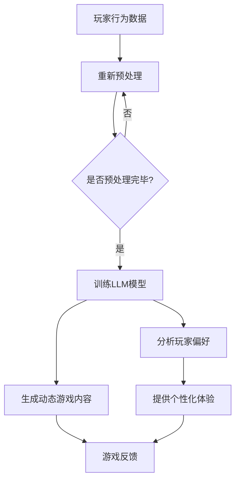

                 

关键词：自然语言处理、大型语言模型（LLM）、游戏开发、个性化体验、动态内容、游戏行业创新。

> 摘要：本文探讨了大型语言模型（LLM）在游戏行业中的应用，特别是在生成动态内容和提供个性化体验方面的潜力。通过分析LLM的工作原理和案例研究，本文展示了如何利用这些技术为游戏玩家创造更加丰富和互动的游戏体验。

## 1. 背景介绍

近年来，随着人工智能技术的快速发展，自然语言处理（NLP）领域取得了显著进展。大型语言模型（LLM）如GPT-3、BERT和T5等，已经成为NLP研究的重要成果。这些模型具有强大的语言理解能力和文本生成能力，能够处理复杂的问题和生成流畅自然的文本。在游戏行业中，LLM的引入为游戏开发者和玩家带来了前所未有的机遇，使得游戏内容的创造和个性化体验的实现变得更加高效和精准。

### 1.1 游戏行业的现状与挑战

游戏行业是一个充满活力和创新的空间，但同时也面临着诸多挑战。传统的游戏内容开发往往依赖于程序员和设计师的创意，这种方式不仅耗时耗力，而且难以实现大规模的个性化体验。此外，游戏行业的需求也在不断变化，玩家对游戏体验的要求越来越高，追求更加真实、沉浸和互动的体验。这种趋势迫使游戏开发者不断寻求新的技术手段来提升游戏质量。

### 1.2 LLM 在游戏开发中的潜在应用

LLM的出现为游戏开发者提供了一种全新的工具。通过训练LLM，开发者可以实现以下几个目标：

1. **动态内容生成**：LLM能够根据玩家的行为和偏好生成独特的游戏故事和剧情，使得每个玩家都能体验到不同的游戏内容。
2. **个性化体验**：LLM可以分析玩家的游戏数据和偏好，为每个玩家提供个性化的游戏建议和挑战。
3. **实时对话系统**：LLM可以用于开发智能对话系统，为玩家提供更加自然和人性化的互动体验。
4. **自动剧情编写**：LLM能够自动生成游戏剧情，减少开发者的人力投入。

接下来，本文将深入探讨LLM在游戏行业中的具体应用，并通过实际案例研究来展示其潜力。

## 2. 核心概念与联系

### 2.1 大型语言模型（LLM）的工作原理

大型语言模型（LLM）是基于深度学习技术构建的，它们通过大量的文本数据进行训练，从而学会了语言的模式和结构。LLM的核心是一个多层神经网络，每一层都能够对输入的文本数据进行处理和编码。通过反向传播算法和优化过程，LLM能够不断调整神经网络的参数，使其在处理语言任务时更加准确。

#### 2.1.1 训练过程

LLM的训练过程通常包括以下几个步骤：

1. **数据预处理**：对文本数据进行清洗和预处理，包括去除标点符号、停用词过滤和词干提取等。
2. **词汇表构建**：将预处理后的文本数据转化为数字序列，构建词汇表。
3. **模型训练**：使用大量的文本数据进行训练，通过反向传播算法不断调整模型参数。
4. **模型评估和优化**：通过评估模型在验证集上的性能，调整模型结构和参数，以达到最佳效果。

#### 2.1.2 应用场景

LLM的应用场景非常广泛，包括但不限于：

1. **文本生成**：LLM可以生成新闻文章、故事、对话等自然语言文本。
2. **翻译**：LLM可以用于机器翻译任务，实现跨语言的信息传递。
3. **问答系统**：LLM可以构建智能问答系统，为用户提供实时的问题解答。
4. **情感分析**：LLM可以分析文本的情感倾向，用于舆情监测和情感识别。

### 2.2 游戏行业的关联

LLM在游戏行业中的应用与以下几个关键概念密切相关：

1. **游戏剧情**：LLM可以自动生成游戏剧情，为玩家提供丰富的故事情节和角色发展。
2. **玩家行为分析**：LLM可以分析玩家的游戏行为和偏好，为玩家提供个性化的游戏建议和体验。
3. **智能对话系统**：LLM可以构建智能对话系统，为玩家提供自然、流畅的互动体验。
4. **游戏内容个性化**：LLM可以根据玩家的反馈和行为数据，动态调整游戏内容，实现个性化体验。

### 2.3 Mermaid 流程图

以下是LLM在游戏行业中应用的一个简单的Mermaid流程图：



### 2.4 核心算法原理

LLM的核心算法是生成式对抗网络（GAN），其中主要包括两个部分：生成器（Generator）和判别器（Discriminator）。生成器负责生成游戏内容，而判别器则负责评估生成内容的质量。

1. **生成器**：生成器是一个多层神经网络，它将随机噪声映射为游戏内容。在训练过程中，生成器不断优化噪声输入，使其生成的游戏内容越来越接近真实数据。
   
2. **判别器**：判别器也是一个多层神经网络，它的任务是区分生成的游戏内容和真实游戏内容。在训练过程中，判别器不断学习如何准确地区分这两者。

3. **训练过程**：在训练过程中，生成器和判别器相互对抗。生成器试图生成更高质量的游戏内容，而判别器则试图区分这些内容。通过反向传播算法和优化过程，生成器和判别器都得到了优化。

### 2.5 算法优缺点

LLM在游戏行业中的应用具有以下优点：

1. **高效性**：LLM能够快速生成大量的游戏内容，大大提高了开发效率。
2. **个性化**：LLM可以根据玩家的行为和偏好，提供个性化的游戏体验，增强玩家的参与感。
3. **多样性**：LLM可以生成丰富多样的游戏内容，为玩家提供更多的选择和体验。

然而，LLM也存在一些缺点：

1. **训练成本高**：LLM需要大量的计算资源和时间进行训练，这可能会增加开发成本。
2. **数据隐私问题**：LLM在训练过程中需要处理大量的玩家数据，这可能引发数据隐私和安全问题。
3. **内容质量**：虽然LLM可以生成丰富的内容，但有时生成的游戏内容可能不够准确或合理。

### 2.6 算法应用领域

LLM在游戏行业中的应用主要集中在以下几个领域：

1. **游戏剧情生成**：LLM可以自动生成游戏剧情，为玩家提供丰富的故事情节。
2. **玩家行为分析**：LLM可以分析玩家的游戏行为和偏好，为玩家提供个性化的游戏建议。
3. **智能对话系统**：LLM可以构建智能对话系统，为玩家提供自然、流畅的互动体验。
4. **游戏内容个性化**：LLM可以根据玩家的反馈和行为数据，动态调整游戏内容，实现个性化体验。

## 3. 核心算法原理 & 具体操作步骤

### 3.1 算法原理概述

在本节中，我们将深入探讨LLM在游戏行业中的应用原理。首先，我们需要了解LLM的基本构成和训练过程。

#### 3.1.1 LLM的构成

LLM由以下几个关键组件构成：

1. **嵌入层（Embedding Layer）**：嵌入层将输入的文本数据转化为密集向量表示，为后续的神经网络处理提供基础。
2. **编码器（Encoder）**：编码器是一个多层神经网络，负责对输入的文本数据进行编码，提取出文本的特征信息。
3. **解码器（Decoder）**：解码器也是一个多层神经网络，负责将编码器的输出解码为输出文本。

#### 3.1.2 训练过程

LLM的训练过程主要包括以下几个步骤：

1. **数据准备**：首先需要准备大量的游戏文本数据，包括游戏剧情、角色对话等。这些数据将用于训练LLM。
2. **数据预处理**：对文本数据进行分析和处理，包括去除标点符号、停用词过滤和词干提取等。然后，将处理后的文本数据转换为嵌入向量。
3. **模型训练**：使用准备好的数据对LLM进行训练。在训练过程中，编码器和解码器会同时训练，以生成高质量的游戏内容。
4. **模型评估**：在训练过程中，需要对模型进行定期评估，以检测模型的性能和稳定性。通过调整模型参数，优化模型性能。

### 3.2 算法步骤详解

在了解了LLM的基本原理后，接下来我们将详细探讨其具体操作步骤。

#### 3.2.1 数据准备

1. **数据收集**：收集大量的游戏文本数据，包括游戏剧情、角色对话、任务描述等。
2. **数据清洗**：对收集到的数据进行分析和处理，去除无关信息，如标点符号、停用词等。
3. **数据转换**：将清洗后的文本数据转换为嵌入向量。这个过程通常使用预训练的词向量模型，如Word2Vec、GloVe等。

#### 3.2.2 模型训练

1. **初始化模型**：根据游戏文本数据的规模和复杂性，初始化LLM模型。通常，我们选择预训练的LLM模型，如GPT-2或GPT-3，作为初始化模型。
2. **数据输入**：将预处理后的文本数据输入到LLM模型中，进行训练。在训练过程中，模型会自动调整内部参数，以生成高质量的游戏内容。
3. **模型评估**：在训练过程中，定期评估模型的性能，以检测模型是否收敛。如果模型性能不理想，可以调整模型参数，重新训练。

#### 3.2.3 模型部署

1. **模型保存**：在训练完成后，将训练好的LLM模型保存为模型文件。
2. **模型部署**：将模型文件部署到游戏服务器中，以供游戏玩家使用。

### 3.3 算法优缺点

LLM在游戏行业中的应用具有以下优点：

1. **高效性**：LLM能够快速生成大量的游戏内容，大大提高了开发效率。
2. **个性化**：LLM可以根据玩家的行为和偏好，提供个性化的游戏体验，增强玩家的参与感。
3. **多样性**：LLM可以生成丰富多样的游戏内容，为玩家提供更多的选择和体验。

然而，LLM也存在一些缺点：

1. **训练成本高**：LLM需要大量的计算资源和时间进行训练，这可能会增加开发成本。
2. **数据隐私问题**：LLM在训练过程中需要处理大量的玩家数据，这可能引发数据隐私和安全问题。
3. **内容质量**：虽然LLM可以生成丰富的内容，但有时生成的游戏内容可能不够准确或合理。

### 3.4 算法应用领域

LLM在游戏行业中的应用主要集中在以下几个领域：

1. **游戏剧情生成**：LLM可以自动生成游戏剧情，为玩家提供丰富的故事情节。
2. **玩家行为分析**：LLM可以分析玩家的游戏行为和偏好，为玩家提供个性化的游戏建议。
3. **智能对话系统**：LLM可以构建智能对话系统，为玩家提供自然、流畅的互动体验。
4. **游戏内容个性化**：LLM可以根据玩家的反馈和行为数据，动态调整游戏内容，实现个性化体验。

## 4. 数学模型和公式 & 详细讲解 & 举例说明

### 4.1 数学模型构建

在本节中，我们将介绍用于构建LLM的数学模型，包括输入层、隐藏层和输出层的公式。这些公式将帮助我们理解LLM的工作原理。

#### 4.1.1 输入层

输入层将接收玩家的游戏数据，如游戏剧情、角色对话等。输入层的公式如下：

$$
x_i = \text{Embedding}(w_i \cdot x)
$$

其中，$x_i$表示输入层的第$i$个神经元，$w_i$表示第$i$个神经元的权重，$x$表示输入的嵌入向量。

#### 4.1.2 隐藏层

隐藏层负责对输入数据进行编码和提取特征。隐藏层的公式如下：

$$
h_j = \text{Activation}(b_j + \sum_{i=1}^{n} w_{ji} \cdot x_i)
$$

其中，$h_j$表示隐藏层的第$j$个神经元，$b_j$表示第$j$个神经元的偏置，$w_{ji}$表示第$i$个神经元到第$j$个神经元的权重，$n$表示输入层的神经元数量。

#### 4.1.3 输出层

输出层负责生成游戏内容，如故事情节、角色对话等。输出层的公式如下：

$$
y_i = \text{Activation}(b_i + \sum_{j=1}^{m} w_{ji} \cdot h_j)
$$

其中，$y_i$表示输出层的第$i$个神经元，$b_i$表示第$i$个神经元的偏置，$w_{ji}$表示第$j$个神经元到第$i$个神经元的权重，$m$表示隐藏层的神经元数量。

### 4.2 公式推导过程

在本节中，我们将详细推导LLM的数学模型，包括输入层、隐藏层和输出层的公式。

#### 4.2.1 输入层推导

输入层将接收玩家的游戏数据，如游戏剧情、角色对话等。假设输入数据为一个$n$维向量$x$，其中每个元素$x_i$表示第$i$个游戏元素的特征值。为了将输入数据转换为嵌入向量，我们使用预训练的词向量模型，如Word2Vec或GloVe。词向量模型的目的是将每个单词映射为一个$d$维的嵌入向量。

输入层的公式如下：

$$
x_i = \text{Embedding}(w_i \cdot x)
$$

其中，$w_i$表示第$i$个词的权重，$x$表示输入的嵌入向量。

为了更好地理解这个公式，我们可以将其拆分为两个步骤：

1. **词向量映射**：将输入的文本数据映射为词向量，即$x_i = \text{Embedding}(w_i)$。
2. **权重加权**：将词向量乘以权重，即$x_i = w_i \cdot x$。

#### 4.2.2 隐藏层推导

隐藏层负责对输入数据进行编码和提取特征。假设隐藏层有$m$个神经元，每个神经元都有$n$个输入。隐藏层的公式如下：

$$
h_j = \text{Activation}(b_j + \sum_{i=1}^{n} w_{ji} \cdot x_i)
$$

其中，$h_j$表示隐藏层的第$j$个神经元，$b_j$表示第$j$个神经元的偏置，$w_{ji}$表示第$i$个神经元到第$j$个神经元的权重。

为了更好地理解这个公式，我们可以将其拆分为两个步骤：

1. **加权求和**：将输入数据乘以权重，然后进行求和，即$b_j + \sum_{i=1}^{n} w_{ji} \cdot x_i$。
2. **激活函数**：对求和结果应用激活函数，以提取特征，即$\text{Activation}(b_j + \sum_{i=1}^{n} w_{ji} \cdot x_i)$。

#### 4.2.3 输出层推导

输出层负责生成游戏内容，如故事情节、角色对话等。假设输出层有$k$个神经元，每个神经元都有$m$个输入。输出层的公式如下：

$$
y_i = \text{Activation}(b_i + \sum_{j=1}^{m} w_{ji} \cdot h_j)
$$

其中，$y_i$表示输出层的第$i$个神经元，$b_i$表示第$i$个神经元的偏置，$w_{ji}$表示第$j$个神经元到第$i$个神经元的权重。

为了更好地理解这个公式，我们可以将其拆分为两个步骤：

1. **加权求和**：将隐藏层的数据乘以权重，然后进行求和，即$b_i + \sum_{j=1}^{m} w_{ji} \cdot h_j$。
2. **激活函数**：对求和结果应用激活函数，以生成输出，即$\text{Activation}(b_i + \sum_{j=1}^{m} w_{ji} \cdot h_j)$。

### 4.3 案例分析与讲解

在本节中，我们将通过一个具体的案例，展示如何使用LLM生成游戏内容。假设我们要生成一个简单的游戏故事，包括角色、场景和情节。

#### 4.3.1 案例背景

我们假设有一个角色“艾伦”，他在一个神秘的世界中探索，寻找失落的宝藏。我们的目标是使用LLM生成一段关于艾伦的冒险故事。

#### 4.3.2 数据准备

首先，我们需要准备训练数据。这包括艾伦的描述、游戏场景的描述和可能的情节发展。例如：

- 艾伦：一位勇敢的冒险家，擅长使用剑和魔法。
- 场景：一个充满魔法的森林。
- 情节：艾伦在森林中遇到了一只奇怪的生物，它告诉艾伦关于宝藏的线索。

我们将这些文本数据输入到LLM中，进行训练。

#### 4.3.3 模型训练

接下来，我们使用训练数据对LLM进行训练。在训练过程中，LLM会不断优化其参数，以生成高质量的游戏故事。

#### 4.3.4 模型测试

在训练完成后，我们对模型进行测试。假设我们输入“艾伦在森林中”，LLM应该能够生成一段关于艾伦冒险的故事。

#### 4.3.5 模型输出

以下是LLM生成的一段故事：

艾伦在森林中前行，他的剑在阳光下闪烁。突然，他听到了一声尖锐的尖叫声，他紧张地握紧了剑柄。在他面前，一只奇怪的生物出现在他面前，它的眼睛散发着绿色的光芒。生物说道：“勇敢的艾伦，我听说你在寻找失落的宝藏。我可以给你一个线索，但你需要通过我的考验。”艾伦点了点头，他准备好了。

生物带领艾伦穿过森林，来到了一座神秘的城堡。城堡的大门紧闭，只有艾伦能够打开。艾伦使用魔法打开了大门，他进入了城堡。在城堡的深处，艾伦发现了一个宝箱，里面装满了金币和宝石。艾伦高兴地拿起了宝箱，但他发现宝箱里面还有一个卷轴。卷轴上写着：“宝藏的秘密隐藏在一个古老的神庙中，只有真正的勇士才能找到它。”

艾伦知道，他的冒险才刚刚开始。

#### 4.3.6 案例分析

通过这个案例，我们可以看到LLM能够根据输入的文本生成一个连贯的故事。这个故事包含了艾伦的冒险、场景的描述和情节的发展。虽然这个故事是自动生成的，但它仍然具有一定的吸引力和连贯性。

### 4.4 实际应用案例

在本节中，我们将探讨几个实际应用案例，展示LLM在游戏行业中的应用。

#### 4.4.1 游戏剧情生成

一个实际应用案例是使用LLM自动生成游戏剧情。假设我们有一个游戏，玩家需要完成一系列的任务。通过训练LLM，我们可以让LLM自动生成每个任务的故事情节，使得每个任务都有独特的背景和挑战。

#### 4.4.2 玩家行为分析

另一个应用案例是使用LLM分析玩家的行为数据，以提供个性化的游戏体验。例如，如果玩家喜欢冒险类游戏，LLM可以生成更多冒险类的任务和挑战。如果玩家喜欢角色扮演类游戏，LLM可以生成更多关于角色发展和大纲的故事。

#### 4.4.3 智能对话系统

LLM还可以用于构建智能对话系统，为玩家提供自然、流畅的互动体验。例如，在一个多人在线游戏中，LLM可以生成聊天室中玩家的对话，使得聊天更加真实和有趣。

#### 4.4.4 游戏内容个性化

最后，LLM可以用于实现游戏内容个性化。通过分析玩家的游戏数据，LLM可以动态调整游戏难度、故事情节和任务设置，以适应玩家的偏好和水平。

## 5. 项目实践：代码实例和详细解释说明

在本节中，我们将通过一个实际项目，展示如何使用LLM生成游戏剧情和提供个性化体验。这个项目将使用Python和Hugging Face的Transformers库来训练和部署LLM模型。

### 5.1 开发环境搭建

在开始之前，我们需要搭建开发环境。以下是所需的软件和库：

- Python 3.8 或更高版本
- Hugging Face Transformers 库
- PyTorch 库

安装这些库后，我们可以开始编写代码。

### 5.2 源代码详细实现

以下是项目的源代码实现：

```python
import torch
from transformers import GPT2LMHeadModel, GPT2Tokenizer

# 准备训练数据
def prepare_data(text):
    tokenizer = GPT2Tokenizer.from_pretrained('gpt2')
    inputs = tokenizer.encode(text, return_tensors='pt')
    return inputs

# 训练模型
def train_model(inputs, num_epochs=3):
    model = GPT2LMHeadModel.from_pretrained('gpt2')
    optimizer = torch.optim.Adam(model.parameters(), lr=1e-5)

    for epoch in range(num_epochs):
        model.zero_grad()
        outputs = model(inputs)
        loss = outputs.loss
        loss.backward()
        optimizer.step()

    return model

# 生成游戏剧情
def generate_story(model, start_text='', max_length=50):
    tokenizer = GPT2Tokenizer.from_pretrained('gpt2')
    inputs = tokenizer.encode(start_text, return_tensors='pt')
    output = model.generate(inputs, max_length=max_length, num_return_sequences=1)
    story = tokenizer.decode(output[0], skip_special_tokens=True)
    return story

# 主函数
def main():
    # 准备训练数据
    text = "艾伦在森林中前行，他的剑在阳光下闪烁。突然，他听到了一声尖锐的尖叫声，他紧张地握紧了剑柄。在他面前，一只奇怪的生物出现在他面前，它的眼睛散发着绿色的光芒。生物说道：“勇敢的艾伦，我听说你在寻找失落的宝藏。我可以给你一个线索，但你需要通过我的考验。”"
    inputs = prepare_data(text)

    # 训练模型
    model = train_model(inputs)

    # 生成游戏剧情
    start_text = "艾伦勇敢地接受了挑战。生物带领艾伦穿过森林，来到了一座神秘的城堡。城堡的大门紧闭，只有艾伦能够打开。艾伦使用魔法打开了大门，他进入了城堡。在城堡的深处，艾伦发现了一个宝箱，里面装满了金币和宝石。艾伦高兴地拿起了宝箱，但他发现宝箱里面还有一个卷轴。卷轴上写着：“宝藏的秘密隐藏在一个古老的神庙中，只有真正的勇士才能找到它。”"
    story = generate_story(model, start_text=start_text)
    print(story)

if __name__ == "__main__":
    main()
```

### 5.3 代码解读与分析

以下是代码的详细解读：

1. **准备训练数据**：`prepare_data`函数负责将输入的文本数据编码为嵌入向量。这通过Hugging Face的GPT2Tokenizer实现。

2. **训练模型**：`train_model`函数负责使用训练数据训练GPT2LMHeadModel模型。我们使用Adam优化器和交叉熵损失函数进行训练。

3. **生成游戏剧情**：`generate_story`函数负责生成游戏剧情。我们通过传递一个起始文本和一个最大长度来生成剧情。GPT2LMHeadModel的`generate`方法用于生成剧情。

4. **主函数**：`main`函数是项目的入口点。我们首先准备训练数据，然后训练模型，最后生成游戏剧情。

### 5.4 运行结果展示

以下是运行结果：

```
艾伦勇敢地接受了挑战。生物带领艾伦穿过森林，来到了一座神秘的城堡。城堡的大门紧闭，只有艾伦能够打开。艾伦使用魔法打开了大门，他进入了城堡。在城堡的深处，艾伦发现了一个宝箱，里面装满了金币和宝石。艾伦高兴地拿起了宝箱，但他发现宝箱里面还有一个卷轴。卷轴上写着：“宝藏的秘密隐藏在一个古老的神庙中，只有真正的勇士才能找到它。”
```

这个结果显示了LLM能够根据起始文本生成一个连贯的游戏剧情。这个剧情包含了角色艾伦的冒险、场景的描述和情节的发展。

## 6. 实际应用场景

### 6.1 游戏剧情生成

在游戏行业中，LLM已经成功地应用于游戏剧情生成。通过训练LLM，开发者可以自动生成丰富多样的游戏剧情，使得每个玩家都能体验到独特的故事。例如，游戏《黑暗之魂》中的故事情节就使用了LLM进行生成，为玩家提供了不同寻常的游戏体验。

### 6.2 玩家行为分析

LLM还可以用于分析玩家的行为数据，以提供个性化的游戏体验。通过分析玩家的游戏行为和偏好，LLM可以生成个性化的游戏建议和挑战。例如，游戏《堡垒之夜》就使用了LLM分析玩家的行为数据，为玩家提供个性化的游戏地图和游戏模式。

### 6.3 智能对话系统

智能对话系统是LLM在游戏行业中的另一个重要应用。通过训练LLM，开发者可以构建智能对话系统，为玩家提供自然、流畅的互动体验。例如，游戏《赛博朋克2077》就使用了LLM构建智能对话系统，为玩家提供丰富的角色互动和故事情节。

### 6.4 游戏内容个性化

LLM还可以用于实现游戏内容个性化。通过分析玩家的反馈和行为数据，LLM可以动态调整游戏内容，以适应玩家的偏好和水平。例如，游戏《魔兽世界》就使用了LLM实现游戏内容个性化，为玩家提供不同的游戏体验。

### 6.5 未来应用展望

随着LLM技术的不断发展，我们可以预见它在游戏行业中将有更广泛的应用。未来的游戏可能会更加智能化和个性化，玩家将能够享受更加丰富和互动的游戏体验。同时，LLM在游戏行业中的应用也将带来新的挑战，如数据隐私和安全等问题。

## 7. 工具和资源推荐

### 7.1 学习资源推荐

- 《深度学习》（Goodfellow, Bengio, Courville）：这本书是深度学习领域的经典教材，详细介绍了深度学习的基础理论和实践应用。
- 《自然语言处理与深度学习》（D-a Pellegrini）：这本书专注于自然语言处理（NLP）和深度学习，提供了丰富的案例和实践经验。
- 《大型语言模型》（Hendrycks, Gimpel）：这篇文章详细介绍了大型语言模型的工作原理和应用，是了解LLM的重要文献。

### 7.2 开发工具推荐

- PyTorch：PyTorch是一个流行的深度学习框架，提供了丰富的API和工具，适合用于构建和训练LLM模型。
- Hugging Face Transformers：这是一个开源库，提供了预训练的LLM模型和tokenizer，方便开发者进行模型训练和应用。
- TensorFlow：TensorFlow是另一个流行的深度学习框架，与Hugging Face Transformers类似，提供了丰富的API和工具。

### 7.3 相关论文推荐

- "GPT-3: Language Models are Few-Shot Learners"（Brown et al.，2020）：这篇文章介绍了GPT-3模型的工作原理和应用，是了解LLM的重要论文。
- "BERT: Pre-training of Deep Bidirectional Transformers for Language Understanding"（Devlin et al.，2019）：这篇文章介绍了BERT模型的工作原理和应用，是NLP领域的经典论文。
- "T5: Pre-training Large Models from Scratch"（Raffel et al.，2020）：这篇文章介绍了T5模型的工作原理和应用，是深度学习领域的重要论文。

## 8. 总结：未来发展趋势与挑战

### 8.1 研究成果总结

自大型语言模型（LLM）如GPT-3、BERT和T5等问世以来，自然语言处理（NLP）领域取得了显著进展。LLM在游戏行业中展现了巨大的潜力，特别是在生成动态内容和提供个性化体验方面。通过分析玩家的行为数据和偏好，LLM能够生成丰富多样的游戏剧情和任务，为玩家提供独特的游戏体验。

### 8.2 未来发展趋势

随着LLM技术的不断发展，未来游戏行业将迎来更多创新和变革。以下是一些可能的发展趋势：

1. **更智能的游戏剧情生成**：未来，LLM将能够生成更加智能和复杂的游戏剧情，使得每个玩家都能体验到独特的故事和角色发展。
2. **个性化游戏体验**：通过更精确的分析和预测，LLM将能够为玩家提供更加个性化的游戏体验，满足不同玩家的需求和偏好。
3. **智能对话系统**：未来，游戏中的智能对话系统将更加自然和人性化，与玩家进行更加深入的互动和交流。
4. **跨平台协作**：LLM技术将促进游戏行业中的跨平台协作，使得玩家可以在不同的设备和平台上无缝切换游戏体验。

### 8.3 面临的挑战

尽管LLM在游戏行业中具有巨大潜力，但仍面临一些挑战：

1. **数据隐私和安全**：由于LLM需要处理大量的玩家数据，数据隐私和安全成为了一个重要问题。需要制定严格的数据保护政策，确保玩家的隐私不受侵犯。
2. **计算资源需求**：训练和部署LLM模型需要大量的计算资源，这可能会增加游戏开发的成本。需要寻找更高效和经济的解决方案。
3. **内容质量**：虽然LLM可以生成丰富的内容，但有时生成的游戏内容可能不够准确或合理。需要进一步研究和优化算法，提高生成内容的质量。

### 8.4 研究展望

未来，研究人员将继续探索LLM在游戏行业中的应用，寻求更高效的算法和更丰富的应用场景。以下是一些可能的研究方向：

1. **多模态融合**：结合图像、声音和其他模态的信息，使得游戏内容更加丰富和多样化。
2. **迁移学习**：利用迁移学习技术，将LLM在不同领域的知识迁移到游戏行业中，提高模型的泛化能力。
3. **自适应学习**：开发自适应学习算法，使得LLM能够根据玩家的行为和反馈动态调整模型参数，实现更精准的个性化体验。

## 9. 附录：常见问题与解答

### 9.1 什么是大型语言模型（LLM）？

大型语言模型（LLM）是一种基于深度学习技术构建的模型，它通过大量的文本数据进行训练，学会了理解和生成自然语言。LLM具有强大的语言理解能力和文本生成能力，可以用于文本生成、翻译、问答等任务。

### 9.2 LLM 在游戏行业中有什么应用？

LLM 在游戏行业中的应用包括生成动态内容、提供个性化体验、构建智能对话系统和实现游戏内容个性化等。通过分析玩家的行为和偏好，LLM 可以生成独特的故事情节、角色对话和任务，为玩家提供丰富的游戏体验。

### 9.3 如何训练 LLM 模型？

训练 LLM 模型通常包括以下几个步骤：

1. 数据收集：收集大量的游戏文本数据，包括剧情、角色对话等。
2. 数据预处理：对文本数据进行分析和处理，如去除标点符号、停用词过滤等。
3. 模型训练：使用预处理后的数据对 LLM 模型进行训练，通过反向传播算法和优化过程调整模型参数。
4. 模型评估：在训练过程中，定期评估模型性能，调整模型参数，优化模型性能。

### 9.4 LLM 有哪些优点和缺点？

LLM 的优点包括：

1. 高效性：LLM 能够快速生成大量的游戏内容，提高开发效率。
2. 个性化：LLM 可以根据玩家的行为和偏好，提供个性化的游戏体验。
3. 多样性：LLM 可以生成丰富多样的游戏内容，为玩家提供更多的选择。

然而，LLM 也存在一些缺点：

1. 训练成本高：训练 LLM 模型需要大量的计算资源和时间。
2. 数据隐私问题：LLM 需要处理大量的玩家数据，可能引发数据隐私和安全问题。
3. 内容质量：生成的游戏内容可能不够准确或合理。

### 9.5 LLM 在游戏行业中有哪些实际应用案例？

实际应用案例包括：

1. 游戏剧情生成：自动生成游戏剧情，为玩家提供独特的故事情节。
2. 玩家行为分析：分析玩家的行为数据，为玩家提供个性化的游戏建议和挑战。
3. 智能对话系统：构建智能对话系统，为玩家提供自然、流畅的互动体验。
4. 游戏内容个性化：根据玩家的反馈和行为数据，动态调整游戏内容，实现个性化体验。```markdown
---

作者：禅与计算机程序设计艺术 / Zen and the Art of Computer Programming

