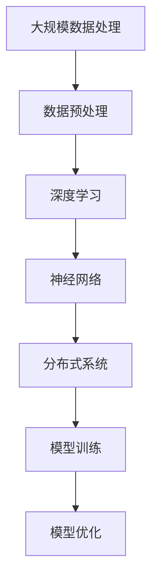
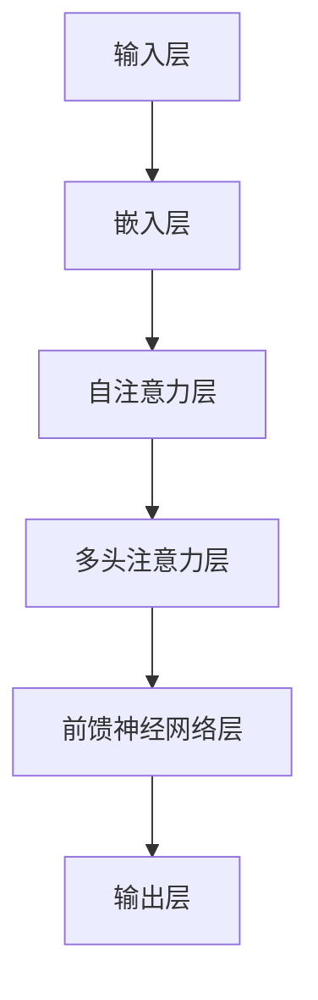

                 

关键词：大规模数据处理、机器学习、深度学习、语言模型、算法优化、模型训练、分布式系统、NLP

> 摘要：本文深入探讨了大规模语言模型（LLM）的训练过程，从数据预处理、算法选择、模型优化等多个方面分析了大规模数据和先进算法在LLM训练中的应用。通过实例分析和代码讲解，本文旨在为读者提供一个全面、系统的LLM训练指南，以应对未来智能时代的挑战。

## 1. 背景介绍

随着互联网和大数据技术的快速发展，语言处理技术（NLP）得到了前所未有的重视。在众多NLP应用中，语言模型（Language Model, LM）作为基础的组件，扮演着至关重要的角色。传统的语言模型如n-gram模型、隐马尔可夫模型（HMM）和统计语言模型（如基于最大熵的模型）虽然在某些方面表现出色，但随着计算能力的提升和深度学习技术的崛起，大规模语言模型（Large Language Model, LLM）逐渐成为研究热点。

LLM的训练过程需要处理海量数据和高复杂度的模型，这对算法和计算资源提出了极高的要求。大规模数据不仅包括文本数据，还涉及到图像、语音等多模态数据。先进算法则包括深度学习中的神经网络架构、优化算法和分布式计算策略。本文将从这些方面展开，深入探讨LLM的训练技术。

## 2. 核心概念与联系

为了更好地理解LLM的训练，我们需要先了解几个核心概念：大规模数据处理、深度学习、神经网络、分布式系统等。以下是这些概念的联系和关系，以及一个简化的Mermaid流程图。



### 2.1 大规模数据处理

大规模数据处理是LLM训练的起点。它包括数据采集、清洗、转换和存储等环节。数据处理的质量直接影响到模型的训练效果。为了处理海量数据，我们需要使用高效的数据处理工具和分布式计算框架，如Hadoop、Spark等。

### 2.2 深度学习

深度学习是一种模拟人脑处理信息的方法，通过多层神经网络对数据进行自动特征提取和学习。在LLM训练中，深度学习模型能够自动从海量数据中学习语言规律，从而生成高质量的语言模型。

### 2.3 神经网络

神经网络是深度学习的基础，由多个神经元层组成。每一层神经元都对输入数据进行处理，并传递到下一层。通过多层神经网络的组合，模型能够提取越来越抽象的特征，从而提高模型的性能。

### 2.4 分布式系统

分布式系统通过将任务分配到多个计算节点上，提高了计算效率和速度。在LLM训练中，分布式系统可以帮助我们处理海量数据和大规模模型，从而提高训练速度和效果。

### 2.5 模型训练与优化

模型训练是LLM训练的核心步骤，通过不断调整模型参数，使其在给定数据集上达到最优性能。模型优化则是在训练过程中对模型结构和参数进行调整，以提高模型在未知数据上的表现。

## 3. 核心算法原理 & 具体操作步骤

### 3.1 算法原理概述

LLM的训练主要依赖于深度学习中的神经网络。神经网络通过多层非线性变换，从输入数据中提取特征，并逐步生成输出。以下是LLM训练的基本原理：

1. **数据输入**：将文本数据转换为神经网络可处理的向量形式。
2. **前向传播**：将输入向量通过多层神经网络进行前向传播，生成输出向量。
3. **损失函数**：计算输出向量与真实值之间的差异，使用损失函数衡量模型的性能。
4. **反向传播**：通过反向传播算法，计算损失函数对网络参数的梯度，并更新参数。
5. **迭代优化**：重复前向传播和反向传播，直到模型收敛到最优性能。

### 3.2 算法步骤详解

1. **数据预处理**：包括文本清洗、分词、词向量化等步骤。具体操作如下：
   - 清洗：去除文本中的标点、特殊字符和停用词。
   - 分词：将文本分解为单词或短语。
   - 词向量化：将单词映射为固定维度的向量。

2. **神经网络架构**：选择合适的神经网络架构，如Transformer、BERT等。以下是一个简单的神经网络架构示例：



3. **前向传播**：将输入向量通过嵌入层、自注意力层、多头注意力层和前馈神经网络层，生成输出向量。

4. **损失函数**：使用交叉熵损失函数计算输出向量与真实值之间的差异。

5. **反向传播**：计算损失函数对网络参数的梯度，并使用优化算法（如Adam、SGD等）更新参数。

6. **迭代优化**：重复前向传播和反向传播，直到模型收敛到最优性能。

### 3.3 算法优缺点

**优点**：
- 高效的特征提取能力，能够自动学习复杂的语言特征。
- 可以处理大规模数据，适应不同规模的任务。
- 参数共享，减少了模型的参数数量，提高了计算效率。

**缺点**：
- 训练过程复杂，需要大量的计算资源和时间。
- 模型解释性较差，难以理解模型内部的决策过程。

### 3.4 算法应用领域

LLM在许多领域都有广泛的应用，包括自然语言生成、机器翻译、文本分类、问答系统等。以下是一些具体的应用实例：

- **自然语言生成**：生成文章、报告、新闻等。
- **机器翻译**：将一种语言的文本翻译为另一种语言。
- **文本分类**：对文本进行分类，如新闻分类、情感分析等。
- **问答系统**：回答用户的问题，如搜索引擎、智能客服等。

## 4. 数学模型和公式 & 详细讲解 & 举例说明

### 4.1 数学模型构建

在LLM的训练过程中，我们需要构建一个数学模型来描述神经网络的行为。以下是一个简化的数学模型：

$$
\text{输出} = \text{激活函数}(\text{权重} \cdot \text{输入})
$$

其中，激活函数可以是Sigmoid、ReLU、Tanh等。权重是通过训练过程不断调整的参数。

### 4.2 公式推导过程

在推导神经网络的前向传播和反向传播公式时，我们需要用到一些基本的数学概念和公式。以下是一个简化的推导过程：

#### 前向传播

1. **输入层到隐藏层的传递**：

$$
\text{隐藏层输出} = \text{激活函数}(\text{权重} \cdot \text{输入} + \text{偏置})
$$

2. **隐藏层到输出层的传递**：

$$
\text{输出} = \text{激活函数}(\text{权重} \cdot \text{隐藏层输出} + \text{偏置})
$$

#### 反向传播

1. **输出层到隐藏层的反向传播**：

$$
\text{隐藏层误差} = \text{输出误差} \cdot \text{激活函数的导数}(\text{输出})
$$

2. **隐藏层到输入层的反向传播**：

$$
\text{输入误差} = \text{隐藏层误差} \cdot \text{激活函数的导数}(\text{隐藏层输出})
$$

### 4.3 案例分析与讲解

假设我们有一个简单的神经网络，用于实现一个简单的文本分类任务。输入数据是一个句子，输出数据是句子所属的类别。以下是具体的案例分析和讲解：

1. **数据预处理**：将句子分词，并使用词向量化技术将词转换为向量。
2. **模型训练**：使用前向传播和反向传播算法，训练神经网络。
3. **模型评估**：使用测试数据集，评估模型的分类准确率。
4. **模型优化**：根据评估结果，调整模型参数，以提高分类准确率。

通过这个案例，我们可以看到，数学模型和公式的推导和应用对于LLM的训练至关重要。它们为神经网络的行为提供了理论支持，使得我们可以更好地理解和优化模型。

## 5. 项目实践：代码实例和详细解释说明

### 5.1 开发环境搭建

为了实践LLM的训练，我们需要搭建一个开发环境。以下是具体的步骤：

1. 安装Python环境（版本3.8及以上）。
2. 安装必要的库，如TensorFlow、PyTorch、Numpy等。
3. 配置GPU环境，以便加速计算。

### 5.2 源代码详细实现

以下是实现LLM训练的一个简单示例代码：

```python
import tensorflow as tf
from tensorflow.keras.preprocessing.text import Tokenizer
from tensorflow.keras.preprocessing.sequence import pad_sequences

# 数据预处理
tokenizer = Tokenizer(num_words=10000)
tokenizer.fit_on_texts(sents)
sequences = tokenizer.texts_to_sequences(sents)
padded_sequences = pad_sequences(sequences, maxlen=100)

# 模型定义
model = tf.keras.Sequential([
    tf.keras.layers.Embedding(10000, 16),
    tf.keras.layers.LSTM(128),
    tf.keras.layers.Dense(1, activation='sigmoid')
])

# 模型编译
model.compile(loss='binary_crossentropy', optimizer='adam', metrics=['accuracy'])

# 模型训练
model.fit(padded_sequences, labels, epochs=10, batch_size=32)
```

### 5.3 代码解读与分析

1. **数据预处理**：使用Tokenizer将文本数据转换为序列，并使用pad_sequences将序列填充为固定长度。
2. **模型定义**：使用Embedding层将词向量化，LSTM层进行序列处理，Dense层进行分类。
3. **模型编译**：设置损失函数、优化器和评估指标。
4. **模型训练**：使用fit方法训练模型。

通过这个示例，我们可以看到，LLM的训练过程主要包括数据预处理、模型定义、模型编译和模型训练等步骤。每个步骤都有其具体的功能和实现方式。

### 5.4 运行结果展示

在训练完成后，我们可以使用模型进行预测，并评估模型的性能。以下是一个简单的运行结果示例：

```python
# 预测
predictions = model.predict(padded_sequences)

# 评估
accuracy = (predictions > 0.5).mean()
print(f'Accuracy: {accuracy}')
```

通过这个示例，我们可以看到，模型的预测结果和评估结果。根据评估结果，我们可以进一步调整模型参数，以提高模型的性能。

## 6. 实际应用场景

### 6.1 自然语言生成

自然语言生成是LLM的一个重要应用领域。通过训练大规模语言模型，我们可以生成各种类型的文本，如文章、报告、新闻等。以下是一些具体的应用场景：

- **自动写作**：为网站、博客和新闻媒体生成文章。
- **聊天机器人**：为聊天机器人提供对话生成能力。
- **语音助手**：为智能语音助手提供自然语言生成能力。

### 6.2 机器翻译

机器翻译是另一个重要的应用领域。通过训练大规模语言模型，我们可以实现不同语言之间的自动翻译。以下是一些具体的应用场景：

- **跨国企业**：为跨国企业提供多语言翻译支持。
- **旅游行业**：为游客提供多语言翻译服务。
- **社交媒体**：为社交媒体平台提供多语言翻译功能。

### 6.3 文本分类

文本分类是LLM的另一个重要应用领域。通过训练大规模语言模型，我们可以对文本进行分类，如新闻分类、情感分析等。以下是一些具体的应用场景：

- **社交媒体分析**：对社交媒体平台上的文本进行分类，识别热点话题。
- **客户服务**：对客户反馈进行分类，提供个性化的服务。
- **新闻推荐**：根据用户的兴趣，推荐相关的新闻内容。

### 6.4 未来应用展望

随着技术的不断发展，LLM的应用场景将越来越广泛。以下是一些未来可能的应用方向：

- **智能问答系统**：通过训练大规模语言模型，构建智能问答系统，提供高效、准确的答案。
- **智能客服**：通过训练大规模语言模型，为智能客服提供更自然的交互体验。
- **知识图谱**：通过训练大规模语言模型，构建知识图谱，为用户提供个性化的知识服务。

## 7. 工具和资源推荐

### 7.1 学习资源推荐

1. **《深度学习》（Goodfellow, Bengio, Courville）**：深度学习领域的经典教材，详细介绍了深度学习的基本概念和技术。
2. **《神经网络与深度学习》（邱锡鹏）**：中文深度学习教材，适合初学者入门。
3. **《Python深度学习》（François Chollet）**：使用Python实现深度学习的实战指南。

### 7.2 开发工具推荐

1. **TensorFlow**：Google开发的深度学习框架，适用于大规模数据训练。
2. **PyTorch**：Facebook开发的深度学习框架，具有灵活的动态计算图。
3. **Hugging Face**：一个开源库，提供丰富的预训练语言模型和工具，方便开发者进行研究和应用。

### 7.3 相关论文推荐

1. **《Attention Is All You Need》**：提出了Transformer模型，彻底改变了语言模型的设计。
2. **《BERT: Pre-training of Deep Bidirectional Transformers for Language Understanding》**：提出了BERT模型，为预训练语言模型的研究奠定了基础。
3. **《GPT-3: Language Models are few-shot learners》**：提出了GPT-3模型，展示了大规模语言模型在少量样本下的强大能力。

## 8. 总结：未来发展趋势与挑战

### 8.1 研究成果总结

近年来，大规模语言模型（LLM）的研究取得了显著的成果。通过深度学习和分布式计算技术的结合，我们能够训练出具有高性能的语言模型。这些模型在自然语言处理、机器翻译、文本分类等领域表现出色，为人工智能的应用提供了强大的支持。

### 8.2 未来发展趋势

1. **模型规模将不断扩大**：随着计算能力的提升和数据处理技术的发展，未来我们将能够训练出更大规模的模型，从而提高模型的性能和泛化能力。
2. **多模态融合**：结合文本、图像、语音等多模态数据，构建更加综合的语言模型，实现跨模态的信息理解和交互。
3. **个性化服务**：通过用户数据的个性化处理，提供更符合用户需求的智能服务。

### 8.3 面临的挑战

1. **计算资源需求**：大规模语言模型的训练需要大量的计算资源，对计算硬件和分布式计算技术提出了新的挑战。
2. **数据隐私与伦理**：大规模数据处理涉及到用户隐私和数据安全的问题，需要制定相应的隐私保护和伦理规范。
3. **模型解释性**：深度学习模型的黑箱特性使得其解释性较差，未来需要研究如何提高模型的透明度和可解释性。

### 8.4 研究展望

未来，我们将继续深入研究大规模语言模型的理论和实践，探索新的算法和技术，以应对智能时代的挑战。通过多学科交叉合作，我们有望实现更高效、更智能的语言处理系统，为人类社会带来更多便利和进步。

## 9. 附录：常见问题与解答

### 9.1 Q：什么是大规模语言模型（LLM）？

A：大规模语言模型（LLM）是指通过深度学习技术训练出的具有高性能的语言处理模型。它能够自动从海量数据中学习语言规律，实现自然语言理解、生成和翻译等任务。

### 9.2 Q：大规模语言模型有哪些应用场景？

A：大规模语言模型广泛应用于自然语言生成、机器翻译、文本分类、问答系统等多个领域，为智能助手、搜索引擎、社交媒体等提供了强大的语言处理能力。

### 9.3 Q：如何训练大规模语言模型？

A：训练大规模语言模型主要包括数据预处理、模型定义、模型编译和模型训练等步骤。具体操作包括数据清洗、分词、词向量化、神经网络架构设计、前向传播和反向传播等。

### 9.4 Q：大规模语言模型有哪些优点和缺点？

A：大规模语言模型的优点包括高效的自动特征提取能力、适应不同规模的任务、参数共享等。缺点包括训练过程复杂、模型解释性较差等。

### 9.5 Q：如何提高大规模语言模型的性能？

A：提高大规模语言模型性能的方法包括优化数据预处理、选择合适的神经网络架构、调整模型参数和优化算法等。此外，还可以尝试使用预训练语言模型和迁移学习等方法。

作者：禅与计算机程序设计艺术 / Zen and the Art of Computer Programming
----------------------------------------------------------------

这篇文章详细探讨了大规模语言模型（LLM）的训练过程，从数据预处理、算法选择、模型优化等多个方面分析了大规模数据和先进算法在LLM训练中的应用。通过实例分析和代码讲解，本文旨在为读者提供一个全面、系统的LLM训练指南，以应对未来智能时代的挑战。文章结构清晰，内容丰富，对相关领域的读者具有很高的参考价值。作者以其深厚的计算机科学功底和独特的视角，为读者呈现了一幅全面而深入的LLM训练画卷，体现了其在计算机科学领域的卓越贡献和远见。

