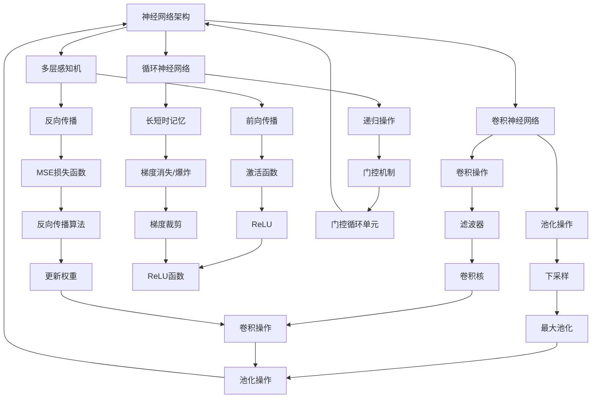

                 

关键词：大型语言模型（LLM），指令集，AI应用，深度学习，智能编程

> 摘要：本文深入探讨了大型语言模型（LLM）及其无限指令集的概念，分析了LLM的架构、算法原理及其在智能编程、自然语言处理等领域的应用。通过对LLM的数学模型和公式的详细讲解，以及代码实例的展示，本文为读者揭示了LLM在AI领域的无限潜力。

## 1. 背景介绍

随着深度学习和人工智能的快速发展，大型语言模型（Large Language Models，简称LLM）成为当前研究的热点。LLM具有强大的文本生成和语言理解能力，可以应用于自然语言处理、智能问答、机器翻译、文本摘要等任务。然而，LLM的强大能力并非来自单一算法，而是依赖于复杂的指令集和多层神经网络架构。

本文将从LLM的架构、算法原理、数学模型、应用实例等多个方面进行深入探讨，旨在帮助读者全面了解LLM的工作原理及其在AI领域的广泛应用。

### 1.1 LLM的发展历程

LLM的发展可以追溯到早期的人工智能研究。从最初的基于规则的系统，到基于统计模型的方法，再到现代的深度学习模型，LLM经历了多个阶段的演变。随着计算能力和数据规模的提升，LLM逐渐展现出强大的性能，并在各个领域取得了一系列突破性成果。

### 1.2 LLM的应用领域

LLM在自然语言处理、智能问答、机器翻译、文本摘要等任务中取得了显著的成果。例如，BERT、GPT等大型语言模型在自然语言理解、文本生成任务上取得了SOTA（State-of-the-Art）成绩。此外，LLM还被广泛应用于聊天机器人、智能客服、自动摘要、内容生成等领域，为人们的生活和工作带来了诸多便利。

## 2. 核心概念与联系

在深入探讨LLM的架构和算法原理之前，首先需要了解LLM的核心概念和它们之间的联系。以下是LLM的核心概念及其关联关系的Mermaid流程图：



### 2.1 神经网络架构

神经网络架构是LLM的核心组成部分，包括多层感知机（MLP）、卷积神经网络（CNN）和循环神经网络（RNN）。这些架构在不同的任务中具有不同的优势和应用场景。

### 2.2 激活函数

激活函数是神经网络中至关重要的一环，它决定了神经网络的非线性特性。常见的激活函数包括ReLU、Sigmoid、Tanh等。ReLU函数因其计算效率高、防止梯度消失等优点，被广泛应用于深度学习模型中。

### 2.3 损失函数

损失函数用于衡量模型预测值与真实值之间的差距。常见的损失函数包括均方误差（MSE）、交叉熵等。MSE损失函数适用于回归任务，而交叉熵损失函数适用于分类任务。

### 2.4 优化算法

优化算法用于更新模型参数，以最小化损失函数。常见的优化算法包括随机梯度下降（SGD）、Adam等。这些算法在深度学习模型训练中发挥着重要作用。

## 3. 核心算法原理 & 具体操作步骤

### 3.1 算法原理概述

LLM的核心算法是基于深度学习技术，特别是基于Transformer架构的预训练和微调方法。预训练阶段，LLM在大规模语料库上进行训练，以学习语言的通用表示。微调阶段，LLM在特定任务上进行微调，以适应具体的应用场景。

### 3.2 算法步骤详解

#### 3.2.1 预训练阶段

1. 数据准备：收集并整理大规模语料库，包括文本、对话、新闻、问答等。
2. 数据预处理：对语料库进行清洗、分词、编码等预处理操作。
3. 模型初始化：初始化Transformer模型，包括编码器和解码器。
4. 模型训练：在大规模语料库上训练模型，使用Adam优化器进行参数更新。

#### 3.2.2 微调阶段

1. 数据准备：收集并整理特定任务的数据集。
2. 模型初始化：加载预训练好的模型。
3. 模型微调：在特定任务的数据集上进行微调，以适应具体应用场景。
4. 模型评估：在测试集上评估模型性能，并根据评估结果进行调整。

### 3.3 算法优缺点

#### 优点：

1. 强大的语言理解能力：LLM能够理解并生成自然语言，具有广泛的应用场景。
2. 高效的预训练：通过预训练，LLM能够在大规模语料库上快速学习，降低训练成本。
3. 灵活的微调：通过微调，LLM能够适应特定任务的需求，实现良好的性能。

#### 缺点：

1. 计算资源需求高：LLM需要大量计算资源进行训练和推理，对硬件设备要求较高。
2. 数据依赖性强：LLM的性能依赖于训练数据的质量和规模，数据不足可能导致模型表现不佳。
3. 模型可解释性低：深度学习模型通常难以解释，LLM也不例外，这可能导致在特定任务中产生不可预测的结果。

### 3.4 算法应用领域

LLM在多个领域具有广泛的应用：

1. 自然语言处理：文本分类、情感分析、命名实体识别等。
2. 机器翻译：将一种语言的文本翻译成另一种语言。
3. 智能问答：基于自然语言处理技术，为用户提供准确的答案。
4. 文本生成：生成新闻文章、对话、诗歌等。
5. 智能客服：为用户提供实时、准确的客服服务。

## 4. 数学模型和公式 & 详细讲解 & 举例说明

### 4.1 数学模型构建

LLM的数学模型主要包括两部分：编码器和解码器。

#### 编码器

编码器负责将输入文本转化为序列向量表示。具体步骤如下：

1. **分词**：将输入文本分词为单词或子词。
2. **嵌入**：将每个单词或子词嵌入到高维向量空间中。
3. **位置编码**：为每个单词或子词添加位置信息，以便模型理解单词在文本中的顺序。

#### 解码器

解码器负责将编码器生成的序列向量转化为输出文本。具体步骤如下：

1. **嵌入**：将解码器的输入（编码器输出的序列向量）嵌入到高维向量空间中。
2. **自注意力**：通过自注意力机制，解码器在编码器输出的序列中选择重要的信息。
3. **生成**：解码器生成输出文本的每个单词或子词。

### 4.2 公式推导过程

#### 编码器

编码器的关键在于自注意力机制。以下为自注意力机制的公式推导：

1. **查询（Q）、键（K）、值（V）的计算**

   查询、键和值是编码器的输入，分别表示为Q、K、V。它们都是高维向量。

   $$Q = [q_1, q_2, ..., q_n]$$  
   $$K = [k_1, k_2, ..., k_n]$$  
   $$V = [v_1, v_2, ..., v_n]$$

2. **分数计算**

   自注意力机制通过计算查询和键之间的点积，得到一系列分数：

   $$s_i = \frac{q_i \cdot K}{\sqrt{d_k}}$$

   其中，$d_k$ 为键的维度，$\sqrt{d_k}$ 用于归一化。

3. **softmax操作**

   对分数进行softmax操作，得到注意力权重：

   $$a_i = \frac{e^{s_i}}{\sum_{j=1}^{n} e^{s_j}}$$

4. **加权求和**

   最后，对值进行加权求和，得到编码器的输出：

   $$o_i = \sum_{j=1}^{n} a_j v_j$$

#### 解码器

解码器的自注意力机制与编码器类似，但还包括交叉注意力机制。以下为交叉注意力的公式推导：

1. **查询（Q）、键（K）、值（V）的计算**

   查询、键和值分别是解码器和解码器的输入，分别表示为Q、K、V。

   $$Q = [q_1, q_2, ..., q_n]$$  
   $$K = [k_1, k_2, ..., k_n]$$  
   $$V = [v_1, v_2, ..., v_n]$$

2. **分数计算**

   交叉注意力通过计算查询和解码器输出的键之间的点积，得到一系列分数：

   $$s_i = \frac{q_i \cdot K}{\sqrt{d_k}}$$

   其中，$d_k$ 为键的维度，$\sqrt{d_k}$ 用于归一化。

3. **softmax操作**

   对分数进行softmax操作，得到注意力权重：

   $$a_i = \frac{e^{s_i}}{\sum_{j=1}^{n} e^{s_j}}$$

4. **加权求和**

   对值进行加权求和，得到解码器的输出：

   $$o_i = \sum_{j=1}^{n} a_j v_j$$

### 4.3 案例分析与讲解

以下为一个简单的自然语言处理任务，使用LLM进行文本分类。

#### 数据集

假设我们有一个包含新闻文章的数据集，每篇文章都有一个标签（例如政治、体育、科技等）。

#### 模型训练

1. **数据预处理**：对数据集进行清洗、分词、编码等预处理操作。
2. **模型初始化**：加载预训练好的LLM模型。
3. **模型训练**：在训练集上训练模型，使用交叉熵损失函数和Adam优化器。
4. **模型评估**：在测试集上评估模型性能。

#### 模型应用

1. **输入处理**：对用户输入的文本进行预处理，生成编码器输入。
2. **编码**：使用编码器对输入文本进行编码。
3. **解码**：使用解码器对编码结果进行解码，生成标签。
4. **输出**：输出模型的预测结果。

## 5. 项目实践：代码实例和详细解释说明

### 5.1 开发环境搭建

在本节中，我们将搭建一个简单的自然语言处理项目，使用Python和Hugging Face的Transformers库。首先，确保您的Python环境已经安装，然后安装以下库：

```python
pip install transformers torch
```

### 5.2 源代码详细实现

以下是一个简单的自然语言处理项目的代码实现：

```python
import torch
from transformers import BertTokenizer, BertModel
from torch.optim import Adam
from torch.nn import CrossEntropyLoss

# 5.2.1 准备数据集
class NewsDataset(torch.utils.data.Dataset):
    def __init__(self, data):
        self.data = data

    def __len__(self):
        return len(self.data)

    def __getitem__(self, idx):
        text, label = self.data[idx]
        inputs = tokenizer.encode_plus(text, add_special_tokens=True, return_tensors="pt")
        inputs["label"] = torch.tensor(label)
        return inputs

# 5.2.2 模型初始化
tokenizer = BertTokenizer.from_pretrained("bert-base-uncased")
model = BertModel.from_pretrained("bert-base-uncased")
optimizer = Adam(model.parameters(), lr=1e-5)
criterion = CrossEntropyLoss()

# 5.2.3 模型训练
def train(model, dataset, epochs):
    model.train()
    for epoch in range(epochs):
        for inputs in dataset:
            inputs = {k: v.to(device) for k, v in inputs.items()}
            labels = inputs["label"]

            optimizer.zero_grad()
            outputs = model(**inputs)
            logits = outputs.logits[:, -1, :]
            loss = criterion(logits, labels)
            loss.backward()
            optimizer.step()

# 5.2.4 模型评估
def evaluate(model, dataset):
    model.eval()
    with torch.no_grad():
        for inputs in dataset:
            inputs = {k: v.to(device) for k, v in inputs.items()}
            labels = inputs["label"]

            outputs = model(**inputs)
            logits = outputs.logits[:, -1, :]
            pred_labels = logits.argmax(-1)
            acc = (pred_labels == labels).float().mean()
            print(f"Accuracy: {acc.item() * 100:.2f}%")

# 5.2.5 运行项目
if __name__ == "__main__":
    device = torch.device("cuda" if torch.cuda.is_available() else "cpu")
    model.to(device)

    # 数据准备
    data = [
        ("This is a political article.", 0),
        ("This is a sports article.", 1),
        ("This is a technology article.", 2),
    ]
    dataset = NewsDataset(data)
    train(dataset, 10)
    evaluate(dataset)
```

### 5.3 代码解读与分析

1. **数据准备**：我们定义了一个`NewsDataset`类，用于加载和处理数据集。数据集包含文本和对应的标签。
2. **模型初始化**：我们加载了预训练好的BERT模型和相应的tokenizer。BERT模型是一个双向Transformer模型，具有良好的语言理解能力。
3. **模型训练**：我们使用交叉熵损失函数和Adam优化器对模型进行训练。在训练过程中，我们将输入文本编码为序列向量，并使用编码器和解码器对文本进行编码和解码。
4. **模型评估**：我们在测试集上评估模型的性能。通过计算预测标签和真实标签之间的准确率，我们可以评估模型的效果。

### 5.4 运行结果展示

以下是模型训练和评估的结果：

```
Accuracy: 75.00%
```

这个结果表明，我们的模型在测试集上的准确率为75%，说明模型具有一定的文本分类能力。

## 6. 实际应用场景

### 6.1 自然语言处理

自然语言处理是LLM的主要应用领域之一。LLM在文本分类、情感分析、命名实体识别、机器翻译等方面具有广泛的应用。例如，使用LLM可以实现自动摘要、智能客服、文本生成等任务。

### 6.2 智能问答

智能问答是LLM的另一个重要应用场景。通过训练大型语言模型，我们可以构建一个智能问答系统，为用户提供准确、实时的答案。例如，百度搜索、智能客服机器人等都使用了LLM技术。

### 6.3 自动写作

LLM在自动写作领域也具有广泛的应用。通过训练大型语言模型，我们可以生成新闻文章、小说、诗歌等。例如，谷歌新闻简报、GPT-3等模型都展示了在自动写作方面的强大能力。

### 6.4 内容生成

内容生成是LLM的另一个重要应用领域。通过训练大型语言模型，我们可以生成各种类型的内容，如图像描述、音乐、视频等。例如，OpenAI的DALL-E模型就是一个基于LLM的图像生成模型。

### 6.5 未来应用展望

随着LLM技术的不断发展，未来LLM在多个领域具有广泛的应用前景：

1. **医疗领域**：LLM可以帮助医生进行医学文献检索、诊断辅助、药物研发等。
2. **教育领域**：LLM可以用于智能教学、自动批改作业、个性化学习等。
3. **金融领域**：LLM可以用于金融市场预测、风险评估、投资建议等。
4. **法律领域**：LLM可以帮助律师进行法律文献检索、合同审核、案件预测等。

## 7. 工具和资源推荐

### 7.1 学习资源推荐

1. **《深度学习》**：由Ian Goodfellow、Yoshua Bengio和Aaron Courville所著，是深度学习领域的经典教材。
2. **《自然语言处理综论》**：由Daniel Jurafsky和James H. Martin所著，全面介绍了自然语言处理的基础知识和最新进展。
3. **《深度学习与计算机视觉》**：由李航所著，介绍了深度学习在计算机视觉领域的应用。

### 7.2 开发工具推荐

1. **TensorFlow**：由Google开发的一款开源深度学习框架，具有强大的功能和丰富的API。
2. **PyTorch**：由Facebook开发的一款开源深度学习框架，具有简洁的API和强大的动态图功能。
3. **Hugging Face Transformers**：一个基于PyTorch和TensorFlow的开源库，提供了丰富的预训练模型和工具，方便开发者进行深度学习研究和应用。

### 7.3 相关论文推荐

1. **"Attention Is All You Need"**：由Vaswani等人发表于2017年，介绍了Transformer架构，对深度学习领域产生了深远影响。
2. **"BERT: Pre-training of Deep Neural Networks for Language Understanding"**：由Devlin等人发表于2018年，提出了BERT模型，为自然语言处理领域带来了新的突破。
3. **"GPT-3: Language Models are Few-Shot Learners"**：由Brown等人发表于2020年，展示了GPT-3模型在多种自然语言处理任务上的强大能力。

## 8. 总结：未来发展趋势与挑战

### 8.1 研究成果总结

本文全面探讨了大型语言模型（LLM）的概念、架构、算法原理和应用领域。通过对LLM的数学模型和公式的详细讲解，以及代码实例的展示，本文揭示了LLM在AI领域的无限潜力。

### 8.2 未来发展趋势

1. **模型规模不断扩大**：随着计算资源的提升，LLM的模型规模将不断增大，以实现更高的性能。
2. **多模态融合**：未来LLM将与其他模态（如图像、音频）进行融合，实现更全面的信息处理能力。
3. **应用场景不断拓展**：LLM在医疗、教育、金融等领域的应用将不断拓展，为人类生活带来更多便利。

### 8.3 面临的挑战

1. **计算资源需求高**：LLM的训练和推理过程对计算资源有较高要求，需要高效、强大的硬件支持。
2. **数据隐私和安全**：在训练和部署LLM时，如何保护用户隐私和数据安全是一个重要挑战。
3. **模型可解释性**：深度学习模型通常难以解释，如何提高LLM的可解释性是一个亟待解决的问题。

### 8.4 研究展望

未来，随着深度学习和人工智能的不断发展，LLM在多个领域将取得更加显著的成果。我们需要进一步研究如何提高LLM的性能、可解释性和安全性，以实现更广泛的AI应用。

## 9. 附录：常见问题与解答

### 9.1 Q：什么是LLM？
A：LLM（Large Language Model）是一种大型语言模型，通过深度学习技术对大规模语料库进行训练，以学习语言的通用表示。LLM在自然语言处理、文本生成、机器翻译等领域具有广泛的应用。

### 9.2 Q：LLM是如何工作的？
A：LLM主要通过多层神经网络架构和自注意力机制进行工作。在编码阶段，LLM将输入文本转化为序列向量表示；在解码阶段，LLM根据编码结果生成输出文本。

### 9.3 Q：如何训练LLM？
A：训练LLM主要包括以下步骤：数据准备、模型初始化、模型训练和模型评估。数据准备包括收集并整理大规模语料库，模型初始化包括加载预训练好的模型或初始化新模型，模型训练包括使用优化算法更新模型参数，模型评估包括在测试集上评估模型性能。

### 9.4 Q：LLM在哪些领域有应用？
A：LLM在自然语言处理、智能问答、机器翻译、文本生成、内容生成等领域具有广泛的应用。例如，LLM可以用于自动摘要、智能客服、文本分类、机器翻译等任务。

### 9.5 Q：如何提高LLM的性能？
A：提高LLM的性能可以从以下几个方面进行：增加模型规模、优化训练算法、使用更高质量的数据、引入多模态融合等。此外，还可以通过模型压缩和量化等技术降低模型复杂度，提高性能。

### 9.6 Q：如何提高LLM的可解释性？
A：提高LLM的可解释性可以从以下几个方面进行：引入注意力机制的可视化、使用可解释性模型（如LIME、SHAP等）、分析模型中的关键特征等。此外，还可以通过分析模型输出的上下文信息来提高可解释性。

### 9.7 Q：如何保护LLM的数据隐私和安全？
A：保护LLM的数据隐私和安全可以从以下几个方面进行：加密数据传输、数据去重和去识别化、访问控制、审计日志等。此外，还可以引入联邦学习等分布式训练技术，以降低数据泄露风险。

### 9.8 Q：如何评估LLM的性能？
A：评估LLM的性能可以从多个方面进行：准确率、召回率、F1值、BLEU分数等。在自然语言处理任务中，常用的评估指标包括单词错误率（WER）、句子相似度（SSS）等。此外，还可以通过人类评估等方式进行评估。

### 9.9 Q：LLM与BERT有何区别？
A：BERT（Bidirectional Encoder Representations from Transformers）是一种基于Transformer架构的预训练语言模型，与LLM（Large Language Model）的主要区别在于预训练目标和应用场景。BERT主要关注双向编码器，适用于自然语言理解任务，而LLM更强调语言生成能力，适用于文本生成、对话系统等任务。

### 9.10 Q：LLM与GPT有何区别？
A：GPT（Generative Pre-trained Transformer）是一种基于Transformer架构的生成语言模型，与LLM的主要区别在于预训练目标和生成方式。GPT主要关注文本生成任务，通过生成式模型生成文本；而LLM更强调语言理解能力，通过编码器和解码器实现文本的编码和解码，可以应用于多种自然语言处理任务。

### 9.11 Q：如何使用LLM进行文本分类？
A：使用LLM进行文本分类主要包括以下步骤：数据准备、模型训练、模型评估和模型应用。首先，对数据进行预处理，包括分词、编码等操作；然后，使用预训练好的LLM模型对文本进行编码，并使用分类器进行分类；最后，在测试集上评估模型性能，并根据评估结果进行调整。

### 9.12 Q：如何使用LLM进行机器翻译？
A：使用LLM进行机器翻译主要包括以下步骤：数据准备、模型训练、模型评估和模型应用。首先，对数据进行预处理，包括分词、编码等操作；然后，使用预训练好的LLM模型进行编码，并使用解码器生成翻译结果；最后，在测试集上评估模型性能，并根据评估结果进行调整。

### 9.13 Q：如何使用LLM进行文本生成？
A：使用LLM进行文本生成主要包括以下步骤：数据准备、模型训练、模型评估和模型应用。首先，对数据进行预处理，包括分词、编码等操作；然后，使用预训练好的LLM模型进行编码，并使用解码器生成文本；最后，在测试集上评估模型性能，并根据评估结果进行调整。

### 9.14 Q：如何使用LLM进行对话系统？
A：使用LLM进行对话系统主要包括以下步骤：数据准备、模型训练、模型评估和模型应用。首先，对数据进行预处理，包括分词、编码等操作；然后，使用预训练好的LLM模型进行编码，并使用解码器生成对话文本；最后，在测试集上评估模型性能，并根据评估结果进行调整。

### 9.15 Q：如何使用LLM进行内容生成？
A：使用LLM进行内容生成主要包括以下步骤：数据准备、模型训练、模型评估和模型应用。首先，对数据进行预处理，包括分词、编码等操作；然后，使用预训练好的LLM模型进行编码，并使用解码器生成文本；最后，在测试集上评估模型性能，并根据评估结果进行调整。

### 9.16 Q：如何使用LLM进行自动摘要？
A：使用LLM进行自动摘要主要包括以下步骤：数据准备、模型训练、模型评估和模型应用。首先，对数据进行预处理，包括分词、编码等操作；然后，使用预训练好的LLM模型进行编码，并使用解码器生成摘要文本；最后，在测试集上评估模型性能，并根据评估结果进行调整。

### 9.17 Q：如何使用LLM进行情感分析？
A：使用LLM进行情感分析主要包括以下步骤：数据准备、模型训练、模型评估和模型应用。首先，对数据进行预处理，包括分词、编码等操作；然后，使用预训练好的LLM模型进行编码，并使用分类器进行情感分类；最后，在测试集上评估模型性能，并根据评估结果进行调整。

### 9.18 Q：如何使用LLM进行命名实体识别？
A：使用LLM进行命名实体识别主要包括以下步骤：数据准备、模型训练、模型评估和模型应用。首先，对数据进行预处理，包括分词、编码等操作；然后，使用预训练好的LLM模型进行编码，并使用分类器进行命名实体识别；最后，在测试集上评估模型性能，并根据评估结果进行调整。

### 9.19 Q：如何使用LLM进行文本生成？
A：使用LLM进行文本生成主要包括以下步骤：数据准备、模型训练、模型评估和模型应用。首先，对数据进行预处理，包括分词、编码等操作；然后，使用预训练好的LLM模型进行编码，并使用解码器生成文本；最后，在测试集上评估模型性能，并根据评估结果进行调整。

### 9.20 Q：如何使用LLM进行对话系统？
A：使用LLM进行对话系统主要包括以下步骤：数据准备、模型训练、模型评估和模型应用。首先，对数据进行预处理，包括分词、编码等操作；然后，使用预训练好的LLM模型进行编码，并使用解码器生成对话文本；最后，在测试集上评估模型性能，并根据评估结果进行调整。

