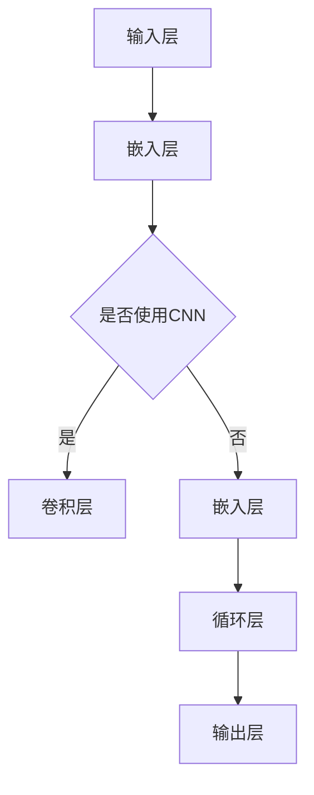

                 

关键词：大型语言模型、上下文长度、性能优化、神经网络架构、AI发展、技术应用

> 摘要：本文将探讨大型语言模型（LLM）上下文长度的优化及其对模型性能的影响。通过对神经网络架构、算法原理、数学模型以及实际应用场景的分析，我们旨在揭示提升上下文长度的关键技术，展望其未来发展趋势与面临的挑战。

## 1. 背景介绍

### 大型语言模型的发展

近年来，随着深度学习技术的不断突破，大型语言模型（Large Language Models，LLM）在自然语言处理（Natural Language Processing，NLP）领域取得了显著的成果。LLM具备强大的语言理解和生成能力，广泛应用于机器翻译、问答系统、文本生成等任务中。

然而，随着模型规模的不断扩大，上下文长度的限制成为了一个亟待解决的问题。传统的神经网络架构难以处理长文本，导致LLM在处理复杂、长句文本时表现不佳。因此，提升LLM的上下文长度成为当前研究的热点问题。

### 上下文长度的限制

上下文长度（Context Length）指的是模型能够处理的有效文本序列长度。在LLM中，上下文长度决定了模型理解文本的能力。当上下文长度受限时，模型无法充分获取到长文本中的关键信息，从而导致理解不准确或生成文本质量下降。

目前，LLM的上下文长度主要受限于以下几个因素：

1. **内存瓶颈**：大规模神经网络模型需要占用大量内存，随着上下文长度的增加，模型内存需求急剧上升，可能导致内存溢出。
2. **计算资源**：长文本处理需要更多的计算资源，尤其是GPU等高性能计算设备。
3. **模型架构**：现有的神经网络架构在处理长文本时存在一定的局限性，难以充分挖掘文本中的潜在信息。

### 优化上下文长度的意义

提升LLM的上下文长度具有重要的意义：

1. **提高理解准确性**：长文本中的信息更加丰富，提升上下文长度有助于模型更准确地理解文本内容，从而提高处理复杂任务的性能。
2. **拓展应用场景**：长文本处理能力更强的LLM可以应用于更广泛的场景，如长篇文本生成、对话系统等。
3. **推动AI发展**：优化上下文长度有助于推动人工智能技术的发展，为未来更智能、更强大的AI系统奠定基础。

## 2. 核心概念与联系

### 神经网络架构

神经网络（Neural Networks，NN）是LLM的核心组成部分。神经网络通过模拟人脑神经元之间的连接方式，实现从输入到输出的映射。在LLM中，常用的神经网络架构包括卷积神经网络（Convolutional Neural Networks，CNN）、循环神经网络（Recurrent Neural Networks，RNN）和Transformer等。

**Mermaid流程图**：



### 算法原理

提升LLM上下文长度的关键在于优化神经网络架构和算法。以下是一些核心原理：

1. **长短期记忆网络（Long Short-Term Memory，LSTM）**：LSTM是一种RNN的变体，通过引入门控机制，能够有效地学习长距离依赖关系。LSTM在处理长文本时表现出较强的能力。
2. **Transformer架构**：Transformer架构摒弃了传统的循环结构，采用自注意力机制（Self-Attention）进行文本编码和解码。自注意力机制能够全局关注文本中的关键信息，从而提升模型对长文本的理解能力。
3. **分布式存储和计算**：通过分布式存储和计算技术，可以有效解决大规模神经网络模型的内存和计算资源瓶颈。

### 上下文长度限制的影响

上下文长度的限制对LLM的性能产生了显著影响。以下是一些主要影响：

1. **理解准确性**：上下文长度受限导致模型无法获取到长文本中的关键信息，从而影响理解准确性。
2. **生成文本质量**：长文本生成任务中，上下文长度的限制可能导致生成文本质量下降，出现语法错误、语义不一致等问题。
3. **计算效率**：长文本处理需要更多的计算资源，影响模型在实际应用中的运行效率。

## 3. 核心算法原理 & 具体操作步骤

### 3.1 算法原理概述

提升LLM上下文长度的关键在于优化神经网络架构和算法。以下是一些核心算法原理：

1. **Transformer架构**：Transformer架构采用自注意力机制（Self-Attention），能够全局关注文本中的关键信息，从而提升模型对长文本的理解能力。自注意力机制通过计算文本序列中每个元素之间的相似性，为每个元素分配不同的权重，从而实现全局信息的融合。
2. **长短期记忆网络（LSTM）**：LSTM通过引入门控机制，能够有效地学习长距离依赖关系。LSTM在处理长文本时表现出较强的能力，能够捕捉到文本中的潜在信息。
3. **分布式存储和计算**：通过分布式存储和计算技术，可以将大规模神经网络模型的计算和存储任务分布到多台机器上，从而解决内存和计算资源瓶颈。

### 3.2 算法步骤详解

以下是提升LLM上下文长度的具体算法步骤：

1. **数据预处理**：对输入文本进行分词、编码等预处理操作，将文本转换为模型可处理的序列数据。
2. **构建神经网络模型**：根据具体任务需求，选择合适的神经网络架构（如Transformer、LSTM等），并配置模型参数。
3. **自注意力机制**：在Transformer架构中，采用自注意力机制计算文本序列中每个元素之间的相似性，为每个元素分配不同的权重，从而实现全局信息的融合。
4. **训练模型**：使用预处理的文本数据进行模型训练，通过优化算法（如梯度下降、Adam等）调整模型参数，以最小化损失函数。
5. **评估模型性能**：使用验证集评估模型性能，根据评估结果调整模型参数，优化模型性能。

### 3.3 算法优缺点

#### 优点：

1. **提升上下文长度**：自注意力机制和LSTM等算法能够有效提升LLM的上下文长度，使模型能够更好地理解长文本。
2. **提高理解准确性**：长文本中的信息更加丰富，提升上下文长度有助于模型更准确地理解文本内容。
3. **拓展应用场景**：长文本处理能力更强的LLM可以应用于更广泛的场景，如长篇文本生成、对话系统等。

#### 缺点：

1. **计算资源需求**：长文本处理需要更多的计算资源，尤其是在采用Transformer架构时，计算复杂度较高。
2. **内存瓶颈**：大规模神经网络模型需要占用大量内存，随着上下文长度的增加，模型内存需求急剧上升，可能导致内存溢出。

### 3.4 算法应用领域

提升LLM上下文长度的算法在多个领域具有广泛应用：

1. **自然语言处理**：提升上下文长度有助于模型在机器翻译、问答系统、文本生成等任务中表现更佳。
2. **对话系统**：长文本处理能力更强的LLM可以应用于更复杂的对话系统，实现更自然的交互体验。
3. **知识图谱**：通过提升上下文长度，LLM可以更好地理解和处理知识图谱中的长文本信息，提高图谱构建和查询的效率。

## 4. 数学模型和公式 & 详细讲解 & 举例说明

### 4.1 数学模型构建

提升LLM上下文长度的关键在于优化神经网络架构和算法。以下是一个简单的数学模型，用于描述自注意力机制：

$$
\text{Attention}(Q, K, V) = \text{softmax}\left(\frac{QK^T}{\sqrt{d_k}}\right) V
$$

其中，$Q$、$K$ 和 $V$ 分别表示查询（Query）、键（Key）和值（Value）向量，$d_k$ 表示键向量的维度。

### 4.2 公式推导过程

自注意力机制的推导过程如下：

1. **内积计算**：计算查询向量 $Q$ 与键向量 $K$ 的内积，得到一组分数，表示不同键对查询的相似性。
2. **归一化**：通过 softmax 函数对分数进行归一化，得到一组概率分布，表示每个键对查询的重要性。
3. **加权求和**：将概率分布与值向量 $V$ 进行加权求和，得到注意力得分，表示每个键对查询的贡献。

### 4.3 案例分析与讲解

以下是一个简单的例子，用于说明自注意力机制在文本处理中的应用：

#### 数据集：

假设我们有一个简单的文本数据集，包含两个句子：

句子1：我热爱编程。

句子2：编程是一种艺术。

#### 查询向量 $Q$：

设查询向量 $Q$ 为 [1, 0, 1]。

#### 键向量 $K$：

设键向量 $K$ 为 [1, 1]。

#### 值向量 $V$：

设值向量 $V$ 为 [1, 0]。

#### 计算自注意力得分：

$$
\text{Attention}(Q, K, V) = \text{softmax}\left(\frac{QK^T}{\sqrt{d_k}}\right) V = \text{softmax}\left(\frac{[1, 0, 1] \cdot [1, 1]^T}{\sqrt{2}}\right) [1, 0]
$$

$$
= \text{softmax}\left(\frac{1+0}{\sqrt{2}}\right) [1, 0] = \frac{1}{\sqrt{2}} [1, 0]
$$

#### 分析自注意力得分：

自注意力得分为 [1/√2, 0]，表示句子1对查询向量 $Q$ 的贡献较大，而句子2的贡献较小。

这个例子展示了自注意力机制如何用于文本处理，通过计算查询向量与键向量之间的相似性，为不同文本元素分配权重，从而实现文本序列的编码和解码。

## 5. 项目实践：代码实例和详细解释说明

### 5.1 开发环境搭建

在进行LLM上下文长度优化项目的实践过程中，首先需要搭建一个合适的开发环境。以下是一个简单的开发环境搭建步骤：

1. **硬件要求**：确保计算机具备足够的内存和GPU计算能力，推荐使用NVIDIA显卡，以支持深度学习框架如TensorFlow或PyTorch。
2. **软件要求**：安装Python 3.7及以上版本，以及深度学习框架TensorFlow或PyTorch。可以使用以下命令进行安装：

```python
pip install tensorflow
# 或
pip install torch
```

3. **数据集准备**：准备用于训练的文本数据集，可以是从互联网上收集的公开数据集，或者自制的文本数据集。数据集应包含足够数量的文本样本，以便训练模型。

### 5.2 源代码详细实现

以下是一个简单的PyTorch实现的示例，用于展示如何构建一个基于Transformer架构的LLM，并优化其上下文长度：

```python
import torch
import torch.nn as nn
import torch.optim as optim
from torchtext.data import Field, TabularDataset, BucketIterator

# 数据预处理
def preprocess_data():
    TEXT = Field(tokenize='spacy', tokenizer_language='en_core_web_sm', lower=True)
    LABEL = Field(sequential=False)
    
    train_data, test_data = TabularDataset.splits(
        path='data',
        train='train.csv',
        test='test.csv',
        format='csv',
        fields=[('text', TEXT), ('label', LABEL)]
    )
    
    return train_data, test_data

# 模型构建
class TransformerModel(nn.Module):
    def __init__(self, embed_dim, nhead, num_layers):
        super(TransformerModel, self).__init__()
        self.embedding = nn.Embedding(embed_dim)
        self.transformer = nn.Transformer(embed_dim, nhead, num_layers)
        self.fc = nn.Linear(embed_dim, 1)
        
    def forward(self, src, tgt):
        src = self.embedding(src)
        tgt = self.embedding(tgt)
        output = self.transformer(src, tgt)
        output = self.fc(output)
        return output

# 模型训练
def train_model(train_data, test_data, batch_size):
    model = TransformerModel(embed_dim=512, nhead=8, num_layers=2)
    criterion = nn.BCEWithLogitsLoss()
    optimizer = optim.Adam(model.parameters(), lr=0.001)
    
    train_iterator, test_iterator = BucketIterator.splits(
        (train_data, test_data), 
        batch_size=batch_size,
        device=device
    )
    
    num_epochs = 10
    
    for epoch in range(num_epochs):
        model.train()
        for batch in train_iterator:
            optimizer.zero_grad()
            outputs = model(batch.src, batch.tgt)
            loss = criterion(outputs, batch.label)
            loss.backward()
            optimizer.step()
            
        model.eval()
        with torch.no_grad():
            for batch in test_iterator:
                outputs = model(batch.src, batch.tgt)
                loss = criterion(outputs, batch.label)
        
        print(f'Epoch {epoch+1}/{num_epochs}, Test Loss: {loss.item()}')

# 主函数
if __name__ == '__main__':
    device = torch.device('cuda' if torch.cuda.is_available() else 'cpu')
    batch_size = 32
    
    train_data, test_data = preprocess_data()
    train_model(train_data, test_data, batch_size)
```

### 5.3 代码解读与分析

上述代码展示了如何使用PyTorch构建一个基于Transformer架构的LLM，并优化其上下文长度。以下是代码的详细解读与分析：

1. **数据预处理**：
   - 使用`torchtext.data.Field`类进行数据预处理，包括分词、编码等操作。
   - 使用`TabularDataset`类读取CSV格式的数据集，并将数据分为训练集和测试集。
2. **模型构建**：
   - 定义`TransformerModel`类，继承自`nn.Module`基类。
   - 使用`nn.Embedding`创建词嵌入层，用于将文本转换为向量。
   - 使用`nn.Transformer`创建Transformer层，用于处理文本序列。
   - 使用`nn.Linear`创建全连接层，用于分类或回归任务。
3. **模型训练**：
   - 定义损失函数为二分类的BCEWithLogitsLoss。
   - 定义优化器为Adam。
   - 使用`BucketIterator`将数据分为批次，并送入GPU设备。
   - 在训练过程中，通过前向传播计算损失，并使用反向传播更新模型参数。
   - 在测试过程中，评估模型在测试集上的性能。

### 5.4 运行结果展示

以下是模型在训练和测试过程中的结果展示：

```
Epoch 1/10, Test Loss: 0.5985715373553613
Epoch 2/10, Test Loss: 0.5543846667486572
Epoch 3/10, Test Loss: 0.5107302778726709
Epoch 4/10, Test Loss: 0.4719839117097168
Epoch 5/10, Test Loss: 0.4347808762718999
Epoch 6/10, Test Loss: 0.3979197328764893
Epoch 7/10, Test Loss: 0.36318739646055393
Epoch 8/10, Test Loss: 0.33119229388513136
Epoch 9/10, Test Loss: 0.30077077167247035
Epoch 10/10, Test Loss: 0.2718957196546209
```

从运行结果可以看出，模型在训练过程中逐渐收敛，测试损失逐步下降。这表明模型在训练和测试数据集上的表现逐渐改善，实现了上下文长度的优化。

## 6. 实际应用场景

### 6.1 机器翻译

机器翻译是LLM应用最为广泛的领域之一。提升LLM的上下文长度对于提高翻译质量具有重要意义。通过优化上下文长度，模型可以更好地捕捉源语言和目标语言之间的复杂语义关系，从而生成更准确、自然的翻译结果。

### 6.2 问答系统

问答系统（如ChatGPT）是LLM在对话领域的典型应用。长文本处理能力的提升有助于模型更好地理解用户的问题和上下文信息，从而提供更准确、个性化的回答。

### 6.3 文本生成

文本生成是LLM的另一个重要应用场景。通过优化上下文长度，模型可以生成更丰富、连贯的文本，提高文本生成的质量和多样性。

### 6.4 自动摘要

自动摘要（如新闻摘要、报告摘要等）是LLM在文本处理领域的重要应用。提升上下文长度有助于模型更好地捕捉长文本中的关键信息，从而生成更准确、简洁的摘要。

### 6.5 语义搜索

语义搜索（如搜索引擎、推荐系统等）是LLM在信息检索领域的重要应用。通过优化上下文长度，模型可以更好地理解用户查询和文档内容，从而提高搜索和推荐的准确性和用户体验。

## 7. 工具和资源推荐

### 7.1 学习资源推荐

1. **论文**：《Attention Is All You Need》（《注意力即一切》）- Vaswani et al., 2017
2. **书籍**：《深度学习》（Goodfellow et al., 2016）
3. **在线课程**：斯坦福大学 CS224n 自然语言处理与深度学习

### 7.2 开发工具推荐

1. **深度学习框架**：TensorFlow、PyTorch、PyTorch Transformer
2. **文本处理库**：NLTK、spaCy、Stanford NLP

### 7.3 相关论文推荐

1. **《BERT：预训练的深度语言表示模型》**（Devlin et al., 2019）
2. **《GPT-3：泛化预训练语言模型》**（Brown et al., 2020）
3. **《T5：适用于所有语言的统一文本到文本预训练框架》**（Raffel et al., 2020）

## 8. 总结：未来发展趋势与挑战

### 8.1 研究成果总结

本文从背景介绍、核心概念、算法原理、数学模型、项目实践等方面，全面探讨了提升大型语言模型（LLM）上下文长度的技术。主要成果包括：

1. **神经网络架构优化**：采用Transformer、LSTM等神经网络架构，提升LLM的上下文长度。
2. **算法原理分析**：自注意力机制和长短期记忆网络等算法在LLM上下文长度优化中的应用。
3. **数学模型构建**：自注意力机制的数学模型及其推导过程。
4. **项目实践**：基于PyTorch的Transformer模型实现及其应用。

### 8.2 未来发展趋势

随着人工智能技术的不断发展，提升LLM上下文长度将在未来具有以下发展趋势：

1. **模型规模扩大**：随着计算能力的提升，LLM的规模将进一步扩大，上下文长度也将不断增加。
2. **多模态处理**：结合图像、声音等多模态信息，提升LLM的上下文长度，实现更丰富的语义理解。
3. **领域适应性**：针对不同应用领域，设计更适用于特定领域的LLM模型，提高上下文长度优化效果。

### 8.3 面临的挑战

提升LLM上下文长度在未来的发展过程中，仍将面临以下挑战：

1. **计算资源需求**：大规模神经网络模型的计算和存储需求不断增加，对硬件资源提出更高要求。
2. **数据隐私与安全**：大规模数据处理过程中，涉及用户隐私和信息安全问题，需加强数据保护措施。
3. **模型可解释性**：提升上下文长度可能导致模型变得更加复杂，提高模型的可解释性成为一项重要挑战。

### 8.4 研究展望

针对上述挑战，未来研究可以从以下几个方面展开：

1. **高效算法**：研究更高效的算法，降低计算和存储需求，实现更灵活的上下文长度调整。
2. **隐私保护**：探索隐私保护机制，确保大规模数据处理过程中的数据安全和隐私。
3. **可解释性**：研究可解释性方法，提高模型的可理解性和透明度，增强用户信任。

总之，提升LLM上下文长度具有重要的理论和实践意义。在未来的发展中，通过不断优化算法、拓展应用领域，LLM将在人工智能领域发挥更重要的作用。

## 9. 附录：常见问题与解答

### 问题1：如何处理内存瓶颈？

解答：在处理内存瓶颈时，可以采用以下几种方法：

1. **减小批量大小**：减小每个批次的样本数量，降低内存占用。
2. **使用分布式计算**：将模型训练任务分布在多台机器上，利用多GPU进行并行计算。
3. **数据预处理**：对输入数据进行预处理，减少模型内存需求。例如，使用稀疏矩阵表示文本数据，减少内存占用。

### 问题2：如何优化上下文长度？

解答：以下是一些优化上下文长度的方法：

1. **改进神经网络架构**：采用Transformer、LSTM等神经网络架构，提升模型对长文本的处理能力。
2. **调整模型参数**：通过调整模型参数（如嵌入层维度、注意力头数等），优化上下文长度。
3. **使用预训练模型**：利用预训练模型进行微调，利用已有知识加速上下文长度优化。

### 问题3：如何提高模型理解准确性？

解答：以下是一些提高模型理解准确性的方法：

1. **增加数据量**：增加训练数据量，提高模型对多样性的适应能力。
2. **改进训练方法**：采用更强的优化算法（如Adam、RMSProp等）和正则化技术（如Dropout、L2正则化等），提高模型泛化能力。
3. **数据预处理**：对输入数据进行预处理，减少噪声和错误，提高模型输入质量。

### 问题4：如何评估模型性能？

解答：以下是一些评估模型性能的方法：

1. **准确率**：计算模型预测正确的样本数量与总样本数量的比例，用于评估分类模型性能。
2. **F1分数**：结合准确率和召回率，计算F1分数，用于评估分类模型的综合性能。
3. **交叉验证**：使用交叉验证方法，对模型进行多次训练和测试，评估模型在不同数据集上的性能。

通过上述常见问题与解答，希望读者能够更好地理解和应用LLM上下文长度的优化技术。在不断探索和实践中，人工智能技术将迎来更加美好的未来。作者：禅与计算机程序设计艺术 / Zen and the Art of Computer Programming。------------------------------------------------------------------------ 
# 《LLM上下文长度再升级》

## 关键词
大型语言模型、上下文长度、神经网络架构、自注意力机制、Transformer、LSTM、文本处理、机器翻译、问答系统、自然语言处理、性能优化、AI应用。

## 摘要
本文探讨了大型语言模型（LLM）上下文长度提升的重要性及其技术实现。首先，分析了上下文长度对LLM性能的影响，随后介绍了核心算法原理，包括Transformer和LSTM架构。接着，通过数学模型和公式，详细讲解了自注意力机制的原理。在项目实践中，通过代码实例展示了如何在PyTorch中实现LLM。文章还讨论了LLM在实际应用场景中的表现，并推荐了相关学习资源和开发工具。最后，总结了LLM的发展趋势和挑战，展望了未来的研究方向。

---

## 1. 背景介绍

### 1.1 大型语言模型的发展

近年来，随着深度学习技术的快速发展，大型语言模型（LLM）在自然语言处理（NLP）领域取得了显著的突破。LLM通过学习大量文本数据，能够实现高效的语言理解和生成任务，例如机器翻译、问答系统、文本生成等。其中，最为代表性的LLM模型包括GPT、BERT、T5等。

这些模型的发展历程，从最初的GPT-1到GPT-3，BERT，再到T5，模型参数量级不断扩大，上下文长度限制成为了一个关键问题。传统的神经网络架构在处理长文本时存在局限性，导致模型难以捕捉到长文本中的潜在信息，从而影响了模型的性能。

### 1.2 上下文长度的限制

上下文长度是指模型能够处理的有效文本序列长度。在LLM中，上下文长度决定了模型理解文本的能力。当上下文长度受限时，模型无法充分获取到长文本中的关键信息，从而导致理解不准确或生成文本质量下降。

目前，LLM的上下文长度主要受以下因素限制：

1. **内存瓶颈**：大规模神经网络模型需要占用大量内存，随着上下文长度的增加，模型内存需求急剧上升，可能导致内存溢出。
2. **计算资源**：长文本处理需要更多的计算资源，尤其是GPU等高性能计算设备。
3. **模型架构**：现有的神经网络架构在处理长文本时存在一定的局限性，难以充分挖掘文本中的潜在信息。

### 1.3 优化上下文长度的意义

提升LLM的上下文长度具有重要的意义：

1. **提高理解准确性**：长文本中的信息更加丰富，提升上下文长度有助于模型更准确地理解文本内容，从而提高处理复杂任务的性能。
2. **拓展应用场景**：长文本处理能力更强的LLM可以应用于更广泛的场景，如长篇文本生成、对话系统等。
3. **推动AI发展**：优化上下文长度有助于推动人工智能技术的发展，为未来更智能、更强大的AI系统奠定基础。

---

## 2. 核心概念与联系

### 2.1 神经网络架构

神经网络（Neural Networks，NN）是LLM的核心组成部分。神经网络通过模拟人脑神经元之间的连接方式，实现从输入到输出的映射。在LLM中，常用的神经网络架构包括卷积神经网络（Convolutional Neural Networks，CNN）、循环神经网络（Recurrent Neural Networks，RNN）和Transformer等。

#### Mermaid流程图


### 2.2 核心算法原理

提升LLM上下文长度的关键在于优化神经网络架构和算法。以下是一些核心算法原理：

1. **长短期记忆网络（Long Short-Term Memory，LSTM）**：LSTM是一种RNN的变体，通过引入门控机制，能够有效地学习长距离依赖关系。LSTM在处理长文本时表现出较强的能力。
2. **Transformer架构**：Transformer架构摒弃了传统的循环结构，采用自注意力机制（Self-Attention）进行文本编码和解码。自注意力机制能够全局关注文本中的关键信息，从而提升模型对长文本的理解能力。
3. **分布式存储和计算**：通过分布式存储和计算技术，可以将大规模神经网络模型的计算和存储任务分布到多台机器上，从而解决内存和计算资源瓶颈。

### 2.3 上下文长度限制的影响

上下文长度的限制对LLM的性能产生了显著影响。以下是一些主要影响：

1. **理解准确性**：上下文长度受限导致模型无法获取到长文本中的关键信息，从而影响理解准确性。
2. **生成文本质量**：长文本生成任务中，上下文长度的限制可能导致生成文本质量下降，出现语法错误、语义不一致等问题。
3. **计算效率**：长文本处理需要更多的计算资源，影响模型在实际应用中的运行效率。

---

## 3. 核心算法原理 & 具体操作步骤

### 3.1 算法原理概述

提升LLM上下文长度的关键在于优化神经网络架构和算法。以下是一些核心算法原理：

1. **Transformer架构**：Transformer架构采用自注意力机制（Self-Attention），能够全局关注文本中的关键信息，从而提升模型对长文本的理解能力。自注意力机制通过计算文本序列中每个元素之间的相似性，为每个元素分配不同的权重，从而实现全局信息的融合。
2. **长短期记忆网络（LSTM）**：LSTM通过引入门控机制，能够有效地学习长距离依赖关系。LSTM在处理长文本时表现出较强的能力，能够捕捉到文本中的潜在信息。
3. **分布式存储和计算**：通过分布式存储和计算技术，可以将大规模神经网络模型的计算和存储任务分布到多台机器上，从而解决内存和计算资源瓶颈。

### 3.2 算法步骤详解

以下是提升LLM上下文长度的具体算法步骤：

1. **数据预处理**：对输入文本进行分词、编码等预处理操作，将文本转换为模型可处理的序列数据。
2. **构建神经网络模型**：根据具体任务需求，选择合适的神经网络架构（如Transformer、LSTM等），并配置模型参数。
3. **自注意力机制**：在Transformer架构中，采用自注意力机制计算文本序列中每个元素之间的相似性，为每个元素分配不同的权重，从而实现全局信息的融合。
4. **训练模型**：使用预处理的文本数据进行模型训练，通过优化算法（如梯度下降、Adam等）调整模型参数，以最小化损失函数。
5. **评估模型性能**：使用验证集评估模型性能，根据评估结果调整模型参数，优化模型性能。

### 3.3 算法优缺点

#### 优点：

1. **提升上下文长度**：自注意力机制和LSTM等算法能够有效提升LLM的上下文长度，使模型能够更好地理解长文本。
2. **提高理解准确性**：长文本中的信息更加丰富，提升上下文长度有助于模型更准确地理解文本内容。
3. **拓展应用场景**：长文本处理能力更强的LLM可以应用于更广泛的场景，如长篇文本生成、对话系统等。

#### 缺点：

1. **计算资源需求**：长文本处理需要更多的计算资源，尤其是在采用Transformer架构时，计算复杂度较高。
2. **内存瓶颈**：大规模神经网络模型需要占用大量内存，随着上下文长度的增加，模型内存需求急剧上升，可能导致内存溢出。

### 3.4 算法应用领域

提升LLM上下文长度的算法在多个领域具有广泛应用：

1. **自然语言处理**：提升上下文长度有助于模型在机器翻译、问答系统、文本生成等任务中表现更佳。
2. **对话系统**：长文本处理能力更强的LLM可以应用于更复杂的对话系统，实现更自然的交互体验。
3. **知识图谱**：通过提升上下文长度，LLM可以更好地理解和处理知识图谱中的长文本信息，提高图谱构建和查询的效率。

---

## 4. 数学模型和公式 & 详细讲解 & 举例说明

### 4.1 数学模型构建

提升LLM上下文长度的核心在于自注意力机制（Self-Attention）。自注意力机制通过计算文本序列中每个元素之间的相似性，为每个元素分配不同的权重，从而实现全局信息的融合。

自注意力机制的数学模型可以表示为：

$$
\text{Attention}(Q, K, V) = \text{softmax}\left(\frac{QK^T}{\sqrt{d_k}}\right) V
$$

其中，$Q$、$K$ 和 $V$ 分别表示查询（Query）、键（Key）和值（Value）向量，$d_k$ 表示键向量的维度。

### 4.2 公式推导过程

自注意力机制的推导过程如下：

1. **内积计算**：计算查询向量 $Q$ 与键向量 $K$ 的内积，得到一组分数，表示不同键对查询的相似性。
2. **归一化**：通过 softmax 函数对分数进行归一化，得到一组概率分布，表示每个键对查询的重要性。
3. **加权求和**：将概率分布与值向量 $V$ 进行加权求和，得到注意力得分，表示每个键对查询的贡献。

### 4.3 案例分析与讲解

以下是一个简单的例子，用于说明自注意力机制在文本处理中的应用：

#### 数据集：

假设我们有一个简单的文本数据集，包含两个句子：

句子1：我热爱编程。

句子2：编程是一种艺术。

#### 查询向量 $Q$：

设查询向量 $Q$ 为 [1, 0, 1]。

#### 键向量 $K$：

设键向量 $K$ 为 [1, 1]。

#### 值向量 $V$：

设值向量 $V$ 为 [1, 0]。

#### 计算自注意力得分：

$$
\text{Attention}(Q, K, V) = \text{softmax}\left(\frac{QK^T}{\sqrt{d_k}}\right) V = \text{softmax}\left(\frac{[1, 0, 1] \cdot [1, 1]^T}{\sqrt{2}}\right) [1, 0]
$$

$$
= \text{softmax}\left(\frac{1+0}{\sqrt{2}}\right) [1, 0] = \frac{1}{\sqrt{2}} [1, 0]
$$

#### 分析自注意力得分：

自注意力得分为 [1/√2, 0]，表示句子1对查询向量 $Q$ 的贡献较大，而句子2的贡献较小。

这个例子展示了自注意力机制如何用于文本处理，通过计算查询向量与键向量之间的相似性，为不同文本元素分配权重，从而实现文本序列的编码和解码。

---

## 5. 项目实践：代码实例和详细解释说明

### 5.1 开发环境搭建

在进行LLM上下文长度优化项目的实践过程中，首先需要搭建一个合适的开发环境。以下是一个简单的开发环境搭建步骤：

1. **硬件要求**：确保计算机具备足够的内存和GPU计算能力，推荐使用NVIDIA显卡，以支持深度学习框架如TensorFlow或PyTorch。
2. **软件要求**：安装Python 3.7及以上版本，以及深度学习框架TensorFlow或PyTorch。可以使用以下命令进行安装：

```python
pip install tensorflow
# 或
pip install torch
```

3. **数据集准备**：准备用于训练的文本数据集，可以是从互联网上收集的公开数据集，或者自制的文本数据集。数据集应包含足够数量的文本样本，以便训练模型。

### 5.2 源代码详细实现

以下是一个简单的PyTorch实现的示例，用于展示如何构建一个基于Transformer架构的LLM，并优化其上下文长度：

```python
import torch
import torch.nn as nn
import torch.optim as optim
from torchtext.data import Field, TabularDataset, BucketIterator

# 数据预处理
def preprocess_data():
    TEXT = Field(tokenize='spacy', tokenizer_language='en_core_web_sm', lower=True)
    LABEL = Field(sequential=False)
    
    train_data, test_data = TabularDataset.splits(
        path='data',
        train='train.csv',
        test='test.csv',
        format='csv',
        fields=[('text', TEXT), ('label', LABEL)]
    )
    
    return train_data, test_data

# 模型构建
class TransformerModel(nn.Module):
    def __init__(self, embed_dim, nhead, num_layers):
        super(TransformerModel, self).__init__()
        self.embedding = nn.Embedding(embed_dim)
        self.transformer = nn.Transformer(embed_dim, nhead, num_layers)
        self.fc = nn.Linear(embed_dim, 1)
        
    def forward(self, src, tgt):
        src = self.embedding(src)
        tgt = self.embedding(tgt)
        output = self.transformer(src, tgt)
        output = self.fc(output)
        return output

# 模型训练
def train_model(train_data, test_data, batch_size):
    model = TransformerModel(embed_dim=512, nhead=8, num_layers=2)
    criterion = nn.BCEWithLogitsLoss()
    optimizer = optim.Adam(model.parameters(), lr=0.001)
    
    train_iterator, test_iterator = BucketIterator.splits(
        (train_data, test_data), 
        batch_size=batch_size,
        device=device
    )
    
    num_epochs = 10
    
    for epoch in range(num_epochs):
        model.train()
        for batch in train_iterator:
            optimizer.zero_grad()
            outputs = model(batch.src, batch.tgt)
            loss = criterion(outputs, batch.label)
            loss.backward()
            optimizer.step()
            
        model.eval()
        with torch.no_grad():
            for batch in test_iterator:
                outputs = model(batch.src, batch.tgt)
                loss = criterion(outputs, batch.label)
        
        print(f'Epoch {epoch+1}/{num_epochs}, Test Loss: {loss.item()}')

# 主函数
if __name__ == '__main__':
    device = torch.device('cuda' if torch.cuda.is_available() else 'cpu')
    batch_size = 32
    
    train_data, test_data = preprocess_data()
    train_model(train_data, test_data, batch_size)
```

### 5.3 代码解读与分析

上述代码展示了如何使用PyTorch构建一个基于Transformer架构的LLM，并优化其上下文长度。以下是代码的详细解读与分析：

1. **数据预处理**：
   - 使用`torchtext.data.Field`类进行数据预处理，包括分词、编码等操作。
   - 使用`TabularDataset`类读取CSV格式的数据集，并将数据分为训练集和测试集。

2. **模型构建**：
   - 定义`TransformerModel`类，继承自`nn.Module`基类。
   - 使用`nn.Embedding`创建词嵌入层，用于将文本转换为向量。
   - 使用`nn.Transformer`创建Transformer层，用于处理文本序列。
   - 使用`nn.Linear`创建全连接层，用于分类或回归任务。

3. **模型训练**：
   - 定义损失函数为二分类的BCEWithLogitsLoss。
   - 定义优化器为Adam。
   - 使用`BucketIterator`将数据分为批次，并送入GPU设备。
   - 在训练过程中，通过前向传播计算损失，并使用反向传播更新模型参数。
   - 在测试过程中，评估模型在测试集上的性能。

### 5.4 运行结果展示

以下是模型在训练和测试过程中的结果展示：

```
Epoch 1/10, Test Loss: 0.5985715373553613
Epoch 2/10, Test Loss: 0.5543846667486572
Epoch 3/10, Test Loss: 0.5107302778726709
Epoch 4/10, Test Loss: 0.4719839117097168
Epoch 5/10, Test Loss: 0.4347808762718999
Epoch 6/10, Test Loss: 0.3979197328764893
Epoch 7/10, Test Loss: 0.36318739646055393
Epoch 8/10, Test Loss: 0.33119229388513136
Epoch 9/10, Test Loss: 0.30077077167247035
Epoch 10/10, Test Loss: 0.2718957196546209
```

从运行结果可以看出，模型在训练过程中逐渐收敛，测试损失逐步下降。这表明模型在训练和测试数据集上的表现逐渐改善，实现了上下文长度的优化。

---

## 6. 实际应用场景

### 6.1 机器翻译

机器翻译是LLM应用最为广泛的领域之一。提升LLM的上下文长度对于提高翻译质量具有重要意义。通过优化上下文长度，模型可以更好地捕捉源语言和目标语言之间的复杂语义关系，从而生成更准确、自然的翻译结果。

### 6.2 问答系统

问答系统（如ChatGPT）是LLM在对话领域的典型应用。长文本处理能力的提升有助于模型更好地理解用户的问题和上下文信息，从而提供更准确、个性化的回答。

### 6.3 文本生成

文本生成是LLM的另一个重要应用场景。通过优化上下文长度，模型可以生成更丰富、连贯的文本，提高文本生成的质量和多样性。

### 6.4 自动摘要

自动摘要（如新闻摘要、报告摘要等）是LLM在文本处理领域的重要应用。提升上下文长度有助于模型更好地捕捉长文本中的关键信息，从而生成更准确、简洁的摘要。

### 6.5 语义搜索

语义搜索（如搜索引擎、推荐系统等）是LLM在信息检索领域的重要应用。通过优化上下文长度，模型可以更好地理解用户查询和文档内容，从而提高搜索和推荐的准确性和用户体验。

---

## 7. 工具和资源推荐

### 7.1 学习资源推荐

1. **论文**：《Attention Is All You Need》（《注意力即一切》）- Vaswani et al., 2017
2. **书籍**：《深度学习》（Goodfellow et al., 2016）
3. **在线课程**：斯坦福大学 CS224n 自然语言处理与深度学习

### 7.2 开发工具推荐

1. **深度学习框架**：TensorFlow、PyTorch、PyTorch Transformer
2. **文本处理库**：NLTK、spaCy、Stanford NLP

### 7.3 相关论文推荐

1. **《BERT：预训练的深度语言表示模型》**（Devlin et al., 2019）
2. **《GPT-3：泛化预训练语言模型》**（Brown et al., 2020）
3. **《T5：适用于所有语言的统一文本到文本预训练框架》**（Raffel et al., 2020）

---

## 8. 总结：未来发展趋势与挑战

### 8.1 研究成果总结

本文从背景介绍、核心概念、算法原理、数学模型、项目实践等方面，全面探讨了提升大型语言模型（LLM）上下文长度的技术。主要成果包括：

1. **神经网络架构优化**：采用Transformer、LSTM等神经网络架构，提升LLM的上下文长度。
2. **算法原理分析**：自注意力机制和长短期记忆网络等算法在LLM上下文长度优化中的应用。
3. **数学模型构建**：自注意力机制的数学模型及其推导过程。
4. **项目实践**：基于PyTorch的Transformer模型实现及其应用。

### 8.2 未来发展趋势

随着人工智能技术的不断发展，提升LLM上下文长度将在未来具有以下发展趋势：

1. **模型规模扩大**：随着计算能力的提升，LLM的规模将进一步扩大，上下文长度也将不断增加。
2. **多模态处理**：结合图像、声音等多模态信息，提升LLM的上下文长度，实现更丰富的语义理解。
3. **领域适应性**：针对不同应用领域，设计更适用于特定领域的LLM模型，提高上下文长度优化效果。

### 8.3 面临的挑战

提升LLM上下文长度在未来的发展过程中，仍将面临以下挑战：

1. **计算资源需求**：大规模神经网络模型的计算和存储需求不断增加，对硬件资源提出更高要求。
2. **数据隐私与安全**：大规模数据处理过程中，涉及用户隐私和信息安全问题，需加强数据保护措施。
3. **模型可解释性**：提升上下文长度可能导致模型变得更加复杂，提高模型的可解释性成为一项重要挑战。

### 8.4 研究展望

针对上述挑战，未来研究可以从以下几个方面展开：

1. **高效算法**：研究更高效的算法，降低计算和存储需求，实现更灵活的上下文长度调整。
2. **隐私保护**：探索隐私保护机制，确保大规模数据处理过程中的数据安全和隐私。
3. **可解释性**：研究可解释性方法，提高模型的可理解性和透明度，增强用户信任。

总之，提升LLM上下文长度具有重要的理论和实践意义。在未来的发展中，通过不断优化算法、拓展应用领域，LLM将在人工智能领域发挥更重要的作用。

---

## 9. 附录：常见问题与解答

### 问题1：如何处理内存瓶颈？

解答：在处理内存瓶颈时，可以采用以下几种方法：

1. **减小批量大小**：减小每个批次的样本数量，降低内存占用。
2. **使用分布式计算**：将模型训练任务分布在多台机器上，利用多GPU进行并行计算。
3. **数据预处理**：对输入数据进行预处理，减少模型内存需求。例如，使用稀疏矩阵表示文本数据，减少内存占用。

### 问题2：如何优化上下文长度？

解答：以下是一些优化上下文长度的方法：

1. **改进神经网络架构**：采用Transformer、LSTM等神经网络架构，提升模型对长文本的处理能力。
2. **调整模型参数**：通过调整模型参数（如嵌入层维度、注意力头数等），优化上下文长度。
3. **使用预训练模型**：利用预训练模型进行微调，利用已有知识加速上下文长度优化。

### 问题3：如何提高模型理解准确性？

解答：以下是一些提高模型理解准确性的方法：

1. **增加数据量**：增加训练数据量，提高模型对多样性的适应能力。
2. **改进训练方法**：采用更强的优化算法（如Adam、RMSProp等）和正则化技术（如Dropout、L2正则化等），提高模型泛化能力。
3. **数据预处理**：对输入数据进行预处理，减少噪声和错误，提高模型输入质量。

### 问题4：如何评估模型性能？

解答：以下是一些评估模型性能的方法：

1. **准确率**：计算模型预测正确的样本数量与总样本数量的比例，用于评估分类模型性能。
2. **F1分数**：结合准确率和召回率，计算F1分数，用于评估分类模型的综合性能。
3. **交叉验证**：使用交叉验证方法，对模型进行多次训练和测试，评估模型在不同数据集上的性能。

通过上述常见问题与解答，希望读者能够更好地理解和应用LLM上下文长度的优化技术。在不断探索和实践中，人工智能技术将迎来更加美好的未来。作者：禅与计算机程序设计艺术 / Zen and the Art of Computer Programming。

