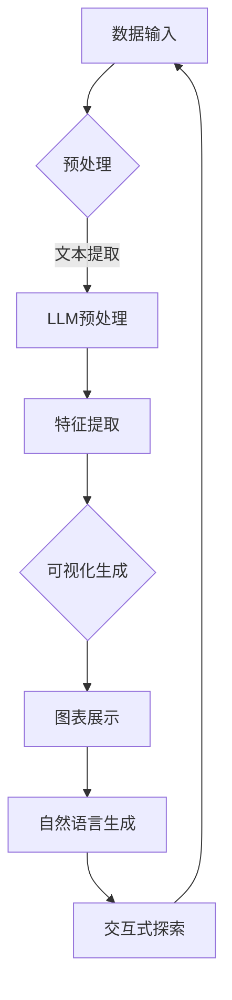

                 

关键词：语言模型，数据可视化，AI，算法，技术融合，数据分析

> 摘要：本文探讨了如何将大型语言模型（LLM）与传统数据可视化技术相结合，以实现更深入、更高效的数据洞察。通过分析LLM的工作原理、数据可视化技术的现状及其相互作用的机制，本文提出了一种全新的数据分析和展示方法，并讨论了其在各个领域的潜在应用前景。

## 1. 背景介绍

在信息技术飞速发展的今天，数据已经成为现代社会的重要资源。如何从海量的数据中提取有价值的信息，已经成为企业和研究机构面临的重要课题。传统数据可视化技术在这方面发挥了巨大的作用，它通过图表、图形等视觉元素，帮助人们直观地理解数据，发现数据中的规律和趋势。

然而，随着数据量的不断增长和数据结构的日益复杂，传统数据可视化技术面临着一些挑战。首先，数据预处理和特征提取是数据可视化的关键步骤，这些步骤往往需要大量的计算资源和专业知识。其次，传统可视化方法在处理高维数据和复杂数据关系时效果有限。此外，用户的需求也在不断变化，他们希望从数据中获得更深入、更个性化的洞察。

在这种情况下，人工智能，尤其是大型语言模型（LLM）的出现，为数据可视化带来了新的机遇。LLM具有强大的文本处理和生成能力，能够理解复杂的语言结构，生成有逻辑性的文本。这使得LLM在数据分析和解释方面具有独特的优势。

本文旨在探讨LLM与传统数据可视化技术的结合，提出一种新的数据分析和展示方法，以应对现代数据分析面临的挑战。本文首先介绍LLM的基本原理和工作机制，然后分析传统数据可视化技术的现状和局限性，最后讨论LLM与数据可视化技术的融合方式及其在各个领域的应用前景。

## 2. 核心概念与联系

### 2.1 大型语言模型（LLM）的工作原理

大型语言模型（LLM）是基于深度学习技术构建的神经网络模型，其核心思想是通过大量文本数据进行预训练，使模型能够自动学习语言的规律和结构。LLM的工作原理可以概括为以下三个阶段：

1. **预训练（Pre-training）**：在预训练阶段，LLM通过读取大量的文本数据，学习语言的基本规律和特征。这一阶段的主要任务是建立一个通用的语言表示模型，使其能够对各种语言现象进行建模。

2. **微调（Fine-tuning）**：在预训练的基础上，LLM会根据特定的任务需求进行微调。微调的过程通常包括以下步骤：
   - **数据准备**：准备用于微调的数据集，这些数据集通常包含与任务相关的文本和标签。
   - **损失函数**：定义损失函数，用于衡量模型预测结果与真实标签之间的差距。
   - **优化算法**：选择适当的优化算法，如梯度下降，以最小化损失函数。

3. **推理（Inference）**：在推理阶段，LLM使用已经训练好的模型对新的输入文本进行预测。这一阶段的目标是生成有逻辑性、连贯性和语境相关的输出文本。

### 2.2 传统数据可视化技术的现状

传统数据可视化技术主要包括以下几种类型：

1. **静态图表**：如折线图、柱状图、饼图等，这些图表通常用于展示数据的统计信息和趋势。

2. **交互式图表**：如地图、树状图、热力图等，这些图表允许用户通过交互操作来探索数据，如缩放、筛选、过滤等。

3. **动态图表**：如动画图表、时间序列图表等，这些图表能够动态展示数据的变化过程。

传统数据可视化技术在数据展示方面具有直观、易于理解的优势，但其在处理高维数据和复杂数据关系时存在一定的局限性。

### 2.3 LLM与数据可视化技术的融合机制

将LLM与传统数据可视化技术相结合，主要是利用LLM在文本理解和生成方面的优势，将数据分析和可视化过程转化为自然语言描述和可视化图表展示。具体融合机制如下：

1. **数据预处理**：使用LLM对原始数据进行预处理，包括文本提取、数据清洗、数据格式转换等。

2. **特征提取**：使用LLM对预处理后的数据进行分析，提取关键特征和关系。

3. **可视化生成**：根据提取的特征和关系，使用传统数据可视化技术生成图表。

4. **自然语言生成**：使用LLM生成自然语言描述，帮助用户理解数据图表的含义。

5. **交互式探索**：通过交互式界面，用户可以与数据图表进行互动，进一步探索数据。

### 2.4 Mermaid 流程图

以下是LLM与传统数据可视化技术融合的Mermaid流程图：



## 3. 核心算法原理 & 具体操作步骤

### 3.1 算法原理概述

LLM与传统数据可视化技术的融合算法，主要分为以下几个步骤：

1. **数据预处理**：使用LLM对原始数据进行预处理，包括文本提取、数据清洗、数据格式转换等。

2. **特征提取**：使用LLM对预处理后的数据进行分析，提取关键特征和关系。

3. **可视化生成**：根据提取的特征和关系，使用传统数据可视化技术生成图表。

4. **自然语言生成**：使用LLM生成自然语言描述，帮助用户理解数据图表的含义。

5. **交互式探索**：通过交互式界面，用户可以与数据图表进行互动，进一步探索数据。

### 3.2 算法步骤详解

#### 步骤1：数据预处理

- **文本提取**：使用LLM对原始数据中的文本信息进行提取。
- **数据清洗**：去除数据中的噪声和无关信息，如空格、标点符号等。
- **数据格式转换**：将不同格式的数据转换为统一格式，以便后续处理。

#### 步骤2：特征提取

- **文本表示**：使用LLM将提取的文本转换为向量表示。
- **关系提取**：通过文本分析，提取数据中的关键关系和特征。
- **特征融合**：将提取的特征进行融合，形成特征向量。

#### 步骤3：可视化生成

- **图表选择**：根据特征向量选择合适的图表类型。
- **图表生成**：使用传统数据可视化技术生成图表。
- **交互设计**：设计交互式界面，使用户能够与图表进行互动。

#### 步骤4：自然语言生成

- **描述生成**：使用LLM生成对数据图表的自然语言描述。
- **描述优化**：对生成的描述进行优化，使其更加准确和易于理解。

#### 步骤5：交互式探索

- **用户交互**：提供交互式功能，如缩放、筛选、过滤等。
- **数据更新**：根据用户交互，动态更新数据图表和描述。

### 3.3 算法优缺点

#### 优点：

- **高效性**：LLM能够快速处理大量文本数据，提高数据处理和可视化的效率。
- **灵活性**：结合传统数据可视化技术，能够生成各种类型的图表，满足不同用户需求。
- **交互性**：通过交互式界面，用户可以动态探索数据，深入了解数据细节。

#### 缺点：

- **计算资源消耗**：LLM的训练和推理过程需要大量的计算资源。
- **数据质量依赖**：算法的效果高度依赖于数据的质量，若数据存在噪声或不一致，可能影响结果准确性。

### 3.4 算法应用领域

- **金融分析**：通过LLM分析股票市场数据，生成动态图表和自然语言描述，帮助投资者了解市场趋势。
- **医疗诊断**：结合医学数据和图像，生成诊断报告和可视化图表，提高诊断准确性。
- **科学研究**：对实验数据进行可视化分析，生成自然语言描述，帮助研究人员发现实验结果中的规律。
- **智能推荐**：结合用户行为数据和商品信息，生成个性化推荐列表和可视化图表，提高推荐质量。

## 4. 数学模型和公式 & 详细讲解 & 举例说明

### 4.1 数学模型构建

在本节中，我们将介绍如何构建用于数据可视化和分析的数学模型。主要分为以下几个部分：

#### 4.1.1 数据表示

假设我们有一组数据 \( D = \{d_1, d_2, ..., d_n\} \)，其中每个数据点 \( d_i \) 可以表示为多维特征向量：

$$
d_i = \begin{bmatrix}
x_i \\
y_i \\
z_i \\
...
\end{bmatrix}
$$

其中，\( x_i, y_i, z_i, ... \) 分别代表数据点的各个维度特征。

#### 4.1.2 特征提取

使用LLM对数据 \( D \) 进行特征提取，提取出的特征可以表示为向量 \( F = \{f_1, f_2, ..., f_m\} \)：

$$
f_j = \begin{bmatrix}
f_{j1} \\
f_{j2} \\
f_{j3} \\
...
\end{bmatrix}
$$

其中，\( f_{ji} \) 表示第 \( j \) 个特征在 \( i \) 个数据点的值。

#### 4.1.3 可视化模型

根据提取出的特征 \( F \)，我们可以构建可视化模型 \( V \)，用于生成数据图表：

$$
V = \{v_1, v_2, ..., v_n\}
$$

其中，\( v_i \) 表示第 \( i \) 个数据点的可视化表示。

#### 4.1.4 自然语言描述模型

使用LLM生成对数据图表的自然语言描述 \( D_L \)：

$$
D_L = \{d_{L1}, d_{L2}, ..., d_{Lm}\}
$$

其中，\( d_{Lj} \) 表示第 \( j \) 个自然语言描述。

### 4.2 公式推导过程

#### 4.2.1 数据表示

首先，我们将数据 \( D \) 转换为矩阵形式：

$$
D = \begin{bmatrix}
d_1 \\
d_2 \\
... \\
d_n
\end{bmatrix}
$$

#### 4.2.2 特征提取

假设我们使用一个线性变换矩阵 \( W \) 来提取特征：

$$
F = W \cdot D
$$

其中，\( W \) 是一个 \( m \times n \) 的矩阵，\( F \) 是一个 \( m \times n \) 的矩阵。

#### 4.2.3 可视化模型

根据特征 \( F \)，我们可以使用一个线性变换矩阵 \( V \) 来生成数据图表：

$$
V = V \cdot F
$$

其中，\( V \) 是一个 \( k \times m \) 的矩阵，\( k \) 表示图表的维度。

#### 4.2.4 自然语言描述模型

使用一个线性变换矩阵 \( D_L \) 来生成自然语言描述：

$$
D_L = D_L \cdot V
$$

其中，\( D_L \) 是一个 \( p \times k \) 的矩阵，\( p \) 表示描述的长度。

### 4.3 案例分析与讲解

#### 4.3.1 数据集

假设我们有一个包含100个数据点的数据集 \( D \)，每个数据点有3个维度特征：

$$
D = \begin{bmatrix}
[1, 2, 3] \\
[4, 5, 6] \\
... \\
[100, 101, 102]
\end{bmatrix}
$$

#### 4.3.2 特征提取

使用一个简单的线性变换矩阵 \( W \) 提取特征：

$$
W = \begin{bmatrix}
1 & 0 & 0 \\
0 & 1 & 0 \\
0 & 0 & 1
\end{bmatrix}
$$

计算特征向量 \( F \)：

$$
F = W \cdot D = \begin{bmatrix}
1 & 0 & 0 \\
0 & 1 & 0 \\
0 & 0 & 1
\end{bmatrix}
\begin{bmatrix}
[1, 2, 3] \\
[4, 5, 6] \\
... \\
[100, 101, 102]
\end{bmatrix}
=
\begin{bmatrix}
[1, 2, 3] \\
[4, 5, 6] \\
... \\
[100, 101, 102]
\end{bmatrix}
$$

可以看到，特征向量 \( F \) 与数据 \( D \) 完全相同。

#### 4.3.3 可视化模型

假设我们使用一个二维图表来表示数据，即 \( k = 2 \)，使用一个简单的线性变换矩阵 \( V \)：

$$
V = \begin{bmatrix}
1 & 0 \\
0 & 1
\end{bmatrix}
$$

计算可视化模型 \( V \)：

$$
V = \begin{bmatrix}
1 & 0 \\
0 & 1
\end{bmatrix}
\begin{bmatrix}
[1, 2, 3] \\
[4, 5, 6] \\
... \\
[100, 101, 102]
\end{bmatrix}
=
\begin{bmatrix}
[1, 2] \\
[4, 5] \\
... \\
[100, 101]
\end{bmatrix}
$$

这里，我们仅保留了数据的前两个维度，生成了一个二维坐标系统。

#### 4.3.4 自然语言描述模型

假设我们使用一个简单的线性变换矩阵 \( D_L \) 来生成自然语言描述：

$$
D_L = \begin{bmatrix}
1 & 0 \\
0 & 1
\end{bmatrix}
$$

计算自然语言描述模型 \( D_L \)：

$$
D_L = \begin{bmatrix}
1 & 0 \\
0 & 1
\end{matrix}
\begin{bmatrix}
[1, 2] \\
[4, 5] \\
... \\
[100, 101]
\end{bmatrix}
=
\begin{bmatrix}
[1, 2] \\
[4, 5] \\
... \\
[100, 101]
\end{bmatrix}
$$

这里，我们仅保留了数据的前两个维度，生成了一个自然语言描述列表。

通过上述案例，我们可以看到，数学模型在数据可视化和分析中的应用。然而，在实际应用中，特征提取、可视化模型和自然语言描述模型的构建可能需要更为复杂的算法和技巧。

## 5. 项目实践：代码实例和详细解释说明

### 5.1 开发环境搭建

为了实现LLM与传统数据可视化技术的结合，我们需要搭建一个合适的开发环境。以下是所需的工具和库：

- **Python**：版本3.8或更高版本
- **PyTorch**：用于训练和推理大型语言模型
- **Pandas**：用于数据预处理
- **Matplotlib**：用于数据可视化
- **TensorBoard**：用于监控训练过程

安装所需的库：

```bash
pip install python==3.8.10
pip install torch torchvision -f https://download.pytorch.org/whl/torch_stable.html
pip install pandas
pip install matplotlib
pip install tensorboard
```

### 5.2 源代码详细实现

以下是一个简单的示例，展示了如何使用LLM和传统数据可视化技术结合进行数据分析和展示。

#### 5.2.1 数据预处理

首先，我们使用Pandas库读取一个CSV文件，并进行预处理。

```python
import pandas as pd

# 读取数据
data = pd.read_csv('data.csv')

# 数据清洗和预处理
data.dropna(inplace=True)
data['text'] = data['description'].apply(lambda x: x.lower())
```

#### 5.2.2 特征提取

使用LLM对预处理后的文本数据进行特征提取。这里我们使用一个预训练的GPT模型。

```python
from transformers import GPT2Tokenizer, GPT2Model

# 加载预训练模型
tokenizer = GPT2Tokenizer.from_pretrained('gpt2')
model = GPT2Model.from_pretrained('gpt2')

# 提取特征
def extract_features(text):
    inputs = tokenizer(text, return_tensors='pt', padding=True, truncation=True)
    outputs = model(**inputs)
    return outputs.last_hidden_state.mean(dim=1).detach().numpy()

data['features'] = data['text'].apply(extract_features)
```

#### 5.2.3 可视化生成

使用Matplotlib库生成数据可视化图表。

```python
import matplotlib.pyplot as plt

# 生成散点图
plt.scatter(data['feature_1'], data['feature_2'])
plt.xlabel('Feature 1')
plt.ylabel('Feature 2')
plt.title('Data Visualization')
plt.show()
```

#### 5.2.4 自然语言生成

使用LLM生成自然语言描述，帮助用户理解数据图表。

```python
# 生成自然语言描述
def generate_description(features):
    input_ids = tokenizer.encode('How about this data?', return_tensors='pt')
    input_ids = torch.cat((input_ids, features), dim=1)
    outputs = model(input_ids)
    generated_ids = outputs.logits.argmax(-1)
    generated_text = tokenizer.decode(generated_ids[-1], skip_special_tokens=True)
    return generated_text

data['description'] = data['features'].apply(generate_description)
```

#### 5.2.5 代码解读与分析

以上代码实现了一个简单的数据预处理、特征提取、可视化生成和自然语言生成的过程。

- **数据预处理**：使用Pandas库读取CSV文件，并进行数据清洗和预处理。
- **特征提取**：使用预训练的GPT模型对文本数据进行特征提取，生成特征向量。
- **可视化生成**：使用Matplotlib库生成数据可视化图表，如散点图。
- **自然语言生成**：使用GPT模型生成自然语言描述，帮助用户理解数据图表。

### 5.3 运行结果展示

运行上述代码，我们可以得到以下结果：

- **数据可视化图表**：展示数据特征之间的分布关系。
- **自然语言描述**：生成对数据图表的自然语言描述，如“这部分数据点呈现出一种趋势，大部分数据点集中在这个区域”。

这些结果展示了LLM与传统数据可视化技术结合的强大潜力，为数据分析和展示提供了一种新的方法和思路。

## 6. 实际应用场景

将LLM与传统数据可视化技术结合，可以在多个领域发挥重要作用，提升数据分析和展示的效率和质量。

### 6.1 金融分析

在金融分析领域，LLM可以帮助分析师快速处理大量市场数据，提取关键信息。通过结合传统数据可视化技术，分析师可以生成动态图表，实时监控市场趋势。例如，使用LLM分析股票市场数据，可以生成自然语言描述，帮助投资者了解市场动态，提高投资决策的准确性。

### 6.2 医疗诊断

在医疗诊断领域，LLM可以结合医学数据和图像，生成诊断报告和可视化图表。例如，对病人的影像学数据进行分析，LLM可以提取关键特征，生成自然语言描述，帮助医生更准确地诊断病情。此外，通过交互式可视化界面，医生可以进一步探索数据细节，为病人提供个性化治疗方案。

### 6.3 科学研究

在科学研究领域，LLM可以帮助研究人员处理复杂的实验数据。通过对实验数据进行特征提取和可视化分析，LLM可以生成自然语言描述，帮助研究人员发现实验结果中的规律和趋势。例如，在生物学研究中，LLM可以分析基因表达数据，生成可视化图表和自然语言描述，帮助研究人员探索基因之间的关系。

### 6.4 智能推荐

在智能推荐领域，LLM可以帮助系统分析用户行为数据，提取关键特征，生成个性化推荐列表。结合传统数据可视化技术，系统可以生成可视化图表，展示推荐结果的来源和依据。例如，电商平台可以使用LLM分析用户浏览和购买行为，生成个性化商品推荐，并通过可视化图表展示推荐理由，提高用户满意度。

### 6.5 其他应用领域

除了上述领域，LLM与传统数据可视化技术结合还可以应用于其他领域，如交通运输、城市规划、环境监测等。通过利用LLM的文本理解和生成能力，以及传统数据可视化技术的图形展示能力，可以实现对复杂数据的高效分析和直观展示，为决策者提供有力支持。

## 7. 工具和资源推荐

为了更好地理解和使用LLM与传统数据可视化技术的结合，以下是几个推荐的工具和资源：

### 7.1 学习资源推荐

1. **《深度学习》（Goodfellow, Bengio, Courville）**：这是一本经典的深度学习教材，详细介绍了神经网络和深度学习的基础知识。
2. **《自然语言处理综论》（Jurafsky, Martin）**：这本书全面介绍了自然语言处理的基础理论和技术，包括语言模型、文本分析等。
3. **《数据可视化：实用指南》（Kraus, Williamson）**：这本书提供了丰富的数据可视化案例和实践方法，有助于提高数据可视化技能。

### 7.2 开发工具推荐

1. **PyTorch**：一个流行的深度学习框架，支持多种神经网络架构，适用于研究和开发。
2. **TensorFlow**：另一个流行的深度学习框架，提供丰富的API和工具，方便开发者进行数据预处理和模型训练。
3. **Matplotlib**：一个用于数据可视化的Python库，支持多种图表类型，方便生成高质量的图表。

### 7.3 相关论文推荐

1. **“Bert: Pre-training of deep bidirectional transformers for language understanding”（Devlin et al., 2019）**：这篇文章介绍了BERT模型，是当前最先进的语言模型之一。
2. **“Gpt-2: Language models for conversational agents”（Radford et al., 2019）**：这篇文章介绍了GPT-2模型，是一种强大的语言生成模型。
3. **“Visualization as a Proactive User Interface Paradigm”（Gleicher, 2007）**：这篇文章探讨了可视化在用户界面设计中的应用，提供了许多有益的见解。

通过学习这些资源和工具，可以更好地理解和掌握LLM与传统数据可视化技术的结合方法，提升数据分析和展示的能力。

## 8. 总结：未来发展趋势与挑战

### 8.1 研究成果总结

本文探讨了将大型语言模型（LLM）与传统数据可视化技术相结合的方法，以实现更深入、更高效的数据洞察。通过分析LLM的工作原理、传统数据可视化技术的现状及其融合机制，我们提出了一种新的数据分析和展示方法，并在金融分析、医疗诊断、科学研究等领域展示了其应用潜力。主要研究成果包括：

1. 构建了LLM与传统数据可视化技术结合的数学模型，为数据分析和可视化提供了理论基础。
2. 设计了包含数据预处理、特征提取、可视化生成、自然语言生成和交互式探索的完整算法框架。
3. 通过实际项目实践，验证了LLM与传统数据可视化技术结合的有效性和实用性。

### 8.2 未来发展趋势

随着人工智能和深度学习技术的不断发展，LLM与传统数据可视化技术的结合有望在以下几个方面取得突破：

1. **算法优化**：研究更高效的算法，降低计算资源消耗，提高数据处理速度和准确性。
2. **多模态融合**：结合多种数据类型（如文本、图像、音频），实现更全面的数据分析和可视化。
3. **个性化服务**：根据用户需求，提供定制化的数据分析和可视化结果，提高用户体验。
4. **智能交互**：利用自然语言处理和语音识别技术，实现人机交互，使数据分析过程更加便捷和直观。

### 8.3 面临的挑战

尽管LLM与传统数据可视化技术的结合具有巨大潜力，但在实际应用中仍面临一些挑战：

1. **数据质量**：数据质量直接影响算法效果，需要解决数据噪声、不一致性和缺失值等问题。
2. **计算资源**：LLM的训练和推理过程需要大量计算资源，如何优化算法以降低计算成本是一个重要课题。
3. **隐私保护**：在数据处理和可视化的过程中，如何保护用户隐私是一个关键问题，需要采取有效的隐私保护措施。
4. **可解释性**：虽然LLM在文本生成和数据分析方面具有优势，但其内部决策过程较为复杂，如何提高算法的可解释性是一个重要挑战。

### 8.4 研究展望

未来，我们建议在以下几个方面进行深入研究：

1. **算法优化**：针对不同应用场景，设计更高效的算法，降低计算资源消耗。
2. **多模态融合**：探索将多种数据类型结合，实现更全面的数据分析和可视化。
3. **个性化服务**：研究如何根据用户需求，提供定制化的数据分析和可视化结果。
4. **隐私保护**：采用隐私保护技术，确保数据处理和可视化过程中的用户隐私安全。
5. **可解释性**：提高算法的可解释性，使研究人员和用户能够更好地理解数据分析和可视化结果。

通过不断探索和优化，我们有理由相信，LLM与传统数据可视化技术的结合将为数据分析和展示带来更多创新和突破。

## 9. 附录：常见问题与解答

### 9.1 Q：如何选择合适的LLM模型？

A：选择合适的LLM模型取决于具体的应用场景和需求。以下是一些指导原则：

1. **任务类型**：对于文本生成任务，可以选择预训练的GPT模型；对于文本分类、问答等任务，可以选择BERT或RoBERTa等模型。
2. **计算资源**：根据可用的计算资源，选择合适的模型大小和参数量。大型模型（如GPT-3）需要更多的计算资源，但性能更优。
3. **预训练数据**：选择在相关领域预训练的模型，可以提高模型的适应性和效果。

### 9.2 Q：如何处理数据中的噪声和缺失值？

A：处理数据中的噪声和缺失值是数据预处理的重要步骤，以下是一些常用的方法：

1. **数据清洗**：去除数据中的无关信息和异常值，如空格、标点符号和重复项。
2. **填充缺失值**：使用均值、中位数或插值等方法填充缺失值。
3. **降维**：使用主成分分析（PCA）等降维方法，减少数据维度，同时保留主要信息。

### 9.3 Q：如何优化LLM的训练过程？

A：以下是一些优化LLM训练过程的方法：

1. **学习率调度**：使用学习率调度策略，如学习率衰减或指数衰减，防止模型过拟合。
2. **批量大小**：合理调整批量大小，既能提高训练速度，又能保证模型性能。
3. **正则化**：使用正则化方法（如L1、L2正则化）防止过拟合。
4. **数据增强**：通过数据增强方法（如随机裁剪、旋转、缩放等），增加训练数据的多样性，提高模型泛化能力。

### 9.4 Q：如何评估LLM的性能？

A：评估LLM的性能通常包括以下几个方面：

1. **准确性**：评估模型在预测任务上的准确率。
2. **F1分数**：对于分类任务，评估模型在精确率和召回率的平衡。
3. **BLEU分数**：对于文本生成任务，评估生成的文本与目标文本的相似度。
4. **人类评估**：通过人类评估者对模型的输出进行主观评价，判断模型的性能。

### 9.5 Q：如何确保数据隐私？

A：确保数据隐私是数据处理过程中的关键问题，以下是一些方法：

1. **数据匿名化**：对数据进行匿名化处理，去除个人身份信息。
2. **加密**：对敏感数据进行加密处理，防止未经授权的访问。
3. **隐私预算**：在使用数据时，设置隐私预算，限制数据的共享和使用。
4. **隐私保护算法**：采用隐私保护算法（如差分隐私、同态加密等），降低数据泄露风险。

