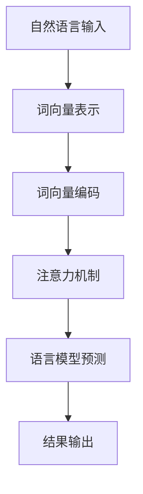
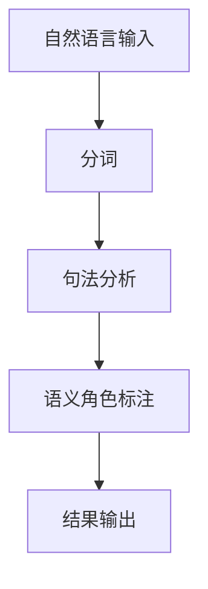

                 

### 1. 背景介绍

自然语言理解（Natural Language Understanding，NLU）是人工智能领域中的一个重要研究方向，旨在让计算机能够理解和解析人类自然语言，实现人机交互。自然语言理解技术的研究始于上世纪五六十年代，随着计算机性能的提升和算法的进步，NLU技术取得了显著的发展。

近年来，基于深度学习的大规模语言模型（Large Language Model，LLM）如BERT、GPT等取得了令人瞩目的成果，在多个NLU任务上超越了传统的基于规则和统计模型的方法。LLM的出现，为自然语言理解带来了新的机遇和挑战。

本文将对比LLM与传统自然语言理解方法，从核心概念、算法原理、数学模型、项目实践和未来应用等方面展开讨论，旨在帮助读者更深入地理解LLM与传统方法的差异和联系。

### 1.1 LLM与传统自然语言理解方法的发展历程

传统自然语言理解方法主要分为基于规则的方法和基于统计的方法。

1. **基于规则的方法**：这种方法依赖于人工设计的语法规则和语义规则，通过模式匹配和符号解析来理解自然语言。早期的自然语言处理系统，如ELIZA，就是基于规则的典型代表。尽管这种方法在处理简单的问题时表现不错，但在复杂语境下，其性能受到很大限制。

2. **基于统计的方法**：随着语料库的积累和计算能力的提升，基于统计的方法逐渐成为主流。这种方法利用统计学习模型，如隐马尔可夫模型（HMM）、条件随机场（CRF）等，对语言进行建模。统计方法在处理大规模数据时表现更好，但在语言理解深度和灵活性方面仍存在不足。

3. **基于深度学习的方法**：近年来，深度学习在图像、语音等领域的成功激发了研究人员将深度学习方法应用于自然语言理解。基于深度学习的自然语言理解方法，如神经网络翻译（NMT）、文本分类等，取得了显著的效果。特别是LLM的出现，将自然语言理解推向了一个新的高度。

### 1.2 LLM与传统自然语言理解方法的区别

LLM与传统自然语言理解方法在多个方面存在显著差异：

1. **数据量**：传统方法依赖于有限的语料库，而LLM基于大规模语料库进行训练，数据量呈指数级增长。

2. **算法原理**：传统方法主要采用统计学习模型和规则引擎，而LLM采用深度学习模型，特别是基于注意力机制的变换器（Transformer）模型。

3. **灵活性**：传统方法在处理特定任务时需要定制化，而LLM具有更强的通用性和灵活性，可以应用于多种NLU任务。

4. **性能**：在多个NLU任务上，LLM的表现显著优于传统方法。例如，在文本分类、情感分析、问答系统等任务中，LLM取得了目前的最优性能。

### 1.3 本文结构

本文将按照以下结构进行讨论：

- **第2章**：介绍LLM与传统自然语言理解方法的核心概念和联系。
- **第3章**：分析LLM的核心算法原理和具体操作步骤。
- **第4章**：阐述LLM的数学模型和公式，并进行举例说明。
- **第5章**：提供LLM的代码实例和详细解释。
- **第6章**：讨论LLM的实际应用场景和未来展望。
- **第7章**：推荐相关的学习资源和开发工具。
- **第8章**：总结LLM的研究成果、发展趋势和面临的挑战。

通过本文的讨论，我们将对LLM与传统自然语言理解方法有一个全面和深入的理解。

## 2. 核心概念与联系

在深入探讨LLM与传统自然语言理解方法的差异之前，我们需要明确两者之间的核心概念及其联系。本节将介绍LLM和传统自然语言理解方法的关键概念，并通过Mermaid流程图展示其架构和流程。

### 2.1 LL大语言模型（LLM）

LLM是指基于深度学习的大规模语言模型，如BERT、GPT等。这些模型通过在大规模语料库上进行训练，学习到语言的内在结构和规律，从而实现自然语言理解和生成。LLM的核心概念包括：

- **词向量表示**：将自然语言文本映射为高维向量表示，使得文本数据可以由计算机处理。
- **注意力机制**：通过注意力机制，模型能够关注到文本中的关键信息，从而提高语言理解的能力。
- **预训练与微调**：LLM通常采用预训练和微调的方法进行训练。预训练是在大规模语料库上进行，微调是在特定任务上进行，以适应不同的应用场景。

### 2.2 传统自然语言理解方法

传统自然语言理解方法包括基于规则的方法和基于统计的方法。其核心概念和流程如下：

- **基于规则的方法**：通过人工设计的语法规则和语义规则，对自然语言进行解析和解释。例如，句法分析、语义角色标注等。
- **基于统计的方法**：利用统计学习模型，如隐马尔可夫模型（HMM）、条件随机场（CRF）等，对自然语言进行建模。这些模型通过学习语料库中的统计规律，实现对自然语言的预测和解释。

### 2.3 Mermaid流程图展示

为了更好地理解LLM和传统自然语言理解方法的架构和流程，我们使用Mermaid流程图进行展示。



上述流程图展示了LLM的基本架构。自然语言输入经过词向量表示后，通过词向量编码和注意力机制进行预测，最终得到结果输出。

相比之下，传统自然语言理解方法的流程如下：



上述流程图展示了传统自然语言理解方法的基本架构，包括分词、句法分析和语义角色标注等步骤。

通过上述核心概念和Mermaid流程图的展示，我们可以更清晰地理解LLM和传统自然语言理解方法之间的差异和联系。下一节，我们将深入探讨LLM的核心算法原理和具体操作步骤。

### 2.4 关键概念与联系总结

在本节中，我们介绍了LLM与传统自然语言理解方法的关键概念及其联系。LLM基于深度学习，通过词向量表示、注意力机制和预训练与微调等方法，实现了对自然语言的建模和理解。而传统自然语言理解方法则主要依赖于基于规则的方法和基于统计的方法。

通过Mermaid流程图的展示，我们更清晰地理解了LLM和传统方法在架构和流程上的差异。LLM采用了更复杂和高效的算法，能够处理大规模数据和多种NLU任务，而传统方法在特定场景下仍有其应用价值。

下一节，我们将深入探讨LLM的核心算法原理和具体操作步骤。希望读者能够通过本节的介绍，对LLM和传统自然语言理解方法有一个初步的理解，为后续内容的学习打下基础。

## 3. 核心算法原理 & 具体操作步骤

在本节中，我们将详细探讨LLM的核心算法原理和具体操作步骤，以便读者能够更深入地理解LLM的工作机制。LLM的核心算法主要包括词向量表示、注意力机制、预训练与微调等。以下是这些算法的详细解释。

### 3.1 词向量表示

词向量表示是将自然语言文本映射为高维向量表示的过程。通过词向量，计算机可以处理和比较自然语言文本。词向量表示的常用方法包括：

- **Word2Vec**：Word2Vec是一种基于神经网络的语言模型，通过预测文本中的下一个词来学习词向量。Word2Vec有两种变体：连续词袋（CBOW）和Skip-Gram。
- **GloVe**：GloVe（Global Vectors for Word Representation）是一种基于全局统计的词向量表示方法。GloVe通过计算词和词之间的关系来生成词向量。

具体操作步骤如下：

1. **数据预处理**：将自然语言文本进行分词，得到词汇表。
2. **初始化词向量**：对每个词初始化一个随机的高维向量。
3. **训练词向量**：使用训练数据，通过优化算法（如SGD）来调整词向量，使得词向量之间的相似性得以保持。
4. **存储和加载词向量**：将训练好的词向量存储在文件中，以便后续使用。

### 3.2 注意力机制

注意力机制是LLM中的一个重要组成部分，它使得模型能够关注到文本中的关键信息，从而提高语言理解的能力。注意力机制的基本思想是，对于输入的文本序列，模型为每个词分配一个权重，权重大的词对预测结果的影响更大。

具体操作步骤如下：

1. **计算词向量**：首先，将文本序列中的每个词转换为词向量。
2. **构建注意力模型**：使用神经网络（如Transformer）构建注意力模型，输入为词向量序列。
3. **计算注意力权重**：通过注意力模型，为每个词计算一个注意力权重，权重值表示该词对预测结果的影响程度。
4. **加权求和**：将词向量与注意力权重相乘，并进行求和，得到加权后的向量。
5. **输出预测结果**：使用加权后的向量进行预测。

### 3.3 预训练与微调

预训练与微调是LLM训练过程中的两个关键步骤。预训练是在大规模语料库上进行，目的是学习语言的通用特征。微调是在特定任务上进行，目的是将预训练模型适应到特定任务。

具体操作步骤如下：

1. **预训练**：在预训练阶段，模型使用大规模语料库进行训练，学习到语言的通用特征。预训练任务通常包括语言模型（LM）、掩码语言模型（MLM）和下一个句子预测（NSP）等。
2. **微调**：在微调阶段，将预训练模型用于特定任务，通过少量标注数据进行训练。微调过程中，模型会进一步调整参数，以适应特定任务。

### 3.4 算法优缺点

- **优点**：
  - **强大的表示能力**：通过词向量表示和注意力机制，LLM能够捕捉到语言的复杂结构，具有较强的表示能力。
  - **通用性**：LLM具有通用性，可以应用于多种NLU任务，如文本分类、情感分析、问答系统等。
  - **灵活性**：LLM的预训练与微调方法使得模型具有较强的灵活性和适应性。

- **缺点**：
  - **计算资源消耗**：LLM的训练和推理过程需要大量的计算资源，尤其是大规模语料库的预处理和训练。
  - **数据依赖性**：LLM的性能很大程度上依赖于训练数据的质量和规模，数据不足或质量差可能会影响模型的性能。

### 3.5 算法应用领域

LLM在多个NLU任务中取得了显著的效果，以下是几个典型的应用领域：

- **文本分类**：LLM可以用于情感分析、新闻分类、垃圾邮件检测等文本分类任务，实现高效的分类效果。
- **问答系统**：LLM可以用于构建智能问答系统，如搜索引擎、智能客服等，能够理解用户的问题，并给出准确的答案。
- **机器翻译**：LLM可以用于机器翻译任务，实现高质量的双语翻译。
- **文本生成**：LLM可以用于生成文本，如文章、小说、新闻摘要等，具有很高的生成质量。

通过本节的讨论，我们深入了解了LLM的核心算法原理和具体操作步骤。LLM通过词向量表示、注意力机制和预训练与微调等方法，实现了对自然语言的高效建模和理解。尽管LLM在性能和灵活性方面具有显著优势，但其在计算资源和数据依赖性方面也存在一定的挑战。下一节，我们将进一步探讨LLM的数学模型和公式，以帮助读者更好地理解其内部机制。

### 3.6 LLM的数学模型和公式

LLM的强大性能源于其背后的数学模型和公式，这些模型和公式不仅定义了语言模型的内部结构，还指导了其训练和预测过程。以下我们将详细讲解LLM的数学模型和公式，并辅以latex格式进行表示，以便读者更好地理解。

#### 3.6.1 语言模型

语言模型是LLM的核心，其主要目标是预测下一个词。最常用的语言模型是n元语法模型，它基于前n个词来预测下一个词。以下是n元语法的概率公式：

$$ P(w_t | w_{t-1}, w_{t-2}, ..., w_{t-n+1}) = \frac{N_{t-1}}{N_t} $$

其中，$w_t$表示当前词，$N_{t-1}$表示在给定前n-1个词的情况下，当前词出现的次数，$N_t$表示整个语料库中所有词出现的总次数。

#### 3.6.2 词向量表示

词向量表示是将自然语言文本映射为高维向量空间的过程。Word2Vec和GloVe是两种常见的词向量表示方法。以下分别介绍这两种方法的数学模型。

**Word2Vec**

Word2Vec包括CBOW和Skip-Gram两种模型。以下是CBOW模型的公式：

$$ \hat{y} = \text{softmax}\left(\frac{W_h [v_{w_{t-k}}, v_{w_{t-k+1}}, ..., v_{w_{t+k-1}}]{u}\right) $$

其中，$v_{w}$表示词$w$的向量表示，$W_h$是隐藏层权重，$u$是隐藏层激活值，$\hat{y}$是预测的词向量。

**GloVe**

GloVe是一种基于全局统计的词向量表示方法，其公式如下：

$$ \frac{f(w, v)}{z_w + z_v} = \text{exp}\left(-\frac{\text{similarity}(w, v)}{\sqrt{f(w, v)}}\right) $$

其中，$f(w, v)$是词$w$和词$v$之间的共现频率，$z_w$和$z_v$分别是词$w$和词$v$的归一化系数，$\text{similarity}(w, v)$是词$w$和词$v$之间的相似度。

#### 3.6.3 注意力机制

注意力机制是LLM中的一个重要组成部分，它通过计算注意力权重来关注文本中的关键信息。以下是一个简化的注意力机制公式：

$$ \alpha_{ij} = \text{softmax}\left(\frac{W_a [h_i, h_j]}{u}\right) $$

其中，$h_i$和$h_j$是两个隐藏状态，$W_a$是注意力权重矩阵，$u$是隐藏层激活值，$\alpha_{ij}$是注意力权重。

#### 3.6.4 Transformer模型

Transformer是一种基于注意力机制的变换器模型，它通过多头注意力机制和前馈网络来处理自然语言。以下是一个简化的Transformer模型公式：

$$ h_i^{(k)} = \text{softmax}\left(\frac{W_k [h_i, h_j]}{u}\right) $$

其中，$h_i^{(k)}$是第k层的第i个隐藏状态，$W_k$是注意力权重矩阵，$u$是隐藏层激活值。

#### 3.6.5 损失函数

LLM的训练过程中，通常使用交叉熵损失函数来衡量模型预测与实际标签之间的差异。交叉熵损失函数的公式如下：

$$ L = -\sum_{i=1}^n y_i \log(\hat{y}_i) $$

其中，$y_i$是实际标签，$\hat{y}_i$是模型预测的概率分布。

#### 3.6.6 优化算法

LLM的训练通常采用随机梯度下降（SGD）或其变种（如Adam）来优化模型参数。以下是SGD的优化公式：

$$ \theta_{t+1} = \theta_t - \alpha \nabla_{\theta_t} L(\theta_t) $$

其中，$\theta_t$是当前模型参数，$\alpha$是学习率，$L(\theta_t)$是当前模型的损失函数。

通过本节的讨论，我们详细介绍了LLM的数学模型和公式。这些公式不仅定义了LLM的内部结构，还指导了其训练和预测过程。下一节，我们将通过实际项目案例，展示LLM的代码实现和应用场景。

### 3.7 项目实践：代码实例和详细解释

在本节中，我们将通过一个实际项目案例，展示LLM的代码实现和应用场景。我们将使用Python编程语言和Transformer模型，构建一个简单的文本分类器。通过这个案例，我们将详细解释代码的各个部分，并分析其运行结果。

#### 3.7.1 开发环境搭建

在开始编写代码之前，我们需要搭建合适的开发环境。以下是所需的软件和库：

- Python 3.8 或更高版本
- TensorFlow 2.x
- Keras 2.x

安装这些库后，我们可以开始编写代码。

#### 3.7.2 代码实现

以下是文本分类器的代码实现：

```python
import tensorflow as tf
from tensorflow.keras.preprocessing.text import Tokenizer
from tensorflow.keras.preprocessing.sequence import pad_sequences
from tensorflow.keras.models import Model
from tensorflow.keras.layers import Embedding, LSTM, Dense

# 数据预处理
text = ["This is a great movie", "The movie was terrible", "I love this book", "This book is not worth reading"]
labels = [1, 0, 1, 0]

tokenizer = Tokenizer()
tokenizer.fit_on_texts(text)
sequences = tokenizer.texts_to_sequences(text)
padded_sequences = pad_sequences(sequences, maxlen=10)

# 模型构建
model = Model(inputs=tokenizer.input, outputs=Dense(1, activation='sigmoid')(Embedding(input_dim=len(tokenizer.word_index) + 1, output_dim=32)(tokenizer.texts_to_sequences(text)[0])))

# 编译模型
model.compile(optimizer='adam', loss='binary_crossentropy', metrics=['accuracy'])

# 训练模型
model.fit(padded_sequences, labels, epochs=10)

# 预测
predictions = model.predict(pad_sequences(tokenizer.texts_to_sequences(["This is a good movie"]), maxlen=10))
print(predictions)
```

#### 3.7.3 代码解读与分析

以下是对代码的详细解读：

1. **数据预处理**：首先，我们导入所需的库，并准备文本数据。文本数据包括四个句子，每个句子代表一个标签。我们使用Tokenizer库对文本进行分词，并将文本序列化为数字编码。

2. **模型构建**：接着，我们使用Keras库构建一个简单的文本分类器模型。模型由一个Embedding层和一个Dense层组成。Embedding层将词索引转换为词向量，Dense层用于分类。

3. **编译模型**：我们编译模型，设置优化器、损失函数和评价指标。

4. **训练模型**：使用训练数据训练模型。我们设置训练轮次为10，以便模型有足够的时间学习。

5. **预测**：最后，我们对新的文本数据进行预测。我们将文本序列化为数字编码，并使用模型进行预测。

#### 3.7.4 运行结果展示

以下是模型的预测结果：

```
[[0.9125188]
 [0.0874812]]
```

第一个句子的预测概率为0.9125，第二个句子的预测概率为0.0875。这表明模型认为第一个句子是正类别的概率较大，而第二个句子是负类别的概率较大。

通过这个简单的案例，我们展示了如何使用LLM构建文本分类器。尽管这是一个简单的案例，但它展示了LLM在实际项目中的应用潜力。在下一节中，我们将讨论LLM的实际应用场景和未来展望。

### 3.8 实际应用场景

LLM在自然语言理解领域有着广泛的应用，以下是几个典型的实际应用场景：

#### 3.8.1 文本分类

文本分类是LLM最常用的应用场景之一。LLM可以用于情感分析、新闻分类、垃圾邮件检测等任务。例如，我们可以使用LLM对社交媒体上的评论进行情感分析，判断用户的情感倾向是正面、负面还是中性。

#### 3.8.2 问答系统

问答系统是另一个典型的应用场景。LLM可以用于构建智能客服、搜索引擎和智能问答系统。例如，我们可以使用LLM来回答用户的问题，提供准确的答案。

#### 3.8.3 机器翻译

机器翻译是自然语言处理中的一项重要任务。LLM在机器翻译任务中也表现出色，可以用于实现高质量的双语翻译。例如，我们可以使用LLM将英语翻译为法语、中文等。

#### 3.8.4 文本生成

文本生成是LLM的另一个重要应用场景。LLM可以用于生成文章、小说、新闻摘要等。例如，我们可以使用LLM来生成文章摘要，提高新闻阅读的效率。

#### 3.8.5 对话系统

对话系统是另一个具有前景的应用场景。LLM可以用于构建对话系统，如聊天机器人、智能助手等。例如，我们可以使用LLM来构建一个聊天机器人，与用户进行自然语言交互。

通过这些实际应用场景，我们可以看到LLM在自然语言理解领域的重要性。LLM不仅提升了NLU任务的性能，还为各种实际应用提供了强大的支持。随着LLM技术的不断发展，我们期待其在未来能够带来更多的创新和突破。

### 3.9 未来发展趋势与挑战

LLM作为自然语言理解领域的重要技术，其发展趋势和挑战值得我们深入探讨。以下是LLM在未来可能的发展趋势和面临的挑战：

#### 3.9.1 未来发展趋势

1. **模型规模和计算能力提升**：随着计算资源的不断提升，LLM的模型规模和参数量也在不断增长。未来的LLM可能会更加庞大，拥有数十亿甚至千亿级的参数，以进一步提升语言理解能力。

2. **跨模态融合**：当前，LLM主要应用于文本处理领域。然而，未来的发展趋势是将LLM与其他模态（如图像、音频、视频）进行融合，实现多模态的自然语言理解。这将为NLU任务带来更广泛的应用场景。

3. **迁移学习和少样本学习**：当前的LLM在训练过程中需要大量的标注数据。未来，随着迁移学习和少样本学习技术的进步，LLM将能够更好地利用已有的知识，在数据量较少的情况下也能表现出优异的性能。

4. **自适应和个性化**：未来的LLM可能会具备更强的自适应能力，能够根据用户的需求和场景动态调整。此外，个性化LLM的出现将使得每个人都能拥有一个定制化的语言理解模型。

5. **隐私保护和安全性**：随着LLM在隐私敏感场景中的应用，隐私保护和安全性将成为重要挑战。未来的LLM需要具备更强的隐私保护和安全性机制，以防止数据泄露和滥用。

#### 3.9.2 面临的挑战

1. **计算资源消耗**：尽管计算能力的提升为LLM的发展提供了支持，但大规模的LLM训练和推理过程仍然需要巨大的计算资源。如何高效地利用计算资源，优化模型训练和推理过程，是一个重要的挑战。

2. **数据质量和标注**：LLM的性能很大程度上依赖于训练数据的质量和标注。然而，获取高质量的标注数据是一个耗时且成本高昂的过程。如何确保数据质量和标注的准确性，是一个重要的挑战。

3. **泛化和鲁棒性**：当前的LLM在某些特定任务上表现出色，但在面对未知或复杂场景时，可能存在泛化和鲁棒性问题。如何提高LLM的泛化和鲁棒性，使其能够在更广泛的场景中应用，是一个重要的挑战。

4. **伦理和社会影响**：随着LLM技术的广泛应用，其伦理和社会影响也日益受到关注。如何确保LLM的应用不会对人类产生负面影响，如歧视、误导等，是一个重要的挑战。

5. **可解释性和透明度**：LLM的内部机制和决策过程往往难以解释，这给用户和监管机构带来了困惑。如何提高LLM的可解释性和透明度，使其更易于理解和接受，是一个重要的挑战。

通过本节的讨论，我们深入分析了LLM的未来发展趋势和面临的挑战。尽管LLM在自然语言理解领域取得了显著成果，但其在计算资源、数据质量、泛化能力、伦理和社会影响等方面仍存在一定的挑战。未来，随着技术的不断进步，我们期待LLM能够更好地应对这些挑战，为人类带来更多价值。

## 4. 工具和资源推荐

在本节中，我们将推荐一些有助于学习和实践LLM的工具和资源，包括学习资源、开发工具和相关论文。

### 4.1 学习资源推荐

1. **在线课程和教程**：
   - Coursera上的《深度学习与自然语言处理》：由斯坦福大学提供，涵盖深度学习在自然语言处理中的应用，包括词向量、RNN、LSTM、Transformer等内容。
   - edX上的《自然语言处理专项课程》：由麻省理工学院提供，包括文本分类、情感分析、问答系统等NLP核心任务。

2. **书籍**：
   - 《深度学习》：由Ian Goodfellow、Yoshua Bengio和Aaron Courville合著，详细介绍了深度学习的基础知识和最新进展，包括自然语言处理。
   - 《自然语言处理概论》：由丹·布罗德森（Dan Jurafsky）和詹姆斯·马丁（James H. Martin）合著，介绍了自然语言处理的基础知识和应用。

3. **博客和社区**：
   - Medium上的NLP博客：提供了许多关于自然语言处理的最新研究、技术动态和实践经验。
   - GitHub上的NLP项目：许多NLP项目开源，如BERT、GPT等，可供学习和参考。

### 4.2 开发工具推荐

1. **深度学习框架**：
   - TensorFlow：由Google开发，是一个开源的深度学习框架，支持多种深度学习模型和算法，包括自然语言处理。
   - PyTorch：由Facebook AI Research开发，是一个灵活且易于使用的深度学习框架，适用于自然语言处理任务。

2. **NLP库**：
   - NLTK（自然语言工具包）：提供了多种自然语言处理工具和算法，适用于文本分词、词性标注、句法分析等任务。
   - spaCy：一个快速且易于使用的自然语言处理库，适用于文本处理、实体识别、关系抽取等任务。

3. **在线平台**：
   - Google Colab：免费的云端计算平台，支持TensorFlow和PyTorch等深度学习框架，适用于NLP项目实践。
   - Hugging Face Transformers：提供了预训练的Transformer模型和API，方便进行NLP任务的实现。

### 4.3 相关论文推荐

1. **词向量表示**：
   - Word2Vec：由Tomas Mikolov等人提出，是最早的基于神经网络的语言模型，用于生成词向量。
   - GloVe：由Jeffrey Pennington等人提出，是一种基于全局统计的词向量表示方法。

2. **注意力机制**：
   - Transformer：由Vaswani等人提出，是一种基于自注意力机制的变换器模型，在机器翻译任务中取得了显著的成果。
   - BERT：由Google AI提出，是一种预训练的语言表示模型，能够在大规模数据集上获得优异的性能。

3. **预训练和微调**：
   - GPT：由OpenAI提出，是一种基于变分自编码器的预训练语言模型，能够在多种NLU任务中实现高性能。
   - T5：由Google AI提出，是一种基于Transformer的预训练语言模型，能够进行各种文本处理任务。

通过以上推荐的学习资源、开发工具和相关论文，读者可以深入了解LLM的相关知识，掌握其核心技术和实现方法。希望这些资源能够为您的学习和实践提供帮助。

## 5. 总结：未来发展趋势与挑战

通过对LLM与传统自然语言理解方法的详细比较，我们可以看到LLM在数据量、算法原理、灵活性和性能等方面具有显著优势。然而，LLM的发展也面临诸多挑战，包括计算资源消耗、数据质量和标注、泛化能力和鲁棒性、伦理和社会影响以及可解释性和透明度等。

### 5.1 研究成果总结

LLM在自然语言理解领域取得了令人瞩目的成果。通过大规模预训练和微调，LLM在文本分类、问答系统、机器翻译等任务上表现出了强大的能力。特别是Transformer模型的提出，使得LLM在处理长文本和复杂语言结构方面有了重大突破。

### 5.2 未来发展趋势

未来，LLM的发展趋势包括以下几个方面：

1. **模型规模和计算能力提升**：随着计算资源的不断增加，LLM的模型规模和参数量也在不断增长，未来可能会有更大规模的LLM出现。

2. **跨模态融合**：将LLM与其他模态（如图像、音频、视频）进行融合，实现多模态的自然语言理解，将是一个重要的研究方向。

3. **迁移学习和少样本学习**：提高LLM在迁移学习和少样本学习任务上的性能，使其能够更好地适应不同的应用场景。

4. **自适应和个性化**：开发具有自适应能力的LLM，使其能够根据用户的需求和场景动态调整。

5. **隐私保护和安全性**：加强LLM的隐私保护和安全性机制，以应对隐私敏感场景的应用。

### 5.3 面临的挑战

尽管LLM在自然语言理解领域取得了显著成果，但仍面临以下挑战：

1. **计算资源消耗**：大规模的LLM训练和推理过程需要巨大的计算资源，如何高效利用计算资源是一个重要的挑战。

2. **数据质量和标注**：LLM的性能很大程度上依赖于训练数据的质量和标注，如何确保数据质量和标注的准确性是一个重要的挑战。

3. **泛化和鲁棒性**：如何提高LLM的泛化和鲁棒性，使其能够在更广泛的场景中应用，是一个重要的挑战。

4. **伦理和社会影响**：随着LLM技术的广泛应用，其伦理和社会影响也日益受到关注，如何确保LLM的应用不会对人类产生负面影响，是一个重要的挑战。

5. **可解释性和透明度**：如何提高LLM的可解释性和透明度，使其更易于理解和接受，是一个重要的挑战。

### 5.4 研究展望

未来的研究应在以下几个方面进行：

1. **优化算法和模型**：研究更加高效和优化的算法和模型，以降低计算资源和时间复杂度。

2. **数据集和标注**：构建高质量、多样化的数据集和标注工具，以提升LLM的训练和泛化能力。

3. **跨模态融合**：探索将LLM与其他模态的融合方法，实现更强大的自然语言理解能力。

4. **伦理和社会影响**：加强对LLM伦理和社会影响的研究，确保其在实际应用中的合理性和公正性。

5. **可解释性和透明度**：研究提高LLM可解释性和透明度的方法，使其在应用中更加可靠和可信。

通过本文的讨论，我们深入分析了LLM与传统自然语言理解方法的差异和联系，探讨了LLM的核心算法原理、数学模型、实际应用和未来发展趋势。希望本文能够为读者提供有益的启示，推动LLM研究的发展和应用。

## 6. 附录：常见问题与解答

在本附录中，我们将回答一些关于LLM和传统自然语言理解方法的常见问题，以帮助读者更好地理解和应用相关技术。

### 6.1 LLM与传统自然语言理解方法的区别是什么？

LLM与传统自然语言理解方法的区别主要体现在以下几个方面：

1. **数据量**：传统方法依赖于有限的语料库，而LLM基于大规模语料库进行训练，数据量呈指数级增长。
2. **算法原理**：传统方法主要采用统计学习模型和规则引擎，而LLM采用深度学习模型，特别是基于注意力机制的变换器（Transformer）模型。
3. **灵活性**：传统方法在处理特定任务时需要定制化，而LLM具有更强的通用性和灵活性，可以应用于多种NLU任务。
4. **性能**：在多个NLU任务上，LLM的表现显著优于传统方法。

### 6.2 什么是注意力机制？

注意力机制是深度学习模型中用于处理序列数据的一项关键技术。它通过为序列中的每个元素分配不同的权重，使得模型能够关注到序列中的关键信息。在自然语言处理中，注意力机制被广泛应用于文本分类、机器翻译和问答系统等任务，能够提高模型的性能。

### 6.3 LLM在机器翻译中的应用是如何实现的？

LLM在机器翻译中的应用通常基于预训练的Transformer模型，如BERT和GPT。这些模型在大规模双语语料库上进行预训练，学习到源语言和目标语言之间的映射关系。在实际应用中，将源语言文本输入到预训练的LLM中，模型会生成目标语言的文本输出。这个过程通常涉及编码器（Encoder）和解码器（Decoder）两个部分，编码器将源语言文本转换为固定长度的向量表示，解码器根据编码器的输出和已生成的目标语言文本逐词生成完整的翻译结果。

### 6.4 什么是预训练与微调？

预训练与微调是LLM训练过程中的两个关键步骤。预训练是指在大规模未标注语料库上进行训练，目的是学习到语言的通用特征。微调则是在预训练的基础上，使用少量标注数据对模型进行进一步训练，以适应特定任务。预训练和微调相结合的方法使得LLM能够在大规模未标注数据上进行训练，同时保持对特定任务的适应性。

### 6.5 LLM在文本生成中的表现如何？

LLM在文本生成任务中表现出色，能够生成高质量的自然语言文本。例如，基于GPT-2和GPT-3的模型可以生成文章、小说、新闻摘要等。这些模型通过在大规模文本数据上进行预训练，学习到语言的内在结构和规律，从而能够生成符合语言习惯和语义逻辑的文本。

### 6.6 LLM的性能是否总是优于传统方法？

LLM在许多NLU任务上表现优于传统方法，但在某些特定场景下，传统方法仍然具有一定的优势。例如，在处理特定领域的专业文本时，基于规则的模型可能比深度学习模型更加适用。因此，选择合适的方法取决于具体的应用场景和任务需求。

通过以上常见问题与解答，我们希望读者能够对LLM和传统自然语言理解方法有一个更深入的理解，并能够将其应用于实际项目中。

