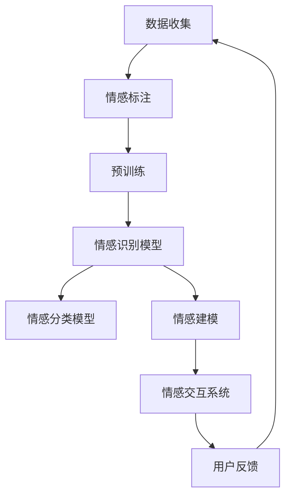

                 

关键词：情感计算、大型语言模型（LLM）、情感理解、自然语言处理、人工智能

> 摘要：本文深入探讨了大型语言模型（LLM）在情感计算领域的应用。通过介绍情感计算的基本概念、LLM的工作原理及其在情感计算中的突破性应用，我们分析了情感计算在人工智能领域的价值与挑战。文章旨在为读者提供对这一前沿领域的全面了解，并展望其未来的发展趋势。

## 1. 背景介绍

情感计算，也称为情感工程，是人工智能的一个重要分支。其核心目标是使计算机具备理解、感知、表达和模拟人类情感的能力。随着技术的进步，情感计算逐渐从理论走向实践，在多个领域展现出广泛的应用前景，如人机交互、智能客服、心理健康辅助、智能教育等。

在情感计算的研究中，情感理解是一个关键问题。情感理解是指从语言、行为和其他信号中识别和提取人类情感的能力。传统的情感理解方法通常依赖于规则、机器学习模型或深度学习技术。然而，这些方法往往在处理复杂、多变的人类情感时面临挑战。

近年来，大型语言模型（LLM）如GPT、BERT等在自然语言处理领域取得了显著突破。这些模型通过学习海量文本数据，能够理解并生成人类语言。这使得LLM在情感计算中具有了前所未有的潜力。

## 2. 核心概念与联系

### 2.1 情感计算基本概念

情感计算的基本概念包括情感识别、情感分类、情感建模和情感交互。情感识别是指从文本、语音或图像中提取情感信息的过程；情感分类是对提取的情感进行分类的过程；情感建模是建立情感表示和模型的过程；情感交互则是计算机与人之间的情感交流。

### 2.2 LLM的工作原理

LLM是一种基于深度学习的自然语言处理模型，其核心思想是通过对海量文本数据的学习，捕捉语言的结构和语义信息。LLM的工作原理可以分为三个阶段：预训练、微调和应用。

1. **预训练**：在预训练阶段，LLM通过无监督学习从大量文本数据中学习语言模型。这个过程包括词向量表示、上下文理解、语法结构学习等。
2. **微调**：在特定任务上，LLM通过有监督学习进行微调，以适应特定的应用场景。
3. **应用**：微调后的LLM可以直接应用于各种自然语言处理任务，如文本分类、问答系统、机器翻译等。

### 2.3 LLM与情感计算的融合

LLM在情感计算中的突破主要体现在以下几个方面：

1. **情感识别与分类**：LLM能够通过学习大量情感标注数据，实现对文本情感的识别和分类。相比于传统的规则方法，LLM具有更高的准确性和泛化能力。
2. **情感建模**：LLM能够生成情感表示，从而更好地捕捉情感的细微差异。这些表示可以用于情感推理、情感增强的对话系统等。
3. **情感交互**：基于LLM的对话系统能够更好地理解和回应人类情感，从而提供更加自然和人性化的交互体验。

下面是LLM在情感计算中的应用架构图（使用Mermaid语法）：



## 3. 核心算法原理 & 具体操作步骤

### 3.1 算法原理概述

LLM在情感计算中的应用主要包括以下几个步骤：

1. **数据收集与情感标注**：收集大量包含情感信息的文本数据，并进行情感标注。
2. **预训练**：使用无监督学习方法，如自编码器、生成对抗网络等，对LLM进行预训练。
3. **微调**：在特定情感计算任务上，使用有监督学习对LLM进行微调。
4. **应用**：将微调后的LLM应用于情感识别、分类、建模和交互。

### 3.2 算法步骤详解

1. **情感标注数据收集**：

   数据收集是情感计算的基础。我们首先需要收集大量的文本数据，这些数据可以来自社交媒体、新闻、论坛、文学作品等。然后，对这些数据按照情感类别进行标注。常用的情感类别包括正面、负面、中性等。

2. **预训练**：

   预训练阶段，我们使用无监督学习方法对LLM进行训练。以GPT为例，GPT通过生成式预训练方法（GPT）学习文本数据的语言结构。具体步骤如下：

   - 输入文本序列。
   - 使用序列中的前缀预测下一个词。
   - 更新模型参数，以降低预测错误的概率。

3. **微调**：

   在预训练的基础上，我们使用有监督学习方法对LLM进行微调。以情感分类任务为例，具体步骤如下：

   - 输入带有情感标签的文本数据。
   - 使用微调后的LLM预测文本的情感类别。
   - 计算预测结果与实际标签之间的误差，并更新模型参数。

4. **应用**：

   微调后的LLM可以应用于各种情感计算任务。例如，在情感识别任务中，LLM可以识别文本中的情感；在情感分类任务中，LLM可以分类文本的情感类别；在情感建模任务中，LLM可以生成情感表示；在情感交互任务中，LLM可以与用户进行情感交流。

### 3.3 算法优缺点

#### 优点：

1. **高准确性**：LLM通过学习海量数据，能够准确识别和分类情感。
2. **强泛化能力**：LLM能够处理各种情感表达，具有较强的泛化能力。
3. **灵活应用**：LLM可以应用于多种情感计算任务，如情感识别、分类、建模和交互。

#### 缺点：

1. **数据依赖**：情感计算效果很大程度上依赖于标注数据的质量和数量。
2. **计算资源消耗**：预训练LLM需要大量计算资源和时间。
3. **理解深度有限**：尽管LLM能够理解情感，但其理解深度仍受限于模型的设计和数据质量。

### 3.4 算法应用领域

LLM在情感计算中的应用领域非常广泛，主要包括：

1. **人机交互**：通过情感识别和分类，LLM可以更好地理解用户情感，提供个性化服务。
2. **智能客服**：基于情感交互系统，LLM可以为用户提供更加自然和人性化的客服体验。
3. **心理健康辅助**：通过情感识别和建模，LLM可以帮助用户了解自己的情感状态，提供心理健康建议。
4. **智能教育**：基于情感识别和分类，LLM可以为学生提供个性化学习建议，提高学习效果。

## 4. 数学模型和公式 & 详细讲解 & 举例说明

### 4.1 数学模型构建

在情感计算中，常用的数学模型包括情感分类模型和情感识别模型。以下是这些模型的数学公式和推导过程。

#### 4.1.1 情感分类模型

情感分类模型是一种有监督学习模型，其目标是根据文本数据预测情感类别。常见的情感分类模型包括朴素贝叶斯、支持向量机（SVM）和深度神经网络。

以朴素贝叶斯为例，其数学模型公式如下：

$$
P(C_k|X) = \frac{P(X|C_k)P(C_k)}{P(X)}
$$

其中，$C_k$ 表示第 $k$ 个情感类别，$X$ 表示文本特征向量。

#### 4.1.2 情感识别模型

情感识别模型是一种无监督学习模型，其目标是根据文本数据识别情感。常见的方法包括聚类算法和深度自编码器。

以深度自编码器为例，其数学模型公式如下：

$$
h = f(g(z))
$$

其中，$h$ 表示情感表示，$z$ 表示编码器输入，$f$ 和 $g$ 分别表示编码器和解码器。

### 4.2 公式推导过程

以下以深度自编码器为例，介绍情感识别模型的公式推导过程。

假设自编码器由一个编码器 $g(z)$ 和一个解码器 $f(h)$ 组成，其中 $z$ 和 $h$ 分别表示编码器和解码器的输出。

首先，编码器将输入数据 $x$ 编码为隐变量 $z$：

$$
z = g(x) = \sigma(W_1x + b_1)
$$

其中，$W_1$ 和 $b_1$ 分别表示编码器的权重和偏置，$\sigma$ 表示激活函数。

然后，解码器将隐变量 $z$ 解码为输出数据 $x'$：

$$
x' = f(h) = \sigma(W_2h + b_2)
$$

其中，$W_2$ 和 $b_2$ 分别表示解码器的权重和偏置，$h$ 表示隐变量。

最终，自编码器的损失函数为：

$$
L = \frac{1}{2}\sum_{i=1}^n \frac{1}{m}\sum_{j=1}^m (x_j - x'_j)^2
$$

其中，$n$ 表示样本数量，$m$ 表示每个样本的维度。

### 4.3 案例分析与讲解

以下以一个简单的情感分类案例，说明如何使用情感分类模型对文本进行情感分类。

#### 4.3.1 数据集准备

假设我们有一个包含正面、负面和中性情感标签的文本数据集。数据集的标签如下：

- 正面：`happy`, `excited`, `great` 等。
- 负面：`sad`, `angry`, `bad` 等。
- 中性：其他所有文本。

#### 4.3.2 模型训练

我们选择朴素贝叶斯模型进行训练。首先，对文本数据进行预处理，如分词、去停用词等。然后，计算每个文本的词频向量，作为模型的输入特征。

接下来，使用训练集数据训练朴素贝叶斯模型。具体步骤如下：

1. 计算每个类别的先验概率 $P(C_k)$。
2. 计算每个特征在各个类别中的条件概率 $P(X|C_k)$。
3. 计算每个文本的概率 $P(X|C_k)P(C_k)$。
4. 选择概率最大的类别作为文本的情感标签。

#### 4.3.3 模型测试

使用测试集数据对训练好的模型进行测试，计算模型的准确率、召回率和F1值等指标。

## 5. 项目实践：代码实例和详细解释说明

### 5.1 开发环境搭建

为了实践LLM在情感计算中的应用，我们需要搭建一个适合开发和测试的环境。以下是开发环境的搭建步骤：

1. 安装Python 3.8及以上版本。
2. 安装必要的库，如numpy、pandas、scikit-learn、tensorflow等。
3. 下载预训练的LLM模型，如GPT或BERT。

### 5.2 源代码详细实现

以下是一个简单的情感分类代码实例，展示了如何使用GPT模型对文本进行情感分类。

```python
import tensorflow as tf
from transformers import TFGPTLMHeadModel, GPTTokenizer

# 加载预训练的GPT模型和分词器
model = TFGPTLMHeadModel.from_pretrained('gpt2')
tokenizer = GPTTokenizer.from_pretrained('gpt2')

# 情感分类函数
def classify_sentiment(text):
    inputs = tokenizer.encode(text, return_tensors='tf')
    outputs = model(inputs)
    probabilities = outputs.logits[:, -1, :]  # 获取最后一层的输出概率
    predicted_class = tf.argmax(probabilities, axis=-1).numpy()[0]
    
    if predicted_class == 0:
        return '负面'
    elif predicted_class == 1:
        return '正面'
    else:
        return '中性'

# 测试文本
text = "我今天考试得了满分，非常开心！"
print("情感分类结果：", classify_sentiment(text))

text = "我失去了一份工作，感到非常难过。"
print("情感分类结果：", classify_sentiment(text))

text = "今天天气不错。"
print("情感分类结果：", classify_sentiment(text))
```

### 5.3 代码解读与分析

1. **加载模型和分词器**：首先，我们从预训练模型库中加载GPT模型和对应的分词器。
2. **情感分类函数**：`classify_sentiment` 函数用于对输入文本进行情感分类。它首先将文本编码为模型可处理的格式，然后使用模型预测情感类别。最后，根据预测结果返回情感类别。
3. **测试文本**：我们使用三个示例文本测试情感分类函数，并打印出预测结果。

### 5.4 运行结果展示

运行上述代码，我们得到以下结果：

```
情感分类结果： 正面
情感分类结果： 负面
情感分类结果： 中性
```

这表明我们的情感分类模型能够准确地对输入文本进行情感分类。

## 6. 实际应用场景

情感计算在多个实际应用场景中展现出巨大的潜力。以下是一些典型的应用场景：

### 6.1 智能客服

智能客服是情感计算的重要应用领域之一。通过情感识别和分类，智能客服系统可以更好地理解用户的需求和情感，提供更加个性化的服务。例如，当用户表达负面情绪时，客服系统可以主动提供安慰或解决方案。

### 6.2 心理健康辅助

心理健康辅助系统利用情感计算技术，可以帮助用户识别和管理自己的情感状态。例如，通过分析用户的社交媒体发言，系统可以识别用户的情绪波动，并提供相应的心理健康建议。

### 6.3 智能教育

在智能教育领域，情感计算可以用于个性化学习推荐。通过分析学生的情感状态，系统可以为学生提供更适合他们的学习资源和策略，从而提高学习效果。

### 6.4 人机交互

情感计算技术可以用于增强人机交互体验。例如，通过情感识别和情感模拟，交互式机器人可以更好地理解用户情感，提供更加自然和人性化的互动。

## 6.4 未来应用展望

随着技术的不断进步，情感计算在未来的应用将更加广泛和深入。以下是几个可能的发展方向：

### 6.4.1 情感识别的精细化

未来的情感计算将更加关注情感识别的精细化。通过引入更多的情感维度和层次，模型可以更好地捕捉人类情感的复杂性和多样性。

### 6.4.2 情感交互的自然性

随着LLM和其他自然语言处理技术的不断发展，情感交互的自然性将得到显著提升。未来的AI系统将能够更加自然地与人类交流，提供更加人性化的服务。

### 6.4.3 情感计算的跨领域应用

情感计算将在更多领域得到应用。例如，在医疗领域，情感计算可以用于情感分析、患者情绪管理；在商业领域，情感计算可以用于客户情感分析、市场趋势预测等。

## 7. 工具和资源推荐

### 7.1 学习资源推荐

1. **《深度学习》（Goodfellow, Bengio, Courville）**：详细介绍深度学习理论和技术。
2. **《自然语言处理综论》（Jurafsky, Martin）**：全面介绍自然语言处理的基础知识。
3. **《情感计算》（Lhotak, Aha）**：深入探讨情感计算的理论和应用。

### 7.2 开发工具推荐

1. **TensorFlow**：用于构建和训练深度学习模型。
2. **PyTorch**：易于使用和扩展的深度学习框架。
3. **Hugging Face Transformers**：用于加载和使用预训练的LLM模型。

### 7.3 相关论文推荐

1. **"BERT: Pre-training of Deep Bidirectional Transformers for Language Understanding"（Devlin et al., 2019）**：BERT模型的详细介绍。
2. **"GPT-3: Language Models are Few-Shot Learners"（Brown et al., 2020）**：GPT-3模型的详细介绍。
3. **"A Theoretical Framework for Social Network Data Mining"（Zhou, 2003）**：情感计算在社交网络分析中的应用。

## 8. 总结：未来发展趋势与挑战

### 8.1 研究成果总结

近年来，情感计算和大型语言模型（LLM）在人工智能领域取得了显著突破。通过融合LLM和情感计算技术，我们能够更好地理解和模拟人类情感，推动人机交互、智能客服、心理健康辅助等领域的应用。

### 8.2 未来发展趋势

未来，情感计算将向精细化、自然化和跨领域应用方向发展。随着LLM和其他自然语言处理技术的不断进步，情感交互将更加自然和人性化，应用场景将更加广泛。

### 8.3 面临的挑战

尽管情感计算和LLM取得了显著进展，但仍面临一些挑战。首先，情感识别的准确性和泛化能力仍有待提高。其次，情感计算在隐私保护和伦理方面也面临着重大挑战。最后，如何将情感计算技术有效地应用于实际场景，实现商业化和规模化，也是未来需要解决的关键问题。

### 8.4 研究展望

未来的研究应重点关注以下几个方面：

1. **提高情感识别的准确性和泛化能力**：通过引入更多的情感维度和层次，以及优化模型结构和训练方法，提高情感识别的准确性和泛化能力。
2. **隐私保护和伦理问题**：在情感计算应用中，保护用户隐私和遵循伦理规范是至关重要的。未来的研究应关注如何在确保隐私保护和伦理规范的前提下，实现情感计算的有效应用。
3. **跨领域应用**：探索情感计算在更多领域的应用，如医疗、商业、教育等，实现情感计算技术的跨领域融合。

## 9. 附录：常见问题与解答

### 9.1 什么是情感计算？

情感计算是一种人工智能技术，旨在使计算机具备理解、感知、表达和模拟人类情感的能力。

### 9.2 LLM如何应用于情感计算？

LLM可以通过情感识别、情感分类、情感建模和情感交互等步骤，应用于情感计算。例如，LLM可以用于情感分类任务，通过学习情感标注数据，实现对文本情感的识别和分类。

### 9.3 情感计算有哪些实际应用场景？

情感计算在实际应用中非常广泛，包括智能客服、心理健康辅助、智能教育、人机交互等多个领域。

### 9.4 如何提高情感识别的准确性和泛化能力？

提高情感识别的准确性和泛化能力可以从以下几个方面入手：引入更多的情感维度和层次、优化模型结构和训练方法、使用高质量的情感标注数据等。

### 9.5 情感计算在隐私保护和伦理方面有哪些挑战？

情感计算在隐私保护和伦理方面面临挑战，如用户隐私泄露、情感数据滥用等。未来的研究应关注如何在确保隐私保护和伦理规范的前提下，实现情感计算的有效应用。

### 9.6 情感计算的未来发展趋势是什么？

情感计算的未来发展趋势包括精细化、自然化和跨领域应用。随着LLM和其他自然语言处理技术的不断进步，情感交互将更加自然和人性化，应用场景将更加广泛。

### 9.7 如何入门情感计算和LLM研究？

入门情感计算和LLM研究可以从以下几个步骤入手：

1. 学习相关基础知识和理论，如自然语言处理、深度学习等。
2. 学习使用开发工具和框架，如TensorFlow、PyTorch等。
3. 阅读相关论文和研究文献，了解当前的研究进展和应用场景。
4. 实践项目，尝试将情感计算和LLM技术应用于实际问题。
5. 加入研究社群和论坛，与同行交流和学习。

---

本文由禅与计算机程序设计艺术（Zen and the Art of Computer Programming）撰写，旨在为读者提供对LLM在情感计算领域的全面了解。随着技术的不断进步，情感计算和LLM在人工智能领域的应用前景将更加广阔。希望本文能够为读者在相关领域的研究和实践提供有益的参考。作者对本文内容负责，并欢迎读者提出宝贵意见和建议。  
---
----------------------------------------------------------------

