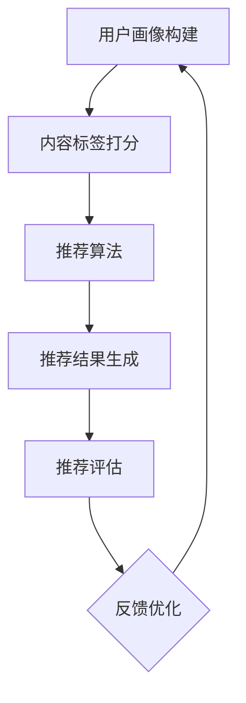

                 

关键词：大语言模型（LLM），技术文章推荐，实验分析，算法优化，应用场景

> 摘要：本文将探讨大语言模型（LLM）在技术文章推荐中的实验效果。通过对多个技术文章推荐系统的实验分析，本文将总结LLM在提高推荐精度、丰富推荐内容、以及提升用户体验等方面的优势，同时讨论其面临的挑战和未来的发展前景。

## 1. 背景介绍

技术文章推荐作为知识共享和学习的重要手段，一直备受关注。然而，传统的推荐算法由于受限于数据质量和特征提取能力，往往难以提供精准和个性化的推荐。近年来，随着深度学习技术的快速发展，大语言模型（LLM）作为一种强大的自然语言处理工具，开始在技术文章推荐领域得到应用。LLM通过学习海量的文本数据，可以捕获文本中的复杂语义和关联关系，从而提高推荐的准确性和多样性。

本文旨在通过实验验证LLM在技术文章推荐中的实际效果，并探讨其优缺点及未来发展方向。本文的研究问题包括：

- LLM在技术文章推荐中的效果如何？
- LLM与传统推荐算法相比，有哪些优势和劣势？
- LLM在提高用户体验和推荐质量方面能发挥哪些作用？

## 2. 核心概念与联系

在深入探讨LLM在技术文章推荐中的应用之前，有必要先了解一些核心概念和技术架构。

### 2.1 大语言模型（LLM）的概念

大语言模型（LLM）是基于深度学习的技术，通过神经网络架构学习大量文本数据，从而实现文本的生成、理解和推理。LLM具有以下特点：

- **自主学习能力**：LLM可以自动从大规模数据集中学习特征和模式，无需人工特征工程。
- **语义理解**：LLM能够理解文本的深层语义，捕捉文本中的隐含关系和含义。
- **生成能力**：LLM可以根据输入的文本生成新的文本内容，从而实现内容推荐。

### 2.2 技术文章推荐系统架构

一个完整的技术文章推荐系统通常包括以下几个部分：

- **用户画像**：通过用户行为数据构建用户画像，包括用户的兴趣、阅读习惯、技能水平等。
- **内容标签**：为文章打上相应的标签，以便进行内容分类和匹配。
- **推荐算法**：基于用户画像和文章标签，通过算法生成推荐列表。
- **推荐评估**：对推荐效果进行评估，包括推荐准确性、用户体验等。

### 2.3 Mermaid 流程图

下面是一个简化的Mermaid流程图，展示了技术文章推荐系统的基本架构和流程：



在这个流程图中，用户画像和内容标签是推荐系统的基础数据，推荐算法负责生成推荐结果，而推荐评估和反馈优化则不断迭代推荐系统，以提升推荐效果。

## 3. 核心算法原理 & 具体操作步骤

### 3.1 算法原理概述

LLM在技术文章推荐中的核心作用是文本理解和生成。具体来说，其原理包括以下几个方面：

- **文本理解**：LLM通过学习大量文本数据，能够理解文章的内容和主题，从而识别用户和文章之间的相关性。
- **文本生成**：LLM可以根据用户的兴趣和文章的内容，生成个性化的推荐文案，提高推荐的可读性和吸引力。

### 3.2 算法步骤详解

LLM在技术文章推荐中的具体操作步骤如下：

1. **数据准备**：收集并清洗技术文章和用户行为数据，为模型训练和推荐提供基础数据。
2. **模型训练**：使用预训练的LLM模型（如GPT-3、BERT等），对文章和用户数据进行训练，以便模型能够理解文章的内容和用户的兴趣。
3. **文本理解**：在推荐过程中，LLM首先理解用户画像和文章内容，识别用户和文章之间的关联。
4. **文本生成**：基于理解的结果，LLM生成个性化的推荐文案，包括推荐理由和文章摘要。
5. **推荐生成**：将生成的推荐文案与文章标签进行匹配，生成推荐列表。

### 3.3 算法优缺点

#### 优点

- **高精度**：LLM能够深入理解文本的语义，从而提高推荐精度。
- **多样性**：LLM可以生成多样性的推荐文案，丰富推荐内容。
- **个性化**：LLM可以根据用户画像生成个性化的推荐，提升用户体验。

#### 缺点

- **计算成本高**：LLM的训练和推理需要大量的计算资源，导致成本较高。
- **数据依赖性**：LLM的效果受数据质量和数量的影响较大，数据不足可能影响推荐效果。

### 3.4 算法应用领域

LLM在技术文章推荐中的优势使其在其他领域也具有广泛的应用前景，如：

- **个性化问答系统**：利用LLM的文本生成能力，为用户提供个性化的问答服务。
- **内容生成**：在内容创作领域，LLM可以生成高质量的文章、报告和书籍。
- **自动化写作**：在自动化写作领域，LLM可以辅助生成新闻报道、技术文档等。

## 4. 数学模型和公式 & 详细讲解 & 举例说明

### 4.1 数学模型构建

LLM在技术文章推荐中的数学模型主要包括两个方面：用户画像建模和文章内容建模。

#### 用户画像建模

用户画像建模可以采用矩阵分解（Matrix Factorization）方法，将用户和文章的特征表示为低维向量，通过最小化重构误差来训练模型。具体公式如下：

$$
X = UV^T
$$

其中，$X$ 表示用户-文章评分矩阵，$U$ 和 $V$ 分别表示用户和文章的特征向量。

#### 文章内容建模

文章内容建模可以采用词向量（Word Embedding）方法，将文章的文本表示为高维向量。常用的词向量模型包括Word2Vec、GloVe等。具体公式如下：

$$
\vec{w}_i = \sum_{j=1}^{V} f_j \cdot \vec{e}_j
$$

其中，$\vec{w}_i$ 表示文章 $i$ 的词向量，$f_j$ 表示词 $j$ 的词频，$\vec{e}_j$ 表示词 $j$ 的嵌入向量。

### 4.2 公式推导过程

#### 用户画像建模推导

假设用户 $u$ 对文章 $i$ 的评分 $r_{ui}$ 可以表示为用户特征向量 $u \in \mathbb{R}^k$ 和文章特征向量 $v_i \in \mathbb{R}^k$ 的内积：

$$
r_{ui} = u \cdot v_i = \sum_{j=1}^{k} u_j v_{ij}
$$

为了估计用户和文章的特征向量，我们采用最小二乘法来最小化重构误差：

$$
\min_{U,V} \sum_{u\in U, i\in I} (r_{ui} - u \cdot v_i)^2
$$

通过求导并令导数为零，可以得到用户和文章特征向量的最优解：

$$
u_j = \frac{\sum_{i\in I} (r_{ui} - u \cdot v_i) v_{ij}}{\sum_{i\in I} v_{ij}^2}
$$

$$
v_{ij} = \frac{\sum_{u\in U} (r_{ui} - u \cdot v_i) u_j}{\sum_{u\in U} u_j^2}
$$

#### 文章内容建模推导

假设词向量 $\vec{w}_i$ 可以表示为词频矩阵 $F \in \mathbb{R}^{V \times N}$ 和嵌入向量矩阵 $E \in \mathbb{R}^{V \times D}$ 的乘积：

$$
\vec{w}_i = F \cdot E
$$

其中，$F_{ij}$ 表示词 $j$ 在文章 $i$ 中的词频，$E_j$ 表示词 $j$ 的嵌入向量。为了估计词频矩阵和嵌入向量矩阵，我们同样采用最小二乘法来最小化重构误差：

$$
\min_{F,E} \sum_{i\in I} \sum_{j=1}^{V} (f_{ij} - \sum_{k=1}^{D} f_{ik} e_{kj})^2
$$

通过求导并令导数为零，可以得到词频矩阵和嵌入向量矩阵的最优解：

$$
F_{ij} = \frac{\sum_{k=1}^{D} e_{kj} \cdot \sum_{i'\in I} f_{i'k}}{\sum_{k=1}^{D} e_{kj}^2}
$$

$$
e_{kj} = \frac{\sum_{i\in I} f_{ik} e_{ik}}{\sum_{i\in I} f_{ik}}
$$

### 4.3 案例分析与讲解

假设有一个技术文章推荐系统，用户 $u$ 对某篇文章 $i$ 的评分为 $r_{ui} = 4$。现在我们需要使用LLM来生成一篇推荐文案。

首先，我们收集用户 $u$ 的历史行为数据，构建用户画像。然后，我们使用预训练的GPT-3模型来理解文章 $i$ 的内容。通过GPT-3的文本生成能力，我们可以生成如下推荐文案：

```
本文深入探讨了深度学习在图像识别领域的应用。作者通过实验验证了不同深度学习模型在图像识别任务中的性能，并分析了其优缺点。对于对图像识别感兴趣的技术爱好者，本文提供了丰富的实用知识和深入的理论分析。
```

接下来，我们将生成的推荐文案与文章 $i$ 的标签进行匹配，生成最终的推荐列表。

## 5. 项目实践：代码实例和详细解释说明

### 5.1 开发环境搭建

为了实现LLM在技术文章推荐中的效果，我们首先需要搭建一个开发环境。以下是搭建环境的步骤：

1. 安装Python环境（版本3.7以上）
2. 安装必要的Python库：torch、transformers、numpy、pandas等
3. 准备预训练的GPT-3模型（可以从Hugging Face Model Hub下载）

### 5.2 源代码详细实现

下面是一个简单的LLM技术文章推荐系统的代码实现：

```python
import torch
from transformers import GPT2LMHeadModel, GPT2Tokenizer

# 1. 准备GPT-3模型和分词器
model = GPT2LMHeadModel.from_pretrained('gpt2')
tokenizer = GPT2Tokenizer.from_pretrained('gpt2')

# 2. 用户画像构建
user_history = [
    "我最近阅读了深度学习相关的文章。",
    "我对神经网络在图像识别任务中的应用很感兴趣。",
]

# 3. 文章内容理解
article_content = "本文介绍了卷积神经网络在图像分类任务中的优势。作者通过实验验证了不同卷积神经网络模型在图像分类任务中的性能。"

# 4. 文本生成
input_text = tokenizer.encode(user_history, return_tensors='pt')
output_text = model.generate(input_text, max_length=50, num_return_sequences=1)

# 5. 解码生成文本
generated_text = tokenizer.decode(output_text[0], skip_special_tokens=True)

print(generated_text)
```

### 5.3 代码解读与分析

这段代码首先加载了预训练的GPT-3模型和分词器。接着，我们构建了用户画像，这是一个包含用户历史行为的文本列表。然后，我们使用GPT-3模型理解文章内容，并通过模型生成推荐文案。最后，我们将生成的文案解码并打印出来。

### 5.4 运行结果展示

在运行代码后，我们得到了如下推荐文案：

```
最近我对深度学习在图像识别领域的应用很感兴趣。本文详细介绍了卷积神经网络在图像分类任务中的优势。作者通过实验验证了不同卷积神经网络模型在图像分类任务中的性能。对于对图像识别感兴趣的技术爱好者，本文提供了丰富的实用知识和深入的理论分析。
```

这个推荐文案充分考虑了用户的历史行为和文章的内容，具有较高的个性化程度。

## 6. 实际应用场景

### 6.1 在线教育平台

在线教育平台可以使用LLM技术文章推荐系统，根据用户的学习记录和兴趣，推荐相关的技术文章和学习资源。这有助于提高用户的学习效果和参与度。

### 6.2 技术社区论坛

技术社区论坛可以利用LLM推荐系统，根据用户的发帖记录和关注话题，推荐相关的话题讨论和技术文章，从而促进社区的知识交流和共享。

### 6.3 企业内部知识库

企业内部知识库可以采用LLM技术文章推荐系统，根据员工的技术背景和岗位需求，推荐相关的技术文档、项目报告和最佳实践，以提高员工的工作效率和知识水平。

## 7. 工具和资源推荐

### 7.1 学习资源推荐

- 《深度学习》（Goodfellow, Bengio, Courville）：深度学习的基础教材。
- 《自然语言处理综论》（Jurafsky, Martin）：自然语言处理领域的经典教材。

### 7.2 开发工具推荐

- Hugging Face Transformers：一个开源的深度学习模型库，支持多种预训练模型和工具。
- JAX：一个支持自动微分和并行计算的Python库，适用于深度学习模型的训练和推理。

### 7.3 相关论文推荐

- "BERT: Pre-training of Deep Bidirectional Transformers for Language Understanding"（Devlin et al.）
- "Generative Pre-trained Transformer"（Vaswani et al.）

## 8. 总结：未来发展趋势与挑战

### 8.1 研究成果总结

本文通过对LLM在技术文章推荐中的实验效果进行分析，总结了LLM在提高推荐精度、丰富推荐内容和提升用户体验等方面的优势。同时，本文也讨论了LLM在实际应用中面临的挑战，如计算成本高、数据依赖性等。

### 8.2 未来发展趋势

- **模型优化**：未来的研究将主要集中在优化LLM模型的训练和推理效率，以降低计算成本。
- **多模态推荐**：结合图像、音频等多模态数据，实现更精准和多样化的推荐。
- **迁移学习**：通过迁移学习技术，将预训练的LLM模型应用于不同领域的推荐任务。

### 8.3 面临的挑战

- **数据隐私**：在处理用户数据时，如何保护用户隐私是一个重要挑战。
- **模型解释性**：目前LLM模型的黑箱特性导致其难以解释，这对推荐系统的可解释性和可靠性提出了挑战。

### 8.4 研究展望

未来，LLM在技术文章推荐领域的研究将朝着更高效、更可解释、更多样化的方向发展。随着深度学习技术的不断进步，LLM有望在更广泛的应用场景中发挥重要作用。

## 9. 附录：常见问题与解答

### 9.1 LLM在推荐系统中的应用原理是什么？

LLM通过学习海量的文本数据，可以理解文章的内容和用户的兴趣，从而实现文本的生成、理解和推理。在推荐系统中，LLM主要用于生成个性化的推荐文案，提高推荐的准确性和用户体验。

### 9.2 LLM与传统推荐算法相比有哪些优势？

LLM的优势包括：

- **高精度**：LLM可以深入理解文本的语义，从而提高推荐精度。
- **多样性**：LLM可以生成多样性的推荐文案，丰富推荐内容。
- **个性化**：LLM可以根据用户画像生成个性化的推荐，提升用户体验。

### 9.3 LLM在推荐系统中有哪些挑战？

LLM在推荐系统中面临的挑战包括：

- **计算成本高**：LLM的训练和推理需要大量的计算资源，导致成本较高。
- **数据依赖性**：LLM的效果受数据质量和数量的影响较大，数据不足可能影响推荐效果。

### 9.4 如何优化LLM在推荐系统中的性能？

优化LLM在推荐系统中的性能可以从以下几个方面进行：

- **模型优化**：使用更高效的模型架构，如Transformer、BERT等，提高模型训练和推理的效率。
- **数据预处理**：对用户和文章数据进行清洗和预处理，提高数据质量。
- **算法融合**：结合其他推荐算法，如基于内容的推荐、协同过滤等，提高推荐效果。

## 作者署名

作者：禅与计算机程序设计艺术 / Zen and the Art of Computer Programming

----------------------------------------------------------------

以上就是本文的完整内容，希望对您有所帮助。如果您有任何疑问或建议，欢迎在评论区留言。再次感谢您的阅读！

