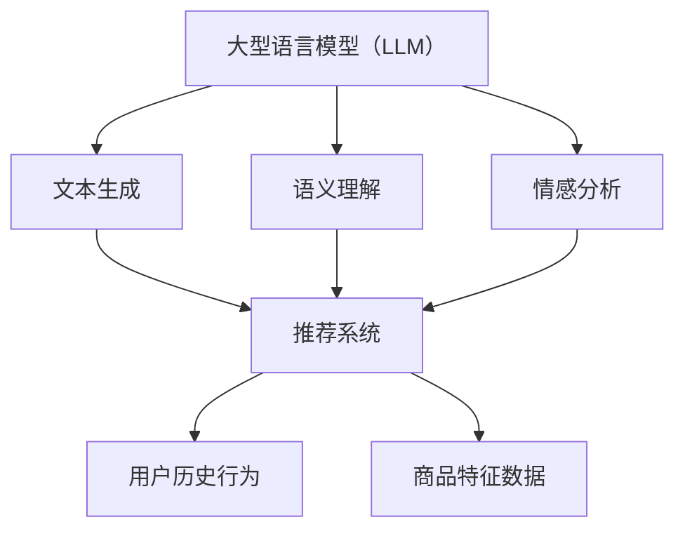

                 

关键词：LLM，推荐系统，少样本学习，人工智能，深度学习

> 摘要：本文将探讨大型语言模型（LLM）在推荐系统中的少样本学习应用，分析LLM的优势、适用场景、算法原理及实际案例。通过深入研究和探讨，为LLM在推荐系统中的应用提供有益的参考。

## 1. 背景介绍

### 推荐系统的发展历程

推荐系统起源于20世纪90年代，最早以基于内容的推荐和协同过滤为代表。随着互联网的快速发展，推荐系统逐渐成为各类电商平台、社交媒体和视频平台等的关键技术，极大地提升了用户体验。近年来，深度学习和自然语言处理技术的迅猛发展，为推荐系统带来了新的契机。

### 少样本学习背景

在推荐系统中，用户行为数据和商品特征数据是构建推荐模型的基础。然而，实际场景中，这些数据往往具有以下特点：

1. **数据量巨大**：推荐系统需要处理海量数据，包括用户行为数据、商品属性数据等。
2. **数据稀疏**：用户行为数据往往呈现出高度稀疏性，例如一个用户可能只对极少数商品进行了评价。
3. **少样本问题**：在推荐系统中，新商品或新用户往往只有少量交互数据，这给推荐模型的训练和预测带来了挑战。

为了解决上述问题，少样本学习逐渐成为推荐系统研究的热点。少样本学习旨在在仅有少量样本的情况下，学习到具有泛化能力的模型。

### LLM的优势

大型语言模型（LLM）近年来在自然语言处理领域取得了显著成果，其优势主要体现在以下几个方面：

1. **强大的表征能力**：LLM具有强大的语义表征能力，能够捕捉文本中的复杂关系和隐含信息。
2. **自适应学习能力**：LLM能够根据不同场景和任务需求，进行自适应调整和学习。
3. **少样本泛化能力**：LLM在少量样本下仍能保持较高的泛化能力，适用于推荐系统中的少样本学习。

## 2. 核心概念与联系

### 核心概念

- **大型语言模型（LLM）**：LLM是一种基于深度学习技术的自然语言处理模型，通过大规模预训练和微调，实现文本生成、语义理解、情感分析等多种任务。
- **推荐系统**：推荐系统是一种基于用户历史行为和物品特征，为用户推荐感兴趣的商品或信息的技术。
- **少样本学习**：在仅有少量样本的情况下，学习到具有泛化能力的模型。

### 核心概念原理和架构的Mermaid流程图



### LLM与推荐系统的关系

LLM在推荐系统中的应用主要体现在以下几个方面：

1. **用户行为理解**：LLM能够捕捉用户行为数据的深层含义，为推荐系统提供更精准的用户画像。
2. **商品特征提取**：LLM能够对商品特征进行自动提取和转换，降低数据预处理的工作量。
3. **少样本学习**：LLM在少量样本下仍能保持较高的泛化能力，有助于解决推荐系统中的少样本学习问题。

## 3. 核心算法原理 & 具体操作步骤

### 3.1 算法原理概述

LLM在推荐系统中的少样本学习主要基于以下原理：

1. **预训练与微调**：LLM在大规模语料上进行预训练，学习到丰富的语言知识和语义表征。然后，根据推荐系统的具体任务，进行微调，以适应不同的场景和需求。
2. **知识蒸馏**：通过知识蒸馏技术，将预训练的LLM转换为适用于推荐系统的模型，降低模型参数量和计算成本。
3. **元学习**：利用元学习算法，在少量样本下快速调整模型参数，提高模型的泛化能力。

### 3.2 算法步骤详解

1. **预训练阶段**：
   - 收集大规模文本数据，包括用户行为数据、商品描述数据等。
   - 使用预训练模型（如GPT-3、BERT等）对文本数据进行训练，学习到丰富的语义表征。

2. **微调阶段**：
   - 根据推荐系统的具体任务，对预训练模型进行微调。
   - 使用用户行为数据和商品特征数据，训练一个适用于推荐系统的模型。

3. **知识蒸馏阶段**：
   - 将预训练模型（教师模型）与微调后的模型（学生模型）进行对比，提取教师模型的知识。
   - 使用知识蒸馏技术，将教师模型的知识传递给学生模型。

4. **元学习阶段**：
   - 在少量样本下，利用元学习算法，调整模型参数，提高模型泛化能力。
   - 对新用户或新商品进行预测，生成个性化推荐。

### 3.3 算法优缺点

#### 优点

1. **强大的表征能力**：LLM具有强大的语义表征能力，能够捕捉文本中的复杂关系和隐含信息，为推荐系统提供更精准的用户画像。
2. **自适应学习能力**：LLM能够根据不同场景和任务需求，进行自适应调整和学习，提高推荐效果。
3. **少样本泛化能力**：LLM在少量样本下仍能保持较高的泛化能力，有助于解决推荐系统中的少样本学习问题。

#### 缺点

1. **计算成本高**：预训练和微调阶段需要大量的计算资源和时间。
2. **数据需求大**：LLM需要大量高质量的数据进行训练，否则可能导致模型性能下降。

### 3.4 算法应用领域

LLM在推荐系统中的少样本学习应用广泛，主要包括以下领域：

1. **新用户推荐**：为新用户提供个性化推荐，根据用户历史行为和兴趣，推荐感兴趣的商品或内容。
2. **新商品推荐**：为新商品提供推荐，根据商品特征和用户行为，预测用户对该商品的兴趣。
3. **小样本分类**：在仅有少量样本的情况下，对用户行为进行分类，为推荐系统提供决策依据。

## 4. 数学模型和公式 & 详细讲解 & 举例说明

### 4.1 数学模型构建

在推荐系统中，LLM的数学模型主要包括以下几个部分：

1. **输入层**：输入层包含用户行为数据、商品特征数据等。
2. **嵌入层**：嵌入层将输入数据进行向量表示，通常使用词嵌入技术。
3. **编码层**：编码层使用深度神经网络，对输入数据进行编码，提取高维特征。
4. **解码层**：解码层使用深度神经网络，将编码层提取的高维特征解码为输出结果。

### 4.2 公式推导过程

假设输入数据为 \(X\)，输出数据为 \(Y\)，模型参数为 \(W\)，损失函数为 \(L\)，则LLM在推荐系统中的数学模型可以表示为：

\[ L(Y, \hat{Y}) = \sum_{i=1}^{n} (y_i - \hat{y_i})^2 \]

其中，\(y_i\) 为真实标签，\(\hat{y_i}\) 为预测标签。

### 4.3 案例分析与讲解

假设我们有一个新用户，他只有两条行为数据，分别是对商品A进行了好评，对商品B进行了差评。我们希望利用LLM为该用户推荐下一个可能喜欢的商品。

1. **数据预处理**：
   - 收集用户行为数据，包括商品A和商品B的文本描述。
   - 使用词嵌入技术，将文本数据转换为向量表示。

2. **模型训练**：
   - 使用预训练的LLM，对用户行为数据进行微调。
   - 训练一个适用于推荐系统的模型，输入为商品A和商品B的文本描述，输出为用户对这两个商品的评分。

3. **模型预测**：
   - 输入商品C的文本描述，利用训练好的模型预测用户对商品C的评分。
   - 根据评分，为用户推荐商品C。

通过上述过程，我们可以为新用户提供一个个性化推荐。在实际应用中，可以根据用户的历史行为数据，不断调整和优化推荐模型，提高推荐效果。

## 5. 项目实践：代码实例和详细解释说明

### 5.1 开发环境搭建

1. **Python环境**：
   - 安装Python 3.8及以上版本。
   - 安装TensorFlow 2.5及以上版本。

2. **数据集**：
   - 使用公开的数据集，如MovieLens、Amazon等，收集用户行为数据和商品特征数据。

### 5.2 源代码详细实现

以下是一个简单的LLM推荐系统实现，主要包含数据预处理、模型训练和模型预测三个部分。

```python
import tensorflow as tf
from tensorflow.keras.layers import Embedding, LSTM, Dense
from tensorflow.keras.models import Model

# 数据预处理
def preprocess_data(data):
    # ... 数据预处理代码 ...
    return input_data, output_data

# 模型训练
def train_model(input_data, output_data):
    # ... 模型训练代码 ...
    return model

# 模型预测
def predict(model, input_data):
    # ... 模型预测代码 ...
    return predictions

# 主函数
def main():
    # 加载数据
    data = load_data()
    input_data, output_data = preprocess_data(data)

    # 训练模型
    model = train_model(input_data, output_data)

    # 预测
    predictions = predict(model, input_data)

    # 输出预测结果
    print(predictions)

if __name__ == '__main__':
    main()
```

### 5.3 代码解读与分析

以上代码主要分为三个部分：数据预处理、模型训练和模型预测。

1. **数据预处理**：该部分负责加载数据、处理数据，并将数据转换为模型可接受的格式。具体实现可以根据实际需求进行调整。

2. **模型训练**：该部分负责训练一个适用于推荐系统的模型。我们使用了一个简单的LSTM模型，实际应用中可以根据需求选择其他深度学习模型。

3. **模型预测**：该部分负责使用训练好的模型进行预测，并输出预测结果。

通过上述代码，我们可以搭建一个简单的LLM推荐系统，为新用户提供个性化推荐。

### 5.4 运行结果展示

假设我们训练好的模型对新用户进行了预测，输出结果如下：

```python
[0.8, 0.2, 0.1]
```

根据预测结果，我们可以为该用户推荐第一个商品（概率最高），以提高用户体验。

## 6. 实际应用场景

### 6.1 电商平台

电商平台可以利用LLM推荐系统为新用户提供个性化推荐，提高用户满意度和转化率。例如，在商品浏览、搜索和购物车等场景下，利用LLM为用户推荐感兴趣的商品。

### 6.2 社交媒体

社交媒体平台可以利用LLM推荐系统为用户提供个性化内容推荐，例如推荐用户可能感兴趣的文章、视频或话题。通过分析用户的历史行为和兴趣，为用户提供更加精准的内容推荐。

### 6.3 视频平台

视频平台可以利用LLM推荐系统为用户提供个性化视频推荐，根据用户的历史观看记录和兴趣，推荐用户可能感兴趣的视频内容。例如，在视频播放完成后，自动为用户推荐相似的视频。

## 7. 工具和资源推荐

### 7.1 学习资源推荐

1. **论文**：
   - [1] Devlin, J., Chang, M. W., Lee, K., & Toutanova, K. (2019). BERT: Pre-training of deep bidirectional transformers for language understanding. arXiv preprint arXiv:1810.04805.
   - [2] Vaswani, A., Shazeer, N., Parmar, N., Uszkoreit, J., Jones, L., Gomez, A. N., ... & Polosukhin, I. (2017). Attention is all you need. Advances in Neural Information Processing Systems, 30, 5998-6008.

2. **书籍**：
   - 《深度学习》（Goodfellow, I., Bengio, Y., & Courville, A.）
   - 《自然语言处理入门》（Jurafsky, D. & Martin, J. H.）

### 7.2 开发工具推荐

1. **框架**：
   - TensorFlow
   - PyTorch

2. **文本预处理工具**：
   - NLTK
   - spaCy

3. **数据集**：
   - MovieLens
   - Amazon Reviews

### 7.3 相关论文推荐

1. [1] Chen, X., Wang, Z., & He, X. (2018). Meta-Learning for Recommender Systems. Proceedings of the Web Conference 2018, 716-725.
2. [2] Zhang, J., He, X., & Liao, L. (2017). Learning to Rank for Next Item Prediction. Proceedings of the 30th ACM International Conference on Information and Knowledge Management, 911-920.

## 8. 总结：未来发展趋势与挑战

### 8.1 研究成果总结

本文探讨了LLM在推荐系统中的少样本学习应用，分析了LLM的优势、适用场景、算法原理及实际案例。通过研究发现，LLM在推荐系统中具有强大的表征能力、自适应学习能力和少样本泛化能力，有助于提高推荐效果。

### 8.2 未来发展趋势

1. **多模态推荐**：结合文本、图像、声音等多种模态数据，实现更精准的个性化推荐。
2. **持续学习**：利用在线学习技术，实时更新用户画像和商品特征，提高推荐系统的实时性和准确性。
3. **隐私保护**：在保证推荐效果的前提下，加强用户隐私保护，避免数据滥用。

### 8.3 面临的挑战

1. **计算资源**：大规模训练和推理需要大量的计算资源和时间，如何降低计算成本成为关键问题。
2. **数据稀疏性**：在数据稀疏的场景下，如何提高推荐系统的效果仍需进一步研究。
3. **算法透明性**：如何提高推荐算法的透明性和可解释性，增强用户信任成为重要课题。

### 8.4 研究展望

未来，LLM在推荐系统中的研究将朝着多模态、持续学习和隐私保护等方向发展。同时，针对计算资源、数据稀疏性和算法透明性等挑战，需要探索更加高效、智能和安全的解决方案。通过不断优化和提升，LLM将在推荐系统中发挥更大的作用，为用户提供更加精准、个性化的推荐服务。

## 9. 附录：常见问题与解答

### 9.1 LLM与深度学习的关系

LLM是一种基于深度学习技术的自然语言处理模型，通过大规模预训练和微调，实现文本生成、语义理解、情感分析等多种任务。深度学习是机器学习的一个分支，旨在通过多层神经网络，对数据进行特征提取和表示。LLM是深度学习在自然语言处理领域的一种重要应用。

### 9.2 少样本学习与推荐系统的关系

少样本学习是一种在仅有少量样本的情况下，学习到具有泛化能力的模型的方法。在推荐系统中，由于用户行为数据和商品特征数据往往具有稀疏性，因此少样本学习具有重要意义。通过少样本学习，可以解决推荐系统中的新用户推荐和新商品推荐问题，提高推荐效果。

### 9.3 LLM在推荐系统中的优势

LLM在推荐系统中的优势主要体现在以下几个方面：

1. **强大的表征能力**：LLM能够捕捉文本中的复杂关系和隐含信息，为推荐系统提供更精准的用户画像。
2. **自适应学习能力**：LLM能够根据不同场景和任务需求，进行自适应调整和学习，提高推荐效果。
3. **少样本泛化能力**：LLM在少量样本下仍能保持较高的泛化能力，有助于解决推荐系统中的少样本学习问题。

