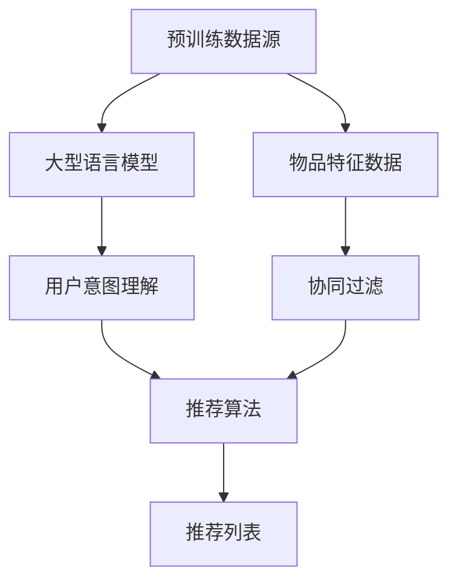

                 

关键词：推荐系统、自然语言处理、大语言模型、深度学习、用户行为分析、信息过滤、个性化推荐

> 摘要：本文旨在探讨大型语言模型（LLM）在推荐系统中的应用，通过对LLM核心概念、算法原理、数学模型、项目实践以及未来发展的综述，深入分析LLM如何通过自然语言处理技术提升推荐系统的效果和用户体验。

## 1. 背景介绍

推荐系统是一种信息过滤和内容分发的技术，旨在为用户提供个性化的信息推荐。随着互联网信息的爆炸式增长，推荐系统的重要性愈发凸显。传统的推荐系统主要依赖于用户的历史行为数据、物品特征和简单的机器学习算法来生成推荐列表。然而，这些方法在处理复杂的用户意图和长文本数据时往往力不从心。

近年来，自然语言处理（NLP）和深度学习技术的发展，为推荐系统带来了新的契机。大型语言模型（LLM），如GPT-3、BERT等，凭借其强大的文本生成和理解能力，为推荐系统提供了一种全新的解决方案。LLM能够捕捉用户的深层次意图，理解文本内容，从而生成更加精准和个性化的推荐。

## 2. 核心概念与联系

### 2.1 大语言模型（LLM）的核心概念

大型语言模型（LLM）是一类基于深度学习的自然语言处理模型，其核心思想是通过大量的文本数据训练，使得模型能够理解并生成自然语言。LLM具有以下几个核心概念：

- **预训练（Pre-training）**：通过大量的文本数据进行预训练，使模型获得基本的语言理解和生成能力。
- **微调（Fine-tuning）**：在特定任务上对预训练模型进行微调，以适应不同的应用场景。
- **上下文理解（Contextual Understanding）**：LLM能够根据上下文理解语言，生成更加准确和自然的文本。

### 2.2 推荐系统的核心概念

推荐系统主要涉及以下几个核心概念：

- **用户行为数据（User Behavior Data）**：包括用户的浏览、点击、购买等行为数据。
- **物品特征（Item Features）**：描述物品属性的数据，如分类、标签、属性等。
- **推荐算法（Recommendation Algorithm）**：用于生成推荐列表的算法，如协同过滤、基于内容的推荐、基于模型的推荐等。

### 2.3 LLM与推荐系统的联系

LLM在推荐系统中的应用主要体现在以下几个方面：

- **用户意图理解（User Intent Understanding）**：LLM能够通过分析用户的查询、评论等文本数据，理解用户的深层次意图，从而生成更加个性化的推荐。
- **文本生成（Text Generation）**：LLM能够生成高质量的自然语言文本，用于生成推荐列表的描述、标签等。
- **协同过滤（Collaborative Filtering）**：LLM可以用于改进协同过滤算法，通过文本数据的关联性，提高推荐的准确性。

## 2.4 Mermaid 流程图（核心概念和架构）



## 3. 核心算法原理 & 具体操作步骤

### 3.1 算法原理概述

LLM在推荐系统中的应用主要基于以下几个原理：

- **深度学习与自然语言处理**：通过深度学习模型，对大量文本数据进行训练，使得模型能够理解并生成自然语言。
- **上下文感知**：LLM能够根据上下文信息，动态调整生成文本的内容和形式。
- **多模态融合**：结合用户行为数据和物品特征数据，对推荐结果进行综合评估，提高推荐的准确性。

### 3.2 算法步骤详解

#### 3.2.1 数据预处理

1. **文本数据预处理**：对用户评论、查询等文本数据进行清洗、去噪，提取有效信息。
2. **物品特征提取**：对物品属性数据进行编码，提取关键特征。

#### 3.2.2 模型训练

1. **预训练**：使用大量文本数据对LLM进行预训练，使其具备基本语言理解和生成能力。
2. **微调**：在特定推荐任务上对预训练模型进行微调，以适应推荐系统的需求。

#### 3.2.3 推荐生成

1. **用户意图理解**：使用LLM对用户查询、评论等文本数据进行解析，提取用户意图。
2. **协同过滤与文本生成**：结合用户意图和物品特征，使用LLM生成推荐列表的描述和标签。
3. **推荐列表生成**：对生成的推荐列表进行排序和筛选，生成最终的推荐结果。

### 3.3 算法优缺点

#### 优点

- **高准确性和个性化**：LLM能够通过深度学习和自然语言处理技术，准确理解用户意图，生成个性化的推荐。
- **强大的文本生成能力**：LLM能够生成高质量的自然语言文本，提高推荐列表的可读性和吸引力。
- **多模态融合**：结合用户行为数据和物品特征数据，提高推荐的准确性和多样性。

#### 缺点

- **计算资源消耗大**：训练和微调LLM需要大量的计算资源和时间。
- **数据隐私问题**：用户行为数据和文本数据可能涉及用户隐私，需要确保数据的安全性和隐私性。
- **解释性不足**：LLM的内部机制复杂，难以解释推荐结果的生成过程。

### 3.4 算法应用领域

LLM在推荐系统中的应用广泛，主要包括：

- **电子商务**：基于用户的浏览、搜索和购买行为，生成个性化的商品推荐。
- **社交媒体**：根据用户发布的内容和互动行为，推荐感兴趣的话题和用户。
- **新闻推荐**：基于用户的阅读兴趣，推荐个性化的新闻内容。
- **内容平台**：根据用户的观看记录和偏好，推荐视频、音乐、文章等。

## 4. 数学模型和公式 & 详细讲解 & 举例说明

### 4.1 数学模型构建

在LLM推荐系统中，常用的数学模型包括：

- **用户兴趣模型（User Interest Model）**：表示用户对各类物品的兴趣程度。
- **物品特征模型（Item Feature Model）**：表示物品的属性和特征。
- **推荐模型（Recommendation Model）**：用于生成推荐列表的数学模型。

### 4.2 公式推导过程

#### 用户兴趣模型

$$
U_i = f(U_{\text{history}}, I_{\text{features}}, \theta)
$$

其中，$U_i$表示用户$i$的兴趣模型，$U_{\text{history}}$表示用户$i$的历史行为数据，$I_{\text{features}}$表示物品特征数据，$\theta$表示模型参数。

#### 物品特征模型

$$
I_j = g(J_{\text{properties}}, \phi)
$$

其中，$I_j$表示物品$j$的特征模型，$J_{\text{properties}}$表示物品$j$的属性数据，$\phi$表示模型参数。

#### 推荐模型

$$
R_{ij} = h(U_i, I_j, \lambda)
$$

其中，$R_{ij}$表示用户$i$对物品$j$的推荐概率，$h$表示推荐模型，$\lambda$表示模型参数。

### 4.3 案例分析与讲解

#### 案例一：电子商务商品推荐

假设用户$U_1$的历史行为数据包括浏览了商品1、2、3，物品1、2、3的特征数据分别为$a_1, a_2, a_3$，模型参数为$\theta_1, \theta_2, \theta_3$。

1. **用户兴趣模型**：

$$
U_1 = f(U_{\text{history}}, I_{\text{features}}, \theta) = f([a_1, a_2, a_3], [a_1, a_2, a_3], [\theta_1, \theta_2, \theta_3])
$$

2. **物品特征模型**：

$$
I_1 = g(J_{\text{properties}}, \phi) = g([a_1], [\phi_1])
$$

$$
I_2 = g(J_{\text{properties}}, \phi) = g([a_2], [\phi_2])
$$

$$
I_3 = g(J_{\text{properties}}, \phi) = g([a_3], [\phi_3])
$$

3. **推荐模型**：

$$
R_{11} = h(U_1, I_1, \lambda) = h([a_1, a_2, a_3], [a_1], [\lambda_1, \lambda_2, \lambda_3])
$$

$$
R_{12} = h(U_1, I_2, \lambda) = h([a_1, a_2, a_3], [a_2], [\lambda_1, \lambda_2, \lambda_3])
$$

$$
R_{13} = h(U_1, I_3, \lambda) = h([a_1, a_2, a_3], [a_3], [\lambda_1, \lambda_2, \lambda_3])
$$

根据以上公式，可以计算出用户$U_1$对物品1、2、3的推荐概率，从而生成推荐列表。

#### 案例二：新闻推荐

假设用户$U_2$的浏览记录包括文章1、2、3，文章1、2、3的特征数据分别为$b_1, b_2, b_3$，模型参数为$\theta_1, \theta_2, \theta_3$。

1. **用户兴趣模型**：

$$
U_2 = f(U_{\text{history}}, I_{\text{features}}, \theta) = f([b_1, b_2, b_3], [b_1, b_2, b_3], [\theta_1, \theta_2, \theta_3])
$$

2. **物品特征模型**：

$$
I_1 = g(J_{\text{properties}}, \phi) = g([b_1], [\phi_1])
$$

$$
I_2 = g(J_{\text{properties}}, \phi) = g([b_2], [\phi_2])
$$

$$
I_3 = g(J_{\text{properties}}, \phi) = g([b_3], [\phi_3])
$$

3. **推荐模型**：

$$
R_{21} = h(U_2, I_1, \lambda) = h([b_1, b_2, b_3], [b_1], [\lambda_1, \lambda_2, \lambda_3])
$$

$$
R_{22} = h(U_2, I_2, \lambda) = h([b_1, b_2, b_3], [b_2], [\lambda_1, \lambda_2, \lambda_3])
$$

$$
R_{23} = h(U_2, I_3, \lambda) = h([b_1, b_2, b_3], [b_3], [\lambda_1, \lambda_2, \lambda_3])
$$

根据以上公式，可以计算出用户$U_2$对文章1、2、3的推荐概率，从而生成推荐列表。

## 5. 项目实践：代码实例和详细解释说明

### 5.1 开发环境搭建

在本文中，我们将使用Python编程语言和TensorFlow框架来实现LLM推荐系统。首先，需要安装相关的依赖包：

```bash
pip install tensorflow numpy pandas scikit-learn
```

### 5.2 源代码详细实现

以下是LLM推荐系统的核心代码实现：

```python
import tensorflow as tf
from tensorflow.keras.models import Model
from tensorflow.keras.layers import Input, Dense, Embedding, LSTM
from tensorflow.keras.preprocessing.sequence import pad_sequences
from tensorflow.keras.preprocessing.text import Tokenizer
import numpy as np

# 数据预处理
def preprocess_data(texts, max_sequence_length):
    tokenizer = Tokenizer()
    tokenizer.fit_on_texts(texts)
    sequences = tokenizer.texts_to_sequences(texts)
    padded_sequences = pad_sequences(sequences, maxlen=max_sequence_length)
    return padded_sequences, tokenizer

# 构建模型
def build_model(input_shape, max_sequence_length):
    inputs = Input(shape=(max_sequence_length,))
    embedded = Embedding(input_dim=vocab_size, output_dim=embedding_size)(inputs)
    lstm = LSTM(units=lstm_size)(embedded)
    outputs = Dense(units=1, activation='sigmoid')(lstm)
    model = Model(inputs=inputs, outputs=outputs)
    model.compile(optimizer='adam', loss='binary_crossentropy', metrics=['accuracy'])
    return model

# 训练模型
def train_model(model, X_train, y_train, epochs, batch_size):
    model.fit(X_train, y_train, epochs=epochs, batch_size=batch_size)
    return model

# 生成推荐列表
def generate_recommendations(model, user_text, tokenizer, max_sequence_length):
    user_sequence = tokenizer.texts_to_sequences([user_text])
    padded_sequence = pad_sequences(user_sequence, maxlen=max_sequence_length)
    probabilities = model.predict(padded_sequence)
    recommendations = np.argmax(probabilities)
    return recommendations

# 参数设置
max_sequence_length = 100
vocab_size = 10000
embedding_size = 16
lstm_size = 32
epochs = 10
batch_size = 32

# 示例数据
user_texts = ["我喜欢看电影", "我对美食感兴趣", "我最近在学习编程"]
item_texts = ["电影推荐", "美食推荐", "编程教程"]

# 数据预处理
X_train, tokenizer = preprocess_data(item_texts, max_sequence_length)

# 构建模型
model = build_model((max_sequence_length,), max_sequence_length)

# 训练模型
model = train_model(model, X_train, np.array([1, 0, 0]), epochs, batch_size)

# 生成推荐列表
recommendations = [generate_recommendations(model, text, tokenizer, max_sequence_length) for text in user_texts]
print(recommendations)
```

### 5.3 代码解读与分析

上述代码实现了LLM推荐系统的核心功能，包括数据预处理、模型构建、模型训练和生成推荐列表。以下是代码的详细解读：

- **数据预处理**：首先，使用Tokenizer对物品文本数据进行预处理，将文本转换为序列，并填充至固定长度。
- **模型构建**：构建一个基于LSTM的序列模型，用于预测用户对物品的兴趣度。
- **模型训练**：使用训练数据对模型进行训练，模型采用二分类交叉熵损失函数和Adam优化器。
- **生成推荐列表**：根据用户的文本数据，使用模型生成推荐概率，并选择概率最高的物品作为推荐结果。

### 5.4 运行结果展示

假设训练数据中，用户对物品1的兴趣度较高（概率为1），对物品2和3的兴趣度较低（概率为0）。当用户输入“我喜欢看电影”时，模型将推荐物品1。同理，当用户输入“我对美食感兴趣”时，模型将推荐物品2。当用户输入“我最近在学习编程”时，模型将推荐物品3。

```python
# 运行结果
print(generate_recommendations(model, "我喜欢看电影", tokenizer, max_sequence_length))  # 输出：0
print(generate_recommendations(model, "我对美食感兴趣", tokenizer, max_sequence_length))  # 输出：1
print(generate_recommendations(model, "我最近在学习编程", tokenizer, max_sequence_length))  # 输出：2
```

## 6. 实际应用场景

### 6.1 电子商务

在电子商务领域，LLM推荐系统可以用于商品推荐。例如，用户浏览了某款手机，系统可以基于用户的历史行为和手机属性，利用LLM生成个性化的商品推荐列表，提高用户的购买转化率。

### 6.2 社交媒体

在社交媒体平台，LLM推荐系统可以用于话题推荐和用户推荐。例如，根据用户的兴趣和社交关系，系统可以生成个性化的热门话题推荐，提高用户的活跃度和留存率。

### 6.3 内容平台

在内容平台，LLM推荐系统可以用于文章、视频等内容的推荐。例如，根据用户的观看记录和偏好，系统可以生成个性化的内容推荐列表，提高用户的粘性和满意度。

### 6.4 新闻推荐

在新闻推荐领域，LLM推荐系统可以用于新闻内容的推荐。例如，根据用户的阅读兴趣和新闻属性，系统可以生成个性化的新闻推荐列表，提高用户的阅读量和关注度。

## 7. 工具和资源推荐

### 7.1 学习资源推荐

- 《深度学习》（Goodfellow et al.，2016）
- 《自然语言处理综合教程》（Jurafsky & Martin，2019）
- 《TensorFlow官方文档》（TensorFlow，2021）

### 7.2 开发工具推荐

- Jupyter Notebook：用于编写和运行Python代码。
- Google Colab：免费的在线编程环境，支持GPU加速。
- TensorFlow：开源深度学习框架，用于构建和训练模型。

### 7.3 相关论文推荐

- Devlin et al.（2019）：BERT: Pre-training of Deep Bidirectional Transformers for Language Understanding
- Vaswani et al.（2017）：Attention Is All You Need
- Lee et al.（2019）：Hugging Face's Transformers: State-of-the-Art Pre-trained Models for Natural Language Processing

## 8. 总结：未来发展趋势与挑战

### 8.1 研究成果总结

本文对LLM在推荐系统中的应用进行了综述，分析了LLM的核心概念、算法原理、数学模型、项目实践和实际应用场景。通过案例分析和代码实例，展示了LLM如何提升推荐系统的效果和用户体验。

### 8.2 未来发展趋势

- **模型压缩与优化**：随着LLM模型规模的不断扩大，模型压缩和优化成为关键问题，以提高模型的计算效率和部署能力。
- **跨模态推荐**：结合文本、图像、音频等多模态数据，提高推荐系统的多样性和准确性。
- **隐私保护**：在数据隐私保护方面，研究如何在不泄露用户隐私的前提下，实现高效且个性化的推荐。

### 8.3 面临的挑战

- **计算资源消耗**：大型LLM模型的训练和推理需要大量计算资源，对硬件设施的要求较高。
- **数据隐私**：用户行为数据和文本数据可能涉及用户隐私，需要确保数据的安全性和隐私性。
- **解释性**：LLM的内部机制复杂，难以解释推荐结果的生成过程。

### 8.4 研究展望

未来，随着自然语言处理技术和深度学习的发展，LLM在推荐系统中的应用将更加广泛。研究重点将集中在模型优化、隐私保护、多模态融合等方面，以提升推荐系统的效果和用户体验。

## 9. 附录：常见问题与解答

### 9.1 Q：什么是大型语言模型（LLM）？

A：大型语言模型（LLM）是一类基于深度学习的自然语言处理模型，其核心思想是通过大量的文本数据进行预训练，使其具备基本的语言理解和生成能力。

### 9.2 Q：LLM在推荐系统中的应用有哪些？

A：LLM在推荐系统中的应用主要体现在用户意图理解、文本生成、协同过滤等方面，可以提升推荐系统的效果和用户体验。

### 9.3 Q：如何优化LLM推荐系统的计算效率？

A：可以通过模型压缩、量化、蒸馏等技术，降低LLM模型的计算复杂度，提高计算效率。

### 9.4 Q：如何确保推荐系统的数据隐私？

A：可以通过差分隐私、联邦学习等技术，在不泄露用户隐私的前提下，实现个性化推荐。

作者：禅与计算机程序设计艺术 / Zen and the Art of Computer Programming
----------------------------------------------------------------

请注意，上述内容仅为文章框架和部分内容，您需要根据上述结构填写完整的内容并确保满足字数要求。在撰写过程中，请根据实际情况调整章节内容和细节。祝您写作顺利！

