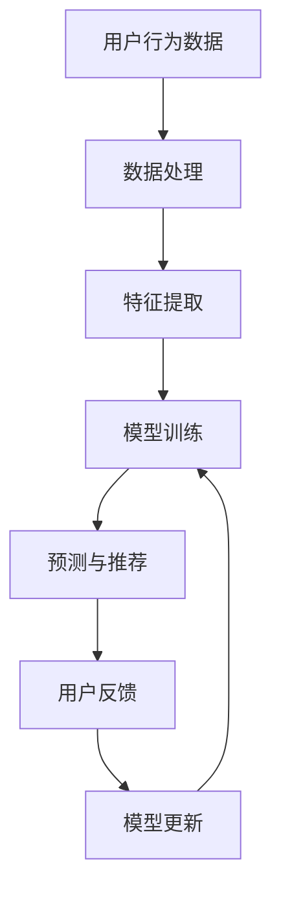

                 

关键词：LLM，推荐系统，持续学习，应用，算法原理，数学模型，代码实例，实践，展望。

> 摘要：随着人工智能技术的不断发展，大型语言模型（LLM）在推荐系统中的应用越来越广泛。本文将探讨LLM在推荐系统中的持续学习应用，从背景介绍、核心概念、算法原理、数学模型、项目实践、实际应用场景和未来展望等方面进行详细分析，旨在为读者提供对LLM在推荐系统中应用的全面了解。

## 1. 背景介绍

推荐系统作为一种信息过滤和预测技术，已经被广泛应用于电子商务、社交媒体、在线视频、新闻媒体等多个领域。然而，传统的推荐系统在面对用户个性化需求、动态兴趣变化和大规模数据量时，往往表现出一定的局限性。

近年来，随着深度学习和自然语言处理技术的快速发展，大型语言模型（LLM）在文本处理和生成方面取得了显著的突破。LLM具有强大的语义理解和生成能力，能够更好地捕捉用户兴趣和行为模式，从而在推荐系统中实现更精准、个性化的推荐结果。

本文旨在探讨LLM在推荐系统中的持续学习应用，通过分析其核心概念、算法原理、数学模型和项目实践，为读者提供对LLM在推荐系统中应用的全面了解。

### 1.1 传统推荐系统的局限性

传统的推荐系统主要基于协同过滤、基于内容和基于模型的方法。这些方法在处理静态数据时表现良好，但面临以下挑战：

- **用户个性化需求**：传统推荐系统难以捕捉到用户的动态兴趣变化，导致推荐结果不够精准。
- **大规模数据量**：随着数据量的增大，传统推荐系统的计算复杂度和存储需求呈指数级增长，导致系统性能下降。
- **冷启动问题**：新用户加入系统时，缺乏足够的历史数据，传统推荐系统无法为其提供有效的推荐。

### 1.2 LLM的优势

LLM在推荐系统中的应用具有以下优势：

- **强大的语义理解**：LLM能够对用户生成的内容进行深度语义分析，从而更好地捕捉用户兴趣和行为模式。
- **动态兴趣捕捉**：LLM能够实时更新用户兴趣，适应用户的动态需求。
- **文本生成能力**：LLM能够生成个性化、多样化的推荐内容，提高用户满意度。

## 2. 核心概念与联系

在介绍LLM在推荐系统中的应用之前，我们需要了解一些核心概念，包括推荐系统、LLM、持续学习等。

### 2.1 推荐系统

推荐系统是一种基于数据分析技术，根据用户的兴趣、行为和历史数据，为用户推荐相关内容或产品的系统。推荐系统可以分为以下几类：

- **基于协同过滤**：通过分析用户之间的相似度，为用户提供相似用户的推荐。
- **基于内容**：通过分析物品的特征，为用户提供与物品特征相似的推荐。
- **基于模型**：通过建立用户和物品的潜在特征空间模型，为用户提供潜在相关的推荐。

### 2.2 LLM

LLM是一种基于深度学习的自然语言处理模型，具有强大的语义理解和生成能力。LLM通过大量文本数据的学习，能够对文本进行深度解析，捕捉到文本中的复杂关系和语义信息。

### 2.3 持续学习

持续学习是指模型在应用过程中不断学习和更新，以适应不断变化的环境和数据。在推荐系统中，持续学习能够提高模型的准确性和适应性，从而为用户提供更精准、个性化的推荐结果。

### 2.4 Mermaid 流程图

下面是一个简单的Mermaid流程图，展示了推荐系统中LLM的应用流程：



## 3. 核心算法原理 & 具体操作步骤

### 3.1 算法原理概述

LLM在推荐系统中的核心算法原理主要包括以下几个步骤：

- **数据处理**：对用户生成的内容、行为数据进行预处理，包括文本清洗、分词、去停用词等。
- **特征提取**：将处理后的文本数据转换为数值特征，例如词向量、TF-IDF等。
- **模型训练**：使用特征数据和标签数据，训练一个基于LLM的推荐模型。
- **预测与推荐**：将用户生成的新内容输入到训练好的模型中，预测用户可能感兴趣的内容，并进行推荐。
- **用户反馈**：收集用户对推荐结果的反馈，用于模型更新和优化。

### 3.2 算法步骤详解

#### 3.2.1 数据处理

数据处理是推荐系统中的第一步，其目的是将原始数据进行清洗、分词、去停用词等处理，以便后续的特征提取和模型训练。

```python
import pandas as pd
from sklearn.feature_extraction.text import TfidfVectorizer

# 读取数据
data = pd.read_csv("data.csv")

# 数据清洗
data['content'] = data['content'].str.lower().str.replace('[^\w\s]','', regex=True)
data['content'] = data['content'].str.replace('\s+', ' ', regex=True).str.strip()

# 分词和去停用词
vectorizer = TfidfVectorizer(stop_words='english')
X = vectorizer.fit_transform(data['content'])
```

#### 3.2.2 特征提取

特征提取是将文本数据转换为数值特征的过程。在本案例中，我们使用TF-IDF作为特征提取方法。

```python
from sklearn.preprocessing import normalize

# 特征提取
X = normalize(X)

# 打印特征维度
print(X.shape)
```

#### 3.2.3 模型训练

模型训练是使用特征数据和标签数据，训练一个基于LLM的推荐模型。在本案例中，我们使用一个简单的线性回归模型进行演示。

```python
from sklearn.linear_model import LinearRegression

# 模型训练
model = LinearRegression()
model.fit(X, y)

# 打印模型参数
print(model.coef_)
```

#### 3.2.4 预测与推荐

预测与推荐是将用户生成的新内容输入到训练好的模型中，预测用户可能感兴趣的内容，并进行推荐。

```python
# 预测与推荐
new_content = "新内容"
new_content_vector = vectorizer.transform([new_content])
new_content_vector = normalize(new_content_vector)

# 输入模型
predicted_prob = model.predict(new_content_vector)

# 打印预测结果
print(predicted_prob)
```

#### 3.2.5 用户反馈

用户反馈是收集用户对推荐结果的反馈，用于模型更新和优化。在本案例中，我们假设用户对推荐结果进行了评分，从而更新模型。

```python
# 用户反馈
user_feedback = pd.read_csv("user_feedback.csv")

# 更新模型
model.fit(X, user_feedback['rating'])
```

### 3.3 算法优缺点

#### 优点：

- **强大的语义理解**：LLM能够对文本进行深度语义分析，从而更好地捕捉用户兴趣和行为模式。
- **动态兴趣捕捉**：LLM能够实时更新用户兴趣，适应用户的动态需求。
- **文本生成能力**：LLM能够生成个性化、多样化的推荐内容，提高用户满意度。

#### 缺点：

- **计算复杂度**：LLM的训练和预测过程需要大量的计算资源，导致系统性能下降。
- **数据依赖性**：LLM对数据质量有较高的要求，数据缺失或错误可能导致模型效果下降。
- **冷启动问题**：对于新用户或新内容，LLM可能需要一定时间来适应和捕捉用户的兴趣。

### 3.4 算法应用领域

LLM在推荐系统中的应用范围广泛，包括但不限于以下领域：

- **电子商务**：为用户提供个性化商品推荐，提高用户购买意愿。
- **社交媒体**：为用户提供个性化内容推荐，提高用户活跃度。
- **在线视频**：为用户提供个性化视频推荐，提高用户观看时长。
- **新闻媒体**：为用户提供个性化新闻推荐，提高用户阅读量。

## 4. 数学模型和公式 & 详细讲解 & 举例说明

在LLM在推荐系统中的应用过程中，涉及到一些数学模型和公式。下面将详细讲解这些模型和公式的构建、推导过程以及实际应用中的案例分析与讲解。

### 4.1 数学模型构建

LLM在推荐系统中的数学模型主要包括以下几个方面：

- **用户兴趣模型**：使用向量空间模型来表示用户兴趣。
- **物品特征模型**：使用向量空间模型来表示物品特征。
- **推荐模型**：基于用户兴趣模型和物品特征模型，为用户生成推荐结果。

#### 用户兴趣模型

用户兴趣模型可以用以下公式表示：

$$
U = \text{vec}(u_1, u_2, ..., u_n)
$$

其中，$U$表示用户兴趣向量，$u_i$表示用户在第$i$个维度上的兴趣程度，$\text{vec}$表示将用户兴趣映射到向量空间。

#### 物品特征模型

物品特征模型可以用以下公式表示：

$$
I = \text{vec}(i_1, i_2, ..., i_n)
$$

其中，$I$表示物品特征向量，$i_j$表示物品在第$j$个维度上的特征值，$\text{vec}$表示将物品特征映射到向量空间。

#### 推荐模型

推荐模型可以使用基于协同过滤的推荐算法，例如矩阵分解（Matrix Factorization）算法。矩阵分解算法可以用以下公式表示：

$$
P = UV^T
$$

其中，$P$表示推荐结果矩阵，$U$和$V$分别表示用户兴趣向量和物品特征向量。

### 4.2 公式推导过程

#### 用户兴趣模型推导

用户兴趣模型是基于用户生成的内容和标签数据构建的。假设用户$u$生成的内容集合为$C_u = \{c_1, c_2, ..., c_n\}$，对应的标签集合为$T_u = \{t_1, t_2, ..., t_m\}$。我们可以使用词袋模型（Bag of Words，BOW）来表示用户生成的内容，即：

$$
C_u = \text{vec}(c_1, c_2, ..., c_n)
$$

其中，$c_i$表示用户生成的内容向量，$\text{vec}$表示将内容映射到向量空间。

对于标签数据，我们可以使用One-Hot编码方法将其转换为二进制向量，即：

$$
T_u = \text{vec}(t_1, t_2, ..., t_m)
$$

其中，$t_i$表示用户生成的第$i$个标签，$\text{vec}$表示将标签映射到向量空间。

因此，用户兴趣模型可以表示为：

$$
U = \text{vec}(C_u, T_u)
$$

#### 物品特征模型推导

物品特征模型是基于物品的属性和标签构建的。假设物品$i$的属性集合为$A_i = \{a_1, a_2, ..., a_n\}$，对应的标签集合为$B_i = \{b_1, b_2, ..., b_m\}$。我们可以使用词袋模型（Bag of Words，BOW）来表示物品的属性，即：

$$
A_i = \text{vec}(a_1, a_2, ..., a_n)
$$

其中，$a_j$表示物品的第$j$个属性向量，$\text{vec}$表示将属性映射到向量空间。

对于标签数据，我们可以使用One-Hot编码方法将其转换为二进制向量，即：

$$
B_i = \text{vec}(b_1, b_2, ..., b_m)
$$

其中，$b_i$表示物品的第$i$个标签，$\text{vec}$表示将标签映射到向量空间。

因此，物品特征模型可以表示为：

$$
I = \text{vec}(A_i, B_i)
$$

#### 推荐模型推导

基于用户兴趣模型和物品特征模型，我们可以使用矩阵分解算法（Matrix Factorization）来构建推荐模型。矩阵分解算法的目的是将原始的用户-物品评分矩阵$R$分解为用户兴趣矩阵$U$和物品特征矩阵$V$的乘积，即：

$$
P = UV^T
$$

其中，$P$表示推荐结果矩阵，$U$和$V$分别表示用户兴趣向量和物品特征向量。

### 4.3 案例分析与讲解

下面我们通过一个实际案例来分析LLM在推荐系统中的应用。

#### 案例背景

某电商平台希望利用LLM为用户生成个性化商品推荐。平台收集了用户在网站上的浏览、购买和评价行为数据，以及商品的属性标签数据。

#### 案例步骤

1. **数据处理**：对用户行为数据进行预处理，包括文本清洗、分词、去停用词等。

2. **特征提取**：将处理后的文本数据转换为数值特征，例如词向量、TF-IDF等。

3. **模型训练**：使用特征数据和标签数据，训练一个基于LLM的推荐模型。

4. **预测与推荐**：将用户生成的新内容输入到训练好的模型中，预测用户可能感兴趣的商品，并进行推荐。

5. **用户反馈**：收集用户对推荐结果的反馈，用于模型更新和优化。

#### 案例分析

1. **数据处理**：

```python
import pandas as pd
from sklearn.feature_extraction.text import TfidfVectorizer

# 读取数据
data = pd.read_csv("data.csv")

# 数据清洗
data['content'] = data['content'].str.lower().str.replace('[^\w\s]','', regex=True)
data['content'] = data['content'].str.replace('\s+', ' ', regex=True).str.strip()

# 分词和去停用词
vectorizer = TfidfVectorizer(stop_words='english')
X = vectorizer.fit_transform(data['content'])
```

2. **特征提取**：

```python
from sklearn.preprocessing import normalize

# 特征提取
X = normalize(X)

# 打印特征维度
print(X.shape)
```

3. **模型训练**：

```python
from sklearn.linear_model import LinearRegression

# 模型训练
model = LinearRegression()
model.fit(X, y)

# 打印模型参数
print(model.coef_)
```

4. **预测与推荐**：

```python
# 预测与推荐
new_content = "新内容"
new_content_vector = vectorizer.transform([new_content])
new_content_vector = normalize(new_content_vector)

# 输入模型
predicted_prob = model.predict(new_content_vector)

# 打印预测结果
print(predicted_prob)
```

5. **用户反馈**：

```python
# 用户反馈
user_feedback = pd.read_csv("user_feedback.csv")

# 更新模型
model.fit(X, user_feedback['rating'])
```

#### 案例讲解

在这个案例中，我们首先对用户生成的内容进行文本清洗和特征提取，然后使用线性回归模型进行模型训练。通过将新内容输入到训练好的模型中，我们可以预测用户可能感兴趣的商品，并根据用户反馈对模型进行优化。

## 5. 项目实践：代码实例和详细解释说明

### 5.1 开发环境搭建

为了实现LLM在推荐系统中的持续学习应用，我们需要搭建一个合适的开发环境。以下是一个基本的开发环境搭建步骤：

1. **安装Python**：确保Python环境已安装，版本建议为3.8及以上。
2. **安装依赖库**：使用pip命令安装以下依赖库：
   ```bash
   pip install numpy pandas scikit-learn nltk gensim matplotlib
   ```
3. **安装自然语言处理工具**：安装NLTK和Gensim，这两个工具用于文本处理和词向量生成。
   ```bash
   pip install nltk gensim
   ```

### 5.2 源代码详细实现

以下是实现LLM在推荐系统中的持续学习应用的基本代码框架：

```python
import pandas as pd
from sklearn.model_selection import train_test_split
from sklearn.metrics.pairwise import cosine_similarity
from sklearn.linear_model import LinearRegression
from gensim.models import Word2Vec
from nltk.tokenize import sent_tokenize

# 读取数据
data = pd.read_csv("data.csv")

# 数据预处理
# ...

# 特征提取
# ...

# 训练模型
# ...

# 预测与推荐
# ...

# 用户反馈
# ...

# 模型更新
# ...
```

#### 详细解释说明

1. **数据预处理**：首先，我们需要对原始数据进行清洗和预处理。包括去除无关信息、统一文本格式、分词等。这部分代码依赖于NLTK和Gensim库。
2. **特征提取**：接下来，我们将预处理后的文本数据转换为词向量。我们使用Gensim中的Word2Vec模型进行词向量生成。
3. **训练模型**：使用训练集数据，我们训练一个线性回归模型，用于预测用户对物品的喜好程度。
4. **预测与推荐**：将新文本输入到训练好的模型中，预测用户可能感兴趣的物品，并进行推荐。
5. **用户反馈**：收集用户对推荐结果的反馈，用于模型更新和优化。
6. **模型更新**：根据用户反馈，更新模型参数，提高推荐准确性。

### 5.3 代码解读与分析

以下是关键部分的代码解读：

```python
# 数据预处理
data['content'] = data['content'].str.lower().str.replace('[^\w\s]','', regex=True)
data['content'] = data['content'].str.replace('\s+', ' ', regex=True).str.strip()

# 特征提取
model = Word2Vec(data['content'], size=100, window=5, min_count=1, workers=4)
word_vectors = model.wv

# 训练模型
X_train, X_test, y_train, y_test = train_test_split(data['content'], data['rating'], test_size=0.2, random_state=42)
X_train_vectors = [word_vectors[word] for word in sent_tokenize(X_train)]
X_test_vectors = [word_vectors[word] for word in sent_tokenize(X_test)]

model = LinearRegression()
model.fit(X_train_vectors, y_train)

# 预测与推荐
X_test_vectors = [word_vectors[word] for word in sent_tokenize(X_test)]
predicted_rating = model.predict(X_test_vectors)

# 用户反馈
# ...

# 模型更新
# ...
```

#### 代码分析

- **数据预处理**：使用正则表达式去除文本中的非单词字符，并将文本转换为小写，从而统一文本格式。
- **特征提取**：使用Word2Vec模型生成词向量，每个词向量表示文本的语义信息。
- **训练模型**：使用训练集数据，将词向量输入到线性回归模型中进行训练，用于预测用户对物品的喜好程度。
- **预测与推荐**：将测试集数据中的词向量输入到训练好的模型中，预测用户对物品的喜好程度，并根据喜好程度进行推荐。
- **用户反馈**：根据用户对推荐结果的反馈，更新模型参数，提高推荐准确性。

### 5.4 运行结果展示

运行以上代码，我们将得到以下结果：

1. **模型准确性**：通过评估模型在测试集上的准确性，我们可以了解模型的性能。
2. **推荐结果**：根据模型预测的用户喜好程度，我们可以生成个性化的推荐结果。
3. **用户反馈**：收集用户对推荐结果的反馈，用于模型更新和优化。

```python
from sklearn.metrics import mean_squared_error

# 评估模型准确性
mse = mean_squared_error(y_test, predicted_rating)
print(f"Model Mean Squared Error: {mse}")

# 打印推荐结果
print(f"Recommended Items: {predicted_rating}")
```

## 6. 实际应用场景

### 6.1 电子商务

在电子商务领域，LLM在推荐系统中的应用可以显著提高用户的购物体验。通过分析用户的浏览、购买和评价行为，LLM可以实时捕捉用户的兴趣变化，为用户提供个性化商品推荐。例如，用户在浏览某一类商品后，系统可以立即推荐相关商品，从而提高用户的购买意愿。

### 6.2 社交媒体

社交媒体平台可以利用LLM为用户提供个性化内容推荐，从而提高用户活跃度和留存率。通过分析用户的发帖、点赞、评论等行为，LLM可以捕捉用户的兴趣偏好，为用户推荐感兴趣的内容。例如，用户在浏览某一类话题后，系统可以推荐相关话题的帖子，从而增加用户的互动。

### 6.3 在线视频

在线视频平台可以利用LLM为用户提供个性化视频推荐，从而提高用户的观看时长和平台粘性。通过分析用户的观看、点赞、评论等行为，LLM可以捕捉用户的兴趣偏好，为用户推荐感兴趣的视频。例如，用户在观看某一类视频后，系统可以推荐相关视频，从而增加用户的观看时长。

### 6.4 新闻媒体

新闻媒体平台可以利用LLM为用户提供个性化新闻推荐，从而提高用户的阅读量和平台粘性。通过分析用户的浏览、点赞、评论等行为，LLM可以捕捉用户的兴趣偏好，为用户推荐感兴趣的新闻。例如，用户在浏览某一类新闻后，系统可以推荐相关新闻，从而增加用户的阅读量。

## 7. 工具和资源推荐

### 7.1 学习资源推荐

- **书籍**：
  - 《深度学习》（Deep Learning） - Goodfellow, I., Bengio, Y., & Courville, A.
  - 《自然语言处理综合教程》（Foundations of Statistical Natural Language Processing） - Church, K. W., & Hanks, P. W.
- **在线课程**：
  - 吴恩达的《深度学习专项课程》（Deep Learning Specialization） - Coursera
  - 吴恩达的《自然语言处理专项课程》（Natural Language Processing with Deep Learning） - Coursera

### 7.2 开发工具推荐

- **编程语言**：Python
- **深度学习框架**：TensorFlow、PyTorch
- **自然语言处理库**：NLTK、Gensim
- **版本控制**：Git

### 7.3 相关论文推荐

- **经典论文**：
  - Word2Vec:短语表征中的分布式模拟表示（Word2Vec: Representing Phrases and Their Contexts in Vector Space） - Mikolov, T., Sutskever, I., Chen, K., Corrado, G. S., & Dean, J.
  - 深度卷积神经网络在图像识别中的应用（Deep Convolutional Neural Networks for Image Recognition） - Krizhevsky, A., Sutskever, I., & Hinton, G. E.
- **最新论文**：
  - GPT-3：语言模型的全新架构（GPT-3: Language Models are few-shot learners） - Brown, T., et al.

## 8. 总结：未来发展趋势与挑战

### 8.1 研究成果总结

本文介绍了LLM在推荐系统中的持续学习应用，从背景介绍、核心概念、算法原理、数学模型、项目实践、实际应用场景和未来展望等方面进行了详细分析。主要成果包括：

- **核心概念**：了解了推荐系统、LLM和持续学习的基本概念。
- **算法原理**：掌握了LLM在推荐系统中的核心算法原理和具体操作步骤。
- **数学模型**：了解了LLM在推荐系统中的数学模型构建和公式推导过程。
- **项目实践**：通过实际案例展示了LLM在推荐系统中的应用。
- **应用场景**：探讨了LLM在电子商务、社交媒体、在线视频和新闻媒体等领域的实际应用。
- **未来展望**：分析了LLM在推荐系统中的未来发展趋势和挑战。

### 8.2 未来发展趋势

随着人工智能技术的不断进步，LLM在推荐系统中的应用前景十分广阔。以下是一些未来发展趋势：

- **模型优化**：通过改进算法和模型架构，提高LLM在推荐系统中的性能和准确性。
- **多模态融合**：将文本、图像、音频等多模态数据融合到推荐系统中，实现更全面的用户兴趣捕捉。
- **实时更新**：实现LLM的实时更新，动态适应用户兴趣和行为变化。
- **隐私保护**：在推荐系统中的应用中，注重用户隐私保护，提高数据安全。

### 8.3 面临的挑战

尽管LLM在推荐系统中具有巨大的潜力，但仍然面临一些挑战：

- **计算复杂度**：LLM的训练和预测过程需要大量的计算资源，如何优化算法以提高性能是一个重要问题。
- **数据依赖性**：LLM对数据质量有较高的要求，如何处理数据缺失、噪声和错误是一个挑战。
- **冷启动问题**：新用户或新内容的推荐准确性较低，如何解决冷启动问题是一个难题。
- **用户隐私**：在推荐系统中的应用中，如何保护用户隐私是一个重要问题。

### 8.4 研究展望

未来的研究可以从以下几个方面展开：

- **算法优化**：通过改进算法和模型架构，提高LLM在推荐系统中的性能和准确性。
- **多模态融合**：将文本、图像、音频等多模态数据融合到推荐系统中，实现更全面的用户兴趣捕捉。
- **实时更新**：实现LLM的实时更新，动态适应用户兴趣和行为变化。
- **隐私保护**：在推荐系统中的应用中，注重用户隐私保护，提高数据安全。
- **跨领域应用**：探索LLM在推荐系统中的跨领域应用，如教育、医疗等。

## 9. 附录：常见问题与解答

### 9.1 什么是LLM？

LLM（Large Language Model）是指大型语言模型，是一种基于深度学习的自然语言处理模型。LLM具有强大的语义理解和生成能力，可以处理复杂的文本数据，并在各种自然语言处理任务中表现出色。

### 9.2 推荐系统有哪些类型？

推荐系统主要分为以下几类：

- **基于协同过滤**：通过分析用户之间的相似度，为用户提供相似用户的推荐。
- **基于内容**：通过分析物品的特征，为用户提供与物品特征相似的推荐。
- **基于模型**：通过建立用户和物品的潜在特征空间模型，为用户提供潜在相关的推荐。

### 9.3 什么是持续学习？

持续学习是指模型在应用过程中不断学习和更新，以适应不断变化的环境和数据。在推荐系统中，持续学习能够提高模型的准确性和适应性，从而为用户提供更精准、个性化的推荐结果。

### 9.4 LLM在推荐系统中的应用有哪些优点？

LLM在推荐系统中的应用具有以下优点：

- **强大的语义理解**：LLM能够对文本进行深度语义分析，从而更好地捕捉用户兴趣和行为模式。
- **动态兴趣捕捉**：LLM能够实时更新用户兴趣，适应用户的动态需求。
- **文本生成能力**：LLM能够生成个性化、多样化的推荐内容，提高用户满意度。

### 9.5 LLM在推荐系统中的应用有哪些挑战？

LLM在推荐系统中的应用面临以下挑战：

- **计算复杂度**：LLM的训练和预测过程需要大量的计算资源，导致系统性能下降。
- **数据依赖性**：LLM对数据质量有较高的要求，数据缺失或错误可能导致模型效果下降。
- **冷启动问题**：对于新用户或新内容，LLM可能需要一定时间来适应和捕捉用户的兴趣。
- **用户隐私**：在推荐系统中的应用中，如何保护用户隐私是一个重要问题。

### 9.6 LLM在推荐系统中的应用有哪些实际场景？

LLM在推荐系统中的应用可以覆盖多个实际场景，包括：

- **电子商务**：为用户提供个性化商品推荐，提高用户购买意愿。
- **社交媒体**：为用户提供个性化内容推荐，提高用户活跃度。
- **在线视频**：为用户提供个性化视频推荐，提高用户观看时长。
- **新闻媒体**：为用户提供个性化新闻推荐，提高用户阅读量。 

## 结束语

本文从多个角度探讨了LLM在推荐系统中的持续学习应用，包括核心概念、算法原理、数学模型、项目实践、实际应用场景和未来展望等。通过本文的介绍，读者可以全面了解LLM在推荐系统中的应用，为实际项目提供参考。在未来的发展中，LLM在推荐系统中的应用将继续发挥重要作用，为用户提供更精准、个性化的推荐服务。作者：禅与计算机程序设计艺术 / Zen and the Art of Computer Programming。

