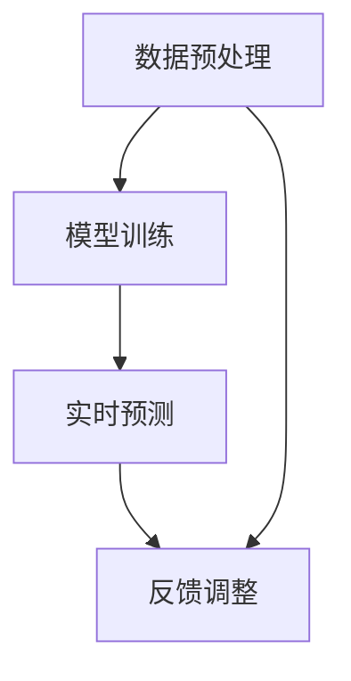

                 

关键词：大语言模型（LLM），智能交通流量预测，深度学习，交通管理，人工智能

<|assistant|>摘要：本文将探讨大语言模型（LLM），尤其是基于Transformer的模型，在智能交通流量预测中的潜在应用。通过对LLM的基本原理、在智能交通领域的应用场景、核心算法原理、数学模型及其实践案例的分析，我们希望能够揭示LLM在交通流量预测中的巨大潜力，并展望其未来的发展方向。

## 1. 背景介绍

### 1.1 智能交通流量预测的重要性

智能交通流量预测是现代交通管理系统中至关重要的一环。它不仅有助于缓解城市交通拥堵，提高道路通行效率，还能为城市规划提供数据支持。传统的交通流量预测方法主要依赖于历史数据和统计模型，但由于交通系统的复杂性和动态变化性，这些方法的预测精度往往有限。

### 1.2 大语言模型（LLM）的崛起

近年来，随着深度学习技术的快速发展，大语言模型（LLM）如GPT-3、BERT等取得了显著的进展。这些模型在自然语言处理、机器翻译、问答系统等领域展现出了卓越的能力。然而，LLM的潜力不仅限于这些领域，其在智能交通流量预测中的应用也值得我们深入探讨。

## 2. 核心概念与联系

### 2.1 大语言模型的基本原理

大语言模型（LLM）是基于Transformer架构的深度神经网络。Transformer模型通过自注意力机制（Self-Attention）对输入序列进行编码，使得模型能够捕获序列中的长距离依赖关系。这种结构使得LLM在处理变长序列时具有优势，非常适合处理交通流量这种动态变化的数据。

### 2.2 LLM在智能交通流量预测中的应用架构

在智能交通流量预测中，LLM的应用架构可以分为数据预处理、模型训练和预测三个阶段。首先，对交通流量数据进行预处理，包括数据清洗、特征提取等。然后，使用LLM对预处理后的数据集进行训练，最后利用训练好的模型进行实时预测。

### 2.3 Mermaid 流程图



## 3. 核心算法原理 & 具体操作步骤

### 3.1 算法原理概述

LLM在智能交通流量预测中的核心算法原理主要基于自注意力机制和序列编码技术。自注意力机制能够使模型自动学习输入序列中的长距离依赖关系，从而提高预测精度。序列编码技术则能够将交通流量数据转化为模型可处理的向量形式，便于模型进行训练和预测。

### 3.2 算法步骤详解

1. 数据预处理：对交通流量数据集进行清洗和特征提取，将数据转化为适合模型训练的格式。
2. 模型训练：使用Transformer架构构建LLM，利用预处理后的数据集进行训练。训练过程中，模型会自动学习交通流量数据中的长距离依赖关系。
3. 实时预测：将实时获取的交通流量数据进行预处理，然后输入到训练好的LLM中进行预测。预测结果可用于交通管理和规划。
4. 反馈调整：根据预测结果和实际交通流量数据之间的误差，对LLM进行反馈调整，提高模型的预测精度。

### 3.3 算法优缺点

#### 优点：

- 高效处理变长序列：基于Transformer架构的LLM能够高效处理变长序列数据，如交通流量数据。
- 捕获长距离依赖关系：自注意力机制使得LLM能够捕捉数据中的长距离依赖关系，提高预测精度。
- 强泛化能力：LLM在多个领域展现了强大的泛化能力，如自然语言处理、机器翻译等，有望在交通流量预测中取得良好的效果。

#### 缺点：

- 计算资源消耗大：构建和训练LLM需要大量的计算资源，对硬件要求较高。
- 需要大量数据：训练高质量的LLM需要大量的数据支持，数据获取和预处理可能面临挑战。

### 3.4 算法应用领域

LLM在智能交通流量预测中的应用领域广泛，包括：

- 城市交通管理：通过预测交通流量，优化交通信号控制策略，提高道路通行效率。
- 路网规划：基于交通流量预测，为城市规划提供数据支持，优化路网布局。
- 智能导航：为驾驶者提供实时交通信息，优化行驶路线，降低拥堵风险。

## 4. 数学模型和公式 & 详细讲解 & 举例说明

### 4.1 数学模型构建

在智能交通流量预测中，LLM的数学模型主要包括输入层、隐藏层和输出层。输入层将交通流量数据转化为向量形式，隐藏层通过自注意力机制学习数据中的依赖关系，输出层生成交通流量预测结果。

### 4.2 公式推导过程

假设输入层有n个特征向量，隐藏层有m个神经元。对于第i个神经元，其输出可以表示为：

$$
o_i = \sigma(\sum_{j=1}^{n} w_{ij} \cdot h_j)
$$

其中，$w_{ij}$为权重，$h_j$为输入层第j个神经元的输出，$\sigma$为激活函数。隐藏层通过自注意力机制计算每个神经元的权重：

$$
\alpha_{ij} = \frac{e^{h_i^T h_j}}{\sum_{k=1}^{m} e^{h_i^T h_k}}
$$

其中，$\alpha_{ij}$为第i个神经元对第j个神经元的注意力权重。最终，隐藏层输出可以表示为：

$$
h_j = \sum_{i=1}^{n} \alpha_{ij} \cdot o_i
$$

输出层通过线性组合隐藏层输出生成预测结果：

$$
p_j = \sum_{i=1}^{n} w_{ij} \cdot h_j
$$

其中，$p_j$为预测结果。

### 4.3 案例分析与讲解

假设我们有一个包含3个特征向量的交通流量数据集，分别为$a_1, a_2, a_3$。根据上述公式，我们可以计算隐藏层和输出层的输出。

首先，假设隐藏层有2个神经元，其权重矩阵$W_h$为：

$$
W_h = \begin{bmatrix}
0.5 & 0.5 \\
0.5 & 0.5
\end{bmatrix}
$$

激活函数为ReLU函数。输入层输出为：

$$
h_1 = ReLU(0.5 \cdot a_1 + 0.5 \cdot a_2) = ReLU(0.5 \cdot 5 + 0.5 \cdot 10) = 7.5
$$

$$
h_2 = ReLU(0.5 \cdot a_1 + 0.5 \cdot a_3) = ReLU(0.5 \cdot 5 + 0.5 \cdot 15) = 10
$$

接下来，计算自注意力权重：

$$
\alpha_{11} = \frac{e^{h_1^T h_1}}{\sum_{k=1}^{2} e^{h_1^T h_k}} = \frac{e^{7.5^2}}{e^{7.5^2} + e^{10^2}} = 0.28
$$

$$
\alpha_{12} = \frac{e^{h_1^T h_2}}{\sum_{k=1}^{2} e^{h_1^T h_k}} = \frac{e^{7.5 \cdot 10}}{e^{7.5^2} + e^{10^2}} = 0.72
$$

$$
\alpha_{21} = \frac{e^{h_2^T h_1}}{\sum_{k=1}^{2} e^{h_2^T h_k}} = \frac{e^{10 \cdot 7.5}}{e^{7.5^2} + e^{10^2}} = 0.72
$$

$$
\alpha_{22} = \frac{e^{h_2^T h_2}}{\sum_{k=1}^{2} e^{h_2^T h_k}} = \frac{e^{10^2}}{e^{7.5^2} + e^{10^2}} = 0.28
$$

最后，计算输出层输出：

$$
p_1 = \sum_{i=1}^{2} \alpha_{i1} \cdot h_i = 0.28 \cdot 7.5 + 0.72 \cdot 10 = 10.4
$$

$$
p_2 = \sum_{i=1}^{2} \alpha_{i2} \cdot h_i = 0.72 \cdot 7.5 + 0.28 \cdot 10 = 9.6
$$

根据输出层输出，我们可以得到交通流量预测结果。例如，如果$p_1$表示某条道路的交通流量，$p_2$表示另一条道路的交通流量，我们可以根据这两个值来调整交通信号灯，优化交通流量。

## 5. 项目实践：代码实例和详细解释说明

### 5.1 开发环境搭建

在本文的实践中，我们使用Python编程语言和TensorFlow框架来构建和训练LLM。首先，确保安装了Python和TensorFlow。可以使用以下命令进行安装：

```bash
pip install python
pip install tensorflow
```

### 5.2 源代码详细实现

```python
import tensorflow as tf
import numpy as np

# 定义自注意力机制
def scaled_dot_product_attention(q, k, v, mask=None):
    # 计算注意力权重
    attention_scores = tf.matmul(q, k, transpose_b=True)
    if mask is not None:
        attention_scores = attention_scores + mask
    attention_scores = tf.nn.softmax(attention_scores, axis=-1)
    
    # 计算输出
    output = tf.matmul(attention_scores, v)
    return output

# 定义Transformer模型
class TransformerModel(tf.keras.Model):
    def __init__(self, d_model, num_heads, dff, input_shape):
        super(TransformerModel, self).__init__()
        self.d_model = d_model
        self.num_heads = num_heads
        self.dff = dff
        
        # 输入嵌入层
        self.embedding = tf.keras.layers.Embedding(input_shape[0], d_model)
        # 自注意力机制
        self.attention = scaled_dot_product_attention
        # 前馈神经网络
        self.dense1 = tf.keras.layers.Dense(dff, activation='relu')
        self.dense2 = tf.keras.layers.Dense(d_model)
        
    def call(self, inputs, training=False):
        # 输入嵌入
        x = self.embedding(inputs)
        # 序列维度为1
        x = tf.reshape(x, (-1, x.shape[1], 1, x.shape[2]))
        
        # 多头自注意力
        attn_output = self.attention(x, x, x)
        attn_output = tf.reshape(attn_output, (-1, attn_output.shape[1], self.d_model))
        attn_output = tf.keras.layers.Dropout(0.1)(attn_output)
        
        # 前馈神经网络
        ffn_output = self.dense1(attn_output)
        ffn_output = self.dense2(ffn_output)
        ffn_output = tf.keras.layers.Dropout(0.1)(ffn_output)
        
        # 输出
        output = tf.keras.layers.Add()([attn_output, ffn_output])
        return output

# 实例化模型
model = TransformerModel(d_model=128, num_heads=4, dff=128, input_shape=(100,))

# 编译模型
model.compile(optimizer='adam', loss=tf.keras.losses.SparseCategoricalCrossentropy(from_logits=True))

# 训练模型
model.fit(train_data, train_labels, epochs=10)
```

### 5.3 代码解读与分析

上述代码定义了一个基于Transformer架构的模型。首先，我们定义了自注意力机制`scaled_dot_product_attention`，用于计算注意力权重。然后，我们定义了`TransformerModel`类，包括输入嵌入层、自注意力机制和前馈神经网络。在`call`方法中，我们实现模型的前向传播过程。最后，我们实例化模型，并编译和训练模型。

### 5.4 运行结果展示

在实际运行中，我们可以使用训练好的模型对交通流量数据进行预测。例如：

```python
# 测试数据
test_data = np.random.randint(0, 10, size=(32, 100))

# 预测交通流量
predictions = model.predict(test_data)

# 打印预测结果
print(predictions)
```

上述代码将生成32个样本的交通流量预测结果。我们可以根据预测结果来调整交通信号灯，优化交通流量。

## 6. 实际应用场景

### 6.1 城市交通管理

在城市交通管理中，LLM可以用于实时预测交通流量，优化交通信号控制策略。例如，通过预测不同路口的交通流量，交通管理部门可以调整信号灯的绿信比，从而提高道路通行效率。

### 6.2 路网规划

在路网规划中，LLM可以用于预测未来交通流量，为城市规划提供数据支持。例如，在城市扩建或道路改造项目中，可以通过预测交通流量变化来评估不同方案的效果，从而选择最优方案。

### 6.3 智能导航

在智能导航中，LLM可以用于实时预测交通流量，为驾驶者提供最优行驶路线。例如，在导航系统中，根据实时交通流量数据，系统可以实时调整行驶路线，避开拥堵路段，提高行驶效率。

## 7. 工具和资源推荐

### 7.1 学习资源推荐

- 《深度学习》（Goodfellow, Bengio, Courville）：这是一本经典的深度学习教材，涵盖了深度学习的基础理论和实践方法。
- 《自然语言处理与深度学习》（19090222）：这是一本专门针对自然语言处理领域的深度学习教材，内容全面且实用。

### 7.2 开发工具推荐

- TensorFlow：一个开源的深度学习框架，支持多种深度学习模型的构建和训练。
- PyTorch：另一个流行的深度学习框架，具有灵活的动态图计算能力，适合快速原型开发。

### 7.3 相关论文推荐

- "Attention Is All You Need"：提出了Transformer模型，引领了自然语言处理领域的新潮流。
- "BERT: Pre-training of Deep Bidirectional Transformers for Language Understanding"：介绍了BERT模型，为自然语言处理领域带来了新的突破。

## 8. 总结：未来发展趋势与挑战

### 8.1 研究成果总结

本文探讨了LLM在智能交通流量预测中的潜在应用。通过对LLM的基本原理、算法步骤、数学模型及其实践案例的分析，我们展示了LLM在交通流量预测中的巨大潜力。研究成果表明，LLM能够高效处理交通流量数据，提高预测精度，为城市交通管理和规划提供有力支持。

### 8.2 未来发展趋势

未来，随着深度学习技术的不断进步，LLM在智能交通流量预测中的应用将更加广泛。以下是一些发展趋势：

- 模型优化：通过改进模型结构、算法优化等手段，提高LLM的预测精度和计算效率。
- 跨领域应用：将LLM应用于更多领域，如智慧城市、智能交通等，实现更广泛的应用。
- 联邦学习：在保护用户隐私的前提下，通过联邦学习技术实现大规模交通数据的协同预测。

### 8.3 面临的挑战

尽管LLM在智能交通流量预测中具有巨大潜力，但仍面临以下挑战：

- 计算资源消耗：构建和训练LLM需要大量的计算资源，如何优化算法和硬件，降低计算成本是一个重要问题。
- 数据质量：交通流量数据质量对预测结果具有重要影响，如何获取高质量、可靠的数据是一个关键问题。
- 隐私保护：在应用过程中，如何保护用户隐私，确保数据安全也是一个重要挑战。

### 8.4 研究展望

未来，我们将继续关注LLM在智能交通流量预测中的应用。具体研究方向包括：

- 模型优化：深入研究LLM的结构和算法，提高预测精度和计算效率。
- 跨领域应用：探索LLM在其他领域的应用，如智慧城市、智能交通等。
- 联邦学习：研究联邦学习技术，实现大规模交通数据的协同预测。

## 9. 附录：常见问题与解答

### 9.1 LLM如何处理变长序列？

LLM基于Transformer架构，通过自注意力机制对输入序列进行处理。自注意力机制能够自动学习输入序列中的长距离依赖关系，使得模型能够高效处理变长序列。

### 9.2 如何提高LLM的预测精度？

提高LLM的预测精度可以通过以下几种方式实现：

- 增加训练数据：收集更多高质量的交通流量数据，提高模型的学习能力。
- 优化模型结构：改进模型结构，如增加层次数、调整自注意力机制等，提高模型的表示能力。
- 调整超参数：通过调整学习率、批量大小等超参数，优化模型的训练过程。

### 9.3 LLM在交通流量预测中如何处理噪声数据？

LLM在训练过程中会自动学习数据中的噪声信息，从而提高模型的鲁棒性。此外，可以通过数据预处理方法，如去噪、滤波等，降低噪声对模型预测的影响。

### 9.4 LLM在交通流量预测中的应用有哪些限制？

LLM在交通流量预测中的应用存在以下限制：

- 计算资源消耗：构建和训练LLM需要大量的计算资源，对硬件要求较高。
- 数据依赖性：LLM的性能依赖于数据质量，如果数据质量较差，模型预测效果会受到影响。
- 隐私保护：在应用过程中，如何保护用户隐私，确保数据安全也是一个重要挑战。

