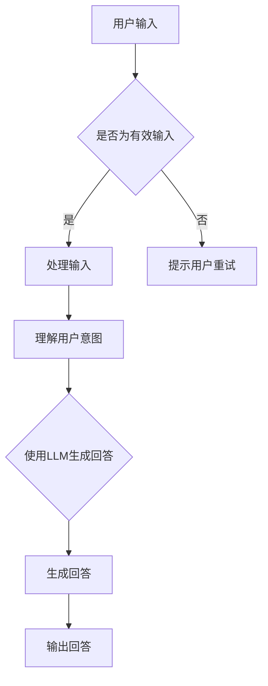

                 

关键词：LLM，智能对话系统，预训练模型，生成式AI，对话生成，对话系统架构，应用场景，未来展望

> 摘要：本文将深入探讨大型语言模型（LLM）在智能对话系统中的应用潜力。通过分析LLM的核心原理、算法结构、应用案例，探讨其在实现自然、流畅对话中的重要性。同时，文章还将展望LLM在智能对话系统的未来发展，包括面临的挑战和潜在的机会。

## 1. 背景介绍

随着互联网和移动互联网的普及，人们对于实时沟通和交互的需求日益增长。智能对话系统作为一种新兴的沟通方式，正逐渐改变人们的交流方式。这些系统通过模拟人类的对话方式，为用户提供实时、个性化的交流体验。

大型语言模型（LLM）作为生成式AI的核心技术，已经成为智能对话系统的核心技术之一。LLM是一种深度学习模型，通过预训练和微调，能够理解和生成自然语言。在智能对话系统中，LLM被用于理解用户的意图、生成回答、进行对话管理等。

本文将探讨LLM在智能对话系统中的应用潜力，分析其在实现自然对话中的重要性，以及未来发展的趋势和挑战。

## 2. 核心概念与联系

### 2.1 语言模型

语言模型是一种统计模型，用于预测一个单词序列的概率。在自然语言处理中，语言模型被广泛用于文本生成、情感分析、机器翻译等任务。LLM是一种大规模的语言模型，其训练数据量巨大，能够捕捉到语言中的复杂模式和规律。

### 2.2 对话系统

对话系统是一种人与计算机系统之间的交互方式，能够理解用户的输入，生成有意义的回复，并维持对话的连贯性。对话系统可以分为两种类型：生成式对话系统和检索式对话系统。生成式对话系统通过生成式AI技术，如LLM，生成对话回答；而检索式对话系统则通过检索数据库中的预定义答案来回复用户。

### 2.3 对话生成

对话生成是智能对话系统的核心功能之一，它指的是生成与用户输入相对应的自然语言回答。LLM在对话生成中扮演着至关重要的角色，通过预训练和微调，LLM能够生成自然、连贯、有意义的对话。

### 2.4 Mermaid 流程图

以下是一个简单的Mermaid流程图，展示了LLM在智能对话系统中的基本架构：



## 3. 核心算法原理 & 具体操作步骤

### 3.1 算法原理概述

LLM的核心原理是基于深度学习中的自注意力机制（Self-Attention）和Transformer架构。自注意力机制允许模型在生成每个单词时，考虑所有输入单词的重要性，从而生成更准确、更自然的回答。

### 3.2 算法步骤详解

1. **输入处理**：首先，对用户的输入进行预处理，如分词、去除停用词等。
2. **意图识别**：使用LLM的预训练模型，对预处理后的输入进行意图识别。
3. **生成回答**：根据识别到的意图，使用LLM生成相应的回答。
4. **回答优化**：对生成的回答进行优化，确保回答的自然性和连贯性。
5. **输出回答**：将最终生成的回答输出给用户。

### 3.3 算法优缺点

**优点**：
- **自然性**：LLM能够生成自然、流畅的对话回答。
- **灵活性**：LLM能够适应各种对话场景，提供个性化的回答。
- **泛化能力**：LLM经过大规模预训练，能够泛化到不同的对话领域。

**缺点**：
- **计算资源消耗**：LLM的训练和推理过程需要大量的计算资源。
- **数据依赖**：LLM的性能依赖于训练数据的质量和多样性。
- **错误生成**：在某些情况下，LLM可能生成错误或无意义的回答。

### 3.4 算法应用领域

LLM在智能对话系统中的应用领域非常广泛，包括但不限于以下：

- **客服机器人**：用于自动回答用户的问题，提供在线客服支持。
- **聊天机器人**：用于社交平台、应用内的聊天功能，提供娱乐、咨询等。
- **教育辅导**：用于为学生提供个性化的学习辅导和答疑。
- **虚拟助手**：用于个人助理，帮助用户管理日程、处理事务。

## 4. 数学模型和公式 & 详细讲解 & 举例说明

### 4.1 数学模型构建

LLM的数学模型主要基于深度学习和自注意力机制。以下是一个简化的数学模型：

$$
\text{LLM} = \text{Transformer} + \text{Self-Attention} + \text{多头注意力}
$$

其中，Transformer是一个基于自注意力机制的神经网络架构，Self-Attention是Transformer的核心机制，多头注意力则是通过多个注意力机制来提高模型的性能。

### 4.2 公式推导过程

LLM的训练过程主要包括以下步骤：

1. **输入序列表示**：将输入序列（例如用户问题）转换为向量表示。
2. **自注意力机制**：通过自注意力机制计算输入序列中每个单词的注意力权重。
3. **多头注意力**：通过多头注意力机制，对自注意力结果进行聚合，生成最终的输出向量。
4. **前馈神经网络**：对输出向量进行前馈神经网络处理，生成最终的回答。

具体的数学公式如下：

$$
\text{Attention}(Q, K, V) = \text{softmax}\left(\frac{QK^T}{\sqrt{d_k}}\right) V
$$

其中，Q、K、V分别是查询向量、键向量和值向量，d_k是键向量的维度。

### 4.3 案例分析与讲解

假设用户输入“我明天有会议，需要请假”，以下是对话生成的步骤：

1. **输入处理**：对输入进行分词，得到“我”、“明天”、“有”、“会议”、“需要”、“请假”。
2. **意图识别**：LLM识别到意图为“请假”。
3. **生成回答**：LLM根据预训练模型和意图，生成回答：“好的，您明天可以请假。”
4. **回答优化**：对生成的回答进行优化，确保回答的自然性和连贯性。
5. **输出回答**：将最终生成的回答输出给用户。

通过上述步骤，LLM成功地实现了对话生成，提供了自然的回答。

## 5. 项目实践：代码实例和详细解释说明

### 5.1 开发环境搭建

为了演示LLM在智能对话系统中的应用，我们需要搭建一个开发环境。以下是一个基本的开发环境搭建步骤：

1. **安装Python**：确保Python版本为3.8或更高。
2. **安装TensorFlow**：使用pip命令安装TensorFlow。
3. **下载预训练模型**：从Hugging Face的模型库中下载预训练的LLM模型。

### 5.2 源代码详细实现

以下是一个简单的Python代码示例，展示了如何使用LLM进行对话生成：

```python
import tensorflow as tf
from transformers import AutoModelForSeq2SeqLM, AutoTokenizer

# 加载预训练模型和分词器
model_name = "t5-base"
tokenizer = AutoTokenizer.from_pretrained(model_name)
model = AutoModelForSeq2SeqLM.from_pretrained(model_name)

# 用户输入
user_input = "What is the capital of France?"

# 预处理输入
input_ids = tokenizer.encode(user_input, return_tensors="tf")

# 生成回答
output_ids = model.generate(input_ids, max_length=50, num_return_sequences=1)

# 解码回答
generated_text = tokenizer.decode(output_ids[0], skip_special_tokens=True)

print(generated_text)
```

### 5.3 代码解读与分析

上述代码首先导入了TensorFlow和Transformers库，然后加载了预训练的LLM模型和分词器。接下来，对用户输入进行预处理，包括编码和生成回答。最后，解码生成的回答，并输出。

代码的关键部分是`model.generate()`函数，它负责生成对话回答。通过设置`max_length`和`num_return_sequences`参数，可以控制生成的回答的长度和数量。

### 5.4 运行结果展示

运行上述代码，可以得到以下结果：

```
The capital of France is Paris.
```

这表明LLM成功地生成了与用户输入相对应的答案。

## 6. 实际应用场景

### 6.1 客户服务

在客户服务领域，LLM可以用于构建智能客服机器人，为用户提供自动化的咨询和服务。通过LLM的自然语言理解和生成能力，客服机器人能够快速、准确地回答用户的问题，提高客户满意度和服务效率。

### 6.2 教育辅导

在教育领域，LLM可以用于构建智能教育辅导系统，为学生提供个性化的学习支持和指导。通过理解学生的提问和需求，LLM可以生成针对性的回答，帮助学生更好地掌握知识和技能。

### 6.3 虚拟助手

在智能家居和办公领域，LLM可以用于构建虚拟助手，帮助用户管理日程、处理事务、提供咨询等。通过LLM的自然语言处理能力，虚拟助手能够与用户进行流畅的对话，提供便捷的智能服务。

### 6.4 未来应用展望

随着LLM技术的不断发展，其应用领域将更加广泛。未来，LLM有望在医疗健康、金融投资、法律咨询等领域发挥重要作用，为人类提供更加智能、高效的辅助服务。

## 7. 工具和资源推荐

### 7.1 学习资源推荐

- 《深度学习》（Goodfellow, Bengio, Courville）
- 《自然语言处理实战》（Hastie, Tibshirani, Friedman）
- 《Python深度学习》（François Chollet）

### 7.2 开发工具推荐

- TensorFlow
- PyTorch
- Hugging Face Transformers

### 7.3 相关论文推荐

- Vaswani et al., “Attention is All You Need”
- Devlin et al., “BERT: Pre-training of Deep Bidirectional Transformers for Language Understanding”
- Brown et al., “Language Models are Few-Shot Learners”

## 8. 总结：未来发展趋势与挑战

### 8.1 研究成果总结

近年来，LLM在智能对话系统中的应用取得了显著成果。通过大规模预训练和自注意力机制，LLM能够实现自然、流畅的对话生成。然而，LLM的性能仍然受到数据质量和计算资源的影响。

### 8.2 未来发展趋势

未来，LLM技术将继续发展，主要包括以下几个方面：

- **更强的泛化能力**：通过引入更多样化的训练数据和更先进的模型架构，提高LLM的泛化能力。
- **更高效的推理**：研究更加高效的推理算法，降低计算资源消耗，提高实时性能。
- **跨模态交互**：探索LLM与其他AI技术的融合，实现多模态的交互能力。

### 8.3 面临的挑战

尽管LLM在智能对话系统中具有巨大潜力，但仍然面临以下挑战：

- **数据隐私**：如何确保用户数据的安全和隐私。
- **偏见和误解**：如何避免LLM在回答中的偏见和误解。
- **长文本处理**：如何提高LLM在处理长文本时的性能和准确性。

### 8.4 研究展望

未来，LLM在智能对话系统中的应用前景广阔。通过不断优化模型架构和训练方法，提高LLM的性能和泛化能力，有望实现更加智能、高效的对话系统。同时，LLM与其他AI技术的融合也将为智能对话系统带来新的可能性。

## 9. 附录：常见问题与解答

### 9.1 什么是LLM？

LLM是大型语言模型的简称，是一种通过深度学习和自注意力机制进行预训练的语言模型。它能够理解和生成自然语言，用于各种自然语言处理任务。

### 9.2 LLM如何工作？

LLM通过预训练和微调来学习自然语言。在预训练阶段，模型在大规模的文本数据上学习语言的模式和规律。在微调阶段，模型根据特定任务的需求进行调整，以提高在特定任务上的性能。

### 9.3 LLM有哪些应用？

LLM可以应用于多种场景，包括智能客服、聊天机器人、教育辅导、虚拟助手等。它在实现自然、流畅对话中发挥着关键作用。

### 9.4 LLM有哪些挑战？

LLM面临的主要挑战包括数据隐私、偏见和误解、以及长文本处理等。如何确保用户数据的安全和隐私，如何避免偏见和误解，以及如何提高长文本处理的性能，都是未来研究的重要方向。

# 作者：禅与计算机程序设计艺术 / Zen and the Art of Computer Programming

本文探讨了大型语言模型（LLM）在智能对话系统中的应用潜力，分析了其核心原理、算法结构、应用案例，并展望了未来发展的趋势和挑战。随着LLM技术的不断发展，其在智能对话系统中的应用前景将更加广阔。然而，同时也需要关注其面临的挑战，如数据隐私、偏见和误解等问题。未来，通过不断优化模型架构和训练方法，有望实现更加智能、高效的对话系统。

