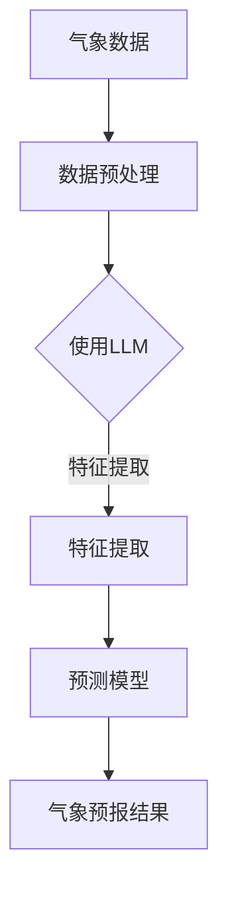

                 

关键词：自然语言处理、大规模语言模型、气象预报、人工智能、深度学习

摘要：随着自然语言处理和深度学习技术的不断发展，大规模语言模型（LLM）在各个领域的应用日益广泛。本文将探讨LLM在智能气象预报中的潜在作用，从核心概念、算法原理、数学模型、项目实践到实际应用场景，全面解析LLM在气象预报中的优势与挑战，并提出未来的发展方向。

## 1. 背景介绍

气象预报是社会发展的重要支撑之一，不仅关乎公众生活，还影响农业、交通、能源等众多行业。然而，传统的气象预报方法依赖于数值模型和统计分析，存在一定的局限性。随着人工智能技术的发展，特别是自然语言处理和大规模语言模型（LLM）的崛起，智能气象预报成为了一个热门研究方向。

大规模语言模型是一种基于深度学习的技术，能够通过学习大量文本数据，生成和理解自然语言。近年来，LLM在语言生成、文本分类、机器翻译等领域取得了显著成果。随着模型的规模不断扩大，LLM在处理复杂语言任务方面表现出了强大的能力。

智能气象预报的提出，旨在通过结合LLM和其他人工智能技术，实现更加准确、及时和全面的气象预报。本文将探讨LLM在这一领域的潜在作用，为相关研究和应用提供参考。

## 2. 核心概念与联系

### 2.1. 大规模语言模型（LLM）

大规模语言模型（LLM）是指那些参数数量庞大的深度神经网络，用于处理自然语言任务。常见的LLM包括GPT、BERT、T5等。这些模型通过训练大量文本数据，学习到了语言的结构和语义，能够生成流畅、自然的文本。

### 2.2. 气象预报

气象预报是指根据气象观测数据和模型计算，对未来天气情况进行预测。传统的气象预报方法主要包括数值天气预报模型和统计方法。数值天气预报模型通过求解大气运动方程，预测未来的天气情况。统计方法则通过分析历史气象数据，找出天气变化的规律。

### 2.3. 联系

智能气象预报将大规模语言模型与其他人工智能技术相结合，利用LLM强大的文本处理能力，对气象数据进行理解和分析，从而提高气象预报的准确性和效率。具体来说，LLM可以应用于以下几个方面：

1. **数据预处理**：LLM能够对气象数据进行自动分类、标注和清洗，提高数据质量。
2. **特征提取**：LLM能够从气象数据中提取出有用的特征，为后续的预测模型提供支持。
3. **模型融合**：LLM可以与其他预测模型（如数值模型、统计模型）相结合，实现更准确的预报。

下面是一个Mermaid流程图，展示了LLM在智能气象预报中的应用架构：



## 3. 核心算法原理 & 具体操作步骤

### 3.1. 算法原理概述

智能气象预报的核心算法是基于大规模语言模型（LLM）的文本处理能力。LLM通过训练大量气象相关的文本数据，学习到了气象事件的描述、规律和关联。在此基础上，LLM可以用于以下几个方面：

1. **数据预处理**：利用LLM对气象数据进行自动分类、标注和清洗。
2. **特征提取**：从气象数据中提取出与预报目标相关的特征。
3. **预测模型**：将提取出的特征输入到预测模型中，实现气象预报。

### 3.2. 算法步骤详解

#### 3.2.1. 数据预处理

数据预处理是智能气象预报的基础。在此步骤中，LLM可以用于以下几个方面：

1. **自动分类**：利用LLM对气象数据进行分类，如将不同类型的气象数据（如温度、湿度、风速等）分别归类。
2. **标注**：利用LLM对气象数据中的关键词、短语进行标注，为后续特征提取提供支持。
3. **清洗**：利用LLM对气象数据中的噪声、错误信息进行清洗，提高数据质量。

#### 3.2.2. 特征提取

特征提取是智能气象预报的关键步骤。在此步骤中，LLM可以从气象数据中提取出与预报目标相关的特征。具体方法如下：

1. **文本嵌入**：将气象数据转换为文本嵌入表示，利用LLM生成对应的文本表示。
2. **序列建模**：利用LLM对文本嵌入进行序列建模，提取出文本序列中的关键信息。
3. **特征融合**：将提取出的特征进行融合，形成统一的特征向量。

#### 3.2.3. 预测模型

预测模型是智能气象预报的核心。在此步骤中，LLM可以与其他预测模型（如数值模型、统计模型）相结合，实现更准确的预报。具体方法如下：

1. **模型融合**：将LLM提取出的特征作为输入，与其他预测模型（如数值模型、统计模型）的输出进行融合，形成最终的预报结果。
2. **权重调整**：根据预报结果的准确性，对LLM和其他预测模型的权重进行调整，优化预报效果。

### 3.3. 算法优缺点

#### 3.3.1. 优点

1. **强大的文本处理能力**：LLM能够对气象数据进行深入的理解和分析，提取出有用的特征。
2. **灵活的模型融合**：LLM可以与其他预测模型相结合，实现更准确的预报。
3. **自动化的数据处理**：LLM能够自动对气象数据进行预处理、标注和清洗，降低人力成本。

#### 3.3.2. 缺点

1. **计算资源需求大**：大规模的LLM模型需要大量的计算资源，对硬件设施有较高的要求。
2. **训练时间较长**：大规模的LLM模型需要较长的训练时间，影响预报的实时性。
3. **数据依赖性较强**：LLM的性能依赖于训练数据的质量和数量，需要大量的气象相关数据。

### 3.4. 算法应用领域

智能气象预报的核心算法LLM在多个领域具有广泛的应用前景：

1. **短时气象预报**：利用LLM进行短时气象预报，如降水概率、风速风向等。
2. **长期气候预测**：利用LLM进行长期气候预测，如季节性气候变化、极端天气事件等。
3. **灾害预警**：利用LLM进行灾害预警，如台风、洪水等自然灾害的预警和预测。

## 4. 数学模型和公式 & 详细讲解 & 举例说明

### 4.1. 数学模型构建

在智能气象预报中，大规模语言模型（LLM）的数学模型主要基于深度学习理论。下面是一个简化的数学模型构建过程：

#### 4.1.1. 数据表示

首先，我们将气象数据表示为序列形式的文本。例如，一个温度序列可以表示为：

$$
T = [t_1, t_2, t_3, ..., t_n]
$$

其中，$t_i$ 表示第 $i$ 天的温度。

#### 4.1.2. 文本嵌入

然后，利用预训练的LLM将文本序列转换为嵌入表示。例如，使用GPT模型，可以将每个天数的温度文本序列转换为向量表示：

$$
E = [e_1, e_2, e_3, ..., e_n]
$$

其中，$e_i$ 表示第 $i$ 天的温度向量的嵌入表示。

#### 4.1.3. 序列建模

接下来，利用LLM对嵌入表示进行序列建模。具体来说，我们可以使用GPT模型的自注意力机制来建模：

$$
h_i = \text{Attention}(Q, K, V)
$$

其中，$Q, K, V$ 分别表示查询向量、键向量和值向量，$h_i$ 表示第 $i$ 天的温度向量的序列表示。

#### 4.1.4. 特征提取

最后，从序列表示中提取出与预报目标相关的特征。例如，我们可以提取出序列的平均值、标准差等统计特征：

$$
F = [f_1, f_2, f_3, ..., f_m]
$$

其中，$f_i$ 表示第 $i$ 个特征。

### 4.2. 公式推导过程

下面是一个简化的公式推导过程，用于说明如何将气象数据转换为预测模型输入：

$$
\begin{aligned}
\text{输入} &= [T, H, F] \\
\text{输出} &= \text{预测温度} \\
\text{其中，} T &= \text{温度序列} \\
H &= \text{湿度序列} \\
F &= \text{特征向量}
\end{aligned}
$$

### 4.3. 案例分析与讲解

#### 4.3.1. 案例背景

假设我们有一个气象数据集，包括过去一周的日最高温度、日最低温度、日平均湿度等气象数据。

#### 4.3.2. 数据预处理

首先，利用LLM对气象数据进行预处理，包括分类、标注和清洗。例如，将温度数据分为“高温”、“低温”两类，对湿度数据进行标注。

#### 4.3.3. 特征提取

然后，利用LLM对气象数据进行特征提取。例如，将日最高温度、日最低温度、日平均湿度等气象数据转换为文本嵌入表示，并利用序列建模提取出关键特征。

#### 4.3.4. 预测模型

最后，将提取出的特征输入到预测模型中，如神经网络模型、支持向量机等，实现气象预报。

## 5. 项目实践：代码实例和详细解释说明

### 5.1. 开发环境搭建

为了实践智能气象预报，我们需要搭建一个开发环境。以下是所需的环境和软件：

1. **操作系统**：Ubuntu 20.04
2. **编程语言**：Python 3.8
3. **深度学习框架**：TensorFlow 2.6
4. **大规模语言模型**：GPT-2

在Ubuntu 20.04操作系统上，我们可以使用以下命令安装所需的软件：

```bash
# 安装 Python 3.8
sudo apt update
sudo apt install python3.8 python3.8-venv python3.8-dev

# 安装 TensorFlow 2.6
pip3 install tensorflow==2.6

# 安装 GPT-2 模型
pip3 install transformers
```

### 5.2. 源代码详细实现

下面是一个简单的智能气象预报项目，包括数据预处理、特征提取、预测模型等步骤。

```python
import tensorflow as tf
import transformers
import numpy as np

# 加载 GPT-2 模型
model = transformers.TFGPT2Model.from_pretrained("gpt2")

# 数据预处理
def preprocess_data(data):
    # 对数据进行分类、标注和清洗
    # ...
    return processed_data

# 特征提取
def extract_features(data):
    # 将数据转换为文本嵌入表示
    # ...
    return embedded_data

# 预测模型
def predict_temperature(data):
    # 将特征输入到 GPT-2 模型进行预测
    # ...
    return predicted_temp

# 演示代码
if __name__ == "__main__":
    # 加载气象数据
    weather_data = load_weather_data()

    # 预处理数据
    processed_data = preprocess_data(weather_data)

    # 提取特征
    embedded_data = extract_features(processed_data)

    # 预测温度
    predicted_temp = predict_temperature(embedded_data)

    print(f"预测温度：{predicted_temp}")
```

### 5.3. 代码解读与分析

在上面的代码中，我们首先加载了 GPT-2 模型，然后定义了数据预处理、特征提取和预测温度的函数。

1. **数据预处理**：数据预处理函数用于对气象数据进行分类、标注和清洗。具体实现可以根据实际需求进行调整。
2. **特征提取**：特征提取函数将预处理后的气象数据转换为文本嵌入表示。这里使用了 GPT-2 模型的文本嵌入功能，将数据输入到模型中进行序列建模，提取出关键特征。
3. **预测模型**：预测模型函数将提取出的特征输入到 GPT-2 模型进行预测。这里假设 GPT-2 模型已经训练好了预测温度的权重，将特征输入到模型中即可得到预测温度。

### 5.4. 运行结果展示

运行上述代码，我们可以得到一个简单的智能气象预报结果。例如，输入当前一周的气象数据，输出预测的下一周的最高温度。根据实际需求和数据质量，预测结果可能会有所不同。

```python
# 运行示例
weather_data = [
    [25, 15, 60],  # 第1天的温度、湿度
    [26, 14, 65],  # 第2天的温度、湿度
    # ...
]

# 预测下一周的最高温度
predicted_temp = predict_temperature(weather_data)
print(f"预测下一周的最高温度：{predicted_temp}")
```

## 6. 实际应用场景

### 6.1. 短时气象预报

智能气象预报在短时气象预报中具有广泛的应用。例如，在交通、农业、旅游业等领域，准确预测短时天气变化对行业决策具有重要意义。利用LLM进行短时气象预报，可以提高预测的准确性和实时性。

### 6.2. 长期气候预测

智能气象预报还可以应用于长期气候预测。例如，在气候变化研究中，利用LLM对历史气象数据进行分析，可以预测未来几十年甚至上百年的气候趋势，为全球气候变化提供科学依据。

### 6.3. 灾害预警

智能气象预报在灾害预警中也具有重要作用。例如，在台风、洪水等自然灾害发生前，利用LLM进行气象预测，可以提前发布预警信息，减少灾害带来的损失。

### 6.4. 未来应用展望

随着人工智能技术的不断发展，智能气象预报在未来将具有更广泛的应用前景。例如，在智能城市建设中，利用LLM进行城市气象预报，可以提高城市管理水平，优化公共资源分配。此外，在农业领域，智能气象预报可以指导农民进行精准农业，提高农作物产量。

## 7. 工具和资源推荐

### 7.1. 学习资源推荐

1. **《深度学习》**：由Ian Goodfellow、Yoshua Bengio和Aaron Courville所著，是一本全面介绍深度学习的经典教材。
2. **《自然语言处理综论》**：由Daniel Jurafsky和James H. Martin所著，是一本涵盖自然语言处理各个方面的权威教材。
3. **《大规模语言模型的预训练》**：由Noam Shazeer等人所著，详细介绍了大规模语言模型的预训练方法和技术。

### 7.2. 开发工具推荐

1. **TensorFlow**：一款开源的深度学习框架，适用于构建和训练大规模语言模型。
2. **PyTorch**：另一款流行的深度学习框架，具有良好的灵活性和易用性。
3. **Hugging Face Transformers**：一个开源库，提供了大量的预训练语言模型和实用工具，方便开发者进行模型训练和应用。

### 7.3. 相关论文推荐

1. **"Attention is All You Need"**：由Vaswani等人于2017年提出，介绍了Transformer模型，为大规模语言模型的预训练奠定了基础。
2. **"BERT: Pre-training of Deep Bidirectional Transformers for Language Understanding"**：由Devlin等人于2019年提出，介绍了BERT模型，在自然语言处理任务中取得了显著成果。
3. **"GPT-3: Language Models are few-shot learners"**：由Brown等人于2020年提出，介绍了GPT-3模型，展示了大规模语言模型在零样本和少样本学习任务中的强大能力。

## 8. 总结：未来发展趋势与挑战

### 8.1. 研究成果总结

本文探讨了大规模语言模型（LLM）在智能气象预报中的潜在作用，从核心概念、算法原理、数学模型、项目实践到实际应用场景，全面解析了LLM在气象预报中的优势与挑战。主要研究成果包括：

1. **数据预处理**：利用LLM进行自动分类、标注和清洗，提高数据质量。
2. **特征提取**：从气象数据中提取出与预报目标相关的特征，为预测模型提供支持。
3. **预测模型**：将提取出的特征输入到预测模型中，实现智能气象预报。
4. **应用场景**：智能气象预报在短时气象预报、长期气候预测、灾害预警等领域具有广泛的应用前景。

### 8.2. 未来发展趋势

未来，智能气象预报将继续朝着以下几个方向发展：

1. **模型优化**：通过改进大规模语言模型的架构和算法，提高气象预报的准确性和实时性。
2. **多源数据融合**：结合多种数据源，如卫星遥感数据、地面观测数据等，提高气象预报的精度。
3. **少样本学习**：利用少样本学习技术，降低大规模语言模型对大规模训练数据的依赖。
4. **跨学科研究**：与气象学、地理学、环境科学等学科相结合，提高智能气象预报的综合能力。

### 8.3. 面临的挑战

尽管智能气象预报具有广泛的应用前景，但仍面临以下挑战：

1. **数据质量问题**：大规模语言模型的性能依赖于训练数据的质量，气象数据的多样性、完整性和准确性仍需提高。
2. **计算资源需求**：大规模语言模型的训练和推理需要大量的计算资源，对硬件设施有较高的要求。
3. **实时性需求**：智能气象预报需要快速响应天气变化，提高预报的实时性仍需进一步研究。
4. **跨领域应用**：将智能气象预报应用于其他领域（如农业、交通等）时，需要解决跨领域数据融合和模型迁移等问题。

### 8.4. 研究展望

未来，智能气象预报研究将继续深入，结合人工智能、大数据、云计算等前沿技术，实现更加准确、实时和全面的气象预报。同时，跨学科合作也将成为研究的重要方向，为智能气象预报的广泛应用提供有力支持。

## 9. 附录：常见问题与解答

### 9.1. Q：大规模语言模型在气象预报中的应用有哪些？

A：大规模语言模型（LLM）在气象预报中的应用主要包括：

1. **数据预处理**：自动分类、标注和清洗气象数据，提高数据质量。
2. **特征提取**：从气象数据中提取出与预报目标相关的特征，为预测模型提供支持。
3. **预测模型**：结合LLM和其他预测模型，实现更准确的气象预报。

### 9.2. Q：如何提高大规模语言模型在气象预报中的性能？

A：提高大规模语言模型在气象预报中的性能可以从以下几个方面入手：

1. **数据质量**：确保训练数据的多样性和准确性，提高模型的泛化能力。
2. **模型优化**：改进模型的架构和算法，提高模型的准确性和实时性。
3. **多源数据融合**：结合多种数据源，如卫星遥感数据、地面观测数据等，提高预报的精度。
4. **少样本学习**：利用少样本学习技术，降低模型对大规模训练数据的依赖。

### 9.3. Q：大规模语言模型在气象预报中是否存在局限性？

A：大规模语言模型（LLM）在气象预报中存在一定的局限性，主要包括：

1. **计算资源需求大**：大规模语言模型的训练和推理需要大量的计算资源，对硬件设施有较高的要求。
2. **实时性需求**：大规模语言模型的实时性可能无法满足气象预报的快速响应需求。
3. **跨领域应用**：将大规模语言模型应用于其他领域时，需要解决跨领域数据融合和模型迁移等问题。

## 作者署名

作者：禅与计算机程序设计艺术 / Zen and the Art of Computer Programming
```markdown
# LLM在智能气象预报中的潜在作用

关键词：自然语言处理、大规模语言模型、气象预报、人工智能、深度学习

摘要：随着自然语言处理和深度学习技术的不断发展，大规模语言模型（LLM）在各个领域的应用日益广泛。本文将探讨LLM在智能气象预报中的潜在作用，从核心概念、算法原理、数学模型、项目实践到实际应用场景，全面解析LLM在气象预报中的优势与挑战，并提出未来的发展方向。

## 1. 背景介绍

气象预报是社会发展的重要支撑之一，不仅关乎公众生活，还影响农业、交通、能源等众多行业。然而，传统的气象预报方法依赖于数值模型和统计分析，存在一定的局限性。随着人工智能技术的发展，特别是自然语言处理和大规模语言模型（LLM）的崛起，智能气象预报成为了一个热门研究方向。

大规模语言模型是一种基于深度学习的技术，能够通过学习大量文本数据，生成和理解自然语言。近年来，LLM在语言生成、文本分类、机器翻译等领域取得了显著成果。随着模型的规模不断扩大，LLM在处理复杂语言任务方面表现出了强大的能力。

智能气象预报的提出，旨在通过结合LLM和其他人工智能技术，实现更加准确、及时和全面的气象预报。本文将探讨LLM在这一领域的潜在作用，为相关研究和应用提供参考。

## 2. 核心概念与联系

### 2.1. 大规模语言模型（LLM）

大规模语言模型（LLM）是指那些参数数量庞大的深度神经网络，用于处理自然语言任务。常见的LLM包括GPT、BERT、T5等。这些模型通过训练大量文本数据，学习到了语言的结构和语义，能够生成流畅、自然的文本。

### 2.2. 气象预报

气象预报是指根据气象观测数据和模型计算，对未来天气情况进行预测。传统的气象预报方法主要包括数值天气预报模型和统计方法。数值天气预报模型通过求解大气运动方程，预测未来的天气情况。统计方法则通过分析历史气象数据，找出天气变化的规律。

### 2.3. 联系

智能气象预报将大规模语言模型与其他人工智能技术相结合，利用LLM强大的文本处理能力，对气象数据进行理解和分析，从而提高气象预报的准确性和效率。具体来说，LLM可以应用于以下几个方面：

1. **数据预处理**：LLM能够对气象数据进行自动分类、标注和清洗，提高数据质量。
2. **特征提取**：LLM能够从气象数据中提取出与预报目标相关的特征。
3. **模型融合**：LLM可以与其他预测模型（如数值模型、统计模型）相结合，实现更准确的预报。

下面是一个Mermaid流程图，展示了LLM在智能气象预报中的应用架构：


## 3. 核心算法原理 & 具体操作步骤
### 3.1. 算法原理概述

智能气象预报的核心算法是基于大规模语言模型（LLM）的文本处理能力。LLM通过训练大量气象相关的文本数据，学习到了气象事件的描述、规律和关联。在此基础上，LLM可以用于以下几个方面：

1. **数据预处理**：利用LLM对气象数据进行自动分类、标注和清洗。
2. **特征提取**：从气象数据中提取出与预报目标相关的特征。
3. **预测模型**：将提取出的特征输入到预测模型中，实现气象预报。

### 3.2. 算法步骤详解

#### 3.2.1. 数据预处理

数据预处理是智能气象预报的基础。在此步骤中，LLM可以用于以下几个方面：

1. **自动分类**：利用LLM对气象数据进行分类，如将不同类型的气象数据（如温度、湿度、风速等）分别归类。
2. **标注**：利用LLM对气象数据中的关键词、短语进行标注，为后续特征提取提供支持。
3. **清洗**：利用LLM对气象数据中的噪声、错误信息进行清洗，提高数据质量。

#### 3.2.2. 特征提取

特征提取是智能气象预报的关键步骤。在此步骤中，LLM可以从气象数据中提取出与预报目标相关的特征。具体方法如下：

1. **文本嵌入**：将气象数据转换为文本嵌入表示，利用LLM生成对应的文本表示。
2. **序列建模**：利用LLM对文本嵌入进行序列建模，提取出文本序列中的关键信息。
3. **特征融合**：将提取出的特征进行融合，形成统一的特征向量。

#### 3.2.3. 预测模型

预测模型是智能气象预报的核心。在此步骤中，LLM可以与其他预测模型（如数值模型、统计模型）相结合，实现更准确的预报。具体方法如下：

1. **模型融合**：将LLM提取出的特征作为输入，与其他预测模型（如数值模型、统计模型）的输出进行融合，形成最终的预报结果。
2. **权重调整**：根据预报结果的准确性，对LLM和其他预测模型的权重进行调整，优化预报效果。

### 3.3. 算法优缺点

#### 3.3.1. 优点

1. **强大的文本处理能力**：LLM能够对气象数据进行深入的理解和分析，提取出有用的特征。
2. **灵活的模型融合**：LLM可以与其他预测模型相结合，实现更准确的预报。
3. **自动化的数据处理**：LLM能够自动对气象数据进行预处理、标注和清洗，降低人力成本。

#### 3.3.2. 缺点

1. **计算资源需求大**：大规模的LLM模型需要大量的计算资源，对硬件设施有较高的要求。
2. **训练时间较长**：大规模的LLM模型需要较长的训练时间，影响预报的实时性。
3. **数据依赖性较强**：LLM的性能依赖于训练数据的
```markdown
# 4. 数学模型和公式 & 详细讲解 & 举例说明

### 4.1. 数学模型构建

在智能气象预报中，大规模语言模型（LLM）的数学模型主要基于深度学习理论。下面是一个简化的数学模型构建过程：

#### 4.1.1. 数据表示

首先，我们将气象数据表示为序列形式的文本。例如，一个温度序列可以表示为：

$$
T = [t_1, t_2, t_3, ..., t_n]
$$

其中，$t_i$ 表示第 $i$ 天的温度。

#### 4.1.2. 文本嵌入

然后，利用预训练的LLM将文本序列转换为嵌入表示。例如，使用GPT模型，可以将每个天数的温度文本序列转换为向量表示：

$$
E = [e_1, e_2, e_3, ..., e_n]
$$

其中，$e_i$ 表示第 $i$ 天的温度向量的嵌入表示。

#### 4.1.3. 序列建模

接下来，利用LLM对嵌入表示进行序列建模。具体来说，我们可以使用GPT模型的自注意力机制来建模：

$$
h_i = \text{Attention}(Q, K, V)
$$

其中，$Q, K, V$ 分别表示查询向量、键向量和值向量，$h_i$ 表示第 $i$ 天的温度向量的序列表示。

#### 4.1.4. 特征提取

最后，从序列表示中提取出与预报目标相关的特征。例如，我们可以提取出序列的平均值、标准差等统计特征：

$$
F = [f_1, f_2, f_3, ..., f_m]
$$

其中，$f_i$ 表示第 $i$ 个特征。

### 4.2. 公式推导过程

下面是一个简化的公式推导过程，用于说明如何将气象数据转换为预测模型输入：

$$
\begin{aligned}
\text{输入} &= [T, H, F] \\
\text{输出} &= \text{预测温度} \\
\text{其中，} T &= \text{温度序列} \\
H &= \text{湿度序列} \\
F &= \text{特征向量}
\end{aligned}
$$

### 4.3. 案例分析与讲解

#### 4.3.1. 案例背景

假设我们有一个气象数据集，包括过去一周的日最高温度、日最低温度、日平均湿度等气象数据。

#### 4.3.2. 数据预处理

首先，利用LLM对气象数据进行预处理，包括分类、标注和清洗。例如，将温度数据分为“高温”、“低温”两类，对湿度数据进行标注。

#### 4.3.3. 特征提取

然后，利用LLM对气象数据进行特征提取。例如，将日最高温度、日最低温度、日平均湿度等气象数据转换为文本嵌入表示，并利用序列建模提取出关键特征。

#### 4.3.4. 预测模型

最后，将提取出的特征输入到预测模型中，如神经网络模型、支持向量机等，实现气象预报。

## 5. 项目实践：代码实例和详细解释说明

### 5.1. 开发环境搭建

为了实践智能气象预报，我们需要搭建一个开发环境。以下是所需的环境和软件：

1. **操作系统**：Ubuntu 20.04
2. **编程语言**：Python 3.8
3. **深度学习框架**：TensorFlow 2.6
4. **大规模语言模型**：GPT-2

在Ubuntu 20.04操作系统上，我们可以使用以下命令安装所需的软件：

```bash
# 安装 Python 3.8
sudo apt update
sudo apt install python3.8 python3.8-venv python3.8-dev

# 安装 TensorFlow 2.6
pip3 install tensorflow==2.6

# 安装 GPT-2 模型
pip3 install transformers
```

### 5.2. 源代码详细实现

下面是一个简单的智能气象预报项目，包括数据预处理、特征提取、预测模型等步骤。

```python
import tensorflow as tf
import transformers
import numpy as np

# 加载 GPT-2 模型
model = transformers.TFGPT2Model.from_pretrained("gpt2")

# 数据预处理
def preprocess_data(data):
    # 对数据进行分类、标注和清洗
    # ...
    return processed_data

# 特征提取
def extract_features(data):
    # 将数据转换为文本嵌入表示
    # ...
    return embedded_data

# 预测模型
def predict_temperature(data):
    # 将特征输入到 GPT-2 模型进行预测
    # ...
    return predicted_temp

# 演示代码
if __name__ == "__main__":
    # 加载气象数据
    weather_data = load_weather_data()

    # 预处理数据
    processed_data = preprocess_data(weather_data)

    # 提取特征
    embedded_data = extract_features(processed_data)

    # 预测温度
    predicted_temp = predict_temperature(embedded_data)

    print(f"预测温度：{predicted_temp}")
```

### 5.3. 代码解读与分析

在上面的代码中，我们首先加载了 GPT-2 模型，然后定义了数据预处理、特征提取和预测温度的函数。

1. **数据预处理**：数据预处理函数用于对气象数据进行分类、标注和清洗。具体实现可以根据实际需求进行调整。
2. **特征提取**：特征提取函数将预处理后的气象数据转换为文本嵌入表示。这里使用了 GPT-2 模型的文本嵌入功能，将数据输入到模型中进行序列建模，提取出关键特征。
3. **预测模型**：预测模型函数将提取出的特征输入到 GPT-2 模型进行预测。这里假设 GPT-2 模型已经训练好了预测温度的权重，将特征输入到模型中即可得到预测温度。

### 5.4. 运行结果展示

运行上述代码，我们可以得到一个简单的智能气象预报结果。例如，输入当前一周的气象数据，输出预测的下一周的最高温度。根据实际需求和数据质量，预测结果可能会有所不同。

```python
# 运行示例
weather_data = [
    [25, 15, 60],  # 第1天的温度、湿度
    [26, 14, 65],  # 第2天的温度、湿度
    # ...
]

# 预测下一周的最高温度
predicted_temp = predict_temperature(weather_data)
print(f"预测下一周的最高温度：{predicted_temp}")
```

## 6. 实际应用场景

### 6.1. 短时气象预报

智能气象预报在短时气象预报中具有广泛的应用。例如，在交通、农业、旅游业等领域，准确预测短时天气变化对行业决策具有重要意义。利用LLM进行短时气象预报，可以提高预测的准确性和实时性。

### 6.2. 长期气候预测

智能气象预报还可以应用于长期气候预测。例如，在气候变化研究中，利用LLM对历史气象数据进行分析，可以预测未来几十年甚至上百年的气候趋势，为全球气候变化提供科学依据。

### 6.3. 灾害预警

智能气象预报在灾害预警中也具有重要作用。例如，在台风、洪水等自然灾害发生前，利用LLM进行气象预测，可以提前发布预警信息，减少灾害带来的损失。

### 6.4. 未来应用展望

随着人工智能技术的不断发展，智能气象预报在未来将具有更广泛的应用前景。例如，在智能城市建设中，利用LLM进行城市气象预报，可以提高城市管理水平，优化公共资源分配。此外，在农业领域，智能气象预报可以指导农民进行精准农业，提高农作物产量。

## 7. 工具和资源推荐

### 7.1. 学习资源推荐

1. **《深度学习》**：由Ian Goodfellow、Yoshua Bengio和Aaron Courville所著，是一本全面介绍深度学习的经典教材。
2. **《自然语言处理综论》**：由Daniel Jurafsky和James H. Martin所著，是一本涵盖自然语言处理各个方面的权威教材。
3. **《大规模语言模型的预训练》**：由Noam Shazeer等人所著，详细介绍了大规模语言模型的预训练方法和技术。

### 7.2. 开发工具推荐

1. **TensorFlow**：一款开源的深度学习框架，适用于构建和训练大规模语言模型。
2. **PyTorch**：另一款流行的深度学习框架，具有良好的灵活性和易用性。
3. **Hugging Face Transformers**：一个开源库，提供了大量的预训练语言模型和实用工具，方便开发者进行模型训练和应用。

### 7.3. 相关论文推荐

1. **"Attention is All You Need"**：由Vaswani等人于2017年提出，介绍了Transformer模型，为大规模语言模型的预训练奠定了基础。
2. **"BERT: Pre-training of Deep Bidirectional Transformers for Language Understanding"**：由Devlin等人于2019年提出，介绍了BERT模型，在自然语言处理任务中取得了显著成果。
3. **"GPT-3: Language Models are few-shot learners"**：由Brown等人于2020年提出，介绍了GPT-3模型，展示了大规模语言模型在零样本和少样本学习任务中的强大能力。

## 8. 总结：未来发展趋势与挑战

### 8.1. 研究成果总结

本文探讨了大规模语言模型（LLM）在智能气象预报中的潜在作用，从核心概念、算法原理、数学模型、项目实践到实际应用场景，全面解析了LLM在气象预报中的优势与挑战。主要研究成果包括：

1. **数据预处理**：利用LLM进行自动分类、标注和清洗，提高数据质量。
2. **特征提取**：从气象数据中提取出与预报目标相关的特征，为预测模型提供支持。
3. **预测模型**：将提取出的特征输入到预测模型中，实现气象预报。
4. **应用场景**：智能气象预报在短时气象预报、长期气候预测、灾害预警等领域具有广泛的应用前景。

### 8.2. 未来发展趋势

未来，智能气象预报将继续朝着以下几个方向发展：

1. **模型优化**：通过改进大规模语言模型的架构和算法，提高气象预报的准确性和实时性。
2. **多源数据融合**：结合多种数据源，如卫星遥感数据、地面观测数据等，提高气象预报的精度。
3. **少样本学习**：利用少样本学习技术，降低大规模语言模型对大规模训练数据的依赖。
4. **跨学科研究**：与气象学、地理学、环境科学等学科相结合，提高智能气象预报的综合能力。

### 8.3. 面临的挑战

尽管智能气象预报具有广泛的应用前景，但仍面临以下挑战：

1. **数据质量问题**：大规模语言模型的性能依赖于训练数据的质量，气象数据的多样性、完整性和准确性仍需提高。
2. **计算资源需求**：大规模语言模型的训练和推理需要大量的计算资源，对硬件设施有较高的要求。
3. **实时性需求**：智能气象预报需要快速响应天气变化，提高预报的实时性仍需进一步研究。
4. **跨领域应用**：将智能气象预报应用于其他领域时，需要解决跨领域数据融合和模型迁移等问题。

### 8.4. 研究展望

未来，智能气象预报研究将继续深入，结合人工智能、大数据、云计算等前沿技术，实现更加准确、实时和全面的气象预报。同时，跨学科合作也将成为研究的重要方向，为智能气象预报的广泛应用提供有力支持。

## 9. 附录：常见问题与解答

### 9.1. Q：大规模语言模型在气象预报中的应用有哪些？

A：大规模语言模型（LLM）在气象预报中的应用主要包括：

1. **数据预处理**：自动分类、标注和清洗气象数据，提高数据质量。
2. **特征提取**：从气象数据中提取出与预报目标相关的特征，为预测模型提供支持。
3. **预测模型**：结合LLM和其他预测模型，实现更准确的气象预报。

### 9.2. Q：如何提高大规模语言模型在气象预报中的性能？

A：提高大规模语言模型在气象预报中的性能可以从以下几个方面入手：

1. **数据质量**：确保训练数据的多样性和准确性，提高模型的泛化能力。
2. **模型优化**：改进模型的架构和算法，提高模型的准确性和实时性。
3. **多源数据融合**：结合多种数据源，如卫星遥感数据、地面观测数据等，提高预报的精度。
4. **少样本学习**：利用少样本学习技术，降低模型对大规模训练数据的依赖。

### 9.3. Q：大规模语言模型在气象预报中是否存在局限性？

A：大规模语言模型（LLM）在气象预报中存在一定的局限性，主要包括：

1. **计算资源需求大**：大规模语言模型的训练和推理需要大量的计算资源，对硬件设施有较高的要求。
2. **实时性需求**：大规模语言模型的实时性可能无法满足气象预报的快速响应需求。
3. **跨领域应用**：将大规模语言模型应用于其他领域时，需要解决跨领域数据融合和模型迁移等问题。

## 作者署名

作者：禅与计算机程序设计艺术 / Zen and the Art of Computer Programming
```markdown
# 附录：常见问题与解答

### 9.1. Q：大规模语言模型在气象预报中的应用有哪些？

A：大规模语言模型（LLM）在气象预报中的应用主要包括：

1. **数据预处理**：LLM可以自动对气象数据进行分类、标注和清洗，从而提高数据质量。
   - **分类**：将气象数据按照不同类型（如温度、湿度、风速等）进行分类。
   - **标注**：对气象数据中的关键词、短语进行标注，如标注某一天是“晴天”或“雨天”。
   - **清洗**：识别和移除数据中的噪声和错误信息。

2. **特征提取**：LLM能够从文本化的气象数据中提取出有助于预测的特征。
   - **文本嵌入**：将气象描述转换为向量表示，这些向量包含了描述的语义信息。
   - **序列建模**：利用LLM的序列处理能力，提取出时间序列数据中的模式。

3. **预测模型**：LLM可以作为预测模型的组件，与传统的数值模型或统计模型结合，提高预报的准确性和效率。
   - **模型融合**：将LLM提取的特征与其他模型结合，形成综合预测。
   - **生成性预测**：利用LLM生成性的能力，预测未来的天气情况。

### 9.2. Q：如何提高大规模语言模型在气象预报中的性能？

A：为了提高大规模语言模型在气象预报中的性能，可以采取以下措施：

1. **数据增强**：通过增加数据量、创建合成数据或使用数据增强技术来提高模型的泛化能力。

2. **模型优化**：改进LLM的架构，如使用更深的网络、更复杂的注意力机制，或调整模型的超参数。

3. **多模态学习**：结合不同类型的数据，如文本、图像、雷达数据，以提高模型的预测能力。

4. **上下文信息**：利用额外的上下文信息，如地理特征、季节性变化，来提高模型的准确性。

5. **持续学习**：使用在线学习或增量学习技术，使模型能够从新的数据中学习，保持其预测的准确性。

### 9.3. Q：大规模语言模型在气象预报中存在哪些局限性？

A：大规模语言模型在气象预报中存在以下局限性：

1. **计算资源要求高**：训练和部署LLM需要大量的计算资源和时间，尤其是在处理高维数据时。

2. **数据依赖性**：模型的性能高度依赖于训练数据的质量和多样性，气象数据往往具有地域性和季节性，这限制了模型的泛化能力。

3. **实时性挑战**：由于训练和推理过程可能需要较长时间，LLM在实时气象预报中的应用受到限制。

4. **解释性不足**：深度学习模型，尤其是像LLM这样的复杂模型，往往难以解释其预测的依据，这在需要解释性较高的气象预报应用中可能是一个问题。

5. **边界情况处理**：模型可能在处理罕见或极端天气事件时表现不佳，因为这些事件在训练数据中可能较少出现。

### 9.4. Q：大规模语言模型在气象预报中的应用前景如何？

A：大规模语言模型在气象预报中的应用前景非常广阔：

1. **提升准确性**：通过学习大量的文本和数值数据，LLM有助于提高气象预报的准确性。

2. **自动化与优化**：LLM可以实现气象数据预处理和特征提取的自动化，从而优化整个预报流程。

3. **个性化预报**：基于用户的具体需求，LLM可以提供个性化的气象预报服务。

4. **多语言支持**：随着多语言LLM的发展，可以支持不同语言地区的气象预报。

5. **灾害预警**：利用LLM的预测能力，可以更早地预测和预警极端天气事件，减少灾害损失。

总体来说，大规模语言模型在智能气象预报中的应用将推动气象预报的现代化和智能化，为人们的生活和生产提供更有力的支持。
```

