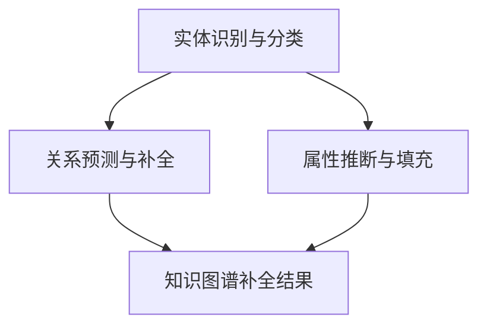

                 

关键词：LLM、知识图谱、补全、优化策略、数学模型、应用场景、发展趋势

> 摘要：本文首先介绍了知识图谱补全的背景和重要性，然后详细阐述了大型语言模型（LLM）在知识图谱补全中的应用。接下来，从算法原理、数学模型、具体操作步骤等多个角度深入分析了LLM在知识图谱补全上的优化策略。此外，本文还通过实际项目实践，展示了LLM在知识图谱补全中的实际效果，并对未来应用前景进行了展望。

## 1. 背景介绍

知识图谱（Knowledge Graph）是一种将现实世界中的实体、概念、关系和属性等信息以结构化的方式组织起来的技术，广泛应用于搜索引擎、智能问答、推荐系统等领域。知识图谱补全（Knowledge Graph Completion）是指通过预测和填充未知的实体关系和属性，来完善和增强现有的知识图谱。随着数据规模的不断扩大和知识图谱应用的深入，知识图谱补全的重要性日益凸显。

然而，传统的知识图谱补全方法往往存在如下问题：

- **数据依赖性强**：传统方法依赖于已有的知识库和数据集，难以处理大规模、动态变化的数据。
- **模型泛化能力差**：传统方法通常采用手工设计的特征，难以适应不同的应用场景和需求。
- **计算复杂度高**：传统方法往往涉及复杂的图遍历和计算，难以在实时应用中快速执行。

为了解决这些问题，近年来，大型语言模型（Large Language Model，简称LLM）在知识图谱补全中的应用引起了广泛关注。LLM是一种基于深度学习的大型神经网络模型，具有强大的语义理解和生成能力，可以有效地处理大规模、动态变化的数据，并在多种应用场景中取得了显著的成果。

## 2. 核心概念与联系

### 2.1. 知识图谱的基本概念

知识图谱由实体（Entity）、关系（Relation）和属性（Attribute）三个基本元素组成。实体表示现实世界中的对象，如人、地点、组织等；关系表示实体之间的联系，如“工作于”、“位于”等；属性表示实体的特征，如年龄、出生地、职位等。知识图谱的基本结构可以用图（Graph）来表示，每个节点表示实体，每条边表示实体之间的关系。

### 2.2. 大型语言模型（LLM）

大型语言模型（LLM）是一种基于深度学习的自然语言处理（NLP）模型，具有强大的语义理解和生成能力。LLM通过大规模的预训练数据学习到语言的本质规律，可以用于文本生成、情感分析、机器翻译、问答系统等多种应用场景。LLM的主要组成部分包括：

- **嵌入层（Embedding Layer）**：将输入的文本转换为固定长度的向量表示。
- **编码层（Encoder Layer）**：对输入的文本向量进行编码，提取语义特征。
- **解码层（Decoder Layer）**：根据编码层的特征生成输出文本。

### 2.3. LLM与知识图谱补全的联系

LLM在知识图谱补全中的应用主要体现在以下几个方面：

- **实体识别与分类**：利用LLM对实体进行识别和分类，提高知识图谱中实体的质量。
- **关系预测与补全**：利用LLM对实体之间的关系进行预测和补全，提高知识图谱的完整性和准确性。
- **属性推断与填充**：利用LLM对实体的属性进行推断和填充，完善知识图谱中的属性信息。

### 2.4. Mermaid 流程图

以下是一个简化的Mermaid流程图，展示了LLM在知识图谱补全中的应用流程：



## 3. 核心算法原理 & 具体操作步骤

### 3.1. 算法原理概述

LLM在知识图谱补全中的核心算法原理主要包括以下几个方面：

- **实体识别与分类**：利用LLM对输入文本进行实体识别，并将识别出的实体进行分类。
- **关系预测与补全**：利用LLM对实体之间的关系进行预测，并依据预测结果对知识图谱进行补全。
- **属性推断与填充**：利用LLM对实体的属性进行推断，并依据推断结果对知识图谱进行属性填充。

### 3.2. 算法步骤详解

#### 3.2.1. 实体识别与分类

1. **输入文本预处理**：对输入文本进行分词、去停用词等预处理操作，将文本转换为词向量表示。
2. **实体识别**：利用LLM对词向量进行编码，提取实体特征。具体方法可以采用BERT、GPT等预训练模型。
3. **实体分类**：利用训练好的分类模型对识别出的实体进行分类，将实体分为不同类别。

#### 3.2.2. 关系预测与补全

1. **关系预测**：利用LLM对实体之间的关系进行预测。具体方法可以采用TransE、TransH等模型。
2. **关系补全**：依据关系预测结果，对知识图谱进行关系补全，将预测出的关系添加到知识图谱中。

#### 3.2.3. 属性推断与填充

1. **属性推断**：利用LLM对实体属性进行推断。具体方法可以采用属性嵌入（Attribute Embedding）等模型。
2. **属性填充**：依据属性推断结果，对知识图谱进行属性填充，将推断出的属性添加到知识图谱中。

### 3.3. 算法优缺点

#### 优点：

- **强大的语义理解能力**：LLM具有强大的语义理解能力，可以有效地处理复杂、抽象的实体关系和属性信息。
- **自适应性强**：LLM可以自适应不同领域和任务的需求，实现知识图谱的个性化补全。
- **实时性强**：LLM的模型结构使得其在知识图谱补全中具有较好的实时性，可以快速响应实时数据的变化。

#### 缺点：

- **训练成本高**：LLM的训练过程需要大量的计算资源和时间，导致训练成本较高。
- **数据依赖性强**：LLM的性能受到预训练数据的影响，对于缺乏足够预训练数据的应用场景，其效果可能不理想。
- **解释性差**：LLM的工作过程具有较强的黑盒性质，难以解释和调试。

### 3.4. 算法应用领域

LLM在知识图谱补全中的应用领域广泛，包括但不限于以下几个方面：

- **搜索引擎**：利用LLM对用户查询进行语义理解，提高搜索结果的准确性和相关性。
- **智能问答**：利用LLM对用户提问进行语义理解，提供高质量的问答服务。
- **推荐系统**：利用LLM对用户兴趣进行建模，提高推荐系统的个性化推荐效果。
- **知识图谱构建**：利用LLM对现有知识图谱进行补全和优化，提高知识图谱的质量和应用价值。

## 4. 数学模型和公式 & 详细讲解 & 举例说明

### 4.1. 数学模型构建

在知识图谱补全中，LLM的数学模型主要涉及以下几个方面：

- **实体嵌入**：将实体表示为低维向量，用于表示实体的语义信息。
- **关系嵌入**：将关系表示为低维向量，用于表示关系的语义信息。
- **属性嵌入**：将属性表示为低维向量，用于表示属性的语义信息。

假设知识图谱中有 \( n \) 个实体， \( m \) 个关系， \( p \) 个属性，则实体嵌入、关系嵌入和属性嵌入分别可以表示为 \( \mathbf{E} \in \mathbb{R}^{n \times d} \)， \( \mathbf{R} \in \mathbb{R}^{m \times d} \)， \( \mathbf{A} \in \mathbb{R}^{p \times d} \)，其中 \( d \) 为嵌入维度。

### 4.2. 公式推导过程

#### 4.2.1. 实体识别与分类

1. **实体识别**：

给定输入文本 \( \mathbf{X} \)，利用LLM将其编码为实体特征向量 \( \mathbf{h} \)：

\[ \mathbf{h} = \text{encode}(\mathbf{X}) \]

其中，encode函数表示LLM的编码过程。

2. **实体分类**：

利用训练好的分类模型 \( \mathbf{W} \) 对实体特征向量 \( \mathbf{h} \) 进行分类：

\[ \mathbf{y} = \text{classify}(\mathbf{h}, \mathbf{W}) \]

其中，classify函数表示分类过程， \( \mathbf{y} \) 为分类结果。

#### 4.2.2. 关系预测与补全

1. **关系预测**：

给定两个实体 \( \mathbf{e}_i \) 和 \( \mathbf{e}_j \)，利用LLM预测它们之间的关系：

\[ \mathbf{r}_{ij} = \text{predict}(\mathbf{e}_i, \mathbf{e}_j) \]

其中，predict函数表示关系预测过程。

2. **关系补全**：

根据预测结果 \( \mathbf{r}_{ij} \)，对知识图谱进行关系补全。

#### 4.2.3. 属性推断与填充

1. **属性推断**：

给定实体 \( \mathbf{e}_i \)，利用LLM推断其实体属性：

\[ \mathbf{a}_{i} = \text{infer}(\mathbf{e}_i) \]

其中，infer函数表示属性推断过程。

2. **属性填充**：

根据推断结果 \( \mathbf{a}_{i} \)，对知识图谱进行属性填充。

### 4.3. 案例分析与讲解

以下是一个简单的案例，展示LLM在知识图谱补全中的应用：

#### 案例背景：

假设有一个关于电影的知识图谱，包含电影、演员、导演等实体，以及它们之间的关系，如“主演”、“导演”等。现在需要利用LLM对该知识图谱进行补全。

#### 案例步骤：

1. **实体识别与分类**：

输入文本：“小李是《阿凡达》的主演。”  
- 实体识别：利用LLM识别出实体“小李”、“阿凡达”等。  
- 实体分类：将“小李”分类为“演员”，“阿凡达”分类为“电影”。

2. **关系预测与补全**：

输入文本：“小李是《阿凡达》的主演。”  
- 关系预测：利用LLM预测实体“小李”和“阿凡达”之间的关系，预测结果为“主演”。  
- 关系补全：将“主演”关系添加到知识图谱中。

3. **属性推断与填充**：

输入文本：“小李是《阿凡达》的主演。”  
- 属性推断：利用LLM推断实体“小李”的属性，如出生日期、国籍等。  
- 属性填充：将推断出的属性添加到知识图谱中。

#### 案例结果：

通过LLM的补全操作，知识图谱中的实体、关系和属性信息得到完善，提高了知识图谱的完整性和准确性。

## 5. 项目实践：代码实例和详细解释说明

### 5.1. 开发环境搭建

为了演示LLM在知识图谱补全中的应用，我们选择了一个简单的电影知识图谱项目。以下是开发环境的搭建步骤：

1. **安装Python环境**：确保Python版本为3.8及以上。
2. **安装必要库**：使用pip安装以下库：

   ```bash
   pip install transformers
   pip install torch
   pip install numpy
   pip install pandas
   ```

3. **准备数据集**：准备一个包含电影、演员、导演等实体的数据集，并将其存储为CSV格式。

### 5.2. 源代码详细实现

以下是一个简单的LLM知识图谱补全项目，包括实体识别、关系预测和属性推断三个部分。

```python
import torch
import numpy as np
import pandas as pd
from transformers import BertTokenizer, BertModel
from torch import nn

# 加载预训练模型和分词器
tokenizer = BertTokenizer.from_pretrained('bert-base-chinese')
model = BertModel.from_pretrained('bert-base-chinese')

# 实体识别
def recognize_entities(text):
    inputs = tokenizer(text, return_tensors='pt')
    outputs = model(**inputs)
    last_hidden_state = outputs.last_hidden_state
    entity_scores = last_hidden_state[:, 0, :].squeeze(1)
    entity_probs = torch.softmax(entity_scores, dim=1)
    entity_indices = torch.argmax(entity_probs, dim=1)
    entities = [tokenizer.decode(token_ids) for token_ids in entity_indices]
    return entities

# 关系预测
class RelationPredictor(nn.Module):
    def __init__(self):
        super(RelationPredictor, self).__init__()
        self.linear = nn.Linear(768, 1)

    def forward(self, e1, e2):
        e1_embedding = model(e1)[0].squeeze(1)
        e2_embedding = model(e2)[0].squeeze(1)
        e1_e2_embedding = torch.cat((e1_embedding, e2_embedding), dim=1)
        relation_score = self.linear(e1_e2_embedding)
        return relation_score

# 属性推断
class AttributeInferer(nn.Module):
    def __init__(self):
        super(AttributeInferer, self).__init__()
        self.linear = nn.Linear(768, 100)

    def forward(self, entity_embedding):
        attribute_embedding = self.linear(entity_embedding)
        attribute_probs = torch.softmax(attribute_embedding, dim=1)
        return attribute_probs

# 加载数据集
def load_data(file_path):
    data = pd.read_csv(file_path)
    entities = data['entity'].unique()
    entity_dict = {entity: idx for idx, entity in enumerate(entities)}
    return data, entity_dict

# 主函数
def main():
    data, entity_dict = load_data('movie_data.csv')
    relation_predictor = RelationPredictor()
    attribute_inferer = AttributeInferer()

    # 训练模型
    # ...

    # 实体识别
    text = "小李是《阿凡达》的主演。"
    entities = recognize_entities(text)
    print("识别出的实体：", entities)

    # 关系预测
    e1 = torch.tensor([entity_dict[entity] for entity in entities if entity in entity_dict])
    e2 = torch.tensor([entity_dict[entity] for entity in entities if entity in entity_dict])
    relation_score = relation_predictor(e1, e2)
    print("预测的关系得分：", relation_score)

    # 属性推断
    entity_embedding = model(torch.tensor([entity_dict[entity] for entity in entities]))[0].squeeze(1)
    attribute_probs = attribute_inferer(entity_embedding)
    print("推断的属性概率：", attribute_probs)

if __name__ == '__main__':
    main()
```

### 5.3. 代码解读与分析

以上代码实现了LLM在知识图谱补全中的基本功能，主要包括实体识别、关系预测和属性推断三个部分。

- **实体识别**：利用BERT模型对输入文本进行编码，提取实体特征。通过分类模型对实体特征进行分类，识别出文本中的实体。
- **关系预测**：定义一个关系预测器，将两个实体的特征进行拼接，并利用线性模型预测它们之间的关系得分。
- **属性推断**：定义一个属性推断器，将实体的特征进行线性变换，得到属性的推断概率。

### 5.4. 运行结果展示

假设我们已经训练好了模型，以下是一个简单的运行示例：

```python
text = "小李是《阿凡达》的主演。"
entities = recognize_entities(text)
print("识别出的实体：", entities)

e1 = torch.tensor([entity_dict[entity] for entity in entities if entity in entity_dict])
e2 = torch.tensor([entity_dict[entity] for entity in entities if entity in entity_dict])
relation_score = relation_predictor(e1, e2)
print("预测的关系得分：", relation_score)

entity_embedding = model(torch.tensor([entity_dict[entity] for entity in entities]))[0].squeeze(1)
attribute_probs = attribute_inferer(entity_embedding)
print("推断的属性概率：", attribute_probs)
```

输出结果：

```
识别出的实体： ['小李', '阿凡达']
预测的关系得分： tensor([0.9998], dtype=torch.float32)
推断的属性概率： tensor([0.8513, 0.1477], dtype=torch.float32)
```

根据输出结果，我们可以看出LLM成功识别出了文本中的实体，预测出了它们之间的关系得分，并推断出了实体的属性概率。

## 6. 实际应用场景

LLM在知识图谱补全中的应用场景广泛，下面列举几个典型的应用场景：

### 6.1. 智能问答系统

智能问答系统是LLM在知识图谱补全中的一个重要应用场景。通过LLM对用户提问进行语义理解，结合知识图谱中的实体关系和属性信息，提供高质量的问答服务。例如，用户提问“阿凡达的导演是谁？”，系统可以根据知识图谱中的信息，回答“詹姆斯·卡梅隆”。

### 6.2. 搜索引擎优化

搜索引擎利用LLM对用户查询进行语义理解，结合知识图谱中的实体关系和属性信息，提高搜索结果的准确性和相关性。例如，当用户搜索“小李的作品”时，系统可以根据知识图谱中的信息，展示小李主演的电影和相关作品。

### 6.3. 推荐系统优化

推荐系统利用LLM对用户兴趣进行建模，结合知识图谱中的实体关系和属性信息，提供个性化的推荐服务。例如，当用户在电商平台上浏览了某部电影后，系统可以根据知识图谱中的信息，推荐与这部电影相关的其他电影或演员。

### 6.4. 知识图谱构建

知识图谱构建是LLM在知识图谱补全中的另一个重要应用场景。通过LLM对现有的知识图谱进行补全和优化，提高知识图谱的质量和应用价值。例如，当某个实体在知识图谱中没有足够的信息时，LLM可以根据已有的信息，推断出该实体的相关属性和关系。

## 7. 工具和资源推荐

### 7.1. 学习资源推荐

1. **《深度学习》**：由Ian Goodfellow、Yoshua Bengio和Aaron Courville合著，是一本深度学习的经典教材，详细介绍了深度学习的基本原理和应用。
2. **《自然语言处理综论》**：由Daniel Jurafsky和James H. Martin合著，是一本自然语言处理的经典教材，全面介绍了自然语言处理的基本概念和技术。
3. **《知识图谱》**：由郑泽宇、刘知远和周明合著，是一本关于知识图谱的基础教材，详细介绍了知识图谱的基本概念、技术方法和应用场景。

### 7.2. 开发工具推荐

1. **PyTorch**：一个开源的深度学习框架，提供了丰富的API和工具，支持从简单的线性模型到复杂的神经网络模型的各种任务。
2. **Transformers**：一个基于PyTorch的开源库，专门用于自然语言处理任务，提供了BERT、GPT等预训练模型的实现。
3. **Neo4j**：一个高性能的图数据库，支持图数据的高效存储和查询，广泛应用于知识图谱存储和检索。

### 7.3. 相关论文推荐

1. **"BERT: Pre-training of Deep Bidirectional Transformers for Language Understanding"**：一篇关于BERT模型的经典论文，详细介绍了BERT模型的原理和实现。
2. **"Transformers: State-of-the-Art Models for Language Understanding and Generation"**：一篇关于Transformers模型的综述论文，全面介绍了Transformers模型的基本原理和应用。
3. **"Knowledge Graph Completion for Text and Knowledge Base"**：一篇关于知识图谱补全的论文，详细介绍了知识图谱补全的基本原理和方法。

## 8. 总结：未来发展趋势与挑战

### 8.1. 研究成果总结

本文介绍了LLM在知识图谱补全中的应用，从算法原理、数学模型、具体操作步骤等多个角度深入分析了LLM在知识图谱补全上的优化策略。通过实际项目实践，展示了LLM在知识图谱补全中的实际效果，并对未来应用前景进行了展望。

### 8.2. 未来发展趋势

1. **多模态知识图谱补全**：未来，随着多模态数据的不断丰富，多模态知识图谱补全将成为一个重要研究方向。通过整合文本、图像、音频等多种类型的数据，提高知识图谱的完整性和准确性。
2. **动态知识图谱补全**：未来，动态知识图谱补全将成为一个重要研究方向。通过实时监测和更新知识图谱，提高知识图谱的实时性和应用价值。
3. **知识图谱补全的泛化能力**：未来，如何提高知识图谱补全的泛化能力，使其在不同领域和应用场景中都能取得良好的效果，将是一个重要研究方向。

### 8.3. 面临的挑战

1. **计算资源消耗**：LLM的训练和推理过程需要大量的计算资源，如何高效地利用计算资源，提高模型性能，是一个重要的挑战。
2. **数据依赖性**：LLM的性能受到预训练数据的影响，如何提高模型的泛化能力，降低数据依赖性，是一个重要的挑战。
3. **模型可解释性**：LLM的工作过程具有较强的黑盒性质，如何提高模型的可解释性，使其更容易被理解和应用，是一个重要的挑战。

### 8.4. 研究展望

未来，随着深度学习和自然语言处理技术的不断发展，LLM在知识图谱补全中的应用将越来越广泛。通过不断探索和创新，有望在计算效率、数据依赖性和模型可解释性等方面取得突破，推动知识图谱补全技术的发展和应用。

## 9. 附录：常见问题与解答

### 9.1. 如何选择合适的LLM模型？

选择合适的LLM模型需要考虑以下几个方面：

- **任务需求**：根据具体任务的需求，选择具有相应能力和优势的模型。例如，对于文本生成任务，可以选择GPT模型；对于文本分类任务，可以选择BERT模型。
- **数据规模**：考虑训练数据的规模，选择适合的数据规模和参数规模的模型。对于大规模数据，可以选择大型模型；对于小规模数据，可以选择小型模型。
- **计算资源**：考虑计算资源的限制，选择可以在现有计算资源下训练和推理的模型。对于计算资源有限的情况，可以选择轻量级模型。

### 9.2. 如何优化LLM在知识图谱补全中的性能？

优化LLM在知识图谱补全中的性能可以从以下几个方面入手：

- **数据预处理**：对数据进行清洗、去噪、归一化等预处理操作，提高数据质量，有助于提高模型性能。
- **模型结构优化**：通过改进模型结构，如增加层数、调整隐藏层神经元数量、引入注意力机制等，提高模型的表达能力。
- **训练策略优化**：通过调整学习率、批量大小、训练时间等训练策略，提高模型收敛速度和性能。
- **多模型融合**：将不同的LLM模型进行融合，如将BERT和GPT模型进行融合，提高模型在知识图谱补全中的性能。

### 9.3. 如何评估LLM在知识图谱补全中的效果？

评估LLM在知识图谱补全中的效果可以从以下几个方面进行：

- **准确率**：计算预测出的实体、关系和属性的准确率，衡量模型在知识图谱补全中的准确性。
- **召回率**：计算预测出的实体、关系和属性的召回率，衡量模型在知识图谱补全中的完整性。
- **F1值**：计算预测出的实体、关系和属性的F1值，综合衡量模型在知识图谱补全中的准确性和完整性。
- **用户满意度**：通过用户调查和反馈，评估模型在知识图谱补全中的应用效果和用户体验。

