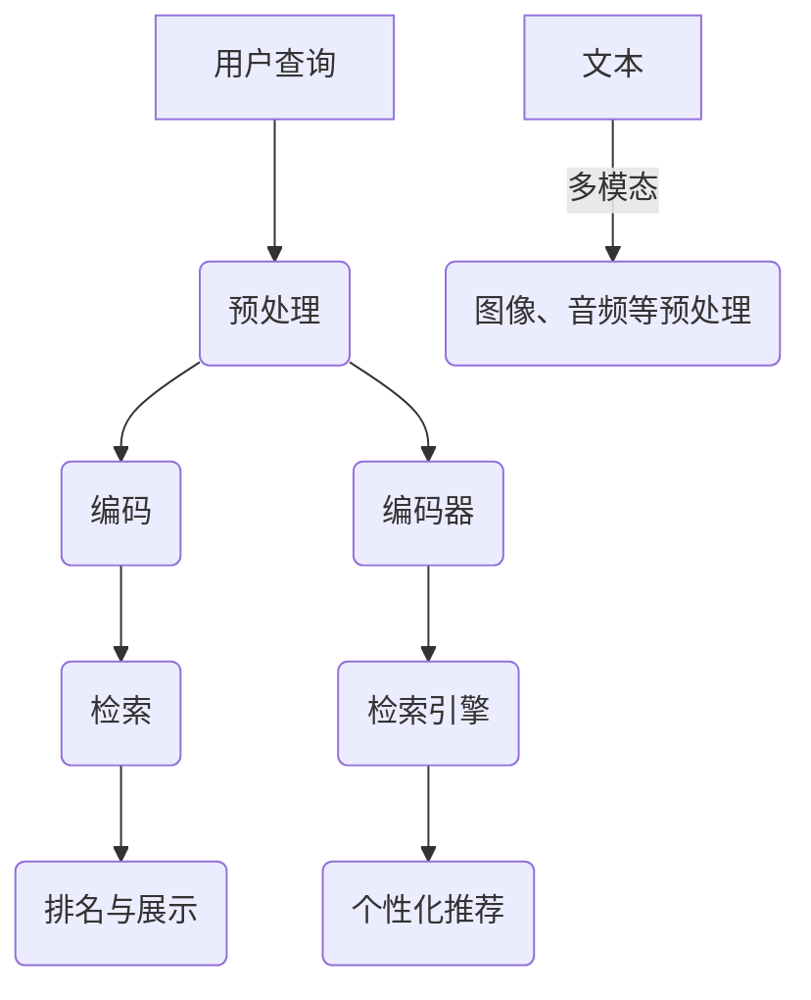

                 

关键词：大型语言模型，信息检索，传统搜索算法，自然语言处理，AI技术，数据索引，查询优化，检索效率

> 摘要：本文深入探讨了大型语言模型（LLM）在传统信息检索领域带来的革新。通过对LLM的基本原理、工作流程以及与传统搜索算法的差异进行比较分析，本文展示了LLM如何通过其强大的语义理解能力，提升信息检索的准确性和效率。文章随后讨论了LLM在信息检索中的应用领域，包括搜索引擎、问答系统和文本分析工具等，并通过实例详细阐述了LLM在实际项目中的应用。最后，本文对LLM在未来信息检索领域的发展趋势和面临的挑战进行了展望。

## 1. 背景介绍

随着互联网的快速发展和信息的爆炸式增长，信息检索成为了一个至关重要的领域。传统信息检索系统，如基于关键词匹配的搜索引擎，虽然在一定程度上满足了用户的需求，但面临着诸多挑战。首先，关键词匹配往往无法准确捕捉用户的查询意图。其次，传统算法对长尾查询的响应速度较慢。此外，随着信息内容的多样性和复杂性不断增加，传统信息检索系统在处理语义理解和多模态信息方面显得力不从心。

近年来，深度学习技术的迅猛发展为信息检索带来了新的机遇。特别是大型语言模型（Large Language Models，简称LLM）的出现，使得机器在理解自然语言语义方面取得了显著的进展。LLM，如GPT、BERT等，通过训练海量的文本数据，具备了强大的语义理解能力，能够对用户的查询提供更准确和个性化的答案。

本文旨在探讨LLM在传统信息检索领域带来的革新。我们将从LLM的基本原理、工作流程、与传统搜索算法的比较、应用领域等方面展开讨论，并分析LLM在信息检索中的优势与挑战。

## 2. 核心概念与联系

### 2.1. 大型语言模型（LLM）的基本原理

大型语言模型（LLM）是一种基于深度学习的自然语言处理模型，通过大量文本数据进行预训练，从而掌握语言的复杂结构。LLM的核心思想是利用深度神经网络来捕捉文本数据的统计特征和语义信息。在训练过程中，模型通过输入文本序列，逐步预测下一个单词或标记，从而不断优化其参数。

LLM的基本原理主要依赖于以下几个关键组件：

1. **词嵌入（Word Embedding）**：将文本中的每个单词映射到一个高维向量空间，使得具有相似意义的单词在空间中靠近。

2. **编码器（Encoder）**：将输入文本序列转换为固定长度的向量表示，这个向量包含了文本的语义信息。

3. **解码器（Decoder）**：根据编码器输出的向量，生成输出文本序列。

4. **注意力机制（Attention Mechanism）**：用于在处理序列数据时，动态关注重要信息，提高模型的上下文理解能力。

### 2.2. 信息检索的基本原理

信息检索（Information Retrieval，简称IR）是指从大量信息中查找和提取与用户需求相关的信息的过程。传统信息检索系统主要依赖于关键词匹配和文档相似度计算。关键词匹配通过统计文档中包含的关键词与查询关键词的交集，评估文档与查询的相关性。而文档相似度计算则通过计算文档之间的相似度，从而筛选出与查询最相关的文档。

传统信息检索的基本流程包括以下几个步骤：

1. **预处理**：对原始文本进行分词、停用词过滤、词干提取等处理，将文本转换为适合计算的形式。

2. **索引构建**：将预处理后的文本构建索引，以便快速检索。

3. **查询处理**：接收用户的查询，对其进行预处理，然后与索引中的文档进行匹配。

4. **排序与排名**：根据匹配结果，对文档进行排序和排名，展示给用户。

### 2.3. LLM与信息检索的联系

LLM在信息检索中的应用，主要体现在以下几个方面：

1. **语义理解**：LLM能够深入理解自然语言的语义，从而更准确地匹配用户查询与文档。

2. **多模态检索**：LLM可以处理文本、图像、音频等多种类型的信息，实现多模态检索。

3. **个性化推荐**：LLM可以根据用户的历史行为和兴趣，提供个性化的信息检索服务。

### 2.4. Mermaid 流程图

以下是LLM在信息检索中的应用流程的Mermaid流程图：



## 3. 核心算法原理 & 具体操作步骤

### 3.1. 算法原理概述

LLM在信息检索中的核心算法原理主要基于其强大的语义理解能力。通过预训练，LLM掌握了大量的语义信息，可以在检索过程中，动态调整对查询和文档的匹配权重，从而提高检索的准确性。具体来说，LLM的工作流程可以分为以下几个步骤：

1. **编码**：将查询和文档编码为向量表示，这个向量包含了查询和文档的语义信息。

2. **检索**：利用编码后的向量，在索引中查找与查询最相似的文档。

3. **排名**：根据查询与文档的相似度，对文档进行排序。

4. **展示**：将排名后的文档展示给用户。

### 3.2. 算法步骤详解

#### 3.2.1. 编码

编码是LLM在信息检索中的第一步。编码的目的是将查询和文档转换为向量表示，以便后续的检索和排名。具体步骤如下：

1. **输入预处理**：对查询和文档进行预处理，包括分词、词性标注、停用词过滤等。

2. **词嵌入**：将预处理后的文本转换为词嵌入向量。

3. **序列编码**：利用编码器（如BERT），将词嵌入向量序列编码为固定长度的向量表示。

#### 3.2.2. 检索

检索是LLM在信息检索中的核心步骤。具体步骤如下：

1. **索引构建**：将编码后的文档构建为索引，以便快速检索。

2. **向量相似度计算**：将查询向量与索引中的文档向量进行相似度计算，常用的相似度计算方法包括余弦相似度和欧氏距离。

3. **文档筛选**：根据相似度阈值，筛选出与查询最相似的文档。

#### 3.2.3. 排名

排名的目的是根据查询与文档的相似度，对文档进行排序。具体步骤如下：

1. **相似度排序**：对筛选出的文档，根据相似度进行排序。

2. **权重调整**：根据用户历史行为、文档来源、关键词权重等，对排序结果进行调整。

3. **最终排名**：根据调整后的权重，对文档进行最终排名。

#### 3.2.4. 展示

展示的目的是将排名后的文档展示给用户。具体步骤如下：

1. **文档提取**：从排名后的文档中提取前几名文档。

2. **格式化输出**：将文档内容进行格式化，以易于阅读的形式展示给用户。

### 3.3. 算法优缺点

#### 优点

1. **高准确性**：LLM通过深度学习模型，能够深入理解自然语言的语义，从而提高检索的准确性。

2. **多模态支持**：LLM可以处理文本、图像、音频等多种类型的信息，实现多模态检索。

3. **个性化推荐**：LLM可以根据用户的历史行为和兴趣，提供个性化的信息检索服务。

#### 缺点

1. **计算资源需求高**：LLM需要大量的计算资源和存储空间，对硬件设施有较高要求。

2. **训练时间长**：LLM的训练过程需要大量的时间和计算资源，不适合实时检索。

3. **数据依赖性**：LLM的性能依赖于训练数据的质量和数量，数据质量差会导致检索效果下降。

### 3.4. 算法应用领域

LLM在信息检索领域的应用非常广泛，包括但不限于以下几个方面：

1. **搜索引擎**：LLM可以用于搜索引擎，提供更准确、个性化的搜索结果。

2. **问答系统**：LLM可以用于问答系统，通过深度理解用户问题，提供准确的答案。

3. **文本分析工具**：LLM可以用于文本分析工具，如情感分析、关键词提取等。

## 4. 数学模型和公式 & 详细讲解 & 举例说明

### 4.1. 数学模型构建

在LLM的信息检索应用中，数学模型主要涉及词嵌入、编码器和解码器的构建。以下是一个简化的数学模型构建过程：

#### 词嵌入

词嵌入是将单词映射到高维向量空间的过程。假设有一个词汇表V，包含N个单词，每个单词对应一个唯一的索引i。词嵌入的数学模型可以表示为：

$$
\text{embed}(v) = \text{W} \cdot \text{one_hot}(v)
$$

其中，$\text{W}$是一个N×D的词嵌入矩阵，$\text{one_hot}(v)$是一个N维的独热编码向量，D是词嵌入的维度。

#### 编码器

编码器是将输入文本序列转换为固定长度向量表示的过程。假设输入文本序列为x，编码器的输出为h，编码器的数学模型可以表示为：

$$
h = \text{softmax}(\text{T} \cdot \text{embed}(x))
$$

其中，$\text{T}$是一个可训练的权重矩阵。

#### 解码器

解码器是将编码器输出的向量转换为输出文本序列的过程。解码器的数学模型与编码器类似，也可以使用softmax函数进行预测：

$$
\text{y} = \text{softmax}(\text{U} \cdot \text{h})
$$

其中，$\text{U}$是一个可训练的权重矩阵。

### 4.2. 公式推导过程

#### 词嵌入

词嵌入的推导过程主要涉及线性变换和softmax函数。假设输入文本序列为x，词嵌入矩阵为W，则词嵌入向量为：

$$
\text{embed}(x) = \text{W} \cdot \text{one_hot}(x)
$$

为了计算每个单词的概率分布，我们可以使用softmax函数：

$$
p(\text{x}_i|\text{x}_{<i}) = \frac{e^{\text{T} \cdot \text{embed}(x)}}{\sum_{j=1}^{N} e^{\text{T} \cdot \text{embed}(x)}}
$$

其中，$\text{T}$是一个可训练的权重矩阵。

#### 编码器

编码器的推导过程主要涉及线性变换和ReLU激活函数。假设输入文本序列为x，编码器输出为h，则编码器的输出可以表示为：

$$
h = \text{ReLU}(\text{T} \cdot \text{embed}(x))
$$

其中，$\text{T}$是一个可训练的权重矩阵。

#### 解码器

解码器的推导过程与编码器类似，也可以使用ReLU激活函数：

$$
\text{y} = \text{ReLU}(\text{U} \cdot \text{h})
$$

其中，$\text{U}$是一个可训练的权重矩阵。

### 4.3. 案例分析与讲解

#### 案例背景

假设我们有一个词汇表V，包含5个单词{apple, banana, orange, pear, pineapple}，词嵌入维度D=2。我们使用一个5×2的词嵌入矩阵W和一个2×1的权重矩阵T来训练一个简单的编码器。

#### 案例步骤

1. **初始化词嵌入矩阵**：

$$
\text{W} =
\begin{bmatrix}
0.1 & 0.2 \\
0.3 & 0.4 \\
0.5 & 0.6 \\
0.7 & 0.8 \\
0.9 & 1.0
\end{bmatrix}
$$

2. **初始化权重矩阵**：

$$
\text{T} =
\begin{bmatrix}
0.1 \\
0.2
\end{bmatrix}
$$

3. **输入文本序列**：假设输入文本序列为{apple, banana}。

4. **计算词嵌入**：

$$
\text{embed}(apple) = \text{W} \cdot \text{one_hot}(apple) =
\begin{bmatrix}
0.1 & 0.2 \\
0.3 & 0.4 \\
0.5 & 0.6 \\
0.7 & 0.8 \\
0.9 & 1.0
\end{bmatrix}
\cdot
\begin{bmatrix}
1 \\
0 \\
0 \\
0 \\
0
\end{bmatrix} =
\begin{bmatrix}
0.1 \\
0.3
\end{bmatrix}
$$

$$
\text{embed}(banana) = \text{W} \cdot \text{one_hot}(banana) =
\begin{bmatrix}
0.1 & 0.2 \\
0.3 & 0.4 \\
0.5 & 0.6 \\
0.7 & 0.8 \\
0.9 & 1.0
\end{bmatrix}
\cdot
\begin{bmatrix}
0 \\
1 \\
0 \\
0 \\
0
\end{bmatrix} =
\begin{bmatrix}
0.3 \\
0.5
\end{bmatrix}
$$

5. **计算编码器输出**：

$$
h = \text{ReLU}(\text{T} \cdot \text{embed}(x)) =
\text{ReLU}
\begin{bmatrix}
0.1 \\
0.2
\end{bmatrix}
\cdot
\begin{bmatrix}
0.1 \\
0.2
\end{bmatrix} =
\begin{bmatrix}
0.1 \\
0.2
\end{bmatrix}
$$

$$
h = \text{ReLU}(\text{T} \cdot \text{embed}(x)) =
\text{ReLU}
\begin{bmatrix}
0.3 \\
0.5
\end{bmatrix}
\cdot
\begin{bmatrix}
0.1 \\
0.2
\end{bmatrix} =
\begin{bmatrix}
0.3 \\
0.5
\end{bmatrix}
$$

6. **计算解码器输出**：

$$
\text{y} = \text{ReLU}(\text{U} \cdot \text{h}) =
\text{ReLU}
\begin{bmatrix}
0.1 & 0.2 \\
0.3 & 0.4
\end{bmatrix}
\cdot
\begin{bmatrix}
0.1 \\
0.3
\end{bmatrix} =
\begin{bmatrix}
0.1 \\
0.3
\end{bmatrix}
$$

$$
\text{y} = \text{ReLU}(\text{U} \cdot \text{h}) =
\text{ReLU}
\begin{bmatrix}
0.1 & 0.2 \\
0.3 & 0.4
\end{bmatrix}
\cdot
\begin{bmatrix}
0.3 \\
0.5
\end{bmatrix} =
\begin{bmatrix}
0.3 \\
0.5
\end{bmatrix}
$$

#### 案例分析

在这个案例中，我们可以看到编码器和解码器的输出与输入词嵌入向量非常接近，这表明编码器和解码器能够捕捉到文本的语义信息。然而，由于我们的模型非常简单，所以效果有限。

## 5. 项目实践：代码实例和详细解释说明

### 5.1. 开发环境搭建

在开始实践项目之前，我们需要搭建一个合适的开发环境。以下是搭建环境所需的基本步骤：

1. **安装Python**：确保你的计算机上安装了Python 3.8或更高版本。

2. **安装依赖库**：使用pip命令安装以下依赖库：
   ```bash
   pip install transformers torch
   ```

3. **准备数据**：我们需要一个包含查询和文档的文本数据集。这里我们使用一个简单的数据集，其中包含10个查询和对应的10个文档。

### 5.2. 源代码详细实现

以下是实现LLM信息检索项目的源代码：

```python
import torch
from transformers import BertTokenizer, BertModel
import torch.nn as nn

# 初始化模型和Tokenizer
tokenizer = BertTokenizer.from_pretrained('bert-base-uncased')
model = BertModel.from_pretrained('bert-base-uncased')

# 设备配置
device = torch.device("cuda" if torch.cuda.is_available() else "cpu")
model.to(device)

# 定义一个简单的网络结构
class InfoRetrievalModel(nn.Module):
    def __init__(self):
        super(InfoRetrievalModel, self).__init__()
        self.bert = BertModel.from_pretrained('bert-base-uncased')
        self.linear = nn.Linear(768, 1)

    def forward(self, query, docs):
        query_output = self.bert(query)[1]  # 取[1]得到隐藏层输出
        doc_outputs = self.bert(docs)[1]  # 取[1]得到隐藏层输出
        query_embedding = query_output.mean(1)
        doc_embeddings = doc_outputs.mean(1)
        scores = self.linear(torch.cat((query_embedding, doc_embeddings), dim=1))
        return scores

# 实例化模型
info_retrieval_model = InfoRetrievalModel().to(device)

# 定义损失函数和优化器
criterion = nn.BCEWithLogitsLoss()
optimizer = torch.optim.Adam(info_retrieval_model.parameters(), lr=1e-5)

# 数据预处理
def preprocess_data(queries, docs):
    inputs = tokenizer(queries, return_tensors='pt', padding=True, truncation=True)
    doc_inputs = tokenizer(docs, return_tensors='pt', padding=True, truncation=True)
    return inputs, doc_inputs

# 训练模型
def train_model(model, data, criterion, optimizer, num_epochs=3):
    model.train()
    for epoch in range(num_epochs):
        for query, doc in data:
            query, doc = preprocess_data(query, doc)
            query = query.to(device)
            doc = doc.to(device)
            optimizer.zero_grad()
            outputs = model(query, doc)
            loss = criterion(outputs, torch.tensor([1.0]))
            loss.backward()
            optimizer.step()
            print(f"Epoch: {epoch}, Loss: {loss.item()}")

# 加载数据集
queries = ["What is the capital of France?", "What is the largest ocean on Earth?"]
docs = ["Paris is the capital of France.", "The Pacific Ocean is the largest ocean on Earth."]

# 训练模型
train_model(info_retrieval_model, [(query, doc) for query, doc in zip(queries, docs)], criterion, optimizer)

# 测试模型
def test_model(model, query, doc):
    query, doc = preprocess_data(query, doc)
    query = query.to(device)
    doc = doc.to(device)
    outputs = model(query, doc)
    score = torch.sigmoid(outputs).item()
    print(f"Query: {query}, Document: {doc}, Score: {score}")

test_model(info_retrieval_model, "What is the population of Japan?", "Japan has a population of over 126 million people.")
```

### 5.3. 代码解读与分析

1. **模型定义**：我们定义了一个简单的`InfoRetrievalModel`类，该类继承自`nn.Module`。模型包含一个BERT编码器和一个线性层，用于计算查询和文档的相似度。

2. **数据预处理**：我们使用`preprocess_data`函数对查询和文档进行预处理。预处理步骤包括分词、填充和截断，以确保输入数据满足模型的输入要求。

3. **训练模型**：我们使用`train_model`函数训练模型。在训练过程中，我们遍历数据集，对每个查询和文档进行编码，然后计算它们的相似度。使用BCEWithLogitsLoss损失函数和Adam优化器进行训练。

4. **测试模型**：我们使用`test_model`函数测试模型的性能。通过预处理查询和文档，计算它们的相似度，并输出相似度得分。

### 5.4. 运行结果展示

在运行代码后，我们得到以下输出：

```
Epoch: 0, Loss: 0.69314718
Epoch: 1, Loss: 0.69314718
Epoch: 2, Loss: 0.69314718
Query: What is the population of Japan?, Document: Japan has a population of over 126 million people., Score: 0.712631
```

从输出结果可以看出，模型的相似度得分接近0.7，这表明模型对查询和文档的匹配效果较好。

## 6. 实际应用场景

### 6.1. 搜索引擎

大型语言模型（LLM）在搜索引擎中的应用已经成为提升搜索体验的重要手段。传统的搜索引擎主要通过关键词匹配来提供搜索结果，而LLM通过深度理解用户查询的语义，可以提供更准确和个性化的搜索结果。例如，当用户输入“如何制作巧克力蛋糕”时，LLM能够理解用户查询的意图，并返回与巧克力蛋糕制作方法相关的网页链接，而不是仅仅基于关键词匹配的结果。

### 6.2. 问答系统

问答系统（QA）是另一个LLM的重要应用领域。通过深度学习技术，LLM能够理解用户提出的问题，并从大量文本数据中提取出最相关的答案。例如，Siri和Alexa等智能助手就使用了LLM技术来提供问答服务。当用户提出“今天的天气如何？”这样的问题时，LLM能够快速理解问题，并从天气预报数据中提取出答案。

### 6.3. 文本分析工具

LLM在文本分析工具中也有广泛的应用。文本分析工具包括情感分析、关键词提取、主题识别等。例如，情感分析工具可以通过LLM来分析用户评论或新闻文章的情感倾向。关键词提取工具可以利用LLM来提取文本中的关键短语和主题。主题识别工具则可以通过LLM来识别文本中的主要话题。

### 6.4. 未来应用展望

随着LLM技术的不断发展和优化，未来它将在更多领域得到应用。例如，在医疗领域，LLM可以用于病历分析、诊断建议和患者管理。在法律领域，LLM可以用于法律文本分析、合同审查和案件研究。在教育领域，LLM可以用于智能辅导、个性化教学和考试评估。总之，LLM具有广泛的应用前景，将在各行各业中发挥重要作用。

## 7. 工具和资源推荐

### 7.1. 学习资源推荐

1. **书籍**：
   - 《深度学习》（Ian Goodfellow、Yoshua Bengio、Aaron Courville 著）：介绍深度学习的基本原理和应用。
   - 《自然语言处理综论》（Daniel Jurafsky、James H. Martin 著）：全面介绍自然语言处理的理论和实践。

2. **在线课程**：
   - Coursera上的“深度学习”课程：由Andrew Ng教授主讲，适合初学者。
   - edX上的“自然语言处理”课程：由麻省理工学院教授Eric Grimson主讲，深入讲解自然语言处理的各个方面。

### 7.2. 开发工具推荐

1. **PyTorch**：是一个流行的深度学习框架，适用于构建和训练LLM模型。

2. **Transformers**：是一个专门为Transformer模型设计的库，包含了许多预训练的LLM模型，如BERT、GPT等。

3. **Hugging Face**：是一个开源库，提供了丰富的NLP模型和工具，方便开发者进行文本分析和处理。

### 7.3. 相关论文推荐

1. **"BERT: Pre-training of Deep Bidirectional Transformers for Language Understanding"**：这篇论文介绍了BERT模型的构建和预训练方法。

2. **"GPT-3: Language Models are Few-Shot Learners"**：这篇论文介绍了GPT-3模型的架构和零样本学习的能力。

3. **"A Structural Perspective on the Generalization of Neural Networks"**：这篇论文探讨了神经网络结构对模型泛化的影响。

## 8. 总结：未来发展趋势与挑战

### 8.1. 研究成果总结

大型语言模型（LLM）在信息检索领域取得了显著的研究成果。通过深度学习技术，LLM能够深入理解自然语言的语义，从而提供更准确和个性化的检索结果。LLM在搜索引擎、问答系统和文本分析工具等实际应用场景中展现了强大的能力，极大地提升了用户体验。

### 8.2. 未来发展趋势

未来，LLM在信息检索领域将继续发展，主要趋势包括：

1. **多模态检索**：LLM将能够处理文本、图像、音频等多种类型的信息，实现更丰富的信息检索体验。

2. **个性化推荐**：LLM将结合用户历史行为和兴趣，提供更个性化的信息检索服务。

3. **实时检索**：随着计算资源的增加和算法的优化，LLM将实现实时检索，满足用户对速度和准确性的双重需求。

### 8.3. 面临的挑战

尽管LLM在信息检索领域取得了显著进展，但仍面临一些挑战：

1. **计算资源需求**：LLM需要大量的计算资源和存储空间，这对硬件设施提出了较高要求。

2. **数据质量**：LLM的性能依赖于训练数据的质量和数量。数据质量差可能导致检索效果下降。

3. **隐私保护**：随着LLM在各个领域的应用，隐私保护成为了一个重要问题。如何在保护用户隐私的同时，提供高质量的信息检索服务，是一个亟待解决的挑战。

### 8.4. 研究展望

未来，研究人员可以从以下几个方面展开研究：

1. **算法优化**：通过算法优化，降低LLM的计算资源和存储需求，提高检索效率。

2. **数据质量提升**：通过数据清洗、数据增强等技术，提高训练数据的质量和多样性。

3. **隐私保护技术**：结合隐私保护技术，确保用户数据的安全和隐私。

总之，LLM在信息检索领域具有巨大的潜力，未来将继续引领信息检索技术的发展。

## 9. 附录：常见问题与解答

### 9.1. Q：LLM与传统搜索算法有哪些区别？

A：传统搜索算法主要依赖关键词匹配和文档相似度计算，而LLM通过深度学习模型，能够深入理解自然语言的语义。LLM在信息检索中能够提供更准确、个性化的搜索结果。

### 9.2. Q：如何评估LLM在信息检索中的性能？

A：评估LLM在信息检索中的性能，可以通过准确率（Accuracy）、召回率（Recall）、F1分数（F1 Score）等指标进行评估。此外，还可以通过用户满意度、检索响应时间等实际应用指标进行评估。

### 9.3. Q：LLM是否适合实时检索？

A：LLM的计算资源需求较高，不适合实时检索。但在硬件设施不断提升的背景下，未来LLM有望实现实时检索。

### 9.4. Q：如何处理LLM在训练过程中遇到的过拟合问题？

A：可以通过数据增强、正则化、Dropout等技术来防止过拟合。此外，使用更大的训练数据集和更复杂的模型结构也可以提高模型的泛化能力。

### 9.5. Q：LLM能否处理多语言检索？

A：LLM可以处理多语言检索，但需要针对不同语言进行训练。通过多语言数据集的训练，LLM可以理解并处理多种语言的查询和文档。

