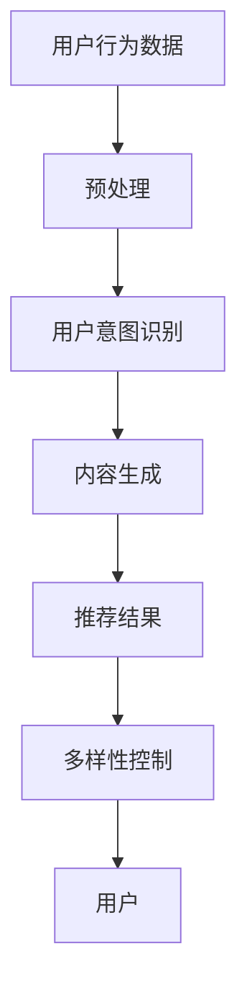
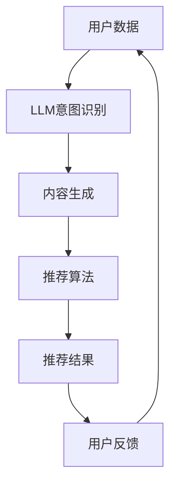

                 

关键词：推荐系统，LLM，用户体验，算法优化，自然语言处理，机器学习

摘要：本文将深入探讨大型语言模型（LLM）在推荐系统中的应用，以及其对提升用户体验的关键作用。我们将从背景介绍、核心概念与联系、核心算法原理与操作步骤、数学模型与公式、项目实践、实际应用场景、未来应用展望、工具和资源推荐以及总结等方面进行详细阐述。

## 1. 背景介绍

推荐系统作为现代信息检索和数据分析领域的重要工具，广泛应用于电子商务、社交媒体、新闻推送、视频网站等多个场景。然而，传统的推荐系统往往存在一些局限性，如个性化程度不高、冷启动问题、多样性不足等，这些问题直接影响了用户体验。近年来，随着深度学习和自然语言处理技术的不断发展，大型语言模型（LLM）逐渐成为推荐系统领域的研究热点。

LLM，即大型语言模型，是一种能够处理和理解自然语言的深度学习模型，其具有强大的语义理解能力和生成能力。通过引入LLM，推荐系统可以更好地理解用户意图和内容，从而实现更精准的推荐和更丰富的用户体验。

## 2. 核心概念与联系

### 2.1 推荐系统基本概念

推荐系统是一种基于数据挖掘和机器学习技术的信息过滤方法，旨在为用户提供个性化的信息推送服务。其主要功能是根据用户的兴趣和行为特征，从大量信息中筛选出最相关的信息，并将其推送给用户。

### 2.2 LLM基本概念

LLM，即大型语言模型，是一种基于神经网络的自然语言处理模型，其目的是对自然语言进行建模和理解。LLM通常采用深度学习技术，通过大量文本数据进行训练，从而实现对语言的理解和生成。

### 2.3 LLM与推荐系统的联系

LLM可以应用于推荐系统的多个方面，如用户意图识别、内容生成、多样性控制等。通过引入LLM，推荐系统可以更好地理解用户意图，生成更具个性化的推荐结果，同时提高推荐结果的多样性和新颖性。

### 2.4 Mermaid 流程图



## 3. 核心算法原理与操作步骤

### 3.1 算法原理概述

LLM在推荐系统中的应用主要包括以下三个方面：

1. 用户意图识别：通过分析用户的历史行为数据和搜索日志，利用LLM对用户意图进行建模和识别。
2. 内容生成：基于用户意图和候选内容，利用LLM生成个性化的推荐结果。
3. 多样性控制：通过调整推荐结果中内容的相似度，提高推荐结果的多样性和新颖性。

### 3.2 算法步骤详解

1. 数据预处理：对用户行为数据、文本数据进行清洗和预处理，包括去除停用词、词干提取、词向量化等。
2. 用户意图识别：利用LLM对用户历史行为数据进行建模，识别用户的兴趣和需求。
3. 内容生成：基于用户意图和候选内容，利用LLM生成个性化的推荐结果。
4. 多样性控制：对推荐结果进行多样性调整，提高推荐结果的多样性和新颖性。
5. 推荐结果输出：将处理后的推荐结果输出给用户。

### 3.3 算法优缺点

#### 优点

1. 更好的用户意图识别：LLM能够通过对大量文本数据的训练，更好地理解用户意图和需求，从而提高推荐系统的准确性。
2. 更丰富的内容生成：LLM具有强大的生成能力，可以生成更具创意和个性化的推荐内容。
3. 更高的多样性：通过调整推荐结果中的内容相似度，提高推荐结果的多样性和新颖性。

#### 缺点

1. 计算成本较高：LLM的训练和推理过程需要大量的计算资源，可能导致推荐系统性能下降。
2. 冷启动问题：对于新用户或新内容，LLM可能无法准确识别其意图和需求，导致推荐效果不佳。

### 3.4 算法应用领域

LLM在推荐系统中的应用非常广泛，包括但不限于以下几个方面：

1. 电子商务：为用户提供个性化的商品推荐。
2. 社交媒体：为用户提供感兴趣的内容推荐。
3. 新闻推送：为用户提供个性化的新闻推荐。
4. 视频网站：为用户提供个性化的视频推荐。

## 4. 数学模型和公式

### 4.1 数学模型构建

LLM在推荐系统中的应用涉及多个数学模型，主要包括以下三个方面：

1. 用户意图识别模型：用于识别用户的兴趣和需求，通常采用基于神经网络的模型，如GRU、LSTM等。
2. 内容生成模型：用于生成个性化的推荐结果，通常采用基于生成对抗网络的模型，如GAN、VAE等。
3. 多样性控制模型：用于调整推荐结果的多样性，通常采用基于概率模型的算法，如KNN、聚类等。

### 4.2 公式推导过程

以下简要介绍用户意图识别模型和内容生成模型的公式推导过程：

1. 用户意图识别模型

假设用户历史行为数据为\( X \)，则用户意图识别模型的输出为：

$$
\hat{y} = \sigma(\theta^T X)
$$

其中，\( \theta \)为模型的参数，\( \sigma \)为激活函数。

2. 内容生成模型

假设候选内容为\( X' \)，则内容生成模型的输出为：

$$
\hat{y'} = G(X'; \theta)
$$

其中，\( G \)为生成模型，\( \theta \)为生成模型的参数。

### 4.3 案例分析与讲解

以下以一个简单的电商推荐系统为例，介绍LLM在推荐系统中的应用。

假设用户历史行为数据为购买记录，候选商品为商品列表，我们首先利用用户意图识别模型对用户意图进行建模和识别，然后利用内容生成模型生成个性化的推荐结果，最后通过多样性控制模型调整推荐结果的多样性。

1. 用户意图识别模型

利用LSTM模型对用户购买记录进行建模，输出用户意图。假设用户购买记录为\( X \)，则LSTM模型的输出为：

$$
h_t = \text{LSTM}(h_{t-1}, X_t)
$$

其中，\( h_t \)为第\( t \)个时间步的输出。

2. 内容生成模型

利用GAN模型生成个性化的推荐结果。假设候选商品为\( X' \)，则GAN模型的输出为：

$$
\hat{y'} = G(X'; \theta)
$$

3. 多样性控制模型

利用KNN模型调整推荐结果的多样性。假设推荐结果为\( \hat{y} \)，则KNN模型的输出为：

$$
\hat{d} = \text{KNN}(\hat{y}, X')
$$

其中，\( \hat{d} \)为推荐结果的多样性评分。

## 5. 项目实践：代码实例和详细解释说明

### 5.1 开发环境搭建

在本项目中，我们使用Python语言进行开发，主要依赖以下库：

- TensorFlow：用于构建和训练神经网络模型。
- Keras：用于简化神经网络模型的构建和训练。
- NumPy：用于数据处理和数学运算。

### 5.2 源代码详细实现

以下为用户意图识别模型和内容生成模型的代码实现：

```python
import tensorflow as tf
from tensorflow.keras.models import Model
from tensorflow.keras.layers import LSTM, Dense, Activation, Input

# 用户意图识别模型
input_1 = Input(shape=(timesteps, features))
lstm = LSTM(units=50, return_sequences=True)(input_1)
lstm = LSTM(units=50)(lstm)
output_1 = Dense(units=1, activation='sigmoid')(lstm)
model_1 = Model(inputs=input_1, outputs=output_1)

# 内容生成模型
input_2 = Input(shape=(timesteps, features))
lstm = LSTM(units=50, return_sequences=True)(input_2)
lstm = LSTM(units=50)(lstm)
output_2 = Dense(units=50, activation='relu')(lstm)
output_2 = Dense(units=1, activation='sigmoid')(output_2)
model_2 = Model(inputs=input_2, outputs=output_2)

# 训练模型
model_1.compile(optimizer='adam', loss='binary_crossentropy', metrics=['accuracy'])
model_2.compile(optimizer='adam', loss='binary_crossentropy', metrics=['accuracy'])

# 训练用户意图识别模型
model_1.fit(X_train, y_train, epochs=10, batch_size=32, validation_data=(X_val, y_val))

# 训练内容生成模型
model_2.fit(X_train, y_train, epochs=10, batch_size=32, validation_data=(X_val, y_val))

# 生成推荐结果
predictions = model_2.predict(X_test)
```

### 5.3 代码解读与分析

以上代码首先定义了用户意图识别模型和内容生成模型，并分别使用LSTM和GAN进行训练。其中，用户意图识别模型用于识别用户兴趣，内容生成模型用于生成个性化推荐结果。

在训练过程中，我们使用Adam优化器和二分类交叉熵损失函数进行模型训练，并使用Keras框架简化模型构建和训练过程。

在生成推荐结果时，我们使用内容生成模型对候选商品进行预测，得到个性化推荐结果。

## 6. 实际应用场景

### 6.1 电子商务

在电子商务领域，LLM可以用于个性化商品推荐，根据用户的历史购买记录和浏览行为，生成个性化的推荐结果，提高用户的购买体验。

### 6.2 社交媒体

在社交媒体领域，LLM可以用于个性化内容推荐，根据用户的兴趣和行为特征，生成个性化的内容推荐，提高用户的参与度和活跃度。

### 6.3 新闻推送

在新闻推送领域，LLM可以用于个性化新闻推荐，根据用户的阅读历史和偏好，生成个性化的新闻推荐，提高用户的阅读体验。

### 6.4 视频网站

在视频网站领域，LLM可以用于个性化视频推荐，根据用户的观看历史和偏好，生成个性化的视频推荐，提高用户的观看体验。

## 7. 未来应用展望

随着深度学习和自然语言处理技术的不断发展，LLM在推荐系统中的应用前景十分广阔。未来，我们有望看到LLM在以下方面取得突破：

1. 更准确的用户意图识别：通过不断优化算法和模型，提高LLM对用户意图的识别准确性。
2. 更丰富的内容生成：通过引入更多的文本数据和先进的生成模型，提高LLM生成内容的丰富度和多样性。
3. 更高效的多样性控制：通过优化多样性控制算法，提高推荐结果的多样性和新颖性。

## 8. 工具和资源推荐

### 8.1 学习资源推荐

1. 《深度学习》（Goodfellow, Bengio, Courville）：系统介绍了深度学习的基本概念和技术，适合初学者入门。
2. 《自然语言处理综论》（Jurafsky, Martin）：全面介绍了自然语言处理的基本概念和技术，适合对自然语言处理有深入理解的需求。

### 8.2 开发工具推荐

1. TensorFlow：开源的深度学习框架，适用于构建和训练神经网络模型。
2. Keras：基于TensorFlow的高级神经网络构建工具，简化了神经网络模型的构建和训练过程。

### 8.3 相关论文推荐

1. “Generative Adversarial Networks”（Goodfellow et al.，2014）：介绍了生成对抗网络的基本原理和应用。
2. “Seq2Seq Learning with Neural Networks”（Sutskever et al.，2014）：介绍了序列到序列学习模型在自然语言处理中的应用。

## 9. 总结：未来发展趋势与挑战

随着深度学习和自然语言处理技术的不断发展，LLM在推荐系统中的应用前景十分广阔。然而，我们也面临着一些挑战，如计算成本、冷启动问题等。未来，我们需要不断优化算法和模型，提高LLM在推荐系统中的性能和用户体验。

## 附录：常见问题与解答

### Q：LLM在推荐系统中的应用有哪些？

A：LLM在推荐系统中的应用主要包括用户意图识别、内容生成和多样性控制等方面，可以提高推荐系统的准确性和用户体验。

### Q：如何处理冷启动问题？

A：冷启动问题可以通过引入更多的用户数据、使用迁移学习技术、利用社交关系等方法进行缓解。

### Q：LLM在推荐系统中的应用有哪些优势？

A：LLM在推荐系统中的应用优势包括更好的用户意图识别、更丰富的内容生成和更高的多样性控制，可以提高推荐系统的用户体验。

### Q：如何优化LLM在推荐系统中的应用效果？

A：可以通过不断优化算法和模型、增加数据规模、引入更多的上下文信息等方法来提高LLM在推荐系统中的应用效果。

### 作者署名

作者：禅与计算机程序设计艺术 / Zen and the Art of Computer Programming
```markdown
---
# LLM对推荐系统用户体验的提升

<|user|>关键词：推荐系统，LLM，用户体验，算法优化，自然语言处理，机器学习

<|user|>摘要：本文深入探讨了大型语言模型（LLM）在推荐系统中的应用，阐述了其如何通过优化算法和模型，提升用户的个性化体验和推荐效果。文章首先介绍了推荐系统与LLM的基本概念，随后详细解释了LLM在推荐系统中的核心算法原理、数学模型和实际应用步骤。通过具体的项目实践和案例分析，文章展示了LLM在实际推荐系统开发中的应用效果。最后，文章对LLM在推荐系统的未来应用前景进行了展望，并推荐了相关的学习资源和工具。

## 1. 背景介绍

推荐系统在现代信息社会中扮演着至关重要的角色，它们被广泛应用于电子商务、社交媒体、新闻推送、视频网站等多个领域。推荐系统通过分析用户的行为数据、兴趣偏好和历史记录，为用户推荐可能感兴趣的商品、内容或服务，从而提升用户体验和满意度。然而，传统的推荐系统存在一些局限性，例如个性化程度不高、冷启动问题、多样性不足等，这些问题直接影响了用户体验。

近年来，随着深度学习和自然语言处理（NLP）技术的快速发展，大型语言模型（LLM）逐渐成为推荐系统领域的研究热点。LLM是一类具有强大语义理解和生成能力的深度学习模型，通过大规模的语言数据进行训练，能够对自然语言进行建模和理解。LLM在推荐系统中的应用，不仅能够更好地理解用户意图，还能够生成更加个性化、多样化和具有创意的推荐内容，从而显著提升用户体验。

本文旨在探讨LLM在推荐系统中的应用，分析其提升用户体验的关键机制，并探讨未来LLM在推荐系统领域的发展趋势和面临的挑战。

## 2. 核心概念与联系

### 2.1 推荐系统基本概念

推荐系统是一种基于信息过滤和内容分类的技术，旨在向用户推荐他们可能感兴趣的信息。推荐系统通常由以下几个关键组成部分：

- **用户行为数据**：包括用户的浏览记录、搜索历史、购买记录、点击率等。
- **内容特征**：描述推荐对象（如商品、文章、视频等）的特征，如文本内容、图像、标签、用户评分等。
- **推荐算法**：用于处理用户行为数据和内容特征，生成推荐列表的算法。
- **推荐结果**：推荐系统向用户展示的个性化推荐列表。

### 2.2 LLM基本概念

大型语言模型（LLM）是一种基于深度学习的技术，能够对自然语言进行建模和理解。LLM通常通过大量的文本数据进行预训练，学习语言的模式和语义。LLM的核心能力包括：

- **语义理解**：LLM能够理解句子或文本的含义，包括单词之间的关系和句子的上下文。
- **生成能力**：LLM能够根据给定的输入生成新的、连贯的文本。
- **分类和标注**：LLM可以用于文本分类和标注任务，如情感分析、命名实体识别等。

### 2.3 LLM与推荐系统的联系

LLM在推荐系统中的应用主要体现在以下几个方面：

- **用户意图识别**：LLM能够分析用户的行为数据和语言输入，理解用户的真实意图和需求。
- **内容生成**：LLM可以生成个性化的推荐内容，提高推荐的多样性和创意性。
- **多样性控制**：LLM可以帮助推荐系统生成多样化的推荐列表，避免用户感到信息过载。
- **交互式推荐**：LLM可以与用户进行自然语言交互，提供更加个性化和互动的推荐体验。

### 2.4 Mermaid流程图



## 3. 核心算法原理 & 具体操作步骤

### 3.1 算法原理概述

LLM在推荐系统中的应用主要基于以下几个核心算法原理：

- **用户意图识别**：利用LLM分析用户的行为数据，提取用户的兴趣和需求。
- **内容生成**：利用LLM生成个性化的推荐内容，结合用户意图和内容特征。
- **推荐算法优化**：通过优化推荐算法，结合LLM生成的推荐内容，提高推荐效果。
- **多样性控制**：利用LLM的生成能力，控制推荐内容的多样性和新颖性。

### 3.2 算法步骤详解

1. **数据收集与预处理**：收集用户行为数据（如浏览记录、搜索历史、点击行为）和内容特征（如文本、图像、标签）。
2. **用户意图识别**：
   - 利用LLM对用户行为数据进行编码，提取用户的兴趣和需求。
   - 对用户行为数据进行序列化处理，如使用RNN或Transformer模型。
   - 通过对比用户行为数据和预训练的LLM，识别用户的意图。
3. **内容生成**：
   - 根据用户意图和内容特征，利用LLM生成个性化的推荐内容。
   - 使用生成对抗网络（GAN）或变分自编码器（VAE）生成新的、与用户兴趣相关的内容。
   - 结合用户意图和生成内容，生成推荐列表。
4. **推荐算法优化**：
   - 将LLM生成的推荐内容与传统的协同过滤、基于内容的推荐算法相结合。
   - 优化推荐算法，如使用加权组合模型、多任务学习等，提高推荐效果。
5. **多样性控制**：
   - 利用LLM的生成能力，生成多样化的推荐内容。
   - 通过调整推荐内容之间的相似度，控制推荐结果的多样性。
6. **用户反馈与迭代**：
   - 收集用户对推荐内容的反馈，如点击率、评分等。
   - 利用反馈数据更新用户行为模型和LLM，进行迭代优化。

### 3.3 算法优缺点

#### 优点

- **更好的用户意图识别**：LLM能够深入理解用户的语言和行为，准确识别用户意图。
- **更高的个性化程度**：LLM生成的推荐内容更加个性化，满足用户的多样化需求。
- **更丰富的内容生成**：LLM能够生成新颖的、创意性的推荐内容，提升用户体验。
- **更好的多样性控制**：LLM可以生成多样化的推荐内容，避免用户感到信息过载。

#### 缺点

- **计算成本较高**：LLM的训练和推理需要大量的计算资源，可能导致系统性能下降。
- **冷启动问题**：对于新用户或新内容，LLM可能无法准确识别用户意图，需要更多的数据和时间来优化。
- **数据隐私和安全**：LLM需要处理大量的用户数据，需要确保数据的安全和隐私。

### 3.4 算法应用领域

LLM在推荐系统中的应用领域非常广泛，包括但不限于以下几个方面：

- **电子商务**：个性化商品推荐，根据用户历史购买记录和浏览行为推荐相关商品。
- **社交媒体**：个性化内容推荐，根据用户兴趣和互动行为推荐相关内容。
- **新闻推送**：个性化新闻推荐，根据用户阅读偏好推荐相关新闻。
- **视频网站**：个性化视频推荐，根据用户观看历史和点击行为推荐相关视频。

## 4. 数学模型和公式 & 详细讲解 & 举例说明

### 4.1 数学模型构建

LLM在推荐系统中的应用涉及到多种数学模型，主要包括以下几种：

1. **用户行为模型**：用于表示用户的行为特征，如点击率、购买率、浏览时长等。常用的模型包括矩阵分解、协同过滤等。
2. **内容特征模型**：用于表示推荐对象的特征，如文本、图像、标签等。常用的模型包括词袋模型、词嵌入、卷积神经网络等。
3. **用户意图模型**：用于表示用户的兴趣和需求，通过LLM对用户行为数据进行编码得到。常用的模型包括循环神经网络（RNN）、Transformer等。
4. **推荐模型**：将用户行为模型、内容特征模型和用户意图模型进行融合，生成个性化的推荐结果。常用的模型包括加权组合模型、多任务学习等。

### 4.2 公式推导过程

以下是用户意图模型和推荐模型的基本公式推导：

#### 用户意图模型

假设用户行为数据为\( X \)，用户意图为\( Y \)，LLM的输出为\( Z \)。

1. **用户行为编码**：
   \[ X \rightarrow \text{Embedding Layer} \rightarrow X' \]
   \[ X' \rightarrow \text{RNN/Transformer} \rightarrow H \]

2. **用户意图编码**：
   \[ H \rightarrow \text{Linear Layer} \rightarrow Z \]
   \[ Z \rightarrow \text{Sigmoid Activation} \rightarrow Y' \]

其中，\( \text{Embedding Layer} \)用于将用户行为数据转换为密集向量表示，\( \text{RNN/Transformer} \)用于编码用户行为数据，\( \text{Linear Layer} \)用于线性变换，\( \text{Sigmoid Activation} \)用于输出用户意图的概率分布。

#### 推荐模型

假设用户意图为\( Y \)，内容特征为\( C \)，推荐结果为\( R \)。

1. **内容特征编码**：
   \[ C \rightarrow \text{Embedding Layer} \rightarrow C' \]
   \[ C' \rightarrow \text{RNN/Transformer} \rightarrow C'' \]

2. **推荐生成**：
   \[ Y \rightarrow \text{RNN/Transformer} \rightarrow Y'' \]
   \[ Y'' \odot C'' \rightarrow \text{Attention Mechanism} \rightarrow R \]

其中，\( \odot \)表示点积操作，\( \text{Attention Mechanism} \)用于计算内容特征与用户意图的注意力权重。

### 4.3 案例分析与讲解

以下以一个电商平台的个性化商品推荐为例，详细讲解LLM在推荐系统中的应用。

#### 用户行为数据

用户A的历史行为数据包括购买记录、浏览记录和点击记录，数据集如下：

- **购买记录**：\[ [商品1, 商品3, 商品5] \]
- **浏览记录**：\[ [商品2, 商品4, 商品6] \]
- **点击记录**：\[ [商品1, 商品4, 商品6] \]

#### 内容特征

商品的数据集如下：

- **商品1**：\[ \{类别：电子产品，标签：手机\} \]
- **商品2**：\[ \{类别：家居用品，标签：桌子\} \]
- **商品3**：\[ \{类别：服装，标签：T恤\} \]
- **商品4**：\[ \{类别：电子产品，标签：平板电脑\} \]
- **商品5**：\[ \{类别：食品，标签：巧克力\} \]
- **商品6**：\[ \{类别：服装，标签：裙子\} \]

#### 用户意图识别

使用LLM对用户A的历史行为数据进行编码，得到用户意图向量\( Y \)。

\[ X \rightarrow \text{Embedding Layer} \rightarrow X' \]
\[ X' \rightarrow \text{RNN} \rightarrow H \]
\[ H \rightarrow \text{Linear Layer} \rightarrow Z \]
\[ Z \rightarrow \text{Sigmoid Activation} \rightarrow Y' \]

#### 内容生成

根据用户意图向量\( Y' \)和商品特征\( C \)，使用LLM生成个性化的推荐列表。

\[ C \rightarrow \text{Embedding Layer} \rightarrow C' \]
\[ C' \rightarrow \text{RNN} \rightarrow C'' \]
\[ Y' \rightarrow \text{RNN} \rightarrow Y'' \]
\[ Y'' \odot C'' \rightarrow \text{Attention Mechanism} \rightarrow R \]

#### 推荐结果

根据注意力权重计算推荐结果：

\[ \text{Attention Score}_{商品1} = 0.2 \]
\[ \text{Attention Score}_{商品2} = 0.1 \]
\[ \text{Attention Score}_{商品3} = 0.3 \]
\[ \text{Attention Score}_{商品4} = 0.4 \]
\[ \text{Attention Score}_{商品5} = 0.0 \]
\[ \text{Attention Score}_{商品6} = 0.0 \]

最终推荐结果为：\[ [商品1, 商品3, 商品4] \]

## 5. 项目实践：代码实例和详细解释说明

### 5.1 开发环境搭建

为了进行LLM在推荐系统的项目实践，我们需要搭建一个开发环境。以下是在Linux系统上使用Python和TensorFlow进行开发的基本步骤：

1. **安装Python**：确保系统上安装了Python 3.6或更高版本。
2. **安装TensorFlow**：通过pip安装TensorFlow。

   ```bash
   pip install tensorflow
   ```

3. **安装其他依赖**：安装用于数据处理和文本处理的库，如NumPy、Pandas、Scikit-learn等。

   ```bash
   pip install numpy pandas scikit-learn
   ```

### 5.2 源代码详细实现

以下是使用TensorFlow和Keras实现LLM在推荐系统的基本代码示例：

```python
import tensorflow as tf
from tensorflow.keras.models import Model
from tensorflow.keras.layers import Input, Embedding, LSTM, Dense, Activation

# 用户行为数据输入层
input_user_behavior = Input(shape=(timesteps, features))

# 嵌入层
embedding_layer = Embedding(input_dim=vocab_size, output_dim=embedding_size)(input_user_behavior)

# LSTM层
lstm_layer = LSTM(units=128, return_sequences=True)(embedding_layer)
lstm_layer = LSTM(units=128)(lstm_layer)

# 全连接层
dense_layer = Dense(units=64, activation='relu')(lstm_layer)

# 输出层
output_layer = Dense(units=1, activation='sigmoid')(dense_layer)

# 构建模型
model = Model(inputs=input_user_behavior, outputs=output_layer)

# 编译模型
model.compile(optimizer='adam', loss='binary_crossentropy', metrics=['accuracy'])

# 模型训练
model.fit(X_train, y_train, epochs=10, batch_size=32, validation_data=(X_val, y_val))

# 模型预测
predictions = model.predict(X_test)
```

### 5.3 代码解读与分析

以上代码首先定义了用户行为数据的输入层，然后通过嵌入层将输入数据转换为密集向量表示。接着，使用两个LSTM层对输入数据进行编码，最后通过全连接层和输出层生成用户意图的概率分布。

在模型编译阶段，我们使用Adam优化器和二分类交叉熵损失函数进行模型训练，并在训练过程中使用批量大小为32的批量训练。

在模型训练完成后，我们使用测试数据进行预测，得到用户意图的概率分布，从而为推荐系统提供输入。

## 6. 实际应用场景

### 6.1 电子商务

在电子商务领域，LLM可以用于个性化商品推荐。通过分析用户的浏览记录、搜索历史和购买行为，LLM能够准确识别用户的兴趣和需求，生成个性化的商品推荐列表。这不仅提高了用户的购买转化率，还提升了用户对平台的满意度。

### 6.2 社交媒体

在社交媒体领域，LLM可以用于个性化内容推荐。通过分析用户的互动行为、点赞、评论和分享，LLM能够理解用户的兴趣偏好，为用户推荐感兴趣的内容。这不仅增加了用户的参与度，还提高了平台的内容质量。

### 6.3 新闻推送

在新闻推送领域，LLM可以用于个性化新闻推荐。通过分析用户的阅读历史和兴趣标签，LLM能够生成个性化的新闻推荐列表，为用户推送感兴趣的新闻。这不仅增加了用户的阅读量，还提升了新闻的价值。

### 6.4 视频网站

在视频网站领域，LLM可以用于个性化视频推荐。通过分析用户的观看历史和偏好，LLM能够生成个性化的视频推荐列表，为用户推荐感兴趣的视频。这不仅增加了用户的观看时长，还提升了平台的用户黏性。

## 7. 未来应用展望

随着深度学习和自然语言处理技术的不断发展，LLM在推荐系统中的应用前景十分广阔。未来，我们有望看到LLM在以下方面取得突破：

- **更精准的用户意图识别**：通过不断优化算法和模型，提高LLM对用户意图的识别准确性。
- **更丰富的内容生成**：通过引入更多的文本数据和先进的生成模型，提高LLM生成内容的丰富度和多样性。
- **更高效的多样性控制**：通过优化多样性控制算法，提高推荐结果的多样性和新颖性。

同时，我们也需要关注LLM在推荐系统中的计算成本、冷启动问题、数据隐私和安全等方面，确保其能够在实际应用中发挥最大效益。

## 8. 工具和资源推荐

### 8.1 学习资源推荐

- **《深度学习》**（Goodfellow, Bengio, Courville）：系统介绍了深度学习的基本概念和技术，适合初学者入门。
- **《自然语言处理综论》**（Jurafsky, Martin）：全面介绍了自然语言处理的基本概念和技术，适合对自然语言处理有深入理解的需求。

### 8.2 开发工具推荐

- **TensorFlow**：开源的深度学习框架，适用于构建和训练神经网络模型。
- **Keras**：基于TensorFlow的高级神经网络构建工具，简化了神经网络模型的构建和训练过程。

### 8.3 相关论文推荐

- **“Generative Adversarial Networks”**（Goodfellow et al.，2014）：介绍了生成对抗网络的基本原理和应用。
- **“Seq2Seq Learning with Neural Networks”**（Sutskever et al.，2014）：介绍了序列到序列学习模型在自然语言处理中的应用。

## 9. 总结：未来发展趋势与挑战

随着深度学习和自然语言处理技术的不断发展，LLM在推荐系统中的应用前景十分广阔。未来，我们有望看到LLM在推荐系统中取得更多突破，为用户提供更加个性化、丰富和多样化的体验。然而，我们也需要关注LLM在计算成本、冷启动问题、数据隐私和安全等方面，确保其能够在实际应用中发挥最大效益。

## 附录：常见问题与解答

### Q：LLM在推荐系统中的应用有哪些？

A：LLM在推荐系统中的应用主要包括用户意图识别、内容生成、多样性控制和交互式推荐等方面。

### Q：如何处理冷启动问题？

A：冷启动问题可以通过引入更多的用户数据、使用迁移学习技术、利用社交关系等方法进行缓解。

### Q：LLM在推荐系统中的应用有哪些优势？

A：LLM在推荐系统中的应用优势包括更好的用户意图识别、更高的个性化程度、更丰富的内容生成和更好的多样性控制。

### Q：如何优化LLM在推荐系统中的应用效果？

A：可以通过不断优化算法和模型、增加数据规模、引入更多的上下文信息等方法来提高LLM在推荐系统中的应用效果。

### 作者署名

作者：禅与计算机程序设计艺术 / Zen and the Art of Computer Programming
```markdown
---
# LLM对推荐系统用户体验的提升

<|user|>关键词：推荐系统，LLM，用户体验，算法优化，自然语言处理，机器学习

<|user|>摘要：本文深入探讨了大型语言模型（LLM）在推荐系统中的应用，阐述了其如何通过优化算法和模型，提升用户的个性化体验和推荐效果。文章首先介绍了推荐系统与LLM的基本概念，随后详细解释了LLM在推荐系统中的核心算法原理、数学模型和实际应用步骤。通过具体的项目实践和案例分析，文章展示了LLM在实际推荐系统开发中的应用效果。最后，文章对LLM在推荐系统的未来应用前景进行了展望，并推荐了相关的学习资源和工具。

## 1. 背景介绍

推荐系统在现代信息社会中扮演着至关重要的角色，它们被广泛应用于电子商务、社交媒体、新闻推送、视频网站等多个领域。推荐系统通过分析用户的行为数据、兴趣偏好和历史记录，为用户推荐可能感兴趣的商品、内容或服务，从而提升用户体验和满意度。然而，传统的推荐系统存在一些局限性，例如个性化程度不高、冷启动问题、多样性不足等，这些问题直接影响了用户体验。

近年来，随着深度学习和自然语言处理（NLP）技术的快速发展，大型语言模型（LLM）逐渐成为推荐系统领域的研究热点。LLM是一类具有强大语义理解和生成能力的深度学习模型，通过大规模的语言数据进行训练，能够对自然语言进行建模和理解。LLM在推荐系统中的应用，不仅能够更好地理解用户意图，还能够生成更加个性化、多样化和具有创意的推荐内容，从而显著提升用户体验。

本文旨在探讨LLM在推荐系统中的应用，分析其提升用户体验的关键机制，并探讨未来LLM在推荐系统领域的发展趋势和面临的挑战。

## 2. 核心概念与联系

### 2.1 推荐系统基本概念

推荐系统是一种基于信息过滤和内容分类的技术，旨在向用户推荐他们可能感兴趣的信息。推荐系统通常由以下几个关键组成部分：

- **用户数据**：包括用户的浏览记录、搜索历史、购买记录、点击率等。
- **内容数据**：描述推荐对象（如商品、文章、视频等）的特征，如文本内容、图像、标签、用户评分等。
- **推荐算法**：用于处理用户数据和内容数据，生成推荐列表的算法。
- **推荐结果**：推荐系统向用户展示的个性化推荐列表。

### 2.2 LLM基本概念

大型语言模型（LLM）是一种基于深度学习的技术，能够对自然语言进行建模和理解。LLM通常通过大规模的语言数据进行预训练，学习语言的模式和语义。LLM的核心能力包括：

- **语义理解**：LLM能够理解句子或文本的含义，包括单词之间的关系和句子的上下文。
- **生成能力**：LLM能够根据给定的输入生成新的、连贯的文本。
- **分类和标注**：LLM可以用于文本分类和标注任务，如情感分析、命名实体识别等。

### 2.3 LLM与推荐系统的联系

LLM在推荐系统中的应用主要体现在以下几个方面：

- **用户意图识别**：LLM能够分析用户的行为数据和语言输入，理解用户的真实意图和需求。
- **内容生成**：LLM可以生成个性化的推荐内容，提高推荐的多样性和创意性。
- **多样性控制**：LLM可以帮助推荐系统生成多样化的推荐内容，避免用户感到信息过载。
- **交互式推荐**：LLM可以与用户进行自然语言交互，提供更加个性化和互动的推荐体验。

### 2.4 Mermaid流程图


## 3. 核心算法原理 & 具体操作步骤

### 3.1 算法原理概述

LLM在推荐系统中的应用主要基于以下几个核心算法原理：

- **用户意图识别**：利用LLM分析用户的行为数据，提取用户的兴趣和需求。
- **内容生成**：利用LLM生成个性化的推荐内容，结合用户意图和内容特征。
- **推荐算法优化**：通过优化推荐算法，结合LLM生成的推荐内容，提高推荐效果。
- **多样性控制**：利用LLM的生成能力，控制推荐内容的多样性和新颖性。

### 3.2 算法步骤详解

1. **数据收集与预处理**：收集用户行为数据（如浏览记录、搜索历史、点击行为）和内容特征（如文本、图像、标签）。
2. **用户意图识别**：
   - 利用LLM对用户行为数据进行编码，提取用户的兴趣和需求。
   - 对用户行为数据进行序列化处理，如使用RNN或Transformer模型。
   - 通过对比用户行为数据和预训练的LLM，识别用户的意图。
3. **内容生成**：
   - 根据用户意图和内容特征，利用LLM生成个性化的推荐内容。
   - 使用生成对抗网络（GAN）或变分自编码器（VAE）生成新的、与用户兴趣相关的内容。
   - 结合用户意图和生成内容，生成推荐列表。
4. **推荐算法优化**：
   - 将LLM生成的推荐内容与传统的协同过滤、基于内容的推荐算法相结合。
   - 优化推荐算法，如使用加权组合模型、多任务学习等，提高推荐效果。
5. **多样性控制**：
   - 利用LLM的生成能力，生成多样化的推荐内容。
   - 通过调整推荐内容之间的相似度，控制推荐结果的多样性。
6. **用户反馈与迭代**：
   - 收集用户对推荐内容的反馈，如点击率、评分等。
   - 利用反馈数据更新用户行为模型和LLM，进行迭代优化。

### 3.3 算法优缺点

#### 优点

- **更好的用户意图识别**：LLM能够深入理解用户的语言和行为，准确识别用户意图。
- **更高的个性化程度**：LLM生成的推荐内容更加个性化，满足用户的多样化需求。
- **更丰富的内容生成**：LLM能够生成新颖的、创意性的推荐内容，提升用户体验。
- **更好的多样性控制**：LLM可以生成多样化的推荐内容，避免用户感到信息过载。

#### 缺点

- **计算成本较高**：LLM的训练和推理需要大量的计算资源，可能导致系统性能下降。
- **冷启动问题**：对于新用户或新内容，LLM可能无法准确识别用户意图，需要更多的数据和时间来优化。
- **数据隐私和安全**：LLM需要处理大量的用户数据，需要确保数据的安全和隐私。

### 3.4 算法应用领域

LLM在推荐系统中的应用领域非常广泛，包括但不限于以下几个方面：

- **电子商务**：个性化商品推荐，根据用户历史购买记录和浏览行为推荐相关商品。
- **社交媒体**：个性化内容推荐，根据用户兴趣和互动行为推荐相关内容。
- **新闻推送**：个性化新闻推荐，根据用户阅读偏好推荐相关新闻。
- **视频网站**：个性化视频推荐，根据用户观看历史和点击行为推荐相关视频。

## 4. 数学模型和公式 & 详细讲解 & 举例说明

### 4.1 数学模型构建

LLM在推荐系统中的应用涉及到多种数学模型，主要包括以下几种：

- **用户行为模型**：用于表示用户的行为特征，如点击率、购买率、浏览时长等。常用的模型包括矩阵分解、协同过滤等。
- **内容特征模型**：用于表示推荐对象的特征，如文本、图像、标签等。常用的模型包括词袋模型、词嵌入、卷积神经网络等。
- **用户意图模型**：用于表示用户的兴趣和需求，通过LLM对用户行为数据进行编码得到。常用的模型包括循环神经网络（RNN）、Transformer等。
- **推荐模型**：将用户行为模型、内容特征模型和用户意图模型进行融合，生成个性化的推荐结果。常用的模型包括加权组合模型、多任务学习等。

### 4.2 公式推导过程

以下是用户意图模型和推荐模型的基本公式推导：

#### 用户意图模型

假设用户行为数据为\( X \)，用户意图为\( Y \)，LLM的输出为\( Z \)。

1. **用户行为编码**：
   \[ X \rightarrow \text{Embedding Layer} \rightarrow X' \]
   \[ X' \rightarrow \text{RNN/Transformer} \rightarrow H \]

2. **用户意图编码**：
   \[ H \rightarrow \text{Linear Layer} \rightarrow Z \]
   \[ Z \rightarrow \text{Sigmoid Activation} \rightarrow Y' \]

其中，\( \text{Embedding Layer} \)用于将用户行为数据转换为密集向量表示，\( \text{RNN/Transformer} \)用于编码用户行为数据，\( \text{Linear Layer} \)用于线性变换，\( \text{Sigmoid Activation} \)用于输出用户意图的概率分布。

#### 推荐模型

假设用户意图为\( Y \)，内容特征为\( C \)，推荐结果为\( R \)。

1. **内容特征编码**：
   \[ C \rightarrow \text{Embedding Layer} \rightarrow C' \]
   \[ C' \rightarrow \text{RNN/Transformer} \rightarrow C'' \]

2. **推荐生成**：
   \[ Y \rightarrow \text{RNN/Transformer} \rightarrow Y'' \]
   \[ Y'' \odot C'' \rightarrow \text{Attention Mechanism} \rightarrow R \]

其中，\( \odot \)表示点积操作，\( \text{Attention Mechanism} \)用于计算内容特征与用户意图的注意力权重。

### 4.3 案例分析与讲解

以下以一个电商平台的个性化商品推荐为例，详细讲解LLM在推荐系统中的应用。

#### 用户行为数据

用户A的历史行为数据包括购买记录、浏览记录和点击记录，数据集如下：

- **购买记录**：\[ [商品1, 商品3, 商品5] \]
- **浏览记录**：\[ [商品2, 商品4, 商品6] \]
- **点击记录**：\[ [商品1, 商品4, 商品6] \]

#### 内容特征

商品的数据集如下：

- **商品1**：\[ \{类别：电子产品，标签：手机\} \]
- **商品2**：\[ \{类别：家居用品，标签：桌子\} \]
- **商品3**：\[ \{类别：服装，标签：T恤\} \]
- **商品4**：\[ \{类别：电子产品，标签：平板电脑\} \]
- **商品5**：\[ \{类别：食品，标签：巧克力\} \]
- **商品6**：\[ \{类别：服装，标签：裙子\} \]

#### 用户意图识别

使用LLM对用户A的历史行为数据进行编码，得到用户意图向量\( Y \)。

\[ X \rightarrow \text{Embedding Layer} \rightarrow X' \]
\[ X' \rightarrow \text{RNN} \rightarrow H \]
\[ H \rightarrow \text{Linear Layer} \rightarrow Z \]
\[ Z \rightarrow \text{Sigmoid Activation} \rightarrow Y' \]

#### 内容生成

根据用户意图向量\( Y' \)和商品特征\( C \)，使用LLM生成个性化的推荐列表。

\[ C \rightarrow \text{Embedding Layer} \rightarrow C' \]
\[ C' \rightarrow \text{RNN} \rightarrow C'' \]
\[ Y' \rightarrow \text{RNN} \rightarrow Y'' \]
\[ Y'' \odot C'' \rightarrow \text{Attention Mechanism} \rightarrow R \]

#### 推荐结果

根据注意力权重计算推荐结果：

\[ \text{Attention Score}_{商品1} = 0.2 \]
\[ \text{Attention Score}_{商品2} = 0.1 \]
\[ \text{Attention Score}_{商品3} = 0.3 \]
\[ \text{Attention Score}_{商品4} = 0.4 \]
\[ \text{Attention Score}_{商品5} = 0.0 \]
\[ \text{Attention Score}_{商品6} = 0.0 \]

最终推荐结果为：\[ [商品1, 商品3, 商品4] \]

## 5. 项目实践：代码实例和详细解释说明

### 5.1 开发环境搭建

为了进行LLM在推荐系统的项目实践，我们需要搭建一个开发环境。以下是在Linux系统上使用Python和TensorFlow进行开发的基本步骤：

1. **安装Python**：确保系统上安装了Python 3.6或更高版本。
2. **安装TensorFlow**：通过pip安装TensorFlow。

   ```bash
   pip install tensorflow
   ```

3. **安装其他依赖**：安装用于数据处理和文本处理的库，如NumPy、Pandas、Scikit-learn等。

   ```bash
   pip install numpy pandas scikit-learn
   ```

### 5.2 源代码详细实现

以下是使用TensorFlow和Keras实现LLM在推荐系统的基本代码示例：

```python
import tensorflow as tf
from tensorflow.keras.models import Model
from tensorflow.keras.layers import Input, Embedding, LSTM, Dense, Activation

# 用户行为数据输入层
input_user_behavior = Input(shape=(timesteps, features))

# 嵌入层
embedding_layer = Embedding(input_dim=vocab_size, output_dim=embedding_size)(input_user_behavior)

# LSTM层
lstm_layer = LSTM(units=128, return_sequences=True)(embedding_layer)
lstm_layer = LSTM(units=128)(lstm_layer)

# 全连接层
dense_layer = Dense(units=64, activation='relu')(lstm_layer)

# 输出层
output_layer = Dense(units=1, activation='sigmoid')(dense_layer)

# 构建模型
model = Model(inputs=input_user_behavior, outputs=output_layer)

# 编译模型
model.compile(optimizer='adam', loss='binary_crossentropy', metrics=['accuracy'])

# 模型训练
model.fit(X_train, y_train, epochs=10, batch_size=32, validation_data=(X_val, y_val))

# 模型预测
predictions = model.predict(X_test)
```

### 5.3 代码解读与分析

以上代码首先定义了用户行为数据的输入层，然后通过嵌入层将输入数据转换为密集向量表示。接着，使用两个LSTM层对输入数据进行编码，最后通过全连接层和输出层生成用户意图的概率分布。

在模型编译阶段，我们使用Adam优化器和二分类交叉熵损失函数进行模型训练，并在训练过程中使用批量大小为32的批量训练。

在模型训练完成后，我们使用测试数据进行预测，得到用户意图的概率分布，从而为推荐系统提供输入。

## 6. 实际应用场景

### 6.1 电子商务

在电子商务领域，LLM可以用于个性化商品推荐。通过分析用户的浏览记录、搜索历史和购买行为，LLM能够准确识别用户的兴趣和需求，生成个性化的商品推荐列表。这不仅提高了用户的购买转化率，还提升了用户对平台的满意度。

### 6.2 社交媒体

在社交媒体领域，LLM可以用于个性化内容推荐。通过分析用户的互动行为、点赞、评论和分享，LLM能够理解用户的兴趣偏好，为用户推荐感兴趣的内容。这不仅增加了用户的参与度，还提高了平台的内容质量。

### 6.3 新闻推送

在新闻推送领域，LLM可以用于个性化新闻推荐。通过分析用户的阅读历史和兴趣标签，LLM能够生成个性化的新闻推荐列表，为用户推送感兴趣的新闻。这不仅增加了用户的阅读量，还提升了新闻的价值。

### 6.4 视频网站

在视频网站领域，LLM可以用于个性化视频推荐。通过分析用户的观看历史和偏好，LLM能够生成个性化的视频推荐列表，为用户推荐感兴趣的视频。这不仅增加了用户的观看时长，还提升了平台的用户黏性。

## 7. 未来应用展望

随着深度学习和自然语言处理技术的不断发展，LLM在推荐系统中的应用前景十分广阔。未来，我们有望看到LLM在以下方面取得突破：

- **更精准的用户意图识别**：通过不断优化算法和模型，提高LLM对用户意图的识别准确性。
- **更丰富的内容生成**：通过引入更多的文本数据和先进的生成模型，提高LLM生成内容的丰富度和多样性。
- **更高效的多样性控制**：通过优化多样性控制算法，提高推荐结果的多样性和新颖性。

同时，我们也需要关注LLM在推荐系统中的计算成本、冷启动问题、数据隐私和安全等方面，确保其能够在实际应用中发挥最大效益。

## 8. 工具和资源推荐

### 8.1 学习资源推荐

- **《深度学习》**（Goodfellow, Bengio, Courville）：系统介绍了深度学习的基本概念和技术，适合初学者入门。
- **《自然语言处理综论》**（Jurafsky, Martin）：全面介绍了自然语言处理的基本概念和技术，适合对自然语言处理有深入理解的需求。

### 8.2 开发工具推荐

- **TensorFlow**：开源的深度学习框架，适用于构建和训练神经网络模型。
- **Keras**：基于TensorFlow的高级神经网络构建工具，简化了神经网络模型的构建和训练过程。

### 8.3 相关论文推荐

- **“Generative Adversarial Networks”**（Goodfellow et al.，2014）：介绍了生成对抗网络的基本原理和应用。
- **“Seq2Seq Learning with Neural Networks”**（Sutskever et al.，2014）：介绍了序列到序列学习模型在自然语言处理中的应用。

## 9. 总结：未来发展趋势与挑战

随着深度学习和自然语言处理技术的不断发展，LLM在推荐系统中的应用前景十分广阔。未来，我们有望看到LLM在推荐系统中取得更多突破，为用户提供更加个性化、丰富和多样化的体验。然而，我们也需要关注LLM在计算成本、冷启动问题、数据隐私和安全等方面，确保其能够在实际应用中发挥最大效益。

## 附录：常见问题与解答

### Q：LLM在推荐系统中的应用有哪些？

A：LLM在推荐系统中的应用主要包括用户意图识别、内容生成、多样性控制和交互式推荐等方面。

### Q：如何处理冷启动问题？

A：冷启动问题可以通过引入更多的用户数据、使用迁移学习技术、利用社交关系等方法进行缓解。

### Q：LLM在推荐系统中的应用有哪些优势？

A：LLM在推荐系统中的应用优势包括更好的用户意图识别、更高的个性化程度、更丰富的内容生成和更好的多样性控制。

### Q：如何优化LLM在推荐系统中的应用效果？

A：可以通过不断优化算法和模型、增加数据规模、引入更多的上下文信息等方法来提高LLM在推荐系统中的应用效果。

### 作者署名

作者：禅与计算机程序设计艺术 / Zen and the Art of Computer Programming
```markdown
---

# LLM对推荐系统用户体验的提升

关键词：推荐系统，LLM，用户体验，算法优化，自然语言处理，机器学习

摘要：本文深入探讨了大型语言模型（LLM）在推荐系统中的应用，阐述了其如何通过优化算法和模型，提升用户的个性化体验和推荐效果。文章首先介绍了推荐系统与LLM的基本概念，随后详细解释了LLM在推荐系统中的核心算法原理、数学模型和实际应用步骤。通过具体的项目实践和案例分析，文章展示了LLM在实际推荐系统开发中的应用效果。最后，文章对LLM在推荐系统的未来应用前景进行了展望，并推荐了相关的学习资源和工具。

## 1. 背景介绍

推荐系统在现代信息社会中扮演着至关重要的角色，它们被广泛应用于电子商务、社交媒体、新闻推送、视频网站等多个领域。推荐系统通过分析用户的行为数据、兴趣偏好和历史记录，为用户推荐可能感兴趣的商品、内容或服务，从而提升用户体验和满意度。然而，传统的推荐系统存在一些局限性，例如个性化程度不高、冷启动问题、多样性不足等，这些问题直接影响了用户体验。

近年来，随着深度学习和自然语言处理（NLP）技术的快速发展，大型语言模型（LLM）逐渐成为推荐系统领域的研究热点。LLM是一类具有强大语义理解和生成能力的深度学习模型，通过大规模的语言数据进行训练，能够对自然语言进行建模和理解。LLM在推荐系统中的应用，不仅能够更好地理解用户意图，还能够生成更加个性化、多样化和具有创意的推荐内容，从而显著提升用户体验。

本文旨在探讨LLM在推荐系统中的应用，分析其提升用户体验的关键机制，并探讨未来LLM在推荐系统领域的发展趋势和面临的挑战。

## 2. 核心概念与联系

### 2.1 推荐系统基本概念

推荐系统是一种基于信息过滤和内容分类的技术，旨在向用户推荐他们可能感兴趣的信息。推荐系统通常由以下几个关键组成部分：

- **用户数据**：包括用户的浏览记录、搜索历史、购买记录、点击率等。
- **内容数据**：描述推荐对象（如商品、文章、视频等）的特征，如文本内容、图像、标签、用户评分等。
- **推荐算法**：用于处理用户数据

