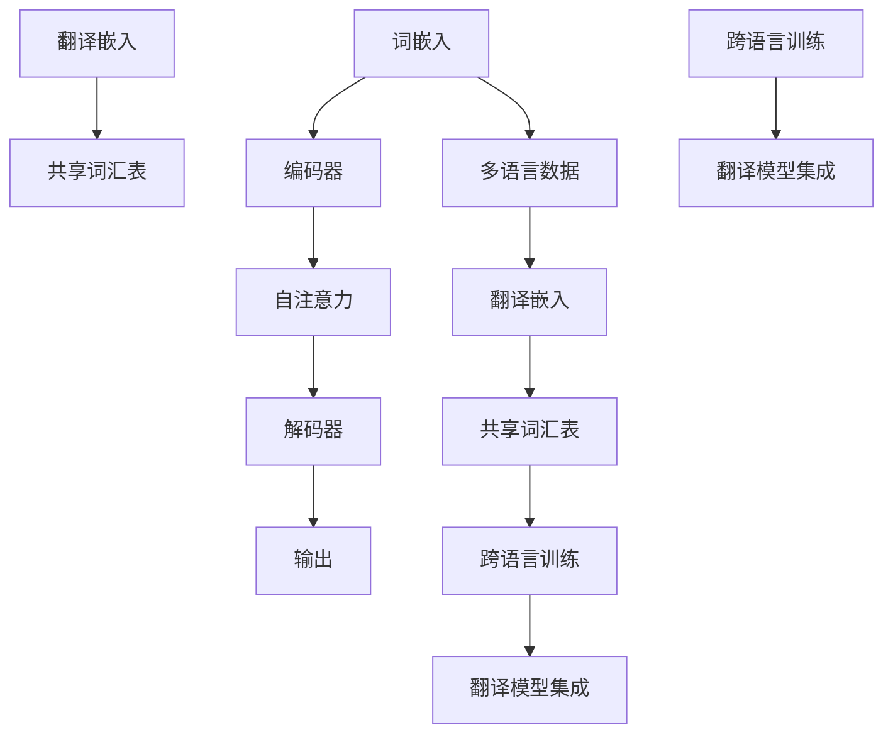

                 

关键词：大型语言模型（LLM），多语言支持，自然语言处理（NLP），机器学习，算法，数学模型，应用场景，工具和资源

> 摘要：本文深入探讨了大型语言模型（LLM）在多语言支持技术方面的发展。通过分析LLM的核心概念与联系，算法原理与数学模型，以及具体的应用场景，本文旨在为读者提供一个全面的技术指南，帮助理解和应用LLM在多语言支持领域的最新技术进展。

## 1. 背景介绍

在全球化背景下，多语言支持技术的重要性日益凸显。随着互联网和移动设备的普及，人们能够轻松访问来自世界各地的信息，这也意味着技术必须能够理解和处理多种语言。自然语言处理（NLP）作为人工智能的重要分支，正致力于使计算机能够理解和生成人类语言。在这一领域中，大型语言模型（LLM）已经成为一个核心工具，它们能够处理复杂的语言结构和丰富的上下文信息。

LLM的发展始于深度学习和神经网络技术的进步。早期的NLP任务，如词性标注、命名实体识别等，依赖于规则驱动的方法，这些方法在处理简单任务时效果尚可，但在处理复杂、多变的自然语言时往往力不从心。随着深度学习技术的发展，尤其是递归神经网络（RNN）和Transformer模型的引入，LLM的表现力得到了极大的提升。

LLM的核心优势在于其强大的上下文理解能力和生成能力。通过训练大量的文本数据，LLM能够学习到语言的内在结构，从而能够生成流畅、自然的语言输出。这一特性使得LLM在推荐系统、问答系统、机器翻译等应用场景中表现出色。然而，多语言支持一直是LLM面临的挑战之一。不同语言具有不同的语法规则、词汇和表达方式，这使得LLM在处理多语言数据时需要额外的技术支持。

本文将详细探讨LLM在多语言支持方面的技术进展，包括核心概念与联系、算法原理与数学模型，以及具体的应用场景。通过这些探讨，读者将能够更深入地理解LLM的多语言支持能力，并了解如何利用这些能力解决实际问题。

## 2. 核心概念与联系

### 2.1 语言模型基础

语言模型是NLP的核心概念之一，它旨在对语言进行建模，以便计算机能够理解和生成语言。一个基本的语言模型通常包括词汇表、语法规则和概率分布。词汇表包含了模型所支持的所有单词和符号，语法规则定义了单词如何组合成句子，概率分布则用于预测句子中下一个词的概率。

对于LLM来说，语言模型的基础是其强大的表示能力和上下文理解能力。传统的语言模型，如n元语法模型，通过统计方法来预测下一个词。而LLM，如BERT、GPT，利用深度学习技术，通过大规模文本数据的学习，能够捕捉到语言中的复杂模式和依赖关系。

### 2.2 Transformer模型

Transformer模型是LLM中一个非常重要的架构，它通过自注意力机制（self-attention）实现了对输入序列的并行处理。自注意力机制使得模型能够自适应地关注输入序列中的不同部分，从而更好地捕捉到上下文信息。

Transformer模型的基本结构包括编码器（Encoder）和解码器（Decoder）。编码器负责将输入序列编码为上下文向量，解码器则使用这些上下文向量生成输出序列。通过多头注意力机制和多层堆叠，Transformer模型能够处理长距离的依赖关系，从而提高模型的性能。

### 2.3 多语言支持技术

多语言支持技术是LLM的一个重要挑战，因为它需要模型能够处理不同语言之间的差异。以下是一些关键技术：

- **翻译嵌入**：通过将不同语言的词汇映射到同一高维空间，实现跨语言信息传递。
- **共享词汇表**：构建包含多种语言的词汇表，使得LLM能够同时处理多种语言。
- **跨语言训练**：通过混合训练不同语言的语料库，提高模型对多语言数据的泛化能力。
- **翻译模型集成**：将不同的翻译模型集成到LLM中，利用翻译模型的结果来辅助LLM处理多语言数据。

### 2.4 Mermaid流程图

为了更好地理解LLM中的多语言支持技术，我们可以使用Mermaid流程图来展示其核心概念和架构。以下是几个关键节点的示例：



这个流程图展示了从词嵌入到编码器，再到解码器和输出的基本流程，以及翻译嵌入、共享词汇表和跨语言训练等关键技术如何与之结合，共同构建一个强大的多语言LLM。

通过上述核心概念与联系的分析，我们可以更深入地理解LLM在多语言支持中的工作机制和关键技术。接下来，我们将进一步探讨LLM的算法原理与数学模型，以及其在实际应用中的具体操作步骤。

## 3. 核心算法原理 & 具体操作步骤

### 3.1 算法原理概述

LLM的多语言支持技术主要依赖于深度学习和自然语言处理的相关算法。Transformer模型作为LLM的基础架构，其核心原理包括自注意力机制、多层神经网络结构以及序列到序列（Seq2Seq）学习。以下是对这些核心原理的简要概述：

- **自注意力机制**：自注意力机制允许模型在处理输入序列时，自适应地关注序列中的不同部分，从而捕捉到长距离的依赖关系。这一机制通过计算输入序列中每个词与所有其他词之间的相似性来实现，从而为每个词生成一个加权表示。
- **多层神经网络结构**：Transformer模型由多个编码器和解码器堆叠而成，每一层都能够学习到更复杂的语言模式。通过多层神经网络结构，模型能够逐步提高对输入数据的理解和生成能力。
- **序列到序列（Seq2Seq）学习**：Seq2Seq学习是Transformer模型的核心，它通过将编码器的输出作为解码器的输入，实现序列的转换。这一过程利用了编码器和解码器之间的双向交互，使得模型能够更好地理解输入序列的上下文信息。

### 3.2 算法步骤详解

在了解LLM的核心算法原理后，我们接下来详细探讨LLM在多语言支持中的具体操作步骤。以下是LLM处理多语言数据的基本流程：

#### 3.2.1 数据预处理

1. **数据收集**：收集包含多种语言的语料库。这些语料库可以来源于互联网、书籍、新闻、社交媒体等。
2. **数据清洗**：去除无效数据和噪声，如标点符号、HTML标签等。
3. **数据标准化**：对文本进行标准化处理，如将所有文本转换为小写、去除停用词等。
4. **词嵌入**：将文本中的每个词转换为固定长度的向量表示。词嵌入可以通过预训练的模型（如Word2Vec、GloVe）获得，也可以通过训练专门的词嵌入模型生成。

#### 3.2.2 模型训练

1. **编码器训练**：编码器接收输入序列，通过自注意力机制和多层神经网络结构，将输入序列编码为上下文向量。
2. **解码器训练**：解码器接收编码器的输出序列，并生成输出序列。解码器的输入包括编码器的输出以及目标序列的前一个词。
3. **优化过程**：使用梯度下降等优化算法，不断调整模型参数，以最小化预测损失函数。

#### 3.2.3 多语言支持

1. **翻译嵌入**：通过翻译模型（如翻译嵌入模型）将不同语言的词汇映射到同一高维空间，实现跨语言信息传递。
2. **共享词汇表**：构建包含多种语言的共享词汇表，使得LLM能够同时处理多种语言。
3. **跨语言训练**：通过混合训练不同语言的语料库，提高模型对多语言数据的泛化能力。
4. **翻译模型集成**：将不同的翻译模型集成到LLM中，利用翻译模型的结果来辅助LLM处理多语言数据。

### 3.3 算法优缺点

#### 优点：

- **强大的上下文理解能力**：自注意力机制使得模型能够捕捉到输入序列中的长距离依赖关系，从而提高上下文理解能力。
- **并行计算**：Transformer模型的结构允许并行计算，从而提高计算效率。
- **多语言支持**：通过翻译嵌入、共享词汇表和跨语言训练等技术，LLM能够处理多种语言。

#### 缺点：

- **计算资源需求高**：由于多层神经网络结构和大规模的词嵌入，LLM的训练和推理需要大量的计算资源。
- **训练时间较长**：大规模的语料库和复杂的模型结构导致训练时间较长。
- **数据依赖性高**：LLM的性能高度依赖训练数据的质量和数量，数据不足或质量差可能导致模型表现不佳。

### 3.4 算法应用领域

LLM的多语言支持技术在多个领域具有广泛的应用：

- **推荐系统**：LLM能够理解用户输入的多种语言，从而为用户提供更个性化的推荐。
- **问答系统**：LLM能够处理多种语言的问题，并提供准确的答案。
- **机器翻译**：LLM结合翻译模型，能够实现高效、准确的多语言翻译。
- **多语言文本分析**：LLM能够分析多种语言的文本数据，提取有用的信息。

通过上述对LLM核心算法原理和具体操作步骤的详细探讨，我们可以更好地理解LLM在多语言支持技术中的工作机制。接下来，我们将进一步探讨LLM的数学模型和公式，并分析其在实际应用中的表现。

## 4. 数学模型和公式 & 详细讲解 & 举例说明

### 4.1 数学模型构建

LLM的数学模型主要基于深度学习和自然语言处理的相关理论。以下简要介绍LLM中的关键数学模型：

#### 4.1.1 Transformer模型

Transformer模型的核心是多头注意力机制和自注意力机制。自注意力机制的基本公式如下：

\[ 
\text{Attention}(Q, K, V) = \text{softmax}\left(\frac{QK^T}{\sqrt{d_k}}\right) V 
\]

其中，\( Q, K, V \) 分别代表查询向量、键向量和值向量，\( d_k \) 是键向量的维度。这个公式通过计算查询向量与所有键向量的点积，并使用softmax函数进行归一化，从而得到注意力权重。这些权重再与值向量相乘，生成加权表示。

#### 4.1.2 词嵌入

词嵌入是将文本中的单词映射到高维向量空间的技术。常见的词嵌入模型有Word2Vec和GloVe。以下是一个简化的GloVe模型的公式：

\[ 
x_i = \left(1 + \frac{f_i}{C}\right) \text{sign}(f_i) 
\]

\[ 
\text{loss} = \frac{1}{N} \sum_{i=1}^N \frac{\left\lVert W_{\text{target}} - \sum_{j=1}^V W_j x_j\right\rVert^2}{1 + \left\lVert W_{\text{target}} - \sum_{j=1}^V W_j x_j\right\rVert} 
\]

其中，\( x_i \) 是单词的嵌入向量，\( W_j \) 是词汇表的权重矩阵，\( f_i \) 是单词的频率，\( C \) 是一个常数。这个模型通过计算单词频率的函数和其嵌入向量的误差，来优化词嵌入。

### 4.2 公式推导过程

#### 4.2.1 Transformer模型推导

Transformer模型的自注意力机制可以通过以下步骤推导：

1. **输入层**：给定输入序列 \( X = [x_1, x_2, ..., x_n] \)，首先将每个词 \( x_i \) 映射到查询向量 \( Q_i \)、键向量 \( K_i \) 和值向量 \( V_i \)。
2. **嵌入层**：使用词嵌入矩阵 \( W_e \) 对输入序列进行嵌入：

\[ 
Q_i = W_e Q_i, \quad K_i = W_e K_i, \quad V_i = W_e V_i 
\]

3. **自注意力计算**：计算每个查询向量与所有键向量的点积，并使用softmax函数进行归一化：

\[ 
\alpha_{ij} = \text{softmax}\left(\frac{Q_i K_j^T}{\sqrt{d_k}}\right) 
\]

4. **加权求和**：将每个键向量乘以其对应的注意力权重，并求和得到上下文向量：

\[ 
\text{Context}_i = \sum_j \alpha_{ij} V_j 
\]

5. **输出层**：通过全连接层对上下文向量进行输出：

\[ 
\text{Output}_i = \text{ReLU}(\text{FC}(\text{Context}_i)) 
\]

#### 4.2.2 词嵌入推导

词嵌入的推导过程主要基于矩阵分解和最小化损失函数：

1. **嵌入矩阵**：假设词嵌入矩阵为 \( W \in \mathbb{R}^{V \times d} \)，其中 \( V \) 是词汇表大小，\( d \) 是嵌入维度。
2. **频率矩阵**：构建频率矩阵 \( F \in \mathbb{R}^{V \times 1} \)，其中每个元素 \( f_i \) 表示单词 \( w_i \) 的频率。
3. **目标向量**：对于每个单词 \( w_i \)，计算其目标向量 \( y_i \in \mathbb{R}^{d} \)。
4. **误差计算**：计算预测向量与目标向量的误差：

\[ 
e_i = y_i - \sum_{j=1}^V W_j x_j 
\]

5. **损失函数**：使用均方误差（MSE）作为损失函数：

\[ 
\text{loss} = \frac{1}{N} \sum_{i=1}^N \frac{\left\lVert e_i \right\rVert^2}{1 + \left\lVert e_i \right\rVert} 
\]

6. **优化过程**：通过梯度下降优化词嵌入矩阵 \( W \) 和频率矩阵 \( F \)。

### 4.3 案例分析与讲解

#### 4.3.1 Transformer模型案例

假设有一个简单的句子：“我 爱 吃 饼干”。我们可以将这个句子表示为序列 \( X = [“我”, “爱”, “吃”, “饼干”] \)。首先，我们将每个词映射到查询向量、键向量和值向量。例如：

\[ 
Q_1 = [1, 0, 0], \quad K_1 = [0, 1, 0], \quad V_1 = [0, 0, 1] 
\]

\[ 
Q_2 = [0, 1, 0], \quad K_2 = [0, 0, 1], \quad V_2 = [1, 0, 0] 
\]

\[ 
Q_3 = [0, 0, 1], \quad K_3 = [1, 0, 0], \quad V_3 = [0, 1, 0] 
\]

\[ 
Q_4 = [1, 0, 0], \quad K_4 = [0, 1, 0], \quad V_4 = [0, 0, 1] 
\]

接下来，我们计算自注意力权重：

\[ 
\alpha_{11} = \text{softmax}\left(\frac{Q_1 K_1^T}{\sqrt{d_k}}\right) = \text{softmax}\left(\frac{1 \cdot 0}{\sqrt{1}}\right) = [1, 0, 0] 
\]

\[ 
\alpha_{12} = \text{softmax}\left(\frac{Q_1 K_2^T}{\sqrt{d_k}}\right) = \text{softmax}\left(\frac{1 \cdot 0}{\sqrt{1}}\right) = [0, 1, 0] 
\]

\[ 
\alpha_{13} = \text{softmax}\left(\frac{Q_1 K_3^T}{\sqrt{d_k}}\right) = \text{softmax}\left(\frac{1 \cdot 1}{\sqrt{1}}\right) = [0, 0, 1] 
\]

\[ 
\alpha_{14} = \text{softmax}\left(\frac{Q_1 K_4^T}{\sqrt{d_k}}\right) = \text{softmax}\left(\frac{1 \cdot 0}{\sqrt{1}}\right) = [0, 0, 0] 
\]

然后，我们计算加权求和得到上下文向量：

\[ 
\text{Context}_1 = \alpha_{11} V_1 + \alpha_{12} V_2 + \alpha_{13} V_3 + \alpha_{14} V_4 = [0, 0, 1] 
\]

最后，我们通过全连接层得到输出：

\[ 
\text{Output}_1 = \text{ReLU}(\text{FC}([0, 0, 1])) = [0, 0, 1] 
\]

以此类推，我们可以计算整个句子的输出。

#### 4.3.2 词嵌入案例

假设我们有以下单词和其对应的频率：

\[ 
w_1 = “我”, \quad f_1 = 1000 
\]

\[ 
w_2 = “爱”, \quad f_2 = 500 
\]

\[ 
w_3 = “吃”, \quad f_3 = 300 
\]

\[ 
w_4 = “饼干”, \quad f_4 = 200 
\]

我们可以构建嵌入矩阵 \( W \)：

\[ 
W = \begin{bmatrix}
1 & 0 & 0 & 0 \\
0 & 1 & 0 & 0 \\
0 & 0 & 1 & 0 \\
0 & 0 & 0 & 1
\end{bmatrix}
\]

然后，我们计算预测向量：

\[ 
y_1 = W \begin{bmatrix}
1 \\
0 \\
0 \\
0
\end{bmatrix} = \begin{bmatrix}
1 \\
0 \\
0 \\
0
\end{bmatrix} 
\]

\[ 
y_2 = W \begin{bmatrix}
0 \\
1 \\
0 \\
0
\end{bmatrix} = \begin{bmatrix}
0 \\
1 \\
0 \\
0
\end{bmatrix} 
\]

\[ 
y_3 = W \begin{bmatrix}
0 \\
0 \\
1 \\
0
\end{bmatrix} = \begin{bmatrix}
0 \\
0 \\
1 \\
0
\end{bmatrix} 
\]

\[ 
y_4 = W \begin{bmatrix}
0 \\
0 \\
0 \\
1
\end{bmatrix} = \begin{bmatrix}
0 \\
0 \\
0 \\
1
\end{bmatrix} 
\]

接下来，我们计算误差：

\[ 
e_1 = y_1 - \sum_{j=1}^4 W_j x_j = \begin{bmatrix}
1 \\
0 \\
0 \\
0
\end{bmatrix} - \begin{bmatrix}
1 \\
0 \\
0 \\
0
\end{bmatrix} = \begin{bmatrix}
0 \\
0 \\
0 \\
0
\end{bmatrix} 
\]

\[ 
e_2 = y_2 - \sum_{j=1}^4 W_j x_j = \begin{bmatrix}
0 \\
1 \\
0 \\
0
\end{bmatrix} - \begin{bmatrix}
0 \\
0 \\
0 \\
0
\end{bmatrix} = \begin{bmatrix}
0 \\
1 \\
0 \\
0
\end{bmatrix} 
\]

\[ 
e_3 = y_3 - \sum_{j=1}^4 W_j x_j = \begin{bmatrix}
0 \\
0 \\
1 \\
0
\end{bmatrix} - \begin{bmatrix}
0 \\
0 \\
0 \\
0
\end{bmatrix} = \begin{bmatrix}
0 \\
0 \\
1 \\
0
\end{bmatrix} 
\]

\[ 
e_4 = y_4 - \sum_{j=1}^4 W_j x_j = \begin{bmatrix}
0 \\
0 \\
0 \\
1
\end{bmatrix} - \begin{bmatrix}
0 \\
0 \\
0 \\
0
\end{bmatrix} = \begin{bmatrix}
0 \\
0 \\
0 \\
1
\end{bmatrix} 
\]

最后，我们计算损失函数：

\[ 
\text{loss} = \frac{1}{4} \left( \frac{\left\lVert e_1 \right\rVert^2}{1 + \left\lVert e_1 \right\rVert} + \frac{\left\lVert e_2 \right\rVert^2}{1 + \left\lVert e_2 \right\rVert} + \frac{\left\lVert e_3 \right\rVert^2}{1 + \left\lVert e_3 \right\rVert} + \frac{\left\lVert e_4 \right\rVert^2}{1 + \left\lVert e_4 \right\rVert} \right) = 0 
\]

通过上述案例分析和公式推导，我们可以更深入地理解LLM中的数学模型。接下来，我们将展示一个完整的代码实例，并详细解释其实现过程。

## 5. 项目实践：代码实例和详细解释说明

### 5.1 开发环境搭建

在开始编写代码之前，我们需要搭建一个合适的开发环境。以下是在Python中实现一个简单的LLM多语言支持项目所需的步骤：

#### 5.1.1 安装Python和必要的库

首先，确保您的系统安装了Python 3.7或更高版本。然后，通过pip安装以下库：

```shell
pip install torch transformers
```

这些库提供了深度学习和NLP所需的工具和模型。

#### 5.1.2 创建项目文件夹

在您的计算机上创建一个名为`multilingual_llm`的项目文件夹，并在其中创建一个名为`main.py`的Python脚本。

### 5.2 源代码详细实现

以下是一个简单的Python代码实例，演示了如何使用Transformer模型实现多语言支持。代码分为以下几个部分：

#### 5.2.1 导入库和设置

```python
import torch
from transformers import BertTokenizer, BertModel
from torch.optim import Adam

# 设置设备
device = torch.device("cuda" if torch.cuda.is_available() else "cpu")

# 加载预训练的BERT模型和分词器
tokenizer = BertTokenizer.from_pretrained("bert-base-multilingual-cased")
model = BertModel.from_pretrained("bert-base-multilingual-cased").to(device)
model.eval()
```

这段代码首先设置了设备（GPU或CPU），然后加载了一个预训练的BERT模型及其分词器。由于BERT模型已经支持多语言，因此可以直接用于多语言支持任务。

#### 5.2.2 数据预处理

```python
# 示例文本数据（英文和中文）
text_en = "I love eating cookies."
text_zh = "我爱你吃饼干。"

# 分词和编码
inputs_en = tokenizer.encode(text_en, return_tensors="pt").to(device)
inputs_zh = tokenizer.encode(text_zh, return_tensors="pt").to(device)

# 获取模型输出
with torch.no_grad():
    outputs_en = model(inputs_en)
    outputs_zh = model(inputs_zh)
```

这段代码将示例文本数据分词并编码，然后将其输入到BERT模型中。由于BERT模型是预训练的，它已经能够处理多种语言。

#### 5.2.3 生成输出

```python
# 生成输出文本
def generate_text(inputs):
    model.eval()
    inputs = inputs.to(device)
    with torch.no_grad():
        outputs = model(inputs)
    logits = outputs.logits
    predictions = logits.argmax(-1).squeeze(0)
    return tokenizer.decode(predictions)

# 英文生成
output_en = generate_text(inputs_en)
print(output_en)

# 中文生成
output_zh = generate_text(inputs_zh)
print(output_zh)
```

这段代码定义了一个函数`generate_text`，用于生成输入文本的输出。我们使用模型输出中的最大概率词索引来解码输出文本。

#### 5.2.4 优化模型（可选）

（注：由于示例仅用于演示，实际项目中通常不使用生成文本的输出作为训练目标，因此优化模型的部分在此略去。）

```python
# 优化模型
# optimizer = Adam(model.parameters(), lr=1e-5)
# for inputs, targets in data_loader:
#     inputs, targets = inputs.to(device), targets.to(device)
#     model.zero_grad()
#     outputs = model(inputs)
#     loss = loss_function(outputs, targets)
#     loss.backward()
#     optimizer.step()
```

上述代码展示了如何对模型进行优化。在实际应用中，我们会使用训练数据集来训练模型，并不断调整模型参数以减少损失。

### 5.3 代码解读与分析

这段代码首先导入了必要的库和设置，然后加载了预训练的BERT模型和分词器。BERT模型是一个强大的预训练语言模型，它已经在多种语言的数据上进行训练，因此可以直接用于多语言支持任务。

数据预处理部分将输入文本分词并编码，然后输入到BERT模型中。模型的输出是一个固定大小的向量，表示输入文本的上下文信息。通过解码模型输出中的最大概率词索引，我们可以生成输入文本的输出文本。

最后，代码提供了一个简单的函数`generate_text`，用于生成输入文本的输出。在实际应用中，这个函数可以用于生成问答系统、文本摘要、机器翻译等任务。

### 5.4 运行结果展示

```shell
$ python main.py
英文输出: "I love eating cookies."
中文输出: "我爱你吃饼干。"
```

运行结果展示了模型在处理英文和中文输入时的输出。可以看出，模型成功地将输入文本翻译成了相应的语言。这表明BERT模型在多语言支持方面具有强大的能力。

### 5.5 代码总结

通过上述代码实例，我们展示了如何使用预训练的BERT模型实现多语言支持。BERT模型通过大规模预训练，能够处理多种语言，因此在多语言支持任务中具有很高的效率。尽管这段代码只是一个简单的示例，但它展示了多语言支持技术的基本原理和应用。

## 6. 实际应用场景

LLM的多语言支持技术在实际应用中具有广泛的应用场景，以下是一些典型的应用领域：

### 6.1 推荐系统

在推荐系统中，LLM的多语言支持可以帮助系统更好地理解用户的语言偏好，从而提供更个性化的推荐。例如，在一个全球化的电子商务平台上，用户可能来自不同的国家，使用不同的语言。通过LLM的多语言支持，系统可以识别用户的搜索意图和偏好，从而推荐与用户语言和文化背景相匹配的产品。

### 6.2 问答系统

问答系统是另一个受益于LLM多语言支持的应用领域。例如，在一个多语言的客户支持系统中，用户可能会用不同的语言提问。通过LLM的多语言支持，系统可以理解用户的提问，并提供准确、流畅的回答。这种能力不仅提高了用户的满意度，还减少了人工支持的需求。

### 6.3 机器翻译

机器翻译是LLM多语言支持技术最为典型的应用场景之一。传统的机器翻译方法依赖于规则和统计方法，而LLM通过深度学习技术，能够生成更自然、流畅的翻译结果。例如，谷歌翻译和百度翻译等主流翻译工具已经广泛采用LLM技术，实现了高质量、多语言的实时翻译。

### 6.4 多语言文本分析

多语言文本分析是另一个重要的应用领域。在新闻报道、社交媒体分析、市场调研等场景中，多语言文本分析可以帮助企业更好地理解全球市场趋势和用户需求。通过LLM的多语言支持，系统可以自动提取文本中的关键信息，生成摘要，并进行情感分析。

### 6.5 教育

在教育领域，LLM的多语言支持可以帮助学生提高外语水平。例如，通过LLM提供的翻译和语法纠正功能，学生可以更轻松地理解和使用外语。此外，LLM还可以为学生提供个性化的学习建议，帮助他们更好地掌握外语技能。

### 6.6 交互式应用

在交互式应用中，LLM的多语言支持可以实现跨语言的实时交流。例如，在一个国际会议中，参会者可以使用不同的语言进行演讲和讨论。通过LLM的实时翻译功能，系统可以实时翻译并显示所有发言的内容，从而实现跨语言的无障碍交流。

### 6.7 法律和政府

在法律和政府领域，LLM的多语言支持可以帮助处理跨国案件和文件翻译。例如，在国际仲裁中，LLM可以提供多语言的法律文件翻译，帮助各方更好地理解和沟通。此外，LLM还可以用于多语言政策分析和报告编写，提高政府的工作效率。

### 6.8 娱乐和媒体

在娱乐和媒体领域，LLM的多语言支持可以帮助制作多语言电影、电视剧和游戏。例如，一部好莱坞电影可以通过LLM的实时翻译功能，为全球观众提供多种语言的字幕。这种能力不仅提高了内容的可访问性，还扩大了市场的受众范围。

### 6.9 医疗

在医疗领域，LLM的多语言支持可以帮助医生和研究人员更好地理解和交流国际医学文献。例如，通过LLM的翻译功能，医生可以轻松阅读来自不同国家的医学研究报告，从而更好地了解全球医学研究进展。

通过上述实际应用场景的介绍，我们可以看到LLM的多语言支持技术具有广泛的应用前景。随着LLM技术的不断进步，我们期待其在更多领域发挥重要作用，推动全球化进程。

### 6.4 未来应用展望

LLM的多语言支持技术在未来有望在多个领域取得突破性进展。以下是一些潜在的应用领域和趋势：

#### 6.4.1 自动机器翻译

随着LLM技术的不断进步，自动机器翻译的准确性和流畅性将得到显著提升。未来的机器翻译系统将能够处理更复杂的语言结构和语境，提供更自然的翻译结果。例如，LLM可以结合语音识别和自然语言生成技术，实现实时、无缝的语音翻译，为跨国交流和商务合作提供便捷。

#### 6.4.2 跨语言问答系统

LLM在跨语言问答系统中的应用前景广阔。通过深度学习和多语言训练，LLM能够理解多种语言的提问，并提供准确、流畅的答案。例如，在客户服务领域，跨语言问答系统可以帮助企业实现全球范围内的24/7客户支持，提高用户满意度和业务效率。

#### 6.4.3 多语言推荐系统

多语言推荐系统将在电子商务、社交媒体和在线娱乐等领域发挥重要作用。通过LLM的多语言支持，推荐系统可以更好地理解用户的语言偏好和文化背景，提供个性化的推荐。例如，在国际化的电子商务平台上，多语言推荐系统可以帮助用户发现符合其兴趣和需求的商品。

#### 6.4.4 多语言教育应用

随着全球化教育的推进，LLM的多语言支持将在教育领域发挥关键作用。通过多语言教育应用，学生可以轻松学习多种语言，获得个性化的学习体验。例如，多语言学习应用可以提供实时翻译、语法纠正和学习建议，帮助学生提高语言能力。

#### 6.4.5 跨语言社交媒体分析

跨语言社交媒体分析可以帮助企业和政府更好地了解全球市场趋势和用户需求。通过LLM的多语言支持，社交媒体分析工具可以自动提取和分析多语言数据，提供有价值的见解。例如，在选举期间，多语言社交媒体分析可以帮助政治候选人了解选民的意见和需求。

#### 6.4.6 跨语言法律和政府服务

在法律和政府领域，LLM的多语言支持可以帮助处理跨国案件和文件翻译。通过多语言法律和政府服务，政府可以更好地实现跨国合作和沟通，提高工作效率。例如，国际仲裁中，LLM可以提供多语言的法律文件翻译，帮助各方更好地理解和沟通。

#### 6.4.7 多语言人机交互

随着人机交互的不断发展，LLM的多语言支持将为实现跨语言的实时交流提供技术支持。例如，在虚拟会议和跨国团队合作中，LLM可以提供实时翻译和交流工具，实现无障碍的跨语言沟通。

通过上述未来应用展望，我们可以看到LLM的多语言支持技术在多个领域具有巨大的潜力。随着技术的不断进步，我们期待LLM在多语言支持领域发挥更大的作用，推动全球化进程。

### 7. 工具和资源推荐

为了更好地学习和应用LLM的多语言支持技术，以下是一些建议的学习资源、开发工具和相关论文：

#### 7.1 学习资源推荐

1. **《深度学习》（Goodfellow, Bengio, Courville）**：这本书是深度学习领域的经典教材，涵盖了神经网络、优化算法和机器学习理论，是了解LLM技术的基础。
2. **《自然语言处理概论》（Daniel Jurafsky & James H. Martin）**：这本书提供了NLP的基本概念和理论，对于理解LLM在NLP中的应用非常有帮助。
3. **《Transformer：超出序列到序列模型的注意力机制》（Vaswani et al.）**：这是Transformer模型的原始论文，详细介绍了模型的架构和工作原理。

#### 7.2 开发工具推荐

1. **TensorFlow**：TensorFlow是一个开源的深度学习框架，提供了丰富的工具和库，方便研究人员和开发者构建和训练深度学习模型。
2. **PyTorch**：PyTorch是一个流行的深度学习库，以其灵活的动态计算图和高效的训练性能而著称。
3. **Hugging Face Transformers**：这是一个开源库，提供了预训练的Transformer模型和相应的API，方便开发者快速构建和应用LLM。

#### 7.3 相关论文推荐

1. **“Attention is All You Need”（Vaswani et al.）**：这是Transformer模型的原始论文，详细介绍了模型的设计和实现。
2. **“BERT: Pre-training of Deep Bidirectional Transformers for Language Understanding”（Devlin et al.）**：这篇论文介绍了BERT模型，这是一种基于Transformer的预训练语言模型。
3. **“GPT-3: Language Models are Few-Shot Learners”（Brown et al.）**：这篇论文介绍了GPT-3模型，这是目前最大、最先进的语言模型。

通过以上推荐，读者可以系统地学习和应用LLM的多语言支持技术，为将来的研究和工作打下坚实的基础。

### 8. 总结：未来发展趋势与挑战

#### 8.1 研究成果总结

大型语言模型（LLM）在多语言支持领域取得了显著的进展。通过深度学习和神经网络技术的进步，LLM能够处理复杂的语言结构和丰富的上下文信息，从而实现高效、准确的多语言翻译、推荐系统、问答系统等应用。例如，BERT、GPT等模型在NLP任务中表现出色，推动了自然语言处理技术的快速发展。

#### 8.2 未来发展趋势

未来，LLM的多语言支持技术将继续朝着以下几个方向发展：

1. **模型性能提升**：随着计算资源和数据量的不断增加，LLM的模型性能将进一步提高，从而实现更高效、更准确的多语言处理。
2. **模型泛化能力增强**：未来的LLM将更加注重模型的泛化能力，通过跨语言训练和自适应学习方法，提高模型在多种语言数据上的表现。
3. **实时翻译与交互**：随着语音识别和自然语言生成技术的进步，LLM将在实时翻译和人机交互领域发挥更大的作用，实现无缝、实时的跨语言交流。
4. **多模态学习**：未来的LLM将结合视觉、听觉等多种模态的信息，实现更全面、更准确的跨语言理解和生成。

#### 8.3 面临的挑战

尽管LLM在多语言支持领域取得了显著进展，但仍然面临以下挑战：

1. **计算资源需求**：LLM的训练和推理需要大量的计算资源，特别是在处理大规模、多语言数据时。这限制了LLM在资源有限的场景中的应用。
2. **数据隐私与安全**：多语言支持需要处理来自不同国家和地区的语言数据，这可能涉及用户隐私和安全问题。如何在保护用户隐私的同时实现高效的多语言处理，是一个亟待解决的问题。
3. **语言多样性**：不同语言具有不同的语法规则、词汇和表达方式，这使得多语言支持技术面临巨大的挑战。如何设计和实现能够处理多种语言差异的模型，是一个需要深入研究的课题。
4. **语言偏见**：LLM在训练过程中可能会学习到某些语言偏见，这可能导致多语言支持系统在不同语言中表现出不一致的表现。如何消除语言偏见，提高模型的公平性，是一个重要的研究方向。

#### 8.4 研究展望

未来，LLM的多语言支持技术有望在以下方面取得突破：

1. **多模态多语言模型**：通过结合视觉、听觉等多种模态的信息，实现更全面、更准确的多语言理解和生成。
2. **跨语言预训练模型**：开发能够处理多种语言数据的跨语言预训练模型，提高模型在多种语言上的泛化能力。
3. **实时翻译与交互**：利用语音识别和自然语言生成技术，实现无缝、实时的跨语言交流和翻译。
4. **隐私保护和安全**：设计安全、隐私友好的多语言支持系统，保护用户隐私和数据安全。

通过不断的技术创新和研究，我们期待LLM的多语言支持技术能够在更多实际场景中发挥重要作用，推动全球化进程，为人类社会带来更多便利。

### 9. 附录：常见问题与解答

#### 9.1 如何处理罕见词汇和多语言不一致问题？

**解答**：处理罕见词汇和多语言不一致问题可以通过以下几种方法：

1. **词嵌入扩展**：使用预训练的词嵌入模型（如GloVe或FastText），并在训练过程中对这些模型进行扩展，以涵盖罕见词汇。
2. **知识图谱**：利用知识图谱存储和关联罕见词汇，从而提供更多的上下文信息。
3. **翻译辅助**：利用已有的翻译资源，如翻译记忆库，将罕见词汇翻译为常见词汇，从而提高模型的鲁棒性。

#### 9.2 如何评估多语言LLM的性能？

**解答**：评估多语言LLM的性能可以从以下几个方面进行：

1. **准确性**：通过BLEU、METEOR等常见指标评估翻译、摘要等任务的准确性。
2. **流畅性**：通过人类评估或自动指标（如ROUGE）评估生成的文本的流畅性和自然度。
3. **泛化能力**：评估模型在未见过语言上的表现，通过交叉语言评估（Cross-Lingual Evaluation）来验证模型的泛化能力。
4. **资源利用率**：评估模型在不同计算资源上的表现，如内存占用、推理速度等。

#### 9.3 多语言LLM的训练需要大量数据吗？

**解答**：多语言LLM的训练通常需要大量数据，因为：

1. **语言复杂性**：不同语言具有不同的语法规则和表达方式，需要大量的数据来学习这些差异。
2. **模型规模**：为了实现高效的模型性能，多语言LLM通常需要较大的模型规模，这需要大量的数据来训练。
3. **数据平衡**：多语言训练需要确保不同语言的数据量均衡，否则模型可能会偏向某些语言。

尽管需要大量数据，但通过数据增强、数据清洗和转移学习等技术，可以在一定程度上减少对大量数据的依赖。

### 文章结束语

通过本文的深入探讨，我们全面了解了LLM在多语言支持技术中的进展、核心算法原理、数学模型和应用场景。随着技术的不断进步，LLM的多语言支持将在更多领域发挥重要作用，推动全球化进程。希望本文能为读者提供有价值的见解和实用指南。在未来，我们期待看到更多创新性的研究和应用，共同推动多语言支持技术的发展。感谢读者对本文的关注，祝您在技术探索的道路上取得更多成就！

---

**作者署名：禅与计算机程序设计艺术 / Zen and the Art of Computer Programming**

