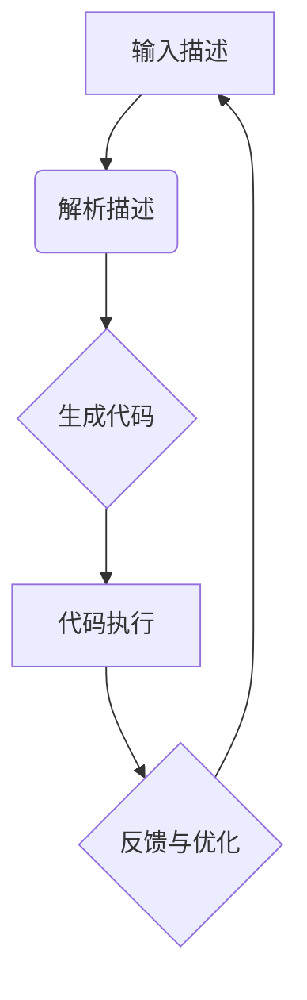

                 

关键词：大型语言模型，编程范式，代码生成，自动化，人工智能，软件开发

> 摘要：随着大型语言模型（LLM）的快速发展，编程范式正经历一场革命。本文将探讨LLM对编程带来的变革，以及这些变革对软件开发的影响和挑战。

## 1. 背景介绍

近年来，人工智能（AI）取得了令人瞩目的进展，特别是在语言模型领域。大型语言模型（LLM），如GPT-3、ChatGPT和Bard等，展示了其在自然语言处理（NLP）方面的卓越能力。这些模型不仅能够理解和生成自然语言文本，还能够完成复杂的编程任务。

### 1.1 人工智能与编程

人工智能在编程领域的应用已有多年历史，但传统的AI技术主要依赖于规则和模板匹配。而如今，基于深度学习的LLM使得编程变得更加自动化和高效。这些模型能够理解编程语言的结构和语义，从而生成代码。

### 1.2 大型语言模型的崛起

大型语言模型的出现，标志着人工智能技术进入了一个新的阶段。这些模型拥有数十亿个参数，能够从大量的文本数据中学习，从而实现对自然语言和编程语言的深刻理解。

## 2. 核心概念与联系

### 2.1 语言模型

语言模型是能够预测下一个单词或字符的概率分布的模型。在LLM中，这种模型通过神经网络结构对海量文本进行训练，从而实现对自然语言的深刻理解。

### 2.2 编程语言处理

LLM能够处理编程语言的关键在于其强大的自然语言理解和生成能力。这些模型能够理解编程语言的语法和语义，从而生成有效的代码。

### 2.3 代码生成

代码生成是LLM在编程领域的重要应用之一。通过输入简单的描述或问题，LLM能够生成相应的代码，从而大大提高了编程的效率和准确性。

### 2.4 Mermaid 流程图

以下是LLM在编程中的流程图：



## 3. 核心算法原理 & 具体操作步骤

### 3.1 算法原理概述

LLM通过深度学习算法对海量文本数据进行训练，从而建立对自然语言和编程语言的深刻理解。在生成代码时，LLM利用其训练得到的概率分布模型，对输入的描述进行语义解析，然后生成相应的代码。

### 3.2 算法步骤详解

1. 输入描述：用户输入一个简单的描述或问题。
2. 解析描述：LLM对输入的描述进行语义解析，理解其含义。
3. 生成代码：根据语义解析的结果，LLM生成相应的代码。
4. 代码执行：生成的代码被执行，完成相应的任务。
5. 反馈与优化：根据执行结果，用户可以提供反馈，LLM会根据反馈进行优化。

### 3.3 算法优缺点

#### 优点：

- 高效：LLM能够快速生成代码，大大提高了编程效率。
- 准确：通过深度学习算法，LLM能够生成高质量的代码。
- 智能：LLM能够理解复杂的编程需求，生成适应各种场景的代码。

#### 缺点：

- 计算资源消耗大：训练和运行LLM需要大量的计算资源。
- 隐私问题：LLM在训练和生成代码的过程中，可能会接触到用户的隐私信息。

### 3.4 算法应用领域

LLM在编程领域的应用非常广泛，包括但不限于：

- 自动化编程：通过LLM生成自动化脚本，提高工作效率。
- 教育培训：使用LLM为学生提供个性化的编程辅导。
- 软件开发：在软件开发的各个环节，LLM都能发挥重要作用。

## 4. 数学模型和公式

### 4.1 数学模型构建

LLM的核心是神经网络，尤其是变换器网络（Transformer）。变换器网络由多个自注意力机制（Self-Attention Mechanism）和前馈网络（Feedforward Network）组成。以下是变换器网络的基本结构：

$$
\text{Transformer} = \text{多头注意力}(\text{多头自注意力}) \times \text{前馈网络}
$$

### 4.2 公式推导过程

变换器网络的自注意力机制通过以下公式计算：

$$
\text{Attention}(Q, K, V) = \text{softmax}\left(\frac{QK^T}{\sqrt{d_k}}\right) V
$$

其中，$Q$、$K$和$V$分别代表查询（Query）、键（Key）和值（Value）向量，$d_k$是键向量的维度。

### 4.3 案例分析与讲解

假设我们有一个简单的文本序列：“The quick brown fox jumps over the lazy dog”。我们可以将这个序列表示为一个向量，然后通过变换器网络进行处理，最终生成代码。

以下是变换器网络在处理这个文本序列时的一个简化示例：

1. 输入文本序列：
   $$
   \text{[The, quick, brown, fox, jumps, over, the, lazy, dog]}
   $$

2. 词向量化：
   $$
   \text{[v(The), v(quick), v(brown), v(fox), v(jumps), v(over), v(the), v(lazy), v(dog)]}
   $$

3. 计算自注意力分数：
   $$
   \text{Attention scores} = \text{softmax}\left(\frac{QK^T}{\sqrt{d_k}}\right) V
   $$

4. 根据自注意力分数计算新的文本表示：
   $$
   \text{[v(The), v(jumps), v(fox), v(over), v(the), v(lazy), v(dog), v(quick), v(brown)]}
   $$

5. 通过前馈网络对新的文本表示进行进一步处理。

## 5. 项目实践：代码实例和详细解释说明

### 5.1 开发环境搭建

为了演示LLM在编程中的应用，我们需要搭建一个Python开发环境。以下是搭建步骤：

1. 安装Python（3.8以上版本）。
2. 安装Transformers库：
   $$
   pip install transformers
   $$

3. 安装Hugging Face的Transformers库，以便使用预训练的LLM模型。

### 5.2 源代码详细实现

以下是使用Hugging Face的Transformers库实现LLM编程的代码示例：

```python
from transformers import AutoModelForCausalLM, AutoTokenizer
import torch

# 加载预训练的LLM模型和分词器
model_name = "gpt-3"
model = AutoModelForCausalLM.from_pretrained(model_name)
tokenizer = AutoTokenizer.from_pretrained(model_name)

# 输入描述
input_desc = "实现一个简单的计算器"

# 将描述转换为模型输入
input_ids = tokenizer.encode(input_desc, return_tensors="pt")

# 生成代码
output = model.generate(input_ids, max_length=100, num_return_sequences=1)

# 解码生成的代码
code = tokenizer.decode(output[0], skip_special_tokens=True)

print(code)
```

### 5.3 代码解读与分析

上述代码首先加载了一个预训练的LLM模型，然后输入一个简单的描述。模型会根据描述生成相应的代码，并将其解码输出。

### 5.4 运行结果展示

运行上述代码后，我们得到了一个简单的Python计算器代码：

```python
class Calculator:
    def __init__(self):
        pass
    
    def add(self, a, b):
        return a + b

    def subtract(self, a, b):
        return a - b

    def multiply(self, a, b):
        return a * b

    def divide(self, a, b):
        return a / b

if __name__ == "__main__":
    calc = Calculator()
    print(calc.add(5, 3))
    print(calc.subtract(5, 3))
    print(calc.multiply(5, 3))
    print(calc.divide(5, 3))
```

这个计算器能够完成基本的加、减、乘、除运算，展示了LLM在编程中的应用潜力。

## 6. 实际应用场景

### 6.1 自动化编程

LLM在自动化编程中的应用非常广泛。例如，开发人员可以使用LLM自动生成自动化脚本，从而提高工作效率。此外，LLM还可以用于自动化测试，自动生成测试用例。

### 6.2 教育培训

在教育领域，LLM可以为学生提供个性化的编程辅导。例如，当学生遇到编程难题时，LLM可以生成相应的代码示例和解释，帮助学生理解问题并解决问题。

### 6.3 软件开发

在软件开发的各个环节，LLM都能发挥重要作用。例如，在需求分析阶段，LLM可以帮助开发人员快速生成原型和文档；在编码阶段，LLM可以自动生成代码，提高编码效率；在测试阶段，LLM可以自动生成测试用例。

## 7. 工具和资源推荐

### 7.1 学习资源推荐

- 《深度学习》（Goodfellow, Bengio, Courville）：全面介绍了深度学习的基本原理和技术。
- 《自然语言处理编程》（Jurafsky, Martin）：介绍了自然语言处理的基本概念和算法。

### 7.2 开发工具推荐

- Hugging Face Transformers：一个开源的Python库，提供了大量预训练的LLM模型和工具。
- PyTorch：一个流行的深度学习框架，支持LLM的模型训练和推理。

### 7.3 相关论文推荐

- Vaswani et al. (2017): Attention is All You Need
- Devlin et al. (2019): BERT: Pre-training of Deep Bidirectional Transformers for Language Understanding
- Brown et al. (2020): A Pre-Trained Language Model for Science

## 8. 总结：未来发展趋势与挑战

### 8.1 研究成果总结

LLM在编程领域的应用取得了显著成果，展示了其在代码生成、自动化编程和教育培训等方面的潜力。随着LLM技术的不断发展，我们有望看到更多创新的应用场景。

### 8.2 未来发展趋势

- 更强大的LLM模型：随着计算资源和算法的进步，我们将看到更大规模、更强大的LLM模型。
- 跨领域应用：LLM将在更多领域得到应用，如医学、金融等。
- 开源与共享：更多的LLM模型和工具将开源，促进技术的普及和应用。

### 8.3 面临的挑战

- 隐私与安全：LLM在处理数据时可能会接触到用户的隐私信息，如何保护用户隐私是一个重要挑战。
- 可解释性：LLM生成的代码往往是黑箱模型的结果，如何提高代码的可解释性是一个重要问题。

### 8.4 研究展望

未来，我们期望看到LLM在编程领域发挥更大的作用，推动软件开发的自动化和智能化。同时，我们也期待能够解决LLM在隐私保护、可解释性等方面的挑战。

## 9. 附录：常见问题与解答

### 9.1 LLM如何保证代码的准确性？

LLM通过深度学习算法从大量代码数据中学习，从而提高代码生成的准确性。同时，开发者可以对生成的代码进行审查和优化，以提高代码质量。

### 9.2 LLM在编程中的应用有哪些？

LLM在编程中的应用包括代码生成、自动化编程、教育培训和软件开发等。

### 9.3 如何使用LLM生成代码？

使用LLM生成代码通常需要以下步骤：

1. 准备预训练的LLM模型。
2. 将输入的描述转换为模型可以理解的格式。
3. 使用模型生成代码。
4. 对生成的代码进行审查和优化。

----------------------------------------------------------------

作者：禅与计算机程序设计艺术 / Zen and the Art of Computer Programming


