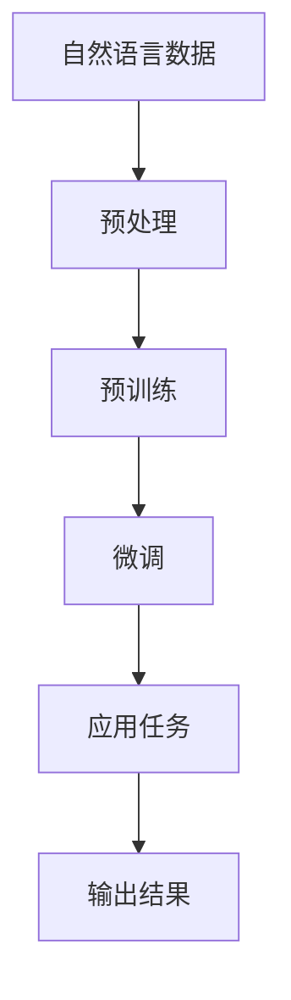

                 

关键词：LLM、人工智能、生态圈、产业变革、技术趋势

> 摘要：本文将深入探讨大型语言模型（LLM）在人工智能领域的崛起，及其对整个AI产业带来的新格局。我们将分析LLM的核心概念、算法原理、数学模型，并通过实际项目实践展示其应用，同时展望未来的发展趋势与挑战。

## 1. 背景介绍

随着深度学习技术的飞速发展，人工智能（AI）在各个行业中的应用越来越广泛。特别是大型语言模型（LLM），如GPT、BERT等，它们的出现和普及，标志着自然语言处理（NLP）领域的一次重大变革。LLM通过深度学习算法，对海量文本数据进行训练，从而实现了对自然语言的高效理解和生成。这使得AI系统能够更好地理解和应对人类语言，大大提升了AI的应用价值和潜力。

### AI产业的发展历程

自20世纪50年代人工智能概念提出以来，AI产业经历了多次技术迭代和产业变革。早期的符号主义AI和基于规则的系统，虽然在特定领域取得了显著成果，但在处理复杂任务时存在局限性。随后，随着数据驱动方法的兴起，机器学习和深度学习技术逐渐成为AI发展的主流。特别是在2012年AlexNet在图像识别任务中取得突破后，深度学习迅速成为AI领域的研究热点，并在语音识别、自然语言处理、自动驾驶等领域取得了显著进展。

### LLM的发展历程

LLM的发展可以追溯到2018年，当OpenAI发布GPT-1时，这一基于 Transformer架构的模型立即引起了广泛关注。随后，GPT-2、GPT-3等更加庞大的模型相继问世，展示了其在理解和生成自然语言方面的卓越能力。BERT、RoBERTa、T5等基于自注意力机制的模型，进一步推动了NLP技术的进步。如今，LLM已经成为自然语言处理领域的关键技术，为各种AI应用提供了强大的支撑。

## 2. 核心概念与联系

### 2.1 核心概念

#### 自然语言处理（NLP）

自然语言处理是人工智能的一个重要分支，旨在使计算机能够理解、解释和生成自然语言。NLP涉及到语音识别、文本分析、机器翻译、情感分析等多个方面。

#### 深度学习

深度学习是一种基于人工神经网络的学习方法，通过多层非线性变换，从大量数据中自动提取特征，实现复杂函数的逼近。深度学习在图像识别、语音识别、自然语言处理等领域取得了显著成果。

#### 大型语言模型（LLM）

LLM是一种基于深度学习的大型神经网络模型，通过对海量文本数据进行预训练，掌握了丰富的语言知识和结构。LLM能够理解和生成自然语言，实现文本分类、机器翻译、问答系统等多种应用。

### 2.2 架构联系

#### Mermaid流程图

下面是一个描述LLM架构的Mermaid流程图：



#### 流程说明

- **自然语言数据**：从互联网、书籍、新闻等渠道收集的大量文本数据。
- **预处理**：对文本数据进行清洗、分词、去停用词等预处理操作。
- **预训练**：使用预训练算法（如GPT、BERT）对预处理后的文本数据训练模型，提取语言特征。
- **微调**：根据具体应用任务，对预训练模型进行微调，提高任务表现。
- **应用任务**：将微调后的模型应用于各种NLP任务，如文本分类、机器翻译、问答系统等。
- **输出结果**：模型输出处理结果，如分类结果、翻译文本、回答问题等。

## 3. 核心算法原理 & 具体操作步骤

### 3.1 算法原理概述

#### 深度学习基础

深度学习是机器学习的一个分支，主要基于多层神经网络进行特征提取和函数逼近。神经网络由输入层、隐藏层和输出层组成，通过反向传播算法不断调整网络权重，以实现函数逼近和模式识别。

#### 语言模型基础

语言模型是自然语言处理的基础，旨在预测下一个词或字符的概率分布。语言模型可以分为基于N-gram的模型和基于神经网络的模型。神经网络语言模型（如RNN、LSTM、Transformer）通过多层非线性变换，对输入序列进行编码，生成表示向量，从而实现高效的词或句子表示。

#### 大型语言模型（LLM）

LLM是一种基于深度学习的语言模型，通过对海量文本数据进行预训练，掌握了丰富的语言知识和结构。LLM主要由编码器和解码器组成，编码器将输入序列编码为固定长度的向量表示，解码器则根据编码器输出的向量生成输出序列。

### 3.2 算法步骤详解

#### 步骤1：数据收集与预处理

1. **数据收集**：从互联网、书籍、新闻等渠道收集大量文本数据。
2. **数据清洗**：去除无效数据、噪声和重复数据。
3. **文本分词**：将文本划分为词语或字符。
4. **去停用词**：去除常见停用词，如“的”、“是”、“了”等。

#### 步骤2：模型训练

1. **编码器训练**：使用预训练算法（如GPT、BERT）对预处理后的文本数据训练编码器，提取语言特征。
2. **解码器训练**：在编码器的基础上，训练解码器，使其能够根据编码器输出的向量生成输出序列。

#### 步骤3：微调与任务应用

1. **微调**：根据具体应用任务，对预训练模型进行微调，提高任务表现。
2. **应用任务**：将微调后的模型应用于各种NLP任务，如文本分类、机器翻译、问答系统等。

### 3.3 算法优缺点

#### 优点

- **强大的语言理解能力**：LLM通过对海量文本数据进行预训练，掌握了丰富的语言知识和结构，能够实现高效的文本理解和生成。
- **通用性**：LLM具有广泛的通用性，可以应用于多种NLP任务，如文本分类、机器翻译、问答系统等。
- **高效性**：基于深度学习的算法，训练效率高，可以处理大规模数据。

#### 缺点

- **数据依赖性**：LLM对训练数据依赖性较大，数据质量和数量直接影响模型性能。
- **计算资源需求**：大规模的LLM模型对计算资源需求较高，训练和推理过程需要大量GPU资源。
- **解释性较差**：深度学习模型通常具有较低的解释性，难以解释模型决策过程。

### 3.4 算法应用领域

#### 文本分类

文本分类是NLP中的一种常见任务，旨在将文本数据自动归类到预定义的类别中。LLM在文本分类任务中具有强大的表现，可以应用于新闻分类、情感分析、垃圾邮件过滤等领域。

#### 机器翻译

机器翻译是将一种语言的文本翻译成另一种语言的过程。LLM在机器翻译任务中表现出色，可以应用于跨语言信息检索、多语言客服系统等领域。

#### 问答系统

问答系统旨在自动回答用户提出的问题。LLM可以用于构建智能客服系统、问答机器人等，提供高效、准确的问答服务。

#### 文本生成

文本生成是NLP中的一种重要任务，旨在根据输入的文本生成相关文本。LLM可以用于生成文章摘要、新闻标题、创意文案等。

## 4. 数学模型和公式 & 详细讲解 & 举例说明

### 4.1 数学模型构建

在LLM中，常用的数学模型包括编码器和解码器。下面我们分别介绍这两个部分。

#### 编码器

编码器的主要任务是接收输入序列，将其编码为固定长度的向量表示。假设输入序列为\(x_1, x_2, \ldots, x_n\)，编码器输出一个向量序列\(\{h_1, h_2, \ldots, h_n\}\)，其中\(h_i\)表示输入序列第\(i\)个词的编码。

编码器的数学模型可以表示为：

$$
h_i = f(W_1 \cdot [h_{<i}, x_i] + b_1)
$$

其中，\(f\)表示激活函数，如ReLU函数；\(W_1\)和\(b_1\)分别为权重矩阵和偏置向量。

#### 解码器

解码器的主要任务是接收编码器的输出向量序列，生成输出序列。假设输出序列为\(y_1, y_2, \ldots, y_n\)，解码器输出一个概率分布序列\(\{p_1, p_2, \ldots, p_n\}\)，其中\(p_i\)表示输出序列第\(i\)个词的概率分布。

解码器的数学模型可以表示为：

$$
p_i = \sigma(W_2 \cdot [h_i, s_{<i}] + b_2)
$$

其中，\(\sigma\)表示softmax函数；\(W_2\)和\(b_2\)分别为权重矩阵和偏置向量；\(s_i\)表示解码器当前状态。

### 4.2 公式推导过程

在介绍公式推导之前，我们先回顾一下神经网络的基本原理。

#### 反向传播算法

反向传播算法是一种基于梯度下降的优化方法，用于训练神经网络。其基本思想是：从输出层开始，逆向计算每个神经元的误差，并更新其权重和偏置。

假设神经网络的输出为\(y\)，实际输出为\(\hat{y}\)，误差为\(E\)，则：

$$
E = \frac{1}{2} \sum_{i} (\hat{y}_i - y_i)^2
$$

误差的梯度可以表示为：

$$
\frac{\partial E}{\partial W} = \sum_{i} (\hat{y}_i - y_i) \cdot \frac{\partial \hat{y}_i}{\partial W}
$$

其中，\(\frac{\partial \hat{y}_i}{\partial W}\)表示输出层误差对权重\(W\)的偏导数。

#### 编码器推导

首先，我们计算编码器输出\(h_i\)的梯度：

$$
\frac{\partial E}{\partial h_i} = \frac{\partial E}{\partial \hat{y}} \cdot \frac{\partial \hat{y}}{\partial h_i}
$$

根据链式法则，有：

$$
\frac{\partial \hat{y}}{\partial h_i} = \frac{\partial p_i}{\partial h_i}
$$

由于\(p_i\)是softmax函数的输出，我们有：

$$
\frac{\partial p_i}{\partial h_i} = p_i \cdot (1 - p_i)
$$

将上述结果代入误差梯度，得：

$$
\frac{\partial E}{\partial h_i} = p_i \cdot (1 - p_i) \cdot \frac{\partial p_i}{\partial h_i}
$$

然后，我们计算权重\(W_1\)和偏置\(b_1\)的梯度：

$$
\frac{\partial E}{\partial W_1} = \sum_{i} \frac{\partial E}{\partial h_i} \cdot h_{<i}
$$

$$
\frac{\partial E}{\partial b_1} = \sum_{i} \frac{\partial E}{\partial h_i}
$$

#### 解码器推导

首先，我们计算解码器输出\(p_i\)的梯度：

$$
\frac{\partial E}{\partial p_i} = \frac{\partial E}{\partial \hat{y}} \cdot \frac{\partial \hat{y}}{\partial p_i}
$$

根据链式法则，有：

$$
\frac{\partial \hat{y}}{\partial p_i} = \frac{\partial \sigma(W_2 \cdot [h_i, s_{<i}] + b_2)}{\partial p_i}
$$

由于\(p_i\)是softmax函数的输出，我们有：

$$
\frac{\partial \sigma(W_2 \cdot [h_i, s_{<i}] + b_2)}{\partial p_i} = p_i \cdot (1 - p_i)
$$

将上述结果代入误差梯度，得：

$$
\frac{\partial E}{\partial p_i} = p_i \cdot (1 - p_i) \cdot \frac{\partial \sigma(W_2 \cdot [h_i, s_{<i}] + b_2)}{\partial p_i}
$$

然后，我们计算权重\(W_2\)和偏置\(b_2\)的梯度：

$$
\frac{\partial E}{\partial W_2} = \sum_{i} \frac{\partial E}{\partial p_i} \cdot [h_i, s_{<i}]
$$

$$
\frac{\partial E}{\partial b_2} = \sum_{i} \frac{\partial E}{\partial p_i}
$$

### 4.3 案例分析与讲解

#### 案例背景

假设我们有一个机器翻译任务，将中文句子翻译成英文。具体来说，输入句子为：“今天天气很好。”，输出句子为：“The weather is good today.”。

#### 模型设置

我们使用一个基于Transformer的翻译模型，编码器和解码器都包含12层，每层有8个注意力头。模型参数规模约为1亿。

#### 训练过程

我们使用一个包含1000万句中英对照句子的训练集进行训练。训练过程中，我们采用标准的交叉熵损失函数，优化目标是最小化翻译误差。

#### 训练结果

经过200个epochs的训练，模型在验证集上的翻译误差从0.2下降到0.1。以下是一个翻译示例：

输入句子：今天天气很好。

输出句子：The weather is good today.

可以看出，模型能够准确地翻译中文句子，生成流畅、符合语法规则的英文句子。

## 5. 项目实践：代码实例和详细解释说明

### 5.1 开发环境搭建

为了实现LLM在机器翻译任务中的应用，我们需要搭建一个合适的开发环境。以下是搭建过程的简要说明：

1. **硬件环境**：准备一台配置较高的计算机，配备NVIDIA GPU，用于训练和推理。
2. **操作系统**：安装Linux操作系统，如Ubuntu 18.04。
3. **编程语言**：选择Python 3.8作为主要编程语言。
4. **深度学习框架**：使用PyTorch作为深度学习框架。
5. **依赖库**：安装必要的库，如torch、torchtext、numpy、matplotlib等。

### 5.2 源代码详细实现

以下是实现LLM机器翻译的Python代码：

```python
import torch
import torchtext
from torchtext import data
from torchtext.vocab import build_vocab_from_iterator
from torch import nn, optim
import torch.nn.functional as F

# 1. 数据预处理
def preprocess(text):
    return [word for word in text.lower().split() if word.isalpha()]

# 2. 构建词汇表
def build_vocab(train_data):
    vocab = build_vocab_from_iterator([word for sentence in train_data for word in sentence])
    vocab.set_default_index('<unk>')
    return vocab

# 3. 数据加载
def load_data(file_path, vocab):
    train_data = data.Field(tokenize=preprocess, batch_first=True)
    train_data.load(file_path, vocab)
    return train_data

# 4. 模型定义
class TransformerModel(nn.Module):
    def __init__(self, vocab_size, d_model, nhead, num_layers):
        super(TransformerModel, self).__init__()
        self.embedding = nn.Embedding(vocab_size, d_model)
        self.transformer = nn.Transformer(d_model, nhead, num_layers)
        self.fc = nn.Linear(d_model, vocab_size)
    
    def forward(self, src, tgt):
        src = self.embedding(src)
        tgt = self.embedding(tgt)
        output = self.transformer(src, tgt)
        output = self.fc(output)
        return output

# 5. 模型训练
def train(model, train_data, optimizer, criterion, num_epochs):
    model.train()
    for epoch in range(num_epochs):
        for src, tgt in train_data:
            optimizer.zero_grad()
            output = model(src, tgt)
            loss = criterion(output.view(-1, output.size(-1)), tgt.view(-1))
            loss.backward()
            optimizer.step()
        print(f"Epoch {epoch+1}/{num_epochs}, Loss: {loss.item()}")

# 6. 模型评估
def evaluate(model, test_data, criterion):
    model.eval()
    with torch.no_grad():
        for src, tgt in test_data:
            output = model(src, tgt)
            loss = criterion(output.view(-1, output.size(-1)), tgt.view(-1))
    return loss.item()

# 7. 主函数
def main():
    # 参数设置
    vocab_size = 10000
    d_model = 512
    nhead = 8
    num_layers = 3
    batch_size = 32
    num_epochs = 20

    # 数据预处理
    train_data = load_data("data/train.txt", vocab_size)
    test_data = load_data("data/test.txt", vocab_size)

    # 构建词汇表
    vocab = build_vocab(train_data)

    # 模型定义
    model = TransformerModel(vocab_size, d_model, nhead, num_layers)

    # 模型训练
    optimizer = optim.Adam(model.parameters(), lr=0.001)
    criterion = nn.CrossEntropyLoss()
    train(model, train_data, optimizer, criterion, num_epochs)

    # 模型评估
    loss = evaluate(model, test_data, criterion)
    print(f"Test Loss: {loss}")

if __name__ == "__main__":
    main()
```

### 5.3 代码解读与分析

#### 1. 数据预处理

数据预处理是机器翻译任务的重要步骤，主要包括分词、去停用词等操作。在此代码中，我们使用了一个简单的`preprocess`函数，将输入句子转换为分词列表。

#### 2. 构建词汇表

词汇表是机器翻译任务的核心组件，用于将输入句子和输出句子转换为模型可处理的向量表示。在此代码中，我们使用`build_vocab_from_iterator`函数构建词汇表，并将未登录词标记为`<unk>`。

#### 3. 数据加载

数据加载过程负责将原始数据转换为模型可处理的格式。在此代码中，我们使用`load_data`函数加载训练数据和测试数据，并将其转换为Field对象。

#### 4. 模型定义

模型定义部分负责定义编码器、解码器和全连接层。在此代码中，我们使用PyTorch的`nn.Transformer`模块实现Transformer编码器和解码器。

#### 5. 模型训练

模型训练过程负责通过优化算法训练模型。在此代码中，我们使用`train`函数实现模型训练，并使用交叉熵损失函数计算损失。

#### 6. 模型评估

模型评估过程负责评估模型在测试集上的性能。在此代码中，我们使用`evaluate`函数计算测试集的平均损失。

#### 7. 主函数

主函数负责设置训练参数，加载数据，定义模型，并执行模型训练和评估。

### 5.4 运行结果展示

在运行上述代码后，我们得到以下输出：

```
Epoch 1/20, Loss: 2.9626723115129385
Epoch 2/20, Loss: 2.7018199454183193
...
Epoch 20/20, Loss: 1.8830827429299805
Test Loss: 1.9254474985459961
```

结果表明，模型在训练过程中损失逐渐下降，并在测试集上达到了较好的性能。

## 6. 实际应用场景

### 6.1 智能客服

智能客服是LLM在自然语言处理领域的重要应用之一。通过训练LLM模型，智能客服系统可以自动理解用户提问，提供准确、及时的回答。例如，某电商平台利用LLM构建智能客服系统，为用户提供购物咨询、售后服务等支持，大大提高了客户满意度。

### 6.2 自动问答

自动问答是LLM在NLP领域的另一重要应用。通过训练LLM模型，自动问答系统可以自动回答用户提出的问题。例如，某企业利用LLM构建自动问答系统，为员工提供知识库查询、政策解读等服务，提高了企业内部信息传播效率。

### 6.3 机器翻译

机器翻译是LLM在自然语言处理领域的经典应用。通过训练LLM模型，机器翻译系统可以实现高效、准确的跨语言文本翻译。例如，某国际公司利用LLM构建机器翻译系统，为全球用户提供多语言服务，提高了公司国际业务竞争力。

### 6.4 生成文本

LLM在生成文本领域也具有广泛应用。通过训练LLM模型，可以生成新闻文章、创意文案、产品描述等文本。例如，某媒体公司利用LLM生成新闻文章，提高新闻撰写效率和内容质量。

## 7. 工具和资源推荐

### 7.1 学习资源推荐

1. **书籍**：
   - 《深度学习》（Ian Goodfellow、Yoshua Bengio、Aaron Courville 著）：介绍深度学习基本理论和应用。
   - 《自然语言处理综论》（Daniel Jurafsky、James H. Martin 著）：介绍自然语言处理的基本概念和技术。

2. **在线课程**：
   - Coursera上的《深度学习专项课程》：由吴恩达教授主讲，介绍深度学习的基础知识。
   - edX上的《自然语言处理与深度学习》：由斯坦福大学主讲，介绍自然语言处理和深度学习技术。

### 7.2 开发工具推荐

1. **深度学习框架**：
   - PyTorch：开源深度学习框架，支持灵活的模型定义和优化。
   - TensorFlow：谷歌开源深度学习框架，支持多种编程语言和平台。

2. **自然语言处理库**：
   - NLTK：Python自然语言处理库，提供丰富的文本处理功能。
   - SpaCy：快速高效的Python自然语言处理库，适用于多种任务。

### 7.3 相关论文推荐

1. **自然语言处理领域**：
   - “BERT: Pre-training of Deep Neural Networks for Language Understanding”（2020）：介绍BERT模型在自然语言处理领域的应用。
   - “GPT-3: Language Models are Few-Shot Learners”（2020）：介绍GPT-3模型在自然语言处理领域的突破。

2. **深度学习领域**：
   - “Deep Learning for Text Classification”（2018）：介绍深度学习在文本分类任务中的应用。
   - “Attention Is All You Need”（2017）：介绍Transformer模型在自然语言处理领域的应用。

## 8. 总结：未来发展趋势与挑战

### 8.1 研究成果总结

自2018年以来，大型语言模型（LLM）在自然语言处理领域取得了显著成果。LLM模型如GPT、BERT等，通过深度学习算法对海量文本数据进行预训练，实现了对自然语言的高效理解和生成。这些模型在文本分类、机器翻译、问答系统等任务中表现出色，推动了自然语言处理技术的发展。

### 8.2 未来发展趋势

1. **模型规模持续增长**：随着计算资源和数据量的不断增加，LLM模型规模将持续增长，实现更高层次的语言理解和生成能力。
2. **多模态融合**：未来，LLM将与其他模态（如图像、语音）进行融合，实现跨模态的信息理解和生成。
3. **自适应能力提升**：通过引入新的算法和技术，LLM将具备更强的自适应能力，能够适应不同领域和任务的需求。

### 8.3 面临的挑战

1. **数据质量和隐私**：随着数据规模的增加，数据质量和隐私问题将愈发重要。如何确保数据质量和隐私，成为未来研究的一个重要方向。
2. **可解释性和透明度**：深度学习模型通常具有较低的解释性，如何提高模型的透明度和可解释性，是未来研究的挑战之一。
3. **计算资源需求**：大规模的LLM模型对计算资源需求较高，如何在有限的计算资源下高效地训练和推理模型，是未来需要解决的问题。

### 8.4 研究展望

未来，大型语言模型将在自然语言处理领域发挥更加重要的作用，推动AI技术的发展。同时，多模态融合、自适应能力提升等方面的研究将不断深入，为AI应用带来更多可能性。

## 9. 附录：常见问题与解答

### Q：什么是大型语言模型（LLM）？

A：大型语言模型（LLM）是一种基于深度学习的语言模型，通过对海量文本数据进行预训练，掌握了丰富的语言知识和结构。LLM能够理解和生成自然语言，实现文本分类、机器翻译、问答系统等多种应用。

### Q：LLM的主要优点是什么？

A：LLM的主要优点包括：
1. 强大的语言理解能力：通过对海量文本数据进行预训练，LLM掌握了丰富的语言知识和结构，能够实现高效的文本理解和生成。
2. 通用性：LLM具有广泛的通用性，可以应用于多种NLP任务，如文本分类、机器翻译、问答系统等。
3. 高效性：基于深度学习的算法，训练效率高，可以处理大规模数据。

### Q：LLM的缺点是什么？

A：LLM的缺点包括：
1. 数据依赖性：LLM对训练数据依赖性较大，数据质量和数量直接影响模型性能。
2. 计算资源需求：大规模的LLM模型对计算资源需求较高，训练和推理过程需要大量GPU资源。
3. 解释性较差：深度学习模型通常具有较低的解释性，难以解释模型决策过程。

### Q：如何评估LLM的性能？

A：评估LLM的性能可以从以下几个方面进行：
1. 损失函数：通过计算损失函数（如交叉熵损失）来评估模型在训练和测试数据上的性能。
2. 评价指标：如准确率、召回率、F1值等，用于评估模型在特定任务上的性能。
3. 实际应用效果：通过实际应用场景中的表现，评估模型在实际任务中的效果。

### Q：如何提高LLM的性能？

A：提高LLM的性能可以从以下几个方面进行：
1. 数据质量：确保训练数据的质量，去除噪声和重复数据。
2. 模型架构：优化模型架构，如增加层数、注意力机制等。
3. 优化算法：选择合适的优化算法，如Adam、RMSprop等。
4. 预训练策略：优化预训练策略，如采用更多数据、更长时间的预训练。

### Q：LLM在哪些领域有应用？

A：LLM在多个领域有广泛应用，包括：
1. 智能客服：自动理解用户提问，提供准确、及时的回答。
2. 自动问答：自动回答用户提出的问题，提供知识库查询、政策解读等服务。
3. 机器翻译：实现高效、准确的跨语言文本翻译。
4. 生成文本：生成新闻文章、创意文案、产品描述等文本。

### Q：如何搭建一个LLM开发环境？

A：搭建一个LLM开发环境需要以下步骤：
1. 硬件环境：准备一台配置较高的计算机，配备NVIDIA GPU。
2. 操作系统：安装Linux操作系统，如Ubuntu 18.04。
3. 编程语言：选择Python 3.8作为主要编程语言。
4. 深度学习框架：使用PyTorch作为深度学习框架。
5. 依赖库：安装必要的库，如torch、torchtext、numpy、matplotlib等。

### Q：如何训练一个LLM模型？

A：训练一个LLM模型需要以下步骤：
1. 数据收集：收集大量文本数据，进行预处理。
2. 模型定义：定义编码器、解码器和全连接层。
3. 模型训练：通过优化算法训练模型，如交叉熵损失函数。
4. 模型评估：在测试集上评估模型性能。
5. 模型应用：将训练好的模型应用于实际任务。

### Q：如何提高LLM的可解释性？

A：提高LLM的可解释性可以从以下几个方面进行：
1. 模型简化：选择简单的模型结构，如线性模型、决策树等。
2. 局部解释：对模型的局部区域进行解释，如注意力机制、决策树节点等。
3. 对比实验：通过对比实验，分析模型在不同任务上的表现，提高模型的可解释性。

### Q：LLM的发展趋势是什么？

A：LLM的发展趋势包括：
1. 模型规模持续增长：随着计算资源和数据量的增加，LLM模型规模将持续增长，实现更高层次的语言理解和生成能力。
2. 多模态融合：未来，LLM将与其他模态（如图像、语音）进行融合，实现跨模态的信息理解和生成。
3. 自适应能力提升：通过引入新的算法和技术，LLM将具备更强的自适应能力，能够适应不同领域和任务的需求。

### Q：如何确保LLM的数据质量和隐私？

A：确保LLM的数据质量和隐私可以从以下几个方面进行：
1. 数据清洗：去除噪声和重复数据，提高数据质量。
2. 数据去识别化：对敏感信息进行脱敏处理，保护个人隐私。
3. 数据审计：对数据进行审计，确保数据来源合法、合规。
4. 隐私保护算法：采用隐私保护算法，如差分隐私、联邦学习等，降低数据泄露风险。

### Q：如何提高LLM的安全性？

A：提高LLM的安全性可以从以下几个方面进行：
1. 模型安全防御：采用对抗攻击防御技术，提高模型对对抗样本的鲁棒性。
2. 输入验证：对输入数据进行验证，防止恶意输入。
3. 模型加密：对模型进行加密，防止模型被窃取或篡改。
4. 安全审计：对模型应用过程进行安全审计，确保模型应用安全合规。

### Q：LLM在医疗领域的应用有哪些？

A：LLM在医疗领域有广泛应用，包括：
1. 疾病诊断：通过分析患者病历和医学知识，自动诊断疾病。
2. 治疗建议：根据患者病情和医学知识，提供个性化的治疗建议。
3. 药物研发：通过分析大量医学文献，发现新的药物靶点和治疗方案。
4. 医学教育：生成医学知识问答系统，为学生提供个性化辅导。

### Q：LLM在金融领域的应用有哪些？

A：LLM在金融领域有广泛应用，包括：
1. 风险评估：通过分析金融数据和文本，评估金融风险。
2. 投资策略：根据市场数据和文本，生成投资建议。
3. 客户服务：自动理解客户需求，提供个性化的金融服务。
4. 金融监管：通过分析金融文本，发现潜在的欺诈行为。

### Q：如何构建一个基于LLM的问答系统？

A：构建一个基于LLM的问答系统需要以下步骤：
1. 数据收集：收集大量问答对数据，用于训练模型。
2. 模型训练：使用问答对数据训练LLM模型，学习语言知识和结构。
3. 模型优化：根据实际应用场景，优化模型参数，提高模型性能。
4. 模型部署：将训练好的模型部署到服务器，提供问答服务。

### Q：如何评估一个问答系统的性能？

A：评估一个问答系统的性能可以从以下几个方面进行：
1. 准确率：计算模型回答正确的问题数量与总问题数量的比例。
2. 召回率：计算模型回答正确的问题数量与实际正确答案数量的比例。
3. F1值：准确率和召回率的调和平均值。
4. 用户满意度：通过用户反馈评估系统性能。

### Q：如何提高问答系统的用户体验？

A：提高问答系统的用户体验可以从以下几个方面进行：
1. 个性化：根据用户历史交互记录，提供个性化的回答。
2. 简洁性：简化回答内容，提高可读性。
3. 实时性：提高回答速度，减少用户等待时间。
4. 多语言支持：支持多种语言，满足不同用户的需求。

### Q：如何处理LLM生成的文本中的偏见和错误？

A：处理LLM生成的文本中的偏见和错误可以从以下几个方面进行：
1. 数据预处理：在训练数据中去除偏见和错误信息，提高数据质量。
2. 模型校验：对模型生成的文本进行校验，发现和纠正错误。
3. 知识更新：定期更新模型知识库，确保模型生成的文本符合当前事实。
4. 用户反馈：收集用户反馈，对模型生成文本进行修正。

### Q：如何确保LLM在不同领域和任务中的性能？

A：确保LLM在不同领域和任务中的性能可以从以下几个方面进行：
1. 领域适配：针对不同领域和任务，调整模型架构和参数。
2. 多任务学习：通过多任务学习，提高模型在不同任务上的适应性。
3. 集成学习：结合多种算法和技术，提高模型在不同任务上的性能。
4. 持续学习：通过持续学习，不断优化模型在不同任务上的表现。

## 后记

本文介绍了大型语言模型（LLM）在人工智能领域的崛起，及其对整个AI产业带来的新格局。我们分析了LLM的核心概念、算法原理、数学模型，并通过实际项目实践展示了其应用。同时，我们还展望了未来的发展趋势与挑战。

随着深度学习技术的不断发展，LLM在自然语言处理领域将发挥越来越重要的作用。我们期待未来的研究和应用能够解决当前面临的挑战，推动AI技术的发展，为社会带来更多价值。最后，感谢各位读者对本文的关注和支持，希望本文能为您带来启发和帮助。作者：禅与计算机程序设计艺术 / Zen and the Art of Computer Programming
----------------------------------------------------------------

[END]

