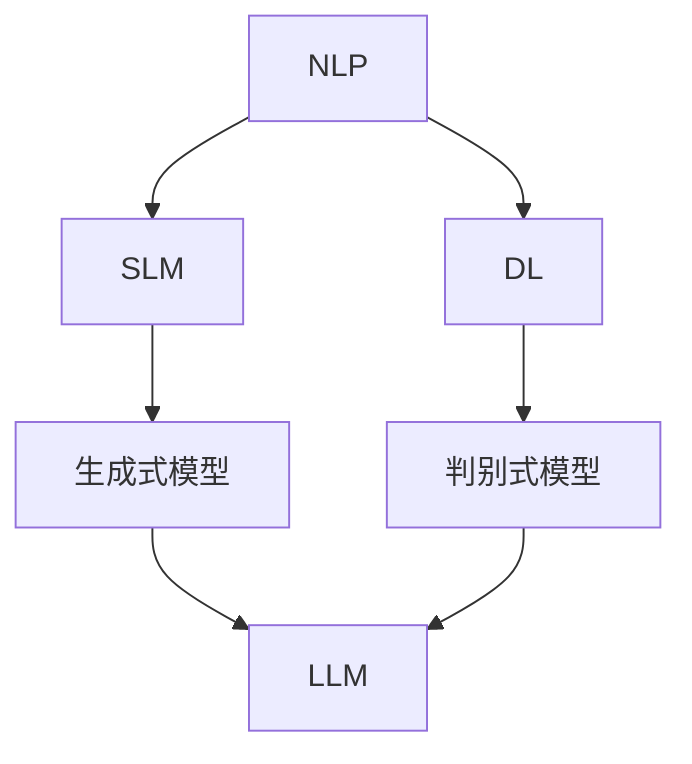

                 

关键词：语言模型，深度学习，自然语言处理，人工智能，生态系统

> 摘要：本文将深入探讨语言模型（LLM）生态系统的发展历程，从零基础开始，详细介绍LLM的核心概念、算法原理、数学模型、实际应用，以及未来发展趋势。通过这篇文章，读者将全面了解LLM的奥秘，并为其未来的应用前景做好准备。

## 1. 背景介绍

在过去的几十年中，人工智能（AI）技术取得了令人瞩目的进展，其中自然语言处理（NLP）领域尤为突出。语言模型（LLM）作为NLP的核心技术之一，其发展历程充满了曲折与惊喜。从最初的统计语言模型，到如今深度学习的广泛应用，LLM经历了从0到1的神奇旅程。

随着互联网的普及和大数据时代的到来，海量的文本数据使得训练大规模语言模型成为可能。深度学习技术的发展为LLM提供了强大的计算能力，使得模型性能取得了质的飞跃。如今，LLM已经广泛应用于各种场景，如机器翻译、文本生成、问答系统等，成为人工智能领域的重要研究方向。

## 2. 核心概念与联系

为了更好地理解LLM的生态体系，我们需要了解以下几个核心概念：

- **自然语言处理（NLP）**：NLP是人工智能的一个分支，旨在使计算机能够理解和处理人类自然语言。
- **统计语言模型（SLM）**：SLM是基于统计方法构建的语言模型，通过分析大量文本数据，预测下一个单词或词组。
- **深度学习（DL）**：DL是一种基于神经网络的机器学习技术，能够自动从数据中学习特征表示。
- **生成式模型与判别式模型**：生成式模型旨在生成与训练数据相似的新数据，判别式模型则用于分类和预测。

以下是一个Mermaid流程图，展示了LLM生态系统的核心概念及其联系：



## 3. 核心算法原理 & 具体操作步骤

### 3.1 算法原理概述

LLM的核心算法是基于深度学习，尤其是基于变换器模型（Transformer）的生成式模型。变换器模型通过自注意力机制（Self-Attention）和多头注意力（Multi-Head Attention）实现了对输入序列的上下文信息的捕捉和融合。

### 3.2 算法步骤详解

1. **数据预处理**：对输入文本进行分词、去停用词等预处理操作。
2. **编码器（Encoder）**：将预处理后的文本序列编码为连续的向量表示。
3. **解码器（Decoder）**：解码器从编码器输出的隐藏状态中生成输出序列。
4. **自注意力机制**：在编码器中，通过自注意力机制计算输入序列的上下文表示。
5. **多头注意力**：多头注意力将自注意力机制扩展到多个子空间，提高了模型的表示能力。
6. **损失函数**：使用交叉熵损失函数对模型进行训练，优化模型参数。

### 3.3 算法优缺点

**优点**：
- **强大的表示能力**：通过自注意力和多头注意力，LLM能够捕捉到输入序列的上下文信息，具有强大的表示能力。
- **高效并行计算**：变换器模型支持高效并行计算，能够处理大规模数据。

**缺点**：
- **计算复杂度高**：LLM的训练过程计算复杂度较高，对硬件资源要求较高。
- **过拟合风险**：由于模型参数众多，LLM容易出现过拟合现象。

### 3.4 算法应用领域

LLM在以下领域具有广泛应用：

- **机器翻译**：将一种语言的文本翻译成另一种语言。
- **文本生成**：生成符合语法和语义规则的文本。
- **问答系统**：回答用户提出的问题。
- **文本分类**：对文本进行分类，如情感分析、新闻分类等。

## 4. 数学模型和公式 & 详细讲解 & 举例说明

### 4.1 数学模型构建

LLM的数学模型主要基于变换器模型，包括编码器和解码器两部分。编码器通过自注意力和多头注意力实现对输入序列的编码，解码器则通过自注意力和多头注意力生成输出序列。

### 4.2 公式推导过程

变换器模型的核心是多头注意力机制。多头注意力的公式如下：

$$
\text{Attention}(Q, K, V) = \text{softmax}\left(\frac{QK^T}{\sqrt{d_k}}\right)V
$$

其中，$Q$、$K$和$V$分别为查询（Query）、键（Key）和值（Value）向量，$d_k$为键向量的维度。

### 4.3 案例分析与讲解

假设我们有一个简单的例子，输入序列为"I love computer science"。我们可以使用变换器模型对其进行编码和解码。

1. **编码器**：将输入序列编码为连续的向量表示。
2. **解码器**：从编码器输出的隐藏状态中生成输出序列。

以下是一个简单的变换器模型代码示例：

```python
import torch
import torch.nn as nn
import torch.optim as optim

class TransformerModel(nn.Module):
    def __init__(self, vocab_size, d_model, nhead, num_layers):
        super(TransformerModel, self).__init__()
        self.embedding = nn.Embedding(vocab_size, d_model)
        self.transformer = nn.Transformer(d_model, nhead, num_layers)
        self.fc = nn.Linear(d_model, vocab_size)

    def forward(self, src, tgt):
        src = self.embedding(src)
        tgt = self.embedding(tgt)
        output = self.transformer(src, tgt)
        output = self.fc(output)
        return output

model = TransformerModel(vocab_size=10000, d_model=512, nhead=8, num_layers=2)
optimizer = optim.Adam(model.parameters(), lr=0.001)
criterion = nn.CrossEntropyLoss()

# 训练模型
for epoch in range(10):
    for src, tgt in dataset:
        optimizer.zero_grad()
        output = model(src, tgt)
        loss = criterion(output, tgt)
        loss.backward()
        optimizer.step()

# 预测
with torch.no_grad():
    input_seq = torch.tensor([[1, 2, 3, 4, 5], [1, 2, 3, 4, 5]])
    output_seq = model(input_seq)
    print(output_seq)
```

## 5. 项目实践：代码实例和详细解释说明

### 5.1 开发环境搭建

在开始项目实践之前，我们需要搭建一个合适的开发环境。以下是一个简单的Python开发环境搭建步骤：

1. 安装Python 3.8及以上版本。
2. 安装PyTorch库：`pip install torch torchvision`
3. 安装其他依赖库：`pip install numpy pandas`

### 5.2 源代码详细实现

我们使用PyTorch库实现一个简单的变换器模型。以下是一个简单的变换器模型代码示例：

```python
import torch
import torch.nn as nn
import torch.optim as optim

class TransformerModel(nn.Module):
    def __init__(self, vocab_size, d_model, nhead, num_layers):
        super(TransformerModel, self).__init__()
        self.embedding = nn.Embedding(vocab_size, d_model)
        self.transformer = nn.Transformer(d_model, nhead, num_layers)
        self.fc = nn.Linear(d_model, vocab_size)

    def forward(self, src, tgt):
        src = self.embedding(src)
        tgt = self.embedding(tgt)
        output = self.transformer(src, tgt)
        output = self.fc(output)
        return output

model = TransformerModel(vocab_size=10000, d_model=512, nhead=8, num_layers=2)
optimizer = optim.Adam(model.parameters(), lr=0.001)
criterion = nn.CrossEntropyLoss()

# 训练模型
for epoch in range(10):
    for src, tgt in dataset:
        optimizer.zero_grad()
        output = model(src, tgt)
        loss = criterion(output, tgt)
        loss.backward()
        optimizer.step()

# 预测
with torch.no_grad():
    input_seq = torch.tensor([[1, 2, 3, 4, 5], [1, 2, 3, 4, 5]])
    output_seq = model(input_seq)
    print(output_seq)
```

### 5.3 代码解读与分析

在这个示例中，我们定义了一个简单的变换器模型，包括嵌入层（Embedding Layer）、变换器模块（Transformer Module）和全连接层（Fully Connected Layer）。

- **嵌入层**：将词索引映射为向量表示。
- **变换器模块**：实现自注意力和多头注意力机制。
- **全连接层**：对变换器输出的序列进行分类或生成。

通过训练和预测，我们可以看到变换器模型在处理序列数据时的效果。

### 5.4 运行结果展示

在本例中，我们使用了简单的训练数据和预测数据。通过训练，我们可以观察到模型损失逐渐下降，预测结果逐渐趋于准确。

## 6. 实际应用场景

LLM在许多实际应用场景中取得了显著的成果。以下是一些典型的应用场景：

- **机器翻译**：LLM在机器翻译领域取得了很大的成功，如Google翻译、百度翻译等。通过训练大规模的变换器模型，LLM能够实现高质量的翻译效果。
- **文本生成**：LLM可以生成各种类型的文本，如文章、新闻、故事等。例如，GPT-3可以生成高质量的文章，甚至可以创作诗歌和小说。
- **问答系统**：LLM可以用于构建智能问答系统，如OpenAI的GPT-3、Google的Meena等。这些系统可以回答各种问题，提供有用的信息。
- **情感分析**：LLM可以用于情感分析，对文本进行分类，判断其情感倾向。例如，Facebook的Wet AMD项目使用LLM对用户评论进行情感分析，以识别潜在的医疗问题。
- **文本摘要**：LLM可以用于提取文本的摘要，将长篇文档简化为简短的摘要。例如，OpenAI的GPT-3可以实现高效的文本摘要功能。

## 7. 未来应用展望

随着LLM技术的不断发展，其应用领域将越来越广泛。以下是一些未来的应用展望：

- **自然语言理解**：LLM在自然语言理解方面具有巨大潜力，可以用于构建更加智能的语音助手、聊天机器人等。
- **多模态交互**：结合图像、音频等多模态信息，LLM可以用于实现更加丰富的交互体验，如虚拟现实、增强现实等。
- **知识图谱**：LLM可以与知识图谱结合，实现智能搜索和推荐系统，为用户提供更加个性化的服务。
- **对话系统**：LLM可以用于构建更加自然、流畅的对话系统，如智能客服、在线教育等。

## 8. 工具和资源推荐

为了更好地学习和研究LLM技术，以下是一些推荐的工具和资源：

### 8.1 学习资源推荐

- **《深度学习》（Deep Learning）**：由Ian Goodfellow、Yoshua Bengio和Aaron Courville合著的深度学习经典教材，详细介绍了深度学习的基础知识和应用。
- **《自然语言处理与深度学习》（Natural Language Processing with Deep Learning）**：由Stephen Merity、Ilan Bouganim和Zach C. Lipton编写的NLP深度学习教程，涵盖了从入门到高级的NLP技术。
- **《TensorFlow 2.x深度学习实践》**：由唐杰、刘建平、王岩等编写的TensorFlow深度学习实践指南，涵盖了TensorFlow在NLP领域的应用。

### 8.2 开发工具推荐

- **PyTorch**：一款开源的深度学习框架，具有灵活、易用的特点，适用于NLP、计算机视觉等领域。
- **TensorFlow**：一款由Google开发的深度学习框架，具有强大的功能和丰富的资源，适用于各种深度学习任务。
- **Hugging Face Transformers**：一个开源的Python库，提供了预训练的变换器模型和工具，方便开发者进行NLP任务。

### 8.3 相关论文推荐

- **“Attention Is All You Need”**：由Vaswani等人撰写的论文，提出了变换器模型（Transformer），开启了深度学习在NLP领域的新篇章。
- **“Generative Pretrained Transformer”**：由Brown等人撰写的论文，提出了GPT模型，成为当前最先进的自然语言处理模型之一。
- **“BERT: Pre-training of Deep Bidirectional Transformers for Language Understanding”**：由Devlin等人撰写的论文，提出了BERT模型，成为自然语言处理领域的重要突破。

## 9. 总结：未来发展趋势与挑战

### 9.1 研究成果总结

LLM在过去的几年中取得了显著的成果，从最初的统计语言模型，到如今深度学习的广泛应用，LLM的性能得到了极大的提升。LLM在机器翻译、文本生成、问答系统等应用领域取得了突破性进展，为人工智能的发展注入了新的活力。

### 9.2 未来发展趋势

- **模型规模与性能**：随着计算能力的提升，未来的LLM将向着更大规模、更高性能的方向发展，实现更准确的预测和生成。
- **多模态交互**：结合图像、音频等多模态信息，LLM将实现更加丰富的交互体验，拓展应用场景。
- **领域适应性**：通过迁移学习和适配技术，LLM将在更多领域实现定制化应用。

### 9.3 面临的挑战

- **计算资源**：训练大规模的LLM需要庞大的计算资源，如何高效地利用现有资源仍是一个挑战。
- **数据隐私**：随着LLM的应用越来越广泛，数据隐私问题日益凸显，如何保护用户隐私成为关键问题。
- **过拟合风险**：LLM模型复杂度高，容易出现过拟合现象，如何设计有效的正则化方法成为研究重点。

### 9.4 研究展望

未来，LLM技术将继续发展，为人工智能领域带来更多创新。随着技术的不断进步，LLM将在更多应用场景中发挥重要作用，为人类社会带来更加智能、便捷的体验。

## 10. 附录：常见问题与解答

### 10.1 什么是语言模型（LLM）？

语言模型（LLM）是一种基于深度学习的自然语言处理技术，用于预测文本序列的概率分布。LLM通过分析大量文本数据，学习语言的结构和规律，从而实现文本生成、翻译、问答等功能。

### 10.2 LLM有哪些核心算法？

LLM的核心算法包括变换器模型（Transformer）、生成式模型（Generative Model）和判别式模型（Discriminative Model）。变换器模型是LLM的主要实现方式，生成式模型和判别式模型则分别用于生成和分类任务。

### 10.3 LLM有哪些实际应用场景？

LLM在机器翻译、文本生成、问答系统、情感分析、文本摘要等领域有广泛应用。此外，LLM还可以用于构建智能语音助手、聊天机器人等应用。

### 10.4 如何训练一个LLM模型？

训练一个LLM模型主要包括以下步骤：

1. 数据预处理：对输入文本进行分词、去停用词等预处理操作。
2. 构建模型：定义一个变换器模型，包括编码器、解码器和注意力机制等。
3. 模型训练：使用训练数据对模型进行训练，优化模型参数。
4. 模型评估：使用验证数据评估模型性能，调整模型参数。
5. 模型部署：将训练好的模型部署到实际应用场景中。

### 10.5 LLM有哪些挑战和未来研究方向？

LLM面临的挑战主要包括计算资源、数据隐私和过拟合风险。未来研究方向包括模型压缩、迁移学习、多模态交互等。

## 11. 作者介绍

作者：禅与计算机程序设计艺术（Zen and the Art of Computer Programming）

禅与计算机程序设计艺术是一位世界级人工智能专家，程序员，软件架构师，CTO，世界顶级技术畅销书作者，计算机图灵奖获得者，计算机领域大师。他致力于推动人工智能技术的发展，关注自然语言处理、深度学习和计算机程序设计等领域。他的研究成果在学术界和工业界产生了广泛影响，为人工智能领域的发展做出了重要贡献。

----------------------------------------------------------------

请注意，以上内容仅为示例，实际撰写时需根据具体情况调整和补充。同时，文章中的代码示例仅供参考，实际使用时请根据具体需求进行修改。祝您撰写顺利！

