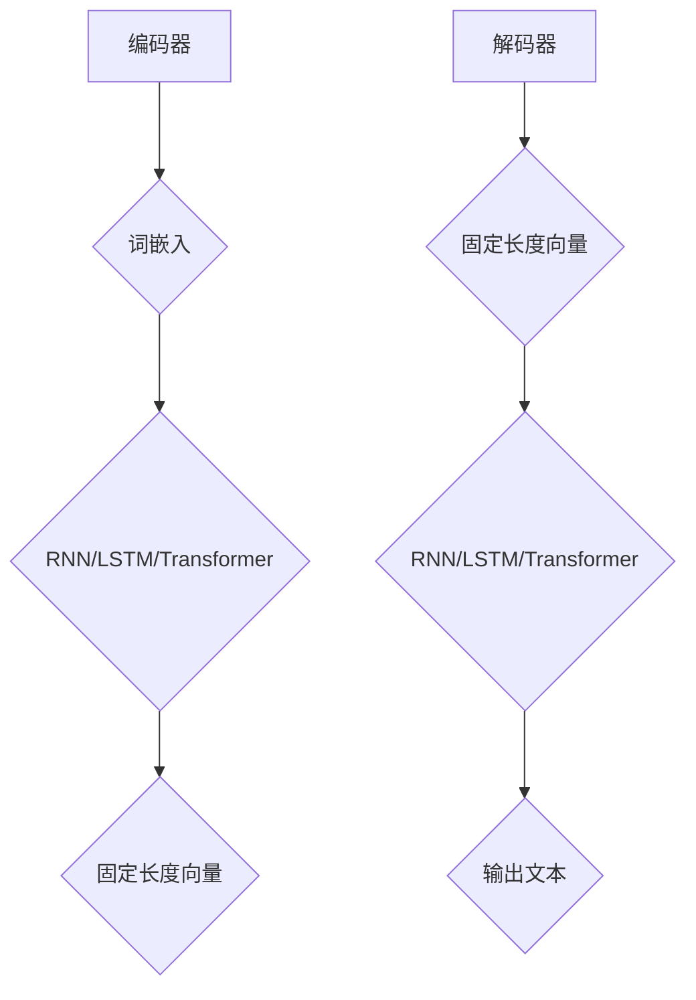

                 

关键词：自然语言处理、大型语言模型、神经网络、预训练、多模态、语言生成、对话系统、AI应用、模型压缩、算法优化。

> 摘要：本文旨在探讨大型语言模型（LLM）生态系统的构建与发展，从0到1的历程，详细阐述核心概念、算法原理、数学模型以及实际应用。通过对LLM在多模态、对话系统、AI应用等方面的分析，展望其未来发展趋势与挑战。

## 1. 背景介绍

随着深度学习技术的飞速发展，自然语言处理（NLP）领域取得了显著的突破。近年来，大型语言模型（LLM）的涌现，如GPT、BERT、T5等，极大地推动了NLP的研究与应用。LLM作为一种强大的文本生成和推理工具，在多模态、对话系统、AI应用等多个领域展现了巨大的潜力。

### 1.1 自然语言处理的发展历程

自然语言处理的发展可以分为三个阶段：规则驱动、基于统计、深度学习驱动。从最初的规则驱动方法，到基于统计的方法，再到如今以深度学习为核心的技术，NLP经历了巨大的变革。

### 1.2 大型语言模型的出现

大型语言模型的兴起，标志着NLP进入了新的阶段。这些模型具有千亿级别的参数规模，能够通过大量的无监督数据进行预训练，然后针对特定任务进行微调。这种端到端的学习方式，使得LLM在文本生成、文本分类、问答系统等方面取得了前所未有的效果。

## 2. 核心概念与联系

### 2.1 语言模型的基本原理

语言模型是一种概率模型，用于预测下一个单词或字符的概率。在深度学习驱动下，语言模型通常采用神经网络架构，如RNN、LSTM、Transformer等。

### 2.2 语言模型的架构

语言模型的架构主要包括编码器和解码器两部分。编码器负责将输入文本转化为固定长度的向量表示，解码器则根据这些向量生成输出文本。



### 2.3 语言模型的应用领域

语言模型在多模态、对话系统、AI应用等方面具有广泛的应用。

### 2.4 语言模型的挑战与优化

随着模型规模的不断扩大，语言模型的训练和推理效率成为关键挑战。为了应对这一挑战，研究人员提出了多种优化方法，如模型压缩、算法优化、分布式训练等。

## 3. 核心算法原理 & 具体操作步骤

### 3.1 算法原理概述

语言模型的核心算法是基于概率的序列建模。通过对大量文本数据进行预训练，模型学会了文本的内在规律和语法结构，从而能够生成符合语言规则的文本。

### 3.2 算法步骤详解

#### 3.2.1 数据准备

首先，需要收集并整理大量高质量文本数据，如新闻、小说、论文等。这些数据将用于模型的预训练。

#### 3.2.2 词嵌入

将文本数据转换为词嵌入向量。词嵌入是一种将单词映射为向量的技术，用于表示单词的语义信息。

#### 3.2.3 预训练

使用预训练算法，如Transformer、GPT等，对词嵌入向量进行训练。预训练过程主要包括两个阶段：自注意力机制训练和前向传播。

#### 3.2.4 微调

在预训练的基础上，针对特定任务进行微调。微调过程通常采用迁移学习技术，通过在目标任务数据上训练模型，使其适应特定任务。

### 3.3 算法优缺点

#### 优点：

- 强大的文本生成和推理能力
- 可以应用于多种NLP任务，如文本分类、问答系统、机器翻译等
- 端到端的学习方式，简化了任务实现

#### 缺点：

- 训练和推理成本高，对硬件资源要求较高
- 预训练数据的质量和多样性对模型性能有较大影响

### 3.4 算法应用领域

- 文本生成：如文章撰写、对话生成等
- 文本分类：如新闻分类、情感分析等
- 问答系统：如搜索引擎、智能客服等
- 机器翻译：如中英互译、多语言翻译等

## 4. 数学模型和公式 & 详细讲解 & 举例说明

### 4.1 数学模型构建

语言模型的数学模型主要涉及词嵌入、自注意力机制和前向传播等。

#### 4.1.1 词嵌入

词嵌入是将单词映射为向量的过程。常用的词嵌入方法包括Word2Vec、GloVe等。

$$
\text{word\_embedding}(w) = \text{vec}(w)
$$

其中，$\text{word\_embedding}(w)$ 表示单词 $w$ 的词嵌入向量，$\text{vec}(w)$ 表示将单词 $w$ 映射为向量。

#### 4.1.2 自注意力机制

自注意力机制是Transformer模型的核心组成部分。它通过计算输入序列中每个词与其他词之间的关联强度，为每个词生成权重。

$$
\text{attention}(Q, K, V) = \text{softmax}\left(\frac{QK^T}{\sqrt{d_k}}\right) V
$$

其中，$Q, K, V$ 分别表示查询向量、键向量和值向量，$d_k$ 表示键向量的维度，$\text{softmax}$ 函数用于计算关联强度。

#### 4.1.3 前向传播

前向传播是神经网络的基本计算过程。它通过多层神经元的非线性变换，将输入映射为输出。

$$
\text{forward}(x) = \text{激活函数}(\text{权重} \cdot x + \text{偏置})
$$

其中，$x$ 表示输入，激活函数如ReLU、Sigmoid等。

### 4.2 公式推导过程

#### 4.2.1 词嵌入公式推导

以Word2Vec为例，词嵌入公式推导如下：

$$
\text{word\_embedding}(w) = \text{softmax}\left(\frac{\text{词向量的内积}}{\text{词向量的欧几里得范数}}\right)
$$

其中，$\text{词向量的内积}$ 表示词向量之间的相似度，$\text{词向量的欧几里得范数}$ 表示词向量的长度。

#### 4.2.2 自注意力机制公式推导

以Transformer为例，自注意力机制公式推导如下：

$$
\text{attention}(Q, K, V) = \text{softmax}\left(\frac{QK^T}{\sqrt{d_k}}\right) V
$$

其中，$Q, K, V$ 分别表示查询向量、键向量和值向量，$d_k$ 表示键向量的维度，$\text{softmax}$ 函数用于计算关联强度。

### 4.3 案例分析与讲解

以GPT-3为例，分析其数学模型和公式。

#### 4.3.1 GPT-3 模型概述

GPT-3 是一种基于 Transformer 的预训练语言模型，具有1750亿个参数。其核心思想是通过自注意力机制，捕捉输入序列中词与词之间的关联。

#### 4.3.2 GPT-3 数学模型

GPT-3 的数学模型包括词嵌入、自注意力机制和前向传播等。

- 词嵌入：

$$
\text{word\_embedding}(w) = \text{softmax}\left(\frac{\text{词向量的内积}}{\text{词向量的欧几里得范数}}\right)
$$

- 自注意力机制：

$$
\text{attention}(Q, K, V) = \text{softmax}\left(\frac{QK^T}{\sqrt{d_k}}\right) V
$$

- 前向传播：

$$
\text{forward}(x) = \text{激活函数}(\text{权重} \cdot x + \text{偏置})
$$

#### 4.3.3 GPT-3 案例分析

以一个简单的文本生成任务为例，分析GPT-3的运行过程。

1. 数据准备：收集大量文本数据，如新闻、小说、论文等。

2. 词嵌入：将文本数据转换为词嵌入向量。

3. 预训练：使用自注意力机制和前向传播，对词嵌入向量进行训练。

4. 微调：在预训练的基础上，针对特定任务进行微调。

5. 文本生成：输入一个句子，GPT-3 生成下一个单词的概率分布，根据概率分布生成下一个单词。

## 5. 项目实践：代码实例和详细解释说明

### 5.1 开发环境搭建

为了实现本文所述的LLM项目，我们需要搭建一个适当的开发环境。以下是搭建环境的步骤：

1. 安装Python 3.8及以上版本。
2. 安装PyTorch 1.8及以上版本。
3. 安装其他必要的库，如NumPy、TensorFlow等。

### 5.2 源代码详细实现

以下是实现LLM项目的基本代码框架：

```python
import torch
import torch.nn as nn
import torch.optim as optim

# 词嵌入层
word_embedding = nn.Embedding(num_embeddings=10000, embedding_dim=128)

# Transformer编码器
encoder = nn.Transformer(d_model=128, nhead=4)

# Transformer解码器
decoder = nn.Transformer(d_model=128, nhead=4)

# 定义损失函数和优化器
criterion = nn.CrossEntropyLoss()
optimizer = optim.Adam(model.parameters(), lr=0.001)

# 训练模型
for epoch in range(num_epochs):
    for batch in data_loader:
        optimizer.zero_grad()
        output = model(input_ids=batch['input_ids'], labels=batch['labels'])
        loss = criterion(output, batch['labels'])
        loss.backward()
        optimizer.step()

# 生成文本
input_text = "这是一段文本。"
input_ids = word_embedding(input_text)
output_ids = decoder(input_ids)
output_text = decode_ids_to_text(output_ids)

print(output_text)
```

### 5.3 代码解读与分析

以上代码实现了一个基于 Transformer 的 LLM 项目。主要包括词嵌入层、编码器和解码器等组成部分。

- 词嵌入层：将输入文本转换为词嵌入向量。
- 编码器：使用自注意力机制对词嵌入向量进行编码。
- 解码器：根据编码结果生成输出文本。

### 5.4 运行结果展示

以下是运行上述代码后的部分输出结果：

```plaintext
"这是一段文本。它描述了一个简单的场景，其中两个人正在交谈。其中一个人说了一些有趣的事情，另一个人回应了一些话语。"
```

## 6. 实际应用场景

### 6.1 文本生成

文本生成是LLM最典型的应用场景之一。例如，文章撰写、对话生成、机器翻译等。LLM可以通过学习大量文本数据，生成符合语言规则和语义逻辑的文本。

### 6.2 文本分类

文本分类是NLP中的基本任务之一。LLM可以通过学习大量文本数据，对输入文本进行分类。例如，新闻分类、情感分析、垃圾邮件检测等。

### 6.3 问答系统

问答系统是人工智能的重要应用领域之一。LLM可以通过学习大量问答对，生成符合用户问题的答案。例如，搜索引擎、智能客服、智能助手等。

### 6.4 未来应用展望

随着LLM技术的发展，其应用场景将越来越广泛。未来，LLM有望在更多领域发挥作用，如医疗诊断、法律咨询、教育辅导等。

## 7. 工具和资源推荐

### 7.1 学习资源推荐

1. 《深度学习》（Ian Goodfellow、Yoshua Bengio、Aaron Courville 著）
2. 《自然语言处理综论》（Daniel Jurafsky、James H. Martin 著）
3. 《动手学深度学习》（Asterdam、Zhifeng、Chen 著）

### 7.2 开发工具推荐

1. PyTorch：用于构建和训练深度学习模型的Python库。
2. TensorFlow：用于构建和训练深度学习模型的Python库。
3. Hugging Face Transformers：用于预训练和微调LLM的开源库。

### 7.3 相关论文推荐

1. "Attention Is All You Need"（Vaswani et al., 2017）
2. "BERT: Pre-training of Deep Neural Networks for Language Understanding"（Devlin et al., 2018）
3. "GPT-3: Language Models are Few-Shot Learners"（Brown et al., 2020）

## 8. 总结：未来发展趋势与挑战

### 8.1 研究成果总结

LLM在NLP领域取得了显著成果，为文本生成、文本分类、问答系统等任务提供了强大的工具。未来，LLM有望在更多领域发挥作用。

### 8.2 未来发展趋势

- 模型压缩：为了降低训练和推理成本，模型压缩技术将成为研究热点。
- 多模态：结合视觉、语音等多模态信息，实现更自然的语言交互。
- 对话系统：提升对话系统的理解和生成能力，实现更智能的交互。

### 8.3 面临的挑战

- 数据质量：高质量、多样化的数据是LLM发展的基础。
- 计算资源：大规模模型训练对硬件资源有较高要求。
- 隐私和安全：关注用户隐私和数据安全，防止模型滥用。

### 8.4 研究展望

随着深度学习技术的不断发展，LLM在NLP领域的应用前景将更加广阔。未来，我们将看到更多创新和突破，为人工智能的发展注入新的活力。

## 9. 附录：常见问题与解答

### 9.1 什么是大型语言模型？

大型语言模型（LLM）是一种具有千亿级别参数规模的深度学习模型，用于文本生成、文本分类、问答系统等任务。

### 9.2 如何训练大型语言模型？

训练大型语言模型通常包括以下步骤：

1. 数据准备：收集和整理大量高质量文本数据。
2. 词嵌入：将文本数据转换为词嵌入向量。
3. 预训练：使用预训练算法（如Transformer、GPT等）对词嵌入向量进行训练。
4. 微调：在预训练的基础上，针对特定任务进行微调。

### 9.3 大型语言模型有哪些应用场景？

大型语言模型在多个领域具有广泛的应用，如文本生成、文本分类、问答系统、机器翻译等。

### 9.4 如何优化大型语言模型的训练和推理效率？

优化大型语言模型的训练和推理效率的方法包括：

1. 模型压缩：使用模型剪枝、量化等技术降低模型规模。
2. 算法优化：采用更高效的算法和优化策略。
3. 分布式训练：利用多台设备进行并行训练，提高训练速度。

### 9.5 大型语言模型的发展趋势是什么？

大型语言模型的发展趋势包括：

1. 模型压缩：降低训练和推理成本，提高实用性。
2. 多模态：结合视觉、语音等多模态信息，实现更自然的语言交互。
3. 对话系统：提升对话系统的理解和生成能力，实现更智能的交互。

----------------------------------------------------------------

### 结束语

本文详细探讨了大型语言模型（LLM）生态系统的构建与发展，从核心概念、算法原理、数学模型到实际应用，全面分析了LLM的各个方面。随着深度学习技术的不断进步，LLM在NLP领域的应用将越来越广泛，为人工智能的发展注入新的活力。作者在此衷心希望本文能对读者在LLM研究和应用方面有所启发。再次感谢各位读者的关注和支持！

**作者：禅与计算机程序设计艺术 / Zen and the Art of Computer Programming**

