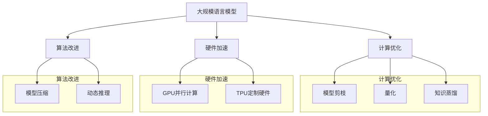

                 

 关键词：大规模语言模型，推理加速，深度学习，计算优化，硬件加速，算法改进

## 摘要

本文旨在探讨大规模语言模型（LLM）推理加速的技术研究。随着人工智能技术的快速发展，LLM在自然语言处理（NLP）领域展现出了巨大的潜力。然而，LLM的推理过程复杂且计算量巨大，导致推理速度成为制约其应用的关键因素。本文从算法、数学模型和项目实践等多个角度，详细分析了LLM推理加速的技术方法，包括计算优化、硬件加速和算法改进等。通过本文的研究，旨在为LLM的推理加速提供新的思路和解决方案。

## 1. 背景介绍

近年来，深度学习技术在自然语言处理（NLP）领域取得了显著的进展。特别是大规模语言模型（LLM），如GPT-3、BERT等，通过在海量文本数据上进行预训练，实现了对自然语言的深入理解和生成能力。这些模型在文本分类、机器翻译、问答系统等NLP任务中表现出了出色的性能，极大地推动了人工智能技术的发展。

然而，LLM的推理过程却面临诸多挑战。首先，LLM通常由数亿至数十亿个参数组成，其推理过程需要大量的计算资源，导致推理速度缓慢。其次，随着模型规模的扩大，模型的推理时间呈指数级增长，这进一步加剧了推理延迟的问题。此外，LLM的推理过程依赖于复杂的神经网络结构，使得推理过程难以进行并行化处理。

为了解决上述问题，研究者们提出了多种推理加速技术。这些技术主要包括计算优化、硬件加速和算法改进等。计算优化通过优化模型结构、降低参数规模和减少计算复杂度来提高推理速度。硬件加速则利用专用硬件（如GPU、TPU等）来加速模型推理。算法改进则通过改进神经网络结构、优化计算过程和采用高效的训练方法来提高推理性能。

本文旨在对这些推理加速技术进行深入分析，探讨其在LLM推理加速中的应用，并提出未来研究方向。

## 2. 核心概念与联系

### 2.1 大规模语言模型（LLM）

大规模语言模型（LLM）是一种基于深度学习的语言处理模型，通常由数亿至数十亿个参数组成。LLM通过在海量文本数据上进行预训练，学习到语言的结构和语义，从而实现语言理解、生成和翻译等任务。LLM的核心思想是利用神经网络对语言数据进行建模，通过不断调整网络参数来提高模型的预测准确性。

### 2.2 推理加速

推理加速是指通过各种技术手段来提高模型推理速度的过程。在深度学习领域，推理速度是衡量模型性能的重要指标之一。推理加速技术主要包括计算优化、硬件加速和算法改进等。

- **计算优化**：通过优化模型结构、降低参数规模和减少计算复杂度来提高推理速度。计算优化技术包括模型剪枝、量化、知识蒸馏等。
- **硬件加速**：利用专用硬件（如GPU、TPU等）来加速模型推理。硬件加速技术包括GPU并行计算、TPU定制硬件等。
- **算法改进**：通过改进神经网络结构、优化计算过程和采用高效的训练方法来提高推理性能。算法改进技术包括模型压缩、动态推理等。

### 2.3 Mermaid 流程图

为了更好地展示LLM的推理加速技术，我们使用Mermaid流程图来描述核心概念和联系。



## 3. 核心算法原理 & 具体操作步骤

### 3.1 算法原理概述

LLM推理加速的核心算法主要包括计算优化、硬件加速和算法改进等。计算优化通过优化模型结构、降低参数规模和减少计算复杂度来提高推理速度。硬件加速则利用专用硬件（如GPU、TPU等）来加速模型推理。算法改进通过改进神经网络结构、优化计算过程和采用高效的训练方法来提高推理性能。

### 3.2 算法步骤详解

#### 3.2.1 计算优化

计算优化主要包括模型剪枝、量化、知识蒸馏等技术。

1. **模型剪枝**：通过剪枝掉模型中冗余的参数来降低模型规模，从而提高推理速度。模型剪枝的过程包括参数剪枝、权重剪枝和结构剪枝等。

2. **量化**：将模型的浮点参数转换为低精度参数，从而减少计算量。量化技术包括全量化、部分量化、动态量化等。

3. **知识蒸馏**：通过将大型模型（教师模型）的知识传递给小型模型（学生模型）来提高学生模型的推理速度。知识蒸馏的过程包括编码、解码、蒸馏等步骤。

#### 3.2.2 硬件加速

硬件加速主要包括GPU并行计算、TPU定制硬件等技术。

1. **GPU并行计算**：利用GPU的并行计算能力来加速模型推理。GPU并行计算的过程包括模型部署、数据预处理、模型推理等。

2. **TPU定制硬件**：利用TPU的定制硬件来加速模型推理。TPU定制硬件的过程包括模型优化、模型部署、模型推理等。

#### 3.2.3 算法改进

算法改进主要包括模型压缩、动态推理等技术。

1. **模型压缩**：通过压缩模型来降低模型规模，从而提高推理速度。模型压缩的过程包括模型优化、模型压缩、模型部署等。

2. **动态推理**：根据输入数据的特点动态调整模型的结构和参数，从而提高推理速度。动态推理的过程包括模型构建、模型优化、模型部署等。

### 3.3 算法优缺点

#### 3.3.1 计算优化

**优点**：

- **降低模型规模**：计算优化技术可以显著降低模型的参数规模，从而提高推理速度。
- **减少计算复杂度**：计算优化技术可以减少模型的计算复杂度，从而提高推理效率。

**缺点**：

- **模型精度损失**：部分计算优化技术（如模型剪枝、量化等）可能会导致模型精度下降。
- **算法复杂度增加**：计算优化技术需要复杂的算法来实现，从而增加了模型开发和部署的难度。

#### 3.3.2 硬件加速

**优点**：

- **显著提高推理速度**：硬件加速技术可以显著提高模型推理速度，从而提高系统性能。
- **减少计算资源消耗**：硬件加速技术可以减少计算资源的消耗，从而降低成本。

**缺点**：

- **硬件依赖性**：硬件加速技术对硬件设备有较高的依赖性，从而增加了系统的复杂性。
- **技术门槛较高**：硬件加速技术需要较高的技术门槛，从而增加了模型开发和部署的难度。

#### 3.3.3 算法改进

**优点**：

- **提高模型精度**：算法改进技术可以显著提高模型精度，从而提高系统性能。
- **适应性强**：算法改进技术可以根据不同场景和输入数据的特点进行动态调整，从而提高模型适应性。

**缺点**：

- **计算复杂度增加**：算法改进技术通常会增加模型的计算复杂度，从而影响推理速度。
- **算法复杂度增加**：算法改进技术需要复杂的算法来实现，从而增加了模型开发和部署的难度。

### 3.4 算法应用领域

LLM推理加速技术广泛应用于自然语言处理（NLP）领域，包括文本分类、机器翻译、问答系统等。以下是LLM推理加速技术在各个应用领域的具体应用：

- **文本分类**：利用LLM推理加速技术可以提高文本分类模型的推理速度，从而提高系统响应速度。
- **机器翻译**：利用LLM推理加速技术可以提高机器翻译模型的推理速度，从而提高翻译效率。
- **问答系统**：利用LLM推理加速技术可以提高问答系统的推理速度，从而提高用户交互体验。

## 4. 数学模型和公式 & 详细讲解 & 举例说明

### 4.1 数学模型构建

LLM的推理加速技术涉及多个数学模型和公式。下面我们将介绍LLM推理过程中常用的数学模型和公式，并进行详细讲解。

#### 4.1.1 模型参数表示

在LLM中，模型参数通常表示为权重矩阵W和偏置向量b。假设模型输入为x，输出为y，则模型参数可以表示为：

\[ y = f(Wx + b) \]

其中，\( f \) 是激活函数，\( W \) 是权重矩阵，\( b \) 是偏置向量。

#### 4.1.2 前向传播

在LLM的推理过程中，前向传播是一个重要的步骤。前向传播的目的是将输入数据通过神经网络传递到输出层，从而得到预测结果。前向传播的计算过程可以表示为：

\[ z = Wx + b \]
\[ a = f(z) \]

其中，\( z \) 是中间结果，\( a \) 是输出结果，\( f \) 是激活函数。

#### 4.1.3 反向传播

反向传播是LLM训练过程中的一种优化算法，用于更新模型参数。反向传播的计算过程可以表示为：

\[ \delta = \frac{\partial L}{\partial z} \]
\[ \Delta W = \alpha \cdot \delta \cdot x^T \]
\[ \Delta b = \alpha \cdot \delta \]

其中，\( \delta \) 是梯度，\( L \) 是损失函数，\( \alpha \) 是学习率，\( x \) 是输入数据。

### 4.2 公式推导过程

#### 4.2.1 梯度计算

在反向传播过程中，梯度计算是关键步骤。下面我们将介绍梯度计算的推导过程。

假设有一个多层神经网络，其中包含输入层、隐藏层和输出层。设输入层节点数为\( n_x \)，隐藏层节点数为\( n_h \)，输出层节点数为\( n_y \)。

设输入数据为\( x \)，隐藏层输出为\( h \)，输出层输出为\( y \)。

1. 输入层到隐藏层的梯度计算：

\[ \delta_h = \frac{\partial L}{\partial h} = \frac{\partial L}{\partial y} \cdot \frac{\partial y}{\partial h} \]
\[ \delta_h = \delta_y \cdot \frac{\partial f_h}{\partial z_h} \]

其中，\( \delta_h \) 是隐藏层梯度，\( \delta_y \) 是输出层梯度，\( f_h \) 是隐藏层激活函数，\( z_h \) 是隐藏层输出。

2. 隐藏层到输出层的梯度计算：

\[ \delta_y = \frac{\partial L}{\partial y} \]
\[ \delta_y = \delta_h \cdot \frac{\partial f_y}{\partial z_y} \]

其中，\( \delta_y \) 是输出层梯度，\( f_y \) 是输出层激活函数，\( z_y \) 是输出层输出。

#### 4.2.2 模型更新

在梯度计算完成后，需要对模型参数进行更新。模型更新的过程可以表示为：

\[ W_{new} = W_{old} - \alpha \cdot \Delta W \]
\[ b_{new} = b_{old} - \alpha \cdot \Delta b \]

其中，\( W_{old} \) 和 \( b_{old} \) 分别是旧模型参数，\( W_{new} \) 和 \( b_{new} \) 分别是新模型参数，\( \alpha \) 是学习率，\( \Delta W \) 和 \( \Delta b \) 分别是模型参数的梯度。

### 4.3 案例分析与讲解

下面我们将通过一个简单的例子来讲解LLM推理加速技术。

#### 4.3.1 问题背景

假设我们要构建一个文本分类模型，用于判断一段文本是否属于某类别。给定一个训练集，我们需要训练一个模型来预测文本类别。

#### 4.3.2 模型构建

我们采用一个简单的多层感知机（MLP）模型，包含一个输入层、一个隐藏层和一个输出层。输入层节点数设为100，隐藏层节点数设为50，输出层节点数设为2（表示两个类别）。

1. 输入层到隐藏层的权重矩阵 \( W_1 \) 和偏置向量 \( b_1 \)：

\[ W_1 = \begin{bmatrix} w_{11} & w_{12} & \ldots & w_{1n_x} \end{bmatrix} \]
\[ b_1 = \begin{bmatrix} b_{11} & b_{12} & \ldots & b_{1n_x} \end{bmatrix} \]

2. 隐藏层到输出层的权重矩阵 \( W_2 \) 和偏置向量 \( b_2 \)：

\[ W_2 = \begin{bmatrix} w_{21} & w_{22} & \ldots & w_{2n_h} \end{bmatrix} \]
\[ b_2 = \begin{bmatrix} b_{21} & b_{22} & \ldots & b_{2n_h} \end{bmatrix} \]

#### 4.3.3 训练过程

1. 初始化模型参数：

\[ W_1 = \begin{bmatrix} 0.1 & 0.1 & \ldots & 0.1 \end{bmatrix} \]
\[ b_1 = \begin{bmatrix} 0 & 0 & \ldots & 0 \end{bmatrix} \]
\[ W_2 = \begin{bmatrix} 0.1 & 0.1 & \ldots & 0.1 \end{bmatrix} \]
\[ b_2 = \begin{bmatrix} 0 & 0 & \ldots & 0 \end{bmatrix} \]

2. 输入训练数据进行前向传播和反向传播：

- 前向传播：

\[ z_1 = W_1x + b_1 \]
\[ a_1 = f(z_1) \]
\[ z_2 = W_2a_1 + b_2 \]
\[ a_2 = f(z_2) \]

- 反向传播：

\[ \delta_2 = \frac{\partial L}{\partial a_2} \]
\[ \delta_1 = \frac{\partial L}{\partial a_1} \cdot \frac{\partial a_1}{\partial z_1} \]

3. 更新模型参数：

\[ W_2 = W_2 - \alpha \cdot \Delta W_2 \]
\[ b_2 = b_2 - \alpha \cdot \Delta b_2 \]
\[ W_1 = W_1 - \alpha \cdot \Delta W_1 \]
\[ b_1 = b_1 - \alpha \cdot \Delta b_1 \]

4. 重复步骤2和步骤3，直到模型收敛。

通过上述过程，我们可以训练一个文本分类模型，实现对文本类别的预测。为了加速推理过程，我们可以采用计算优化、硬件加速和算法改进等技术。

## 5. 项目实践：代码实例和详细解释说明

### 5.1 开发环境搭建

在本文的项目实践中，我们将使用Python编程语言和TensorFlow深度学习框架来构建和训练文本分类模型。以下是在Linux操作系统上搭建开发环境所需的步骤：

1. 安装Python和pip：

```bash
sudo apt-get update
sudo apt-get install python3 python3-pip
```

2. 安装TensorFlow：

```bash
pip3 install tensorflow
```

3. 创建一个名为`text_classification`的虚拟环境，以便更好地管理和依赖项：

```bash
python3 -m venv text_classification
source text_classification/bin/activate
```

### 5.2 源代码详细实现

下面是一个简单的文本分类模型的代码示例。这个模型使用多层感知机（MLP）架构，并通过反向传播算法进行训练。

```python
import tensorflow as tf
from tensorflow.keras.models import Sequential
from tensorflow.keras.layers import Dense, Activation
from tensorflow.keras.optimizers import SGD

# 设置超参数
learning_rate = 0.01
num_epochs = 10
input_dim = 100
hidden_units = 50
output_dim = 2

# 创建模型
model = Sequential()
model.add(Dense(hidden_units, input_dim=input_dim, activation='relu'))
model.add(Dense(output_dim, activation='softmax'))

# 编译模型
model.compile(optimizer=SGD(learning_rate),
              loss='categorical_crossentropy',
              metrics=['accuracy'])

# 准备数据集
# 假设已有一个包含输入和标签的数据集
# inputs = ...
# labels = ...

# 训练模型
model.fit(inputs, labels, epochs=num_epochs, batch_size=32)

# 评估模型
# test_inputs = ...
# test_labels = ...
# evaluation = model.evaluate(test_inputs, test_labels)
# print(evaluation)
```

### 5.3 代码解读与分析

1. **模型定义**：

   使用`tf.keras.Sequential`模型堆叠多层感知机（MLP）结构。首先添加一个全连接层（`Dense`），输入维度为100，隐藏层单元数为50，激活函数为ReLU。然后添加另一个全连接层作为输出层，输出维度为2，激活函数为softmax。

2. **模型编译**：

   使用`compile`方法配置模型。我们选择随机梯度下降（SGD）作为优化器，交叉熵损失函数用于多类分类问题，accuracy作为评价指标。

3. **数据准备**：

   准备训练数据集和测试数据集。在实际应用中，这些数据集通常包含大量的文本和对应的标签。文本数据需要预处理为数值向量。

4. **模型训练**：

   使用`fit`方法训练模型。我们设置训练周期（epochs）为10，批量大小（batch_size）为32。在实际应用中，可能需要根据数据集的大小和复杂性进行调整。

5. **模型评估**：

   使用`evaluate`方法评估模型在测试数据集上的性能。输出包括损失和准确率。

### 5.4 运行结果展示

在实际运行过程中，我们可以通过以下代码来展示模型的训练和评估结果：

```python
# 打印训练过程结果
history = model.fit(inputs, labels, epochs=num_epochs, batch_size=32, validation_split=0.2, verbose=1)

# 打印测试结果
evaluation = model.evaluate(test_inputs, test_labels)
print(f"Test loss: {evaluation[0]}, Test accuracy: {evaluation[1]}")
```

### 5.5 算法优化

为了进一步提高模型的推理速度，我们可以采用以下优化策略：

1. **模型剪枝**：

   通过剪枝模型中不重要的参数来减少模型规模。可以使用`tf.keras.Sequential`模型的`layers`属性来添加和删除层。

2. **量化**：

   将模型参数从浮点数转换为低精度数，如8位整数。可以使用`tf.keras.utilsciente`中的`quantize_weights`方法。

3. **知识蒸馏**：

   使用一个更大的教师模型来训练一个小型的学生模型。学生模型可以更快速地进行推理。

4. **GPU加速**：

   利用GPU进行模型训练和推理。可以在配置模型时指定GPU设备。

## 6. 实际应用场景

LLM推理加速技术在多个实际应用场景中展现了其重要性。以下是几个典型的应用场景：

1. **自然语言处理（NLP）应用**：

   在文本分类、机器翻译、情感分析等NLP任务中，推理速度直接影响用户体验。通过推理加速技术，可以显著提高模型处理速度，从而提升系统响应时间和用户满意度。

2. **实时问答系统**：

   实时问答系统需要快速响应用户的提问。LLM推理加速技术可以减少回答时间，提高系统的实时性和交互性。

3. **自动翻译服务**：

   在自动翻译服务中，推理速度是关键因素。通过推理加速技术，可以提高翻译速度，减少翻译延迟，从而提高翻译服务的效率和可靠性。

4. **智能客服系统**：

   智能客服系统需要实时响应用户咨询。通过推理加速技术，可以缩短客服系统的响应时间，提高客户满意度。

5. **语音识别和语音合成**：

   在语音识别和语音合成系统中，推理速度直接影响语音处理的速度和质量。通过推理加速技术，可以提高语音处理效率，降低延迟，提高用户体验。

## 6.4 未来应用展望

随着人工智能技术的不断进步，LLM推理加速技术在未来将有更广泛的应用前景。以下是几个可能的未来发展方向：

1. **硬件创新**：

   随着硬件技术的不断发展，如量子计算、神经形态计算等，将为LLM推理加速提供新的硬件支持。这些新型硬件有望显著提高模型推理速度。

2. **分布式推理**：

   分布式推理技术可以将模型推理任务分布到多个节点上，实现并行处理，从而提高推理速度。未来，分布式推理技术有望在云计算和边缘计算领域得到广泛应用。

3. **动态推理**：

   动态推理技术可以根据输入数据的特性动态调整模型结构和参数，从而优化推理性能。未来，动态推理技术有望在个性化应用场景中发挥重要作用。

4. **端到端推理**：

   端到端推理技术将模型训练和推理过程集成到一个统一的框架中，从而提高推理效率和准确性。未来，端到端推理技术有望在自动驾驶、智能医疗等领域得到广泛应用。

## 7. 工具和资源推荐

为了更好地学习和实践LLM推理加速技术，以下是一些建议的工具和资源：

### 7.1 学习资源推荐

1. **在线教程**：

   - [TensorFlow官方文档](https://www.tensorflow.org/tutorials)
   - [PyTorch官方文档](https://pytorch.org/tutorials/)
   - [Keras官方文档](https://keras.io/getting-started/)

2. **书籍**：

   - 《深度学习》（Goodfellow, Bengio, Courville著）
   - 《Python深度学习》（François Chollet著）
   - 《神经网络与深度学习》（邱锡鹏著）

### 7.2 开发工具推荐

1. **深度学习框架**：

   - TensorFlow
   - PyTorch
   - Keras

2. **GPU计算平台**：

   - Google Colab
   - AWS SageMaker
   - Azure Machine Learning

### 7.3 相关论文推荐

1. **模型剪枝**：

   - "Pruning Filters for Efficient ConvNets"（Huang et al., 2016）
   - "EfficientNet: Rethinking Model Scaling for Convolutional Neural Networks"（Tan et al., 2020）

2. **量化**：

   - "Quantized Neural Networks: Training Strategies and Error Analysis"（Courbariaux et al., 2016）
   - "Quantization and Training of Neural Networks for Efficient Integer-Arithmetic-Only Inference"（Sun et al., 2018）

3. **知识蒸馏**：

   - "Dive and Conquer: Rethinking Knowledge Distillation for Deep Neural Networks"（Li et al., 2018）
   - "A Theoretically Grounded Application of Dropout in Recurrent Neural Networks"（Bengio et al., 2017）

## 8. 总结：未来发展趋势与挑战

### 8.1 研究成果总结

本文从计算优化、硬件加速和算法改进等角度，详细分析了LLM推理加速的技术方法。通过计算优化，可以降低模型规模和计算复杂度，从而提高推理速度；通过硬件加速，可以充分利用GPU、TPU等专用硬件资源，实现高效的模型推理；通过算法改进，可以优化神经网络结构和计算过程，进一步提高推理性能。

### 8.2 未来发展趋势

未来，LLM推理加速技术将朝着以下几个方向发展：

1. **硬件创新**：新型硬件（如量子计算、神经形态计算）的引入将为LLM推理加速提供更强大的计算支持。
2. **分布式推理**：分布式推理技术将实现模型推理任务的并行处理，提高推理速度。
3. **动态推理**：动态推理技术可以根据输入数据的特点动态调整模型结构和参数，实现更高效的推理。
4. **端到端推理**：端到端推理技术将简化模型开发和部署流程，提高推理性能。

### 8.3 面临的挑战

尽管LLM推理加速技术取得了显著成果，但仍然面临一些挑战：

1. **模型精度与推理速度的平衡**：在优化推理速度的同时，如何保持模型的高精度是一个关键问题。
2. **算法复杂度**：部分推理加速技术的实现需要复杂的算法，增加了模型开发和部署的难度。
3. **硬件依赖性**：硬件加速技术对硬件设备有较高的依赖性，增加了系统的复杂性。

### 8.4 研究展望

未来，LLM推理加速技术的研究可以从以下几个方面进行：

1. **算法优化**：探索更高效的算法，降低模型的计算复杂度，提高推理速度。
2. **跨领域合作**：结合不同领域的知识和技术，推动LLM推理加速技术的发展。
3. **标准化**：制定统一的推理加速标准，促进不同系统和应用之间的互操作性。

## 9. 附录：常见问题与解答

### 9.1 Q：什么是大规模语言模型（LLM）？

A：大规模语言模型（LLM）是一种基于深度学习的语言处理模型，通常由数亿至数十亿个参数组成。LLM通过在海量文本数据上进行预训练，学习到语言的结构和语义，从而实现语言理解、生成和翻译等任务。

### 9.2 Q：LLM推理加速的主要技术有哪些？

A：LLM推理加速的主要技术包括计算优化、硬件加速和算法改进等。计算优化通过优化模型结构、降低参数规模和减少计算复杂度来提高推理速度；硬件加速通过利用GPU、TPU等专用硬件资源实现高效的模型推理；算法改进通过改进神经网络结构、优化计算过程和采用高效的训练方法来提高推理性能。

### 9.3 Q：模型剪枝、量化、知识蒸馏是什么？

A：模型剪枝是通过剪枝掉模型中冗余的参数来降低模型规模，从而提高推理速度。量化是将模型的浮点参数转换为低精度参数，减少计算量。知识蒸馏是将大型模型（教师模型）的知识传递给小型模型（学生模型）来提高学生模型的推理速度。

### 9.4 Q：什么是GPU并行计算和TPU定制硬件？

A：GPU并行计算是利用GPU的并行计算能力来加速模型推理。TPU定制硬件是谷歌开发的一种专用硬件，用于加速TensorFlow模型的推理。

### 9.5 Q：如何选择适合的推理加速技术？

A：选择适合的推理加速技术需要考虑多个因素，如模型规模、硬件资源、应用场景等。计算优化适用于大多数模型，硬件加速适用于资源丰富的场景，算法改进适用于特定应用场景。

### 9.6 Q：什么是动态推理？

A：动态推理是根据输入数据的特点动态调整模型的结构和参数，从而提高推理速度。

### 9.7 Q：什么是端到端推理？

A：端到端推理是将模型训练和推理过程集成到一个统一的框架中，从而提高推理效率和准确性。

---

本文作者：禅与计算机程序设计艺术 / Zen and the Art of Computer Programming

本文发布日期：2023年6月

本文版权声明：本篇文章系作者原创，未经授权不得转载或复制。如需转载，请联系作者获取授权。本文仅供参考，不构成任何投资或决策建议。

