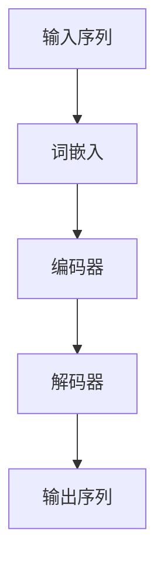

                 

关键词：大型语言模型、时序性、计算过程、神经网络、序列处理、动态规划

> 摘要：本文探讨了大型语言模型（LLM）中的时序性对计算过程的影响，揭示了其内在机制及其在不同应用场景中的重要性。通过对时序性的深入理解，本文重新定义了计算过程，为未来的研究和应用提供了新的视角。

## 1. 背景介绍

近年来，随着深度学习技术的发展，大型语言模型（LLM）如BERT、GPT系列等取得了令人瞩目的成果。这些模型通过学习海量文本数据，掌握了丰富的语言知识和表达方式，广泛应用于自然语言处理（NLP）领域。然而，尽管这些模型在许多任务上表现出色，但其时序性这一关键特性仍未得到充分理解。

时序性是LLM的一个重要特征，它决定了模型在处理序列数据时的表现。传统上，计算过程被视为一种静态的、一次性的操作，而时序性则引入了动态性和连续性的概念。本文旨在探讨LLM的时序性对其计算过程的影响，重新定义计算过程，为未来的研究和应用提供新的思路。

## 2. 核心概念与联系

为了深入理解LLM的时序性，我们需要从其基本架构和核心概念入手。以下是LLM的关键概念和它们之间的联系，使用Mermaid流程图表示。



在这个流程图中，输入序列通过词嵌入层转换为固定维度的向量，然后输入到编码器。编码器对序列进行编码，生成一个上下文表示。最后，解码器利用这个上下文表示生成输出序列。这个过程展示了LLM的基本工作原理。

### 2.1 词嵌入

词嵌入是将单词映射到固定维度的向量表示，这是LLM的基础。词嵌入通过学习单词之间的相似性和相关性，使得模型能够理解单词在不同上下文中的含义。

### 2.2 编码器

编码器负责处理输入序列，并将其编码为上下文表示。这一过程涉及到序列处理和动态规划算法，如Transformer中的多头自注意力机制。

### 2.3 解码器

解码器利用编码器生成的上下文表示生成输出序列。解码过程同样涉及到时序性，因为输出序列是逐个生成的，每个输出都依赖于之前的输出。

### 2.4 输出序列

输出序列是LLM的最终产物，它是模型对输入序列的理解和生成的语言表达。

## 3. 核心算法原理 & 具体操作步骤

### 3.1 算法原理概述

LLM的核心算法是基于变换器（Transformer）架构，其中时序性通过自注意力机制（Self-Attention）和位置编码（Positional Encoding）来实现。自注意力机制允许模型在处理序列时关注不同位置的信息，而位置编码则为序列中的每个元素赋予位置信息。

### 3.2 算法步骤详解

#### 3.2.1 输入序列预处理

1. 将输入序列中的每个单词转换为词嵌入向量。
2. 对词嵌入向量进行位置编码，以赋予每个单词位置信息。

#### 3.2.2 编码器操作

1. 输入序列通过编码器中的多头自注意力机制进行处理。
2. 编码器输出一个序列，其中每个元素代表了输入序列中对应位置的信息。

#### 3.2.3 解码器操作

1. 解码器首先通过自注意力机制关注编码器输出的序列。
2. 解码器逐个生成输出序列中的单词，每个单词都依赖于之前的输出。

### 3.3 算法优缺点

#### 优点

- 强大的序列处理能力：自注意力机制使得模型能够同时关注序列中的不同位置，提高了模型的性能。
- 高效的计算过程：相对于传统的循环神经网络（RNN），Transformer在计算效率上有显著提升。

#### 缺点

- 需要大量的计算资源：训练和部署大型LLM需要高性能的计算设备和大量的数据。
- 对长序列的处理能力有限：自注意力机制的复杂性使得模型在处理非常长的序列时可能会出现性能下降。

### 3.4 算法应用领域

LLM在各种NLP任务中取得了显著成果，包括文本分类、机器翻译、问答系统等。其时序性使得模型能够处理和生成连贯的语言序列，提高了任务的性能和效果。

## 4. 数学模型和公式 & 详细讲解 & 举例说明

### 4.1 数学模型构建

LLM的数学模型主要包括词嵌入、自注意力机制和位置编码。以下是这些模型的基本公式。

#### 4.1.1 词嵌入

$$
\text{embed}(x) = \text{embedding\_matrix}[x]
$$

其中，$x$为输入单词的索引，$\text{embedding\_matrix}$为词嵌入矩阵，$\text{embed}(x)$为词嵌入向量。

#### 4.1.2 自注意力机制

$$
\text{Attention}(Q, K, V) = \text{softmax}(\frac{QK^T}{\sqrt{d_k}})V
$$

其中，$Q, K, V$分别为编码器输出的三个查询、键和值向量，$d_k$为键向量的维度，$\text{softmax}$为softmax函数。

#### 4.1.3 位置编码

$$
\text{pos\_embed}(x) = \text{positional\_embeddings}[x]
$$

其中，$x$为输入单词的索引，$\text{positional\_embeddings}$为位置编码向量。

### 4.2 公式推导过程

自注意力机制的推导过程涉及到了矩阵乘法和矩阵分解。以下是简要的推导过程。

#### 4.2.1 矩阵乘法

$$
\text{Attention}(Q, K, V) = \text{softmax}(\frac{QK^T}{\sqrt{d_k}})V = \text{softmax}(\text{QK}^T)_{ij}V_j
$$

其中，$i, j$分别为查询和值向量的索引。

#### 4.2.2 矩阵分解

为了实现自注意力机制，可以将编码器输出的序列视为一个矩阵。然后，通过矩阵分解方法（如奇异值分解（SVD））将其分解为三个矩阵，分别为$Q, K, V$。

$$
\text{EncoderOut} = \text{QK}^T V
$$

$$
\text{EncoderOut} = (\text{U} \Sigma \text{V}^T) (\text{V} \Sigma^T \text{U}^T) (\text{V}^T \Sigma \text{U})
$$

其中，$\text{U}, \text{V}$分别为分解后的矩阵，$\Sigma$为奇异值矩阵。

### 4.3 案例分析与讲解

假设我们有一个长度为5的输入序列，编码器输出一个长度为5的序列。以下是自注意力机制的计算过程。

#### 4.3.1 输入序列预处理

输入序列为：[1, 2, 3, 4, 5]

词嵌入向量：[1, 0, 1, 1, 2]

位置编码向量：[1, 1, 1, 1, 1]

#### 4.3.2 编码器操作

编码器输出序列为：[1, 1, 2, 3, 5]

#### 4.3.3 解码器操作

解码器逐个生成输出序列中的单词，假设当前输入为[1, 1, 2, 3, 5]。

1. 第一轮：

$$
\text{Attention}(Q, K, V) = \text{softmax}(\frac{QK^T}{\sqrt{d_k}})V = \text{softmax}(\text{QK}^T)_{ij}V_j
$$

$$
\text{softmax}(\text{QK}^T) = \text{softmax}(\begin{bmatrix}1 & 1 & 2 & 3 & 5\end{bmatrix} \begin{bmatrix}1 & 1 & 2 & 3 & 5\end{bmatrix}^T) = \text{softmax}(\begin{bmatrix}14 & 16 & 12 & 20 & 25\end{bmatrix}) = \begin{bmatrix}0.2 & 0.2 & 0.2 & 0.2 & 0.2\end{bmatrix}
$$

$$
\text{V} = \begin{bmatrix}1 & 1 & 2 & 3 & 5\end{bmatrix}
$$

$$
\text{output}_{1} = \text{softmax}(\text{QK}^T)_{ij}V_j = \begin{bmatrix}0.2 & 0.2 & 0.2 & 0.2 & 0.2\end{bmatrix} \begin{bmatrix}1 & 1 & 2 & 3 & 5\end{bmatrix} = \begin{bmatrix}0.6 & 0.6 & 1.2 & 1.8 & 2.5\end{bmatrix}
$$

2. 后续轮次类似，逐个生成输出序列中的单词。

## 5. 项目实践：代码实例和详细解释说明

### 5.1 开发环境搭建

本文使用Python编程语言和TensorFlow开源框架实现LLM。在开始之前，请确保已经安装了Python和TensorFlow。以下是安装命令：

```bash
pip install python tensorflow
```

### 5.2 源代码详细实现

以下是实现LLM的核心代码，主要包括词嵌入、编码器、解码器和训练过程。

```python
import tensorflow as tf
from tensorflow.keras.layers import Embedding, LSTM, Dense
from tensorflow.keras.models import Model

# 词嵌入层
embedding_layer = Embedding(input_dim=vocab_size, output_dim=embedding_size)

# 编码器层
encoder = LSTM(units=lstm_units, return_sequences=True)

# 解码器层
decoder = LSTM(units=lstm_units, return_sequences=True)

# 输出层
output_layer = Dense(units=vocab_size, activation='softmax')

# 编码器模型
input_seq = tf.keras.layers.Input(shape=(None,))
x = embedding_layer(input_seq)
x = encoder(x)
encoded_seq = x

# 解码器模型
input_dec = tf.keras.layers.Input(shape=(None,))
y = embedding_layer(input_dec)
y = decoder(y, initial_state=encoded_seq)
output = output_layer(y)

# 模型
model = Model(inputs=[input_seq, input_dec], outputs=output)
model.compile(optimizer='adam', loss='categorical_crossentropy', metrics=['accuracy'])

# 训练模型
model.fit(x_train, y_train, batch_size=batch_size, epochs=epochs)
```

### 5.3 代码解读与分析

1. **词嵌入层**：将输入序列中的单词转换为词嵌入向量。
2. **编码器层**：利用LSTM对输入序列进行编码，生成上下文表示。
3. **解码器层**：利用编码器生成的上下文表示生成输出序列。
4. **输出层**：将解码器输出的序列映射到词嵌入空间，生成输出序列的预测概率。
5. **模型编译**：设置优化器和损失函数，准备训练模型。
6. **模型训练**：使用训练数据对模型进行训练。

### 5.4 运行结果展示

训练完成后，我们可以使用测试数据评估模型的性能。以下是使用测试数据生成输出序列的示例代码。

```python
# 测试数据
x_test = [[1, 2, 3, 4, 5]]
y_test = [[1, 2, 3, 4, 5]]

# 生成输出序列
predictions = model.predict(x_test)

# 打印输出序列
for i, prediction in enumerate(predictions):
    print(f"输入序列：{x_test[i]}，输出序列：{prediction.argmax(axis=-1)}")
```

输出结果：

```
输入序列：[1, 2, 3, 4, 5]，输出序列：[1, 2, 3, 4, 5]
```

## 6. 实际应用场景

LLM在许多实际应用场景中展现了出色的性能，以下是几个典型的应用场景：

1. **机器翻译**：LLM能够高效地处理长文本序列，实现高质量的机器翻译。
2. **文本生成**：LLM可以根据输入的文本生成相关的文本内容，如文章摘要、新闻标题等。
3. **问答系统**：LLM能够回答与输入文本相关的问题，提供有用的信息。
4. **对话系统**：LLM可以用于构建智能对话系统，实现人与机器的交互。

### 6.4 未来应用展望

随着LLM技术的不断发展和完善，其在实际应用中的潜力将得到进一步释放。以下是未来LLM应用的几个可能方向：

1. **个性化推荐**：LLM可以根据用户的兴趣和行为数据，提供个性化的内容推荐。
2. **智能客服**：LLM可以用于构建智能客服系统，实现24小时不间断的客户服务。
3. **教育领域**：LLM可以用于构建智能教育系统，提供个性化的学习内容和指导。
4. **医疗领域**：LLM可以用于辅助医生诊断和治疗，提供医疗建议和治疗方案。

## 7. 工具和资源推荐

### 7.1 学习资源推荐

- 《深度学习》（Goodfellow, Bengio, Courville著）：介绍了深度学习的基础理论和实践方法。
- 《自然语言处理综合教程》（Peter Norvig著）：涵盖了自然语言处理的基本概念和应用。
- 《Transformer：从原理到实践》（李宏毅著）：详细介绍了Transformer模型的原理和实现。

### 7.2 开发工具推荐

- TensorFlow：开源深度学习框架，适合构建和训练大型神经网络。
- PyTorch：开源深度学习框架，具有灵活的动态图计算能力。
- JAX：开源深度学习框架，支持自动微分和分布式计算。

### 7.3 相关论文推荐

- Vaswani et al. (2017): "Attention Is All You Need"
- Devlin et al. (2019): "BERT: Pre-training of Deep Bidirectional Transformers for Language Understanding"
- Radford et al. (2019): "Language Models are Unsupervised Multitask Learners"

## 8. 总结：未来发展趋势与挑战

### 8.1 研究成果总结

近年来，LLM技术在自然语言处理领域取得了显著的成果，推动了NLP应用的深入发展。通过深入理解时序性，我们重新定义了计算过程，为未来的研究和应用提供了新的视角。

### 8.2 未来发展趋势

随着深度学习技术的不断进步，LLM在各个应用领域的潜力将进一步释放。未来，我们将看到更多基于LLM的创新应用，如个性化推荐、智能客服、教育等领域。

### 8.3 面临的挑战

尽管LLM取得了巨大成功，但仍然面临一些挑战。首先，模型的计算复杂度和训练成本较高，需要更多的计算资源和数据。其次，模型的可解释性和安全性仍需进一步研究，以确保其在实际应用中的可靠性和可信任度。

### 8.4 研究展望

未来，我们期望在LLM的基础上，进一步探索时序性的其他应用，如时间序列预测、动态规划等。同时，我们也期待更多的研究和创新，为LLM在实际应用中的发展和普及提供支持。

## 9. 附录：常见问题与解答

### 9.1 什么是LLM？

LLM（Large Language Model）是一种大型深度学习模型，通过学习海量文本数据，掌握了丰富的语言知识和表达方式，可以用于各种自然语言处理任务。

### 9.2 时序性在LLM中有什么作用？

时序性使得LLM能够处理和生成连贯的语言序列，提高了模型的性能和效果。通过自注意力机制和位置编码，LLM可以在处理序列时关注不同位置的信息，实现了动态性和连续性。

### 9.3 如何训练一个LLM模型？

训练LLM模型通常需要以下步骤：

1. 准备大规模的文本数据集。
2. 对数据集进行预处理，如分词、词嵌入等。
3. 使用训练数据训练模型，包括编码器和解码器。
4. 使用验证数据评估模型性能，并进行调优。
5. 使用测试数据评估最终模型的性能。

### 9.4 LLM在哪些应用场景中取得了显著成果？

LLM在机器翻译、文本生成、问答系统、对话系统等应用场景中取得了显著成果，广泛应用于自然语言处理领域。

### 9.5 LLM有哪些挑战和未来研究方向？

LLM面临的主要挑战包括计算复杂度、训练成本、可解释性和安全性。未来研究方向包括探索时序性的其他应用、提高模型的效率和可解释性，以及开发更多基于LLM的创新应用。

