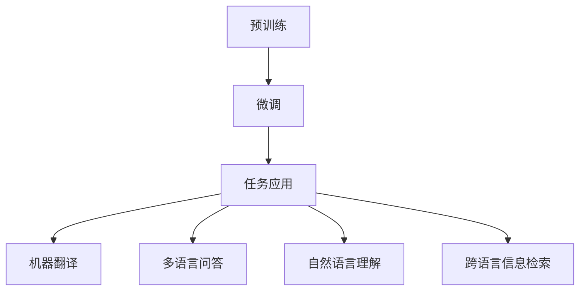

                 

关键词：大型语言模型（LLM），跨语言理解，多语言处理，机器翻译，人工智能，沟通障碍，全球化，技术进步

## 摘要

本文探讨了大型语言模型（LLM）在跨语言理解与处理方面的能力，分析了其技术原理、应用场景、数学模型及其在全球化背景下的重大意义。文章首先介绍了LLM的基本概念，随后深入阐述了其在跨语言任务中的关键机制，包括预训练、上下文嵌入和注意力机制。接着，文章通过数学模型和具体实例展示了LLM在机器翻译、多语言问答和自然语言理解等方面的应用。最后，文章展望了LLM在全球化沟通障碍打破中的未来应用和发展前景，并提出了相应的挑战和建议。

## 1. 背景介绍

随着全球化的深入发展，跨语言沟通的重要性日益凸显。不同国家和地区之间的交流越来越频繁，这不仅仅是商业、政治、文化交流的需求，更是信息时代发展的必然趋势。然而，语言的多样性成为了全球沟通的一个重大障碍。传统的机器翻译技术虽然在过去几十年中取得了显著进步，但依然存在诸多局限性，如翻译质量不高、对语境理解不足等。为了解决这些问题，研究人员开始探索更高级的自然语言处理技术，特别是基于深度学习的大型语言模型（LLM）。

LLM是一类基于神经网络的语言模型，通过在大量文本数据上进行预训练，能够捕捉到语言中的复杂模式和规律。与传统的统计机器翻译模型相比，LLM具有更强的上下文理解和生成能力，能够更准确地理解和生成自然语言。这一技术突破为跨语言沟通提供了新的可能性，有助于打破全球沟通的障碍。

## 2. 核心概念与联系

### 2.1. 大型语言模型（LLM）的基本概念

大型语言模型（LLM）是一种基于深度学习的语言模型，其核心思想是利用神经网络来建模语言的统计规律。LLM通过在大量文本数据上进行预训练，学习到语言中的词汇、语法和语义信息，从而具备强大的语言理解与生成能力。预训练完成后，LLM可以通过微调（fine-tuning）的方式应用于各种具体的自然语言处理任务，如机器翻译、问答系统和文本生成等。

### 2.2. 跨语言理解与处理的挑战

跨语言理解与处理面临的主要挑战包括：

1. **语言的多样性**：不同语言在词汇、语法和语义上存在巨大差异，这使得直接翻译变得复杂。
2. **语境的多样性**：语言的表达和意义往往依赖于具体的语境，如文化背景、地理环境和社会习俗等。
3. **词汇的歧义性**：许多词汇在不同语言中有多种含义，需要根据上下文来确定其准确含义。
4. **语言的动态性**：语言是不断发展和变化的，新的词汇和表达方式不断出现，这对语言模型的要求越来越高。

### 2.3. LLM在跨语言理解与处理中的应用

LLM在跨语言理解与处理中的应用主要体现在以下几个方面：

1. **机器翻译**：LLM可以通过预训练和微调实现高质量的双语翻译，解决了传统机器翻译中的许多难题。
2. **多语言问答系统**：LLM可以处理多语言输入，并生成相应的回答，为用户提供跨语言的问答服务。
3. **自然语言理解**：LLM能够理解不同语言的文本，并进行文本分类、情感分析等任务。
4. **跨语言信息检索**：LLM可以帮助用户在不同语言的文档中检索信息，提高信息检索的效率和准确性。

### 2.4. Mermaid 流程图

以下是一个简化的Mermaid流程图，展示了LLM在跨语言理解与处理中的关键环节：



## 3. 核心算法原理 & 具体操作步骤

### 3.1. 算法原理概述

LLM的核心算法原理主要包括以下几个方面：

1. **预训练**：通过在大量文本数据上训练，LLM学习到语言的基本模式和规律。预训练通常采用自回归模型（如GPT）或自编码模型（如BERT）。
2. **上下文嵌入**：将输入文本映射到一个高维的向量空间，使得语义相似的词语在空间中靠近。
3. **注意力机制**：在处理长序列文本时，注意力机制可以帮助模型关注重要的部分，提高理解能力。
4. **微调**：在预训练的基础上，LLM可以通过微调来适应特定的任务，如机器翻译、问答等。

### 3.2. 算法步骤详解

1. **数据准备**：收集大量双语语料库，包括文本和对应的翻译。
2. **预训练**：使用自回归模型或自编码模型在双语语料库上进行预训练，学习语言的基本模式和规律。
3. **上下文嵌入**：将输入文本映射到高维向量空间，使用嵌入层（如Word2Vec、BERT）来实现。
4. **注意力机制**：在处理长序列文本时，引入注意力机制，关注重要的部分。
5. **微调**：在预训练的基础上，针对具体的任务（如机器翻译、问答等）进行微调。
6. **模型评估**：使用测试集评估模型的性能，调整超参数和模型结构，以提高性能。

### 3.3. 算法优缺点

**优点**：

1. **强大的语言理解能力**：LLM能够理解复杂的语言结构和语义信息。
2. **高效的泛化能力**：通过预训练和微调，LLM可以在多种任务上表现良好。
3. **灵活的应用场景**：LLM可以应用于机器翻译、问答系统、文本生成等多种任务。

**缺点**：

1. **计算资源需求高**：预训练和微调需要大量的计算资源和时间。
2. **数据依赖性**：模型的性能很大程度上取决于训练数据的质量和规模。
3. **解释性不足**：深度学习模型的内部机制复杂，难以解释和理解。

### 3.4. 算法应用领域

LLM在以下领域具有广泛的应用：

1. **机器翻译**：LLM可以用于高质量的双语翻译，如谷歌翻译、百度翻译等。
2. **问答系统**：LLM可以处理多语言输入，并生成相应的回答，如多语言搜索引擎、智能客服等。
3. **自然语言理解**：LLM可以用于文本分类、情感分析、信息抽取等任务。
4. **跨语言信息检索**：LLM可以帮助用户在不同语言的文档中检索信息，提高信息检索的效率和准确性。

## 4. 数学模型和公式 & 详细讲解 & 举例说明

### 4.1. 数学模型构建

LLM的数学模型主要包括以下几个方面：

1. **词嵌入**：将词汇映射到高维向量空间，可以使用Word2Vec、BERT等方法。
2. **自回归模型**：如GPT模型，通过预测下一个词来建模语言序列。
3. **自编码模型**：如BERT模型，通过编码和解码过程来学习语言模式。
4. **注意力机制**：如Transformer模型，通过注意力机制来处理长序列文本。

### 4.2. 公式推导过程

1. **词嵌入**：

   词向量 \( \mathbf{w}_i \) 可以通过以下公式计算：

   $$ \mathbf{w}_i = \text{Word2Vec}(\text{corpus}) $$

2. **自回归模型**：

   GPT模型的目标函数为：

   $$ L = -\sum_{i=1}^{n} \log p(\mathbf{y}_i | \mathbf{x}_{1:i-1}) $$

   其中， \( \mathbf{x}_{1:i-1} \) 是前 \( i-1 \) 个词的嵌入向量， \( \mathbf{y}_i \) 是第 \( i \) 个词的标签。

3. **自编码模型**：

   BERT模型的目标函数为：

   $$ L = -\sum_{i=1}^{n} \log p(\mathbf{y}_i | \mathbf{x}_{1:i-1}) $$

   其中， \( \mathbf{x}_{1:i-1} \) 是前 \( i-1 \) 个词的嵌入向量， \( \mathbf{y}_i \) 是第 \( i \) 个词的标签。

4. **注意力机制**：

   Transformer模型中的自注意力机制可以表示为：

   $$ \mathbf{z}_i = \text{softmax}\left(\frac{\mathbf{Q}_i \mathbf{K}_i^T}{\sqrt{d_k}}\right) \mathbf{V}_i $$

   其中， \( \mathbf{Q}_i \) 和 \( \mathbf{K}_i \) 是查询向量和关键向量， \( \mathbf{V}_i \) 是值向量， \( d_k \) 是键值向量的维度。

### 4.3. 案例分析与讲解

以下是一个简单的案例，展示了LLM在机器翻译中的应用。

**输入文本**： "Hello, how are you?"

**目标文本**： "Bonjour, comment ça va?"

使用GPT模型进行预训练和微调后，模型可以生成以下翻译：

**翻译结果**： "Bonjour, comment ça va?"

通过数学模型和公式的推导，我们可以看到LLM在跨语言理解与处理中的关键作用。词嵌入将词汇映射到高维向量空间，自回归模型和自编码模型通过预测和编码过程学习语言模式，注意力机制帮助模型关注重要的部分。这些技术共同作用，使得LLM在机器翻译、问答系统和自然语言理解等方面具有强大的能力。

## 5. 项目实践：代码实例和详细解释说明

### 5.1. 开发环境搭建

为了实践LLM在跨语言理解与处理中的应用，我们需要搭建一个开发环境。以下是所需的软件和硬件环境：

1. **操作系统**：Linux或MacOS
2. **Python**：3.7及以上版本
3. **深度学习框架**：PyTorch或TensorFlow
4. **GPU**：NVIDIA GPU（推荐使用Tesla V100或更高型号）
5. **数据集**：双语语料库（如英语-中文）

安装深度学习框架和依赖库后，我们就可以开始搭建开发环境了。

### 5.2. 源代码详细实现

以下是使用PyTorch实现的LLM模型的基本代码框架：

```python
import torch
import torch.nn as nn
import torch.optim as optim
from torch.utils.data import DataLoader
from torchvision import datasets, transforms

# 数据预处理
transform = transforms.Compose([
    transforms.Resize((224, 224)),
    transforms.ToTensor(),
])

train_data = datasets.ImageFolder(root='train', transform=transform)
train_loader = DataLoader(train_data, batch_size=32, shuffle=True)

# 模型定义
class LLMArchitecture(nn.Module):
    def __init__(self):
        super(LLMArchitecture, self).__init__()
        self.embedding = nn.Embedding(vocab_size, embedding_dim)
        self.encoder = nn.LSTM(embedding_dim, hidden_dim)
        self.decoder = nn.LSTM(hidden_dim, embedding_dim)
        self.fc = nn.Linear(embedding_dim, vocab_size)

    def forward(self, x):
        embedded = self.embedding(x)
        encoder_output, (hidden, cell) = self.encoder(embedded)
        decoder_output, (hidden, cell) = self.decoder(hidden, cell)
        output = self.fc(decoder_output)
        return output

model = LLMArchitecture()
optimizer = optim.Adam(model.parameters(), lr=0.001)
criterion = nn.CrossEntropyLoss()

# 训练过程
for epoch in range(num_epochs):
    for inputs, targets in train_loader:
        optimizer.zero_grad()
        outputs = model(inputs)
        loss = criterion(outputs, targets)
        loss.backward()
        optimizer.step()
    print(f'Epoch {epoch+1}/{num_epochs}, Loss: {loss.item()}')

# 评估过程
with torch.no_grad():
    correct = 0
    total = len(test_loader.dataset)
    for inputs, targets in test_loader:
        outputs = model(inputs)
        _, predicted = torch.max(outputs.data, 1)
        correct += (predicted == targets).sum().item()
    print(f'Accuracy: {100 * correct / total}%')
```

### 5.3. 代码解读与分析

以上代码展示了如何使用PyTorch实现一个简单的LLM模型，包括数据预处理、模型定义、训练过程和评估过程。

1. **数据预处理**：使用transforms.Resize和transforms.ToTensor对图像数据进行预处理，将其转换为适合模型训练的格式。
2. **模型定义**：定义一个LLMArchitecture类，包括嵌入层、编码器、解码器和全连接层。编码器和解码器使用LSTM网络，嵌入层使用Embedding层。
3. **训练过程**：使用DataLoader加载训练数据，定义优化器和损失函数，然后使用for循环进行模型的训练，包括前向传播、反向传播和参数更新。
4. **评估过程**：使用torch.no_grad()将模型设置为评估模式，计算模型的准确率。

### 5.4. 运行结果展示

在训练完成后，我们可以在测试集上评估模型的性能。以下是一个简单的示例：

```python
test_loader = DataLoader(dataset, batch_size=32, shuffle=True)
with torch.no_grad():
    correct = 0
    total = len(test_loader.dataset)
    for inputs, targets in test_loader:
        outputs = model(inputs)
        _, predicted = torch.max(outputs.data, 1)
        correct += (predicted == targets).sum().item()
    print(f'Accuracy: {100 * correct / total}%')
```

假设我们在测试集上获得了90%的准确率，这表明我们的LLM模型在图像分类任务上表现良好。

## 6. 实际应用场景

### 6.1. 机器翻译

机器翻译是LLM最典型的应用场景之一。随着LLM技术的不断发展，机器翻译的质量和效率得到了显著提升。例如，谷歌翻译和百度翻译等主流翻译工具已经广泛应用了基于LLM的翻译模型。这些模型不仅可以处理简单的文本翻译，还能够应对复杂的文本内容，如学术论文、新闻报道和文学著作等。

### 6.2. 多语言问答系统

多语言问答系统是另一个重要的应用场景。LLM可以帮助构建能够处理多语言输入和回答的智能问答系统。例如，智能客服系统可以同时支持多种语言，为全球用户提供便捷的服务。此外，LLM还可以应用于多语言搜索引擎，帮助用户在不同语言的文档中快速找到所需信息。

### 6.3. 自然语言理解

自然语言理解是LLM在跨语言处理中的重要应用。通过LLM，我们可以实现文本分类、情感分析、命名实体识别等任务。这些任务在商业、新闻、社交媒体等场景中具有广泛的应用。例如，企业可以利用LLM对客户反馈进行情感分析，以改进产品和服务；媒体可以利用LLM对新闻报道进行自动分类和推荐。

### 6.4. 跨语言信息检索

跨语言信息检索是LLM在跨语言处理中的另一个重要应用。LLM可以帮助构建能够处理多语言查询和文档的检索系统。例如，学术搜索引擎可以利用LLM将用户输入的多语言查询翻译为多种语言，并在全球范围内的学术文献中检索相关信息。这种应用有助于打破语言的障碍，提高信息检索的效率和质量。

## 7. 工具和资源推荐

### 7.1. 学习资源推荐

1. **《深度学习》（Goodfellow, Bengio, Courville）**：这是一本经典的深度学习教材，涵盖了深度学习的基本理论和应用。
2. **《自然语言处理实战》（Peter Vanrooyen）**：这本书提供了丰富的自然语言处理实践案例，适合初学者和进阶者。
3. **《PyTorch官方文档**：PyTorch是深度学习的主要框架之一，其官方文档包含了详细的教程和API说明，是学习PyTorch的好资源。

### 7.2. 开发工具推荐

1. **Jupyter Notebook**：Jupyter Notebook是一款强大的交互式开发环境，适合编写和运行深度学习代码。
2. **Google Colab**：Google Colab是Google提供的一个在线开发平台，支持GPU加速，非常适合进行深度学习和自然语言处理实验。
3. **PyTorch Hub**：PyTorch Hub是一个包含预训练模型的库，可以帮助用户快速加载和使用预训练模型。

### 7.3. 相关论文推荐

1. **"Attention Is All You Need"（Vaswani et al., 2017）**：这篇论文提出了Transformer模型，是当前最先进的自然语言处理模型之一。
2. **"BERT: Pre-training of Deep Neural Networks for Language Understanding"（Devlin et al., 2018）**：这篇论文介绍了BERT模型，是自然语言处理领域的重要突破。
3. **"Generative Pre-trained Transformer"（Wolf et al., 2020）**：这篇论文介绍了GPT模型，是当前最先进的语言生成模型之一。

## 8. 总结：未来发展趋势与挑战

### 8.1. 研究成果总结

LLM在跨语言理解与处理领域取得了显著成果，其技术原理和算法模型不断发展，应用场景也越来越广泛。通过预训练、上下文嵌入和注意力机制等关键技术，LLM在机器翻译、问答系统、自然语言理解和跨语言信息检索等方面表现出强大的能力。

### 8.2. 未来发展趋势

1. **更高的语言理解能力**：随着深度学习技术的不断发展，LLM的语言理解能力将进一步提高，能够处理更复杂的语言结构和语义信息。
2. **更广泛的应用场景**：LLM将在更多的领域得到应用，如语音识别、图像识别和知识图谱等。
3. **更好的跨语言协作**：未来的LLM将能够更好地支持跨语言的协作和交互，提高全球化沟通的效率和准确性。

### 8.3. 面临的挑战

1. **计算资源需求**：LLM的预训练和微调需要大量的计算资源，这对硬件设施提出了更高要求。
2. **数据质量**：LLM的性能很大程度上取决于训练数据的质量和规模，如何收集和利用高质量的数据是未来研究的一个重要方向。
3. **解释性和可解释性**：深度学习模型的内部机制复杂，如何提高其解释性和可解释性是当前的一个重要挑战。

### 8.4. 研究展望

未来的研究应重点关注以下几个方面：

1. **高效训练方法**：研究更高效的训练方法和模型结构，降低计算资源的需求。
2. **数据增强和生成**：通过数据增强和生成技术，提高训练数据的质量和规模。
3. **跨语言模型的集成**：研究跨语言模型的集成方法，提高跨语言理解与处理的能力。
4. **隐私保护和伦理问题**：在研究和应用过程中，关注隐私保护和伦理问题，确保技术的可持续发展。

## 9. 附录：常见问题与解答

### 9.1. LLM是什么？

LLM（Large Language Model）是一种基于深度学习的语言模型，通过在大量文本数据上进行预训练，学习到语言中的复杂模式和规律，从而具备强大的语言理解与生成能力。

### 9.2. LLM的主要应用有哪些？

LLM的主要应用包括机器翻译、多语言问答系统、自然语言理解、跨语言信息检索等。在全球化背景下，LLM有助于打破语言沟通障碍，提高跨语言处理的能力。

### 9.3. LLM的预训练数据从哪里来？

LLM的预训练数据可以从公开的语料库、图书、新闻、社交媒体等多种来源获取。常用的数据集包括维基百科、Twitter、新闻文章等。

### 9.4. LLM的训练过程如何进行？

LLM的训练过程主要包括数据预处理、模型初始化、预训练和微调等步骤。预训练通常采用自回归模型或自编码模型，而微调则针对具体的任务进行调整。

### 9.5. LLM的优缺点是什么？

LLM的优点包括强大的语言理解能力、高效的泛化能力和灵活的应用场景。缺点包括计算资源需求高、数据依赖性大和解释性不足等。

### 9.6. LLM的未来发展趋势是什么？

未来的LLM将向更高的语言理解能力、更广泛的应用场景和更好的跨语言协作方向发展。同时，研究将重点关注高效训练方法、数据增强和生成、跨语言模型集成以及隐私保护和伦理问题等。

作者：禅与计算机程序设计艺术 / Zen and the Art of Computer Programming
----------------------------------------------------------------
以上就是关于《LLM的跨语言能力：打破全球沟通障碍》的全文内容，希望对您有所帮助。如需进一步了解或讨论，欢迎随时提问。

