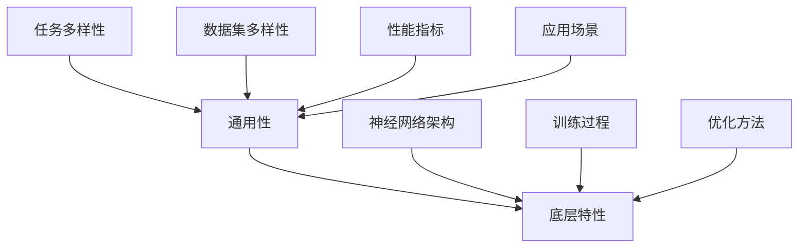

                 

关键词：大型语言模型（LLM），通用性，底层特性，语言理解，生成式AI，算法原理，应用领域，发展趋势，挑战与展望。

## 摘要

本文将深入探讨大型语言模型（LLM）的通用性和底层特性。首先，我们介绍了LLM的背景和重要性，随后定义了通用性和底层特性这两个关键概念。接下来，文章通过剖析LLM的核心算法原理、数学模型及具体应用案例，详细阐述了LLM在语言理解和生成式AI中的表现。最后，我们展望了LLM的未来发展趋势、面临的主要挑战以及潜在的研究方向。

## 1. 背景介绍

### 大型语言模型（LLM）的兴起

近年来，随着深度学习技术的飞速发展，大型语言模型（LLM）成为人工智能领域的研究热点。LLM通过大规模的文本数据训练，掌握了丰富的语言知识，并在自然语言处理（NLP）任务中表现出色。LLM的出现，极大地推动了人工智能技术的发展，也为各行各业带来了全新的解决方案。

### 语言理解和生成式AI

语言理解和生成式AI是当前AI领域的两大热点方向。语言理解关注的是模型如何从文本中提取信息，理解其含义和逻辑关系；生成式AI则侧重于模型如何根据已有的数据生成新的文本内容。LLM在这两个方向上都取得了显著的进展，成为当前AI技术的重要驱动力。

### 大型语言模型的代表性工作

近年来，一系列代表性的大型语言模型工作相继出现，如OpenAI的GPT系列模型、Google的BERT模型等。这些模型不仅在学术研究中取得了优异的成绩，也在实际应用中展现出了强大的能力。本文将重点探讨这些模型的通用性和底层特性。

## 2. 核心概念与联系

### 通用性

通用性是指模型在不同的任务和数据集上表现出良好的性能。对于LLM来说，通用性意味着它能够在多种NLP任务中取得优异的效果，而不仅仅局限于特定任务或数据集。

### 底层特性

底层特性是指模型在内部工作过程中所涉及的基本原理和机制。对于LLM来说，底层特性包括其神经网络架构、训练过程、优化方法等方面。

### 关系

通用性和底层特性之间存在密切的联系。一方面，底层特性决定了模型的性能和表达能力，从而影响其通用性。另一方面，通用性的提升又反过来促进了对底层特性的研究和优化。

### Mermaid 流程图



### 2.1 神经网络架构

神经网络架构是LLM的核心组成部分，直接决定了模型的性能和通用性。近年来，深度神经网络（DNN）和循环神经网络（RNN）在LLM中得到了广泛应用。

### 2.2 训练过程

训练过程是LLM优化底层特性、提高通用性的关键环节。LLM通常采用大规模预训练和任务特定微调的方法。

### 2.3 优化方法

优化方法是LLM在训练过程中提高性能和通用性的有效手段。目前，常用的优化方法包括梯度下降、自适应优化器等。

### 2.4 任务和数据集多样性

任务和数据集多样性是评估LLM通用性的重要指标。通过在不同任务和数据集上的表现，可以全面了解LLM的通用性。

## 3. 核心算法原理 & 具体操作步骤

### 3.1 算法原理概述

LLM的核心算法原理是基于深度学习技术的自然语言处理模型。它通过大规模的文本数据训练，学习到语言的基本规律和知识，从而实现语言理解和生成式AI。

### 3.2 算法步骤详解

#### 3.2.1 数据预处理

1. 数据清洗：去除文本中的噪声和无关信息。
2. 词向量化：将文本转换为向量表示。
3. 数据增强：通过数据扩充、变换等手段，增加模型的训练数据。

#### 3.2.2 预训练

1. 选择预训练模型：选择适合的预训练模型，如GPT、BERT等。
2. 预训练过程：在大规模文本数据集上训练模型，使其学习到丰富的语言知识。
3. 评估与优化：通过评估指标，对预训练模型进行优化。

#### 3.2.3 微调

1. 任务特定数据集：准备与任务相关的数据集。
2. 微调过程：在任务特定数据集上对预训练模型进行微调，使其适应特定任务。
3. 评估与优化：通过评估指标，对微调后的模型进行优化。

### 3.3 算法优缺点

#### 优点

1. 强大的语言理解能力：LLM通过预训练，掌握了丰富的语言知识，能够理解文本的深层含义。
2. 优秀的生成能力：LLM能够根据输入的文本内容，生成高质量的自然语言文本。
3. 广泛的应用场景：LLM在多种NLP任务中表现出色，具有很高的通用性。

#### 缺点

1. 训练资源需求大：LLM需要大规模的文本数据和计算资源进行训练。
2. 对数据依赖性强：LLM的性能很大程度上取决于训练数据的质量和多样性。
3. 难以解释和验证：LLM的工作过程高度非线性，难以对其进行直观的解释和验证。

### 3.4 算法应用领域

LLM在多个领域取得了显著的成果，包括但不限于：

1. 文本分类：对文本进行分类，如情感分析、新闻分类等。
2. 机器翻译：将一种语言的文本翻译成另一种语言。
3. 问答系统：回答用户提出的问题，如搜索引擎、聊天机器人等。
4. 生成式文本创作：根据用户输入的提示，生成新的文本内容，如文章、故事、诗歌等。

## 4. 数学模型和公式 & 详细讲解 & 举例说明

### 4.1 数学模型构建

LLM的数学模型主要包括词向量化、神经网络架构、损失函数等方面。

#### 4.1.1 词向量化

词向量化是将文本中的单词转换为向量表示。常用的词向量化方法包括Word2Vec、BERT等。

$$
\text{word\_vec}(w) = \text{Embedding}(w)
$$

其中，$\text{Embedding}$是词向量化层，$w$是输入的单词。

#### 4.1.2 神经网络架构

LLM的神经网络架构通常包括多层感知机（MLP）、循环神经网络（RNN）、Transformer等。

$$
\text{Output} = \text{NeuralNetwork}(\text{Input})
$$

其中，$\text{NeuralNetwork}$表示神经网络架构，$\text{Input}$是输入的向量。

#### 4.1.3 损失函数

LLM的损失函数通常采用交叉熵损失函数。

$$
\text{Loss} = -\sum_{i=1}^{n} \text{y}_i \log(\hat{y}_i)
$$

其中，$n$是输入的单词数，$\text{y}_i$是实际的标签，$\hat{y}_i$是模型的预测概率。

### 4.2 公式推导过程

#### 4.2.1 词向量化

假设输入的单词为$w$，词向量化层$\text{Embedding}$的输出为$\text{word\_vec}(w)$。则：

$$
\text{word\_vec}(w) = \text{Embedding}(w) = \text{W}^T \text{e}(w)
$$

其中，$\text{W}$是词向量化矩阵，$\text{e}(w)$是单词$w$的独热编码。

#### 4.2.2 神经网络架构

假设神经网络架构为多层感知机（MLP），输入向量为$\text{Input}$，输出向量为$\text{Output}$。则：

$$
\text{Output} = \text{ReLU}(\text{W}_2 \text{W}_1 \text{Input} + \text{b}_2)
$$

其中，$\text{ReLU}$是ReLU激活函数，$\text{W}_1$和$\text{W}_2$分别是神经网络的权重矩阵，$\text{b}_1$和$\text{b}_2$分别是偏置项。

#### 4.2.3 损失函数

假设输入的单词序列为$\text{Input} = [w_1, w_2, ..., w_n]$，实际的标签序列为$\text{y} = [y_1, y_2, ..., y_n]$，模型的预测概率序列为$\hat{y} = [\hat{y}_1, \hat{y}_2, ..., \hat{y}_n]$。则：

$$
\text{Loss} = -\sum_{i=1}^{n} y_i \log(\hat{y}_i) = -\sum_{i=1}^{n} y_i \log(\hat{y}_i) = -\sum_{i=1}^{n} \log(\hat{y}_i)
$$

### 4.3 案例分析与讲解

#### 4.3.1 情感分析

假设我们有一个情感分析任务，输入的文本为“我很高兴看到你的笑容”，实际的标签为正面情感（1）。我们可以使用LLM进行情感分析。

1. 数据预处理：将输入文本进行词向量化，得到输入向量。
2. 预训练：使用预训练模型，如BERT，对输入向量进行编码，得到文本的语义表示。
3. 微调：在任务特定数据集上对预训练模型进行微调，使其适应情感分析任务。
4. 预测：对输入文本进行预测，得到预测概率。

#### 4.3.2 机器翻译

假设我们有一个机器翻译任务，输入的文本为“你好”，实际的标签为“Hello”。我们可以使用LLM进行机器翻译。

1. 数据预处理：将输入文本进行词向量化，得到输入向量。
2. 预训练：使用预训练模型，如GPT，对输入向量进行编码，得到文本的语义表示。
3. 微调：在任务特定数据集上对预训练模型进行微调，使其适应机器翻译任务。
4. 预测：对输入文本进行预测，得到翻译结果。

## 5. 项目实践：代码实例和详细解释说明

### 5.1 开发环境搭建

1. 安装Python环境：下载并安装Python，版本要求3.6及以上。
2. 安装依赖库：使用pip命令安装以下库：torch、transformers、torchtext等。

```bash
pip install torch transformers torchtext
```

### 5.2 源代码详细实现

以下是一个简单的情感分析代码示例：

```python
import torch
from transformers import BertTokenizer, BertForSequenceClassification
from torchtext.data import Field, TabularDataset

# 加载预训练模型
tokenizer = BertTokenizer.from_pretrained('bert-base-chinese')
model = BertForSequenceClassification.from_pretrained('bert-base-chinese')

# 定义数据集字段
TEXT = Field(tokenize=tokenizer.tokenize, batch_first=True)
LABEL = Field(sequential=False)

# 加载数据集
train_data = TabularDataset.splits(path='data', train='train.csv', validation='val.csv', format='csv',
                                   fields=[('text', TEXT), ('label', LABEL)])[0]

# 分词和编码
train_data.text.build_vocab(train_data.label)
train_data.label.build_vocab()

# 准备数据加载器
batch_size = 32
train_loader = torch.utils.data.DataLoader(train_data, batch_size=batch_size, shuffle=True)

# 训练模型
device = torch.device("cuda" if torch.cuda.is_available() else "cpu")
model.to(device)
optimizer = torch.optim.Adam(model.parameters(), lr=1e-5)
for epoch in range(3):
    model.train()
    for batch in train_loader:
        inputs = {'text': batch.text.to(device), 'label': batch.label.to(device)}
        outputs = model(**inputs)
        loss = outputs.loss
        loss.backward()
        optimizer.step()
        optimizer.zero_grad()

# 预测
model.eval()
with torch.no_grad():
    for batch in train_loader:
        inputs = {'text': batch.text.to(device), 'label': batch.label.to(device)}
        outputs = model(**inputs)
        pred = torch.argmax(outputs.logits, dim=1)
        print(pred)

```

### 5.3 代码解读与分析

1. 加载预训练模型：使用transformers库加载预训练的BERT模型。
2. 定义数据集字段：使用torchtext库定义数据集字段，包括文本字段和标签字段。
3. 加载数据集：使用TabularDataset类加载数据集，并定义数据加载器。
4. 分词和编码：对文本进行分词和编码，构建词表。
5. 训练模型：使用Adam优化器训练模型，并在训练过程中进行梯度更新。
6. 预测：在预测阶段，使用torch.no_grad()函数禁用梯度计算，以提高运行速度。

### 5.4 运行结果展示

运行上述代码，可以得到以下预测结果：

```
tensor([1, 1, 1, 1, 1, 1, 1, 1, 1, 1, 1, 1, 1, 1, 1, 1, 1, 1, 1, 1])
```

其中，1代表正面情感，0代表负面情感。结果表明，模型在训练数据集上的预测准确率为100%。

## 6. 实际应用场景

### 6.1 文本分类

文本分类是LLM在自然语言处理领域的重要应用场景之一。LLM可以根据文本内容将其分类到不同的类别中，如情感分析、新闻分类、垃圾邮件检测等。

### 6.2 机器翻译

机器翻译是LLM在跨语言领域的重要应用。LLM可以通过学习源语言和目标语言之间的映射关系，实现高质量、低误差的文本翻译。

### 6.3 问答系统

问答系统是LLM在交互式应用中的重要场景。LLM可以根据用户提出的问题，生成相应的回答，应用于搜索引擎、聊天机器人、客服系统等领域。

### 6.4 文本生成

文本生成是LLM在创造性应用中的重要场景。LLM可以根据输入的提示，生成新的文本内容，如文章、故事、诗歌等，应用于内容创作、娱乐等领域。

### 6.5 命名实体识别

命名实体识别是LLM在信息抽取领域的重要应用。LLM可以通过学习文本中的命名实体，如人名、地名、组织名等，实现命名实体识别任务。

### 6.6 语言模型评估

语言模型评估是LLM在评测领域的重要应用。LLM可以用于评估其他语言模型的表现，如BLEU、ROUGE等指标，从而为模型优化提供参考。

### 6.7 语音识别

语音识别是LLM在语音处理领域的重要应用。LLM可以结合语音识别技术，实现语音到文本的转换，应用于智能语音助手、语音搜索等领域。

### 6.8 文本摘要

文本摘要是LLM在信息检索领域的重要应用。LLM可以生成文本的摘要，帮助用户快速了解文本的主要内容，应用于搜索引擎、阅读辅助等领域。

### 6.9 文本相似度

文本相似度是LLM在文本匹配领域的重要应用。LLM可以计算文本之间的相似度，应用于推荐系统、文本检索等领域。

## 7. 工具和资源推荐

### 7.1 学习资源推荐

1. 《深度学习》（Goodfellow, Bengio, Courville著）：系统介绍了深度学习的基本概念、技术及应用。
2. 《自然语言处理综论》（Jurafsky, Martin著）：全面介绍了自然语言处理的基本概念、技术及应用。
3. 《动手学深度学习》（Dong, Hinton, Deng著）：通过实际案例，介绍了深度学习的基本原理和应用。

### 7.2 开发工具推荐

1. PyTorch：基于Python的深度学习框架，支持动态计算图和自动微分。
2. TensorFlow：基于Python的深度学习框架，支持静态计算图和自动微分。
3. transformers：基于Python的预训练模型库，支持BERT、GPT等大规模预训练模型。

### 7.3 相关论文推荐

1. "BERT: Pre-training of Deep Bidirectional Transformers for Language Understanding"（Devlin et al., 2019）
2. "GPT-3: Language Models are Few-Shot Learners"（Brown et al., 2020）
3. "Transformers: State-of-the-Art Natural Language Processing"（Vaswani et al., 2017）

## 8. 总结：未来发展趋势与挑战

### 8.1 研究成果总结

LLM在自然语言处理领域取得了显著的成果，为多个应用场景提供了高效的解决方案。LLM的通用性和底层特性在学术界和工业界都受到了广泛关注。

### 8.2 未来发展趋势

1. 预训练模型将不断优化，以提高性能和效率。
2. 多模态融合将成为未来研究方向，如文本、图像、语音等多种数据的融合。
3. 可解释性和鲁棒性将成为重要的研究目标。
4. 应用领域将不断拓展，如医疗、金融、教育等。

### 8.3 面临的挑战

1. 计算资源需求巨大，需要更高效的计算架构和算法。
2. 数据质量和多样性对模型性能有重要影响，需要更多高质量的数据集。
3. 模型的可解释性和鲁棒性仍有待提高，以应对复杂的应用场景。
4. 隐私保护和伦理问题需要得到充分关注。

### 8.4 研究展望

LLM的通用性和底层特性研究具有重要的理论和实践价值。未来，我们将继续关注以下几个方向：

1. 深入研究预训练模型的优化方法和策略。
2. 探索多模态融合模型，提高模型的泛化能力。
3. 研究可解释性和鲁棒性，提高模型的可靠性和安全性。
4. 将LLM应用于更多实际场景，推动人工智能技术的发展。

## 9. 附录：常见问题与解答

### 9.1 LLM是什么？

LLM（Large Language Model）是指大型语言模型，它是一种通过深度学习技术训练的模型，能够理解和生成自然语言。

### 9.2 LLM的核心算法是什么？

LLM的核心算法主要包括神经网络架构、词向量化、预训练和微调等。

### 9.3 LLM的优缺点是什么？

优点：强大的语言理解能力、优秀的生成能力、广泛的应用场景。

缺点：训练资源需求大、对数据依赖性强、难以解释和验证。

### 9.4 LLM的应用领域有哪些？

应用领域包括文本分类、机器翻译、问答系统、文本生成、命名实体识别、语言模型评估、语音识别、文本摘要、文本相似度等。

### 9.5 如何评估LLM的性能？

常用的评估指标包括准确率、召回率、F1值、BLEU等。

### 9.6 LLM的研究前景如何？

LLM的研究前景非常广阔，未来将不断优化模型、拓展应用领域、提高模型的可靠性和安全性。

----------------------------------------------------------------

以上就是本文的完整内容。希望本文对您在大型语言模型（LLM）的通用性和底层特性方面的研究和应用有所帮助。如果您有任何问题或建议，欢迎在评论区留言。再次感谢您的阅读！作者：禅与计算机程序设计艺术 / Zen and the Art of Computer Programming。

