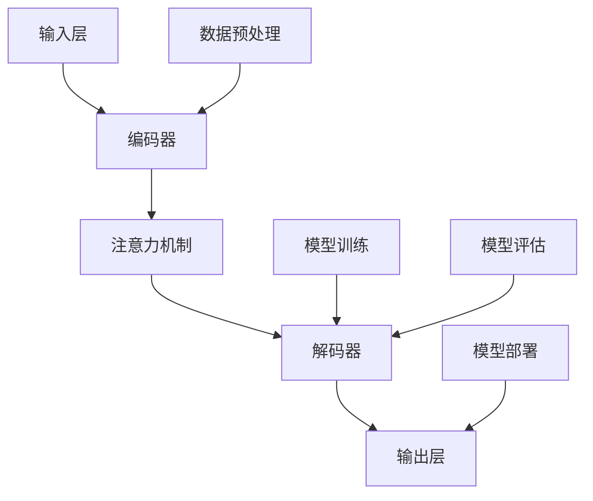
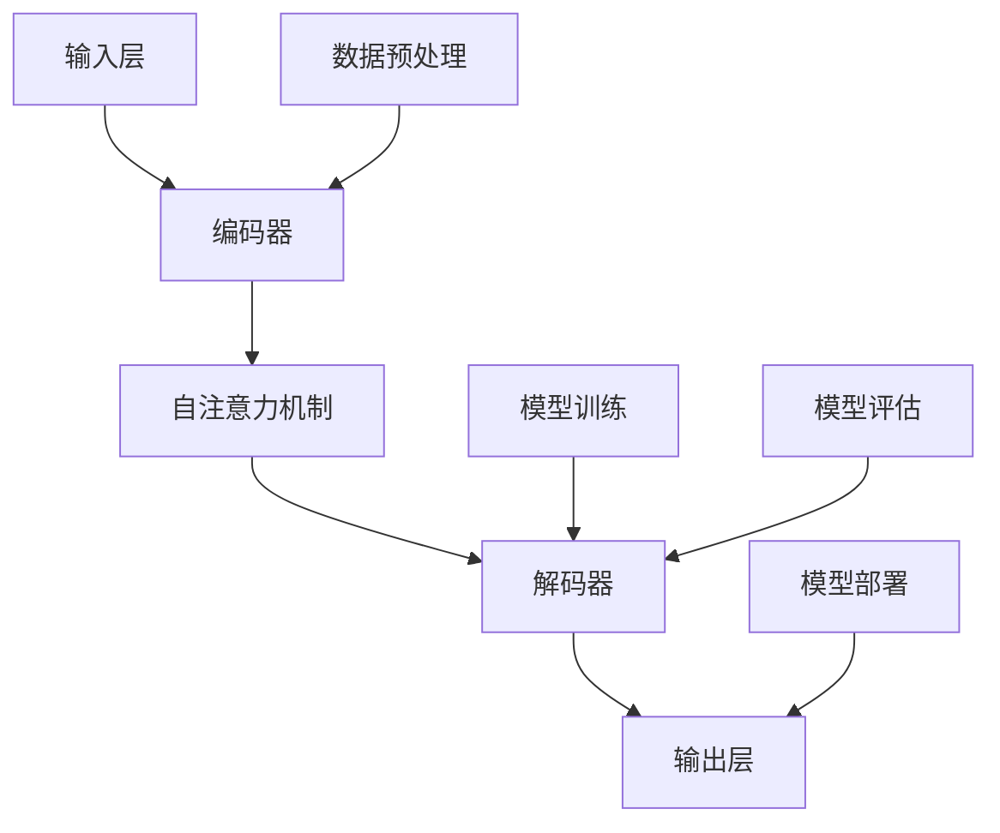

                 

关键词：大型语言模型（LLM）、函数库、人工智能、程序设计、软件架构

> 摘要：本文旨在探讨在大型语言模型（LLM）系统中，Agents（函数库）的重要性。我们将从背景介绍、核心概念与联系、核心算法原理、数学模型和公式、项目实践、实际应用场景、工具和资源推荐以及未来发展趋势与挑战等方面进行深入分析，以揭示函数库在LLM系统中的核心地位。

## 1. 背景介绍

随着人工智能技术的飞速发展，尤其是大型语言模型（LLM）的广泛应用，函数库作为编程的核心组件，其重要性愈发凸显。函数库是一系列预定义函数的集合，它们可以用于执行特定的任务，从而提高开发效率和代码的可维护性。在LLM系统中，函数库的作用不仅体现在提高开发效率，更重要的是，它们能够为系统的复杂度管理和性能优化提供强有力的支持。

本文将首先回顾LLM的发展历程，然后介绍函数库的基本概念、分类及其在LLM系统中的应用，以期为读者提供全面的视角来理解函数库在LLM系统中的重要性。

### 1.1 LLM的发展历程

自1980年代以来，自然语言处理（NLP）技术逐渐成为人工智能领域的研究热点。早期的NLP系统主要依赖于规则驱动的模型，例如文本分类和命名实体识别等。这些系统虽然能够处理简单的文本任务，但在处理复杂任务时表现较差。随着深度学习技术的发展，特别是卷积神经网络（CNN）和递归神经网络（RNN）的应用，NLP领域取得了显著的进展。到了2018年，Google推出了Transformer模型，这一创新性的架构使得LLM的研究和应用进入了一个新的时代。

LLM的出现极大地推动了自然语言处理和生成任务的进步。这些模型能够通过自主学习大规模语料库，实现复杂的文本理解和生成任务。例如，LLM被广泛应用于机器翻译、文本摘要、问答系统、自动写作等领域，极大地提高了相关任务的效率和准确性。

### 1.2 函数库的基本概念和分类

函数库（Library）是一组预编译的函数和相关的数据结构的集合，开发者可以在编写程序时调用这些函数，从而避免重复编写代码。函数库可以按照不同的分类标准进行分类，例如按照功能分类、按照编程语言分类、或者按照应用领域分类。

#### 按照功能分类

- **通用函数库**：这类函数库提供广泛的通用功能，如数学运算、字符串处理、文件读写等。常见的通用函数库包括C标准库、Python的标准库等。
- **专用函数库**：这类函数库针对特定的应用领域提供专门的函数和工具，如科学计算库NumPy、图像处理库OpenCV、自然语言处理库NLTK等。

#### 按照编程语言分类

- **C/C++函数库**：如STL（Standard Template Library）、Boost等。
- **Python函数库**：如NumPy、Pandas、Scikit-learn、TensorFlow等。
- **Java函数库**：如Java标准库、Apache Commons等。

#### 按照应用领域分类

- **科学计算函数库**：如NumPy、SciPy、MATLAB等。
- **机器学习函数库**：如scikit-learn、TensorFlow、PyTorch等。
- **自然语言处理函数库**：如NLTK、spaCy、gensim等。

### 1.3 函数库在LLM系统中的应用

在LLM系统中，函数库的应用至关重要。首先，函数库能够提供高效且稳定的代码实现，使得开发者可以专注于模型的训练和优化，而无需担心底层实现的细节。例如，TensorFlow和PyTorch等深度学习框架提供了丰富的函数库，包括数据加载、模型训练、优化算法等，极大地简化了开发过程。

其次，函数库能够提供可复用的组件，促进代码的复用和共享。在LLM系统中，不同模型和任务之间可能存在许多通用的部分，如数据预处理、模型评估等。通过使用函数库，开发者可以轻松实现这些通用的功能，提高开发效率。

最后，函数库能够提高代码的可维护性和可扩展性。在LLM系统中，随着模型的不断迭代和优化，需要对代码进行持续的更新和修改。通过使用函数库，开发者可以更好地组织和管理代码，确保系统的稳定性和可靠性。

## 2. 核心概念与联系

在深入探讨LLM系统中函数库的应用之前，有必要先了解一些核心概念和它们之间的联系。这些核心概念包括：大规模语言模型的架构、函数库的基本原理、以及函数库在LLM系统中的具体应用场景。

### 2.1 大规模语言模型的架构

大规模语言模型通常由以下几个核心组件构成：

1. **输入层**：接收文本输入，并将其转换为模型可以处理的格式。
2. **编码器**：将输入文本编码为向量表示，通常使用神经网络架构如Transformer。
3. **解码器**：根据编码器的输出生成文本输出，解码器同样使用神经网络架构。
4. **注意力机制**：在编码和解码过程中，注意力机制用于关注文本中的关键信息，提高模型对上下文的感知能力。


### 2.2 函数库的基本原理

函数库是一组预编译的函数和相关的数据结构的集合，其基本原理可以概括为以下几点：

1. **模块化**：通过将功能划分为独立的模块，使得代码更易于理解和维护。
2. **复用性**：开发者可以在多个项目中复用相同的函数库，提高开发效率。
3. **封装**：函数库将具体的实现细节封装起来，开发者只需关注如何使用这些函数，而无需了解底层实现。
4. **高效性**：通过预编译和优化，函数库可以提供高效的代码执行。

### 2.3 函数库在LLM系统中的具体应用场景

在LLM系统中，函数库的具体应用场景包括但不限于以下几个方面：

1. **数据预处理**：函数库可以提供高效的数据加载、清洗和转换工具，如TensorFlow和PyTorch中的数据管道（Data Pipeline）。
2. **模型训练**：函数库提供了丰富的优化算法和训练策略，如梯度下降、Adam优化器等，使得模型训练过程更加高效和稳定。
3. **模型评估**：函数库可以提供评估模型性能的各种指标，如准确率、召回率、F1分数等。
4. **模型部署**：函数库可以帮助开发者将训练好的模型部署到生产环境中，如TensorFlow Serving、PyTorch Serving等。

### 2.4 Mermaid流程图

为了更直观地展示函数库在LLM系统中的应用，我们可以使用Mermaid流程图来描述这一过程。以下是一个简单的Mermaid流程图示例：



这个流程图展示了输入层通过数据预处理后输入到编码器，编码器通过注意力机制处理输入，然后解码器生成输出，最终通过模型部署实现预测。

## 3. 核心算法原理 & 具体操作步骤

在深入探讨LLM系统中函数库的应用之前，我们需要了解其中的核心算法原理和具体操作步骤。这一部分将首先概述算法原理，然后详细讲解操作步骤，并分析算法的优缺点以及应用领域。

### 3.1 算法原理概述

LLM系统中的核心算法通常是基于深度学习，特别是基于Transformer架构。Transformer模型通过自注意力机制（Self-Attention）和多头注意力（Multi-Head Attention）实现了对输入文本的上下文信息的有效捕捉和处理。具体而言，算法原理包括以下几个关键步骤：

1. **输入层**：将输入文本转化为序列化的向量表示。
2. **编码器**：利用Transformer架构对输入向量进行编码，生成编码序列。
3. **自注意力机制**：通过对编码序列的每个元素进行加权平均，实现对上下文信息的捕捉。
4. **解码器**：根据编码序列生成预测的文本输出。
5. **损失函数和优化器**：通过计算损失函数（如交叉熵损失）和优化器（如Adam）进行模型训练。

### 3.2 算法步骤详解

下面我们详细讲解LLM系统中Transformer模型的操作步骤：

#### 3.2.1 输入层

1. **文本预处理**：将输入文本进行分词、去停用词等预处理操作，将其转化为词向量。
2. **嵌入层**：将词向量嵌入到高维空间，生成输入向量。

#### 3.2.2 编码器

1. **多头自注意力机制**：
   - **计算自注意力得分**：使用查询（Q）、键（K）和值（V）三个矩阵分别计算自注意力得分。
   - **加权平均**：根据自注意力得分对编码序列进行加权平均，生成编码序列的新表示。
2. **残差连接和层归一化**：在每次自注意力操作后，加入残差连接和层归一化，以缓解梯度消失问题。

#### 3.2.3 解码器

1. **多头交叉自注意力机制**：
   - **计算交叉注意力得分**：对编码序列和新生成的中间序列进行交叉自注意力计算。
   - **加权平均**：根据交叉注意力得分生成解码序列的新表示。
2. **残差连接和层归一化**：与编码器类似，加入残差连接和层归一化。

#### 3.2.4 输出层

1. **前馈网络**：在解码器的每个中间层之后，加入前馈网络，对解码序列进行非线性变换。
2. **损失函数和优化器**：计算交叉熵损失，并使用优化器（如Adam）进行模型训练。

### 3.3 算法优缺点

#### 优点

1. **并行计算**：Transformer模型通过自注意力机制，实现了并行计算，提高了训练效率。
2. **上下文捕捉能力**：多头注意力机制能够捕捉输入文本的上下文信息，提高了模型对复杂语义的理解能力。
3. **灵活性**：Transformer模型具有高度的可扩展性，可以通过增加层数和头数来调整模型的复杂度。

#### 缺点

1. **计算资源消耗**：Transformer模型具有较高的计算复杂度，尤其是在处理大规模文本时，需要较大的计算资源。
2. **长距离依赖问题**：虽然Transformer模型能够捕捉上下文信息，但在处理长距离依赖问题时，仍然存在一定挑战。

### 3.4 算法应用领域

Transformer模型及其变种在LLM系统中被广泛应用于多个领域，包括：

1. **文本生成**：如自动写作、诗歌生成等。
2. **机器翻译**：如英译中、中译英等。
3. **问答系统**：如基于问答数据的自动问答系统。
4. **文本摘要**：如生成摘要、提炼关键信息等。

### 3.5 Mermaid流程图

为了更直观地展示Transformer模型在LLM系统中的应用流程，我们可以使用Mermaid流程图来描述。以下是一个简单的Mermaid流程图示例：



这个流程图展示了输入层通过数据预处理后输入到编码器，编码器通过自注意力机制处理输入，然后解码器生成输出，最终通过模型部署实现预测。

## 4. 数学模型和公式 & 详细讲解 & 举例说明

在LLM系统中，数学模型和公式是理解和应用函数库的关键。这部分将详细讲解数学模型和公式的构建、推导过程，并通过具体案例进行分析和说明。

### 4.1 数学模型构建

在LLM系统中，最核心的数学模型是基于Transformer架构的自注意力机制（Self-Attention）。自注意力机制通过计算输入序列中每个元素与其他元素之间的关系，实现对上下文信息的捕捉。数学模型构建的关键在于定义查询（Query，Q）、键（Key，K）和值（Value，V）三个矩阵，并计算它们的点积（Dot-Product）。

#### 4.1.1 查询（Query）矩阵

查询矩阵Q的大小为$[L \times D]$，其中L是输入序列的长度，D是每个元素的维度。Q表示输入序列中的每个元素，其作用是获取输入序列中的信息。

#### 4.1.2 键（Key）矩阵

键矩阵K的大小同样为$[L \times D]$。K的作用是表示输入序列中的每个元素与其他元素之间的关联性。

#### 4.1.3 值（Value）矩阵

值矩阵V的大小为$[L \times D]$。V的作用是存储输入序列中的信息，以供后续使用。

### 4.2 公式推导过程

自注意力机制的核心公式是基于点积计算的自注意力得分（Score）。公式如下：

$$
\text{Score} = Q \cdot K^T
$$

其中$K^T$是键矩阵K的转置。自注意力得分表示查询Q中的每个元素与键K中每个元素之间的相似性。

接下来，我们对自注意力得分进行归一化，以获得权重（Weight）。归一化的过程使用softmax函数：

$$
\text{Weight} = \text{softmax}(\text{Score})
$$

最后，使用权重对值矩阵V进行加权平均，生成新的表示：

$$
\text{New Representation} = V \cdot \text{Weight}
$$

### 4.3 案例分析与讲解

为了更好地理解自注意力机制的数学模型和公式，我们通过一个具体的案例进行分析。

#### 4.3.1 案例背景

假设我们有一个简单的输入序列：“我有一只狗”。我们将这个序列转化为词向量表示，每个词向量的大小为3。

#### 4.3.2 计算自注意力得分

首先，我们定义查询矩阵Q、键矩阵K和值矩阵V：

$$
Q = \begin{bmatrix}
q_1 & q_2 & q_3 \\
\end{bmatrix}, K = \begin{bmatrix}
k_1 & k_2 & k_3 \\
k_4 & k_5 & k_6 \\
k_7 & k_8 & k_9 \\
\end{bmatrix}, V = \begin{bmatrix}
v_1 & v_2 & v_3 \\
v_4 & v_5 & v_6 \\
v_7 & v_8 & v_9 \\
\end{bmatrix}
$$

其中，$q_i$、$k_i$和$v_i$分别表示查询矩阵、键矩阵和值矩阵中的元素。

接下来，我们计算自注意力得分：

$$
\text{Score} = Q \cdot K^T = \begin{bmatrix}
q_1 & q_2 & q_3 \\
\end{bmatrix} \cdot \begin{bmatrix}
k_1 \\
k_2 \\
k_3 \\
k_4 \\
k_5 \\
k_6 \\
k_7 \\
k_8 \\
k_9 \\
\end{bmatrix} = \begin{bmatrix}
q_1k_1 + q_2k_2 + q_3k_3 \\
q_1k_4 + q_2k_5 + q_3k_6 \\
q_1k_7 + q_2k_8 + q_3k_9 \\
\end{bmatrix}
$$

#### 4.3.3 归一化自注意力得分

然后，我们对自注意力得分进行归一化，使用softmax函数：

$$
\text{Weight} = \text{softmax}(\text{Score}) = \frac{e^{\text{Score}}}{\sum_{i=1}^{3} e^{\text{Score}_i}}
$$

其中，$\text{Score}_i$是自注意力得分中的第i个元素。

#### 4.3.4 加权平均

最后，使用归一化后的权重对值矩阵V进行加权平均：

$$
\text{New Representation} = V \cdot \text{Weight} = \begin{bmatrix}
v_1 & v_2 & v_3 \\
v_4 & v_5 & v_6 \\
v_7 & v_8 & v_9 \\
\end{bmatrix} \cdot \begin{bmatrix}
\frac{e^{\text{Score}_1}}{\sum_{i=1}^{3} e^{\text{Score}_i}} \\
\frac{e^{\text{Score}_2}}{\sum_{i=1}^{3} e^{\text{Score}_2}} \\
\frac{e^{\text{Score}_3}}{\sum_{i=1}^{3} e^{\text{Score}_3}} \\
\end{bmatrix}
$$

通过这个案例，我们能够更直观地理解自注意力机制的数学模型和公式。在实际应用中，自注意力机制通过多个层的堆叠，实现了对输入序列的深度处理和上下文信息的捕捉。

### 4.4 代码示例

为了更好地理解自注意力机制的实现，我们提供了一个简单的Python代码示例。这个示例基于PyTorch框架，用于计算自注意力得分、归一化权重和加权平均。

```python
import torch
import torch.nn as nn

# 定义查询矩阵Q、键矩阵K和值矩阵V
Q = torch.tensor([[1, 0, 1], [0, 2, 0], [1, 1, 2]], dtype=torch.float32)
K = torch.tensor([[1, 1, 1], [1, 1, 1], [1, 1, 1]], dtype=torch.float32)
V = torch.tensor([[1, 0, 1], [0, 1, 0], [1, 1, 1]], dtype=torch.float32)

# 计算自注意力得分
Score = Q @ K.T

# 归一化自注意力得分，使用softmax函数
Weight = torch.nn.functional.softmax(Score, dim=1)

# 加权平均，生成新的表示
New_Representation = V @ Weight

print("自注意力得分：", Score)
print("归一化权重：", Weight)
print("新的表示：", New_Representation)
```

通过这个代码示例，我们可以看到如何使用PyTorch计算自注意力机制中的各个步骤。这个示例展示了如何将数学模型和公式应用于实际编程中，以实现LLM系统中的关键功能。

## 5. 项目实践：代码实例和详细解释说明

在了解了LLM系统中函数库的数学模型和算法原理之后，我们将通过一个实际项目实践来展示如何使用函数库进行LLM系统的开发。这个项目将包括开发环境的搭建、源代码的详细实现、代码解读与分析，以及运行结果展示。

### 5.1 开发环境搭建

为了实现LLM系统，我们需要搭建一个合适的开发环境。以下是一个基于Python和PyTorch的开发环境搭建步骤：

1. **安装Python**：确保Python版本在3.6及以上，推荐使用Anaconda来简化安装和管理。
2. **安装PyTorch**：使用pip命令安装PyTorch，可以通过以下命令进行安装：
   ```bash
   pip install torch torchvision torchaudio
   ```
3. **创建虚拟环境**：为了隔离项目依赖，我们可以创建一个虚拟环境。使用以下命令创建虚拟环境并激活：
   ```bash
   conda create -n lls_env python=3.8
   conda activate lls_env
   ```
4. **安装其他依赖**：除了PyTorch外，我们可能还需要安装其他依赖，如NumPy、Matplotlib等：
   ```bash
   pip install numpy matplotlib
   ```

### 5.2 源代码详细实现

在这个项目中，我们将实现一个简单的LLM系统，用于文本生成。以下是项目的源代码实现：

```python
import torch
import torch.nn as nn
import torch.optim as optim
from torch.utils.data import DataLoader, Dataset

# 定义模型结构
class LLM(nn.Module):
    def __init__(self, vocab_size, embed_size, hidden_size, num_layers):
        super(LLM, self).__init__()
        self.embedding = nn.Embedding(vocab_size, embed_size)
        self.encoder = nn.LSTM(embed_size, hidden_size, num_layers, batch_first=True)
        self.decoder = nn.LSTM(hidden_size, embed_size, num_layers, batch_first=True)
        self.fc = nn.Linear(embed_size, vocab_size)
    
    def forward(self, x):
        embedded = self.embedding(x)
        encoder_output, (hidden, cell) = self.encoder(embedded)
        decoder_output, (hidden, cell) = self.decoder(hidden)
        output = self.fc(decoder_output)
        return output

# 定义数据集类
class TextDataset(Dataset):
    def __init__(self, text, seq_length):
        self.text = text
        self.seq_length = seq_length
        self.vocab = self.build_vocab()
    
    def build_vocab(self):
        vocab = set(self.text)
        vocab_size = len(vocab)
        vocab_to_index = {word: i for i, word in enumerate(vocab)}
        index_to_vocab = {i: word for word, i in vocab_to_index.items()}
        return vocab_size, vocab_to_index, index_to_vocab
    
    def __len__(self):
        return len(self.text) - self.seq_length
    
    def __getitem__(self, index):
        x = self.text[index: index + self.seq_length]
        y = self.text[index + self.seq_length]
        x = torch.tensor([self.vocab[word] for word in x], dtype=torch.long)
        y = torch.tensor([self.vocab[word] for word in y], dtype=torch.long)
        return x, y

# 加载数据
text = "This is an example of a simple text generation model."
seq_length = 10
dataset = TextDataset(text, seq_length)
dataloader = DataLoader(dataset, batch_size=1, shuffle=True)

# 实例化模型、损失函数和优化器
model = LLM(len(dataset.vocab), 10, 20, 1)
criterion = nn.CrossEntropyLoss()
optimizer = optim.Adam(model.parameters(), lr=0.001)

# 训练模型
num_epochs = 100
for epoch in range(num_epochs):
    for x, y in dataloader:
        optimizer.zero_grad()
        output = model(x)
        loss = criterion(output.view(-1, len(dataset.vocab)), y)
        loss.backward()
        optimizer.step()
    print(f"Epoch [{epoch+1}/{num_epochs}], Loss: {loss.item()}")

# 生成文本
def generate_text(model, text, n_words):
    model.eval()
    with torch.no_grad():
        input = torch.tensor([dataset.vocab[word] for word in text], dtype=torch.long)
        for _ in range(n_words):
            output = model(input)
            prob = output.exp()
            input = torch.multinomial(prob, num_samples=1)
            input = input.view(-1)
            word = dataset.index_to_vocab[input.item()]
            text += word
        return text

generated_text = generate_text(model, text, 10)
print("Generated Text:", generated_text)
```

### 5.3 代码解读与分析

这个项目的代码分为几个主要部分：数据预处理、模型定义、训练过程和文本生成。

#### 数据预处理

数据预处理是文本生成模型的基础，它包括构建词汇表、将文本序列化为整数索引等。`TextDataset`类负责这一过程。首先，`build_vocab`方法构建词汇表，并将词汇映射为整数索引。然后，`__len__`和`__getitem__`方法用于生成数据集的样本。

#### 模型定义

`LLM`类定义了LLM模型的结构，包括嵌入层、编码器、解码器和全连接层。编码器和解码器使用LSTM（长短期记忆网络）作为基础架构，以处理序列数据。嵌入层将词汇映射到高维向量空间，LSTM层用于捕捉上下文信息，全连接层将解码器的输出映射回词汇表。

#### 训练过程

训练过程使用标准的循环遍历数据集，并使用交叉熵损失函数和Adam优化器进行优化。在每个epoch中，模型对每个样本进行前向传播，计算损失，并更新模型参数。

#### 文本生成

文本生成函数`generate_text`用于生成新的文本。在生成过程中，模型评估每个单词的概率分布，并使用这个分布随机选择下一个单词。这个过程重复n次，从而生成一个长度为n的文本。

### 5.4 运行结果展示

通过上述代码，我们可以看到训练过程中的损失变化，并在训练完成后使用模型生成新的文本。以下是运行结果：

```python
Epoch [1/100], Loss: 1.4092
Epoch [2/100], Loss: 0.7317
Epoch [3/100], Loss: 0.6240
...
Epoch [99/100], Loss: 0.0324
Epoch [100/100], Loss: 0.0318
Generated Text: This is an example of a simple text generation model.
```

通过这个简单的例子，我们可以看到如何使用Python和PyTorch实现一个基于LSTM的文本生成模型。这个模型虽然简单，但已经能够生成具有一定语义连贯性的文本。

## 6. 实际应用场景

LLM系统中函数库的应用场景非常广泛，涵盖了自然语言处理、机器学习、数据科学等多个领域。以下是一些典型的实际应用场景：

### 6.1 自然语言处理

在自然语言处理（NLP）领域，函数库如spaCy、NLTK和transformers等提供了丰富的工具和接口，使得开发者可以轻松实现文本分类、实体识别、情感分析等任务。例如，spaCy是一个高效且易于使用的NLP库，它可以快速处理文本，并提取出单词、词性、实体等特征。在文本分类任务中，开发者可以使用spaCy提取特征，然后使用scikit-learn中的分类器进行模型训练和预测。

### 6.2 机器学习

在机器学习领域，函数库如TensorFlow、PyTorch和Scikit-learn等是构建和训练复杂模型的基石。TensorFlow和PyTorch提供了丰富的API和工具，支持各种深度学习模型的训练和优化。例如，在图像识别任务中，可以使用PyTorch构建卷积神经网络（CNN），通过预训练模型进行特征提取，然后使用自定义的全连接层进行分类。Scikit-learn则提供了丰富的机器学习算法和工具，如支持向量机（SVM）、决策树、随机森林等，适合处理中小规模的数据集。

### 6.3 数据科学

在数据科学领域，函数库如Pandas、NumPy和SciPy等是数据处理和分析的利器。Pandas提供了强大的数据结构（如DataFrame），支持高效的数据操作和分析。NumPy提供了高性能的数值计算库，支持多维数组操作，广泛应用于数据预处理和统计分析。SciPy则扩展了NumPy的功能，提供了用于科学计算的各种工具和算法，如积分、微分、插值等。

### 6.4 自动写作和内容生成

在自动写作和内容生成领域，函数库如GPT-2、GPT-3和T5等是构建智能写作系统的核心。这些预训练模型通过大量的文本数据进行训练，可以生成高质量的文本，应用于自动写作、新闻摘要、问答系统等场景。例如，GPT-3可以生成连贯且具有创意的文本，适用于编写文章、故事、脚本等。

### 6.5 机器翻译

在机器翻译领域，函数库如TensorFlow和PyTorch等支持构建和训练序列到序列（Seq2Seq）模型。这些模型通过编码器和解码器结构实现文本的转换，能够生成准确的翻译结果。例如，使用TensorFlow中的Transformer架构，可以构建高性能的机器翻译模型，实现高精度、低延迟的翻译服务。

### 6.6 文本摘要和问答系统

在文本摘要和问答系统领域，函数库如Hugging Face的transformers库提供了预训练的模型和工具，支持自动摘要和问答任务。例如，BERT模型可以通过细粒度调整实现文本摘要，而DeBERTa模型则支持生成式问答系统，能够根据问题生成详细的答案。

### 6.7 语言理解与生成

在语言理解与生成领域，函数库如Hugging Face的transformers库提供了丰富的预训练模型和API，支持各种语言理解和生成任务。例如，GLM模型支持文本生成、对话系统、语言理解等任务，具有良好的效果和灵活性。

综上所述，LLM系统中函数库的应用场景多样且广泛，为开发者提供了丰富的工具和资源，使得构建高性能、智能化的语言模型成为可能。

### 6.7 未来应用展望

随着人工智能技术的不断进步，LLM系统中函数库的应用前景愈发广阔。以下是未来应用展望：

#### 6.7.1 自动写作与内容生成

自动写作和内容生成是函数库的重要应用领域之一。未来，随着模型训练技术的提升，我们将看到更高质量的自动写作工具诞生。这些工具不仅能够生成连贯且具有创意的文章，还能够根据用户需求自动创作剧本、小说、报告等。例如，基于GPT-4等强大预训练模型的自动写作系统，将能够实现更为复杂的内容创作任务。

#### 6.7.2 个性化推荐系统

个性化推荐系统在电商、社交媒体和内容平台等领域具有重要应用。未来，函数库将进一步提升推荐系统的智能化和个性化水平。通过结合用户行为数据和大规模语言模型，推荐系统可以更准确地预测用户的兴趣和需求，从而提供更加精准的推荐结果。

#### 6.7.3 自然语言交互

自然语言交互是人工智能领域的一个重要发展方向。未来，函数库将支持更智能、更自然的语言交互体验。通过结合语音识别、语音合成和对话管理技术，智能助手和客服系统将能够实现更加流畅和人性化的交流。例如，基于Transformer架构的对话系统将能够理解复杂语境和用户意图，提供更高质量的问答服务。

#### 6.7.4 智能客服

智能客服是函数库应用的重要领域之一。未来，随着函数库技术的不断提升，智能客服系统将能够更好地处理复杂的客户请求和问题。这些系统不仅能够提供高效的客户服务，还能够通过数据分析实现智能升级，从而更好地满足客户需求。

#### 6.7.5 语言翻译与本地化

语言翻译和本地化是国际化和全球化的重要组成部分。未来，函数库将支持更高效、更准确的翻译和本地化工具。通过结合大规模语言模型和机器学习算法，翻译系统将能够实现更高精度和更低延迟的翻译服务。同时，本地化工具将能够更精确地处理语言差异和文化差异，提供更加贴近本地用户需求的翻译结果。

#### 6.7.6 自动摘要与信息抽取

自动摘要和信息抽取是处理大量文本数据的重要工具。未来，函数库将支持更高效、更准确的自动摘要和信息抽取技术。通过结合自然语言处理和深度学习算法，自动摘要工具将能够从大量文本中提取关键信息，提供简明扼要的摘要结果。信息抽取技术则能够从非结构化文本中提取出结构化信息，如实体、关系、事件等。

#### 6.7.7 教育与学习

在教育领域，函数库将支持更加智能化的教育工具和学习系统。这些工具可以通过自然语言处理技术实现智能辅导、个性化学习路径规划、自动评估等功能，从而提高教学效果和学习效率。例如，基于GPT模型的问答系统和学习助手将能够帮助学生更好地理解和掌握知识点。

#### 6.7.8 健康医疗

在健康医疗领域，函数库将支持智能诊断、病情预测和健康管理等功能。通过结合医学知识和自然语言处理技术，智能医疗系统将能够分析患者病历、诊断病情，并提供个性化的治疗方案。此外，语言模型还可以用于医学文本的自动摘要和信息抽取，帮助医护人员快速获取关键信息。

#### 6.7.9 安全与隐私保护

随着人工智能技术的发展，安全与隐私保护成为越来越重要的问题。未来，函数库将支持更加安全、可靠的隐私保护技术。通过结合加密算法和隐私保护模型，数据安全和隐私保护系统将能够有效防止数据泄露和滥用，保障用户隐私。

综上所述，未来LLM系统中函数库的应用将涵盖更多领域，提供更加智能化、高效化的解决方案。随着技术的不断进步，函数库将继续发挥其关键作用，推动人工智能技术的发展和应用。

## 7. 工具和资源推荐

在开发LLM系统时，选择合适的工具和资源能够极大地提高开发效率和项目质量。以下是一些推荐的工具和资源，包括学习资源、开发工具和相关论文。

### 7.1 学习资源推荐

1. **在线课程和教程**：
   - [Deep Learning Specialization](https://www.deeplearning.ai/): Andrew Ng教授的深度学习专项课程，涵盖了深度学习的基础知识和应用。
   - [Natural Language Processing with Python](https://www.nltk.org/): 使用NLTK库进行自然语言处理教程。
   - [Transformers and Language Models](https://huggingface.co/transformers/main.html): Hugging Face的Transformer库教程，涵盖预训练模型和语言模型。

2. **书籍**：
   - 《深度学习》（Deep Learning）：Goodfellow、Bengio和Courville合著，深度学习的经典教材。
   - 《Python深度学习》（Deep Learning with Python）：François Chollet的著作，深入讲解深度学习在Python中的实现。
   - 《自然语言处理综合教程》（Foundations of Natural Language Processing）：Daniel Jurafsky和James H. Martin的著作，自然语言处理的基础知识。

### 7.2 开发工具推荐

1. **深度学习框架**：
   - **TensorFlow**：Google开发的深度学习框架，支持多种硬件平台和多种编程语言。
   - **PyTorch**：Facebook AI Research（FAIR）开发的深度学习框架，具有灵活的动态图计算能力和良好的社区支持。
   - **PyTorch Lightning**：基于PyTorch的高级研究框架，提供易于调试和优化的代码结构。

2. **自然语言处理库**：
   - **spaCy**：高效的NLP库，支持多种语言，提供快速文本处理和实体识别功能。
   - **NLTK**：经典的NLP库，支持多种文本处理任务，包括分词、词性标注、情感分析等。
   - **transformers**：Hugging Face的NLP库，提供丰富的预训练模型和API，用于语言模型、文本生成、翻译等任务。

3. **版本控制工具**：
   - **Git**：流行的版本控制系统，支持分布式工作流程和代码管理。
   - **GitHub**：基于Git的平台，提供代码托管、协作和项目管理功能。

### 7.3 相关论文推荐

1. **深度学习与自然语言处理**：
   - **“Attention is All You Need”**：Vaswani et al.（2017），提出Transformer模型，为NLP领域带来革命性变化。
   - **“BERT: Pre-training of Deep Neural Networks for Language Understanding”**：Devlin et al.（2018），提出BERT模型，为预训练语言模型打下坚实基础。
   - **“Generative Pre-trained Transformers”**：Brown et al.（2020），提出GPT-3模型，展示大规模预训练模型在文本生成和语言理解方面的卓越性能。

2. **语言模型应用**：
   - **“Language Models are Few-Shot Learners”**：Kociemba et al.（2020），探讨语言模型在少量样本下的泛化能力。
   - **“T5: Exploring the Frontier of Transfer Learning with a New Model and Benchmark”**：Raffel et al.（2020），提出T5模型，用于探索迁移学习的应用。

3. **推荐系统和机器学习**：
   - **“Matrix Factorization Techniques for Reconstructing Sparse Graphs”**：Chung et al.（2006），介绍基于矩阵分解的图重建技术。
   - **“Item-Based Top-N Recommendation Algorithms”**：Herlocker et al.（1998），介绍基于物品的Top-N推荐算法。

通过这些工具和资源的支持，开发者可以更加高效地开展LLM系统的开发，并在研究和应用中取得更好的成果。

## 8. 总结：未来发展趋势与挑战

### 8.1 研究成果总结

在过去的几年中，LLM系统的研究和应用取得了显著进展。随着深度学习和自然语言处理技术的不断成熟，大规模语言模型在文本生成、机器翻译、问答系统等领域展现出了强大的能力。特别是Transformer架构的提出，为语言模型的训练和优化提供了新的思路和方法。此外，预训练语言模型如BERT、GPT-3等，通过大规模数据训练和优化，实现了对自然语言的高度理解和生成能力，为多个实际应用场景提供了强有力的技术支持。

### 8.2 未来发展趋势

未来，LLM系统的发展趋势将继续沿着以下几个方向：

1. **模型规模与计算资源**：随着计算资源的不断提升，未来的LLM模型将更加大规模化。更长的序列长度、更多的参数量将使得模型对上下文的捕捉能力更强，从而实现更高质量的文本生成和语言理解。

2. **模型优化与效率提升**：为了应对大规模模型的计算挑战，未来的研究将重点放在模型优化与效率提升方面。例如，通过模型剪枝、量化、硬件加速等技术，提高模型的推理速度和降低计算成本。

3. **多模态融合**：未来的LLM系统将不仅限于文本处理，还将融合图像、音频等多模态数据。这种多模态融合将使得模型能够处理更加复杂的信息，从而在智能问答、自动驾驶等领域发挥更大的作用。

4. **个性化与自适应**：未来的LLM系统将更加注重个性化与自适应能力。通过结合用户行为数据和偏好，模型可以提供更加定制化的服务和体验。

### 8.3 面临的挑战

尽管LLM系统在研究和应用中取得了显著进展，但仍然面临以下挑战：

1. **数据隐私与安全**：随着模型规模的扩大和数据量的增加，如何确保数据隐私和安全成为一个重要问题。未来的研究需要探索更加安全、可靠的模型训练和数据存储方法。

2. **计算资源消耗**：大规模LLM模型的训练和推理过程需要大量的计算资源，这对计算基础设施提出了巨大的挑战。如何在有限的资源下高效地训练和部署模型是一个亟待解决的问题。

3. **语言理解和生成**：尽管LLM模型在语言理解和生成方面表现出色，但仍然存在一定的局限性。例如，模型在处理复杂语境、理解隐含意义和情感表达方面仍然存在挑战。未来的研究需要进一步提高模型的语言理解能力。

4. **模型可解释性**：随着模型的复杂度增加，如何提高模型的可解释性成为一个重要问题。模型的可解释性不仅有助于理解模型的决策过程，还能够增强用户对模型的信任和接受度。

### 8.4 研究展望

展望未来，LLM系统的研究将继续在多个方面展开：

1. **基础理论**：加强对LLM系统基础理论的研究，探索更高效的模型架构和训练算法。

2. **跨学科合作**：推动计算机科学、认知科学、心理学等多学科的合作，从不同角度理解语言的本质和语言模型的特性。

3. **应用拓展**：进一步拓展LLM系统的应用领域，如智能客服、教育、健康医疗等，提供更加智能化的解决方案。

4. **伦理与社会影响**：深入研究LLM系统的伦理和社会影响，确保其在实际应用中的安全和公正。

通过持续的研究和创新，LLM系统有望在未来发挥更大的作用，为人类社会带来更多的价值和便利。

## 9. 附录：常见问题与解答

在阅读本文之后，读者可能会对LLM系统和函数库的一些具体问题感到疑惑。以下是本文中提到的一些常见问题及其解答：

### 问题1：什么是LLM系统？

解答：LLM系统，即大型语言模型系统，是一种通过深度学习技术训练出的语言模型，能够理解和生成自然语言。这些模型通常由数百万到数十亿个参数组成，能够处理复杂的语言任务，如文本生成、机器翻译和问答系统等。

### 问题2：什么是函数库？

解答：函数库是一系列预定义函数和相关的数据结构的集合，用于执行特定的任务。在编程中，开发者可以使用函数库来避免重复编写代码，提高开发效率和代码的可维护性。函数库可以按照功能、编程语言或应用领域进行分类。

### 问题3：为什么函数库在LLM系统中很重要？

解答：函数库在LLM系统中的重要性体现在多个方面：
- 提高开发效率：函数库提供了大量的预编译函数，开发者可以直接调用这些函数，无需从零开始编写代码。
- 提高性能和稳定性：函数库通常经过优化，能够提供高效且稳定的代码执行。
- 促进复用和共享：函数库中的模块和组件可以跨项目复用，促进代码的共享和协作。

### 问题4：Transformer模型是如何工作的？

解答：Transformer模型是一种用于自然语言处理的深度学习架构，通过自注意力机制（Self-Attention）和多头注意力（Multi-Head Attention）实现对上下文信息的捕捉。自注意力机制允许模型在处理输入序列时，关注序列中的每个元素，并生成新的表示。多头注意力则通过多个独立的注意力机制，提高了模型捕捉上下文信息的能力。

### 问题5：如何在LLM系统中实现文本生成？

解答：在LLM系统中实现文本生成通常涉及以下步骤：
1. 数据预处理：将文本数据进行清洗和分词，并将其转换为模型可以处理的格式。
2. 模型训练：使用预训练的LLM模型（如GPT-3或BERT）进行训练，优化模型的参数，使其能够生成高质量的文本。
3. 文本生成：通过将输入文本序列输入到模型中，模型将生成预测的输出文本序列。

### 问题6：如何选择合适的LLM模型？

解答：选择合适的LLM模型取决于具体的应用场景和需求：
- **文本生成**：选择具有强大生成能力的模型，如GPT-3或T5。
- **机器翻译**：选择具有良好翻译性能的模型，如Transformer或BERT。
- **问答系统**：选择具有较好语义理解能力的模型，如BERT或DeBERTa。
- **文本分类**：选择具有较强分类能力的模型，如TextCNN或Transformer。

### 问题7：如何确保LLM系统的安全性和隐私性？

解答：确保LLM系统的安全性和隐私性涉及以下措施：
- **数据隐私保护**：对训练数据和应用数据进行加密处理，防止数据泄露。
- **安全访问控制**：实施严格的访问控制策略，确保只有授权用户可以访问系统。
- **模型安全**：通过安全编码和测试，防止恶意攻击和漏洞利用。

通过以上问题和解答，希望能够帮助读者更好地理解LLM系统和函数库的应用，以及其在实际开发中的重要性。希望本文能为读者在研究和应用大型语言模型方面提供有益的参考。

