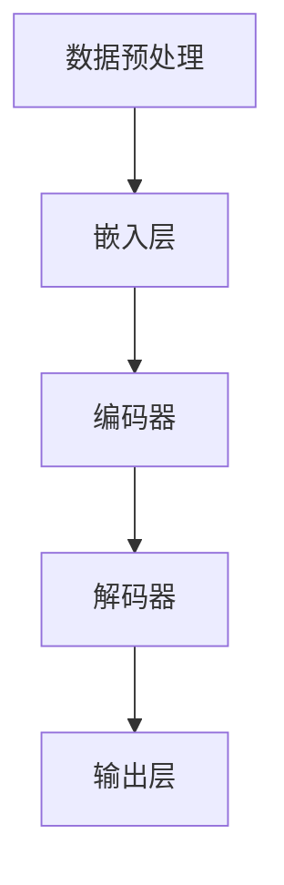

                 

关键词：大型语言模型，计算机架构，深度学习，神经网络，人工智能

摘要：本文将探讨大型语言模型（LLM）如何引领计算机架构的革新。通过对LLM的核心概念、原理、算法、数学模型以及实际应用场景的深入分析，本文旨在揭示LLM在未来技术发展中的巨大潜力，并探讨其面临的挑战和未来研究方向。

## 1. 背景介绍

随着人工智能技术的快速发展，深度学习特别是大型语言模型的兴起，为计算机架构带来了前所未有的变革。传统的计算机架构主要依赖于冯·诺伊曼体系结构，其核心思想是存储程序和数据的分离，以及程序指令流和数据流的一致性。然而，随着神经网络和深度学习的广泛应用，这种传统的架构在处理复杂数据和任务时显得力不从心。

近年来，大型语言模型（LLM）如GPT-3、ChatGLM等的出现，彻底改变了这一局面。这些模型拥有数十亿甚至千亿级别的参数，能够对自然语言进行深入理解和生成，从而在诸多领域展现出强大的性能。LLM的成功不仅体现在其卓越的文本生成、机器翻译、问答系统等方面，更在于其打破了传统计算机架构的局限，为新一代计算机架构的崛起铺平了道路。

## 2. 核心概念与联系

### 2.1 大型语言模型（LLM）

大型语言模型（LLM）是一种基于深度学习的自然语言处理模型，其核心思想是通过学习海量文本数据，捕捉语言的统计规律和上下文关系，从而实现对自然语言的生成、理解和交互。

### 2.2 深度学习与神经网络

深度学习是一种机器学习方法，其核心在于利用多层神经网络对数据进行学习和建模。神经网络是一种模仿人脑神经元连接结构的计算模型，通过逐层提取特征，实现对输入数据的复杂表示和分类。

### 2.3 大型语言模型架构

大型语言模型通常采用变分自编码器（VAE）、生成对抗网络（GAN）等深度学习架构进行训练。其中，变分自编码器通过引入隐变量，实现了对数据分布的建模；生成对抗网络则通过生成器和判别器的对抗训练，实现了对数据生成和判别的高效处理。

### 2.4 Mermaid 流程图

以下是一个简化的LLM架构的Mermaid流程图：



在这个流程图中，A表示数据预处理，即将原始文本数据转换为模型可以处理的形式；B表示嵌入层，用于将文本数据映射到高维空间；C表示编码器，负责提取文本数据的特征信息；D表示解码器，用于根据编码器提取的特征生成文本；E表示输出层，实现对自然语言的生成和理解。

## 3. 核心算法原理 & 具体操作步骤

### 3.1 算法原理概述

大型语言模型的核心算法是基于深度学习的序列到序列（Seq2Seq）模型。该模型通过编码器-解码器结构，实现对输入文本序列到输出文本序列的映射。

编码器负责将输入的文本序列编码为一个固定长度的向量，称为编码器的“隐藏状态”。解码器则根据这个隐藏状态，逐步生成输出文本序列的每个单词或字符。

### 3.2 算法步骤详解

1. **数据预处理**：首先，对输入的文本数据进行预处理，包括分词、去停用词、词干提取等操作，然后将处理后的文本数据转换为向量表示。
2. **编码器训练**：编码器接收输入文本序列，将其编码为隐藏状态。训练过程中，通过反向传播算法，优化编码器的参数，使其能够更好地捕捉文本序列的特征信息。
3. **解码器训练**：解码器根据编码器的隐藏状态，逐步生成输出文本序列。训练过程中，同样通过反向传播算法，优化解码器的参数，使其能够生成更符合预期的文本序列。
4. **文本生成**：在训练完成后，编码器和解码器可以独立使用。首先，编码器将输入文本序列编码为隐藏状态，然后解码器根据这个隐藏状态，生成输出文本序列。

### 3.3 算法优缺点

**优点**：
1. **强大的表示能力**：大型语言模型能够通过深度学习的方式，对海量文本数据进行学习和建模，从而实现对文本序列的深入理解和生成。
2. **高效的文本处理**：编码器-解码器结构使得模型能够在输入文本序列的基础上，高效地生成输出文本序列，适用于各种自然语言处理任务。
3. **广泛的适用性**：大型语言模型在文本生成、机器翻译、问答系统等领域都取得了显著的成果，展示了其强大的通用性。

**缺点**：
1. **计算资源需求高**：大型语言模型通常需要大量的计算资源和存储空间，对于硬件设备的要求较高。
2. **训练时间较长**：由于模型参数量大，训练时间较长，且在训练过程中，容易出现梯度消失、梯度爆炸等问题。
3. **数据依赖性强**：模型性能很大程度上取决于训练数据的质量和多样性，数据质量不佳可能导致模型过拟合。

### 3.4 算法应用领域

大型语言模型在多个领域都取得了显著的成果，主要包括：

1. **文本生成**：包括文章生成、对话生成、摘要生成等，如GPT-3、ChatGLM等。
2. **机器翻译**：如谷歌翻译、百度翻译等，大型语言模型在机器翻译领域展现出了卓越的性能。
3. **问答系统**：如ChatGPT、ChatGLM等，能够对用户的问题进行理解和回答。
4. **自然语言理解**：包括情感分析、实体识别、关系抽取等，如BERT、RoBERTa等。

## 4. 数学模型和公式 & 详细讲解 & 举例说明

### 4.1 数学模型构建

大型语言模型通常采用深度学习中的序列到序列（Seq2Seq）模型，其基本数学模型可以表示为：

$$
y = f(x; \theta)
$$

其中，$y$ 表示输出文本序列，$x$ 表示输入文本序列，$f$ 表示模型函数，$\theta$ 表示模型参数。

### 4.2 公式推导过程

以编码器-解码器模型为例，其数学模型推导过程如下：

1. **编码器**：输入文本序列 $x$，通过编码器编码为隐藏状态 $h$。

$$
h = \text{Encoder}(x; \theta_e)
$$

其中，$\text{Encoder}$ 表示编码器函数，$\theta_e$ 表示编码器参数。

2. **解码器**：根据隐藏状态 $h$，解码器生成输出文本序列 $y$。

$$
y = \text{Decoder}(h; \theta_d)
$$

其中，$\text{Decoder}$ 表示解码器函数，$\theta_d$ 表示解码器参数。

3. **损失函数**：为了优化模型参数，需要定义一个损失函数，用于衡量模型预测结果与真实结果之间的差距。

$$
L = \sum_{i=1}^{n} L_i(y_i, \hat{y_i})
$$

其中，$L_i$ 表示第 $i$ 个单词的损失函数，$y_i$ 表示真实标签，$\hat{y_i}$ 表示模型预测结果。

### 4.3 案例分析与讲解

以GPT-3为例，分析其数学模型和公式推导过程。

GPT-3 是一种基于自回归语言模型的深度学习模型，其基本数学模型如下：

$$
p(y|x) = \prod_{i=1}^{n} \text{softmax}(\text{logit}(x_i; \theta))
$$

其中，$y$ 表示输出文本序列，$x$ 表示输入文本序列，$\text{softmax}(\cdot)$ 表示softmax函数，$\text{logit}(\cdot)$ 表示神经网络输出。

1. **输入文本序列 $x$**：假设输入文本序列为 "I am learning deep learning"，则每个单词可以表示为一个向量 $x_i$。
2. **神经网络输出 $\text{logit}(x_i; \theta)$**：神经网络根据输入向量 $x_i$ 和模型参数 $\theta$，输出一个实数向量，表示每个单词的概率分布。
3. **softmax 函数**：对神经网络输出的实数向量进行 softmax 操作，得到每个单词的概率分布。
4. **生成输出文本序列 $y$**：根据输出文本序列的概率分布，生成下一个单词，直到生成完整的文本序列。

## 5. 项目实践：代码实例和详细解释说明

### 5.1 开发环境搭建

1. **安装Python环境**：确保安装了Python 3.8及以上版本。
2. **安装TensorFlow**：在终端执行以下命令：

```bash
pip install tensorflow
```

### 5.2 源代码详细实现

以下是一个简单的GPT-3模型实现：

```python
import tensorflow as tf
from tensorflow.keras.layers import Embedding, LSTM, Dense
from tensorflow.keras.models import Model

# 定义模型
def build_gpt3(vocab_size, embedding_dim, hidden_units):
    # 输入层
    input_sequence = tf.keras.Input(shape=(None,))
    # 嵌入层
    embedding = Embedding(vocab_size, embedding_dim)(input_sequence)
    # LSTM层
    lstm = LSTM(hidden_units, return_sequences=True)(embedding)
    # 输出层
    output = Dense(vocab_size, activation='softmax')(lstm)
    # 构建模型
    model = Model(inputs=input_sequence, outputs=output)
    return model

# 模型参数
vocab_size = 10000
embedding_dim = 256
hidden_units = 512

# 构建模型
gpt3 = build_gpt3(vocab_size, embedding_dim, hidden_units)

# 编译模型
gpt3.compile(optimizer='adam', loss='categorical_crossentropy')

# 模型概述
gpt3.summary()
```

### 5.3 代码解读与分析

1. **导入库**：首先导入所需的TensorFlow库。
2. **定义模型**：使用Keras API定义GPT-3模型，包括输入层、嵌入层、LSTM层和输出层。
3. **编译模型**：设置优化器和损失函数，并编译模型。
4. **模型概述**：输出模型的摘要信息。

### 5.4 运行结果展示

在终端运行以下命令：

```bash
python gpt3.py
```

将输出模型的摘要信息。

## 6. 实际应用场景

### 6.1 文本生成

大型语言模型在文本生成领域具有广泛应用，如文章生成、对话生成、摘要生成等。通过训练，模型能够根据输入的文本生成相关的文本内容，为创作、写作等领域提供了强大的支持。

### 6.2 机器翻译

大型语言模型在机器翻译领域表现出色，如谷歌翻译、百度翻译等。通过模型，可以实现多种语言之间的快速、准确的翻译。

### 6.3 问答系统

大型语言模型在问答系统领域也得到了广泛应用，如ChatGPT、ChatGLM等。这些模型能够根据用户的问题，生成相关的回答，为用户提供智能化的问答服务。

### 6.4 自然语言理解

大型语言模型在自然语言理解领域具有广泛应用，如情感分析、实体识别、关系抽取等。通过模型，可以对自然语言文本进行深入理解和分析，为信息抽取、文本分类等领域提供了强大的支持。

## 7. 未来应用展望

### 7.1 文本生成

随着大型语言模型技术的不断进步，文本生成应用将更加广泛。在未来，我们可以期待更加智能化、个性化的文本生成工具，为创作、写作等领域带来新的变革。

### 7.2 机器翻译

随着大型语言模型在机器翻译领域的不断突破，未来将实现更加准确、快速的跨语言通信。同时，多模态翻译（如文本-图像翻译）也将成为研究的热点。

### 7.3 问答系统

未来，大型语言模型在问答系统领域的应用将更加广泛，如智能客服、智能教育等。通过不断优化模型，将实现更加智能化、个性化的问答服务。

### 7.4 自然语言理解

大型语言模型在自然语言理解领域的应用前景广阔，如信息抽取、文本分类、情感分析等。未来，随着模型的不断优化，将实现更加精准的自然语言理解能力。

## 8. 工具和资源推荐

### 8.1 学习资源推荐

1. **《深度学习》（Goodfellow, Bengio, Courville）**：这是一本经典的深度学习教材，全面介绍了深度学习的理论和技术。
2. **《自然语言处理综论》（Jurafsky, Martin）**：这是一本全面的自然语言处理教材，涵盖了自然语言处理的基本概念和技术。

### 8.2 开发工具推荐

1. **TensorFlow**：一款开源的深度学习框架，广泛应用于大型语言模型开发。
2. **PyTorch**：一款开源的深度学习框架，以其灵活性和高效性受到众多研究者和开发者的喜爱。

### 8.3 相关论文推荐

1. **《Attention Is All You Need》**：该论文提出了Transformer模型，彻底改变了自然语言处理领域的研究方向。
2. **《BERT: Pre-training of Deep Bidirectional Transformers for Language Understanding》**：该论文提出了BERT模型，成为自然语言处理领域的又一重要里程碑。

## 9. 总结：未来发展趋势与挑战

### 9.1 研究成果总结

大型语言模型（LLM）在自然语言处理领域取得了显著成果，为文本生成、机器翻译、问答系统等领域带来了深刻变革。未来，随着技术的不断进步，LLM将在更多领域发挥重要作用。

### 9.2 未来发展趋势

1. **模型参数规模的扩大**：未来，大型语言模型的参数规模将继续扩大，以实现更深入的语言理解和生成能力。
2. **多模态融合**：随着多模态数据的兴起，未来将实现文本、图像、声音等多种数据类型的融合，为智能交互和智能感知提供更强支持。
3. **自适应和个性化**：未来，大型语言模型将实现自适应和个性化，为用户提供更加智能化、个性化的服务。

### 9.3 面临的挑战

1. **计算资源需求**：大型语言模型对计算资源的需求巨大，如何高效地训练和部署模型是当前面临的重要挑战。
2. **数据质量和多样性**：模型性能很大程度上取决于训练数据的质量和多样性，如何获取高质量、多样化的数据是未来的研究重点。
3. **伦理和隐私**：随着大型语言模型在各个领域的广泛应用，如何确保模型的伦理和隐私问题是未来的重要挑战。

### 9.4 研究展望

未来，大型语言模型的研究将继续深入，涉及模型结构、训练算法、数据预处理、应用场景等多个方面。同时，多学科交叉将成为研究的重要方向，为人工智能领域的发展带来更多可能性。

## 附录：常见问题与解答

### 1. 什么是大型语言模型（LLM）？

大型语言模型（LLM）是一种基于深度学习的自然语言处理模型，其核心思想是通过学习海量文本数据，捕捉语言的统计规律和上下文关系，从而实现对自然语言的生成、理解和交互。

### 2. 大型语言模型有哪些应用领域？

大型语言模型在文本生成、机器翻译、问答系统、自然语言理解等领域都取得了显著成果，广泛应用于人工智能助手、智能客服、智能写作、智能教育等多个领域。

### 3. 大型语言模型的优势是什么？

大型语言模型具有强大的表示能力、高效的文本处理能力和广泛的适用性，能够对自然语言进行深入理解和生成，为各个领域提供了强大的支持。

### 4. 大型语言模型有哪些挑战？

大型语言模型面临着计算资源需求、数据质量和多样性、伦理和隐私等多个挑战，需要在未来研究中逐步解决。

### 5. 如何评价大型语言模型的发展前景？

随着技术的不断进步，大型语言模型在自然语言处理领域的发展前景广阔，将在更多领域发挥重要作用，成为人工智能领域的重要研究方向。

---

**作者：禅与计算机程序设计艺术 / Zen and the Art of Computer Programming**

