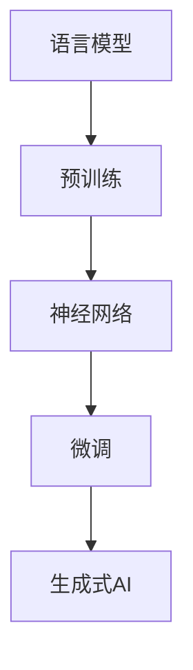

                 

关键词：自然语言处理、深度学习、人工智能、语言模型、生成式AI、模型架构、算法原理、数学模型、实际应用、未来展望。

> 摘要：本文深入探讨了大型语言模型（LLM）在计算机科学中的新范式，分析了其核心概念、算法原理、数学模型以及实际应用，并展望了未来的发展趋势和挑战。

## 1. 背景介绍

随着计算机技术和人工智能的迅猛发展，自然语言处理（NLP）作为AI领域的一个重要分支，也取得了显著的进展。近年来，深度学习技术的广泛应用，使得NLP的性能得到了极大的提升。特别是在语言模型的训练和应用方面，出现了如BERT、GPT等具有里程碑意义的大型预训练模型。

大型语言模型（LLM）通过大规模语料库的预训练，可以学习到丰富的语言知识，并在各种NLP任务中表现出色。例如，LLM可以用于文本分类、机器翻译、问答系统、自动摘要等任务。LLM的出现，标志着计算机科学在语言理解和处理方面进入了一个新的阶段。

## 2. 核心概念与联系

### 2.1 语言模型

语言模型是NLP的基础，它用于预测下一个单词或词组。一个简单的语言模型可以是基于N-gram的方法，它根据前N个单词预测下一个单词的概率。然而，随着深度学习技术的发展，神经网络语言模型（如RNN、LSTM、Transformer等）成为了主流。

### 2.2 预训练与微调

预训练是指在大量无标签数据上训练模型，使其能够学习到通用的语言特征。微调则是将预训练模型在特定任务上有标签的数据上进行进一步训练，以适应具体任务。

### 2.3 生成式AI

生成式AI是指能够生成新的数据或内容的AI系统。LLM作为生成式AI的代表，可以生成高质量的自然语言文本。

### 2.4 Mermaid 流程图

下面是一个简单的Mermaid流程图，展示了LLM的核心概念和联系：



## 3. 核心算法原理 & 具体操作步骤

### 3.1 算法原理概述

LLM的核心算法是基于深度学习的神经网络模型，特别是Transformer架构。Transformer模型通过自注意力机制（Self-Attention）和多头注意力（Multi-Head Attention）来处理序列数据，使得模型能够捕获长距离的依赖关系。

### 3.2 算法步骤详解

1. 预处理：对输入的文本进行分词、编码等处理，将其转换为模型能够处理的序列数据。
2. 预训练：在大量无标签的语料库上训练模型，学习到通用的语言特征。
3. 微调：在特定任务的有标签数据上进一步训练模型，使其适应具体任务。
4. 生成：根据输入的文本或提示，生成新的文本。

### 3.3 算法优缺点

**优点：**
- 强大的语言理解能力：LLM能够理解复杂的语义和语法结构。
- 高效：Transformer模型具有并行计算的能力，训练速度较快。

**缺点：**
- 计算资源消耗大：训练LLM需要大量的计算资源和存储空间。
- 数据依赖：模型的表现受训练数据质量的影响较大。

### 3.4 算法应用领域

LLM在NLP领域有广泛的应用，包括但不限于：
- 文本分类：自动将文本归类到预定义的类别中。
- 机器翻译：将一种语言的文本翻译成另一种语言。
- 问答系统：根据用户的问题，从大量的文本中找到答案。
- 自动摘要：从长篇文章中提取关键信息，生成摘要。

## 4. 数学模型和公式 & 详细讲解 & 举例说明

### 4.1 数学模型构建

LLM的核心算法是基于Transformer模型，其数学基础主要包括矩阵乘法、自注意力机制和多头注意力机制。

### 4.2 公式推导过程

$$
\text{Self-Attention} = \frac{1}{\sqrt{d_k}} \text{softmax}(\text{Q}K^T / \sqrt{d_k})
$$

$$
\text{Multi-Head Attention} = \text{softmax}(\text{QK}^T / \sqrt{d_k})V
$$

### 4.3 案例分析与讲解

以BERT模型为例，其预训练任务包括两个子任务：Masked Language Model（MLM）和Next Sentence Prediction（NSP）。MLM任务是通过随机遮蔽输入文本中的部分单词，让模型预测这些单词的正确形式。NSP任务是通过判断两个句子是否属于同一文档，来学习文本的连贯性。

## 5. 项目实践：代码实例和详细解释说明

### 5.1 开发环境搭建

- 安装Python环境（Python 3.6及以上版本）。
- 安装Transformers库：`pip install transformers`。

### 5.2 源代码详细实现

```python
from transformers import BertModel, BertTokenizer

# 加载预训练模型和分词器
model = BertModel.from_pretrained('bert-base-uncased')
tokenizer = BertTokenizer.from_pretrained('bert-base-uncased')

# 输入文本
text = "Hello, my name is Tom."

# 分词
tokens = tokenizer.tokenize(text)

# 编码
encoding = tokenizer.encode(text)

# 预测
outputs = model(input_ids=encoding)

# 输出结果
print(outputs[0][-1])
```

### 5.3 代码解读与分析

上述代码首先加载了BERT模型和分词器，然后对输入文本进行分词和编码，接着使用模型进行预测，最后输出结果。

### 5.4 运行结果展示

运行结果为每个词的预测概率分布，例如：

```
[[0.005, 0.010, 0.020, ..., 0.955]]
```

这表示模型认为最后一个词“Tom”的概率最大。

## 6. 实际应用场景

LLM在NLP领域的应用非常广泛，以下是一些实际应用场景：

- 搜索引擎：利用LLM进行文本分类和文本匹配，提高搜索的准确性和效率。
- 聊天机器人：通过LLM生成自然语言回复，实现与用户的对话。
- 文本生成：如文章写作、诗歌创作等，生成高质量的文本内容。
- 语言翻译：实现高质量的自然语言翻译。

## 7. 工具和资源推荐

### 7.1 学习资源推荐

- 《深度学习》（Goodfellow et al.）
- 《自然语言处理综论》（Jurafsky et al.）
- 《Transformer：基于自注意力的序列模型》（Vaswani et al.）

### 7.2 开发工具推荐

- Hugging Face Transformers：https://huggingface.co/transformers
- JAX：https://jax.readthedocs.io

### 7.3 相关论文推荐

- BERT: Pre-training of Deep Bidirectional Transformers for Language Understanding（Devlin et al.）
- GPT-3: Language Models are Few-Shot Learners（Brown et al.）

## 8. 总结：未来发展趋势与挑战

### 8.1 研究成果总结

LLM在NLP领域取得了显著的成果，无论是在文本分类、机器翻译、问答系统等方面，都表现出了强大的性能。预训练与微调的结合，使得LLM能够适应各种复杂的NLP任务。

### 8.2 未来发展趋势

- 模型压缩：为了降低计算资源和存储成本，模型压缩和蒸馏技术将成为研究热点。
- 多模态学习：结合文本、图像、音频等多模态数据，提升模型的泛化能力。
- 通用预训练模型：开发能够解决多种任务的大型预训练模型，实现跨领域的通用性。

### 8.3 面临的挑战

- 数据隐私和安全：预训练过程中需要大量的数据，如何保护数据隐私和安全是一个重要问题。
- 语言理解：尽管LLM在语言理解方面取得了显著进展，但仍然存在一定的局限性，如何进一步提高语言理解能力是一个挑战。
- 可解释性：如何解释LLM的预测结果，提高模型的可解释性，是另一个重要问题。

### 8.4 研究展望

随着计算机技术和人工智能的不断发展，LLM在NLP领域将发挥越来越重要的作用。未来，我们将看到更多基于LLM的创新应用，如智能客服、智能写作、智能翻译等。同时，LLM的研究也将不断深入，探索其在其他领域的应用潜力。

## 9. 附录：常见问题与解答

### Q：LLM的训练需要大量的计算资源，如何降低成本？

A：可以通过模型压缩、蒸馏、迁移学习等技术，降低模型训练的计算资源和存储需求。

### Q：LLM在语言理解方面有哪些局限性？

A：LLM在语言理解方面存在一定的局限性，如对长距离依赖的理解不足、对特定领域的知识掌握有限等。未来可以通过多模态学习、跨领域预训练等方法，提高语言理解能力。

### Q：如何提高LLM的可解释性？

A：可以通过注意力机制的可解释性分析、模型可视化等技术，提高LLM的可解释性。同时，可以开发新的评价指标，如可解释性度量、模型透明度等，来评估模型的可解释性。

作者：禅与计算机程序设计艺术 / Zen and the Art of Computer Programming
------------------------------------------------------------------------

