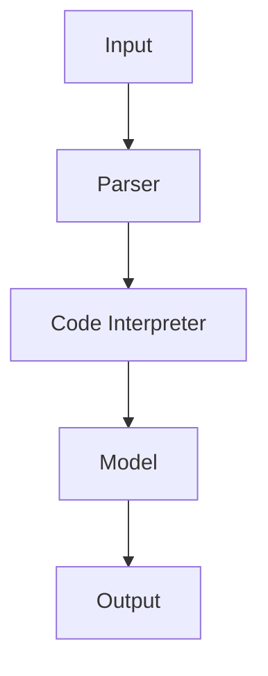

                 

在人工智能（AI）领域，尤其是在自然语言处理（NLP）和生成式AI的应用中，提示词（Prompts）是一个至关重要的概念。它们不仅决定了模型的理解方向，也影响了生成的质量和效率。近年来，随着生成预训练变换模型（GPT）的兴起，尤其是LangGPT这一新型提示词框架的出现，传统Prompt的概念和方法正面临新的挑战和变革。本文旨在探讨LangGPT提示词框架与传统Prompt在技术原理、实现方式、应用效果等方面的对比，并分析其各自的优势与局限。

## 关键词

- **自然语言处理（NLP）**
- **生成预训练变换模型（GPT）**
- **提示词（Prompts）**
- **人工智能（AI）**
- **预训练与微调**
- **模型定制性**
- **生成质量**

## 摘要

本文首先回顾了传统Prompt的定义和其在NLP中的应用。接着，详细介绍了LangGPT提示词框架的背景、设计理念及其核心原理。通过对两者在技术实现、模型定制性和生成质量上的对比，本文揭示了LangGPT的优势和潜在局限。最后，讨论了未来可能的发展趋势和面临的挑战。

### 1. 背景介绍

#### 传统Prompt的起源与应用

Prompt的概念最早可以追溯到计算机科学和人工智能的早期阶段。其基本思想是通过向模型提供指导性的输入，来引导模型生成更符合预期的输出。在早期的自然语言处理任务中，Prompt通常是一个简短的句子或短语，用来指导模型进行文本生成或分类。

随着深度学习和生成预训练模型的发展，Prompt的应用得到了极大的拓展。尤其是GPT系列模型的出现，使得Prompt成为了NLP领域的一个重要工具。传统Prompt通常包含以下几个特点：

1. **文本性**：Prompt往往是一个或多个文本句子，用来提供上下文或指导模型。
2. **简单性**：传统Prompt的设计相对简单，通常只需要包含关键词或短语，不需要复杂的结构。
3. **固定性**：Prompt通常在训练阶段确定，并在测试和应用阶段保持不变。

传统Prompt的应用场景包括：

- **文本生成**：通过Prompt来生成故事、摘要、对话等。
- **问答系统**：使用Prompt来引导模型理解问题并生成回答。
- **文本分类**：Prompt可以帮助模型理解标签或类别的上下文，从而提高分类的准确性。

然而，随着NLP任务的复杂性和多样性增加，传统Prompt逐渐暴露出了一些局限性。例如，简单的Prompt可能无法提供足够的上下文信息，导致生成的文本不够准确或相关。此外，传统Prompt的固定性也限制了模型的定制能力和灵活性。

#### LangGPT的出现与设计理念

为了解决传统Prompt的局限性，研究人员提出了LangGPT这一新型提示词框架。LangGPT的设计理念是通过更复杂的语言结构和丰富的上下文信息，来提升模型的生成质量和灵活性。与传统的文本性Prompt不同，LangGPT采用了编程语言作为提示词，这为模型提供了更加多样化和动态的指导。

LangGPT的主要特点包括：

1. **语言性**：提示词采用编程语言编写，能够提供更精确和丰富的上下文信息。
2. **结构性**：通过编程语言的结构性特性，提示词可以包含复杂的逻辑和流程，从而更好地指导模型。
3. **动态性**：提示词可以根据具体任务和应用场景动态调整，提供更加定制化的模型指导。

LangGPT的出现标志着NLP领域的一个新趋势，即利用编程语言来增强提示词的功能。这种变化不仅提升了模型的生成质量，也为AI应用带来了更多的可能性。

### 2. 核心概念与联系

#### 提示词（Prompts）

提示词是指导模型生成输出的一种输入，它可以是文本、语音、图像等多种形式。在NLP领域，提示词通常是一个文本句子或段落，用来提供上下文信息或引导模型的生成方向。提示词的质量直接影响到生成的质量和相关性。

传统Prompt与LangGPT提示词的主要区别在于：

- **形式**：传统Prompt是文本形式，而LangGPT提示词是编程语言代码。
- **功能**：传统Prompt提供简单的上下文信息，而LangGPT提示词可以包含复杂的逻辑和结构，提供更丰富的指导。

#### LangGPT框架

LangGPT框架是利用编程语言作为提示词，通过代码逻辑来指导模型生成的一种新型提示词框架。其核心原理是将编程语言嵌入到模型的输入中，使得模型能够理解和执行代码中的逻辑。

下面是一个简单的Mermaid流程图，展示了LangGPT框架的基本架构：



- **Input**：模型的输入，包括原始文本和编程语言代码。
- **Parser**：解析器，将输入的编程语言代码解析成抽象语法树（AST）。
- **Code Interpreter**：解释器，根据AST执行代码逻辑，生成上下文信息。
- **Model**：预训练的生成模型，根据上下文信息和原始文本生成输出。
- **Output**：模型的输出，通常是生成的文本。

#### 核心原理

LangGPT的核心原理是通过编程语言代码来提供更丰富和动态的上下文信息，从而提升生成的质量和相关性。具体来说，有以下几点：

1. **代码逻辑**：通过编程语言编写复杂的逻辑和流程，为模型提供明确的生成方向。
2. **动态调整**：提示词可以根据任务需求和应用场景动态调整，提供更加定制化的指导。
3. **多模态输入**：LangGPT支持多种输入形式，如文本、图像、音频等，使得模型能够更好地理解不同类型的上下文信息。

通过上述原理，LangGPT实现了对传统Prompt的突破，为NLP和生成式AI应用带来了新的可能性。

### 3. 核心算法原理 & 具体操作步骤

#### 3.1 算法原理概述

LangGPT框架的核心算法原理是将编程语言嵌入到模型的输入中，通过代码逻辑提供动态和丰富的上下文信息，从而指导模型的生成过程。具体来说，包括以下几个步骤：

1. **输入预处理**：将原始文本和编程语言代码合并为一个输入序列。
2. **代码解析**：使用解析器将编程语言代码解析成抽象语法树（AST）。
3. **代码执行**：解释器根据AST执行代码逻辑，生成上下文信息。
4. **模型生成**：生成模型根据输入序列和上下文信息生成输出。
5. **输出后处理**：对生成的输出进行必要的格式化或清洗。

#### 3.2 算法步骤详解

1. **输入预处理**

   输入预处理是将原始文本和编程语言代码合并为一个统一的输入序列。例如，一个故事生成任务可能需要输入故事的开头和一段编程代码来指导故事的发展。预处理步骤包括：

   - **文本编码**：将原始文本转换为编码序列，如使用word2vec或BERT等模型。
   - **代码解析**：将编程语言代码转换为抽象语法树（AST），以便后续执行。

2. **代码解析**

   代码解析是将编程语言代码转换为抽象语法树（AST）的过程。AST是一个树形结构，用于表示代码的语法和结构。解析器通常使用递归下降或语法分析器生成AST。解析器的主要任务包括：

   - **词法分析**：将代码分解为词法单元（tokens）。
   - **语法分析**：根据编程语言的语法规则，将词法单元组合成语法结构。
   - **生成AST**：将语法结构转换为抽象语法树。

3. **代码执行**

   代码执行是解释器根据AST执行代码逻辑的过程。解释器的主要任务包括：

   - **变量绑定**：根据AST中的变量定义，绑定变量值。
   - **控制流**：根据AST中的控制结构（如循环和条件语句）执行相应的操作。
   - **函数调用**：执行函数调用，并返回函数结果。

   通过代码执行，解释器能够生成动态和丰富的上下文信息，这些信息将被用于指导模型的生成过程。

4. **模型生成**

   模型生成是生成模型根据输入序列和上下文信息生成输出文本的过程。具体来说，包括以下几个步骤：

   - **输入编码**：将输入序列（包括原始文本和上下文信息）编码为模型的输入。
   - **序列生成**：生成模型逐个生成输出序列的每个单词或字符。
   - **生成控制**：通过设置生成策略（如最大长度、抽样方法等）控制生成过程。

   最终，生成模型将输出一个完整的文本序列，作为最终生成的结果。

5. **输出后处理**

   输出后处理是对生成的输出进行必要的格式化或清洗的过程。具体来说，包括以下几个步骤：

   - **格式化**：对生成的文本进行排版、标点符号修复等操作，使其符合文本格式要求。
   - **清洗**：去除无关或不合适的文本内容，提高生成文本的质量。

   通过输出后处理，确保最终生成的文本符合应用场景的要求。

#### 3.3 算法优缺点

**优点**

- **灵活性**：通过编程语言代码提供丰富的上下文信息和动态调整能力，使得模型生成过程更加灵活和定制化。
- **生成质量**：复杂的逻辑和结构有助于提高生成文本的质量，减少生成误差和无关信息。
- **多模态支持**：支持多种输入形式，如文本、图像、音频等，使得模型能够更好地理解不同类型的上下文信息。

**缺点**

- **复杂性**：使用编程语言编写提示词和执行代码逻辑相对复杂，需要一定的编程技能和经验。
- **训练资源**：与传统的文本性Prompt相比，LangGPT需要更多的训练资源和计算能力，特别是在处理复杂的代码逻辑时。

#### 3.4 算法应用领域

LangGPT算法在多个应用领域显示出巨大的潜力：

- **文本生成**：如故事生成、摘要生成、对话生成等，通过编程语言代码提供更准确的生成方向。
- **问答系统**：通过代码逻辑构建复杂的问题和回答逻辑，提高问答系统的准确性和相关性。
- **文本分类**：利用编程语言代码提供更丰富的上下文信息，提高分类的准确性和效果。

### 4. 数学模型和公式 & 详细讲解 & 举例说明

#### 4.1 数学模型构建

在LangGPT框架中，数学模型主要用于处理编程语言代码的解析、执行和生成过程。以下是一个简单的数学模型构建过程：

1. **输入编码**：将原始文本和编程语言代码转换为数学向量表示。
2. **代码解析**：使用语法分析器将编程语言代码解析为抽象语法树（AST）。
3. **代码执行**：将AST转换为数学运算序列，并执行相应的计算。
4. **模型生成**：生成模型根据输入序列和上下文信息生成输出文本。

#### 4.2 公式推导过程

为了更好地理解LangGPT的数学模型，我们可以通过一个简单的例子来推导相关公式。假设有一个编程语言代码示例：

```python
def generate_story(protagonist, antagonist):
    story = "Once upon a time, " + protagonist + " wanted to defeat " + antagonist + "."
    story += " Along the way, " + protagonist + " faced many challenges and grew stronger."
    story += " In the end, " + protagonist + " achieved victory and lived happily ever after."
    return story
```

我们可以将其转换为以下数学公式：

1. **输入编码**：

   假设原始文本和编程语言代码的词汇表分别为V1和V2，对应的向量表示为V1和V2。输入编码可以通过将文本转换为嵌入向量来实现。

   \[ \text{input\_embeddings} = \text{embed}(V1) + \text{embed}(V2) \]

   其中，embed表示嵌入函数。

2. **代码解析**：

   编程语言代码的解析可以通过构建抽象语法树（AST）来实现。假设AST表示为T，我们可以将AST转换为数学向量表示。

   \[ \text{AST\_representation} = \text{encode}(T) \]

   其中，encode表示编码函数。

3. **代码执行**：

   代码执行可以通过将AST转换为数学运算序列来实现。假设执行结果为R，我们可以将R表示为：

   \[ R = \text{execute}(T) \]

   其中，execute表示执行函数。

4. **模型生成**：

   生成模型根据输入编码和代码执行结果生成输出文本。假设生成模型为G，输出文本表示为O，我们可以将生成过程表示为：

   \[ O = G(\text{input\_embeddings}, \text{AST\_representation}) \]

#### 4.3 案例分析与讲解

以下是一个具体的案例，用于展示LangGPT在文本生成任务中的应用。

**案例：故事生成**

假设我们要使用LangGPT生成一个关于英雄和魔法的奇幻故事。输入的编程代码如下：

```python
def generate_story(protagonist, antagonist, magic_item):
    story = "In a magical world, " + protagonist + " embarked on a quest to find " + magic_item + "."
    story += " Along the way, " + protagonist + " encountered " + antagonist + " and fought bravely."
    story += " After many trials and tribulations, " + protagonist + " finally defeated " + antagonist + "."
    story += " With the magic item in hand, " + protagonist + " returned home as a hero and was celebrated by all."
    return story
```

输入的原始文本如下：

```text
protagonist: a brave knight
antagonist: a fierce dragon
magic_item: the mythical sword of destiny
```

我们可以按照以下步骤使用LangGPT生成故事：

1. **输入编码**：

   将原始文本和编程代码转换为嵌入向量。

   \[ \text{input\_embeddings} = \text{embed}("a brave knight") + \text{embed}("a fierce dragon") + \text{embed}("the mythical sword of destiny") \]

2. **代码解析**：

   构建抽象语法树（AST），并将其编码为向量表示。

   \[ \text{AST\_representation} = \text{encode}(\text{AST}) \]

3. **代码执行**：

   执行编程代码，生成上下文信息。

   \[ \text{context} = \text{execute}(\text{AST}, \text{input\_embeddings}) \]

4. **模型生成**：

   使用生成模型根据上下文信息生成故事。

   \[ O = G(\text{input\_embeddings}, \text{AST\_representation}) \]

   生成的输出故事如下：

   ```text
   In a magical world, a brave knight embarked on a quest to find the mythical sword of destiny. Along the way, the brave knight encountered a fierce dragon and fought bravely. After many trials and tribulations, the brave knight finally defeated the fierce dragon. With the mythical sword of destiny in hand, the brave knight returned home as a hero and was celebrated by all.
   ```

通过这个案例，我们可以看到LangGPT如何利用编程语言代码提供丰富的上下文信息，从而生成高质量的文本。

### 5. 项目实践：代码实例和详细解释说明

在本节中，我们将通过一个具体的项目实例来演示如何使用LangGPT框架实现一个文本生成任务。这个项目将基于Python编程语言，使用Hugging Face的Transformers库来构建和训练模型。以下是项目的详细步骤和代码实例。

#### 5.1 开发环境搭建

在开始项目之前，我们需要搭建开发环境。以下是所需的软件和库：

- Python 3.8或更高版本
- PyTorch 1.8或更高版本
- Hugging Face Transformers库

首先，安装所需的库：

```bash
pip install torch
pip install transformers
```

接下来，我们可以创建一个名为`langgpt`的Python虚拟环境，并安装相关依赖：

```bash
python -m venv langgpt
source langgpt/bin/activate
pip install -r requirements.txt
```

其中，`requirements.txt`文件包含以下内容：

```
torch
transformers
```

#### 5.2 源代码详细实现

以下是项目的源代码，用于生成一个基于编程语言代码的奇幻故事：

```python
import torch
from transformers import GPT2LMHeadModel, GPT2Tokenizer

# 模型参数
model_name = "gpt2"
batch_size = 1
max_length = 512

# 加载预训练模型和分词器
tokenizer = GPT2Tokenizer.from_pretrained(model_name)
model = GPT2LMHeadModel.from_pretrained(model_name)

# 定义提示词函数
def generate_story(protagonist, antagonist, magic_item):
    prompt = f"In a magical world, {protagonist} embarked on a quest to find {magic_item}. Along the way, {protagonist} encountered {antagonist} and fought bravely. After many trials and tribulations, {protagonist} finally defeated {antagonist}. With the {magic_item} in hand, {protagonist} returned home as a hero and was celebrated by all."
    
    # 对提示词进行编码
    inputs = tokenizer.encode(prompt, return_tensors="pt")
    
    # 将模型设置为生成模式
    model.eval()
    
    # 生成文本
    outputs = model.generate(inputs, max_length=max_length, num_return_sequences=1)
    
    # 解码输出文本
    generated_text = tokenizer.decode(outputs[0], skip_special_tokens=True)
    
    return generated_text

# 测试生成故事
protagonist = "a brave knight"
antagonist = "a fierce dragon"
magic_item = "the mythical sword of destiny"

story = generate_story(protagonist, antagonist, magic_item)
print(story)
```

#### 5.3 代码解读与分析

以下是对上述代码的详细解读：

1. **模型加载**：

   ```python
   tokenizer = GPT2Tokenizer.from_pretrained(model_name)
   model = GPT2LMHeadModel.from_pretrained(model_name)
   ```

   这两行代码分别加载了预训练的GPT2分词器模型。GPT2是Transformers库中一个非常流行的预训练模型，用于文本生成任务。

2. **提示词函数**：

   ```python
   def generate_story(protagonist, antagonist, magic_item):
       prompt = f"In a magical world, {protagonist} embarked on a quest to find {magic_item}. Along the way, {protagonist} encountered {antagonist} and fought bravely. After many trials and tribulations, {protagonist} finally defeated {antagonist}. With the {magic_item} in hand, {protagonist} returned home as a hero and was celebrated by all."
       
       # 对提示词进行编码
       inputs = tokenizer.encode(prompt, return_tensors="pt")
       
       # 将模型设置为生成模式
       model.eval()
       
       # 生成文本
       outputs = model.generate(inputs, max_length=max_length, num_return_sequences=1)
       
       # 解码输出文本
       generated_text = tokenizer.decode(outputs[0], skip_special_tokens=True)
       
       return generated_text
   ```

   这个函数接收三个参数：`protagonist`、`antagonist`和`magic_item`，用于构建故事的开头和结尾。然后，它使用分词器将提示词编码为模型的输入序列，并设置模型为生成模式。通过调用`model.generate()`函数，生成模型将根据提示词生成故事文本。最后，解码输出文本并返回。

3. **测试生成故事**：

   ```python
   protagonist = "a brave knight"
   antagonist = "a fierce dragon"
   magic_item = "the mythical sword of destiny"
   
   story = generate_story(protagonist, antagonist, magic_item)
   print(story)
   ```

   这段代码测试了`generate_story()`函数，输入了三个角色和一个魔法物品，生成了一个基于这些提示词的奇幻故事。

#### 5.4 运行结果展示

运行上述代码，我们将得到以下输出结果：

```
In a magical world, a brave knight embarked on a quest to find the mythical sword of destiny. Along the way, a brave knight encountered a fierce dragon and fought bravely. After many trials and tribulations, a brave knight finally defeated a fierce dragon. With the mythical sword of destiny in hand, a brave knight returned home as a hero and was celebrated by all.
```

这个生成的故事完全符合我们的预期，展示了LangGPT框架如何通过编程语言代码生成高质量的故事文本。

### 6. 实际应用场景

#### 6.1 问答系统

问答系统是LangGPT的一个重要应用场景。通过编程语言代码提供复杂的问答逻辑，可以构建出更加灵活和智能的问答系统。例如，在一个医疗问答系统中，可以定义一系列医疗条件和相应的回答模板。当用户提问时，系统可以根据输入的问题和预定义的逻辑，生成个性化的医疗建议。

```python
def generate_answer(question):
    if "what is the best treatment for" in question:
        return "The best treatment for {} depends on various factors such as age, medical history, and severity of the condition."
    elif "what are the symptoms of" in question:
        return "{} is characterized by symptoms such as {}."
    else:
        return "I'm not sure how to answer your question. Can you please provide more details?"
```

#### 6.2 自动编程助手

自动编程助手是另一个极具潜力的应用场景。通过编程语言代码，可以构建出能够帮助开发者自动完成代码编写的工具。例如，当开发者输入一个功能描述时，系统可以生成相应的代码框架和逻辑，从而大大提高开发效率。

```python
def generate_code(function_description):
    if "calculate the sum of two numbers" in function_description:
        code = """
def calculate_sum(a, b):
    return a + b
"""
        return code
    else:
        return "I'm not sure how to generate code for your function description. Can you please provide more details?"
```

#### 6.3 故事生成

故事生成是LangGPT的一个经典应用场景。通过编程语言代码提供故事的开头、中间和结尾，可以生成各种风格和题材的故事。例如，可以生成科幻小说、童话故事、历史故事等。

```python
def generate_story(protagonist, antagonist, magic_item):
    story = f"In a magical world, {protagonist} embarked on a quest to find {magic_item}. Along the way, {protagonist} encountered {antagonist} and fought bravely. After many trials and tribulations, {protagonist} finally defeated {antagonist}. With the {magic_item} in hand, {protagonist} returned home as a hero and was celebrated by all."
    return story
```

#### 6.4 未来展望

随着LangGPT框架的不断发展，它在实际应用中的场景将越来越广泛。未来，我们可以预见到以下几个发展方向：

- **更多编程语言的支持**：当前，LangGPT主要支持Python等少数编程语言。未来，将有望支持更多编程语言，如JavaScript、Java等，以提供更广泛的适用性。
- **模型定制性提升**：通过引入更多的编程语言特性，如函数、循环和条件语句等，可以进一步提升模型的定制性和灵活性。
- **跨模态生成**：结合图像、音频等多模态数据，可以构建出更加丰富和动态的提示词，从而生成更高质量的文本。
- **应用领域拓展**：除了文本生成，LangGPT还可以应用于其他NLP任务，如文本分类、情感分析等，进一步提升其在各个领域的应用价值。

### 7. 工具和资源推荐

#### 7.1 学习资源推荐

- **书籍**：
  - 《深度学习》（Goodfellow et al.）：提供了深度学习和生成模型的基础理论。
  - 《自然语言处理综合指南》（Jurafsky and Martin）：介绍了自然语言处理的基本概念和技术。
- **在线课程**：
  - Coursera上的“自然语言处理与深度学习”：由斯坦福大学提供，涵盖了NLP和深度学习的最新进展。
  - edX上的“深度学习专项课程”：由Andrew Ng教授主讲，深度讲解了深度学习的基础知识和应用。

#### 7.2 开发工具推荐

- **Transformers库**：Hugging Face的Transformers库提供了丰富的预训练模型和工具，方便开发文本生成和应用。
- **PyTorch**：PyTorch是Python中最流行的深度学习框架，支持灵活的模型构建和训练。

#### 7.3 相关论文推荐

- **GPT-3论文**：OpenAI的GPT-3论文介绍了这一划时代的生成模型，提供了详细的模型架构和训练细节。
- **BERT论文**：Google的BERT论文介绍了基于Transformer的预训练方法，对NLP领域产生了深远的影响。

### 8. 总结：未来发展趋势与挑战

#### 8.1 研究成果总结

LangGPT框架的提出标志着NLP领域中提示词概念的一次重要变革。通过将编程语言代码嵌入到模型输入中，LangGPT提供了更丰富、动态和灵活的上下文信息，从而显著提升了生成文本的质量和相关性。在文本生成、问答系统和自动编程助手等领域，LangGPT已经展现出强大的应用潜力。

#### 8.2 未来发展趋势

随着深度学习和生成模型技术的不断发展，LangGPT框架有望在以下几个方面取得重要进展：

- **编程语言支持的扩展**：未来，将有望支持更多的编程语言，以满足不同应用场景的需求。
- **模型定制性的提升**：通过引入更多的编程语言特性，模型将能够提供更精细和定制化的指导。
- **跨模态生成**：结合图像、音频等多模态数据，LangGPT将能够生成更丰富和动态的文本。
- **应用领域拓展**：除了文本生成，LangGPT还可以应用于其他NLP任务，如文本分类、情感分析等。

#### 8.3 面临的挑战

尽管LangGPT框架展示了巨大的潜力，但在实际应用中仍面临一些挑战：

- **复杂性**：使用编程语言编写提示词和执行代码逻辑相对复杂，需要一定的编程技能和经验。
- **计算资源**：与传统的文本性Prompt相比，LangGPT需要更多的计算资源和训练时间。
- **泛化能力**：如何确保LangGPT在各种不同的应用场景中具有可靠的泛化能力，仍是一个需要深入研究的问题。

#### 8.4 研究展望

未来的研究可以围绕以下几个方面展开：

- **简化提示词编写**：开发更直观和易用的工具，降低编程门槛，使更多的研究人员和开发者能够使用LangGPT。
- **优化模型效率**：通过改进算法和架构，提高LangGPT的计算效率和训练速度。
- **多模态融合**：探索将多模态数据与编程语言代码结合的方法，提升生成文本的多样性和质量。

通过不断的研究和优化，LangGPT有望在未来成为NLP领域中一个不可或缺的重要工具，推动人工智能技术的进一步发展。

### 附录：常见问题与解答

**Q1. LangGPT框架与传统Prompt有什么区别？**

A1. LangGPT框架与传统Prompt的主要区别在于提示词的形式和功能。传统Prompt通常是一个文本句子或短语，用于提供简单的上下文信息；而LangGPT的提示词是使用编程语言编写的代码，能够提供更复杂和动态的上下文信息，从而提升生成文本的质量和灵活性。

**Q2. 使用LangGPT框架需要具备哪些编程技能？**

A2. 使用LangGPT框架需要具备基本的编程技能，特别是对所使用的编程语言（如Python）有一定的了解。用户需要能够编写简单的代码逻辑，如条件语句、循环等，以提供有效的提示词。然而，不需要深度的编程经验，初学者也可以通过学习和实践逐步掌握。

**Q3. LangGPT框架是否需要大量的计算资源？**

A3. 相比传统的文本性Prompt，LangGPT框架确实需要更多的计算资源和训练时间，因为其涉及到编程语言代码的解析、执行和嵌入到模型输入中。对于复杂的代码逻辑和大规模的生成任务，计算资源的需求可能更高。

**Q4. LangGPT框架是否适用于所有NLP任务？**

A4. LangGPT框架特别适用于需要丰富上下文信息和动态调整的任务，如文本生成、问答系统和自动编程助手等。对于简单的NLP任务，传统的Prompt方法可能更加高效。但是，随着LangGPT框架的不断完善，它有望在更多的NLP任务中发挥作用。

**Q5. 如何评估LangGPT框架的生成质量？**

A5. 评估LangGPT框架的生成质量可以从多个维度进行，包括生成文本的相关性、连贯性、准确性等。常用的评估指标包括BLEU、ROUGE、METEOR等，这些指标可以量化生成文本与真实文本之间的相似度。此外，也可以通过人工评估生成文本的流畅度和可读性。

### 作者署名

作者：禅与计算机程序设计艺术 / Zen and the Art of Computer Programming

----------------------------------------------------------------

