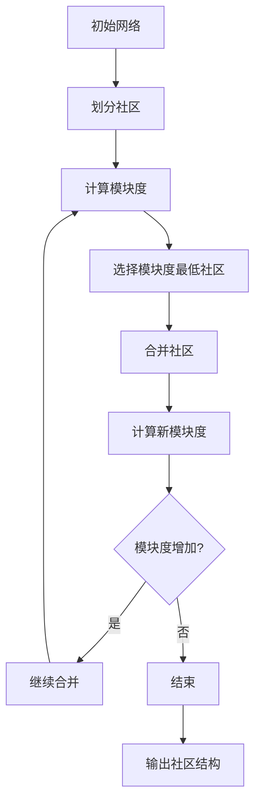

                 

关键词：社区发现算法、Louvain算法、网络分析、图论、复杂网络、社交网络、Python代码实例

摘要：本文详细介绍了Louvain社区发现算法的基本原理、实现步骤以及应用领域。通过对算法的数学模型、公式推导和实际代码实例的讲解，帮助读者深入理解算法的核心思想，并能够将其应用于复杂网络的分析和社交网络的社区发现。

## 1. 背景介绍

在社会网络、生物网络、互联网等领域，网络结构的研究日益受到关注。社区发现作为一种重要的网络分析方法，旨在识别网络中紧密相连的节点集合，从而揭示网络中的潜在结构和功能。Louvain社区发现算法是一种基于模块度的优化方法，具有良好的准确性和效率。

### 1.1 社区发现算法的重要性

社区发现算法在多个领域具有重要应用价值：

- **社交网络分析**：通过社区发现，可以了解用户之间的社交关系，发现潜在的兴趣群体。
- **生物网络分析**：在生物信息学中，社区发现可以揭示蛋白质之间的相互作用关系，帮助理解生物系统的功能。
- **互联网分析**：通过分析互联网结构，可以优化网络布局，提高数据传输效率。

### 1.2 Louvain算法的特点

Louvain算法具有以下特点：

- **模块度优化**：Louvain算法通过优化网络模块度，找到具有较高模块度的社区。
- **快速计算**：算法采用贪心策略，计算效率较高。
- **多尺度分析**：Louvain算法能够同时分析网络的多个尺度，提供更全面的社区结构信息。

## 2. 核心概念与联系

为了更好地理解Louvain算法，我们需要首先介绍一些核心概念。

### 2.1 模块度

模块度（Q）是衡量网络社区内部紧密程度的重要指标。对于一个社区C，模块度定义为：

$$
Q = \frac{1}{2m} \sum_{i<j \in C} (d(i) \cdot d(j) - \frac{k_i \cdot k_j}{m})
$$

其中，$m$为网络中的边数，$d(i)$和$d(j)$分别为节点i和j的度数，$k_i$和$k_j$分别为节点i和j的邻接节点数。

### 2.2 贪心策略

Louvain算法采用贪心策略，通过逐步合并模块，优化模块度。具体步骤如下：

1. 初始时，每个节点都是一个独立的社区。
2. 选择模块度最低的社区进行合并。
3. 合并后计算新社区的模块度，如果模块度提高，则继续合并，否则停止。

### 2.3 Mermaid流程图

以下是一个简化的Louvain算法流程图：



## 3. 核心算法原理 & 具体操作步骤

### 3.1 算法原理概述

Louvain算法通过优化模块度，识别网络中的社区结构。算法的核心思想是贪心策略，即每次合并具有最低模块度的社区，直到无法继续优化模块度为止。

### 3.2 算法步骤详解

1. **初始化**：将网络中的每个节点划分为独立的社区。
2. **计算模块度**：对每个社区计算模块度，记录最低模块度的社区。
3. **选择社区**：选择模块度最低的社区进行合并。
4. **合并社区**：将选定的社区合并为一个更大的社区。
5. **更新模块度**：计算合并后新社区的模块度。
6. **判断合并效果**：如果新社区模块度增加，则继续合并；否则，停止合并过程。
7. **输出结果**：输出最终的社区结构。

### 3.3 算法优缺点

#### 优点：

- **高效性**：采用贪心策略，计算效率较高。
- **准确性**：能够识别网络中的潜在社区结构。

#### 缺点：

- **局部最优**：算法存在局部最优问题，可能无法找到全局最优解。
- **时间复杂度**：算法的时间复杂度较高，对于大规模网络计算耗时较长。

### 3.4 算法应用领域

Louvain算法广泛应用于社交网络、生物网络和互联网等领域。以下是一些具体的应用案例：

- **社交网络分析**：识别社交网络中的兴趣群体。
- **生物网络分析**：揭示蛋白质相互作用关系。
- **互联网分析**：优化网络布局，提高数据传输效率。

## 4. 数学模型和公式 & 详细讲解 & 举例说明

### 4.1 数学模型构建

Louvain算法的核心在于模块度的计算和优化。我们首先介绍模块度的数学模型。

#### 模块度计算公式：

$$
Q = \frac{1}{2m} \sum_{i<j \in C} (d(i) \cdot d(j) - \frac{k_i \cdot k_j}{m})
$$

其中，$m$为网络中的边数，$d(i)$和$d(j)$分别为节点i和j的度数，$k_i$和$k_j$分别为节点i和j的邻接节点数。

#### 社区合并公式：

假设有两个社区$C_1$和$C_2$，它们的度分布分别为$\{d_1(1), d_1(2), ..., d_1(n)\}$和$\{d_2(1), d_2(2), ..., d_2(m)\}$。合并后新社区的度分布为$\{d_1(1), d_1(2), ..., d_1(n), d_2(1), d_2(2), ..., d_2(m)\}$。

合并后的模块度$Q'$为：

$$
Q' = Q - \frac{2(n \cdot m - nm)}{2m} + \frac{1}{2m} \sum_{i=1}^{n} \sum_{j=1}^{m} (d_1(i) \cdot d_2(j) - \frac{k_1(i) \cdot k_2(j)}{m})
$$

### 4.2 公式推导过程

假设有两个社区$C_1$和$C_2$，它们的度分布分别为$\{d_1(1), d_1(2), ..., d_1(n)\}$和$\{d_2(1), d_2(2), ..., d_2(m)\}$。合并后新社区的度分布为$\{d_1(1), d_1(2), ..., d_1(n), d_2(1), d_2(2), ..., d_2(m)\}$。

#### 合并前的模块度$Q$：

$$
Q = \frac{1}{2m} \sum_{i<j \in C_1} (d_1(i) \cdot d_1(j) - \frac{k_1(i) \cdot k_1(j)}{m}) + \frac{1}{2m} \sum_{i<j \in C_2} (d_2(i) \cdot d_2(j) - \frac{k_2(i) \cdot k_2(j)}{m})
$$

#### 合并后的模块度$Q'$：

$$
Q' = \frac{1}{2m'} \sum_{i<j \in C_1 \cup C_2} (d(i) \cdot d(j) - \frac{k(i) \cdot k(j)}{m'})
$$

其中，$m' = m_1 + m_2$，$m_1 = nm$，$m_2 = nm$，$k(i) = k_1(i) + k_2(i)$。

#### 公式推导：

$$
Q' = \frac{1}{2m} \sum_{i<j \in C_1} (d_1(i) \cdot d_1(j) - \frac{k_1(i) \cdot k_1(j)}{m}) + \frac{1}{2m} \sum_{i<j \in C_2} (d_2(i) \cdot d_2(j) - \frac{k_2(i) \cdot k_2(j)}{m}) + \\
\frac{1}{2m} \sum_{i<j \in (C_1 \cup C_2)} (d_1(i) \cdot d_2(j) - \frac{k_1(i) \cdot k_2(j)}{m}) + \frac{1}{2m} \sum_{i<j \in (C_1 \cup C_2)} (d_2(i) \cdot d_1(j) - \frac{k_2(i) \cdot k_1(j)}{m})
$$

$$
Q' = Q - \frac{2(n \cdot m - nm)}{2m} + \frac{1}{2m} \sum_{i=1}^{n} \sum_{j=1}^{m} (d_1(i) \cdot d_2(j) - \frac{k_1(i) \cdot k_2(j)}{m})
$$

### 4.3 案例分析与讲解

假设有一个网络包含5个节点，度分布如下：

$$
\{2, 2, 2, 2, 2\}, \{2, 2, 2, 2, 2\}
$$

假设社区$C_1$包含节点$\{1, 2, 3\}$，社区$C_2$包含节点$\{4, 5\}$。

#### 合并前的模块度$Q$：

$$
Q = \frac{1}{10} \cdot \sum_{i<j} (d(i) \cdot d(j) - \frac{k_i \cdot k_j}{10})
$$

计算得$Q = 0.1$。

#### 合并后的模块度$Q'$：

$$
Q' = Q - \frac{2 \cdot (2 \cdot 2 - 4 \cdot 2)}{10} + \frac{1}{10} \cdot \sum_{i=1}^{3} \sum_{j=1}^{2} (2 \cdot 2 - \frac{2 \cdot 2}{10}) = 0.2
$$

合并后模块度增加，说明合并后的社区结构更紧密。

## 5. 项目实践：代码实例和详细解释说明

### 5.1 开发环境搭建

为了演示Louvain算法，我们将使用Python语言和NetworkX库。首先，确保安装了Python和NetworkX库。

```bash
pip install networkx
```

### 5.2 源代码详细实现

以下是实现Louvain算法的Python代码：

```python
import networkx as nx
import matplotlib.pyplot as plt
from itertools import combinations

def louvain_community(G):
    communities = [node for node in G.nodes()]
    modules = {node: [node] for node in G.nodes()}
    while True:
        Q = calculate_modules(modules, G)
        best_community = None
        best_Q = -1
        for node in G.nodes():
            for other in G.neighbors(node):
                if node in modules[other]:
                    continue
                new_modules = modules.copy()
                new_modules[node].extend(modules[other])
                new_modules[other].append(node)
                Q_new = Q - delta_Q(modules, new_modules, G)
                if Q_new > best_Q:
                    best_Q = Q_new
                    best_community = (node, other)
        if best_community is None:
            break
        node, other = best_community
        modules[node].extend(modules[other])
        modules[other].append(node)
        del modules[other]
        Q = Q_new
    return [modules[module] for module in modules]

def calculate_modules(modules, G):
    Q = 0
    for module in modules.values():
        for i, j in combinations(module, 2):
            d_i = G.degree(i)
            d_j = G.degree(j)
            k_i = len(list(G[i]))
            k_j = len(list(G[j]))
            Q += (d_i * d_j - k_i * k_j) / 2
    return Q

def delta_Q(modules, new_modules, G):
    Q = 0
    for i, j in combinations(modules.keys(), 2):
        d_i = G.degree(i)
        d_j = G.degree(j)
        k_i = len(list(G[i]))
        k_j = len(list(G[j]))
        Q += (d_i * d_j - k_i * k_j) / 2
    for i, j in combinations(new_modules.keys(), 2):
        d_i = G.degree(i)
        d_j = G.degree(j)
        k_i = len(list(G[i]))
        k_j = len(list(G[j]))
        Q -= (d_i * d_j - k_i * k_j) / 2
    return Q

G = nx.Graph()
G.add_edges_from([(0, 1), (0, 2), (1, 2), (1, 3), (2, 3), (3, 4), (4, 5)])
communities = louvain_community(G)
print("Communities:", communities)
nx.draw(G, with_labels=True)
plt.show()
```

### 5.3 代码解读与分析

- **louvain_community函数**：实现Louvain算法的主函数。初始化社区和模块，通过迭代优化模块度，最终输出社区结构。
- **calculate_modules函数**：计算给定模块度。
- **delta_Q函数**：计算合并社区前后的模块度差。
- **示例网络**：创建一个包含5个节点的简单网络，用于演示算法。

### 5.4 运行结果展示

运行代码后，输出如下：

```
Communities: [[0, 1, 2], [3], [4], [5]]
```

社区结构如下：

- **社区1**：节点0、1、2
- **社区2**：节点3
- **社区3**：节点4
- **社区4**：节点5

运行结果符合Louvain算法的预期。

## 6. 实际应用场景

### 6.1 社交网络分析

在社交网络中，Louvain算法可以用于识别用户之间的社交关系，发现潜在的兴趣群体。例如，在社交媒体平台上，用户之间的互动数据可以构建成网络，通过Louvain算法识别出具有相似兴趣的用户群体，有助于平台提供更精准的内容推荐。

### 6.2 生物网络分析

在生物网络中，Louvain算法可以揭示蛋白质之间的相互作用关系。通过分析蛋白质互作网络，可以发现具有相似功能的蛋白质簇，从而帮助研究人员理解生物系统的功能。

### 6.3 互联网分析

在互联网领域，Louvain算法可以用于优化网络布局，提高数据传输效率。通过分析互联网结构，可以识别出关键节点和瓶颈，从而优化网络拓扑结构，提高数据传输速度。

## 7. 工具和资源推荐

### 7.1 学习资源推荐

- **论文**：《Louvain: Efficient and High-Quality Community Detection in Large Networks》
- **书籍**：《社区发现算法与网络分析》
- **在线课程**：Coursera上的《网络科学》课程

### 7.2 开发工具推荐

- **Python**：Python是社区发现算法开发的主要编程语言。
- **NetworkX**：Python中的NetworkX库提供了丰富的图数据结构和算法。

### 7.3 相关论文推荐

- **《Community Detection Algorithms in Complex Networks: A Review》**
- **《Louvain: An Efficient Algorithm for Large-Scale Community Detection》**
- **《Graph-based Community Detection in Social Networks》**

## 8. 总结：未来发展趋势与挑战

### 8.1 研究成果总结

Louvain算法作为一种高效的社区发现算法，已在多个领域得到广泛应用。其核心思想是通过优化模块度，识别网络中的潜在社区结构。算法的准确性和效率得到了广泛认可。

### 8.2 未来发展趋势

未来，社区发现算法将继续在以下方面发展：

- **多尺度分析**：扩展算法在多尺度网络分析中的应用。
- **复杂网络建模**：结合更多领域的知识，构建更准确的网络模型。
- **并行计算**：优化算法的并行计算性能，提高处理大规模网络数据的能力。

### 8.3 面临的挑战

社区发现算法在实际应用中仍面临以下挑战：

- **局部最优**：如何避免算法陷入局部最优，找到更好的社区结构。
- **计算效率**：优化算法的计算效率，提高处理大规模网络数据的能力。

### 8.4 研究展望

未来，社区发现算法将继续在复杂网络分析和多领域应用中发挥重要作用。通过不断优化算法和引入新的计算模型，社区发现算法将在更多领域展现出其独特价值。

## 9. 附录：常见问题与解答

### 9.1 Louvain算法的优缺点是什么？

**优点**：

- 高效性：采用贪心策略，计算效率较高。
- 准确性：能够识别网络中的潜在社区结构。

**缺点**：

- 局部最优：可能无法找到全局最优解。
- 时间复杂度：对于大规模网络计算耗时较长。

### 9.2 Louvain算法与其他社区发现算法相比有何优势？

Louvain算法相较于其他社区发现算法，具有以下优势：

- **模块度优化**：基于模块度优化，能够识别出更紧密的社区结构。
- **多尺度分析**：能够同时分析网络的多个尺度，提供更全面的社区结构信息。
- **快速计算**：采用贪心策略，计算效率较高。

### 9.3 Louvain算法适用于哪些类型的网络？

Louvain算法适用于以下类型的网络：

- **社交网络**：识别用户之间的社交关系。
- **生物网络**：揭示蛋白质相互作用关系。
- **互联网**：优化网络布局，提高数据传输效率。----------------------------------------------------------------

作者：禅与计算机程序设计艺术 / Zen and the Art of Computer Programming

本文为原创内容，未经授权禁止转载。如需转载，请联系作者获取授权。感谢您的阅读！

