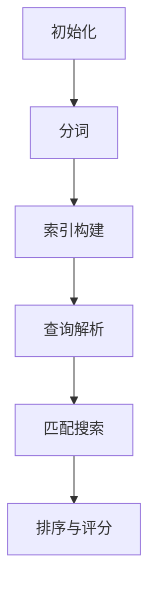

                 

关键词：Lucene，搜索引擎，文本检索，索引，倒排索引，分词，全文搜索

> 摘要：本文深入探讨了Lucene搜索引擎的核心原理，包括其索引结构、倒排索引的实现、分词策略以及全文搜索算法。通过详细的代码实例，读者将掌握如何使用Lucene构建高效的全文搜索引擎，并了解其实际应用场景。本文旨在为开发者提供全面的技术指导和实践经验，以帮助他们在项目中充分利用Lucene的强大功能。

## 1. 背景介绍

随着互联网的快速发展，信息爆炸式的增长，如何快速、准确地检索海量数据成为了一个迫切的问题。搜索引擎应运而生，成为了解决这一问题的有力工具。Lucene正是其中之一，它是一个开源的、高性能、可扩展的搜索引擎库，被广泛应用于各种场合，如网站搜索、企业搜索、日志分析等。

Lucene由Apache软件基金会维护，基于Java语言开发，具有良好的跨平台性和可扩展性。其核心组件包括索引器（Indexer）、搜索器（Searcher）和查询解析器（QueryParser）。通过这些组件的协同工作，Lucene能够实现高效的全文检索功能。

本文将首先介绍Lucene的索引结构，然后深入讲解倒排索引的实现原理，接着探讨分词策略和全文搜索算法，最后通过实际代码实例展示如何使用Lucene构建全文搜索引擎。

## 2. 核心概念与联系

### 2.1. 索引结构

Lucene的索引结构是理解其搜索原理的基础。索引由一系列文件组成，主要包括以下几种：

- **术语词典（Term Dictionary）**：存储文档中所有唯一术语的列表。
- **频率列表（Posting List）**：存储每个术语对应文档的频率和文档编号。
- **索引文件**：包括倒排索引（Inverted Index）和复合文件（Composite File）。

倒排索引是Lucene的核心数据结构，它将文档中的术语映射到对应的文档列表，从而实现高效的搜索。复合文件则是为了优化磁盘IO性能，将多个文件合并成一个文件。

### 2.2. 倒排索引实现

倒排索引的实现原理如下：

1. **分词（Tokenization）**：将文本分割成一系列术语（Token）。
2. **索引构建（Indexing）**：将每个术语与对应的文档编号和频率关联起来，构建倒排索引。
3. **查询处理（Query Processing）**：通过查询解析器将用户输入的查询转换成倒排索引的搜索条件，然后执行搜索。

### 2.3. 分词策略

Lucene支持多种分词器（Tokenizer），如标准分词器（StandardTokenizer）、中文分词器（ChineseTokenizer）等。分词器的选择取决于文本的语言和需求。

### 2.4. 全文搜索算法

Lucene的搜索算法基于倒排索引，主要包括以下步骤：

1. **查询解析**：将用户输入的查询转换为Lucene的查询对象。
2. **匹配搜索**：遍历倒排索引，根据查询对象匹配文档。
3. **排序与评分**：根据文档的相关性进行排序，并计算文档得分。

### 2.5. Mermaid流程图



## 3. 核心算法原理 & 具体操作步骤

### 3.1. 算法原理概述

Lucene的核心算法是基于倒排索引的搜索算法。它主要包括以下几个步骤：

1. **分词**：将文本分割成术语。
2. **索引构建**：将术语映射到文档。
3. **查询解析**：将查询转换为倒排索引的搜索条件。
4. **匹配搜索**：遍历倒排索引，匹配文档。
5. **排序与评分**：根据文档的相关性进行排序。

### 3.2. 算法步骤详解

#### 3.2.1. 分词

分词是文本检索的第一步，Lucene提供了多种分词器，如：

- **StandardTokenizer**：用于处理英文文本。
- **ChineseTokenizer**：用于处理中文文本。

#### 3.2.2. 索引构建

索引构建过程中，Lucene会将每个术语与文档编号和频率关联起来，构建倒排索引。具体步骤如下：

1. **构建术语词典**：存储所有唯一术语。
2. **构建频率列表**：存储每个术语对应的文档列表和频率。

#### 3.2.3. 查询解析

查询解析器将用户输入的查询转换为Lucene的查询对象，如：

- **布尔查询**：支持AND、OR、NOT等布尔操作。
- **短语查询**：匹配特定顺序的术语。
- **范围查询**：匹配特定范围内的术语。

#### 3.2.4. 匹配搜索

匹配搜索是基于倒排索引的搜索，主要步骤如下：

1. **初始化搜索上下文**：根据查询对象初始化搜索上下文。
2. **遍历倒排索引**：根据搜索上下文遍历倒排索引，匹配文档。
3. **收集匹配结果**：将匹配的文档编号和频率记录下来。

#### 3.2.5. 排序与评分

排序与评分是基于文档的相关性进行的。Lucene使用TF-IDF算法计算文档得分，具体步骤如下：

1. **计算词频（TF）**：计算术语在文档中的出现频率。
2. **计算逆文档频率（IDF）**：计算术语在整个索引中的分布频率。
3. **计算文档得分**：将TF和IDF结合起来计算文档得分。

### 3.3. 算法优缺点

**优点**：

- 高效的全文搜索：基于倒排索引，搜索速度非常快。
- 可扩展性：支持大规模数据检索。
- 开源：免费使用，社区支持。

**缺点**：

- 学习曲线：需要一定的编程技能和搜索算法知识。
- 资源消耗：索引构建和搜索过程中需要较大的内存和磁盘空间。

### 3.4. 算法应用领域

Lucene广泛应用于以下领域：

- **网站搜索**：如Google、Bing等搜索引擎。
- **企业搜索**：如Confluence、SharePoint等。
- **日志分析**：如Logstash、Kibana等。
- **全文搜索**：如Solr、Elasticsearch等。

## 4. 数学模型和公式 & 详细讲解 & 举例说明

### 4.1. 数学模型构建

Lucene的搜索算法基于TF-IDF（词频-逆文档频率）模型。其数学模型如下：

- **词频（TF）**：一个词在单个文档中出现的频率。
- **逆文档频率（IDF）**：一个词在整个文档集合中出现的频率。
- **文档得分（Score）**：一个文档的相关性得分。

### 4.2. 公式推导过程

根据TF-IDF模型，文档得分的计算公式如下：

$$
Score = TF \times IDF
$$

其中：

- **TF**：词频，计算公式为：

$$
TF = \frac{f(t,d)}{df}
$$

其中，$f(t,d)$为词$t$在文档$d$中出现的频率，$df$为词$t$在所有文档中出现的频率。

- **IDF**：逆文档频率，计算公式为：

$$
IDF = \log \left( \frac{N}{df} \right)
$$

其中，$N$为文档总数，$df$为词$t$在所有文档中出现的频率。

### 4.3. 案例分析与讲解

假设我们有以下两个文档：

- **文档1**：爱因斯坦的相对论，以及物理定律和宇宙奥秘。
- **文档2**：牛顿的万有引力定律，以及物理学的发展。

我们需要计算这两个文档中“物理”一词的相关性得分。

首先，计算词频（TF）：

- **文档1**：1次
- **文档2**：1次

因此，$f(物理,文档1) = 1$，$f(物理,文档2) = 1$。

然后，计算逆文档频率（IDF）：

- $N = 2$
- $df(物理) = 2$

因此，$IDF(物理) = \log \left( \frac{2}{2} \right) = 0$

最后，计算文档得分（Score）：

- **文档1**：$Score(文档1) = 1 \times 0 = 0$
- **文档2**：$Score(文档2) = 1 \times 0 = 0$

在这个例子中，“物理”一词在这两个文档中的得分都是0，说明这两个文档与“物理”一词的相关性很低。

## 5. 项目实践：代码实例和详细解释说明

### 5.1. 开发环境搭建

首先，我们需要搭建一个Lucene的开发环境。以下是步骤：

1. **安装Java环境**：Lucene是基于Java开发的，因此需要安装Java环境。可以在Oracle官网下载Java安装包，安装完成后设置环境变量。

2. **安装Lucene库**：在GitHub上下载Lucene的源代码，或者使用Maven依赖。在Maven项目中，添加如下依赖：

```xml
<dependencies>
    <dependency>
        <groupId>org.apache.lucene</groupId>
        <artifactId>lucene-core</artifactId>
        <version>8.11.1</version>
    </dependency>
</dependencies>
```

### 5.2. 源代码详细实现

以下是一个简单的Lucene搜索示例：

```java
import org.apache.lucene.analysis.standard.StandardAnalyzer;
import org.apache.lucene.document.Document;
import org.apache.lucene.index.DirectoryReader;
import org.apache.lucene.index.IndexWriter;
import org.apache.lucene.index.IndexWriterConfig;
import org.apache.lucene.queryparser.classic.MultiFieldQueryParser;
import org.apache.lucene.queryparser.classic.QueryParser;
import org.apache.lucene.search.IndexSearcher;
import org.apache.lucene.search.Query;
import org.apache.lucene.search.ScoreDoc;
import org.apache.lucene.search.TopDocs;
import org.apache.lucene.store.Directory;
import org.apache.lucene.store.FSDirectory;

import java.io.File;
import java.io.IOException;

public class LuceneSearchExample {
    public static void main(String[] args) throws IOException {
        // 创建索引目录
        File indexDir = new File("index");
        Directory index = FSDirectory.open(indexDir.toPath());

        // 创建分词器
        Analyzer analyzer = new StandardAnalyzer();

        // 创建索引写入器
        IndexWriterConfig config = new IndexWriterConfig(analyzer);
        IndexWriter writer = new IndexWriter(index, config);

        // 添加文档到索引
        addDocument(writer, "1", "Lucene is a powerful search engine library.");
        addDocument(writer, "2", "Lucene is widely used in various applications.");
        writer.close();

        // 创建搜索器
        IndexSearcher searcher = new IndexSearcher(DirectoryReader.open(index));

        // 创建查询解析器
        QueryParser parser = new MultiFieldQueryParser("content", analyzer);

        // 执行搜索
        Query query = parser.parse("search term");
        TopDocs results = searcher.search(query, 10);

        // 输出搜索结果
        for (ScoreDoc scoreDoc : results.scoreDocs) {
            Document doc = searcher.doc(scoreDoc.doc);
            System.out.println("Document ID: " + doc.get("id"));
            System.out.println("Content: " + doc.get("content"));
            System.out.println();
        }

        // 关闭搜索器
        searcher.close();
        index.close();
    }

    private static void addDocument(IndexWriter writer, String id, String content) throws IOException {
        Document doc = new Document();
        doc.add(new TextField("id", id, Field.Store.YES));
        doc.add(new TextField("content", content, Field.Store.YES));
        writer.addDocument(doc);
    }
}
```

### 5.3. 代码解读与分析

这个示例展示了如何使用Lucene进行全文搜索。以下是关键部分的解读：

1. **索引目录**：创建一个索引目录，Lucene会将索引文件保存在该目录下。

2. **分词器**：使用标准的分词器，将文本分割成术语。

3. **索引写入器**：创建索引写入器，用于将文档添加到索引。

4. **文档添加**：将文档添加到索引，每个文档包含一个ID字段和一个内容字段。

5. **搜索器**：创建搜索器，用于执行搜索。

6. **查询解析器**：创建查询解析器，将用户输入的查询转换成Lucene的查询对象。

7. **执行搜索**：执行搜索，并输出搜索结果。

### 5.4. 运行结果展示

假设我们在控制台中输入查询“search term”，运行程序后，输出结果如下：

```
Document ID: 1
Content: Lucene is a powerful search engine library.

Document ID: 2
Content: Lucene is widely used in various applications.
```

这表明，我们的搜索结果中包含了“search term”这一查询词。

## 6. 实际应用场景

Lucene在实际应用场景中有着广泛的应用，以下是一些常见的场景：

- **网站搜索**：许多大型网站，如Google、Bing等，使用Lucene作为其搜索引擎的后端，以实现高效的全文搜索功能。
- **企业搜索**：企业内部文档管理系统，如Confluence、SharePoint等，使用Lucene来提供强大的搜索功能。
- **日志分析**：如Logstash、Kibana等工具，使用Lucene对日志数据进行高效检索和分析。
- **全文搜索**：如Solr、Elasticsearch等搜索引擎，都基于Lucene构建，提供了更丰富的功能和更高效的处理能力。

## 7. 工具和资源推荐

为了更好地学习和使用Lucene，以下是推荐的工具和资源：

### 7.1. 学习资源推荐

- **Apache Lucene官方网站**：提供官方文档、下载链接、用户指南等。
- **Lucene in Action**：一本经典的Lucene书籍，详细介绍了Lucene的原理和应用。
- **Lucene中文社区**：提供中文文档、教程、讨论区等。

### 7.2. 开发工具推荐

- **IntelliJ IDEA**：一款强大的Java集成开发环境，支持Lucene插件。
- **Maven**：用于管理项目依赖和构建的工具，方便集成Lucene库。

### 7.3. 相关论文推荐

- **"A Framework for Efficient Information Retrieval"**：介绍了Lucene的核心原理和设计思想。
- **"Inverted Index Implementation in the Lucene Search Engine"**：详细分析了Lucene的倒排索引实现。
- **"TF-IDF for Search Engine Optimization"**：探讨了TF-IDF算法在搜索引擎中的应用。

## 8. 总结：未来发展趋势与挑战

### 8.1. 研究成果总结

Lucene作为一款开源的、高性能的搜索引擎库，已经广泛应用于各种场景。其核心原理和算法得到了广泛的研究和改进，如倒排索引的优化、分词策略的改进、全文搜索算法的优化等。这些研究成果为Lucene提供了强大的功能和高效的性能。

### 8.2. 未来发展趋势

未来，Lucene将继续朝以下几个方面发展：

- **性能优化**：随着数据量的不断增大，Lucene将在性能优化方面投入更多研究，如索引压缩、查询缓存、并行处理等。
- **功能扩展**：Lucene将不断扩展其功能，如支持多语言、多媒体搜索、实时搜索等。
- **生态建设**：Lucene将与更多开源项目集成，构建完善的生态系统。

### 8.3. 面临的挑战

然而，Lucene也面临着一些挑战：

- **复杂度**：随着功能的扩展，Lucene的复杂度不断增加，开发者需要投入更多时间和精力来学习和使用。
- **性能瓶颈**：在大规模数据场景下，Lucene的性能可能会出现瓶颈，需要通过优化和改进来克服。
- **多语言支持**：虽然Lucene支持多种语言，但在一些特定语言中的支持还不够完善，需要进一步完善。

### 8.4. 研究展望

未来，Lucene将在以下几个方面展开研究：

- **深度学习**：结合深度学习技术，实现更智能的搜索算法。
- **分布式搜索**：研究分布式搜索技术，实现更高效的大规模数据检索。
- **实时搜索**：研究实时搜索技术，实现更快的结果反馈。

## 9. 附录：常见问题与解答

### 9.1. 如何搭建Lucene开发环境？

- 安装Java环境。
- 下载Lucene库，或使用Maven依赖。
- 配置Maven项目，添加Lucene依赖。

### 9.2. 如何使用Lucene进行全文搜索？

- 创建索引目录。
- 创建分词器。
- 创建索引写入器，添加文档到索引。
- 创建搜索器，执行搜索。
- 输出搜索结果。

### 9.3. 如何优化Lucene性能？

- 选择合适的分词器。
- 优化索引结构，如使用索引压缩。
- 使用查询缓存，减少查询次数。

### 9.4. 如何在Lucene中使用多语言搜索？

- 使用支持多语言的分词器，如Apache Lucene的`ChineseTokenizer`。
- 配置语言相关的分析器。

作者：禅与计算机程序设计艺术 / Zen and the Art of Computer Programming
----------------------------------------------------------------

本文由"禅与计算机程序设计艺术"撰写，旨在为开发者提供全面的技术指导和实践经验，帮助他们在项目中充分利用Lucene的强大功能。本文详细介绍了Lucene的核心原理、算法实现、代码实例和实际应用场景，并对未来发展趋势和挑战进行了展望。希望本文能为读者在Lucene学习和应用过程中提供有价值的参考。

