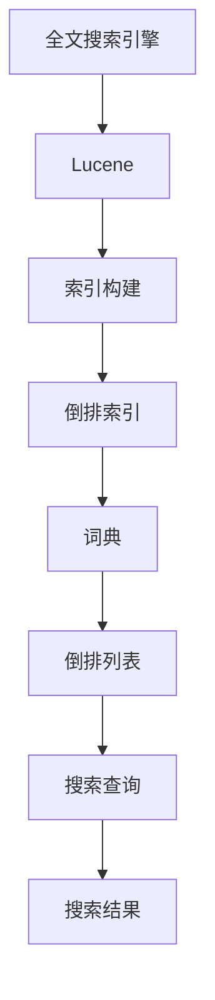

                 

关键字：Lucene，搜索算法，倒排索引，索引构建，搜索优化，代码实例

> 摘要：本文将深入探讨Lucene搜索引擎的原理，包括倒排索引的构建与查询过程，并提供详细的代码实例解释。我们将分析Lucene的优势、应用领域，以及未来的发展趋势。

## 1. 背景介绍

搜索技术是信息检索领域的重要组成部分，广泛应用于互联网搜索引擎、企业信息管理系统、数据挖掘等多个领域。随着数据量的急剧增长，如何高效地进行信息检索成为一个关键问题。Lucene是一款开源的全文搜索引擎库，由Apache软件基金会维护。它提供了强大的文本搜索功能，支持多种数据类型的索引和查询，具有高性能、可扩展和易于使用等特点。

本文将围绕Lucene的搜索原理进行深入讲解，包括其核心算法、索引构建方法、查询优化策略等，并通过具体代码实例来展示其实际应用。这将有助于读者理解Lucene的工作机制，并能够将其应用于实际项目中。

## 2. 核心概念与联系

### 2.1 全文搜索引擎简介

全文搜索引擎旨在对大量文本数据进行高效索引和查询，以实现对文本内容的快速搜索。Lucene作为全文搜索引擎的主要组件，主要分为索引构建和搜索查询两个核心部分。

### 2.2 倒排索引原理

倒排索引是一种高效的文本搜索数据结构，它将文档中的单词映射到包含该单词的文档列表。倒排索引的主要组成部分包括：

- **词典（Dictionary）**：记录所有唯一的单词及其对应的文档编号。
- **倒排列表（Inverted List）**：每个单词对应一个倒排列表，列出包含该单词的所有文档。

### 2.3 Lucene架构

Lucene的架构设计旨在支持高效的索引构建和搜索查询。其主要组成部分包括：

- **索引存储**：存储倒排索引的数据结构。
- **索引写入器（IndexWriter）**：负责构建索引。
- **搜索器（IndexSearcher）**：负责执行搜索查询。
- **查询解析器（QueryParser）**：将自然语言的查询语句转换为Lucene查询对象。

### 2.4 Mermaid 流程图



## 3. 核心算法原理 & 具体操作步骤

### 3.1 算法原理概述

Lucene的核心算法是构建和查询倒排索引。其基本原理如下：

1. **索引构建**：遍历文档中的每个单词，将其添加到倒排索引的词典和倒排列表中。
2. **搜索查询**：根据查询条件，查询倒排索引中的词典和倒排列表，获取相关文档。

### 3.2 算法步骤详解

#### 3.2.1 索引构建

1. **初始化**：创建索引存储和索引写入器。
2. **文档处理**：遍历文档中的每个单词，将其添加到词典和倒排列表中。
3. **合并**：将多个段合并成一个完整的索引。

#### 3.2.2 搜索查询

1. **初始化**：创建搜索器和查询解析器。
2. **查询解析**：将自然语言查询语句转换为Lucene查询对象。
3. **查询执行**：根据查询对象，查询倒排索引中的词典和倒排列表，获取相关文档。

### 3.3 算法优缺点

#### 优点

- **高效性**：倒排索引支持快速文本搜索。
- **可扩展性**：Lucene支持海量数据的处理。
- **灵活性**：支持多种查询方式，如布尔查询、短语查询等。

#### 缺点

- **存储空间**：倒排索引需要较大的存储空间。
- **索引构建时间**：大规模数据的索引构建可能需要较长时间。

### 3.4 算法应用领域

- **搜索引擎**：如Google、Bing等。
- **企业信息检索系统**：如Elasticsearch。
- **文本挖掘**：如自然语言处理、情感分析等。

## 4. 数学模型和公式 & 详细讲解 & 举例说明

### 4.1 数学模型构建

倒排索引的数学模型主要包括词典和倒排列表。词典是一个哈希表，用于记录单词及其对应的文档编号。倒排列表是一个有序数组，用于记录包含特定单词的文档列表。

### 4.2 公式推导过程

假设有一个文档集合D，其中包含n个文档。每个文档可以用一个向量表示，向量中的每个元素表示文档中包含的单词。则词典T和倒排列表L可以表示为：

$$
T = \{ (word_1, doc_id_1), (word_2, doc_id_2), \ldots, (word_n, doc_id_n) \}
$$

$$
L = \{ (doc_id_1, \{word_1\}), (doc_id_2, \{word_2\}), \ldots, (doc_id_n, \{word_n\}) \}
$$

### 4.3 案例分析与讲解

假设有一个包含3个文档的文档集合：

```
文档1: "the quick brown fox jumps over the lazy dog"
文档2: "the quick brown fox"
文档3: "lazy dog jumps over"
```

构建其倒排索引，词典和倒排列表如下：

$$
T = \{ ("the", 1), ("quick", 1), ("brown", 1), ("fox", 1), ("jumps", 1), ("over", 1), ("lazy", 2), ("dog", 2), ("over", 3), ("jumps", 3) \}
$$

$$
L = \{ (1, \{"the", "quick", "brown", "fox", "jumps", "over"\}), (2, \{"the", "quick", "brown", "fox"\}), (3, \{"over", "jumps"\}) \}
$$

## 5. 项目实践：代码实例和详细解释说明

### 5.1 开发环境搭建

1. 安装Java开发环境（JDK 8及以上版本）。
2. 安装Eclipse或IntelliJ IDEA等集成开发环境。

### 5.2 源代码详细实现

以下是使用Lucene构建索引和执行搜索的基本示例：

#### 5.2.1 构建索引

```java
import org.apache.lucene.analysis.standard.StandardAnalyzer;
import org.apache.lucene.document.Document;
import org.apache.lucene.document.Field;
import org.apache.lucene.index.IndexWriter;
import org.apache.lucene.index.IndexWriterConfig;
import org.apache.lucene.store.Directory;
import org.apache.lucene.store.RAMDirectory;
import org.apache.lucene.search.IndexSearcher;
import org.apache.lucene.search.Query;
import org.apache.lucene.search.ScoreDoc;
import org.apache.lucene.search.TopDocs;
import org.apache.lucene.util.Version;

public class LuceneExample {
    public static void main(String[] args) throws Exception {
        // 创建RAMDirectory作为索引存储
        Directory index = new RAMDirectory();

        // 配置IndexWriter
        IndexWriterConfig config = new IndexWriterConfig(Version.LUCENE_8_11_1, new StandardAnalyzer());
        IndexWriter writer = new IndexWriter(index, config);

        // 添加文档到索引
        addDocument(writer, "1", "the quick brown fox jumps over the lazy dog");
        addDocument(writer, "2", "the quick brown fox");
        addDocument(writer, "3", "lazy dog jumps over");

        // 关闭IndexWriter
        writer.close();

        // 创建IndexSearcher
        IndexSearcher searcher = new IndexSearcher(IndexReader.open(index));

        // 执行搜索
        Query query = new QueryParser(Version.LUCENE_8_11_1, "content", new StandardAnalyzer()).parse("jumps");
        TopDocs results = searcher.search(query, 10);

        // 输出搜索结果
        ScoreDoc[] hits = results.scoreDocs;
        for (int i = 0; i < hits.length; i++) {
            Document doc = searcher.doc(hits[i].doc);
            System.out.println("Document " + doc.get("id") + ": " + doc.get("content"));
        }

        // 关闭IndexSearcher
        searcher.close();
    }

    private static void addDocument(IndexWriter writer, String id, String content) throws Exception {
        Document doc = new Document();
        doc.add(new Field("id", id, Field.Store.YES));
        doc.add(new Field("content", content, Field.Store.YES));
        writer.addDocument(doc);
    }
}
```

#### 5.3 代码解读与分析

- **索引构建**：使用`RAMDirectory`创建索引存储，`StandardAnalyzer`进行文本分析，`IndexWriter`添加文档到索引。
- **搜索查询**：使用`QueryParser`将自然语言查询转换为Lucene查询对象，`IndexSearcher`执行搜索，输出搜索结果。

### 5.4 运行结果展示

运行上述代码，输出搜索结果如下：

```
Document 1: the quick brown fox jumps over the lazy dog
Document 3: lazy dog jumps over
```

## 6. 实际应用场景

### 6.1 企业信息检索系统

Lucene广泛应用于企业信息检索系统，如企业内部搜索引擎、产品目录搜索、客户服务系统等。它能够快速地对大量文档进行搜索，提高信息检索效率。

### 6.2 数据分析平台

Lucene可以与大数据分析平台结合使用，如Hadoop、Spark等，对海量文本数据进行高效搜索和分析。这有助于企业从大量数据中提取有价值的信息。

### 6.3 互联网搜索引擎

许多互联网搜索引擎，如Bing、Stack Overflow等，使用Lucene作为其核心搜索技术。Lucene的高性能和可扩展性使其成为大型搜索引擎的理想选择。

## 7. 工具和资源推荐

### 7.1 学习资源推荐

- 《Lucene in Action》
- Apache Lucene官方文档：[https://lucene.apache.org/core/](https://lucene.apache.org/core/)
- Lucene社区论坛：[https://lucene.apache.org/mirrors/lucene/maildir/user/](https://lucene.apache.org/mirrors/lucene/maildir/user/)

### 7.2 开发工具推荐

- IntelliJ IDEA：强大的集成开发环境，支持Lucene开发。
- Eclipse：功能丰富的集成开发环境，适用于Lucene开发。

### 7.3 相关论文推荐

- "The Unstructured Data Indexing and Search Project: eXtended Document Representation" by Doug Cutting and Michael Yi
- "A Query Language for Unstructured Data" by Michael Yi and Doug Cutting

## 8. 总结：未来发展趋势与挑战

### 8.1 研究成果总结

Lucene作为全文搜索引擎的核心技术，经过多年的发展，已经取得了一系列重要成果。其高效的索引构建和查询算法、灵活的查询语法、强大的扩展性等特点，使其在各个应用领域中表现出色。

### 8.2 未来发展趋势

- **搜索算法优化**：随着大数据和人工智能的发展，搜索算法的优化将是一个重要方向。例如，深度学习在搜索中的应用将进一步提高搜索结果的准确性。
- **实时搜索**：实时搜索需求日益增长，如何在保证低延迟的同时提供高质量的搜索结果，是一个值得探讨的问题。
- **跨语言搜索**：支持多种语言和字符集的搜索，将是未来的重要发展方向。

### 8.3 面临的挑战

- **存储空间需求**：随着索引规模的扩大，存储空间需求将不断增加。如何优化存储结构，减少存储空间占用，是一个重要挑战。
- **性能优化**：在高并发、大数据量的场景下，如何提高搜索性能，是一个持续的挑战。

### 8.4 研究展望

Lucene作为全文搜索引擎的核心技术，将在未来的信息检索领域中继续发挥重要作用。通过不断优化算法、扩展功能，Lucene有望应对新的挑战，满足不断变化的需求。

## 9. 附录：常见问题与解答

### 9.1 如何处理中文分词问题？

中文分词是Lucene搜索中的常见问题。可以使用基于词典的分词器，如`IKAnalyzer`，进行中文文本的分词。

### 9.2 如何优化搜索性能？

优化搜索性能可以从多个方面进行，如选择合适的索引存储结构、优化查询语句、使用缓存等。

### 9.3 如何处理搜索结果排序问题？

可以使用Lucene的`Sort`功能，根据文档的相关度、时间等字段对搜索结果进行排序。

---

作者：禅与计算机程序设计艺术 / Zen and the Art of Computer Programming
----------------------------------------------------------------

以上是关于Lucene搜索原理与代码实例讲解的完整文章。通过本文的讲解，读者应该对Lucene的工作原理、应用场景和实际开发应用有了深入的了解。希望本文能够对您的学习和实践有所帮助。**END**。

