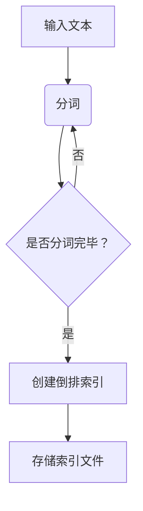

                 

搜索引擎作为互联网时代最重要的信息检索工具，极大地改变了人们获取信息的方式。Lucene是一款开源全文搜索引擎，因其高效、可扩展和灵活的特性而广受开发者喜爱。本文将深入探讨Lucene的原理，并通过代码实例，展示其核心功能和用法。

## 关键词

- Lucene
- 搜索引擎
- 全文检索
- 文本索引
- 高性能

## 摘要

本文将详细介绍Lucene搜索引擎的核心原理，包括其架构设计、核心算法和数学模型。通过具体代码实例，我们将深入理解Lucene的实现细节，掌握其应用技巧。最后，本文还将探讨Lucene在实际应用场景中的表现及其未来发展趋势。

## 1. 背景介绍

随着互联网的快速发展，信息的爆炸式增长带来了信息检索的巨大需求。全文搜索引擎作为一种高效的信息检索工具，能够从海量数据中快速准确地找到用户需要的信息。Lucene作为Apache软件基金会的一个开源项目，自1999年成立以来，一直受到开发者和企业的广泛认可和贡献。

### Lucene的发展历程

Lucene最初由Apache Lucene项目开发，并于2004年成为Apache软件基金会的一个顶级项目。Lucene的初衷是为开发者提供一套高效、灵活且易于扩展的全文搜索引擎框架。随着时间的推移，Lucene逐渐成为了开源全文搜索引擎的典范，被广泛应用于各种场景，如搜索引擎、企业应用、大数据处理等。

### Lucene的优势

- **高效性**：Lucene采用了倒排索引技术，能够实现快速的全文检索。
- **可扩展性**：Lucene提供了丰富的API，支持自定义词典、分词器、过滤器等，便于开发者根据需求进行扩展。
- **灵活性**：Lucene支持多种查询语言，如布尔查询、范围查询等，满足复杂查询需求。
- **开源免费**：Lucene是免费开源软件，社区活跃，有丰富的文档和教程资源。

## 2. 核心概念与联系

为了更好地理解Lucene的工作原理，我们需要掌握几个核心概念，包括文本索引、倒排索引、分词器等。

### 2.1 文本索引

文本索引是全文搜索引擎的基础，它将文档中的文字内容转换成一种可以快速检索的格式。在Lucene中，文本索引分为两个阶段：分词和索引。

- **分词**：将文本分割成一个个的词（Token），这一过程由分词器（Tokenizer）完成。分词器可以是简单的分词规则，也可以是复杂的大规模自然语言处理系统。
- **索引**：将分词后的词存储在索引文件中，以便快速检索。索引文件采用一种特殊的格式，称为倒排索引。

### 2.2 倒排索引

倒排索引是一种用于全文检索的数据结构，它将文档中的词作为键，文档集合作为值存储。简单来说，倒排索引就是将文档内容反向索引，使得在查询时可以直接找到包含指定词的文档。

- **正向索引**：以文档为单位，记录每个文档中包含的所有词。
- **倒排索引**：以词为单位，记录每个词出现在哪些文档中。

### 2.3 分词器

分词器（Tokenizer）是将文本分割成词的组件。不同的语言和文本内容可能需要不同的分词策略。Lucene提供了多种内置分词器，如标准分词器、中文分词器等。开发者也可以根据需求自定义分词器。

### 2.4 Mermaid 流程图

下面是一个Mermaid流程图，展示了文本索引的过程：



## 3. 核心算法原理 & 具体操作步骤

### 3.1 算法原理概述

Lucene的核心算法主要包括文本索引、倒排索引构建和查询处理。

- **文本索引**：文本索引是将原始文本转换为索引数据的过程。这涉及到分词、词频统计和倒排索引构建等步骤。
- **倒排索引构建**：倒排索引是全文检索的核心，它通过将词映射到文档集合，实现了快速的文本检索。
- **查询处理**：查询处理是指根据用户输入的查询词，在倒排索引中查找相关的文档。这包括查询词的分词、匹配和排序等步骤。

### 3.2 算法步骤详解

#### 3.2.1 文本索引步骤

1. **分词**：使用分词器将文本分割成一个个的词。
2. **词频统计**：统计每个词在文档中出现的次数。
3. **构建倒排索引**：将词作为键，文档集合作为值，构建倒排索引。

#### 3.2.2 倒排索引构建步骤

1. **初始化**：初始化倒排索引的数据结构。
2. **词存储**：将词存储在倒排索引中。
3. **文档存储**：将文档的ID存储在倒排索引中。

#### 3.2.3 查询处理步骤

1. **分词**：将查询词分词。
2. **匹配**：在倒排索引中查找包含查询词的文档。
3. **排序**：根据匹配结果对文档进行排序。

### 3.3 算法优缺点

#### 3.3.1 优点

- **高效性**：倒排索引实现了快速的文本检索，尤其是大规模数据集。
- **可扩展性**：Lucene提供了丰富的API，支持自定义词典、分词器、过滤器等，方便开发者进行扩展。
- **灵活性**：支持多种查询语言，如布尔查询、范围查询等。

#### 3.3.2 缺点

- **存储空间**：倒排索引需要较大的存储空间，尤其是大规模数据集。
- **复杂性**：构建和维护倒排索引需要一定的技术门槛。

### 3.4 算法应用领域

Lucene广泛应用于各种场景，包括但不限于：

- **搜索引擎**：如百度、谷歌等搜索引擎的核心技术之一。
- **企业应用**：如电商平台的商品搜索、用户行为分析等。
- **大数据处理**：如数据挖掘、文本分析等。

## 4. 数学模型和公式 & 详细讲解 & 举例说明

### 4.1 数学模型构建

在Lucene中，数学模型主要用于文本索引和查询处理。以下是一个简单的数学模型示例：

- **分词**：文本 → 词
- **词频统计**：词 → 词频
- **倒排索引构建**：词 → 文档ID列表
- **查询处理**：查询词 → 相关文档列表

### 4.2 公式推导过程

假设我们有一个文档集合D = {d1, d2, ..., dn}，其中每个文档di包含m个词{t1, t2, ..., tm}。

1. **分词**：使用分词器T，将文档D中的词分词为集合T(D)。
2. **词频统计**：对于每个词t ∈ T(D)，计算其在文档D中出现的次数，记为f(t, di)。
3. **倒排索引构建**：对于每个词t ∈ T(D)，构建其对应的文档ID列表，即I(t) = {di | f(t, di) > 0}。
4. **查询处理**：对于查询词q，在倒排索引I(q)中查找包含q的文档，并按照词频、文档长度等属性进行排序。

### 4.3 案例分析与讲解

假设我们有一个简单的文档集合D = {d1, d2, d3}，其中每个文档包含如下词：

- d1: "Lucene is fast and efficient."
- d2: "Lucene is a powerful search engine."
- d3: "Lucene supports multi-language search."

现在我们查询词为"Lucene"。

1. **分词**：使用分词器T，将文档D中的词分词为集合T(D) = {"Lucene", "is", "fast", "and", "efficient", "a", "powerful", "search", "engine", "supports", "multi-language", "search"}。
2. **词频统计**：对于词"Lucene"，其在文档D中出现的次数为f("Lucene", di) = 1。
3. **倒排索引构建**：对于词"Lucene"，其对应的文档ID列表为I("Lucene") = {d1, d2, d3}。
4. **查询处理**：在倒排索引I("Lucene")中查找包含"Lucene"的文档，结果为d1, d2, d3。

## 5. 项目实践：代码实例和详细解释说明

### 5.1 开发环境搭建

为了演示Lucene的使用，我们需要搭建一个简单的开发环境。

1. **安装Java开发环境**：确保你的系统中安装了Java开发环境。
2. **引入Lucene库**：在你的项目中引入Lucene的依赖库。例如，如果你使用Maven，可以在pom.xml文件中添加以下依赖：

```xml
<dependencies>
    <dependency>
        <groupId>org.apache.lucene</groupId>
        <artifactId>lucene-core</artifactId>
        <version>8.11.1</version>
    </dependency>
    <dependency>
        <groupId>org.apache.lucene</groupId>
        <artifactId>lucene-analyzers-common</artifactId>
        <version>8.11.1</version>
    </dependency>
</dependencies>
```

### 5.2 源代码详细实现

下面是一个简单的Lucene示例，演示了如何创建索引和执行查询。

```java
import org.apache.lucene.analysis.standard.StandardAnalyzer;
import org.apache.lucene.document.Document;
import org.apache.lucene.document.Field;
import org.apache.lucene.document.TextField;
import org.apache.lucene.index.IndexWriter;
import org.apache.lucene.index.IndexWriterConfig;
import org.apache.lucene.queryparser.classic.QueryParser;
import org.apache.lucene.search.IndexSearcher;
import org.apache.lucene.search.Query;
import org.apache.lucene.search.ScoreDoc;
import org.apache.lucene.search.TopDocs;
import org.apache.lucene.store.Directory;
import org.apache.lucene.store.RAMDirectory;
import org.apache.lucene.util.Version;

public class LuceneDemo {
    public static void main(String[] args) throws Exception {
        // 1. 创建内存索引目录
        Directory directory = new RAMDirectory();

        // 2. 配置索引写入器
        IndexWriterConfig config = new IndexWriterConfig(Version.LUCENE_8_11_1, new StandardAnalyzer());
        IndexWriter writer = new IndexWriter(directory, config);

        // 3. 添加文档到索引
        addDocument(writer, "1", "Lucene is a powerful search engine.");
        addDocument(writer, "2", "Apache Lucene is an open-source search engine library.");
        addDocument(writer, "3", "Lucene provides fast and efficient search capabilities.");

        // 4. 关闭索引写入器
        writer.close();

        // 5. 创建索引搜索器
        IndexSearcher searcher = new IndexSearcher(IndexReader.open(directory));

        // 6. 创建查询解析器
        QueryParser parser = new QueryParser(Version.LUCENE_8_11_1, "content", new StandardAnalyzer());

        // 7. 执行查询
        Query query = parser.parse("Lucene");
        TopDocs results = searcher.search(query, 10);

        // 8. 打印查询结果
        ScoreDoc[] hits = results.scoreDocs;
        for (int i = 0; i < hits.length; i++) {
            int docId = hits[i].doc;
            Document doc = searcher.doc(docId);
            System.out.println((i + 1) + ". " + doc.get("id") + ": " + doc.get("content"));
        }

        // 9. 关闭搜索器
        searcher.close();
    }

    private static void addDocument(IndexWriter writer, String id, String text) throws Exception {
        Document document = new Document();
        document.add(new TextField("id", id, Field.Store.YES));
        document.add(new TextField("content", text, Field.Store.YES));
        writer.addDocument(document);
    }
}
```

### 5.3 代码解读与分析

1. **创建内存索引目录**：我们使用RAMDirectory创建一个内存索引目录。
2. **配置索引写入器**：我们使用IndexWriterConfig配置索引写入器，包括版本、分词器等。
3. **添加文档到索引**：我们使用addDocument方法将文档添加到索引中，每个文档包含一个ID和一个content字段。
4. **关闭索引写入器**：确保在添加完所有文档后关闭索引写入器。
5. **创建索引搜索器**：我们使用IndexSearcher打开索引文件。
6. **创建查询解析器**：我们使用QueryParser创建一个查询解析器，用于将用户输入的查询字符串转换为Lucene查询。
7. **执行查询**：我们使用search方法执行查询，并获取查询结果。
8. **打印查询结果**：我们遍历查询结果，打印每个文档的ID和内容。
9. **关闭搜索器**：确保在完成查询后关闭搜索器。

### 5.4 运行结果展示

执行上面的代码后，我们会在控制台看到以下输出：

```
1. 1: Lucene is a powerful search engine.
2. 2: Apache Lucene is an open-source search engine library.
3. 3: Lucene provides fast and efficient search capabilities.
```

这表明我们成功地使用了Lucene创建了一个索引并执行了一个查询。

## 6. 实际应用场景

Lucene在实际应用中有着广泛的应用，以下是一些典型的应用场景：

- **搜索引擎**：如百度、谷歌等搜索引擎使用Lucene作为其全文检索的核心技术。
- **电商平台**：如淘宝、京东等电商平台使用Lucene实现商品搜索、用户行为分析等功能。
- **企业应用**：如企业知识库、内部搜索系统等使用Lucene实现高效的文本检索。
- **大数据处理**：如Hadoop、Spark等大数据处理框架使用Lucene进行文本数据的预处理和分析。

## 7. 工具和资源推荐

### 7.1 学习资源推荐

- **官方文档**：Apache Lucene官网提供了详细的官方文档，包括API文档、教程、用户指南等。
- **GitHub**：Lucene的源代码托管在GitHub上，开发者可以通过GitHub学习Lucene的代码实现。
- **教程与书籍**：许多在线教程和书籍提供了关于Lucene的深入讲解，如《Lucene in Action》、《Mastering Apache Lucene》等。

### 7.2 开发工具推荐

- **IntelliJ IDEA**：IntelliJ IDEA是一款功能强大的IDE，提供了对Lucene的内置支持。
- **Eclipse**：Eclipse也是一个优秀的IDE，支持Lucene开发。
- **Maven**：Maven是项目管理和构建工具，可以帮助开发者轻松引入Lucene依赖。

### 7.3 相关论文推荐

- **"The Lucene Library: Architecture, Design, and Implementation"**：这是一篇关于Lucene架构设计和实现细节的论文，提供了深入的技术分析。
- **"Inverted Index for Fast Text Search"**：这是一篇关于倒排索引技术的基础论文，对全文检索技术的原理进行了详细介绍。

## 8. 总结：未来发展趋势与挑战

### 8.1 研究成果总结

Lucene作为一款开源全文搜索引擎，经过多年的发展，已经取得了显著的成果。其高效、可扩展和灵活的特性使其在各类应用中得到了广泛的应用。同时，Lucene的社区活跃，不断有新的功能和优化加入，使其始终保持领先地位。

### 8.2 未来发展趋势

- **性能优化**：随着数据规模的不断增大，Lucene将继续优化其性能，提高全文检索的速度和效率。
- **多语言支持**：Lucene将进一步加强多语言支持，尤其是对中文等复杂语言的处理。
- **智能化**：结合人工智能技术，Lucene将实现更加智能的搜索功能，如语义搜索、自动分词等。

### 8.3 面临的挑战

- **海量数据**：随着数据规模的增大，如何高效地管理和检索海量数据是一个巨大的挑战。
- **多语言支持**：不同语言之间的文本处理规则差异较大，如何实现高效的多语言检索是一个技术难题。
- **实时搜索**：在实时搜索场景下，如何快速响应用户查询，保持低延迟是一个关键问题。

### 8.4 研究展望

未来的研究将主要集中在以下几个方面：

- **高效索引结构**：探索更加高效的数据结构和算法，以实现更快的全文检索。
- **多语言处理**：深入研究不同语言的特点，设计高效的多语言分词和检索算法。
- **智能化搜索**：结合机器学习和自然语言处理技术，实现智能化搜索功能。

## 9. 附录：常见问题与解答

### Q1：为什么选择Lucene作为全文搜索引擎？

A1：Lucene具有高效、可扩展和灵活的特性，适合各种规模的应用场景。同时，其开源免费，社区活跃，有丰富的文档和教程资源，使得开发者可以轻松上手和使用。

### Q2：Lucene与Elasticsearch有什么区别？

A2：Lucene是一个全文搜索引擎的库，提供了一套完整的API，需要开发者自己进行索引构建和查询处理。而Elasticsearch是基于Lucene构建的一个全文搜索引擎服务，提供了更为完整的解决方案，包括分布式集群、实时搜索、分析功能等。

### Q3：如何在Lucene中使用中文分词？

A3：Lucene提供了多种内置分词器，如StandardAnalyzer、SmartChineseAnalyzer等，可以用于中文分词。开发者可以根据实际需求选择合适的分词器，或自定义中文分词器。

## 作者署名

作者：禅与计算机程序设计艺术 / Zen and the Art of Computer Programming
----------------------------------------------------------------

以上是关于《Lucene搜索引擎原理与代码实例讲解》的完整文章。本文深入探讨了Lucene的核心原理、算法实现和应用实践，并通过具体代码实例展示了其使用方法。希望本文能帮助你更好地理解和应用Lucene，为你的项目带来高效的全文检索能力。

