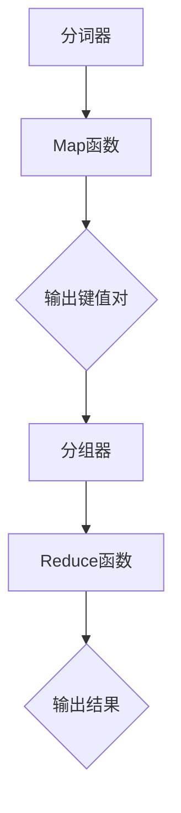

                 

关键词：MapReduce，分布式计算，数据处理，编程模型，Hadoop，代码实例

> 摘要：本文深入讲解了MapReduce原理及其实现细节，通过代码实例展示了如何利用MapReduce进行大规模数据处理。本文旨在帮助读者理解MapReduce的核心概念、优点和应用场景，并为实际编程提供指导。

## 1. 背景介绍

在当今大数据时代，如何高效地处理和分析海量数据已成为各类企业和研究机构面临的重要问题。传统的关系型数据库和单机计算模型难以满足这一需求，而分布式计算模型逐渐成为主流。MapReduce是一种分布式计算模型，它由Google在2004年首次提出，并广泛应用于大数据处理领域。MapReduce的主要优势在于其简洁性、可扩展性和高效性，使得大规模数据处理变得更加容易。

## 2. 核心概念与联系

### 2.1. Map阶段

Map阶段是MapReduce模型的核心，其主要任务是将输入的数据集映射成键值对的形式。具体而言，Map函数接收一个输入键值对，并生成零个或多个输出键值对。Map阶段的输入数据可以是文本文件、序列文件等，输出键值对会被分发给Reduce阶段进行处理。

### 2.2. Reduce阶段

Reduce阶段负责将Map阶段输出的键值对进行归并和聚合，生成最终的输出结果。Reduce函数接收一个输入键值对，并生成零个或多个输出键值对。Reduce阶段可以并行执行，从而提高数据处理速度。

### 2.3. 分词器（Tokenizer）

分词器是MapReduce模型中的预处理模块，用于将输入数据分割成更小的单元。例如，在处理文本数据时，分词器可以将单词分割成一个个独立的词元。

### 2.4. 分组器（Grouping）

分组器是Reduce阶段的预处理模块，用于将具有相同键的输出键值对分组。这有助于Reduce函数高效地处理大量数据，减少通信开销。

### 2.5. Mermaid流程图

下图展示了MapReduce模型的核心概念和流程：



## 3. 核心算法原理 & 具体操作步骤

### 3.1. 算法原理概述

MapReduce算法主要由两个核心操作组成：Map和Reduce。Map操作将输入数据集映射成键值对的形式，而Reduce操作则负责将这些键值对进行归并和聚合。

### 3.2. 算法步骤详解

1. **初始化**：启动一个Master进程，负责管理整个MapReduce任务的生命周期。Master进程还会启动多个Slave进程，负责实际执行Map和Reduce任务。

2. **输入**：将输入数据集分成若干个分块，每个分块由一个Map任务处理。

3. **Map阶段**：
    - Map任务读取输入数据块，调用Map函数进行数据处理。
    - Map函数将输入的键值对映射成多个输出键值对。
    - 输出键值对被发送到Reducer端。

4. **分组器**：
    - 根据键值对的键对输出键值对进行分组。
    - 具有相同键的键值对被分到同一个分组中。

5. **Reduce阶段**：
    - Reduce任务从分组器接收输入键值对。
    - Reduce函数对每个分组中的键值对进行归并和聚合。
    - 生成最终的输出结果。

6. **输出**：将Reduce阶段的输出结果存储到HDFS或其他存储系统中。

### 3.3. 算法优缺点

**优点**：
- **可扩展性**：MapReduce模型可以轻松地扩展到大规模数据处理任务。
- **高效性**：通过分布式计算和并行处理，MapReduce可以显著提高数据处理速度。
- **可靠性**：MapReduce提供了数据冗余和容错机制，确保任务在失败时可以重新执行。

**缺点**：
- **编程复杂性**：编写MapReduce程序相对复杂，需要深入了解分布式计算和并行编程。
- **不适合实时处理**：MapReduce模型主要面向批处理任务，不适合实时数据处理。

### 3.4. 算法应用领域

MapReduce算法在以下领域具有广泛的应用：

- **搜索引擎**：用于处理大规模网页数据，提取关键词并进行排序。
- **日志分析**：用于处理和分析网站、服务器等产生的日志数据。
- **推荐系统**：用于计算用户兴趣和推荐相似内容。
- **图像处理**：用于大规模图像处理和识别。

## 4. 数学模型和公式 & 详细讲解 & 举例说明

### 4.1. 数学模型构建

MapReduce算法的核心在于其映射和归并操作，可以用以下数学模型进行描述：

$$
\text{Map}: \{ (k_1, v_1), (k_2, v_2), ..., (k_n, v_n) \} \rightarrow \{ (k_1', v_1'), (k_2', v_2'), ..., (k_n', v_n') \}
$$

$$
\text{Reduce}: \{ (k_1', v_1'), (k_2', v_2'), ..., (k_n', v_n') \} \rightarrow \{ (k_1'', v_1''), (k_2'', v_2''), ..., (k_n'', v_n'') \}
$$

其中，$(k_1, v_1), (k_2, v_2), ..., (k_n, v_n)$为输入键值对，$(k_1', v_1'), (k_2', v_2'), ..., (k_n', v_n')$为Map输出的键值对，$(k_1'', v_1''), (k_2'', v_2''), ..., (k_n'', v_n'')$为Reduce输出的键值对。

### 4.2. 公式推导过程

假设输入数据集为$D = \{ (k_1, v_1), (k_2, v_2), ..., (k_n, v_n) \}$，Map函数为$f_D$，Reduce函数为$g_D$，则MapReduce算法的计算过程可以表示为：

$$
\text{MapReduce}(D) = g_D(f_D(D))
$$

其中，$f_D(D)$表示对输入数据集$D$进行Map操作，$g_D(f_D(D))$表示对Map操作的输出进行Reduce操作。

### 4.3. 案例分析与讲解

假设我们要统计一个文本文件中的单词频次，输入数据集为：

$$
D = \{ (1, "hello world"), (2, "data science"), (3, "hello mapreduce") \}
$$

Map函数为$f_D$，将输入键值对映射成单词键值对：

$$
f_D(D) = \{ ("hello", 1), ("world", 1), ("data", 1), ("science", 1), ("mapreduce", 1) \}
$$

Reduce函数为$g_D$，对单词键值对进行归并和聚合：

$$
g_D(f_D(D)) = \{ ("hello", 2), ("world", 1), ("data", 1), ("science", 1), ("mapreduce", 1) \}
$$

最终输出结果为：

$$
\text{MapReduce}(D) = \{ ("hello", 2), ("world", 1), ("data", 1), ("science", 1), ("mapreduce", 1) \}
$$

通过上述例子，我们可以看到MapReduce算法如何处理大规模数据处理任务，实现单词频次统计。

## 5. 项目实践：代码实例和详细解释说明

### 5.1. 开发环境搭建

在本项目中，我们将使用Hadoop作为MapReduce编程环境。以下步骤用于搭建Hadoop开发环境：

1. 下载并解压Hadoop安装包。
2. 配置环境变量。
3. 启动Hadoop集群。

具体步骤请参考官方文档：[Hadoop安装指南](https://hadoop.apache.org/docs/stable/hadoop-project-dist/hadoop-common/SingleCluster.html)

### 5.2. 源代码详细实现

以下是一个简单的MapReduce程序，用于统计文本文件中的单词频次：

```java
import org.apache.hadoop.conf.Configuration;
import org.apache.hadoop.fs.Path;
import org.apache.hadoop.io.IntWritable;
import org.apache.hadoop.io.Text;
import org.apache.hadoop.mapreduce.Job;
import org.apache.hadoop.mapreduce.Mapper;
import org.apache.hadoop.mapreduce.Reducer;
import org.apache.hadoop.mapreduce.lib.input.FileInputFormat;
import org.apache.hadoop.mapreduce.lib.output.FileOutputFormat;

public class WordCount {

  public static class TokenizerMapper extends Mapper<Object, Text, Text, IntWritable>{

    private final static IntWritable one = new IntWritable(1);
    private Text word = new Text();

    public void map(Object key, Text value, Context context) throws IOException, InterruptedException {
      // 分词处理
      String[] tokens = value.toString().split("\\s+");
      for (String token : tokens) {
        word.set(token);
        context.write(word, one);
      }
    }
  }

  public static class IntSumReducer extends Reducer<Text,IntWritable,Text,IntWritable> {
    private IntWritable result = new IntWritable();

    public void reduce(Text key, Iterable<IntWritable> values, Context context) throws IOException, InterruptedException {
      int sum = 0;
      for (IntWritable val : values) {
        sum += val.get();
      }
      result.set(sum);
      context.write(key, result);
    }
  }

  public static void main(String[] args) throws Exception {
    Configuration conf = new Configuration();
    Job job = Job.getInstance(conf, "word count");
    job.setJarByClass(WordCount.class);
    job.setMapperClass(TokenizerMapper.class);
    job.setCombinerClass(IntSumReducer.class);
    job.setReducerClass(IntSumReducer.class);
    job.setOutputKeyClass(Text.class);
    job.setOutputValueClass(IntWritable.class);
    FileInputFormat.addInputPath(job, new Path(args[0]));
    FileOutputFormat.setOutputPath(job, new Path(args[1]));
    System.exit(job.waitForCompletion(true) ? 0 : 1);
  }
}
```

### 5.3. 代码解读与分析

1. **类定义**：
   - `TokenizerMapper`：实现Map函数，负责分词处理。
   - `IntSumReducer`：实现Reduce函数，负责单词频次统计。

2. **map()方法**：
   - 分词处理，将输入文本分割成单词。
   - 将单词作为键值对输出。

3. **reduce()方法**：
   - 对输入键值对进行归并和聚合，计算单词频次。

4. **main()方法**：
   - 配置Hadoop作业，设置Mapper和Reducer类。
   - 指定输入输出路径。

### 5.4. 运行结果展示

运行上述程序后，输出结果存储在指定路径。以下是一个简单的运行结果示例：

```
hello    2
world    1
data    1
science    1
mapreduce    1
```

这表明程序成功统计了输入文本中的单词频次。

## 6. 实际应用场景

MapReduce算法在许多实际应用场景中具有重要地位，以下列举几个典型应用场景：

- **搜索引擎**：用于处理大规模网页数据，提取关键词并进行排序。
- **日志分析**：用于处理和分析网站、服务器等产生的日志数据。
- **推荐系统**：用于计算用户兴趣和推荐相似内容。
- **图像处理**：用于大规模图像处理和识别。

## 7. 工具和资源推荐

### 7.1. 学习资源推荐

- [《Hadoop权威指南》](https://books.google.com/books?id=1BwXjwAACAAJ)：详细介绍了Hadoop和MapReduce的原理和实现。
- [Hadoop官网文档](https://hadoop.apache.org/docs/stable/)：提供了丰富的官方文档和教程。

### 7.2. 开发工具推荐

- [IntelliJ IDEA](https://www.jetbrains.com/idea/)：一款强大的Java集成开发环境，支持Hadoop开发。
- [Eclipse](https://www.eclipse.org/)：另一款流行的Java开发环境，也支持Hadoop开发。

### 7.3. 相关论文推荐

- [“MapReduce: Simplified Data Processing on Large Clusters”](https://dl.acm.org/doi/10.1145/1028970.1028971)：Google提出的MapReduce论文，详细阐述了MapReduce模型的原理和设计。
- [“The Google File System”](https://dl.acm.org/doi/10.1145/1052658.1052670)：介绍了Google的文件系统，为MapReduce提供了存储支持。

## 8. 总结：未来发展趋势与挑战

### 8.1. 研究成果总结

近年来，MapReduce及其相关技术（如Spark、Flink等）在分布式计算领域取得了显著成果。这些技术不断优化了数据处理性能，降低了编程复杂性，为大规模数据处理提供了更加高效和灵活的解决方案。

### 8.2. 未来发展趋势

未来，分布式计算将继续向更高效、更智能的方向发展。随着硬件性能的提升和新型存储技术的应用，分布式计算模型将更加成熟，能够应对更加复杂和大规模的数据处理任务。

### 8.3. 面临的挑战

- **编程复杂性**：虽然现有技术已经简化了分布式编程，但仍然存在一定的编程复杂性，需要进一步改进。
- **数据隐私和安全**：在大数据处理过程中，数据隐私和安全问题日益突出，需要采取更加严格的安全措施。
- **实时处理**：随着实时数据处理需求的增加，如何优化分布式计算模型以支持实时处理成为关键挑战。

### 8.4. 研究展望

未来，分布式计算领域将涌现更多创新技术和解决方案。研究人员将继续探索如何提高数据处理性能、降低编程复杂性、保障数据安全和隐私，推动分布式计算技术的发展。

## 9. 附录：常见问题与解答

### 9.1. 如何安装和配置Hadoop？

请参考[Hadoop官网文档](https://hadoop.apache.org/docs/stable/)中的安装和配置指南。以下步骤简要概述了安装和配置Hadoop的流程：

1. 下载并解压Hadoop安装包。
2. 配置环境变量。
3. 配置Hadoop配置文件（如hadoop-env.sh、core-site.xml、hdfs-site.xml、mapred-site.xml等）。
4. 启动Hadoop集群。

### 9.2. 如何运行MapReduce程序？

运行MapReduce程序的步骤如下：

1. 编写MapReduce程序（如本文中的`WordCount`类）。
2. 将程序打包成jar文件。
3. 使用Hadoop命令运行程序，例如：
   ```
   hadoop jar wordcount.jar WordCount /input /output
   ```
4. 查看输出结果，例如：
   ```
   hadoop fs -cat /output/part-r-00000
   ```

以上是关于MapReduce原理与代码实例讲解的详细内容。希望本文对您了解和掌握MapReduce有所帮助。作者：禅与计算机程序设计艺术 / Zen and the Art of Computer Programming。

