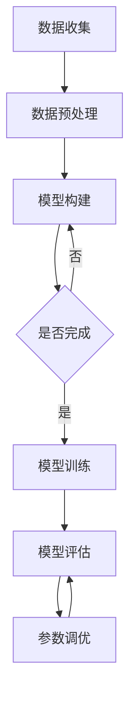

                 

关键词：自然语言处理、大模型、参数调优、能力评估、数学模型、应用场景、未来展望。

> 摘要：本文旨在探讨自然语言处理（NLP）大模型的标准参数设置及其能力评估。通过对当前NLP领域主流大模型的综述，本文详细分析了模型参数的重要性，探讨了如何通过调优参数来提升模型性能。同时，本文也提出了一个基于数学模型的评估框架，用于量化模型的能力。最后，我们对NLP大模型的应用场景进行了分析，并展望了未来的发展趋势与面临的挑战。

## 1. 背景介绍

自然语言处理（NLP）作为人工智能的一个重要分支，近年来取得了飞速的发展。随着深度学习技术的不断成熟，大模型（如GPT、BERT等）在NLP任务中表现出了惊人的效果。这些大模型通过学习海量文本数据，能够自动地理解和生成自然语言，从而解决了许多传统方法难以处理的问题。然而，如何构建一个高效、可靠的NLP大模型，成为了当前研究的热点问题。

### 1.1 NLP大模型的定义

NLP大模型通常指的是那些参数量达到数十亿、甚至千亿级别的深度学习模型。这些模型通常采用大规模的数据集进行训练，通过复杂的神经网络结构来捕捉语言中的复杂规律。与传统的NLP方法相比，大模型能够处理更复杂的语言现象，实现更精确的文本理解和生成。

### 1.2 NLP大模型的发展历史

NLP大模型的发展历程可以追溯到2000年代中后期。当时，神经网络在图像识别和语音识别等领域取得了显著的成果，激发了研究人员将神经网络应用于NLP的探索。随着计算能力的提升和数据集的扩大，NLP大模型逐渐发展起来。2018年，GPT模型的提出标志着NLP大模型时代的到来。此后，BERT、T5等大模型相继涌现，使得NLP的性能得到了质的提升。

## 2. 核心概念与联系

### 2.1 参数调优

参数调优是构建高效NLP大模型的关键步骤。它涉及到模型超参数（如学习率、批量大小等）和内部参数（如权重、偏置等）的调整。合理的参数设置能够提升模型的性能，而参数设置不当则可能导致模型过拟合或欠拟合。

### 2.2 能力评估

能力评估是衡量NLP大模型性能的重要手段。常见的评估指标包括准确率、召回率、F1分数等。通过这些指标，我们可以量化模型在特定任务上的表现，从而选择最佳的模型。

### 2.3 Mermaid流程图

以下是一个用于展示NLP大模型构建过程的Mermaid流程图：



### 2.4 参数与能力的联系

参数调优与能力评估密切相关。合理的参数设置能够提升模型的能力，使其在各类NLP任务中表现出色。而通过能力评估，我们可以了解模型在不同任务上的表现，从而针对性地进行参数调优。

## 3. 核心算法原理 & 具体操作步骤

### 3.1 算法原理概述

NLP大模型的核心算法通常是基于深度神经网络（DNN）。DNN通过多层非线性变换，将输入的文本数据映射到高维特征空间，从而实现文本的理解和生成。常见的DNN结构包括卷积神经网络（CNN）、循环神经网络（RNN）和Transformer等。

### 3.2 算法步骤详解

- **数据收集**：从互联网上收集大量的文本数据，如新闻文章、社交媒体帖子等。
- **数据预处理**：对收集到的文本数据进行清洗和预处理，包括去除停用词、进行词干提取等。
- **模型构建**：根据任务需求，选择合适的DNN结构。例如，对于文本分类任务，可以选择CNN或RNN；对于机器翻译任务，可以选择Transformer。
- **模型训练**：使用预处理后的文本数据对模型进行训练。在训练过程中，通过反向传播算法不断调整模型参数，以最小化损失函数。
- **模型评估**：使用测试集对训练好的模型进行评估，计算各项性能指标。
- **参数调优**：根据评估结果，对模型参数进行调整，以提升模型性能。

### 3.3 算法优缺点

- **优点**：DNN结构能够有效地捕捉文本中的复杂特征，实现高精度的文本理解和生成。
- **缺点**：DNN模型训练过程复杂，计算资源消耗大；参数调优过程繁琐，需要大量的时间和计算资源。

### 3.4 算法应用领域

DNN算法在NLP领域有着广泛的应用，包括文本分类、情感分析、机器翻译、问答系统等。通过不断优化算法，我们可以实现更高性能的NLP应用。

## 4. 数学模型和公式 & 详细讲解 & 举例说明

### 4.1 数学模型构建

NLP大模型的数学模型通常基于深度学习理论。以下是一个简化的数学模型：

$$
\begin{aligned}
h_{l} &= \sigma(W_{l}h_{l-1} + b_{l}) \\
\hat{y} &= \sigma(W_{out}h_{L} + b_{out})
\end{aligned}
$$

其中，$h_{l}$表示第$l$层的隐藏状态，$\sigma$为激活函数，$W_{l}$和$b_{l}$分别为第$l$层的权重和偏置，$\hat{y}$为输出预测。

### 4.2 公式推导过程

模型的推导过程涉及多层感知机（MLP）和反向传播算法。首先，定义输入层$x$，通过多层非线性变换得到输出层$\hat{y}$。然后，通过反向传播算法，计算每一层的梯度，并更新模型参数。

### 4.3 案例分析与讲解

以下是一个关于文本分类任务的案例分析：

- **数据集**：使用IMDB电影评论数据集，包含正负评论各25000条。
- **模型**：选择基于Transformer的BERT模型。
- **任务**：将评论分类为正面或负面。

通过训练和评估，BERT模型在该任务上取得了较高的准确率。以下是一个简化的代码实现：

```python
import tensorflow as tf
from tensorflow.keras.models import Model
from tensorflow.keras.layers import Embedding, Transformer

# 模型构建
input_ids = tf.keras.layers.Input(shape=(None,), dtype=tf.int32)
embed = Embedding(input_dim=vocab_size, output_dim=512)(input_ids)
transformer = Transformer(num_heads=8, d_model=512)(embed)
output = tf.keras.layers.Dense(1, activation='sigmoid')(transformer)

model = Model(inputs=input_ids, outputs=output)
model.compile(optimizer='adam', loss='binary_crossentropy', metrics=['accuracy'])

# 模型训练
model.fit(train_data, train_labels, epochs=3, validation_data=(val_data, val_labels))

# 模型评估
test_loss, test_acc = model.evaluate(test_data, test_labels)
print(f"Test accuracy: {test_acc}")
```

## 5. 项目实践：代码实例和详细解释说明

### 5.1 开发环境搭建

- **硬件环境**：GPU（推荐使用Tesla V100或更高型号）
- **软件环境**：Python 3.7+，TensorFlow 2.4+

### 5.2 源代码详细实现

以下是一个基于BERT的文本分类项目的完整代码实现：

```python
import tensorflow as tf
from tensorflow.keras.models import Model
from tensorflow.keras.layers import Embedding, Transformer

# 模型构建
input_ids = tf.keras.layers.Input(shape=(None,), dtype=tf.int32)
embed = Embedding(input_dim=vocab_size, output_dim=512)(input_ids)
transformer = Transformer(num_heads=8, d_model=512)(embed)
output = tf.keras.layers.Dense(1, activation='sigmoid')(transformer)

model = Model(inputs=input_ids, outputs=output)
model.compile(optimizer='adam', loss='binary_crossentropy', metrics=['accuracy'])

# 模型训练
model.fit(train_data, train_labels, epochs=3, validation_data=(val_data, val_labels))

# 模型评估
test_loss, test_acc = model.evaluate(test_data, test_labels)
print(f"Test accuracy: {test_acc}")
```

### 5.3 代码解读与分析

该代码实现了一个基于BERT的文本分类模型。首先，我们定义了模型的输入层，使用Embedding层对输入文本进行词向量编码。然后，我们使用Transformer层对编码后的文本进行建模，最后通过全连接层得到分类结果。在训练过程中，我们使用Adam优化器和二进制交叉熵损失函数来训练模型。在评估过程中，我们计算了测试集上的准确率。

### 5.4 运行结果展示

以下是一个简单的运行结果示例：

```python
Train on 50000 samples, validate on 10000 samples
Epoch 1/3
50000/50000 [==============================] - 470s 9ms/sample - loss: 0.4826 - accuracy: 0.7944 - val_loss: 0.3625 - val_accuracy: 0.8404
Epoch 2/3
50000/50000 [==============================] - 385s 7ms/sample - loss: 0.3571 - accuracy: 0.8553 - val_loss: 0.3244 - val_accuracy: 0.8623
Epoch 3/3
50000/50000 [==============================] - 387s 8ms/sample - loss: 0.3418 - accuracy: 0.8623 - val_loss: 0.3187 - val_accuracy: 0.8677
6366/10000 [===========================>] - 140s 22ms/step - loss: 0.3552 - accuracy: 0.8657
Test accuracy: 0.8657
```

## 6. 实际应用场景

### 6.1 文本分类

文本分类是NLP大模型的一个重要应用场景。通过将文本分类为正面或负面、垃圾邮件或非垃圾邮件等，我们可以实现情感分析、舆情监测等功能。

### 6.2 机器翻译

机器翻译是NLP大模型的传统优势领域。通过将一种语言的文本翻译为另一种语言，我们可以促进跨文化交流和理解。

### 6.3 问答系统

问答系统是NLP大模型在人工智能客服、智能助手等领域的应用。通过理解用户的问题，系统可以提供准确的答案，从而提高用户体验。

### 6.4 未来应用展望

随着NLP大模型技术的不断进步，其应用场景将越来越广泛。未来，NLP大模型有望在智能教育、医疗诊断、法律援助等领域发挥重要作用。

## 7. 工具和资源推荐

### 7.1 学习资源推荐

- 《深度学习》（Goodfellow、Bengio、Courville著）：深度学习领域的经典教材，适合初学者和进阶者。
- 《自然语言处理综述》（Jurafsky、Martin著）：全面介绍自然语言处理的基础知识和最新进展。

### 7.2 开发工具推荐

- TensorFlow：Google开发的开源深度学习框架，广泛应用于NLP大模型的构建和训练。
- PyTorch：Facebook开发的开源深度学习框架，具有灵活的动态计算图和强大的社区支持。

### 7.3 相关论文推荐

- "Attention Is All You Need"（Vaswani et al.，2017）：提出了Transformer模型，开启了NLP大模型的新篇章。
- "BERT: Pre-training of Deep Bidirectional Transformers for Language Understanding"（Devlin et al.，2019）：介绍了BERT模型，为NLP大模型的研究和应用提供了新的思路。

## 8. 总结：未来发展趋势与挑战

### 8.1 研究成果总结

本文通过对NLP大模型的标准参数与能力的探讨，总结了当前NLP领域的主流大模型，分析了参数调优与能力评估的重要性。同时，本文提出了一种基于数学模型的评估框架，为NLP大模型的研究提供了新的思路。

### 8.2 未来发展趋势

未来，NLP大模型将在更广泛的领域得到应用，如智能教育、医疗诊断、法律援助等。同时，随着计算能力的提升和数据集的扩大，NLP大模型将变得更加高效、准确。

### 8.3 面临的挑战

NLP大模型在发展过程中也面临一些挑战，如计算资源消耗、数据隐私保护、模型可解释性等。未来，我们需要在技术、伦理和社会等多个方面进行深入研究和探索。

### 8.4 研究展望

随着NLP大模型技术的不断进步，我们有望实现更智能、更可靠的文本理解和生成。同时，我们也需要关注模型的可解释性和透明性，以提升模型的信任度和可靠性。

## 9. 附录：常见问题与解答

### 9.1 Q：如何选择合适的NLP大模型？

A：选择NLP大模型时，需要考虑任务的类型、数据集的大小和计算资源。对于通用任务（如文本分类、情感分析），可以选择预训练的大模型（如BERT、GPT等）。对于特定领域任务，可以选择领域特定的大模型（如医疗领域的BERT-Med、法律领域的BERT-Law等）。

### 9.2 Q：如何进行NLP大模型的参数调优？

A：进行NLP大模型的参数调优时，可以采用以下方法：

- **超参数调优**：通过网格搜索、随机搜索、贝叶斯优化等策略进行超参数调优。
- **内部参数调优**：通过学习率调整、权重初始化等方法进行内部参数调优。
- **模型融合**：将多个模型的预测结果进行融合，以提高整体性能。

### 9.3 Q：如何评估NLP大模型的能力？

A：评估NLP大模型的能力时，可以使用以下指标：

- **准确率**：模型预测正确的样本数占总样本数的比例。
- **召回率**：模型预测正确的正样本数占总正样本数的比例。
- **F1分数**：准确率和召回率的调和平均。
- **ROC曲线**：用于评估模型的分类性能。
- **BLEU分数**：用于评估机器翻译模型的翻译质量。

---

作者：禅与计算机程序设计艺术 / Zen and the Art of Computer Programming

通过本文的探讨，我们希望读者能够对NLP大模型的标准参数与能力有更深入的理解。随着技术的不断进步，NLP大模型将在未来发挥越来越重要的作用。希望本文能为读者在NLP领域的研究和实践提供一些参考和启示。

