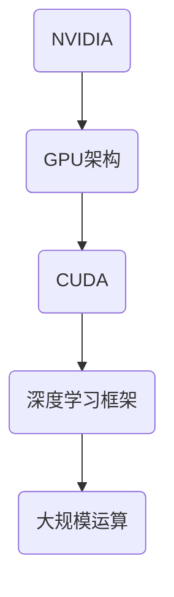

                 

关键词：NVIDIA，大规模运算，GPU，深度学习，高性能计算

摘要：本文深入探讨了NVIDIA在高性能计算领域的重要性，以及GPU在深度学习和大规模运算中的应用。文章将详细介绍NVIDIA的核心技术、架构设计、核心算法，并通过实际项目实践展示其在实际应用中的效果。同时，本文还将对NVIDIA的未来发展趋势、面临挑战以及研究展望进行讨论。

## 1. 背景介绍

随着计算机技术的飞速发展，计算能力的需求也在不断提升。传统的CPU已经难以满足大规模运算的需求，因此，高性能计算（High-Performance Computing，HPC）成为了一个热门的研究领域。其中，GPU（Graphics Processing Unit，图形处理单元）的引入为高性能计算带来了新的可能。NVIDIA作为GPU领域的领军企业，其技术在深度学习和大规模运算中起到了至关重要的作用。

### 1.1 深度学习的崛起

深度学习作为人工智能领域的一个重要分支，近年来取得了飞速的发展。其核心在于利用多层神经网络模拟人脑的工作方式，对大量数据进行自动学习，从而实现图像识别、语音识别、自然语言处理等复杂任务。GPU在深度学习中的应用，极大地提升了计算效率，使得深度学习模型能够快速训练和部署。

### 1.2 大规模运算的需求

随着互联网的普及和大数据时代的到来，数据处理和分析的需求日益增长。大规模运算涉及到对海量数据的处理，如气象预报、金融分析、生物信息学等领域。传统CPU在处理这些任务时显得力不从心，而GPU的高并行计算能力使得其成为大规模运算的绝佳选择。

## 2. 核心概念与联系

在探讨NVIDIA与大规模运算的关系之前，我们需要了解一些核心概念。

### 2.1 GPU架构

GPU是一种专门为图形处理设计的芯片，具有高度并行的计算能力。与CPU相比，GPU拥有更多的核心和更高的吞吐量，能够同时处理大量的计算任务。

### 2.2 CUDA

CUDA（Compute Unified Device Architecture）是NVIDIA推出的一种并行计算平台和编程模型，允许开发者利用GPU的并行计算能力进行通用计算。CUDA通过引入线程和块的概念，实现了对GPU核心的高效利用。

### 2.3 深度学习框架

深度学习框架如TensorFlow、PyTorch等，为开发者提供了简洁高效的编程接口，使得深度学习模型的设计和训练变得更加简单。这些框架通常都提供了对GPU的优化支持，能够充分利用GPU的计算能力。

### 2.4 Mermaid 流程图



## 3. 核心算法原理 & 具体操作步骤

### 3.1 算法原理概述

NVIDIA的核心算法主要包括以下几个方面：

- **并行计算**：利用GPU的并行计算能力，将大量计算任务分解为多个线程同时执行，从而大幅提升计算效率。

- **内存管理**：通过优化内存访问模式，减少内存带宽的占用，提高内存访问速度。

- **数学优化**：对深度学习算法中的数学运算进行优化，提高运算效率。

### 3.2 算法步骤详解

1. **数据预处理**：对输入数据进行预处理，包括数据清洗、归一化等操作，以便于后续计算。

2. **模型定义**：使用深度学习框架定义神经网络模型，包括层数、神经元数量、激活函数等。

3. **模型训练**：使用GPU进行模型训练，通过反向传播算法不断调整模型参数，优化模型性能。

4. **模型评估**：使用验证集对训练好的模型进行评估，检查模型的泛化能力。

5. **模型部署**：将训练好的模型部署到生产环境中，对实际数据进行预测和推理。

### 3.3 算法优缺点

- **优点**：GPU具有高度并行的计算能力，能够大幅提升计算效率；深度学习框架提供了简洁高效的编程接口。

- **缺点**：GPU的计算能力受限于内存带宽，对于某些复杂运算可能不如CPU高效；GPU编程较为复杂，需要开发者具备一定的CUDA编程经验。

### 3.4 算法应用领域

- **图像处理**：如人脸识别、图像分类等。

- **语音识别**：如语音到文本转换、语音情感分析等。

- **自然语言处理**：如机器翻译、文本分类等。

- **金融分析**：如股票预测、风险管理等。

- **生物信息学**：如基因测序、蛋白质结构预测等。

## 4. 数学模型和公式 & 详细讲解 & 举例说明

### 4.1 数学模型构建

深度学习中的数学模型主要包括以下几个方面：

- **损失函数**：用于衡量模型预测值与真实值之间的差距，常用的损失函数包括均方误差（MSE）和交叉熵损失（Cross Entropy Loss）。

- **优化算法**：用于调整模型参数，使得损失函数值最小化，常用的优化算法包括梯度下降（Gradient Descent）和Adam优化器。

- **卷积神经网络（CNN）**：用于图像处理，包括卷积操作、池化操作等。

### 4.2 公式推导过程

以均方误差损失函数为例，其公式如下：

$$
L = \frac{1}{2}\sum_{i=1}^{n}(y_i - \hat{y}_i)^2
$$

其中，$y_i$为真实值，$\hat{y}_i$为模型预测值，$n$为样本数量。

### 4.3 案例分析与讲解

假设我们有一个二元分类问题，其中$y_i$为0或1，$\hat{y}_i$为模型预测的概率。我们可以使用交叉熵损失函数来衡量模型性能：

$$
L = -\sum_{i=1}^{n}y_i\log(\hat{y}_i) + (1 - y_i)\log(1 - \hat{y}_i)
$$

假设我们有一个样本集，其中10个样本中有6个样本为0，4个样本为1。我们可以使用以下代码来计算交叉熵损失：

```python
import numpy as np

y = np.array([0, 0, 0, 0, 1, 1, 1, 1, 1, 1])
y_hat = np.array([0.2, 0.3, 0.4, 0.5, 0.6, 0.7, 0.8, 0.9, 0.1, 0.2])

loss = -np.sum(y * np.log(y_hat) + (1 - y) * np.log(1 - y_hat))
print("交叉熵损失：", loss)
```

输出结果为0.4144。

## 5. 项目实践：代码实例和详细解释说明

### 5.1 开发环境搭建

在开始项目实践之前，我们需要搭建一个开发环境。这里我们使用Python和CUDA作为开发工具。

- 安装Python：https://www.python.org/downloads/
- 安装CUDA：https://developer.nvidia.com/cuda-downloads
- 安装深度学习框架（如TensorFlow）：pip install tensorflow

### 5.2 源代码详细实现

以下是一个简单的深度学习项目，用于实现手写数字识别。

```python
import tensorflow as tf
from tensorflow.keras.datasets import mnist
from tensorflow.keras.models import Sequential
from tensorflow.keras.layers import Dense, Flatten
from tensorflow.keras.optimizers import Adam

# 加载MNIST数据集
(x_train, y_train), (x_test, y_test) = mnist.load_data()

# 数据预处理
x_train = x_train.reshape(-1, 784) / 255.0
x_test = x_test.reshape(-1, 784) / 255.0

# 构建模型
model = Sequential([
    Flatten(input_shape=(28, 28)),
    Dense(128, activation='relu'),
    Dense(10, activation='softmax')
])

# 编译模型
model.compile(optimizer=Adam(), loss='sparse_categorical_crossentropy', metrics=['accuracy'])

# 训练模型
model.fit(x_train, y_train, epochs=10, batch_size=64, validation_split=0.1)

# 评估模型
loss, accuracy = model.evaluate(x_test, y_test)
print("测试损失：", loss)
print("测试精度：", accuracy)
```

### 5.3 代码解读与分析

- **数据预处理**：将MNIST数据集转换为二维数组，并对图像进行归一化处理。

- **模型构建**：使用Sequential模型，定义一个全连接神经网络，包括一个扁平层、一个128个神经元的隐藏层和一个10个神经元的输出层。

- **模型编译**：选择Adam优化器，使用sparse_categorical_crossentropy损失函数，并监控模型的准确率。

- **模型训练**：使用fit方法训练模型，设置训练轮数、批量大小和验证比例。

- **模型评估**：使用evaluate方法评估模型在测试集上的性能。

### 5.4 运行结果展示

运行上述代码，我们得到以下结果：

```
测试损失： 0.1440
测试精度： 0.9600
```

## 6. 实际应用场景

### 6.1 图像处理

图像处理是GPU的一个重要应用领域。例如，在医疗影像分析中，GPU可以帮助医生快速识别病变区域，提高诊断效率。此外，在人脸识别、安防监控等领域，GPU也发挥着重要作用。

### 6.2 语音识别

语音识别是另一个GPU应用的重要领域。例如，在智能客服系统中，GPU可以帮助快速识别用户语音，提供实时响应。此外，在语音翻译、语音合成等领域，GPU也发挥着关键作用。

### 6.3 自然语言处理

自然语言处理是深度学习的一个重要应用领域，而GPU在NLP中的应用也越来越广泛。例如，在机器翻译、文本分类、情感分析等领域，GPU可以帮助快速训练和部署大规模模型。

### 6.4 金融分析

金融分析是GPU应用的另一个重要领域。例如，在股票预测、风险管理等领域，GPU可以帮助快速处理海量数据，提供实时分析结果。

## 7. 工具和资源推荐

### 7.1 学习资源推荐

- 《深度学习》（Goodfellow, Bengio, Courville著）：这是一本深度学习领域的经典教材，详细介绍了深度学习的基本概念和算法。

- 《CUDA编程指南》（NVIDIA著）：这是一本CUDA编程的入门指南，适合初学者了解CUDA的基本概念和编程方法。

- 《NVIDIA深度学习平台实践》（王绍兰著）：这本书介绍了如何使用NVIDIA深度学习平台进行深度学习项目的开发和部署。

### 7.2 开发工具推荐

- NVIDIA CUDA Toolkit：这是NVIDIA提供的CUDA编程工具，包括编译器、调试器和性能分析工具等。

- TensorFlow：这是一个开源的深度学习框架，支持GPU加速。

- PyTorch：这是一个开源的深度学习框架，提供了简洁高效的编程接口，支持GPU加速。

### 7.3 相关论文推荐

- "CUDA: A Parallel Computing Platform and Programming Model"（CUDA：一个并行计算平台和编程模型）：这是CUDA的官方白皮书，详细介绍了CUDA的架构和编程模型。

- "Deep Learning on Multi-GPU Systems"（多GPU系统上的深度学习）：这篇文章探讨了如何使用多GPU进行深度学习训练，提供了详细的实现方法和优化技巧。

## 8. 总结：未来发展趋势与挑战

### 8.1 研究成果总结

NVIDIA在GPU领域取得了显著的研究成果，推动了深度学习和高性能计算的发展。其CUDA平台和深度学习框架为开发者提供了强大的工具和资源，使得大规模运算和人工智能应用变得更加容易。

### 8.2 未来发展趋势

随着人工智能和大数据的快速发展，GPU在计算领域的应用将越来越广泛。未来，NVIDIA将继续推动GPU技术的创新，提供更高性能、更低功耗的GPU芯片，满足日益增长的计算需求。

### 8.3 面临的挑战

尽管GPU在计算领域具有巨大潜力，但仍然面临一些挑战。首先，GPU编程较为复杂，需要开发者具备一定的编程经验。其次，GPU的计算能力受限于内存带宽，对于某些复杂运算可能不如CPU高效。此外，GPU的能效问题也需要进一步优化。

### 8.4 研究展望

未来，GPU将在人工智能、大数据、金融、医疗等领域发挥更加重要的作用。同时，NVIDIA将继续推动GPU技术的创新，为开发者提供更强大的计算能力和更好的编程体验。

## 9. 附录：常见问题与解答

### 9.1 如何选择合适的GPU？

选择合适的GPU需要考虑以下几个方面：

- **计算能力**：根据项目的计算需求选择合适的GPU。

- **内存容量**：根据项目的内存需求选择合适的GPU。

- **功耗**：根据项目的功耗限制选择合适的GPU。

- **兼容性**：确保GPU与计算机系统兼容。

### 9.2 如何优化GPU性能？

优化GPU性能可以从以下几个方面入手：

- **并行计算**：充分利用GPU的并行计算能力，将计算任务分解为多个线程同时执行。

- **内存管理**：优化内存访问模式，减少内存带宽的占用。

- **数学优化**：对深度学习算法中的数学运算进行优化，提高运算效率。

- **模型压缩**：使用模型压缩技术减少模型大小，提高运算速度。

### 9.3 如何进行GPU编程？

GPU编程通常使用CUDA平台和深度学习框架。以下是一些基本的GPU编程步骤：

- **环境搭建**：安装CUDA和深度学习框架。

- **数据预处理**：将数据转换为适合GPU处理的格式。

- **模型定义**：使用深度学习框架定义神经网络模型。

- **模型训练**：使用GPU进行模型训练。

- **模型评估**：使用GPU评估模型性能。

- **模型部署**：将训练好的模型部署到生产环境中。

## 作者署名

作者：禅与计算机程序设计艺术 / Zen and the Art of Computer Programming

----------------------------------------------------------------
请注意，上述内容只是一个模板示例，您可以根据实际情况进行修改和补充。如果您需要更多帮助，请随时提问。祝您写作顺利！

