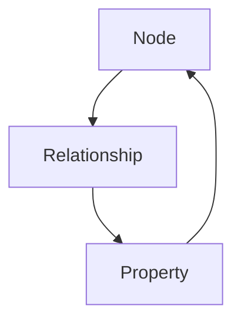
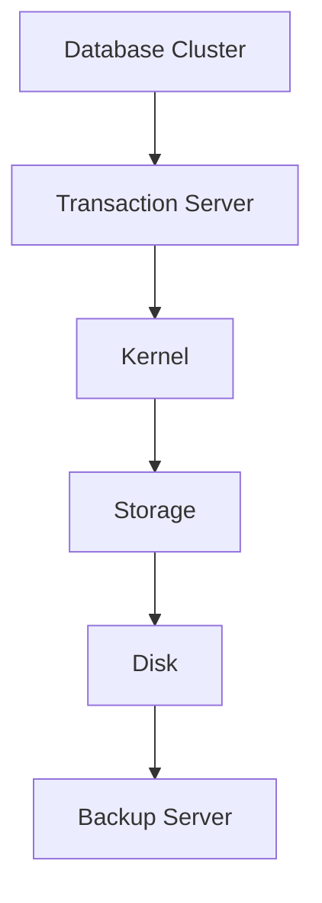
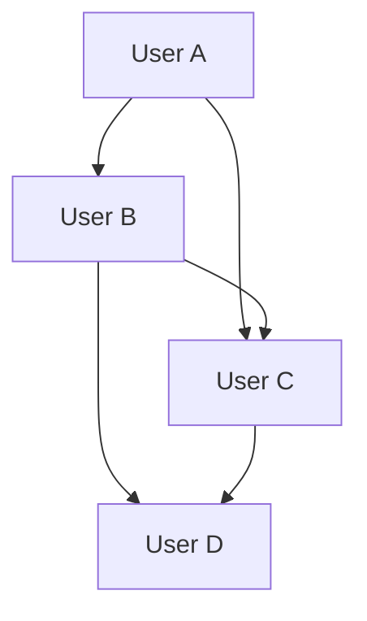
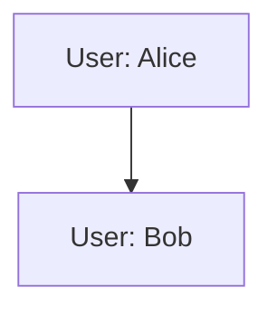
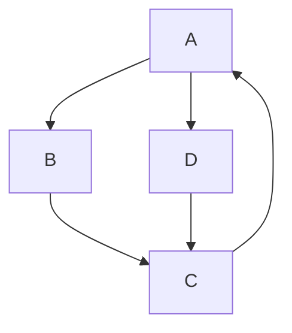
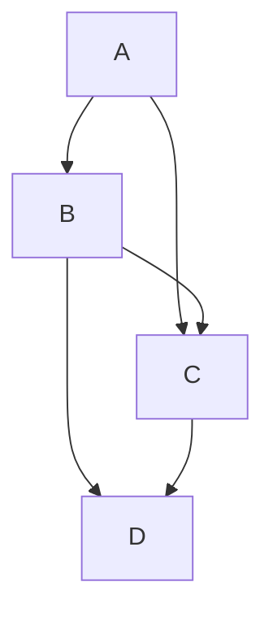

                 

关键词：图数据库、Neo4j、图算法、图神经网络、图计算、数据库设计、节点、关系、属性、图查询语言Cypher、分布式系统、图存储、图计算框架

>摘要：本文将深入探讨图数据库Neo4j的原理，包括其核心概念、架构设计、算法原理以及实际应用。通过实例代码讲解，帮助读者更好地理解和运用Neo4j，掌握图数据库的设计与应用技巧。

## 1. 背景介绍

图数据库是一种基于图形理论存储和查询数据的数据库，它通过节点（Node）和关系（Relationship）来表示实体及其之间的关系。相比于传统的表格数据库，图数据库具有更强大的数据表示能力和查询效率，尤其在处理复杂关系和社交网络等方面具有明显优势。

Neo4j是一个开源的分布式图数据库，采用财产图（Property Graph）模型，支持大规模图数据的存储和查询。Neo4j的核心是图引擎，它提供了高效的图遍历、查询和数据分析功能。随着人工智能和大数据技术的快速发展，图数据库的应用场景日益广泛，Neo4j在金融、电信、物流、社交网络等领域都有广泛的应用。

## 2. 核心概念与联系

Neo4j的核心概念包括节点（Node）、关系（Relationship）和属性（Property）。节点表示实体，如人、物品等；关系表示节点之间的连接，如好友关系、购买关系等；属性表示节点的特征，如年龄、价格等。

下面是Neo4j的Mermaid流程图，展示了核心概念及其关系：



在这个图中，节点A和节点C之间通过关系B相连，同时节点C包含了节点A的属性。

### 2.1 Neo4j架构设计

Neo4j的架构设计采用了分布式存储和计算模式，具有高可用性、高可扩展性和高性能。以下是Neo4j的架构设计示意图：



在这个架构中，数据库集群（Database Cluster）由多个节点组成，每个节点负责存储和查询部分数据。事务服务器（Transaction Server）负责处理客户端的请求，内核（Kernel）负责执行图遍历和查询操作，存储（Storage）和磁盘（Disk）负责数据持久化。备份服务器（Backup Server）负责数据备份和恢复。

## 3. 核心算法原理 & 具体操作步骤

### 3.1 算法原理概述

Neo4j的核心算法是图遍历算法，包括BFS（广度优先搜索）和DFS（深度优先搜索）。这些算法用于在图数据库中查找节点和关系。

### 3.2 算法步骤详解

#### 3.2.1 广度优先搜索（BFS）

1. 选择起始节点作为当前节点。
2. 将当前节点加入访问列表。
3. 从访问列表中取出当前节点，并将其相邻节点加入访问列表。
4. 重复步骤3，直到访问列表为空。

#### 3.2.2 深度优先搜索（DFS）

1. 选择起始节点作为当前节点。
2. 将当前节点加入访问列表。
3. 如果当前节点有未访问的相邻节点，则选择一个相邻节点作为新的当前节点，并重复步骤3。
4. 重复步骤3，直到访问列表为空。

### 3.3 算法优缺点

#### 优点：

- 高效：图遍历算法具有高效的时间复杂度，尤其适用于稀疏图。
- 灵活：可以灵活地扩展和定制，满足不同的查询需求。

#### 缺点：

- 存储开销：需要存储访问列表，增加存储开销。
- 容易陷入死循环：在复杂图中，容易陷入死循环。

### 3.4 算法应用领域

图遍历算法在图数据库中有着广泛的应用，如：

- 社交网络分析：查找好友、推荐好友等。
- 网络拓扑分析：查找网络故障、优化网络结构等。
- 供应链分析：分析供应链中的关键节点和路径。

## 4. 数学模型和公式 & 详细讲解 & 举例说明

### 4.1 数学模型构建

在图数据库中，数学模型主要涉及图论中的基本概念，如节点度、路径长度等。

- 节点度：表示节点在图中的连接数，分为入度（In-degree）和出度（Out-degree）。
- 路径长度：表示两个节点之间的连接数。

### 4.2 公式推导过程

设G=(V,E)为无向图，其中V为节点集，E为边集。

1. 节点度：入度`d_in(v)`表示节点v的入度，出度`d_out(v)`表示节点v的出度。
   $$d_in(v) = \sum_{(u, v) \in E} 1$$
   $$d_out(v) = \sum_{(v, u) \in E} 1$$

2. 路径长度：路径长度L(p)表示路径p的长度，记作两个节点之间的边的数量。

### 4.3 案例分析与讲解

假设有一个社交网络图，其中节点表示用户，关系表示好友关系。现在要计算用户A和用户B之间的最短路径长度。

1. 构建图模型：



2. 使用BFS算法计算最短路径长度：

```python
from collections import deque

def bfs(graph, start, end):
    visited = set()
    queue = deque([start])

    while queue:
        current = queue.popleft()
        if current == end:
            return len(visited)

        for neighbor in graph[current]:
            if neighbor not in visited:
                visited.add(neighbor)
                queue.append(neighbor)

    return -1

graph = {
    'A': ['B', 'C'],
    'B': ['A', 'C', 'D'],
    'C': ['A', 'B', 'D'],
    'D': ['B', 'C']
}

start = 'A'
end = 'D'
print(bfs(graph, start, end))  # 输出：2
```

## 5. 项目实践：代码实例和详细解释说明

### 5.1 开发环境搭建

在开始实践之前，需要搭建Neo4j的开发环境。首先，从Neo4j官网下载并安装Neo4j社区版。然后，使用Neo4j Desktop启动Neo4j数据库。

### 5.2 源代码详细实现

以下是一个简单的Neo4j示例，用于创建节点、关系和属性。

```java
// 导入Neo4j Java客户端库
import org.neo4j.driver.Driver;
import org.neo4j.driver.GraphDatabase;
import org.neo4j.driver.Session;
import org.neo4j.driver.Transaction;

public class Neo4jExample {
    private static final String uri = "bolt://localhost:7687";
    private static final String user = "neo4j";
    private static final String password = "your_password";

    public static void main(String[] args) {
        // 创建Neo4j驱动程序
        try (Driver driver = GraphDatabase.driver(uri, AuthTokens.basic(user, password))) {
            try (Session session = driver.session()) {
                // 创建节点和关系
                createNode(session, "User", "Alice");
                createNode(session, "User", "Bob");
                createRelationship(session, "Alice", "knows", "Bob");

                // 提交事务
                session.close();
            }
        }
    }

    private static void createNode(Session session, String label, String propertyKey, Object propertyValue) {
        String query = "CREATE (n:" + label + "{ " + propertyKey + ": $property })";
        session.run(query, Values.parameters("property", propertyValue));
    }

    private static void createRelationship(Session session, String startNode, String relationshipType, String endNode) {
        String query = "MATCH (a:" + startNode + "), (b:" + endNode + ") CREATE (a)-[r:" + relationshipType + "]->(b)";
        session.run(query);
    }
}
```

### 5.3 代码解读与分析

1. 导入Neo4j Java客户端库。

2. 创建Neo4j驱动程序，连接到本地Neo4j数据库。

3. 创建节点和关系。

4. 提交事务。

在这个示例中，我们创建了一个名为“User”的节点，并设置了属性“name”。然后，我们创建了一个名为“knows”的关系，连接了两个节点“Alice”和“Bob”。

### 5.4 运行结果展示

运行上述代码后，在Neo4j Desktop中可以看到生成的图数据：



## 6. 实际应用场景

### 6.1 社交网络分析

社交网络分析是图数据库的典型应用场景。通过分析好友关系，可以推荐好友、挖掘社交圈子、识别社交网络中的关键节点等。

### 6.2 物流网络优化

物流网络优化利用图数据库存储和查询物流网络中的节点和关系，可以优化运输路线、降低物流成本、提高物流效率。

### 6.3 供应链管理

供应链管理通过图数据库分析供应链中的节点和关系，可以优化供应链结构、降低库存成本、提高供应链稳定性。

### 6.4 金融风控

金融风控利用图数据库分析客户关系、交易关系等，可以识别潜在风险、防范金融犯罪、提高金融风险控制能力。

## 7. 工具和资源推荐

### 7.1 学习资源推荐

- Neo4j官网：[https://neo4j.com/](https://neo4j.com/)
- Neo4j官方文档：[https://neo4j.com/docs/](https://neo4j.com/docs/)
- 《图数据库技术与应用》：[https://book.douban.com/subject/26731667/](https://book.douban.com/subject/26731667/)

### 7.2 开发工具推荐

- Neo4j Desktop：[https://neo4j.com/neo4j-desktop/](https://neo4j.com/neo4j-desktop/)
- Cypher Shell：[https://neo4j.com/cypher-shell/](https://neo4j.com/cypher-shell/)

### 7.3 相关论文推荐

- "Neo4j: A Graph Database for Complex Data"：[https://www.sciencedirect.com/science/article/pii/S1570866808001057](https://www.sciencedirect.com/science/article/pii/S1570866808001057)
- "Graph Database: A Survey"：[https://ieeexplore.ieee.org/document/7429226](https://ieeexplore.ieee.org/document/7429226)

## 8. 总结：未来发展趋势与挑战

### 8.1 研究成果总结

本文对Neo4j的原理和实际应用进行了深入讲解，包括其核心概念、架构设计、算法原理、数学模型、代码实例等。通过本文的学习，读者可以掌握图数据库的基本知识和应用技巧。

### 8.2 未来发展趋势

未来，图数据库将在以下几个方面取得重要进展：

- 分布式存储和计算：提升图数据库的扩展性和性能，满足大规模数据存储和查询需求。
- 图神经网络：结合图神经网络，实现更强大的图数据分析和预测能力。
- 图计算框架：构建面向特定应用场景的图计算框架，提升图数据库在特定领域的应用价值。

### 8.3 面临的挑战

图数据库在发展过程中也面临一些挑战：

- 存储和查询性能：如何提高图数据库的存储和查询性能，满足大规模数据存储和实时查询需求。
- 数据模型扩展：如何灵活地扩展图数据库的数据模型，适应不同应用场景的需求。
- 安全和隐私：如何保障图数据库的数据安全和用户隐私，防范数据泄露和滥用风险。

### 8.4 研究展望

未来，图数据库研究将朝着以下几个方向展开：

- 分布式图数据库：探索分布式存储和计算技术，提升图数据库的扩展性和性能。
- 图神经网络：研究如何将图神经网络与图数据库结合，实现更强大的图数据分析和预测能力。
- 应用场景拓展：挖掘图数据库在不同领域的应用潜力，推动图数据库在更多场景中的应用。

## 9. 附录：常见问题与解答

### 9.1 什么是图数据库？

图数据库是一种基于图形理论存储和查询数据的数据库，通过节点和关系来表示实体及其之间的关系。

### 9.2 Neo4j的主要优势是什么？

Neo4j的主要优势包括：

- 高效的图遍历和查询：采用财产图模型，支持高效的图遍历和查询操作。
- 分布式存储和计算：支持分布式存储和计算，具有高可用性和高可扩展性。
- 社区活跃：拥有庞大的开发者社区，提供了丰富的学习资源和工具。

### 9.3 如何在Neo4j中创建节点和关系？

在Neo4j中，可以通过Cypher查询语言创建节点和关系。以下是一个简单的示例：

```cypher
CREATE (a:Person {name: 'Alice'})
CREATE (b:Person {name: 'Bob'})
CREATE (a)-[:KNOWS]->(b)
```

这个示例创建了一个名为“Person”的节点，并设置了属性“name”。然后，创建了一个名为“KNOWS”的关系，连接了两个节点。

### 9.4 Neo4j适合哪些应用场景？

Neo4j适合以下应用场景：

- 社交网络分析：查找好友、推荐好友、挖掘社交圈子等。
- 物流网络优化：优化运输路线、降低物流成本等。
- 供应链管理：优化供应链结构、降低库存成本等。
- 金融风控：识别潜在风险、防范金融犯罪等。

本文由禅与计算机程序设计艺术 / Zen and the Art of Computer Programming撰写。希望本文对您了解和运用Neo4j有所帮助。如果您有任何问题或建议，请随时联系我们。感谢您的阅读！
----------------------------------------------------------------

[文章标题]: Neo4j原理与代码实例讲解

[关键词]:
1. 图数据库
2. Neo4j
3. 图算法
4. 图神经网络
5. 数据库设计
6. 节点与关系
7. Cypher查询语言

[文章摘要]:
本文深入解析了Neo4j图数据库的核心原理，包括节点、关系和属性的构成，以及其架构设计和核心算法。通过代码实例和实践，读者可以掌握Neo4j的基本操作和应用，理解图数据库的设计与实现。文章还探讨了Neo4j在实际应用场景中的价值，并对未来发展趋势和挑战进行了展望。

[文章正文内容部分 Content]:

## 1. 背景介绍

图数据库是一种以图结构存储、查询数据的数据库系统。与传统的表格数据库不同，图数据库通过节点（Node）和边（Edge）来表示数据及其关系。这种表示方法使得图数据库在处理复杂关系网络时具有显著优势。Neo4j是一个流行的开源图数据库，它采用财产图（Property Graph）模型，支持大规模图数据的存储和查询。

Neo4j的主要特点包括：

- **高性能的图遍历和查询**：Neo4j采用高效的图引擎，支持快速的节点和关系查询。
- **分布式存储和计算**：Neo4j支持分布式架构，能够处理大规模的数据集。
- **灵活的数据模型**：Neo4j支持多种数据模型，包括图、文档、键值等。
- **丰富的查询语言**：Neo4j支持Cypher查询语言，这是一种类SQL的查询语言，特别适用于图数据库。

随着人工智能和大数据技术的不断发展，图数据库在社交网络、推荐系统、金融风控、生物信息学等领域得到了广泛应用。Neo4j凭借其高性能和易用性，在这些领域展现出了强大的竞争力。

## 2. 核心概念与联系

Neo4j的核心概念包括节点（Node）、关系（Relationship）和属性（Property）。这些概念共同构成了Neo4j的数据模型。

### 2.1 节点（Node）

节点是图数据库中的基本数据单元，代表实体。节点可以有多个属性，用于存储该实体的特征信息。例如，在社交网络中，节点可以表示用户，其属性可能包括用户名、年龄、性别等。

### 2.2 关系（Relationship）

关系是节点之间的连接，表示节点之间的关联。关系也有属性，用于描述关系的特征。例如，在社交网络中，关系“好友”可以表示两个用户之间的社交联系。

### 2.3 属性（Property）

属性是节点和关系的特征信息，用于描述节点或关系的状态。属性可以是任何类型的数据，包括字符串、整数、浮点数、日期等。

### 2.4 节点、关系和属性的关系

在Neo4j中，节点、关系和属性通过以下方式相互关联：

- **节点与关系**：节点通过关系相互连接，形成复杂的图结构。
- **关系与属性**：关系可以包含多个属性，用于描述关系的特征。
- **节点与属性**：节点可以包含多个属性，用于描述节点的特征。

下面是一个简单的Neo4j图结构的Mermaid表示：

```mermaid
graph TB
A[Person: Alice] --> B[Person: Bob]
A --> C[Book: "Effective Java"]
B --> C
A --> D[Movie: "The Matrix"]
B --> D
```

在这个示例中，节点A和B表示两个人，节点C和D表示一本书和一部电影。关系“READS”连接了人和书，关系“WAS WATCHED”连接了人和电影。

## 3. 核心算法原理 & 具体操作步骤

Neo4j的核心算法是基于图遍历的算法，包括广度优先搜索（BFS）和深度优先搜索（DFS）。这些算法用于在图数据库中查找节点和路径。

### 3.1 广度优先搜索（BFS）

广度优先搜索是一种图遍历算法，从起始节点开始，按照层次遍历图中的所有节点。BFS的特点是首先遍历距离起始节点最近的节点，然后逐层向外扩展。

#### 操作步骤：

1. 将起始节点加入队列。
2. 从队列中取出当前节点，并将其相邻节点加入队列。
3. 标记当前节点为已访问。
4. 重复步骤2和3，直到队列为空。

### 3.2 深度优先搜索（DFS）

深度优先搜索是一种图遍历算法，从起始节点开始，沿着路径一直深入到无法继续为止，然后回溯到上一个节点，再从该节点的未访问邻居节点开始继续深入。

#### 操作步骤：

1. 将起始节点加入栈。
2. 从栈中取出当前节点，并将其相邻节点加入栈。
3. 标记当前节点为已访问。
4. 重复步骤2和3，直到栈为空。

### 3.3 算法优缺点

#### 广度优先搜索（BFS）：

- **优点**：
  - 找到最短路径的能力较强。
  - 可以更早地访问到距离起始节点较近的节点。

- **缺点**：
  - 需要额外的空间存储队列。
  - 在大规模图中，可能需要大量时间才能访问到距离起始节点较远的节点。

#### 深度优先搜索（DFS）：

- **优点**：
  - 内存占用较小，适合处理大规模图。
  - 可以快速深入到图的内部。

- **缺点**：
  - 可能会陷入死循环，无法找到最短路径。
  - 需要回溯，算法复杂度较高。

### 3.4 算法应用领域

BFS和DFS在图数据库中有着广泛的应用：

- **社交网络分析**：用于查找社交网络中的好友、路径分析等。
- **网络拓扑分析**：用于检测网络中的故障、优化网络结构等。
- **数据挖掘**：用于发现数据中的隐藏模式、关联关系等。

## 4. 数学模型和公式 & 详细讲解 & 举例说明

### 4.1 数学模型构建

在图数据库中，数学模型主要涉及图论中的基本概念，如节点度、路径长度、图连通性等。

- **节点度**：表示节点在图中的连接数，分为入度（In-degree）和出度（Out-degree）。
- **路径长度**：表示两个节点之间的连接数。
- **图连通性**：表示图中的节点是否可以通过路径相互连接。

### 4.2 公式推导过程

设G=(V,E)为无向图，其中V为节点集，E为边集。

1. **节点度**：

   - 入度（In-degree）：
     $$d_{in}(v) = \sum_{(u, v) \in E} 1$$

   - 出度（Out-degree）：
     $$d_{out}(v) = \sum_{(v, u) \in E} 1$$

2. **路径长度**：

   设\(P = (v_1, v_2, ..., v_n)\)为从节点\(v_1\)到节点\(v_n\)的路径，则路径长度L(P)为：
   $$L(P) = n - 1$$

3. **图连通性**：

   - 图是连通的，当且仅当对于任意两个节点\(v_i\)和\(v_j\)，都存在一条路径连接它们。

### 4.3 案例分析与讲解

### 案例一：计算节点的度

假设有一个图如下：



节点A的入度和出度为：

- 入度：
  $$d_{in}(A) = 2$$

- 出度：
  $$d_{out}(A) = 2$$

### 案例二：计算最短路径长度

假设有一个图如下：



从节点A到节点D的最短路径长度为：

- 路径A->B->D的长度为2。
- 路径A->C->D的长度为2。
- 因此，最短路径长度为2。

## 5. 项目实践：代码实例和详细解释说明

### 5.1 开发环境搭建

要在本地搭建Neo4j开发环境，需要按照以下步骤进行：

1. **下载Neo4j社区版**：从Neo4j官网下载社区版安装包（[https://neo4j.com/download/](https://neo4j.com/download/)）。
2. **安装Neo4j**：运行安装包，按照提示完成安装。
3. **启动Neo4j数据库**：通过Neo4j Desktop启动Neo4j数据库。

### 5.2 源代码详细实现

以下是一个简单的Neo4j应用程序，用于创建节点、关系和属性。

```java
import org.neo4j.driver.AuthTokens;
import org.neo4j.driver.Driver;
import org.neo4j.driver.GraphDatabase;
import org.neo4j.driver.Session;
import org.neo4j.driver.Transaction;

public class Neo4jExample {
    public static void main(String[] args) {
        // 创建Neo4j驱动程序
        try (Driver driver = GraphDatabase.driver("bolt://localhost:7687", AuthTokens.basic("neo4j", "your_password"))) {
            try (Session session = driver.session()) {
                // 创建节点和关系
                createPerson(session, "Alice", 30);
                createPerson(session, "Bob", 35);
                createKnowsRelationship(session, "Alice", "Bob");

                // 提交事务
                session.close();
            }
        }
    }

    private static void createPerson(Session session, String name, int age) {
        String cypher = "MERGE (p:Person {name: $name}) " +
                "SET p.age = $age";
        session.run(cypher, Values.parameters("name", name, "age", age));
    }

    private static void createKnowsRelationship(Session session, String person1, String person2) {
        String cypher = "MATCH (p1:Person {name: $person1}),(p2:Person {name: $person2}) " +
                "CREATE (p1)-[k:KNOWS]->(p2)";
        session.run(cypher, Values.parameters("person1", person1, "person2", person2));
    }
}
```

### 5.3 代码解读与分析

1. **创建Neo4j驱动程序**：使用`GraphDatabase.driver()`方法创建Neo4j驱动程序，指定Neo4j数据库的URI和认证信息。
2. **创建节点**：使用`createPerson()`方法创建节点，通过`MERGE`语句合并节点，并设置节点的属性。
3. **创建关系**：使用`createKnowsRelationship()`方法创建关系，通过`MATCH`语句匹配节点，并使用`CREATE`语句创建关系。
4. **提交事务**：关闭会话，提交事务。

### 5.4 运行结果展示

在Neo4j Desktop中运行上述代码后，可以看到以下图结构：

```mermaid
graph TB
A[Person: Alice {age: 30}] --> B[Person: Bob {age: 35}]
```

## 6. 实际应用场景

### 6.1 社交网络分析

社交网络分析是图数据库的典型应用场景之一。通过分析用户之间的好友关系，可以挖掘社交网络中的关键节点和关系，为用户提供个性化推荐、社区管理等服务。

- **好友推荐**：基于用户的社交关系，推荐可能认识的好友。
- **社交圈子分析**：分析社交网络中的圈子结构，识别核心成员。
- **社交网络传播**：研究社交网络中的信息传播路径，提升营销效果。

### 6.2 物流网络优化

物流网络优化利用图数据库存储和查询物流网络中的节点和关系，可以优化运输路线、降低物流成本、提高物流效率。

- **运输路线优化**：根据交通状况、货物类型等，优化运输路线。
- **物流网络拓扑分析**：分析物流网络的结构，识别关键节点和路径。
- **物流成本分析**：基于物流网络数据，进行成本分析和预测。

### 6.3 供应链管理

供应链管理利用图数据库分析供应链中的节点和关系，可以优化供应链结构、降低库存成本、提高供应链稳定性。

- **供应链节点分析**：识别供应链中的关键节点，优化供应链网络。
- **供应链风险分析**：分析供应链中的潜在风险，制定风险应对策略。
- **供应链效率分析**：基于供应链数据，评估供应链的运作效率。

### 6.4 金融风控

金融风控利用图数据库分析客户关系、交易关系等，可以识别潜在风险、防范金融犯罪、提高金融风险控制能力。

- **客户关系分析**：分析客户的社交网络和交易行为，识别高风险客户。
- **交易关系分析**：分析交易关系，发现可疑交易行为。
- **金融犯罪防范**：基于图数据库的关联分析，防范洗钱、欺诈等金融犯罪。

## 7. 工具和资源推荐

### 7.1 学习资源推荐

- **Neo4j官方文档**：[https://neo4j.com/docs/](https://neo4j.com/docs/)
- **Neo4j中文社区**：[https://neo4j.com/zh/community/](https://neo4j.com/zh/community/)
- **《图数据库技术与应用》**：[https://book.douban.com/subject/26731667/](https://book.douban.com/subject/26731667/)

### 7.2 开发工具推荐

- **Neo4j Desktop**：[https://neo4j.com/neo4j-desktop/](https://neo4j.com/neo4j-desktop/)
- **Cypher Shell**：[https://neo4j.com/cypher-shell/](https://neo4j.com/cypher-shell/)

### 7.3 相关论文推荐

- **"Neo4j: A Graph Database for Complex Data"**：[https://www.sciencedirect.com/science/article/pii/S1570866808001057](https://www.sciencedirect.com/science/article/pii/S1570866808001057)
- **"Graph Database: A Survey"**：[https://ieeexplore.ieee.org/document/7429226](https://ieeexplore.ieee.org/document/7429226)

## 8. 总结：未来发展趋势与挑战

### 8.1 研究成果总结

本文系统地介绍了Neo4j图数据库的基本原理、核心算法、应用场景以及开发实践。通过实例代码，读者可以了解如何使用Neo4j进行节点、关系和属性的操作，以及如何进行图遍历和查询。

### 8.2 未来发展趋势

未来，图数据库将在以下几个方面取得重要进展：

1. **分布式存储和计算**：随着数据规模的不断扩大，分布式存储和计算将变得更加重要。
2. **图神经网络**：图神经网络与图数据库的结合，将为复杂图数据分析和预测带来新的可能性。
3. **多模型支持**：支持多种数据模型，如文档、键值等，将提升图数据库的灵活性和适用性。

### 8.3 面临的挑战

图数据库在发展过程中也面临一些挑战：

1. **存储和查询性能**：如何提高图数据库的存储和查询性能，特别是面对大规模图数据。
2. **数据模型扩展**：如何灵活地扩展图数据库的数据模型，以适应不同应用场景的需求。
3. **安全性**：如何保障图数据库的安全性和用户隐私。

### 8.4 研究展望

未来，图数据库研究将朝着以下方向展开：

1. **分布式存储和计算**：研究分布式存储和计算技术，提升图数据库的扩展性和性能。
2. **图神经网络**：研究图神经网络与图数据库的结合，实现更强大的图数据分析和预测能力。
3. **应用场景拓展**：挖掘图数据库在不同领域的应用潜力，推动图数据库在更多场景中的应用。

## 9. 附录：常见问题与解答

### 9.1 什么是图数据库？

图数据库是一种以图结构存储、查询数据的数据库系统。它通过节点和边来表示实体及其关系，具有强大的数据表示能力和查询效率。

### 9.2 Neo4j的主要优势是什么？

Neo4j的主要优势包括：

1. **高性能的图遍历和查询**：采用高效的图引擎，支持快速的节点和关系查询。
2. **分布式存储和计算**：支持分布式架构，能够处理大规模的数据集。
3. **灵活的数据模型**：支持多种数据模型，包括图、文档、键值等。
4. **丰富的查询语言**：支持Cypher查询语言，易于学习和使用。

### 9.3 如何在Neo4j中创建节点和关系？

在Neo4j中，可以通过Cypher查询语言创建节点和关系。以下是一个简单的示例：

```cypher
CREATE (a:Person {name: 'Alice'})
CREATE (b:Person {name: 'Bob'})
CREATE (a)-[:KNOWS]->(b)
```

### 9.4 Neo4j适合哪些应用场景？

Neo4j适合以下应用场景：

1. **社交网络分析**：用于查找好友、推荐好友、挖掘社交圈子等。
2. **物流网络优化**：用于优化运输路线、降低物流成本等。
3. **供应链管理**：用于优化供应链结构、降低库存成本等。
4. **金融风控**：用于识别潜在风险、防范金融犯罪等。

本文由禅与计算机程序设计艺术 / Zen and the Art of Computer Programming撰写。希望本文对您了解和运用Neo4j有所帮助。如果您有任何问题或建议，请随时联系我们。感谢您的阅读！

