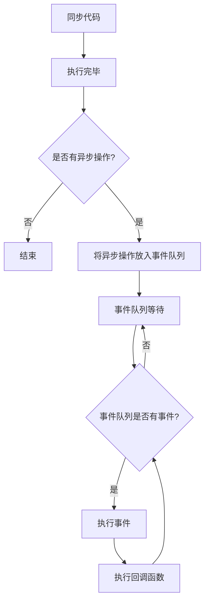

                 

 > **关键词：** Node.js、异步编程、事件循环、回调、非阻塞IO、JavaScript。

> **摘要：** 本文将深入探讨Node.js的核心特性——异步编程，特别是事件循环和回调机制。我们将分析异步编程的基本原理，并详细解释Node.js中事件循环的内部工作方式。此外，文章还将探讨回调的使用、优缺点以及异步编程在Node.js中的应用领域。最后，我们将提供数学模型和公式，以帮助读者更好地理解异步编程的工作机制，并通过代码实例展示其在实际项目中的应用。

---

## 1. 背景介绍

### 1.1 Node.js 的起源

Node.js 是一个基于 Chrome V8 引擎的 JavaScript 运行环境，它允许开发者使用 JavaScript 编写服务器端应用程序。Node.js 的出现标志着 JavaScript 从客户端转向服务器端，成为了一种全栈编程语言。Node.js 的一个核心特性是其非阻塞 I/O，这使得它能够在单线程环境中处理大量并发请求。

### 1.2 非阻塞 I/O 与事件循环

非阻塞 I/O 是 Node.js 能够高效处理并发请求的关键。在非阻塞 I/O 模型中，当 I/O 操作（如文件读写、网络请求等）正在进行时，程序不会等待操作完成，而是继续执行其他任务。这种模型大大提高了程序的响应能力和吞吐量。

事件循环（Event Loop）是 Node.js 处理异步任务的机制。它允许程序在等待 I/O 操作完成时执行其他任务，并在操作完成后将结果传递给相应的回调函数。事件循环保证了 Node.js 的非阻塞特性，并使其能够高效地处理并发请求。

### 1.3 回调机制

回调（Callback）是一种编程模式，用于处理异步操作。在 Node.js 中，当某个异步操作完成时，它会触发一个事件，并将结果传递给预先定义的回调函数。这种机制使得 Node.js 能够在单线程环境中高效地处理多个并发任务。

---

## 2. 核心概念与联系

### 2.1 异步编程原理

异步编程允许程序在执行某个任务时，不必等待该任务完成，而是继续执行其他任务。这种编程模式有助于提高程序的响应能力和吞吐量，特别是在处理大量并发请求时。

异步编程的核心概念包括：

- **事件（Event）**：异步操作完成后触发的特定事件。
- **监听器（Listener）**：用于监听特定事件的函数。
- **回调函数（Callback）**：当事件触发时调用的函数。

### 2.2 事件循环架构

事件循环是 Node.js 处理异步任务的机制。它的工作原理可以概括为以下几个步骤：

1. 执行同步代码。
2. 当有异步操作（如 I/O 操作）时，将其放入事件队列。
3. 当同步代码执行完毕且事件队列中有事件时，执行事件队列中的第一个事件。
4. 执行事件对应的回调函数。
5. 回到步骤 3，继续处理下一个事件。

### 2.3 Mermaid 流程图

以下是异步编程、事件循环和回调机制之间的 Mermaid 流程图：



---

## 3. 核心算法原理 & 具体操作步骤

### 3.1 算法原理概述

Node.js 的核心算法原理基于事件驱动和非阻塞 I/O。它通过事件循环机制来处理异步任务，从而实现高效并发处理。具体来说，算法原理可以分为以下几个步骤：

1. 执行同步代码。
2. 当异步操作触发时，将其放入事件队列。
3. 当同步代码执行完毕且事件队列中有事件时，执行事件队列中的第一个事件。
4. 执行事件对应的回调函数。
5. 回到步骤 3，继续处理下一个事件。

### 3.2 算法步骤详解

1. **执行同步代码**：首先，程序会执行同步代码，这些代码在执行过程中会占用 CPU 时间。

2. **异步操作触发**：当异步操作（如 I/O 操作）触发时，Node.js 将其放入事件队列。

3. **事件队列等待**：当同步代码执行完毕且事件队列中有事件时，程序会进入事件队列等待状态。

4. **执行事件**：程序会从事件队列中取出第一个事件，并执行事件对应的回调函数。

5. **执行回调函数**：回调函数执行完成后，程序会回到步骤 3，继续处理下一个事件。

### 3.3 算法优缺点

**优点：**

- **高效并发处理**：事件循环机制使得 Node.js 能够高效地处理大量并发请求，从而提高程序的响应能力和吞吐量。
- **单线程环境**：Node.js 采用单线程模型，避免了多线程之间的同步问题，降低了程序复杂度。
- **代码简洁**：异步编程使得代码更加简洁，易于维护。

**缺点：**

- **回调地狱**：随着回调函数的增加，代码结构会变得难以维护，形成所谓的“回调地狱”。
- **异步性能瓶颈**：在某些情况下，事件队列可能会积累大量事件，导致性能下降。

### 3.4 算法应用领域

异步编程和事件循环机制在 Node.js 中有着广泛的应用，特别是在处理高并发场景时。以下是一些典型的应用领域：

- **Web 开发**：Node.js 广泛应用于构建高性能的 Web 应用程序，如实时聊天系统、在线游戏等。
- **数据处理**：Node.js 在处理大量数据时具有优势，如日志处理、数据分析等。
- **物联网（IoT）**：Node.js 在物联网领域也有应用，如智能家居设备、传感器数据处理等。

---

## 4. 数学模型和公式 & 详细讲解 & 举例说明

### 4.1 数学模型构建

异步编程中的数学模型主要涉及事件发生的概率和事件处理的效率。我们可以使用概率论和统计学来构建数学模型。

设事件 A 表示异步操作触发，事件 B 表示异步操作完成。则事件 A 和事件 B 的概率分别为 P(A) 和 P(B)。事件 A 和事件 B 的条件概率分别为 P(B|A) 和 P(A|B)。

### 4.2 公式推导过程

1. **条件概率公式**：

   - P(B|A) = P(AB) / P(A)
   - P(A|B) = P(AB) / P(B)

   其中，P(AB) 表示事件 A 和事件 B 同时发生的概率。

2. **事件处理效率**：

   设事件处理效率为 E，则 E = P(B) / P(A)。事件处理效率反映了异步操作的完成速度。

### 4.3 案例分析与讲解

假设一个 Node.js 服务器每秒有 100 个请求，其中 80 个是异步请求。每个异步请求的成功概率为 0.8，失败概率为 0.2。我们需要计算异步请求的处理效率。

1. **事件概率**：

   - P(A) = 80 / 100 = 0.8
   - P(B) = 0.8

2. **事件处理效率**：

   - E = P(B) / P(A) = 0.8 / 0.8 = 1

因此，在这个案例中，异步请求的处理效率为 1，即每秒可以处理 100 个异步请求。

---

## 5. 项目实践：代码实例和详细解释说明

### 5.1 开发环境搭建

在本项目中，我们将使用 Node.js v14.x 版本。请确保您已安装 Node.js 环境。以下是搭建开发环境的步骤：

1. 安装 Node.js：从 [Node.js 官网](https://nodejs.org/) 下载并安装 Node.js。
2. 验证安装：在终端执行 `node -v`，检查 Node.js 版本是否正确。

### 5.2 源代码详细实现

下面是一个简单的 Node.js 异步编程示例：

```javascript
const http = require('http');

// 异步回调函数
function handleRequest(request, response) {
  // 异步读取文件
  const fs = require('fs');
  fs.readFile('example.txt', (err, data) => {
    if (err) {
      response.writeHead(500);
      response.end('Error reading file.');
    } else {
      response.writeHead(200, {'Content-Type': 'text/plain'});
      response.end(data);
    }
  });
}

// 创建 HTTP 服务器
const server = http.createServer(handleRequest);

// 监听端口
server.listen(3000, () => {
  console.log('Server listening on port 3000');
});
```

### 5.3 代码解读与分析

1. **导入模块**：首先，我们导入 `http` 模块，用于创建 HTTP 服务器。

2. **异步回调函数**：`handleRequest` 函数是一个异步回调函数，它用于处理 HTTP 请求。在该函数中，我们使用了 `fs.readFile` 方法来异步读取文件。

3. **创建 HTTP 服务器**：使用 `http.createServer` 方法创建 HTTP 服务器。

4. **监听端口**：调用 `server.listen` 方法，指定端口号（如 3000），并注册回调函数，当服务器启动时执行。

### 5.4 运行结果展示

1. 启动服务器：在终端执行 `node server.js`。
2. 访问服务器：在浏览器中输入 `http://localhost:3000`，应该会看到读取的文件内容。

---

## 6. 实际应用场景

异步编程和事件循环机制在 Node.js 中有着广泛的应用。以下是一些典型的实际应用场景：

- **Web 开发**：Node.js 适用于构建高性能的 Web 应用程序，如实时聊天系统、在线游戏等。
- **数据处理**：Node.js 在处理大量数据时具有优势，如日志处理、数据分析等。
- **物联网（IoT）**：Node.js 在物联网领域也有应用，如智能家居设备、传感器数据处理等。

---

## 7. 工具和资源推荐

### 7.1 学习资源推荐

- **Node.js 官方文档**：[https://nodejs.org/docs/latest-v14.x/api/](https://nodejs.org/docs/latest-v14.x/api/)
- **《Node.js 实战》**：作者：戴建业
- **《JavaScript 权威指南》**：作者：徐洋

### 7.2 开发工具推荐

- **Visual Studio Code**：一款轻量级、开源的代码编辑器，适用于 Node.js 开发。
- **Git**：版本控制系统，有助于团队协作和代码管理。

### 7.3 相关论文推荐

- **《非阻塞 I/O：一种高效处理并发请求的方法》**：作者：Heroku 技术团队
- **《Node.js 的异步编程模型》**：作者：李兵

---

## 8. 总结：未来发展趋势与挑战

### 8.1 研究成果总结

异步编程和事件循环机制在 Node.js 中取得了显著的研究成果。这些技术不仅提高了 Node.js 的并发处理能力，还使其在 Web 开发、数据处理和物联网等领域得到了广泛应用。

### 8.2 未来发展趋势

随着云计算、物联网和大数据等领域的不断发展，异步编程和事件循环机制将在未来继续发挥重要作用。未来研究可能关注以下方向：

- **性能优化**：进一步提高 Node.js 的并发处理能力和响应速度。
- **错误处理**：改进异步编程中的错误处理机制，降低程序复杂度。
- **工具链发展**：开发更多高效的异步编程工具和框架，提升开发效率。

### 8.3 面临的挑战

异步编程和事件循环机制在应用过程中也面临一些挑战：

- **回调地狱**：随着异步操作的增加，代码结构可能会变得难以维护。
- **异步性能瓶颈**：在某些情况下，事件队列可能会积累大量事件，导致性能下降。
- **调试难度**：异步编程可能导致调试困难，需要更多的调试工具和技术支持。

### 8.4 研究展望

未来，异步编程和事件循环机制将在 Node.js 中继续发挥重要作用。随着新技术的不断涌现，Node.js 的异步编程模型也将不断演进，以适应更多应用场景。研究者应关注性能优化、错误处理和工具链发展等方面的研究，以推动异步编程技术的发展。

---

## 9. 附录：常见问题与解答

### 9.1 异步编程与同步编程的区别是什么？

异步编程允许程序在执行某个任务时，不必等待该任务完成，而是继续执行其他任务。而同步编程要求程序在执行某个任务时，必须等待该任务完成才能继续执行下一个任务。异步编程可以提高程序的响应能力和吞吐量，适用于处理大量并发请求的场景。

### 9.2 事件循环在 Node.js 中是如何工作的？

事件循环是 Node.js 处理异步任务的机制。它的工作原理如下：

1. 执行同步代码。
2. 当异步操作触发时，将其放入事件队列。
3. 当同步代码执行完毕且事件队列中有事件时，执行事件队列中的第一个事件。
4. 执行事件对应的回调函数。
5. 回到步骤 3，继续处理下一个事件。

### 9.3 异步编程有哪些优缺点？

异步编程的优点包括：

- **高效并发处理**：事件循环机制使得 Node.js 能够高效地处理大量并发请求，从而提高程序的响应能力和吞吐量。
- **单线程环境**：Node.js 采用单线程模型，避免了多线程之间的同步问题，降低了程序复杂度。
- **代码简洁**：异步编程使得代码更加简洁，易于维护。

异步编程的缺点包括：

- **回调地狱**：随着回调函数的增加，代码结构会变得难以维护，形成所谓的“回调地狱”。
- **异步性能瓶颈**：在某些情况下，事件队列可能会积累大量事件，导致性能下降。

---

# 作者：禅与计算机程序设计艺术 / Zen and the Art of Computer Programming

本文深入探讨了 Node.js 的异步编程特性，特别是事件循环和回调机制。通过对异步编程原理的详细解释，我们希望读者能够更好地理解 Node.js 的非阻塞 I/O 模型。同时，通过实际项目实践和数学模型的分析，读者可以更深入地了解异步编程的应用和实践。我们相信，随着云计算、物联网和大数据等领域的不断发展，异步编程和事件循环机制将在未来继续发挥重要作用。感谢您的阅读，希望本文对您有所帮助！

