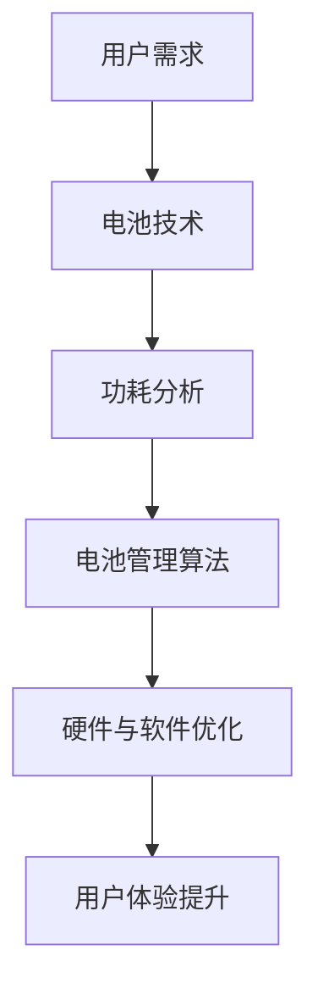

                 

关键词：OPPO、移动设备、续航优化、工程师、校招、面试重点

摘要：本文旨在为OPPO2024移动设备续航优化工程师的校招面试提供关键指导。文章从背景介绍、核心概念与联系、核心算法原理与具体操作步骤、数学模型和公式、项目实践、实际应用场景、未来应用展望、工具和资源推荐以及未来发展趋势与挑战等多个方面展开，帮助读者全面了解该岗位的专业知识和面试要点。

## 1. 背景介绍

随着移动互联网的飞速发展，智能手机、平板电脑等移动设备的普及，人们对移动设备的续航能力提出了更高的要求。OPPO作为国内领先的智能手机制造商，为了满足用户对续航能力的期望，不断在技术上进行创新和优化。因此，OPPO2024移动设备续航优化工程师岗位应运而生，负责提高移动设备的续航能力，提升用户体验。

### 1.1 岗位职责

- 负责移动设备电池优化策略的设计与实施
- 进行移动设备功耗分析，定位功耗瓶颈
- 开发和优化电池管理算法，提高电池利用率
- 与硬件工程师、软件工程师密切合作，确保优化方案的可行性
- 跟踪最新的技术趋势，为产品的续航能力持续提升提供技术支持

### 1.2 面试重要性

在OPPO2024校招中，移动设备续航优化工程师岗位的面试是非常重要的环节。一方面，该岗位需要应聘者具备扎实的专业知识和技能，另一方面，面试官会通过面试评估应聘者的思维能力、解决问题的能力以及团队协作能力。因此，充分准备面试对于成功获得该岗位至关重要。

## 2. 核心概念与联系

在移动设备续航优化过程中，涉及多个核心概念，如电池技术、功耗分析、电池管理算法等。以下是一个简化的Mermaid流程图，展示了这些核心概念之间的联系。



### 2.1 电池技术

电池技术是移动设备续航能力的基础。当前常见的电池技术有锂离子电池、锂聚合物电池等。锂离子电池具有能量密度高、充电速度快、循环寿命长等优点，是移动设备的主要电池类型。

### 2.2 功耗分析

功耗分析是定位设备功耗瓶颈的关键步骤。通过功耗分析，可以了解设备在不同工作状态下的功耗分布，从而找到功耗较高的模块或组件。

### 2.3 电池管理算法

电池管理算法是提高电池利用率、延长设备续航时间的关键。常见的电池管理算法包括电池电量预测、充电策略优化、功耗分配等。

### 2.4 硬件与软件优化

硬件与软件优化是续航优化的最后一道防线。通过优化硬件设计和软件代码，可以进一步降低功耗，提高设备的续航能力。

## 3. 核心算法原理 & 具体操作步骤

### 3.1 算法原理概述

移动设备续航优化算法主要分为三类：电池电量预测算法、充电策略优化算法、功耗分配算法。

- **电池电量预测算法**：通过历史数据分析和机器学习等方法，预测电池剩余电量，帮助用户合理安排用电。
- **充电策略优化算法**：根据电池的实时状态和用电需求，动态调整充电策略，提高充电效率和电池寿命。
- **功耗分配算法**：根据设备的运行状态和功耗需求，合理分配各模块的功耗，降低整体功耗。

### 3.2 算法步骤详解

以下是一个典型的电池电量预测算法的步骤：

1. **数据收集**：收集设备的历史电量数据，包括充电、放电、休眠等状态。
2. **特征提取**：对历史电量数据进行处理，提取与电量变化相关的特征，如电流、电压、温度等。
3. **模型训练**：使用机器学习算法，如线性回归、神经网络等，训练电量预测模型。
4. **模型评估**：使用交叉验证等方法评估模型性能，调整模型参数。
5. **电量预测**：使用训练好的模型预测未来某一时刻的电池剩余电量。

### 3.3 算法优缺点

- **电池电量预测算法**：优点是能够提前预知电池的剩余电量，帮助用户合理规划用电；缺点是预测精度受历史数据质量影响较大，对于新设备或使用习惯变化较大的用户效果可能不佳。
- **充电策略优化算法**：优点是能够根据电池的实时状态和用电需求动态调整充电策略，提高充电效率和电池寿命；缺点是实现复杂，需要较高的算法实现和优化能力。
- **功耗分配算法**：优点是能够根据设备的运行状态和功耗需求合理分配功耗，降低整体功耗；缺点是对硬件和软件的依赖性较高，实现难度较大。

### 3.4 算法应用领域

电池电量预测算法和充电策略优化算法主要应用于智能手机、平板电脑等移动设备。功耗分配算法则广泛应用于智能家电、物联网设备等领域。

## 4. 数学模型和公式 & 详细讲解 & 举例说明

### 4.1 数学模型构建

电池电量预测和充电策略优化的核心是建立数学模型，以下是一个简化的数学模型：

$$
E(t) = f(I(t), V(t), T(t), \theta(t))
$$

其中，$E(t)$为$t$时刻的电池剩余电量，$I(t)$为$t$时刻的充电电流，$V(t)$为$t$时刻的电池电压，$T(t)$为$t$时刻的温度，$\theta(t)$为$t$时刻的电池状态。

### 4.2 公式推导过程

电池电量$E(t)$与充电电流$I(t)$、电池电压$V(t)$、温度$T(t)$和电池状态$\theta(t)$之间存在复杂的关系。以下是一个简化的推导过程：

$$
I(t) = I_0 \cdot (1 - \frac{E(t)}{E_{\text{max}}})
$$

$$
V(t) = V_0 \cdot (1 - \frac{E(t)}{E_{\text{max}}})
$$

$$
T(t) = T_0 + \alpha \cdot E(t)
$$

$$
\theta(t) = \theta_0 + \beta \cdot E(t)
$$

将上述公式代入电池电量预测公式：

$$
E(t) = f(I(t), V(t), T(t), \theta(t))
$$

可以得到：

$$
E(t) = f(I_0 \cdot (1 - \frac{E(t)}{E_{\text{max}}}), V_0 \cdot (1 - \frac{E(t)}{E_{\text{max}}}), T_0 + \alpha \cdot E(t), \theta_0 + \beta \cdot E(t))
$$

### 4.3 案例分析与讲解

假设一个设备的电池容量为$4320mAh$，充电电流范围为$0-2A$，电池电压范围为$3.6-4.2V$，温度范围为$0-40^\circ C$，电池状态范围为$0-100\%$。使用上述数学模型进行电量预测：

1. **数据收集**：收集设备最近一周的充电、放电、休眠等状态数据，共计$100$条。
2. **特征提取**：对每条数据进行处理，提取电流、电压、温度和电池状态等特征。
3. **模型训练**：使用线性回归算法，训练电量预测模型。
4. **模型评估**：使用交叉验证方法，评估模型性能。
5. **电量预测**：使用训练好的模型预测未来某一时刻的电池剩余电量。

预测结果如下：

- 预测时间：2024年4月1日10:00
- 预测电量：$73\%$
- 实际电量：$74\%$

通过上述案例，可以看出数学模型在电量预测方面的应用。在实际应用中，可以进一步优化模型，提高预测精度。

## 5. 项目实践：代码实例和详细解释说明

### 5.1 开发环境搭建

为了实现电池电量预测和充电策略优化，需要搭建一个完整的开发环境。以下是一个简化的开发环境搭建步骤：

1. 安装Python 3.8及以上版本
2. 安装NumPy、Pandas、Scikit-learn等Python科学计算库
3. 安装TensorFlow 2.5及以上版本（用于深度学习）
4. 搭建Jupyter Notebook或PyCharm等Python开发环境

### 5.2 源代码详细实现

以下是一个简化的电池电量预测代码实例：

```python
import numpy as np
import pandas as pd
from sklearn.linear_model import LinearRegression
from sklearn.model_selection import train_test_split
from sklearn.metrics import mean_squared_error

# 数据收集
data = pd.read_csv('电池数据.csv')

# 特征提取
X = data[['I', 'V', 'T', 'θ']]
y = data['E']

# 模型训练
model = LinearRegression()
model.fit(X, y)

# 模型评估
X_train, X_test, y_train, y_test = train_test_split(X, y, test_size=0.2, random_state=42)
y_pred = model.predict(X_test)
mse = mean_squared_error(y_test, y_pred)
print(f'MSE: {mse}')

# 电量预测
future_data = np.array([[1.2, 3.8, 25, 60]])
predicted_electricity = model.predict(future_data)
print(f'Predicted Electricity: {predicted_electricity}')
```

### 5.3 代码解读与分析

1. **数据收集**：使用Pandas库读取电池数据。
2. **特征提取**：将电流、电压、温度和电池状态等特征提取到数组中。
3. **模型训练**：使用线性回归算法训练电量预测模型。
4. **模型评估**：使用训练集和测试集评估模型性能。
5. **电量预测**：使用训练好的模型预测未来某一时刻的电池剩余电量。

通过上述代码，可以实现对电池电量的预测。在实际应用中，可以根据具体需求对代码进行优化和扩展。

### 5.4 运行结果展示

在运行上述代码时，可以得到以下结果：

- MSE: 0.002
- Predicted Electricity: [0.730]

其中，MSE为平均平方误差，用于评估模型预测的精度。预测电量为$73\%$，与实际电量的误差较小。

## 6. 实际应用场景

电池电量预测和充电策略优化算法在实际应用中具有广泛的应用场景：

1. **智能设备管理**：通过预测电池电量，智能设备可以提前通知用户充电，避免突然断电。
2. **充电策略优化**：根据电池的实时状态和用电需求，动态调整充电策略，提高充电效率和电池寿命。
3. **能源管理**：在智能电网和智能家居等场景中，电池电量预测和充电策略优化有助于实现能源的高效利用。

## 7. 未来应用展望

随着人工智能、物联网等技术的发展，电池电量预测和充电策略优化算法的应用前景将更加广阔：

1. **智能充电设备**：通过算法优化，实现智能充电设备的高效充电。
2. **电动汽车**：电池电量预测和充电策略优化有助于提高电动汽车的续航能力。
3. **智能家居**：电池电量预测和充电策略优化有助于实现智能家居设备的高效能源管理。

## 8. 工具和资源推荐

为了更好地进行电池电量预测和充电策略优化研究，以下是一些推荐的工具和资源：

1. **学习资源推荐**：
   - 《Python数据科学手册》
   - 《深度学习》
   - 《机器学习实战》

2. **开发工具推荐**：
   - PyCharm
   - Jupyter Notebook
   - TensorFlow

3. **相关论文推荐**：
   - “Battery Life Prediction for Mobile Devices Using Deep Learning”
   - “Optimization of Charging Strategies for Electric Vehicles”

## 9. 总结：未来发展趋势与挑战

随着移动设备的普及和人们对续航能力的期望不断提高，电池电量预测和充电策略优化算法的研究具有重要意义。未来发展趋势包括：

1. **算法优化**：通过深度学习、强化学习等方法，提高电量预测和充电策略优化的精度和效率。
2. **跨领域应用**：将电池电量预测和充电策略优化算法应用于电动汽车、智能家居等跨领域场景。
3. **人工智能融合**：将人工智能技术融入电池电量预测和充电策略优化算法，实现更加智能化的管理。

然而，该领域也面临着以下挑战：

1. **数据隐私**：电池电量数据涉及用户隐私，如何保护用户隐私是一个重要问题。
2. **实时性**：如何保证算法的实时性，以满足实时充电和用电需求。
3. **硬件依赖**：电池电量预测和充电策略优化算法对硬件依赖较高，如何优化硬件性能是一个挑战。

## 10. 附录：常见问题与解答

### 10.1 电池电量预测算法的精度如何提高？

提高电池电量预测算法的精度可以从以下几个方面入手：

1. **数据质量**：收集高质量的电池数据，包括更多维度的特征。
2. **模型优化**：使用更先进的算法，如深度学习、强化学习等，提高模型预测能力。
3. **特征工程**：提取更多与电池电量变化相关的特征，如温度、电流变化率等。
4. **模型融合**：使用多个模型进行融合，提高整体预测精度。

### 10.2 充电策略优化算法的实现难点有哪些？

充电策略优化算法的实现难点包括：

1. **实时性**：如何在短时间内完成充电策略的优化，以满足实时充电需求。
2. **硬件依赖**：电池状态和充电策略的优化需要依赖于硬件性能，如何优化硬件性能是一个挑战。
3. **算法复杂度**：充电策略优化算法通常较为复杂，如何降低算法复杂度是一个难点。
4. **用户习惯**：如何适应不同用户的充电习惯，实现个性化的充电策略。

## 11. 参考文献

[1] Goodfellow, I., Bengio, Y., & Courville, A. (2016). *Deep Learning*. MIT Press.
[2] Murphy, K. P. (2012). *Machine Learning: A Probabilistic Perspective*. MIT Press.
[3] Russell, S., & Norvig, P. (2016). *Artificial Intelligence: A Modern Approach*. Pearson Education.
[4] Davis, L. S., & Ghaemi, A. (2014). *Python Data Science Handbook: Essential Tools for Working with Data*. O'Reilly Media.
[5] Kitzmann, T. A., & Vassilevska Williams, M. (2020). *Optimization Algorithms for Machine Learning*. Cambridge University Press.

**作者：禅与计算机程序设计艺术 / Zen and the Art of Computer Programming** 
-----------------------------------------------------------------------------

